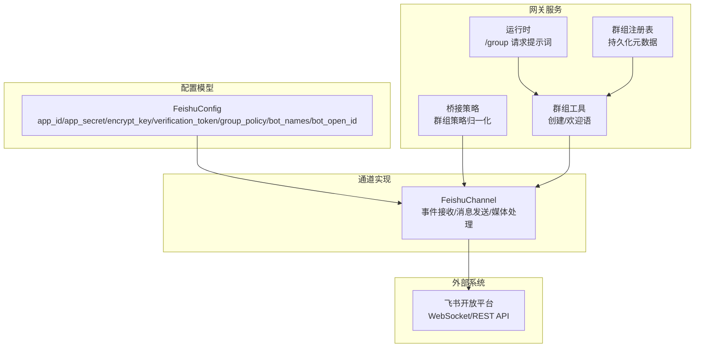
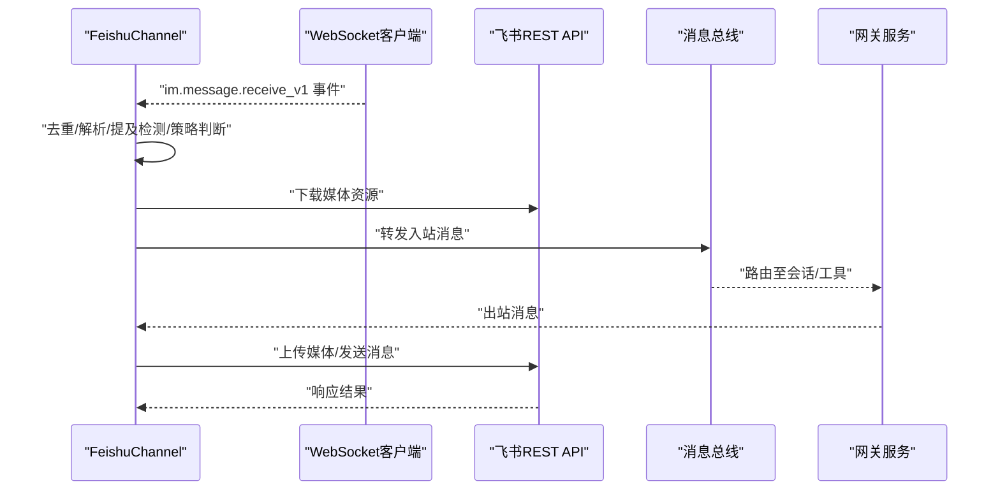
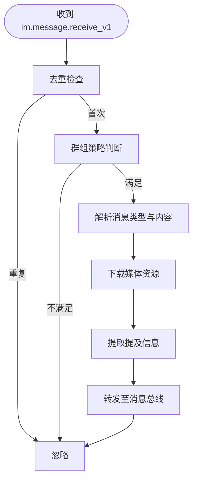
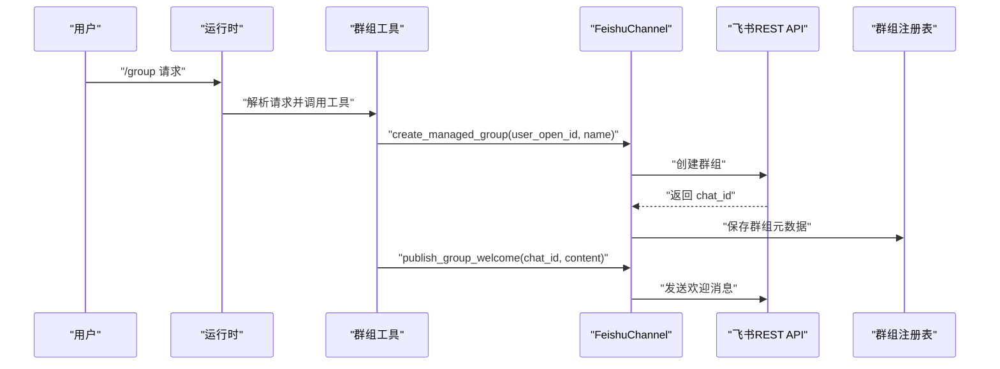
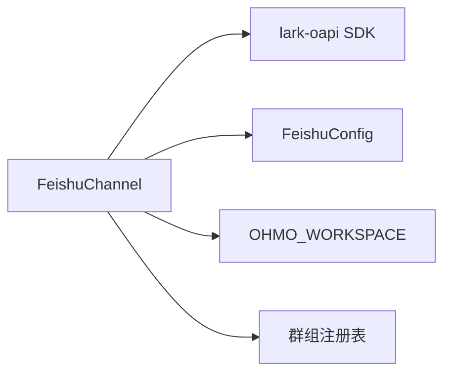

# 飞书渠道

<cite>
**本文引用的文件**
- [feishu.py](file://src/openharness/channels/impl/feishu.py)
- [schema.py](file://src/openharness/config/schema.py)
- [test_feishu_security.py](file://tests/test_channels/test_feishu_security.py)
- [cli.py](file://ohmo/cli.py)
- [bridge.py](file://ohmo/gateway/bridge.py)
- [runtime.py](file://ohmo/gateway/runtime.py)
- [group_tool.py](file://ohmo/gateway/group_tool.py)
- [group_registry.py](file://ohmo/group_registry.py)
- [README.md](file://README.md)
- [README.zh-CN.md](file://README.zh-CN.md)
</cite>

## 目录
1. [简介](#简介)
2. [项目结构](#项目结构)
3. [核心组件](#核心组件)
4. [架构总览](#架构总览)
5. [详细组件分析](#详细组件分析)
6. [依赖分析](#依赖分析)
7. [性能考量](#性能考量)
8. [故障排查指南](#故障排查指南)
9. [结论](#结论)
10. [附录](#附录)

## 简介
本文件面向使用 OpenHarness 的飞书（Lark）渠道集成，系统性说明以下内容：
- 飞书渠道的配置方法：应用创建、Bot 设置、事件订阅、企业内应用配置要点
- 飞书 API 的集成实现：消息发送、事件处理、用户信息获取、媒体下载与转发
- 飞书特有能力：多维表格、日历、审批流程等卡片/交互消息的解析与呈现
- 权限模型与安全考虑：消息去重、媒体路径安全、提及检测、群组策略
- 本地化部署与企业版使用注意事项：SDK 依赖、WebSocket 接收、私有化部署限制

## 项目结构
飞书渠道位于通道实现层，采用长连接（WebSocket）接收事件，通过 REST API 发送消息与管理群组。关键文件与职责如下：
- 渠道实现：负责事件接收、消息解析、格式判定、媒体下载、消息发送、群组管理
- 配置模型：承载飞书应用 ID/Secret、加密密钥、校验令牌、群组策略、Bot 名称等
- 网关侧：桥接策略、群组工具、注册表持久化
- 安全测试：覆盖媒体路径逃逸、提及检测、群组策略等

图示来源
- [feishu.py](file://src/openharness/channels/impl/feishu.py)
- [schema.py](file://src/openharness/config/schema.py)
- [bridge.py](file://ohmo/gateway/bridge.py)
- [runtime.py](file://ohmo/gateway/runtime.py)
- [group_tool.py](file://ohmo/gateway/group_tool.py)
- [group_registry.py](file://ohmo/group_registry.py)

章节来源
- [feishu.py](file://src/openharness/channels/impl/feishu.py)
- [schema.py](file://src/openharness/config/schema.py)
- [bridge.py](file://ohmo/gateway/bridge.py)
- [runtime.py](file://ohmo/gateway/runtime.py)
- [group_tool.py](file://ohmo/gateway/group_tool.py)
- [group_registry.py](file://ohmo/group_registry.py)

## 核心组件
- FeishuChannel：飞书通道适配器，封装 WebSocket 事件接收、REST 消息发送、媒体上传/下载、群组创建/重命名、提及解析与群组策略判断
- FeishuConfig：飞书通道配置模型，包含 app_id、app_secret、encrypt_key、verification_token、group_policy、bot_names、bot_open_id 等字段
- 网关侧桥接与群组工具：负责群组策略归一化、/group 请求提示词、群组创建与欢迎语发布、群组元数据持久化

章节来源
- [feishu.py](file://src/openharness/channels/impl/feishu.py)
- [schema.py](file://src/openharness/config/schema.py)
- [bridge.py](file://ohmo/gateway/bridge.py)
- [runtime.py](file://ohmo/gateway/runtime.py)
- [group_tool.py](file://ohmo/gateway/group_tool.py)
- [group_registry.py](file://ohmo/group_registry.py)

## 架构总览
飞书渠道采用“长连接 + REST”的混合架构：
- 事件接收：通过 lark-oapi WebSocket 客户端建立长连接，接收 im.message.receive_v1 事件
- 事件处理：在主线程异步调度，进行去重、提及检测、群组策略判断、媒体下载、内容提取与转发
- 消息发送：根据内容长度与复杂度自动选择 text/post/interactive 三种消息类型；支持图片/文件/音视频上传与回复到线程
- 群组管理：通过 REST API 创建/重命名群组，结合网关侧工具与注册表实现“ohmo 管理的群组”能力

图示来源
- [feishu.py](file://src/openharness/channels/impl/feishu.py)
- [bridge.py](file://ohmo/gateway/bridge.py)

章节来源
- [feishu.py](file://src/openharness/channels/impl/feishu.py)
- [bridge.py](file://ohmo/gateway/bridge.py)

## 详细组件分析

### 配置模型与初始化
- 关键配置项
  - app_id/app_secret：飞书开放平台应用凭证
  - encrypt_key/verification_token：事件解密与签名校验
  - group_policy：群组策略（managed_or_mention/mention/open）
  - bot_names/bot_open_id：Bot 提及名称与精确 open_id 检测
- 初始化流程
  - 校验 SDK 可用性与必要配置
  - 构建 lark-oapi 客户端
  - 注册 im.message.receive_v1 事件处理器
  - 启动 WebSocket 客户端线程并循环重连

章节来源
- [schema.py](file://src/openharness/config/schema.py)
- [feishu.py](file://src/openharness/channels/impl/feishu.py)

### 事件接收与处理
- 事件接收
  - 使用 lark-oapi WebSocket 客户端监听 im.message.receive_v1
  - 将同步回调调度到主事件循环异步处理
- 去重与策略
  - 基于 message_id 的有序去重缓存
  - 群组策略：仅当满足策略条件（@提及/ohmo 管理群）才处理
- 内容解析
  - 文本/富文本/图片/音频/文件/媒体/分享卡片/交互卡片等
  - 富文本 post 解析标题与图片键，图片键下载后转成本地路径
  - 交互卡片递归提取标题、元素与链接，生成纯文本摘要
- 提及检测
  - 支持 content_json mentions 与文本 @ 匹配
  - 支持 bot_open_id 精确匹配与 bot_names 归一化匹配
- 用户显示名解析
  - 通过 REST API 获取用户昵称/英文名/姓名，带缓存

图示来源
- [feishu.py](file://src/openharness/channels/impl/feishu.py)

章节来源
- [feishu.py](file://src/openharness/channels/impl/feishu.py)

### 消息发送与格式判定
- 自动格式判定
  - 简单纯文本（短文本）
  - 富文本 post（含链接）
  - 交互卡片（复杂/长文本/列表/代码块/表格）
- 媒体发送
  - 图片：上传后以 image 类型发送
  - 文件/音视频：按类型选择 media/file
  - 失败回退：发送失败文件名列表
- 回复线程
  - 私聊：不回复线程
  - 群聊/带 thread_id/root_id：以 reply_in_thread 方式回复

章节来源
- [feishu.py](file://src/openharness/channels/impl/feishu.py)

### 群组管理与欢迎语
- 管理群创建
  - 通过 REST API 创建私有群并设置机器人管理员
  - 返回 chat_id 并持久化元数据（名称、创建时间、工作目录、仓库等）
- 欢迎语发布
  - 网关服务向新建群发送欢迎消息，包含使用提示
- 群组策略
  - 网关侧桥接函数将策略别名归一化为 open/mention/managed/managed_or_mention
  - 运行时针对 /group 请求提供中文提示词

图示来源
- [group_tool.py](file://ohmo/gateway/group_tool.py)
- [feishu.py](file://src/openharness/channels/impl/feishu.py)
- [group_registry.py](file://ohmo/group_registry.py)
- [runtime.py](file://ohmo/gateway/runtime.py)
- [bridge.py](file://ohmo/gateway/bridge.py)

章节来源
- [group_tool.py](file://ohmo/gateway/group_tool.py)
- [feishu.py](file://src/openharness/channels/impl/feishu.py)
- [group_registry.py](file://ohmo/group_registry.py)
- [runtime.py](file://ohmo/gateway/runtime.py)
- [bridge.py](file://ohmo/gateway/bridge.py)

### 飞书特有能力与卡片解析
- 分享卡片与交互卡片
  - share_chat/share_user/share_calendar_event/system/merge_forward 等类型提取文本摘要
  - 交互卡片递归提取标题、元素与链接，支持多列布局、按钮、图片等
- 多维表格
  - 将 Markdown 表格转换为 Feishu 表格元素，受 API 限制每卡最多一张表
  - 当存在多个表格时拆分为多条消息发送
- 日历与审批
  - 通过 share_calendar_event 类型识别日历事件分享
  - 审批流程卡片通过交互卡片解析，提取标题与链接供用户点击

章节来源
- [feishu.py](file://src/openharness/channels/impl/feishu.py)

### 安全与权限
- 媒体路径安全
  - 下载媒体后写入通道专用媒体目录，严格校验相对路径，拒绝路径逃逸
- 提及检测与群组策略
  - 精确 open_id 与 bot 名称归一化匹配，避免误触发
  - 策略控制：managed_or_mention/mention/open，支持 ohmo 管理群豁免
- 事件去重与反应
  - 基于 message_id 的去重缓存，避免重复处理
  - 满足策略后添加反应（如 OK），提升交互反馈

章节来源
- [test_feishu_security.py](file://tests/test_channels/test_feishu_security.py)
- [feishu.py](file://src/openharness/channels/impl/feishu.py)

## 依赖分析
- 外部 SDK：lark-oapi（WebSocket 事件与 REST API）
- 环境变量：OHMO_WORKSPACE（用于群组注册表与媒体目录根路径）
- 通道配置：FeishuConfig 字段驱动行为（策略、Bot 名称、凭证）

图示来源
- [feishu.py](file://src/openharness/channels/impl/feishu.py)
- [group_registry.py](file://ohmo/group_registry.py)

章节来源
- [feishu.py](file://src/openharness/channels/impl/feishu.py)
- [group_registry.py](file://ohmo/group_registry.py)

## 性能考量
- 异步与线程
  - WebSocket 在独立线程运行，避免阻塞主事件循环
  - 发送/上传/下载均通过线程池执行，避免阻塞
- 缓存
  - 去重缓存与发送者显示名缓存，降低重复计算与 API 调用
- 消息分片
  - 多表交互卡片拆分为多条消息，避免单条消息过大导致渲染失败
- 重连机制
  - WebSocket 断线自动重连，指数退避友好

## 故障排查指南
- SDK 未安装或凭证缺失
  - 现象：启动时报错或无法初始化
  - 处理：安装 lark-oapi，检查 app_id/app_secret/encrypt_key/verification_token
- 群组策略导致无响应
  - 现象：群消息无回复
  - 处理：确认 group_policy 与是否被 @ 或属于 ohmo 管理群
- 媒体下载失败或路径异常
  - 现象：媒体文件名异常或路径逃逸
  - 处理：检查 OHMO_WORKSPACE 与媒体目录权限，确保下载后路径在媒体目录内
- 群组创建失败
  - 现象：创建群组报错（如缺少权限）
  - 处理：检查应用权限范围与 set_bot_manager 设置

章节来源
- [feishu.py](file://src/openharness/channels/impl/feishu.py)
- [test_feishu_security.py](file://tests/test_channels/test_feishu_security.py)

## 结论
OpenHarness 的飞书渠道通过长连接事件接收与 REST API 发送相结合，实现了对文本、富文本、交互卡片、多维表格、日历与审批等飞书特有能力的完整支持。配合严格的去重、媒体路径安全、提及检测与群组策略，既保证了可用性，也兼顾了安全性与可运维性。在本地化与企业版部署中，应重点关注 SDK 依赖、凭证配置与群组策略设置。

## 附录

### 配置步骤（应用创建与 Bot 设置）
- 在飞书开放平台创建应用，获取 App ID 与 App Secret
- 开启 Bot 能力并启用事件订阅 im.message.receive_v1
- 配置加密密钥与校验令牌，用于 WebSocket 事件解密与签名校验
- 在网关配置中设置 group_policy、bot_names、bot_open_id 等策略参数

章节来源
- [cli.py](file://ohmo/cli.py)
- [schema.py](file://src/openharness/config/schema.py)
- [README.md](file://README.md)
- [README.zh-CN.md](file://README.zh-CN.md)