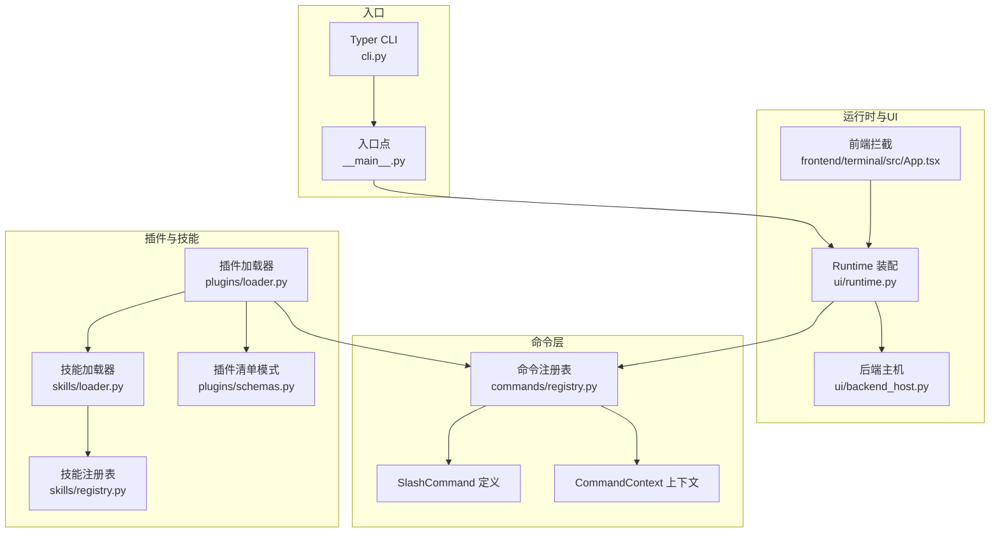
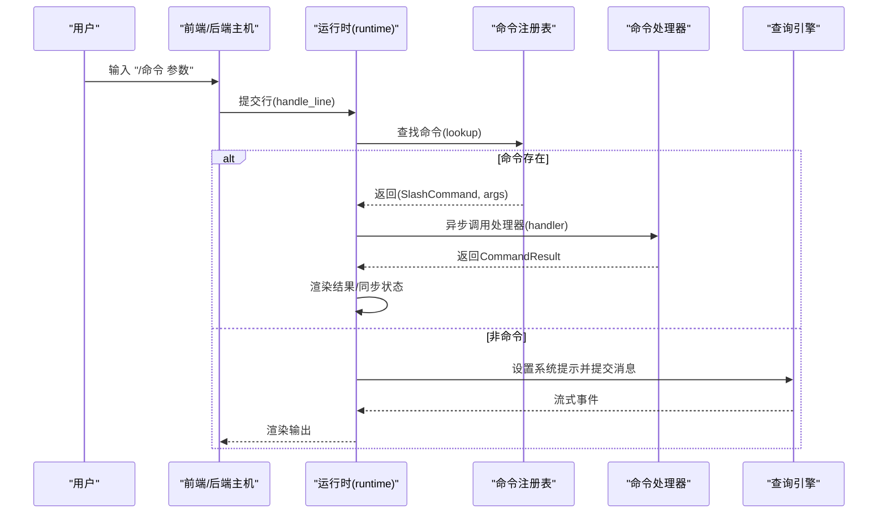
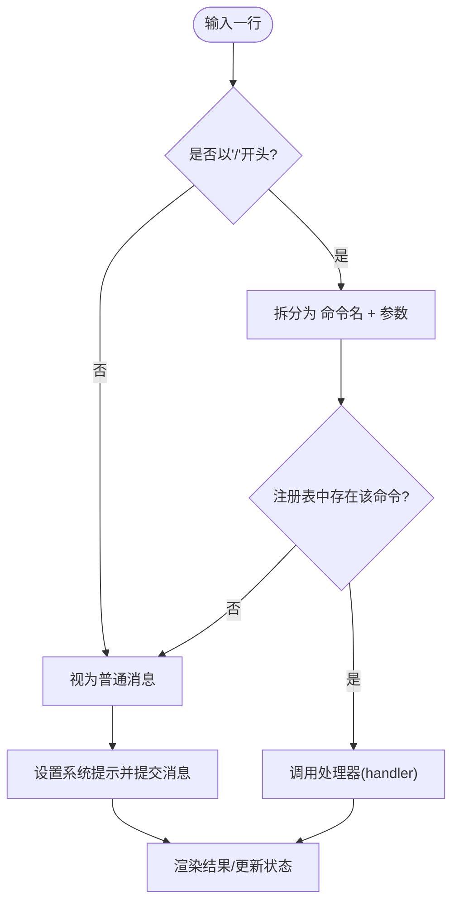
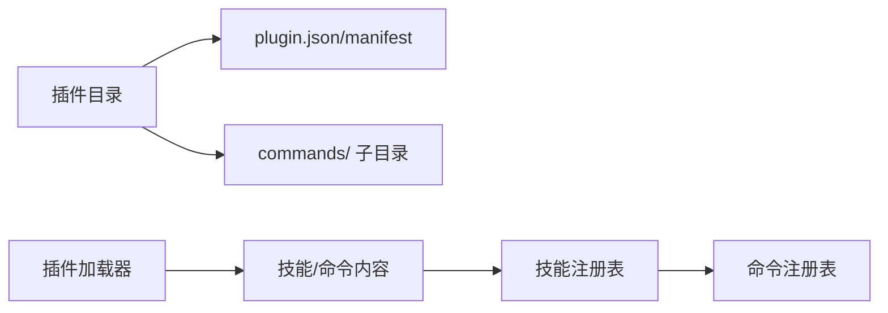
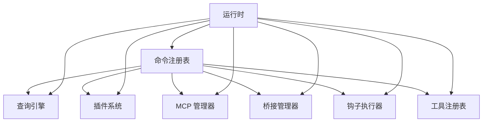

# 命令注册机制

<cite>
**本文引用的文件**
- [registry.py](file://src/openharness/commands/registry.py)
- [__init__.py](file://src/openharness/commands/__init__.py)
- [cli.py](file://src/openharness/cli.py)
- [__main__.py](file://src/openharness/__main__.py)
- [runtime.py](file://src/openharness/ui/runtime.py)
- [backend_host.py](file://src/openharness/ui/backend_host.py)
- [App.tsx](file://frontend/terminal/src/App.tsx)
- [loader.py](file://src/openharness/plugins/loader.py)
- [schemas.py](file://src/openharness/plugins/schemas.py)
- [loader.py（技能）](file://src/openharness/skills/loader.py)
- [registry.py（技能）](file://src/openharness/skills/registry.py)
- [checker.py](file://src/openharness/permissions/checker.py)
- [test_registry.py](file://tests/test_commands/test_registry.py)
- [test_command_flows.py](file://tests/test_commands/test_command_flows.py)
</cite>

## 目录
1. [简介](#简介)
2. [项目结构](#项目结构)
3. [核心组件](#核心组件)
4. [架构总览](#架构总览)
5. [详细组件分析](#详细组件分析)
6. [依赖分析](#依赖分析)
7. [性能考虑](#性能考虑)
8. [故障排查指南](#故障排查指南)
9. [结论](#结论)
10. [附录：自定义命令开发指南](#附录自定义命令开发指南)

## 简介
本文件系统性阐述 OpenHarness 的“斜杠命令”注册与执行机制，覆盖命令注册表的设计、命令发现与加载、执行流程、权限与错误恢复策略，并提供面向高级用户的扩展指南。读者将了解命令从注册到执行的全链路，以及如何通过插件目录结构扩展命令生态。

## 项目结构
围绕命令注册机制的关键模块如下：
- 命令注册与内置命令实现：src/openharness/commands/registry.py
- 命令模块导出：src/openharness/commands/__init__.py
- CLI 入口与 Typer 子命令：src/openharness/cli.py、src/openharness/__main__.py
- 运行时装配与命令分发：src/openharness/ui/runtime.py
- 后端主机与命令交互：src/openharness/ui/backend_host.py
- 终端前端拦截特殊命令：frontend/terminal/src/App.tsx
- 插件发现与命令注入：src/openharness/plugins/loader.py、src/openharness/plugins/schemas.py
- 技能加载与命令来源之一：src/openharness/skills/loader.py、src/openharness/skills/registry.py
- 权限控制与命令安全：src/openharness/permissions/checker.py
- 测试用例验证命令行为：tests/test_commands/test_registry.py、tests/test_commands/test_command_flows.py

图表来源
- [registry.py:94-124](file://src/openharness/commands/registry.py#L94-L124)
- [runtime.py:89-176](file://src/openharness/ui/runtime.py#L89-L176)
- [backend_host.py:189-222](file://src/openharness/ui/backend_host.py#L189-L222)
- [App.tsx:103-147](file://frontend/terminal/src/App.tsx#L103-L147)
- [loader.py:53-106](file://src/openharness/plugins/loader.py#L53-L106)
- [schemas.py:8-24](file://src/openharness/plugins/schemas.py#L8-L24)
- [loader.py（技能）:21-37](file://src/openharness/skills/loader.py#L21-L37)
- [registry.py（技能）:8-25](file://src/openharness/skills/registry.py#L8-L25)
- [cli.py:12-35](file://src/openharness/cli.py#L12-L35)
- [__main__.py:1-7](file://src/openharness/__main__.py#L1-L7)

章节来源
- [registry.py:94-124](file://src/openharness/commands/registry.py#L94-L124)
- [runtime.py:89-176](file://src/openharness/ui/runtime.py#L89-L176)
- [loader.py:53-106](file://src/openharness/plugins/loader.py#L53-L106)
- [schemas.py:8-24](file://src/openharness/plugins/schemas.py#L8-L24)
- [loader.py（技能）:21-37](file://src/openharness/skills/loader.py#L21-L37)
- [registry.py（技能）:8-25](file://src/openharness/skills/registry.py#L8-L25)
- [cli.py:12-35](file://src/openharness/cli.py#L12-L35)
- [__main__.py:1-7](file://src/openharness/__main__.py#L1-L7)

## 核心组件
- 命令注册表：维护命令名到处理器的映射，支持查找、帮助文本生成与顺序遍历。
- SlashCommand：命令定义，包含名称、描述与处理器。
- CommandContext：命令执行上下文，包含引擎、摘要信息、工作目录、工具注册表与应用状态。
- 默认命令注册工厂：构建内置命令集合，覆盖会话管理、配置、内存、插件、代理、桥接、统计、复制、导出等常用功能。
- 运行时装配：在会话启动时创建命令注册表实例，并将其注入运行时对象。
- 插件命令注入：插件目录下的 commands/ 子目录可自动被识别为技能/命令源，随插件加载一并注入命令注册表。

章节来源
- [registry.py:85-124](file://src/openharness/commands/registry.py#L85-L124)
- [registry.py:202-800](file://src/openharness/commands/registry.py#L202-L800)
- [runtime.py:165-176](file://src/openharness/ui/runtime.py#L165-L176)
- [loader.py:77-81](file://src/openharness/plugins/loader.py#L77-L81)

## 架构总览
命令从输入到执行的端到端流程如下：

图表来源
- [runtime.py:237-261](file://src/openharness/ui/runtime.py#L237-L261)
- [registry.py:104-112](file://src/openharness/commands/registry.py#L104-L112)

章节来源
- [runtime.py:237-261](file://src/openharness/ui/runtime.py#L237-L261)
- [backend_host.py:194-204](file://src/openharness/ui/backend_host.py#L194-L204)
- [App.tsx:103-147](file://frontend/terminal/src/App.tsx#L103-L147)

## 详细组件分析

### 命令注册表与查找
- 注册表以字典存储命令，键为命令名，值为 SlashCommand。
- 查找逻辑：仅当输入以“/”开头时尝试解析；分割首段作为命令名，剩余部分作为原始参数字符串。
- 帮助文本按命令名排序输出，便于 UI 展示与学习。
- 列表接口返回注册顺序（即插入顺序），用于调试或展示。

图表来源
- [registry.py:104-119](file://src/openharness/commands/registry.py#L104-L119)
- [runtime.py:237-261](file://src/openharness/ui/runtime.py#L237-L261)

章节来源
- [registry.py:94-124](file://src/openharness/commands/registry.py#L94-L124)
- [runtime.py:237-261](file://src/openharness/ui/runtime.py#L237-L261)

### 内置命令与命令上下文
- 内置命令由工厂函数统一创建，包含帮助、退出、清屏、状态、版本、上下文、摘要、压缩、用量、费用、统计、记忆、钩子、恢复、导出、分享、复制、会话、回退、标签、文件、代理、初始化、桥接、重载插件、技能、配置、登录、登出、反馈、入门、快速模式、努力级别、轮次、问题、PR评论、MCP、语音、隐私、速率限制、发布说明、升级等。
- CommandContext 提供引擎、摘要信息、工作目录、工具注册表、应用状态等，使命令可访问运行时能力。
- 处理器均为异步函数，返回 CommandResult，支持消息、退出标志、清屏、重放对话等语义。

章节来源
- [registry.py:202-800](file://src/openharness/commands/registry.py#L202-L800)
- [registry.py:69-82](file://src/openharness/commands/registry.py#L69-L82)

### 插件命令注入与发现
- 插件清单支持 commands 字段，同时插件目录下 commands/ 子目录会被扫描并作为命令/技能来源。
- 加载器在组装 LoadedPlugin 时，将“来自插件”的技能标记为插件命令，从而纳入命令注册表。
- 插件命令与内置命令共享同一注册表，实现统一调度。

图表来源
- [loader.py:77-81](file://src/openharness/plugins/loader.py#L77-L81)
- [loader.py:98-106](file://src/openharness/plugins/loader.py#L98-L106)
- [schemas.py](file://src/openharness/plugins/schemas.py#L20)

章节来源
- [loader.py:53-106](file://src/openharness/plugins/loader.py#L53-L106)
- [schemas.py:8-24](file://src/openharness/plugins/schemas.py#L8-L24)

### 运行时装配与命令分发
- 运行时构建阶段创建命令注册表实例并注入 RuntimeBundle。
- 每次输入行经 handle_line 分发：先查命令，命中则调用处理器；否则按普通消息交给引擎。
- 命令执行后根据结果决定是否退出、清屏或重放对话。

章节来源
- [runtime.py:89-176](file://src/openharness/ui/runtime.py#L89-L176)
- [runtime.py:237-261](file://src/openharness/ui/runtime.py#L237-L261)

### 前端与后端的命令拦截
- 前端对部分命令进行 UI 侧拦截，如权限模式切换、计划模式切换、会话选择等，通过发送带前缀的行与后端交互。
- 后端主机在收到请求时，可触发会话列表等交互，再由前端完成选择并回传最终命令。

章节来源
- [App.tsx:103-147](file://frontend/terminal/src/App.tsx#L103-L147)
- [backend_host.py:214-222](file://src/openharness/ui/backend_host.py#L214-L222)

### 权限与安全
- 命令执行前通常由权限检查器评估，依据权限模式（默认/计划/全量自动）与工具类型（只读/变更）决定是否允许或需要确认。
- 对于可能产生副作用的命令，建议结合权限模式与用户确认流程使用。

章节来源
- [checker.py:73-99](file://src/openharness/permissions/checker.py#L73-L99)

## 依赖分析
- 命令注册表不直接依赖外部框架，但其处理器广泛依赖运行时组件（引擎、插件、MCP、桥接、任务管理等）。
- 运行时装配负责将命令注册表与引擎、工具、钩子、状态等整合，形成统一的执行环境。
- 插件加载器与技能加载器共同为命令注册表提供“插件命令”，实现生态扩展。

图表来源
- [runtime.py:35-86](file://src/openharness/ui/runtime.py#L35-L86)
- [registry.py:202-800](file://src/openharness/commands/registry.py#L202-L800)

章节来源
- [runtime.py:35-86](file://src/openharness/ui/runtime.py#L35-L86)
- [registry.py:202-800](file://src/openharness/commands/registry.py#L202-L800)

## 性能考虑
- 命令查找为 O(1) 字典查找，开销极低。
- 命令处理器内部可能涉及磁盘 IO（会话快照、剪贴板、文件系统）、网络 IO（API 调用、MCP 服务器），应避免在处理器中进行阻塞操作。
- 对大文件/大量会话的操作建议异步化与分页展示，减少 UI 卡顿。
- 插件命令加载在会话启动时完成，后续命令执行无需重复扫描，有利于降低延迟。

## 故障排查指南
- 命令未找到：确认输入以“/”开头且拼写正确；检查命令是否被插件禁用或未安装。
- 执行异常：查看 CommandResult 中的消息字段；若涉及外部进程（如 git、剪贴板后备方案），留意系统环境差异。
- 会话恢复失败：确认会话 ID 正确且快照存在；检查权限与路径。
- 插件命令无效：确认插件已启用、commands/ 目录存在且包含有效 Markdown 技能；检查插件清单中的 commands 字段配置。
- 权限拒绝：根据权限模式调整策略或进行用户确认；必要时切换到全量自动模式进行测试。

章节来源
- [registry.py:126-156](file://src/openharness/commands/registry.py#L126-L156)
- [loader.py:77-81](file://src/openharness/plugins/loader.py#L77-L81)
- [checker.py:73-99](file://src/openharness/permissions/checker.py#L73-L99)

## 结论
OpenHarness 的命令注册机制以简洁的注册表为核心，配合运行时装配与插件生态，实现了内置命令与插件命令的统一调度。通过清晰的上下文传递与异步处理模型，既保证了易用性，也为高级扩展提供了稳定接口。建议在扩展命令时遵循参数解析、错误处理与权限控制的最佳实践，确保一致性与安全性。

## 附录：自定义命令开发指南

### 1. 命令定义与注册
- 定义处理器：实现异步函数，签名形如 handler(args: str, context: CommandContext) -> CommandResult。
- 构造 SlashCommand 并注册到 CommandRegistry。
- 在运行时装配阶段确保注册表可用（默认工厂已创建）。

章节来源
- [registry.py:85-103](file://src/openharness/commands/registry.py#L85-L103)
- [registry.py:202-212](file://src/openharness/commands/registry.py#L202-L212)
- [runtime.py](file://src/openharness/ui/runtime.py#L173)

### 2. 参数解析与校验
- 使用空格分割参数，注意转义与引号处理（可参考内置命令的参数解析模式）。
- 对数值、布尔、枚举等类型进行显式转换与范围校验。
- 对外部命令（如 git）捕获异常并返回可读错误信息。

章节来源
- [registry.py:243-250](file://src/openharness/commands/registry.py#L243-L250)
- [registry.py:178-199](file://src/openharness/commands/registry.py#L178-L199)
- [registry.py:126-140](file://src/openharness/commands/registry.py#L126-L140)

### 3. 执行逻辑与副作用
- 尽量将耗时操作异步化；对磁盘/网络操作添加超时与重试策略。
- 对可能破坏性操作（删除、覆盖）提供二次确认或安全开关。
- 记录必要的日志或反馈，便于用户与调试。

章节来源
- [registry.py:322-356](file://src/openharness/commands/registry.py#L322-L356)
- [registry.py:468-469](file://src/openharness/commands/registry.py#L468-L469)

### 4. 命令优先级与冲突处理
- 注册顺序即为遍历顺序；若需特定顺序，可在构建注册表时控制注册顺序。
- 命令名冲突时，后注册者覆盖前者；建议采用命名空间前缀避免冲突。
- 插件命令与内置命令共享同一注册表，插件启用状态可影响可见性。

章节来源
- [registry.py:121-123](file://src/openharness/commands/registry.py#L121-L123)
- [loader.py:72-72](file://src/openharness/plugins/loader.py#L72-L72)

### 5. 错误恢复机制
- 处理器返回 CommandResult，其中 message 可携带错误详情；should_exit 控制会话退出。
- 对外部依赖（剪贴板、git、MCP）提供降级方案与回退路径。
- 对会话/快照类操作，提供回滚或清理选项。

章节来源
- [registry.py:60-67](file://src/openharness/commands/registry.py#L60-L67)
- [registry.py:143-156](file://src/openharness/commands/registry.py#L143-L156)
- [registry.py:360-399](file://src/openharness/commands/registry.py#L360-L399)

### 6. 与插件生态集成
- 将命令放入插件目录的 commands/ 子目录，或在插件清单中声明 commands 字段。
- 插件加载时会自动收集命令并注入注册表，无需额外注册步骤。
- 建议为插件命令提供清晰的描述与使用示例，便于用户发现。

章节来源
- [loader.py:77-81](file://src/openharness/plugins/loader.py#L77-L81)
- [schemas.py](file://src/openharness/plugins/schemas.py#L20)

### 7. 最佳实践
- 命令职责单一，参数尽量可选且有默认值。
- 输出格式一致，提供简短帮助与使用示例。
- 与权限系统协同，避免未授权的高风险操作。
- 在测试中覆盖典型场景与边界条件，参考现有测试用例模式。

章节来源
- [test_registry.py:314-343](file://tests/test_commands/test_registry.py#L314-L343)
- [test_command_flows.py:131-152](file://tests/test_commands/test_command_flows.py#L131-L152)