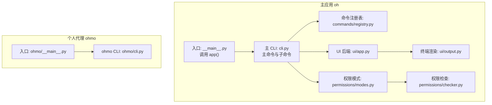
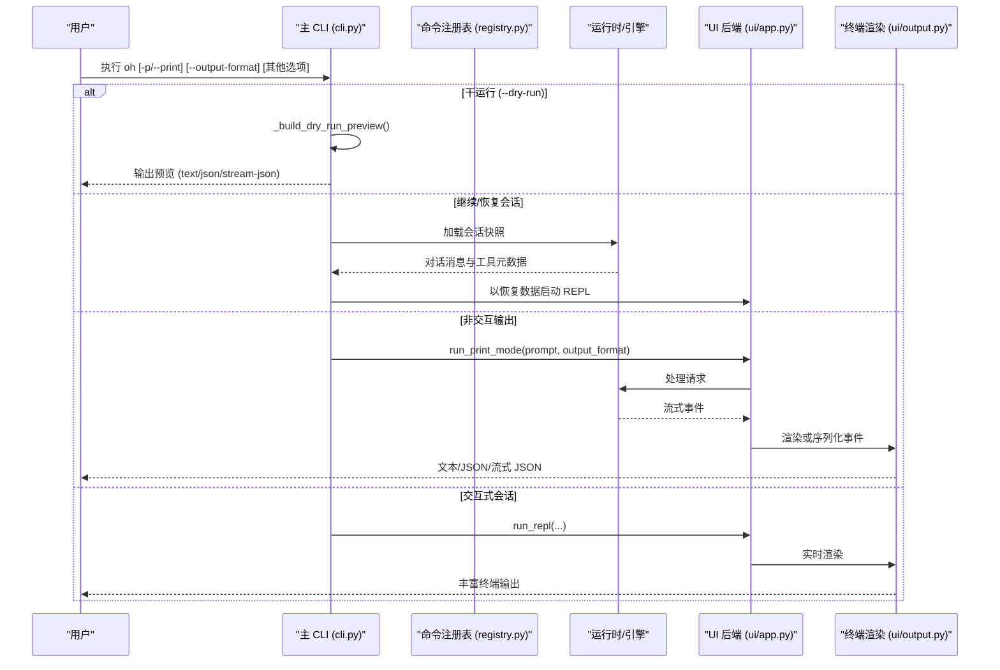
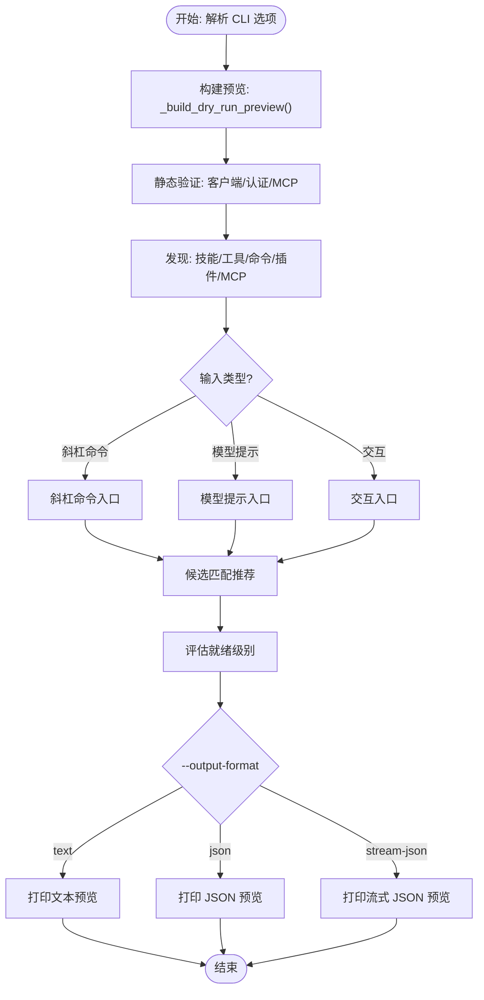
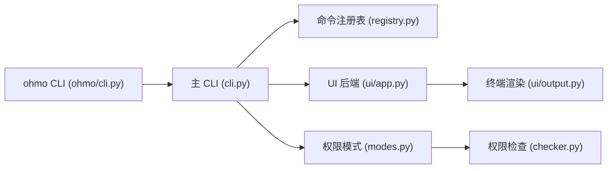

# 命令行界面

<cite>
**本文引用的文件**
- [cli.py](file://src/openharness/cli.py)
- [__main__.py](file://src/openharness/__main__.py)
- [registry.py](file://src/openharness/commands/registry.py)
- [modes.py](file://src/openharness/permissions/modes.py)
- [checker.py](file://src/openharness/permissions/checker.py)
- [app.py](file://src/openharness/ui/app.py)
- [output.py](file://src/openharness/ui/output.py)
- [cli.py](file://ohmo/cli.py)
- [__main__.py](file://ohmo/__main__.py)
- [test_harness_features.py](file://scripts/test_harness_features.py)
</cite>

## 目录
1. [简介](#简介)
2. [项目结构](#项目结构)
3. [核心组件](#核心组件)
4. [架构总览](#架构总览)
5. [详细组件分析](#详细组件分析)
6. [依赖关系分析](#依赖关系分析)
7. [性能考量](#性能考量)
8. [故障排除指南](#故障排除指南)
9. [结论](#结论)
10. [附录](#附录)

## 简介
本指南面向 OpenHarness 的命令行界面（CLI），覆盖主应用 oh 与个人代理应用 ohmo 的命令与选项，重点包括：
- 会话管理：继续对话、恢复会话、命名会话
- 模型与推理：模型别名、推理努力度、最大轮次
- 输出格式：文本、JSON、流式 JSON
- 权限控制：默认、计划模式、全量自动
- 系统与上下文：系统提示、附加系统提示、设置文件、基础地址、API 密钥、API 格式、主题
- 高级与调试：调试日志、MCP 配置、后端仅运行、任务工作器、危险跳过权限
- 子命令：mcp、plugin、auth、provider、cron、autopilot
- 使用场景：交互式会话、非交互模式、管道与脚本集成、干运行预览

## 项目结构
OpenHarness 提供两个 CLI 入口：
- 主应用：openharness（命令为 oh），入口在 [__main__.py](file://src/openharness/__main__.py)，主逻辑在 [cli.py](file://src/openharness/cli.py)
- 个人代理应用：ohmo，入口在 [__main__.py](file://ohmo/__main__.py)，主逻辑在 [cli.py](file://ohmo/cli.py)

**图表来源**
- [__main__.py](file://src/openharness/__main__.py)
- [cli.py](file://src/openharness/cli.py)
- [registry.py](file://src/openharness/commands/registry.py)
- [app.py](file://src/openharness/ui/app.py)
- [output.py](file://src/openharness/ui/output.py)
- [modes.py](file://src/openharness/permissions/modes.py)
- [checker.py](file://src/openharness/permissions/checker.py)
- [__main__.py](file://ohmo/__main__.py)
- [cli.py](file://ohmo/cli.py)

**章节来源**
- [__main__.py](file://src/openharness/__main__.py)
- [cli.py](file://src/openharness/cli.py)
- [__main__.py](file://ohmo/__main__.py)
- [cli.py](file://ohmo/cli.py)

## 核心组件
- 主命令与选项
  - 会话相关：--continue/-c、--resume/-r、--name/-n
  - 模型与推理：--model/-m、--effort、--verbose、--max-turns
  - 输出：--print/-p、--output-format、--dry-run
  - 权限：--permission-mode、--dangerously-skip-permissions、--allowed-tools、--disallowed-tools
  - 系统与上下文：--system-prompt/-s、--append-system-prompt、--settings、--base-url、--api-key/-k、--bare、--api-format、--theme
  - 高级：--debug/-d、--mcp-config、--cwd（隐藏）、--backend-only（隐藏）、--task-worker（隐藏）
- 子命令
  - mcp：列出 MCP 服务器
  - plugin：插件管理（ohmo）
  - auth：认证管理（ohmo）
  - provider：提供者配置（ohmo）
  - cron：定时任务（ohmo）
  - autopilot：仓库自动驾驶（ohmo）

**章节来源**
- [cli.py](file://src/openharness/cli.py)
- [cli.py](file://ohmo/cli.py)

## 架构总览
下图展示从命令行到运行时的核心流程，涵盖非交互输出、会话恢复、权限检查与 UI 渲染。

**图表来源**
- [cli.py](file://src/openharness/cli.py)
- [registry.py](file://src/openharness/commands/registry.py)
- [app.py](file://src/openharness/ui/app.py)
- [output.py](file://src/openharness/ui/output.py)

## 详细组件分析

### 1) 会话管理
- --continue/-c：继续当前目录的最新对话
- --resume/-r：按会话 ID 恢复；不带值时弹出最近会话选择
- --name/-n：为本次会话设置显示名称（用于后续检索与展示）

行为要点：
- 恢复会话时，将加载之前的消息与工具元数据，并在 REPL 中重放
- 与 --dry-run 不兼容（存在互斥限制）

**章节来源**
- [cli.py](file://src/openharness/cli.py)
- [registry.py](file://src/openharness/commands/registry.py)

### 2) 模型与推理
- --model/-m：模型别名（如 sonnet/opus）或完整模型 ID
- --effort：推理努力度（low/medium/high/xhigh/max）
- --verbose：覆盖配置中的详细模式
- --max-turns：最大智能体轮次（非交互模式默认强制，交互模式可选上限）

注意：
- effort/passes/turns 等影响推理深度与成本
- 与 --bare 结合可最小化开销（禁用钩子、插件、MCP、自动发现）

**章节来源**
- [cli.py](file://src/openharness/cli.py)

### 3) 输出格式
- --print/-p：非交互模式，打印响应并退出
- --output-format：text（默认）、json、stream-json
  - text：人类可读的富终端输出（含 Markdown、语法高亮、状态行）
  - json：一次性结果对象（含完整文本）
  - stream-json：事件流，逐条输出类型化的事件对象（适合管道与脚本解析）

实现细节：
- 文本模式通过终端渲染器输出
- JSON 模式在处理完成时输出单个结果对象
- 流式 JSON 模式逐事件输出，便于实时消费

**章节来源**
- [app.py](file://src/openharness/ui/app.py)
- [output.py](file://src/openharness/ui/output.py)

### 4) 权限控制
- --permission-mode：default（默认）、plan（计划模式）、full_auto（全量自动）
- --dangerously-skip-permissions：危险地跳过所有权限检查（仅沙箱环境）
- --allowed-tools、--disallowed-tools：显式允许/禁止工具列表

权限策略：
- plan 模式阻止变更性工具，直到退出计划模式
- default 模式对变更性工具需要确认
- full_auto 模式自动执行（谨慎使用）

**章节来源**
- [modes.py](file://src/openharness/permissions/modes.py)
- [checker.py](file://src/openharness/permissions/checker.py)
- [cli.py](file://src/openharness/cli.py)

### 5) 系统与上下文
- --system-prompt/-s：覆盖默认系统提示
- --append-system-prompt：向默认系统提示追加内容
- --settings：指定 JSON 设置文件或内联 JSON 字符串
- --base-url：兼容 Anthropic 的 API 基础地址
- --api-key/-k：覆盖配置与环境变量的 API 密钥
- --bare：最小化模式，跳过钩子、插件、MCP、自动发现
- --api-format：API 格式（anthropic、openai、copilot）
- --theme：TUI 主题（default、dark、minimal、cyberpunk、solarized 或自定义）

**章节来源**
- [cli.py](file://src/openharness/cli.py)

### 6) 高级与调试
- --debug/-d：启用调试日志
- --mcp-config：从 JSON 文件或字符串加载 MCP 服务器
- --backend-only：仅运行 React 终端 UI 的后端主机
- --task-worker：以 stdin 驱动的后台任务循环（用于后台代理任务）
- --cwd：会话工作目录（隐藏）

**章节来源**
- [cli.py](file://src/openharness/cli.py)

### 7) 子命令
- mcp list：列出已配置的 MCP 服务器
- plugin、auth、provider、cron、autopilot：ohmo 应用的子命令（ohmo/cli.py）

**章节来源**
- [cli.py](file://src/openharness/cli.py)
- [cli.py](file://ohmo/cli.py)

### 8) 干运行预览（--dry-run）
- 作用：在不执行模型或工具的前提下，预览解析后的配置、技能、命令与工具
- 支持的输出格式：text、json、stream-json
- 预览内容包括：就绪级别、执行入口点、已解析设置、验证状态、发现项、MCP 列表、可用工具/技能、推荐匹配、系统提示预览等

**图表来源**
- [cli.py](file://src/openharness/cli.py)

**章节来源**
- [cli.py](file://src/openharness/cli.py)

### 9) ohmo 应用的 CLI 特性
- --print/-p：单次提示并退出
- --model：会话模型覆盖
- --profile：提供者配置文件
- --workspace：ohmo 工作区路径
- --max-turns：最大轮次
- --cwd：工作目录
- --backend-only：后端仅运行（隐藏）
- --resume、--continue：会话恢复与继续

ohmo 还提供：
- init：初始化工作区，支持交互式提供者/通道配置
- config：配置提供者与网关通道
- doctor：检查工作区与提供者准备状态
- memory/soul/user：内存与个人文档管理
- gateway：运行/启动/停止/重启/查看状态

**章节来源**
- [cli.py](file://ohmo/cli.py)

## 依赖关系分析
- 主 CLI 依赖命令注册表进行斜杠命令解析与执行
- 运行时根据输出格式选择渲染路径（终端渲染器 vs JSON 序列化）
- 权限模块在运行时动态生效，影响工具执行与交互确认
- ohmo 在其 CLI 中复用主应用的部分能力（如会话恢复），并扩展个人代理专用功能

**图表来源**
- [cli.py](file://src/openharness/cli.py)
- [registry.py](file://src/openharness/commands/registry.py)
- [app.py](file://src/openharness/ui/app.py)
- [output.py](file://src/openharness/ui/output.py)
- [modes.py](file://src/openharness/permissions/modes.py)
- [checker.py](file://src/openharness/permissions/checker.py)
- [cli.py](file://ohmo/cli.py)

**章节来源**
- [cli.py](file://src/openharness/cli.py)
- [registry.py](file://src/openharness/commands/registry.py)
- [app.py](file://src/openharness/ui/app.py)
- [output.py](file://src/openharness/ui/output.py)
- [modes.py](file://src/openharness/permissions/modes.py)
- [checker.py](file://src/openharness/permissions/checker.py)
- [cli.py](file://ohmo/cli.py)

## 性能考量
- 使用 --bare 可减少开销（禁用钩子、插件、MCP、自动发现），适合轻量场景
- 合理设置 --max-turns，避免不必要的长对话轮次
- 在非交互模式下，优先使用 --output-format json 以减少终端渲染开销
- 流式 JSON 适合管道与实时处理，但会增加事件序列化与网络传输成本
- 权限模式在 default 下会触发确认，可能影响响应速度；必要时切换至 full_auto 或 plan

[本节为通用指导，无需特定文件来源]

## 故障排除指南
常见问题与排查步骤：
- 无提示直接运行
  - 现象：进入交互式会话
  - 建议：使用 -p/--print 提供明确提示，或直接交互
- -p/--print 缺少提示文本
  - 现象：报错要求提供提示值
  - 处理：确保 -p '你的提示'
- --dry-run 与 --continue/--resume 冲突
  - 现象：报错提示不支持组合
  - 处理：先执行干运行，再单独进行会话恢复
- 认证缺失或错误
  - 现象：运行模型或工具失败
  - 处理：配置提供者凭据或使用 --api-key 覆盖
- MCP 配置错误
  - 现象：干运行中报告 MCP 配置错误数量
  - 处理：修正 MCP 服务器配置（stdio 命令存在、PATH 可执行；HTTP/WS URL 正确）
- 权限拒绝
  - 现象：默认模式下变更性工具被阻断
  - 处理：切换至 full_auto 或 plan，或在 plan 模式下退出后再试
- 路径级规则拒绝
  - 现象：写入 /etc 等路径被拒绝
  - 处理：调整权限设置或路径规则

**章节来源**
- [cli.py](file://src/openharness/cli.py)
- [checker.py](file://src/openharness/permissions/checker.py)
- [test_harness_features.py](file://scripts/test_harness_features.py)

## 结论
OpenHarness CLI 提供了从交互式会话到非交互输出、从权限控制到系统上下文配置的完整能力。通过合理选择输出格式、权限模式与推理参数，可在不同场景（开发、CI、自动化脚本）中高效使用。干运行预览是理解当前配置与潜在风险的重要工具，建议在执行前先运行 --dry-run。

[本节为总结性内容，无需特定文件来源]

## 附录

### A. 常见使用场景与示例
- 交互式会话
  - oh
  - oh --model claude-3-5-sonnet-latest
- 非交互模式
  - oh -p '写一个函数'
  - oh -p '写一个函数' --output-format json
  - oh -p '写一个函数' --output-format stream-json
- 管道与脚本集成
  - oh -p '生成 10 行随机数' --output-format stream-json | jq -r '.text'
- 会话管理
  - oh --continue
  - oh --resume
  - oh --resume <会话ID>
- 权限控制
  - oh --permission-mode plan
  - oh --permission-mode full_auto
  - oh --allowed-tools git,echo
- 系统与上下文
  - oh --system-prompt '你是助手' --append-system-prompt '只用中文回答'
  - oh --api-format openai --base-url https://api.openai.com/v1
  - oh --theme dark
- 调试
  - oh --debug -p '测试'

[本节为使用示例说明，无需特定文件来源]