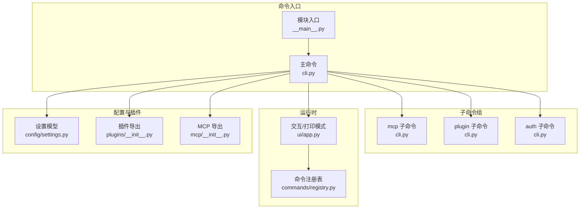
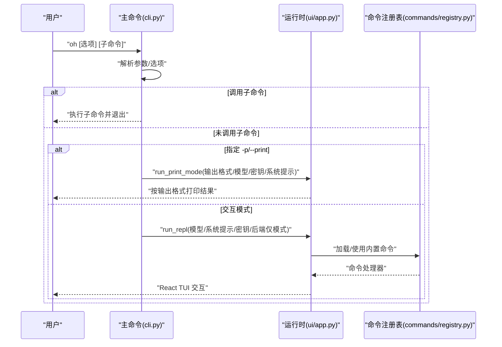
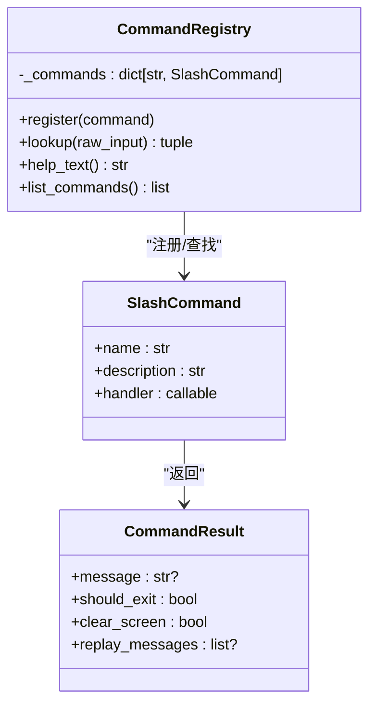
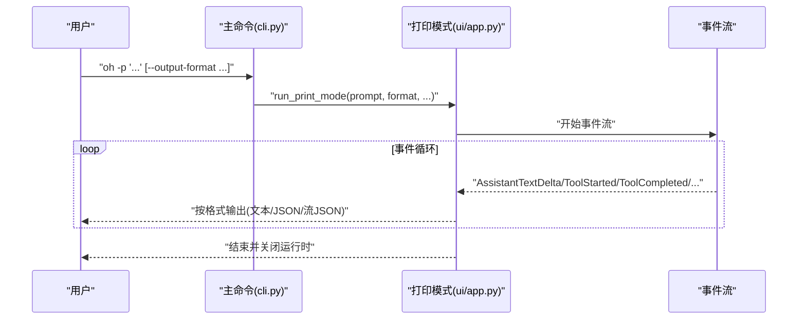
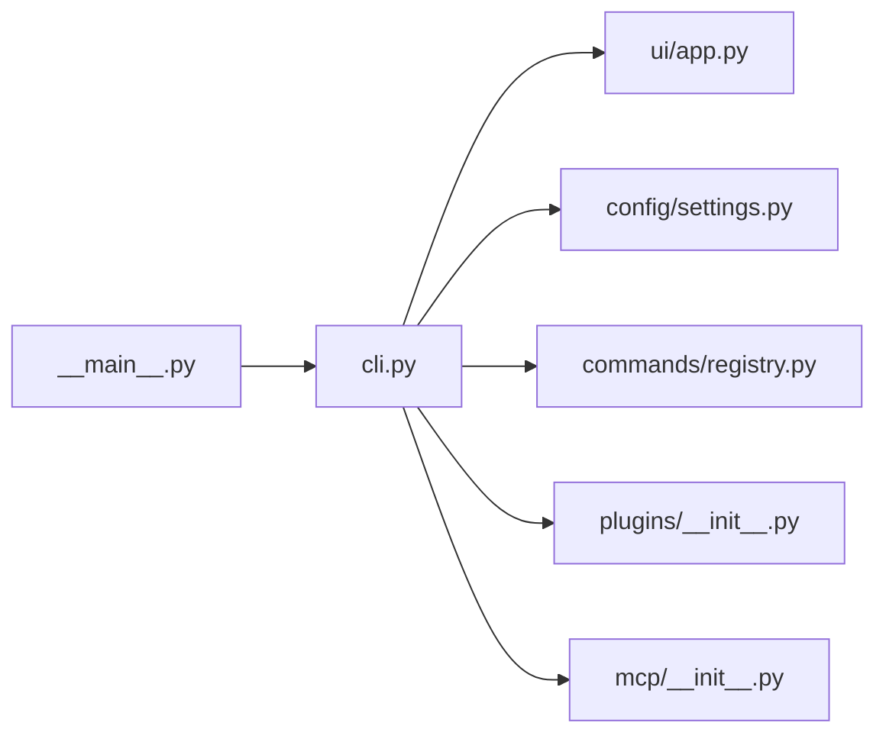

# 命令行界面

<cite>
**本文引用的文件**
- [cli.py](file://src/openharness/cli.py)
- [__main__.py](file://src/openharness/__main__.py)
- [app.py](file://src/openharness/ui/app.py)
- [registry.py](file://src/openharness/commands/registry.py)
- [settings.py](file://src/openharness/config/settings.py)
- [test_cli_flags.py](file://scripts/test_cli_flags.py)
- [plugins/__init__.py](file://src/openharness/plugins/__init__.py)
- [mcp/__init__.py](file://src/openharness/mcp/__init__.py)
</cite>

## 目录
1. [简介](#简介)
2. [项目结构](#项目结构)
3. [核心组件](#核心组件)
4. [架构总览](#架构总览)
5. [详细组件分析](#详细组件分析)
6. [依赖分析](#依赖分析)
7. [性能考虑](#性能考虑)
8. [故障排查指南](#故障排查指南)
9. [结论](#结论)
10. [附录](#附录)

## 简介
本文件系统性地梳理 OpenHarness CLI 的接口设计与使用方法，覆盖主命令与子命令、参数与选项、输出模式、权限控制、调试与高级选项，以及命令注册机制与扩展方式。目标是帮助用户从入门到进阶掌握 oh 命令的完整能力，并在实践中高效定位问题与优化体验。

## 项目结构
OpenHarness CLI 以 Typer 构建，入口位于模块级入口文件，主命令负责交互式会话与非交互打印模式；同时提供子命令组用于管理 MCP 服务器、插件与认证状态。命令注册机制支持内置“/”前缀的运行时命令，便于在交互界面中快速执行诊断、会话管理、工具链操作等任务。

**图示来源**
- [__main__.py:1-7](file://src/openharness/__main__.py#L1-L7)
- [cli.py:12-378](file://src/openharness/cli.py#L12-L378)
- [app.py:15-149](file://src/openharness/ui/app.py#L15-L149)
- [registry.py:94-1321](file://src/openharness/commands/registry.py#L94-L1321)
- [settings.py:49-161](file://src/openharness/config/settings.py#L49-L161)
- [plugins/__init__.py:23-54](file://src/openharness/plugins/__init__.py#L23-L54)
- [mcp/__init__.py:34-75](file://src/openharness/mcp/__init__.py#L34-L75)

**章节来源**
- [cli.py:12-378](file://src/openharness/cli.py#L12-L378)
- [__main__.py:1-7](file://src/openharness/__main__.py#L1-L7)

## 核心组件
- 主命令与回调：定义会话管理、模型与努力度、输出格式、权限、系统上下文、高级调试等选项；根据是否调用子命令决定进入 REPL 或打印模式。
- 子命令组：mcp、plugin、auth 提供配置、安装、卸载、状态查询等运维能力。
- 运行时命令注册表：内置大量“/”前缀命令，涵盖会话、统计、内存、任务、代理、权限、主题、输出风格、键位、Vim/语音模式、隐私与速率限制建议、版本与升级提示等。
- 设置模型：集中管理 API 密钥、模型、最大令牌数、系统提示、权限策略、插件启用列表、MCP 服务器配置、UI 行为与模式等。
- 打印模式与交互模式：打印模式支持文本、JSON、流式 JSON 输出；交互模式默认启动 React TUI。

**章节来源**
- [cli.py:179-378](file://src/openharness/cli.py#L179-L378)
- [registry.py:202-1321](file://src/openharness/commands/registry.py#L202-L1321)
- [settings.py:49-161](file://src/openharness/config/settings.py#L49-L161)
- [app.py:15-149](file://src/openharness/ui/app.py#L15-L149)

## 架构总览
下图展示了 oh 主命令如何解析参数并分派到交互或打印模式，以及运行时命令注册表如何在交互界面中被调用。

**图示来源**
- [cli.py:179-378](file://src/openharness/cli.py#L179-L378)
- [app.py:15-149](file://src/openharness/ui/app.py#L15-L149)
- [registry.py:94-1321](file://src/openharness/commands/registry.py#L94-L1321)

## 详细组件分析

### 主命令与参数选项
- 会话管理
  - -c/--continue：继续当前目录最近一次对话（由运行时逻辑决定“最近”的判定）。
  - -r/--resume：按会话 ID 恢复，或打开会话选择器（当未指定 ID 时）。
  - -n/--name：为本次会话设置显示名称。
- 模型与推理
  - -m/--model：模型别名或完整模型 ID。
  - --effort：推理努力度（low/medium/high），影响系统提示与行为策略。
  - --verbose：覆盖配置中的详细日志开关。
  - --max-turns：限制智能体对话轮次，常与 --print 配合。
- 输出格式
  - -p/--print：提交提示并打印响应后退出；需提供提示值。
  - --output-format：与 --print 配合，支持 text（默认）、json、stream-json。
- 权限控制
  - --permission-mode：权限模式（default、plan、full_auto）。
  - --dangerously-skip-permissions：跳过权限检查（沙箱环境慎用）。
  - --allowed-tools、--disallowed-tools：允许/禁止的工具白名单/黑名单。
- 系统与上下文
  - -s/--system-prompt：覆盖默认系统提示。
  - --append-system-prompt：向默认系统提示追加内容。
  - --settings：指向 JSON 设置文件或内联 JSON 字符串。
  - --base-url：兼容 Anthropic 的 API 基础地址。
  - -k/--api-key：覆盖配置与环境变量的 API 密钥。
  - --bare：极简模式，跳过钩子、插件、MCP 与自动发现。
- 高级调试
  - -d/--debug：启用调试日志。
  - --mcp-config：从 JSON 文件或字符串加载 MCP 服务器配置。
  - --cwd：工作目录（隐藏）。
  - --backend-only：仅运行结构化后端主机（用于 React 终端 UI）。

上述选项在主回调函数中统一解析，并根据是否调用子命令决定进入交互模式或打印模式。

**章节来源**
- [cli.py:179-378](file://src/openharness/cli.py#L179-L378)

### 子命令组：oh mcp
- oh mcp list：列出已配置的 MCP 服务器及其传输方式。
- oh mcp add <name> <config_json>：以 JSON 字符串形式添加服务器配置。
- oh mcp remove <name>：移除指定服务器配置。

这些命令直接读写设置中的 mcp_servers 字典并持久化保存。

**章节来源**
- [cli.py:39-92](file://src/openharness/cli.py#L39-L92)
- [settings.py:49-75](file://src/openharness/config/settings.py#L49-L75)

### 子命令组：oh plugin
- oh plugin list：列出已安装插件及其启用状态。
- oh plugin install <source>：从路径或 URL 安装插件。
- oh plugin uninstall <name>：卸载指定插件。

这些命令通过插件加载与安装器模块实现。

**章节来源**
- [cli.py:96-132](file://src/openharness/cli.py#L96-L132)
- [plugins/__init__.py:23-54](file://src/openharness/plugins/__init__.py#L23-L54)

### 子命令组：oh auth
- oh auth status：显示检测到的提供商与认证状态。
- oh auth login [--api-key <key>]：保存 API 密钥（可交互输入）。
- oh auth logout：清除存储的认证信息。

这些命令基于设置模型与提供商检测逻辑实现。

**章节来源**
- [cli.py:136-173](file://src/openharness/cli.py#L136-L173)
- [settings.py:76-96](file://src/openharness/config/settings.py#L76-L96)

### 运行时命令注册机制
- 注册表：维护“/命令”到处理器的映射，支持帮助、退出、清屏、状态、版本、上下文、摘要、压缩、用量与成本、统计、内存、钩子、恢复、会话、导出/分享、复制、重命名、回退、文件、初始化、桥接、登录/登出、反馈、新手引导、技能、配置、MCP/插件管理、权限/计划模式、快思模式、推理努力、推理轮次、模型/主题/输出风格、键位、Vim/语音、医生诊断、差异/分支/提交、问题/PR 评论、隐私与限流建议、发布说明、升级、代理与后台任务等。
- 查找与执行：输入以“/”开头即视为运行时命令，解析命令名与参数后调用对应异步处理器，返回消息、是否退出、是否清屏、是否重放消息等结果。
- 自定义扩展：通过 CommandRegistry.register 注册新的 SlashCommand 即可扩展命令集。

**图示来源**
- [registry.py:94-124](file://src/openharness/commands/registry.py#L94-L124)
- [registry.py:59-82](file://src/openharness/commands/registry.py#L59-L82)

**章节来源**
- [registry.py:94-1321](file://src/openharness/commands/registry.py#L94-L1321)

### 打印模式与交互模式
- 打印模式（-p/--print）
  - 支持 text、json、stream-json 三种输出格式。
  - 在非交互模式下构建运行时、启动运行时、逐事件渲染、收集文本、最终输出。
- 交互模式（默认）
  - 启动 React TUI，支持命令注册表中的“/”命令与工具链协作。

**图示来源**
- [cli.py:346-378](file://src/openharness/cli.py#L346-L378)
- [app.py:50-149](file://src/openharness/ui/app.py#L50-L149)

**章节来源**
- [app.py:15-149](file://src/openharness/ui/app.py#L15-L149)
- [cli.py:346-378](file://src/openharness/cli.py#L346-L378)

### 实际使用示例
以下示例基于测试脚本与命令行语义整理，不直接展示具体代码内容：

- 查看帮助并确认各选项分组存在
  - 示例：oh --help
  - 验证点：品牌词、会话、模型与努力、输出、权限、系统与上下文、高级、子命令组均出现
  - 参考：[test_cli_flags.py:40-68](file://scripts/test_cli_flags.py#L40-L68)

- 非交互打印模式（文本）
  - 示例：oh -p "说 exactly: hello openharness" --model <模型>
  - 预期：标准输出包含期望文本，返回码为 0
  - 参考：[test_cli_flags.py:71-79](file://scripts/test_cli_flags.py#L71-L79)

- 非交互打印模式（JSON）
  - 示例：oh -p "回复 exactly: test123" --output-format json --model <模型>
  - 预期：标准输出为有效 JSON，包含类型与文本片段
  - 参考：[test_cli_flags.py:82-98](file://scripts/test_cli_flags.py#L82-L98)

- 子命令：oh mcp list
  - 示例：oh mcp list
  - 预期：返回 MCP 服务器列表或提示无配置
  - 参考：[test_cli_flags.py:100-106](file://scripts/test_cli_flags.py#L100-L106)

- 子命令：oh plugin list
  - 示例：oh plugin list
  - 预期：返回已安装插件列表或提示无插件
  - 参考：[test_cli_flags.py:109-115](file://scripts/test_cli_flags.py#L109-L115)

- 子命令：oh auth status
  - 示例：oh auth status
  - 预期：输出包含提供商与状态信息
  - 参考：[test_cli_flags.py:118-124](file://scripts/test_cli_flags.py#L118-L124)

- 会话恢复
  - 示例：oh -r <会话ID> 或 oh -r（触发选择器）
  - 说明：若未指定 ID，将列出最近会话或加载最新快照
  - 参考：[registry.py:360-409](file://src/openharness/commands/registry.py#L360-L409)

- 权限模式切换
  - 示例：oh -p "/permissions set plan"（在打印模式下执行运行时命令）
  - 说明：/permissions 支持 show 与 set
  - 参考：[registry.py:926-947](file://src/openharness/commands/registry.py#L926-L947)

- 输出风格与主题
  - 示例：oh -p "/output-style list"、oh -p "/theme set monokai"
  - 说明：/output-style 与 /theme 支持 show/list/set
  - 参考：[registry.py:995-1019](file://src/openharness/commands/registry.py#L995-L1019)

- 快速入门与版本
  - 示例：oh -p "/onboarding"、oh -p "/version"
  - 参考：[registry.py:734-745](file://src/openharness/commands/registry.py#L734-L745)

**章节来源**
- [test_cli_flags.py:40-159](file://scripts/test_cli_flags.py#L40-L159)
- [registry.py:360-409](file://src/openharness/commands/registry.py#L360-L409)
- [registry.py:926-947](file://src/openharness/commands/registry.py#L926-L947)
- [registry.py:995-1019](file://src/openharness/commands/registry.py#L995-L1019)
- [registry.py:734-745](file://src/openharness/commands/registry.py#L734-L745)

## 依赖分析
- 入口与主命令：模块入口直接调用主命令应用实例；主命令根据是否调用子命令决定运行路径。
- 运行时与 UI：打印模式与交互模式分别委托给 ui/app.py 中的 run_print_mode 与 run_repl。
- 设置与环境：设置模型提供优先级合并（CLI > 环境变量 > 配置文件 > 默认），并在运行时生效。
- 插件与 MCP：子命令与运行时命令均可访问插件与 MCP 配置，二者通过设置模型统一管理。

**图示来源**
- [__main__.py:1-7](file://src/openharness/__main__.py#L1-L7)
- [cli.py:179-378](file://src/openharness/cli.py#L179-L378)
- [app.py:15-149](file://src/openharness/ui/app.py#L15-L149)
- [settings.py:99-161](file://src/openharness/config/settings.py#L99-L161)
- [registry.py:94-1321](file://src/openharness/commands/registry.py#L94-L1321)
- [plugins/__init__.py:23-54](file://src/openharness/plugins/__init__.py#L23-L54)
- [mcp/__init__.py:34-75](file://src/openharness/mcp/__init__.py#L34-L75)

**章节来源**
- [__main__.py:1-7](file://src/openharness/__main__.py#L1-L7)
- [cli.py:179-378](file://src/openharness/cli.py#L179-L378)
- [settings.py:99-161](file://src/openharness/config/settings.py#L99-L161)

## 性能考虑
- 降低请求压力
  - 降低推理努力度（--effort low）与减少推理轮次（--passes）。
  - 启用快思模式（/fast on）以缩短响应与减少工具调用。
  - 使用 /compact 压缩历史消息后再重试。
  - 将长耗时任务放入后台（/tasks）。
- 输出与网络
  - 打印模式避免 UI 渲染开销，适合批处理。
  - 仅在明确需要时进行网络调用（MCP/网络工具）。
- 存储与隐私
  - 本地存储于用户与项目配置目录，遵循隐私与存储设置（/privacy-settings）。

**章节来源**
- [registry.py:1124-1135](file://src/openharness/commands/registry.py#L1124-L1135)

## 故障排查指南
- 常见错误与提示
  - -p/--print 缺少提示值：会提示需要提供提示文本并退出。
  - 子命令 JSON 配置无效：oh mcp add 对 JSON 解析失败时会报错并退出。
  - MCP 服务器不存在：oh mcp remove 未找到名称时会报错并退出。
  - 认证缺失：设置模型在解析 API 密钥时可能抛出异常，需确保配置或环境变量正确。
- 调试与日志
  - 使用 -d/--debug 开启调试日志。
  - 使用 --verbose 覆盖配置中的详细日志开关。
  - 使用 --backend-only 仅运行后端主机以便隔离前端问题。
- 验证与回归
  - 使用测试脚本验证帮助输出、打印模式、JSON 输出、子命令可用性等。

**章节来源**
- [cli.py:66-70](file://src/openharness/cli.py#L66-L70)
- [cli.py:86-89](file://src/openharness/cli.py#L86-L89)
- [cli.py:348-350](file://src/openharness/cli.py#L348-L350)
- [settings.py:76-91](file://src/openharness/config/settings.py#L76-L91)
- [test_cli_flags.py:40-159](file://scripts/test_cli_flags.py#L40-L159)

## 结论
OpenHarness CLI 以清晰的参数分组与丰富的子命令覆盖了从会话管理、模型配置、输出格式、权限控制到调试与高级选项的全场景需求。配合内置的运行时命令注册机制，用户可在交互界面中高效完成诊断、会话治理与工具链操作。通过测试脚本与本文示例，用户可以快速上手并形成稳定的使用流程。

## 附录

### 参数与选项一览（按面板分组）
- 会话
  - -c/--continue：继续当前目录最近一次对话
  - -r/--resume：按会话 ID 恢复或打开选择器
  - -n/--name：设置会话显示名称
- 模型与努力
  - -m/--model：模型别名或完整模型 ID
  - --effort：推理努力度（low/medium/high）
  - --verbose：覆盖配置中的详细日志开关
  - --max-turns：限制智能体对话轮次
- 输出
  - -p/--print：提交提示并打印响应后退出
  - --output-format：输出格式（text/json/stream-json）
- 权限
  - --permission-mode：权限模式（default/plan/full_auto）
  - --dangerously-skip-permissions：跳过权限检查
  - --allowed-tools、--disallowed-tools：工具白名单/黑名单
- 系统与上下文
  - -s/--system-prompt：覆盖默认系统提示
  - --append-system-prompt：向默认系统提示追加内容
  - --settings：设置文件路径或内联 JSON
  - --base-url：兼容 Anthropic 的 API 基础地址
  - -k/--api-key：覆盖配置与环境变量的 API 密钥
  - --bare：极简模式（跳过钩子/插件/MCP/自动发现）
- 高级
  - -d/--debug：启用调试日志
  - --mcp-config：从 JSON 文件或字符串加载 MCP 服务器配置
  - --cwd：工作目录（隐藏）
  - --backend-only：仅运行后端主机（隐藏）

**章节来源**
- [cli.py:180-334](file://src/openharness/cli.py#L180-L334)