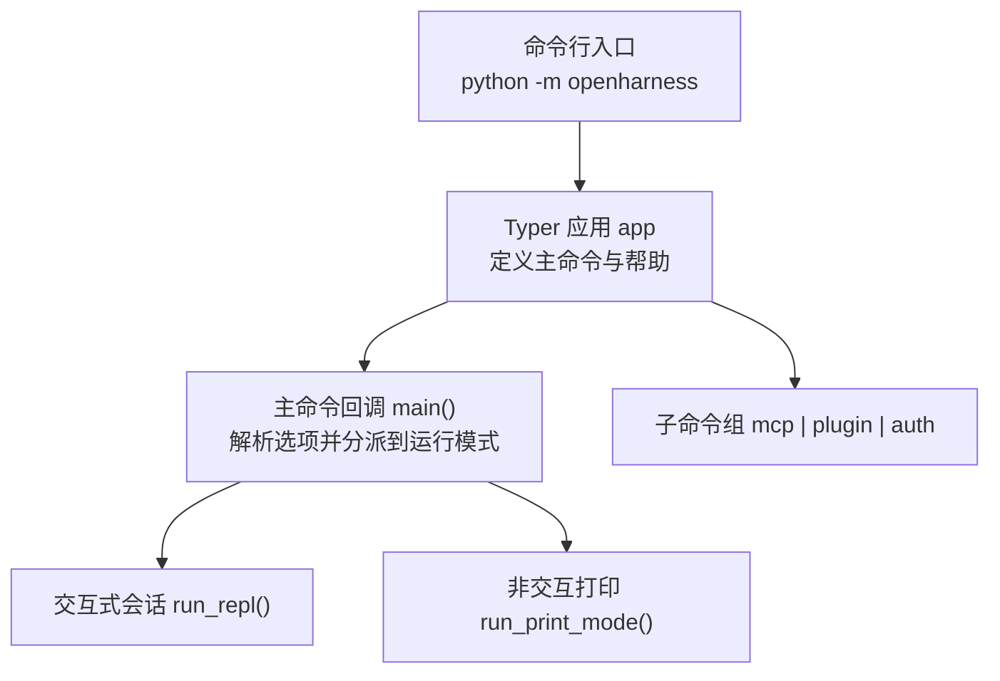
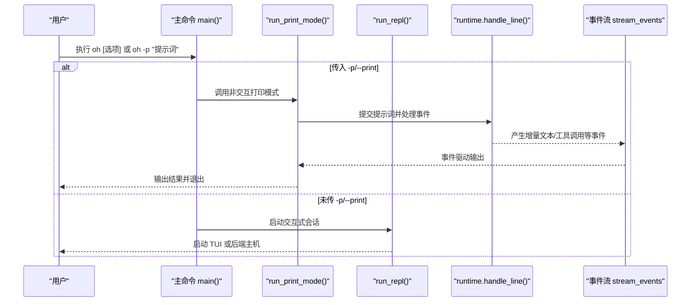
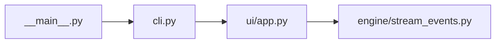

# 基础 CLI 使用

<cite>
**本文引用的文件**
- [cli.py](file://src/openharness/cli.py)
- [__main__.py](file://src/openharness/__main__.py)
- [app.py](file://src/openharness/ui/app.py)
- [stream_events.py](file://src/openharness/engine/stream_events.py)
- [README.md](file://README.md)
- [test_cli_flags.py](file://scripts/test_cli_flags.py)
- [test_cli.py](file://tests/test_commands/test_cli.py)
</cite>

## 目录
1. [简介](#简介)
2. [项目结构](#项目结构)
3. [核心组件](#核心组件)
4. [架构总览](#架构总览)
5. [详细组件分析](#详细组件分析)
6. [依赖分析](#依赖分析)
7. [性能考虑](#性能考虑)
8. [故障排查指南](#故障排查指南)
9. [结论](#结论)
10. [附录：从零开始的完整使用教程](#附录从零开始的完整使用教程)

## 简介
本篇文档面向新用户，系统讲解 OpenHarness 基础 CLI 的使用方法，重点围绕 oh 命令的基本语法、默认行为、交互式会话与非交互模式的区别，以及常用的基础命令示例与参数说明。你将学会如何在终端中启动交互式对话，或以非交互方式直接获取模型输出；同时掌握会话管理参数（-c/--continue、-r/--resume、-n/--name）与输出控制参数（-p/--print、--output-format）等关键选项。

## 项目结构
OpenHarness 的 CLI 入口位于 Python 包内，通过 Typer 定义命令与子命令，并在入口模块中导出应用对象。核心逻辑分为两部分：
- 主命令：解析全局选项，决定进入交互式会话还是非交互打印模式
- 子命令：mcp、plugin、auth 等管理类命令

图表来源
- [__main__.py:1-7](file://src/openharness/__main__.py#L1-L7)
- [cli.py:12-378](file://src/openharness/cli.py#L12-L378)

章节来源
- [__main__.py:1-7](file://src/openharness/__main__.py#L1-L7)
- [cli.py:12-378](file://src/openharness/cli.py#L12-L378)

## 核心组件
- 主命令与运行模式分派
  - 默认行为：启动交互式会话（React TUI）
  - 非交互模式：当传入 -p/--print 时，提交提示词并打印结果后退出
- 运行模式
  - 交互式会话：run_repl()，支持 TUI 与后端协议
  - 非交互打印：run_print_mode()，支持 text/json/stream-json 输出格式
- 选项分组
  - 会话管理：-c/--continue、-r/--resume、-n/--name
  - 模型与推理：-m/--model、--effort、--max-turns、--verbose
  - 输出控制：-p/--print、--output-format
  - 权限控制：--permission-mode、--dangerously-skip-permissions、--allowed-tools、--disallowed-tools
  - 上下文与系统：-s/--system-prompt、--append-system-prompt、--settings、--base-url、-k/--api-key、--bare
  - 高级调试：-d/--debug、--mcp-config、隐藏的 --cwd、--backend-only

章节来源
- [cli.py:179-378](file://src/openharness/cli.py#L179-L378)
- [app.py:15-149](file://src/openharness/ui/app.py#L15-L149)

## 架构总览
下图展示了 oh 命令从解析到执行的关键流程，包括交互式与非交互两种路径。

图表来源
- [cli.py:334-378](file://src/openharness/cli.py#L334-L378)
- [app.py:50-149](file://src/openharness/ui/app.py#L50-L149)
- [stream_events.py:12-50](file://src/openharness/engine/stream_events.py#L12-L50)

## 详细组件分析

### 1) 基本语法与默认行为
- 命令形式
  - oh [选项]：默认进入交互式会话（React TUI）
  - oh -p "你的问题"：非交互模式，打印响应后退出
- 默认行为
  - 不带 -p 时，oh 启动交互式会话；帮助信息明确指出“默认启动交互式会话，使用 -p/--print 进行非交互输出”
- 会话管理参数
  - -c/--continue：在当前目录继续最近一次对话
  - -r/--resume：按会话 ID 恢复，或打开会话选择器
  - -n/--name：为本次会话设置显示名称
- 输出控制参数
  - -p/--print：打印响应并退出；需提供提示词值
  - --output-format：text（默认）、json、stream-json

章节来源
- [cli.py:12-21](file://src/openharness/cli.py#L12-L21)
- [cli.py:179-378](file://src/openharness/cli.py#L179-L378)
- [README.md:112-124](file://README.md#L112-L124)

### 2) 交互式会话 vs 非交互模式
- 交互式会话（默认）
  - 启动 React TUI，支持命令输入、权限弹窗、会话恢复、键盘快捷键等
  - 适合持续对话与探索性任务
- 非交互模式（-p/--print）
  - 直接提交提示词，按 --output-format 输出
  - 适合脚本化、管道与自动化场景

章节来源
- [cli.py:344-378](file://src/openharness/cli.py#L344-L378)
- [app.py:15-48](file://src/openharness/ui/app.py#L15-L48)
- [app.py:50-149](file://src/openharness/ui/app.py#L50-L149)

### 3) 常用基础命令示例
以下示例基于 README 中的说明与测试脚本验证，展示 oh 的典型用法与预期行为：
- 启动交互式会话
  - oh
- 非交互模式：打印文本响应
  - oh -p "解释这个代码库"
- 非交互模式：JSON 输出（便于程序解析）
  - oh -p "列出 main.py 中的所有函数" --output-format json
- 非交互模式：实时流式 JSON 事件
  - oh -p "修复这个 bug" --output-format stream-json

章节来源
- [README.md:112-124](file://README.md#L112-L124)
- [test_cli_flags.py:71-98](file://scripts/test_cli_flags.py#L71-L98)

### 4) 参数详解与最佳实践
- 会话管理
  - -c/--continue：在当前工作目录继续最近一次对话，适合快速延续上下文
  - -r/--resume：支持按 ID 恢复或打开选择器，便于多项目或多任务切换
  - -n/--name：为会话命名，方便后续识别与恢复
- 输出控制
  - -p/--print：必须提供提示词值；否则会报错并退出
  - --output-format：text 用于人类可读输出；json 用于程序消费；stream-json 用于实时事件流
- 模型与推理
  - -m/--model：指定模型别名或完整模型 ID
  - --effort：推理努力级别（low/medium/high），影响模型思考深度
  - --max-turns：限制最大智能体轮次，配合 -p 使用更可控
  - --verbose：覆盖配置中的详细日志开关
- 权限控制
  - --permission-mode：default/plan/full_auto
  - --dangerously-skip-permissions：跳过权限检查（仅沙箱环境）
  - --allowed-tools/--disallowed-tools：细粒度允许/禁止工具
- 上下文与系统
  - -s/--system-prompt：覆盖默认系统提示词
  - --append-system-prompt：追加内容到默认系统提示词
  - --settings：加载外部 JSON 设置
  - --base-url：兼容 Anthropic 的 API 基地址
  - -k/--api-key：覆盖配置与环境变量中的密钥
  - --bare：极简模式，跳过钩子、插件、MCP 与自动发现
- 高级调试
  - -d/--debug：启用调试日志
  - --mcp-config：从 JSON 文件或字符串加载 MCP 服务器
  - --cwd：指定工作目录（隐藏）
  - --backend-only：仅运行 React 终端 UI 的后端主机（隐藏）

章节来源
- [cli.py:180-334](file://src/openharness/cli.py#L180-L334)
- [README.md:265-278](file://README.md#L265-L278)

### 5) 事件与输出格式（技术细节）
- 事件类型
  - AssistantTextDelta：模型增量文本
  - AssistantTurnComplete：整轮完成
  - ToolExecutionStarted/ToolExecutionCompleted：工具调用开始/结束
- 输出格式
  - text：标准输出打印文本，stderr 打印系统消息
  - json：一次性输出包含 type/result/text 的 JSON 对象
  - stream-json：逐事件输出 JSON 对象，事件类型包括 system、assistant_delta、assistant_complete、tool_started、tool_completed

章节来源
- [stream_events.py:12-50](file://src/openharness/engine/stream_events.py#L12-L50)
- [app.py:94-146](file://src/openharness/ui/app.py#L94-L146)

## 依赖分析
- 入口与应用
  - __main__.py 导出 Typer 应用对象，作为命令行入口
  - cli.py 定义主命令与子命令组，负责参数解析与运行模式分派
- 运行时与事件
  - ui/app.py 提供 run_repl 与 run_print_mode，分别对接 TUI 与非交互输出
  - engine/stream_events.py 定义事件数据结构，驱动非交互模式的事件渲染

图表来源
- [__main__.py:1-7](file://src/openharness/__main__.py#L1-L7)
- [cli.py:12-378](file://src/openharness/cli.py#L12-L378)
- [app.py:1-149](file://src/openharness/ui/app.py#L1-L149)
- [stream_events.py:1-50](file://src/openharness/engine/stream_events.py#L1-L50)

章节来源
- [__main__.py:1-7](file://src/openharness/__main__.py#L1-L7)
- [cli.py:12-378](file://src/openharness/cli.py#L12-L378)
- [app.py:1-149](file://src/openharness/ui/app.py#L1-L149)
- [stream_events.py:1-50](file://src/openharness/engine/stream_events.py#L1-L50)

## 性能考虑
- 非交互模式更适合批处理与流水线，避免 TUI 渲染开销
- 合理设置 --max-turns 可限制长对话的资源消耗
- 在 CI 环境中建议使用 --output-format json 或 stream-json，便于解析与缓存
- 使用 --bare 可减少初始化时间，但会禁用插件与 MCP 等扩展能力

## 故障排查指南
- -p/--print 缺少提示词
  - 现象：报错并退出
  - 处理：确保 -p 后跟随提示词字符串
- 输出格式不匹配
  - 现象：JSON 解析失败或缺少期望字段
  - 处理：确认 --output-format 与实际输出一致；stream-json 需逐行解析事件对象
- 会话恢复失败
  - 现象：/resume 无法找到会话或列表为空
  - 处理：确认工作目录下存在会话快照；必要时使用 /session ls 查看可用会话
- 权限拒绝导致工具不可用
  - 现象：工具执行被拒绝
  - 处理：调整 --permission-mode 或 --allowed-tools；在交互式会话中可通过 /permissions 与 /plan 切换模式

章节来源
- [cli.py:346-351](file://src/openharness/cli.py#L346-L351)
- [test_cli_flags.py:71-98](file://scripts/test_cli_flags.py#L71-L98)

## 结论
oh 命令提供了简洁而强大的 CLI 接口：默认交互式体验适合探索与协作，-p/--print 则满足脚本化与自动化需求。通过合理使用会话管理与输出控制参数，你可以高效地在不同场景间切换，并获得稳定、可观测的输出。建议新用户先从 README 的快速开始入手，再逐步尝试不同的输出格式与权限模式。

## 附录：从零开始的完整使用教程
- 准备工作
  - 安装并激活虚拟环境，配置 LLM API 密钥与模型
- 启动交互式会话
  - oh
  - 在 TUI 中输入提示词，使用 /resume 恢复历史会话，/permissions 切换权限模式
- 非交互模式入门
  - oh -p "解释这个代码库"
  - oh -p "列出 main.py 中的所有函数" --output-format json
  - oh -p "修复这个 bug" --output-format stream-json
- 会话管理
  - oh -c：在当前目录继续最近一次对话
  - oh -r：打开会话选择器或按 ID 恢复
  - oh -n "我的项目"：为会话命名
- 输出格式对比
  - text：人类可读，适合直接查看
  - json：一次性结果，便于程序解析
  - stream-json：事件流，适合实时监控与调试
- 常见问题
  - -p 忘记加提示词：会报错并退出，请补全提示词
  - 输出格式错误：检查 --output-format 与解析逻辑
  - 权限不足：调整 --permission-mode 或 --allowed-tools

章节来源
- [README.md:82-124](file://README.md#L82-L124)
- [test_cli_flags.py:71-125](file://scripts/test_cli_flags.py#L71-L125)
- [cli.py:179-378](file://src/openharness/cli.py#L179-L378)