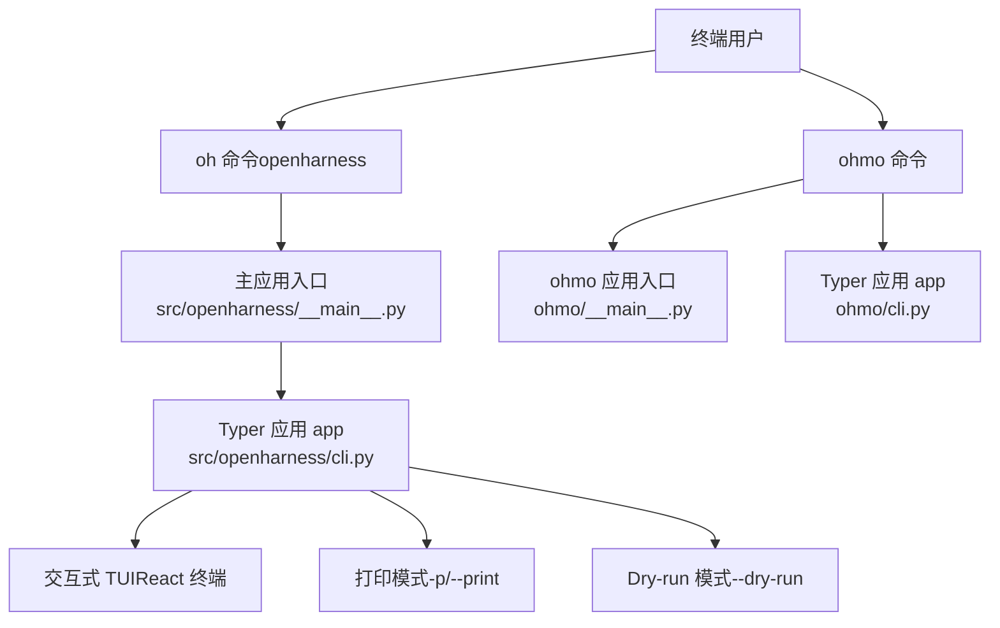
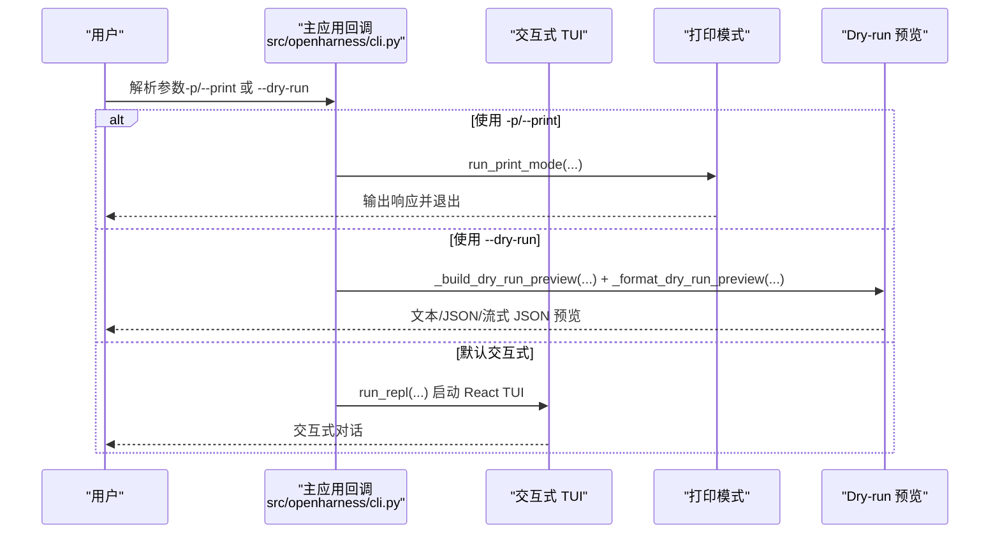
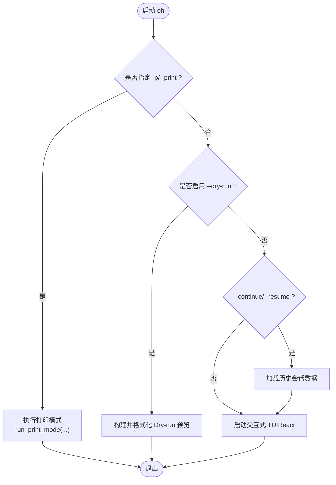
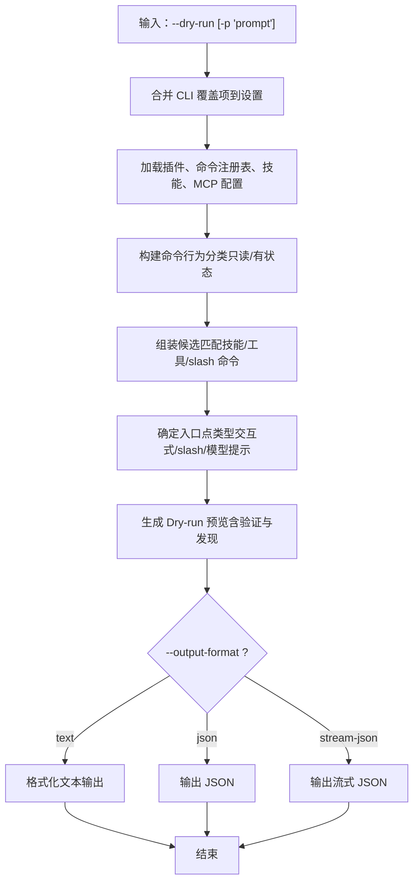
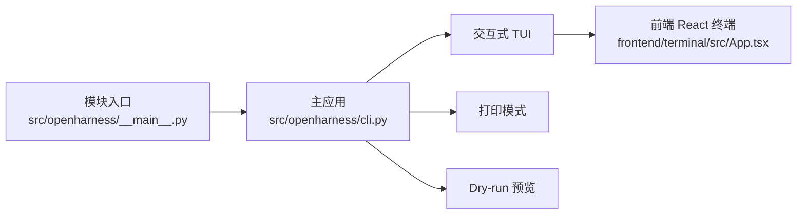

# 基础命令

<cite>
**本文引用的文件**
- [src/openharness/cli.py](file://src/openharness/cli.py)
- [src/openharness/__main__.py](file://src/openharness/__main__.py)
- [ohmo/cli.py](file://ohmo/cli.py)
- [ohmo/__main__.py](file://ohmo/__main__.py)
- [frontend/terminal/src/App.tsx](file://frontend/terminal/src/App.tsx)
- [scripts/install.ps1](file://scripts/install.ps1)
</cite>

## 目录
1. [简介](#简介)
2. [项目结构](#项目结构)
3. [核心组件](#核心组件)
4. [架构总览](#架构总览)
5. [详细组件分析](#详细组件分析)
6. [依赖分析](#依赖分析)
7. [性能考虑](#性能考虑)
8. [故障排查指南](#故障排查指南)
9. [结论](#结论)
10. [附录](#附录)

## 简介
本指南聚焦 OpenHarness 的基础命令与交互体验，围绕主命令 oh（即 openharness）展开，系统讲解以下内容：
- oh 命令的基本用法与默认行为
- 如何进入交互式会话（React TUI）
- 如何使用 -p/--print 进行非交互模式输出
- 如何通过 --dry-run 预览执行结果与运行准备状态
- 各类常用启动选项与典型场景组合
- 默认行为与常见变体，帮助快速上手

## 项目结构
OpenHarness 提供两个入口命令：
- oh（openharness）：主命令，启动交互式会话或执行单次提示
- ohmo：个人代理应用入口，基于 OpenHarness 构建

图表来源
- [src/openharness/__main__.py:1-7](file://src/openharness/__main__.py#L1-L7)
- [ohmo/__main__.py:1-9](file://ohmo/__main__.py#L1-L9)
- [src/openharness/cli.py:751-760](file://src/openharness/cli.py#L751-L760)
- [ohmo/cli.py:37-42](file://ohmo/cli.py#L37-L42)

章节来源
- [src/openharness/__main__.py:1-7](file://src/openharness/__main__.py#L1-L7)
- [ohmo/__main__.py:1-9](file://ohmo/__main__.py#L1-L9)
- [src/openharness/cli.py:751-760](file://src/openharness/cli.py#L751-L760)
- [ohmo/cli.py:37-42](file://ohmo/cli.py#L37-L42)

## 核心组件
- 主应用（openharness）
  - 默认启动交互式会话；支持 -p/--print 执行单次提示并退出；支持 --dry-run 预览配置与行为
  - 关键回调与选项定义位于主应用回调中，包含会话控制、模型与努力度、权限、系统上下文、输出格式、调试等
- 个人代理应用（ohmo）
  - 在 oh 基础上扩展工作区管理、网关、频道配置等能力；同样支持 -p/--print 与交互式会话
- 交互界面（React 终端）
  - 提供命令补全、特殊命令拦截与选择器交互（如 /resume、/permissions 等）

章节来源
- [src/openharness/cli.py:2112-2300](file://src/openharness/cli.py#L2112-L2300)
- [ohmo/cli.py:414-491](file://ohmo/cli.py#L414-L491)
- [frontend/terminal/src/App.tsx:141-221](file://frontend/terminal/src/App.tsx#L141-L221)

## 架构总览
下图展示了 oh 命令从解析参数到进入交互式会话或执行单次输出的关键流程。

图表来源
- [src/openharness/cli.py:2112-2300](file://src/openharness/cli.py#L2112-L2300)
- [src/openharness/cli.py:2335-2366](file://src/openharness/cli.py#L2335-L2366)
- [src/openharness/cli.py](file://src/openharness/cli.py#L2329)

章节来源
- [src/openharness/cli.py:2112-2300](file://src/openharness/cli.py#L2112-L2300)
- [src/openharness/cli.py:2329-2366](file://src/openharness/cli.py#L2329-L2366)

## 详细组件分析

### oh 命令：基本用法与默认行为
- 默认行为
  - 不带任何参数时，默认启动交互式会话（React TUI），等待用户输入
  - 帮助信息明确指出“默认启动交互式会话，使用 -p/--print 进行非交互输出”
- 入口与主应用
  - 主应用入口在模块入口中调用 Typer 应用实例
  - 主应用回调负责解析所有选项，并根据选项决定执行路径

章节来源
- [src/openharness/cli.py:751-760](file://src/openharness/cli.py#L751-L760)
- [src/openharness/__main__.py:1-7](file://src/openharness/__main__.py#L1-L7)

### 交互式会话启动方式
- 启动条件
  - 未指定 -p/--print 且未启用 --dry-run 时，进入交互式会话
- 会话控制选项
  - --continue/-c：继续当前目录最近一次对话
  - --resume/-r：按会话 ID 恢复，或无值时弹出会话列表选择
  - --name/-n：为本次会话设置显示名称
- 交互界面特性
  - 支持命令补全与特殊命令拦截（如 /permissions、/plan、/resume）
  - 对部分命令触发后端选择请求，前端弹出选择器

图表来源
- [src/openharness/cli.py:2368-2399](file://src/openharness/cli.py#L2368-L2399)
- [frontend/terminal/src/App.tsx:187-221](file://frontend/terminal/src/App.tsx#L187-L221)

章节来源
- [src/openharness/cli.py:2124-2144](file://src/openharness/cli.py#L2124-L2144)
- [src/openharness/cli.py:2368-2399](file://src/openharness/cli.py#L2368-L2399)
- [frontend/terminal/src/App.tsx:187-221](file://frontend/terminal/src/App.tsx#L187-L221)

### 非交互模式：-p/--print
- 用途
  - 传入提示文本后立即执行并输出结果，然后退出
- 行为要点
  - -p/--print 与 --dry-run 互斥：--dry-run 不支持 --continue/--resume
  - --max-turns 在 -p 模式下强制生效（默认行为）
- 实现路径
  - 主应用回调中检测 -p/--print 并调用打印模式执行逻辑

章节来源
- [src/openharness/cli.py:2172-2178](file://src/openharness/cli.py#L2172-L2178)
- [src/openharness/cli.py:2331-2339](file://src/openharness/cli.py#L2331-L2339)
- [src/openharness/cli.py](file://src/openharness/cli.py#L2329)

### 预览模式：--dry-run
- 用途
  - 预览解析后的运行配置、技能、命令与工具清单，而不实际执行模型或工具
- 输出格式
  - text（默认）、json、stream-json
- 关键预览内容
  - 运行准备状态（readiness）、入口点类型（交互式、slash 命令、模型提示）、验证信息（认证、客户端、MCP）
  - 发现信息（插件、技能、slash 命令、内置工具、MCP 服务器）
  - 推荐匹配（技能、工具、slash 命令）
  - 系统提示词预览
- 限制
  - 当前不支持与 --continue/--resume 组合使用

图表来源
- [src/openharness/cli.py:396-597](file://src/openharness/cli.py#L396-L597)
- [src/openharness/cli.py:600-742](file://src/openharness/cli.py#L600-L742)
- [src/openharness/cli.py:2185-2190](file://src/openharness/cli.py#L2185-L2190)
- [src/openharness/cli.py:2335-2366](file://src/openharness/cli.py#L2335-L2366)

章节来源
- [src/openharness/cli.py:2185-2190](file://src/openharness/cli.py#L2185-L2190)
- [src/openharness/cli.py:396-597](file://src/openharness/cli.py#L396-L597)
- [src/openharness/cli.py:600-742](file://src/openharness/cli.py#L600-L742)
- [src/openharness/cli.py:2335-2366](file://src/openharness/cli.py#L2335-L2366)

### 常用启动选项与默认行为
- 会话相关
  - --continue/-c：继续当前目录最近一次对话
  - --resume/-r：按会话 ID 恢复；无值时弹出会话选择
  - --name/-n：会话显示名
- 模型与努力度
  - --model/-m：模型别名或完整 ID
  - --effort：努力度（low/medium/high/xhigh/max）
  - --max-turns：最大智能体轮次（-p 模式强制，交互模式可选）
- 输出与 Dry-run
  - --print/-p：非交互输出
  - --output-format：text/json/stream-json（仅 -p 或 --dry-run）
  - --dry-run：预览模式
- 权限与安全
  - --permission-mode：权限模式（default/plan/full_auto）
  - --dangerously-skip-permissions：跳过权限检查（沙箱环境）
  - --allowed-tools/--disallowed-tools：允许/禁止工具列表
- 系统与上下文
  - --system-prompt/-s：覆盖默认系统提示词
  - --append-system-prompt：追加文本到默认系统提示词
  - --settings：JSON 设置文件路径或内联 JSON
  - --base-url：兼容 Anthropic 的 API 基础地址
  - --api-key/-k：API 密钥（覆盖配置与环境变量）
  - --bare：最小模式（跳过钩子、插件、MCP、自动发现）
  - --api-format：API 格式（anthropic/openai/copilot）
  - --theme：TUI 主题
- 调试与高级
  - --debug/-d：启用调试日志
  - --mcp-config：从 JSON 文件或字符串加载 MCP 服务器
  - --backend-only/--task-worker：内部使用

章节来源
- [src/openharness/cli.py:2113-2299](file://src/openharness/cli.py#L2113-L2299)

### 实际使用示例与场景组合
- 进入交互式会话
  - oh
  - oh --model sonnet
  - oh --effort high --max-turns 5
- 单次提示并退出（非交互）
  - oh -p "写一个简单的 Python 函数"
  - oh -p "列出当前目录的文件" --output-format json
- 预览执行结果（Dry-run）
  - oh --dry-run
  - oh --dry-run -p "修复内存泄漏问题"
  - oh --dry-run --output-format json
- 会话恢复
  - oh --resume
  - oh --resume <会话ID>
  - oh --continue
- 权限与工具控制
  - oh --allowed-tools "bash_tool,file_read_tool" -p "读取 README.md"
  - oh --permission-mode plan -p "生成部署脚本"

章节来源
- [src/openharness/cli.py:2172-2178](file://src/openharness/cli.py#L2172-L2178)
- [src/openharness/cli.py:2185-2190](file://src/openharness/cli.py#L2185-L2190)
- [src/openharness/cli.py:2124-2144](file://src/openharness/cli.py#L2124-L2144)
- [src/openharness/cli.py:2204-2215](file://src/openharness/cli.py#L2204-L2215)

### 命令别名与平台差异
- Windows 安装脚本提示了命令别名的可用性与潜在冲突
  - 可能存在与 PowerShell 内置别名冲突的情况，建议使用 openharness 或明确的可执行文件名

章节来源
- [scripts/install.ps1:319-329](file://scripts/install.ps1#L319-L329)

## 依赖分析
- oh 命令依赖关系
  - 模块入口调用主应用 Typer 实例
  - 主应用回调根据选项分派到交互式 TUI、打印模式或 Dry-run 预览
  - 交互式界面由前端 React 终端提供，支持命令拦截与选择器交互

图表来源
- [src/openharness/__main__.py:1-7](file://src/openharness/__main__.py#L1-L7)
- [src/openharness/cli.py:2112-2300](file://src/openharness/cli.py#L2112-L2300)
- [frontend/terminal/src/App.tsx:141-221](file://frontend/terminal/src/App.tsx#L141-L221)

章节来源
- [src/openharness/__main__.py:1-7](file://src/openharness/__main__.py#L1-L7)
- [src/openharness/cli.py:2112-2300](file://src/openharness/cli.py#L2112-L2300)
- [frontend/terminal/src/App.tsx:141-221](file://frontend/terminal/src/App.tsx#L141-L221)

## 性能考虑
- Dry-run 模式避免实际模型调用与工具执行，适合在 CI 或本地快速验证配置与行为
- -p 模式在默认情况下对最大轮次进行强制约束，有助于控制资源消耗
- 交互式会话在前端渲染与后端处理之间保持异步通信，建议合理设置 --max-turns 以平衡响应时间与任务完成度

## 故障排查指南
- --dry-run 与 --continue/--resume 组合报错
  - 现象：同时使用 --dry-run 与 --continue/--resume 会提示错误
  - 处理：移除 --continue/--resume，或改用其他模式
- -p 模式缺少提示文本
  - 现象：-p/--print 未提供提示文本时报错
  - 处理：确保 -p "你的提示" 中包含有效提示
- 认证缺失导致模型执行失败
  - 现象：Dry-run 或交互式会话提示认证缺失
  - 处理：先配置认证或切换到合适的 provider profile
- MCP 配置错误
  - 现象：Dry-run 报告 MCP 配置错误数量
  - 处理：检查 MCP 服务器配置（传输类型、URL/命令、工作目录等）

章节来源
- [src/openharness/cli.py:2331-2339](file://src/openharness/cli.py#L2331-L2339)
- [src/openharness/cli.py:333-393](file://src/openharness/cli.py#L333-L393)
- [src/openharness/cli.py:89-122](file://src/openharness/cli.py#L89-L122)

## 结论
- oh 命令默认启动交互式会话，适合日常开发协作与探索式任务
- -p/--print 适用于自动化流水线与脚本集成，具备明确的输出格式选项
- --dry-run 是强大的预检工具，帮助快速评估配置与行为，避免不必要的资源消耗
- 合理组合会话控制、权限与系统上下文选项，可在不同场景下获得最佳体验

## 附录
- oh 命令别名与平台差异参考安装脚本中的提示
- 交互式界面支持的特殊命令（如 /permissions、/plan、/resume）由前端拦截并转发至后端

章节来源
- [scripts/install.ps1:319-329](file://scripts/install.ps1#L319-L329)
- [frontend/terminal/src/App.tsx:187-221](file://frontend/terminal/src/App.tsx#L187-L221)