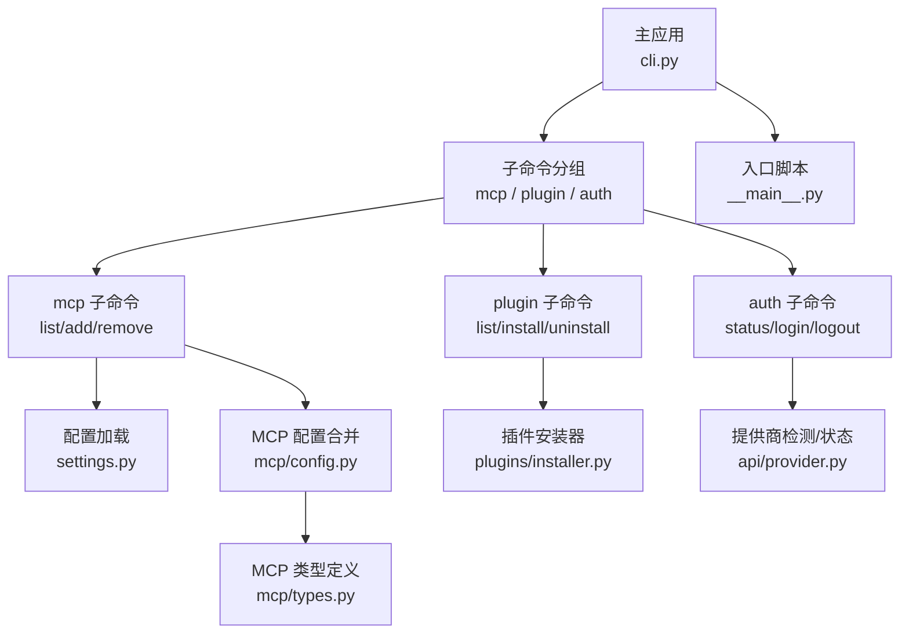
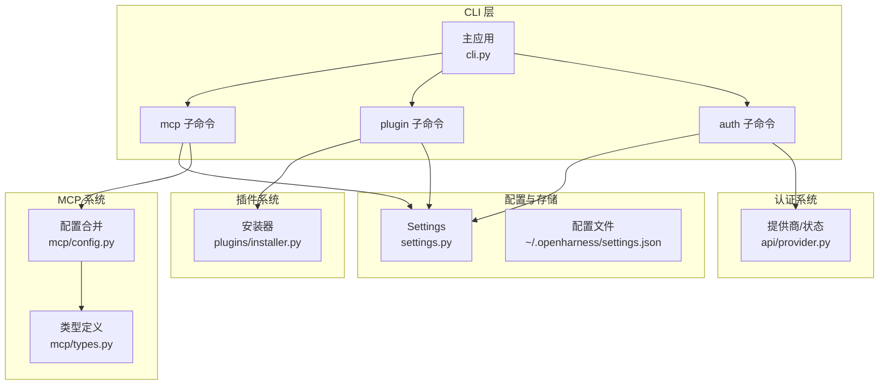
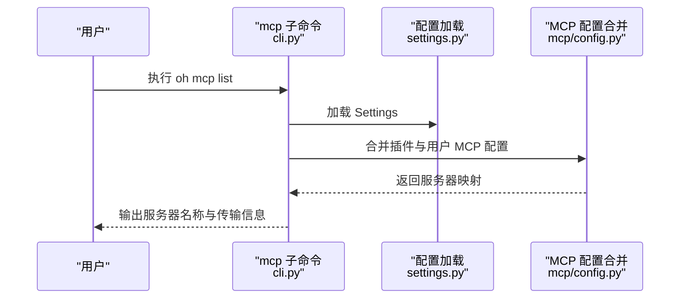
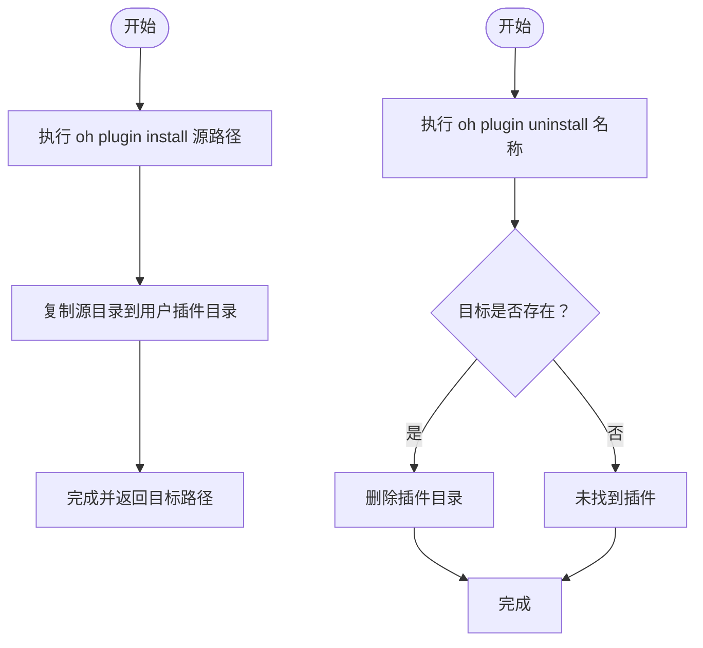
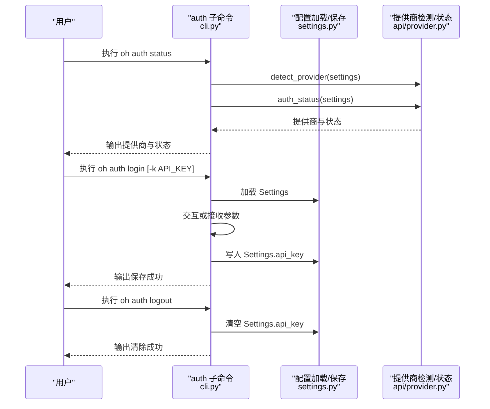
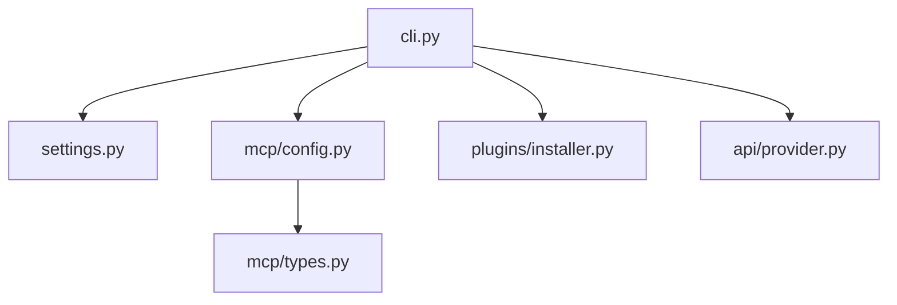

# 子命令详解

<cite>
**本文引用的文件**
- [cli.py](file://src/openharness/cli.py)
- [__main__.py](file://src/openharness/__main__.py)
- [settings.py](file://src/openharness/config/settings.py)
- [config.py](file://src/openharness/mcp/config.py)
- [types.py](file://src/openharness/mcp/types.py)
- [installer.py](file://src/openharness/plugins/installer.py)
- [provider.py](file://src/openharness/api/provider.py)
- [registry.py](file://src/openharness/commands/registry.py)
- [mcp_auth_tool.py](file://src/openharness/tools/mcp_auth_tool.py)
- [test_cli_flags.py](file://scripts/test_cli_flags.py)
</cite>

## 目录
1. [简介](#简介)
2. [项目结构](#项目结构)
3. [核心组件](#核心组件)
4. [架构总览](#架构总览)
5. [详细组件分析](#详细组件分析)
6. [依赖分析](#依赖分析)
7. [性能考虑](#性能考虑)
8. [故障排查指南](#故障排查指南)
9. [结论](#结论)
10. [附录](#附录)

## 简介
本文件面向 OpenHarness 的 CLI 用户与开发者，系统性讲解三大子命令：oh mcp、oh plugin、oh auth 的功能与用法。内容覆盖服务器列表、添加、删除；插件安装、卸载与列表；认证状态查询、登录与登出，并提供完整使用示例与常见场景，帮助快速掌握完整的命令行工具链。

## 项目结构
OpenHarness 的 CLI 入口通过 Typer 定义主应用与子命令分组，各子命令在独立模块中实现具体逻辑，并通过配置与插件系统协同工作。

图表来源
- [cli.py:12-34](file://src/openharness/cli.py#L12-L34)
- [__main__.py:3](file://src/openharness/__main__.py#L3)
- [settings.py:49-75](file://src/openharness/config/settings.py#L49-L75)
- [config.py:8-16](file://src/openharness/mcp/config.py#L8-L16)
- [types.py:11-37](file://src/openharness/mcp/types.py#L11-L37)
- [installer.py:11-27](file://src/openharness/plugins/installer.py#L11-L27)
- [provider.py:20-64](file://src/openharness/api/provider.py#L20-L64)

章节来源
- [cli.py:12-34](file://src/openharness/cli.py#L12-L34)
- [__main__.py:3](file://src/openharness/__main__.py#L3)

## 核心组件
- 主应用与子命令注册：在主应用中注册 mcp/plugin/auth 三组子命令，统一由 Typer 管理。
- 配置系统：Settings 模型集中管理 API 密钥、模型、权限、插件启用状态、MCP 服务器等。
- MCP 配置合并：将用户设置与已加载插件贡献的 MCP 服务器配置合并，形成最终可用列表。
- 插件安装器：提供从路径安装与卸载插件的能力。
- 认证状态：根据提供商推断与配置中的 API Key 判断认证状态。

章节来源
- [cli.py:12-34](file://src/openharness/cli.py#L12-L34)
- [settings.py:49-75](file://src/openharness/config/settings.py#L49-L75)
- [config.py:8-16](file://src/openharness/mcp/config.py#L8-L16)
- [installer.py:11-27](file://src/openharness/plugins/installer.py#L11-L27)
- [provider.py:20-64](file://src/openharness/api/provider.py#L20-L64)

## 架构总览
下图展示 oh 子命令与内部模块的交互关系，以及数据流向（配置读取、插件加载、MCP 合并、认证状态）。

图表来源
- [cli.py:39-173](file://src/openharness/cli.py#L39-L173)
- [settings.py:123-161](file://src/openharness/config/settings.py#L123-L161)
- [config.py:8-16](file://src/openharness/mcp/config.py#L8-L16)
- [types.py:11-37](file://src/openharness/mcp/types.py#L11-L37)
- [installer.py:11-27](file://src/openharness/plugins/installer.py#L11-L27)
- [provider.py:20-64](file://src/openharness/api/provider.py#L20-L64)

## 详细组件分析

### oh mcp 子命令
- 功能概览
  - list：列出所有已配置的 MCP 服务器及其传输方式或命令。
  - add：新增一个 MCP 服务器配置（以 JSON 字符串形式传入）。
  - remove：移除指定名称的 MCP 服务器配置。
- 关键实现要点
  - list：读取 Settings 并合并插件贡献的 MCP 配置，遍历输出名称与传输信息。
  - add：解析 JSON，写入 Settings.mcp_servers，保存到配置文件。
  - remove：校验存在性，删除后保存。
- 使用示例（基于仓库测试脚本）
  - 查看帮助：oh mcp --help
  - 列表：oh mcp list
  - 新增：oh mcp add 名称 '{"type":"http","url":"https://example.com","headers":{"Authorization":"Bearer ..."}}'
  - 删除：oh mcp remove 名称
- 常见场景
  - 在 CI 或本地开发环境为不同服务配置 HTTP/WS 或 stdio 传输的 MCP 服务器。
  - 将插件提供的 MCP 服务器作为“插件名:服务器名”的命名空间进行管理。

图表来源
- [cli.py:39-54](file://src/openharness/cli.py#L39-L54)
- [config.py:8-16](file://src/openharness/mcp/config.py#L8-L16)

章节来源
- [cli.py:39-92](file://src/openharness/cli.py#L39-L92)
- [config.py:8-16](file://src/openharness/mcp/config.py#L8-L16)
- [types.py:11-37](file://src/openharness/mcp/types.py#L11-L37)
- [test_cli_flags.py:132](file://scripts/test_cli_flags.py#L132)

### oh plugin 子命令
- 功能概览
  - list：列出已安装插件及启用状态与描述。
  - install：从本地路径或 URL 安装插件目录到用户插件目录。
  - uninstall：按名称卸载插件目录。
- 关键实现要点
  - list：读取 Settings 中的已加载插件集合，打印名称、状态与描述。
  - install：复制源目录至用户插件目录，若目标已存在则先删除再复制。
  - uninstall：删除用户插件目录下的对应插件目录，返回是否成功。
- 使用示例（基于仓库测试脚本）
  - 查看帮助：oh plugin --help
  - 列表：oh plugin list
  - 安装：oh plugin install 路径或URL
  - 卸载：oh plugin uninstall 插件名
- 常见场景
  - 在本地开发插件时快速安装/卸载进行迭代。
  - 将团队共享插件发布到公共目录并通过 install 快速集成。

图表来源
- [cli.py:96-132](file://src/openharness/cli.py#L96-L132)
- [installer.py:11-27](file://src/openharness/plugins/installer.py#L11-L27)

章节来源
- [cli.py:96-132](file://src/openharness/cli.py#L96-L132)
- [installer.py:11-27](file://src/openharness/plugins/installer.py#L11-L27)

### oh auth 子命令
- 功能概览
  - status：显示当前提供商与认证状态（已配置/缺失）。
  - login：保存 API Key 到配置（可交互输入或通过选项传入）。
  - logout：清除配置中的 API Key。
- 关键实现要点
  - status：检测提供商（依据 base_url/model 推断），查询 Settings 中的 API Key，输出提供商与状态。
  - login：若未提供密钥则提示输入，写入 Settings.api_key 并保存。
  - logout：清空 Settings.api_key 并保存。
- 使用示例（基于仓库测试脚本）
  - 查看帮助：oh auth --help
  - 状态：oh auth status
  - 登录：oh auth login -k sk-...
  - 登出：oh auth logout
- 常见场景
  - 在多账户或多环境切换时，通过 login/logout 快速切换认证上下文。
  - 结合环境变量与配置文件优先级策略，确保会话启动时自动携带有效密钥。

图表来源
- [cli.py:136-173](file://src/openharness/cli.py#L136-L173)
- [provider.py:20-64](file://src/openharness/api/provider.py#L20-L64)
- [settings.py:144-161](file://src/openharness/config/settings.py#L144-L161)

章节来源
- [cli.py:136-173](file://src/openharness/cli.py#L136-L173)
- [provider.py:20-64](file://src/openharness/api/provider.py#L20-L64)
- [settings.py:53-91](file://src/openharness/config/settings.py#L53-L91)
- [test_cli_flags.py:118-124](file://scripts/test_cli_flags.py#L118-L124)

## 依赖分析
- 子命令与配置
  - mcp/list 依赖 Settings 加载与 MCP 配置合并模块。
  - plugin/* 依赖插件安装器与 Settings.enabled_plugins。
  - auth/* 依赖 Settings.api_key 与提供商检测模块。
- 数据模型
  - Settings.mcp_servers 与 McpServerConfig（stdio/http/ws）共同构成 MCP 配置体系。
- 运行时交互
  - 子命令通过 save_settings 持久化变更，重启会话后生效。

图表来源
- [cli.py:39-173](file://src/openharness/cli.py#L39-L173)
- [settings.py:49-75](file://src/openharness/config/settings.py#L49-L75)
- [config.py:8-16](file://src/openharness/mcp/config.py#L8-L16)
- [types.py:11-37](file://src/openharness/mcp/types.py#L11-L37)
- [installer.py:11-27](file://src/openharness/plugins/installer.py#L11-L27)
- [provider.py:20-64](file://src/openharness/api/provider.py#L20-L64)

章节来源
- [cli.py:39-173](file://src/openharness/cli.py#L39-L173)
- [settings.py:49-75](file://src/openharness/config/settings.py#L49-L75)
- [config.py:8-16](file://src/openharness/mcp/config.py#L8-L16)
- [types.py:11-37](file://src/openharness/mcp/types.py#L11-L37)
- [installer.py:11-27](file://src/openharness/plugins/installer.py#L11-L27)
- [provider.py:20-64](file://src/openharness/api/provider.py#L20-L64)

## 性能考虑
- 配置读写
  - Settings 的加载与保存采用一次性 JSON 序列化/反序列化，I/O 成本低，适合频繁调用。
- MCP 配置合并
  - 合并过程为浅拷贝与字典更新，时间复杂度 O(N+M)，N 为用户配置项数，M 为插件贡献项数。
- 插件安装
  - 复制目录树为 I/O 密集操作，建议避免在高延迟存储上执行。
- 认证状态
  - 状态判断仅访问内存字段与少量字符串匹配，开销极小。

## 故障排查指南
- oh mcp list 显示为空
  - 检查 Settings.mcp_servers 是否存在，确认插件是否启用且贡献了有效配置。
  - 参考：[cli.py:39-54](file://src/openharness/cli.py#L39-L54)、[config.py:8-16](file://src/openharness/mcp/config.py#L8-L16)
- oh mcp add 报错 JSON 无效
  - 确认传入的 JSON 字符串格式正确，字段符合 McpServerConfig（stdio/http/ws）。
  - 参考：[cli.py:66-75](file://src/openharness/cli.py#L66-L75)、[types.py:11-37](file://src/openharness/mcp/types.py#L11-L37)
- oh mcp remove 无法找到服务器
  - 确认名称与保存的一致，注意插件贡献的服务器可能带有“插件名:服务器名”前缀。
  - 参考：[cli.py:85-91](file://src/openharness/cli.py#L85-L91)
- oh plugin install/uninstall 失败
  - 检查源路径是否存在与可访问，目标目录权限是否足够。
  - 参考：[installer.py:11-27](file://src/openharness/plugins/installer.py#L11-L27)
- oh auth status 显示缺少密钥
  - 通过 oh auth login 保存密钥，或设置环境变量 ANTHROPIC_API_KEY。
  - 参考：[cli.py:136-173](file://src/openharness/cli.py#L136-L173)、[settings.py:76-91](file://src/openharness/config/settings.py#L76-L91)

章节来源
- [cli.py:39-92](file://src/openharness/cli.py#L39-L92)
- [installer.py:11-27](file://src/openharness/plugins/installer.py#L11-L27)
- [settings.py:76-91](file://src/openharness/config/settings.py#L76-L91)

## 结论
oh mcp、oh plugin、oh auth 三大子命令分别负责 MCP 服务器管理、插件生命周期与认证上下文维护。它们与配置系统、MCP 类型体系、插件安装器和提供商检测紧密协作，形成完整的 CLI 工具链。遵循本文的使用示例与最佳实践，可在本地与 CI 环境中高效地配置与运行 OpenHarness。

## 附录
- 命令参考与示例（来自仓库测试脚本）
  - mcp list：参见 [test_cli_flags.py:132](file://scripts/test_cli_flags.py#L132)
  - plugin list：参见 [test_cli_flags.py:111-115](file://scripts/test_cli_flags.py#L111-L115)
  - auth status：参见 [test_cli_flags.py:118-124](file://scripts/test_cli_flags.py#L118-L124)