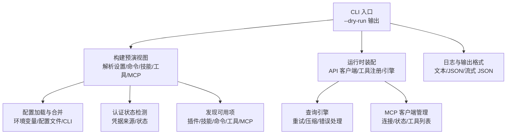
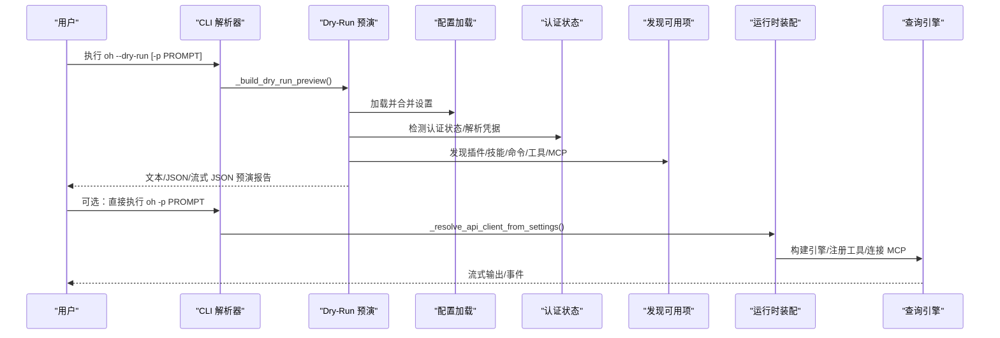
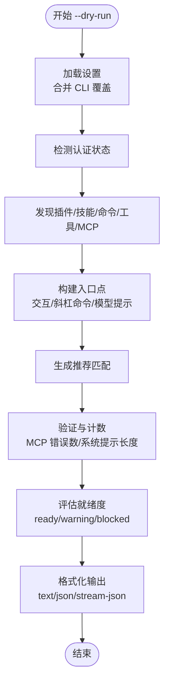
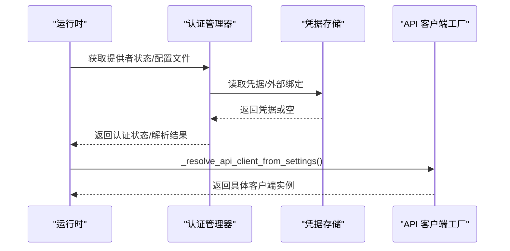
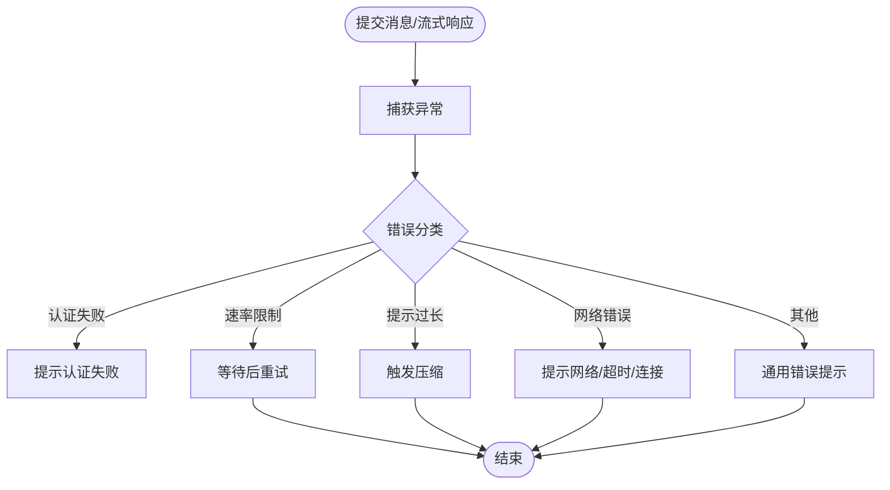
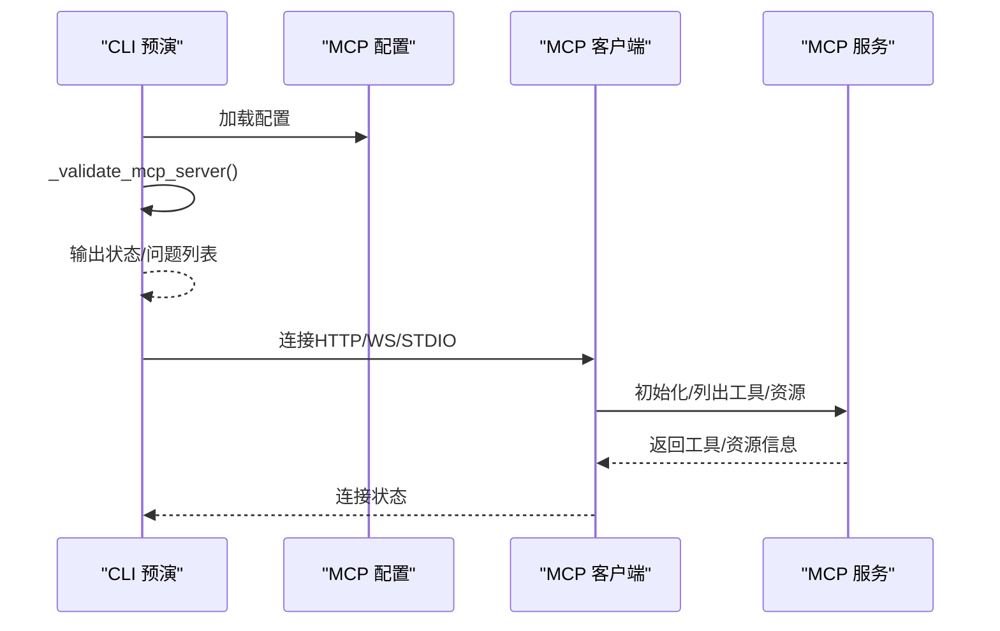
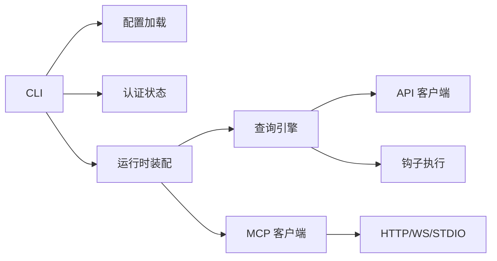

# 调试和故障排除

<cite>
**本文引用的文件**
- [cli.py](file://src/openharness/cli.py)
- [runtime.py](file://src/openharness/ui/runtime.py)
- [settings.py](file://src/openharness/config/settings.py)
- [manager.py](file://src/openharness/auth/manager.py)
- [errors.py](file://src/openharness/api/errors.py)
- [query.py](file://src/openharness/engine/query.py)
- [network_guard.py](file://src/openharness/utils/network_guard.py)
- [client.py](file://src/openharness/mcp/client.py)
- [provider_commands.py](file://ohmo/gateway/provider_commands.py)
- [workspace.py](file://ohmo/workspace.py)
- [__main__.py](file://src/openharness/__main__.py)
- [test_cli.py](file://tests/test_commands/test_cli.py)
- [test_copilot_auth.py](file://tests/test_api/test_copilot_auth.py)
- [test_registry.py](file://tests/test_commands/test_registry.py)
</cite>

## 目录
1. [简介](#简介)
2. [项目结构](#项目结构)
3. [核心组件](#核心组件)
4. [架构总览](#架构总览)
5. [详细组件分析](#详细组件分析)
6. [依赖关系分析](#依赖关系分析)
7. [性能考虑](#性能考虑)
8. [故障排除指南](#故障排除指南)
9. [结论](#结论)
10. [附录](#附录)

## 简介
本指南面向使用 OpenHarness 的开发者与高级用户，聚焦“调试与故障排除”的实操方法。内容涵盖：
- 使用 --dry-run 进行“预演”（预览执行路径、识别风险与潜在问题）
- 常见错误的诊断与修复：认证失败、模型连接问题、权限拒绝、配置错误等
- 调试模式与日志解读
- 性能问题排查
- 系统化故障排除流程与最佳实践

## 项目结构
OpenHarness 的调试与故障排除能力主要由以下模块协同实现：
- CLI 层：解析参数、构建 dry-run 预览、输出文本/JSON/流式 JSON
- 运行时装配层：根据设置解析 API 客户端、加载插件与工具、组装引擎
- 配置与认证：提供者选择、凭据解析、环境变量与配置文件优先级
- 引擎与网络：请求重试、压缩、错误分类与提示
- MCP 客户端：MCP 服务器连接与状态管理
- ohmo 工作区：个人代理工作区初始化与健康检查

图表来源
- [cli.py:396-597](file://src/openharness/cli.py#L396-L597)
- [runtime.py:246-443](file://src/openharness/ui/runtime.py#L246-L443)
- [settings.py:972-1029](file://src/openharness/config/settings.py#L972-L1029)
- [manager.py:186-318](file://src/openharness/auth/manager.py#L186-L318)

章节来源
- [cli.py:396-597](file://src/openharness/cli.py#L396-L597)
- [runtime.py:246-443](file://src/openharness/ui/runtime.py#L246-L443)
- [settings.py:972-1029](file://src/openharness/config/settings.py#L972-L1029)

## 核心组件
- --dry-run 预演：在不实际执行的前提下，输出“可读性/结构化”的执行路径与风险评估
- 认证与提供者：统一的凭据解析与提供者状态检测
- 运行时装配：按设置选择合适的 API 客户端，加载插件与工具，构建查询引擎
- 错误分类与恢复：区分认证失败、速率限制、网络错误、提示过长等，并给出明确提示
- MCP 管理：配置 MCP 服务器，连接与状态跟踪，工具与资源发现

章节来源
- [cli.py:396-597](file://src/openharness/cli.py#L396-L597)
- [manager.py:186-318](file://src/openharness/auth/manager.py#L186-L318)
- [runtime.py:193-243](file://src/openharness/ui/runtime.py#L193-L243)
- [errors.py:6-19](file://src/openharness/api/errors.py#L6-L19)
- [query.py:763-787](file://src/openharness/engine/query.py#L763-L787)

## 架构总览
下图展示从 CLI 到运行时的关键交互，以及 --dry-run 如何在早期阶段暴露风险。

图表来源
- [cli.py:2335-2366](file://src/openharness/cli.py#L2335-L2366)
- [cli.py:396-597](file://src/openharness/cli.py#L396-L597)
- [runtime.py:193-243](file://src/openharness/ui/runtime.py#L193-L243)
- [settings.py:972-1029](file://src/openharness/config/settings.py#L972-L1029)

## 详细组件分析

### 组件一：--dry-run 预演（入口与输出）
- 功能要点
  - 支持 --output-format=text/json/stream-json
  - 输出 readiness 等级、执行入口类型、已解析设置、验证结果、发现清单、MCP 配置校验、系统提示词预览、推荐匹配
- 关键流程
  - 解析设置（支持 CLI 覆盖）
  - 解析认证状态
  - 发现命令/技能/工具/MCP
  - 构建入口点（交互会话/斜杠命令/模型提示）
  - 生成推荐匹配（技能/工具/命令）
  - 评估就绪度（ready/warning/blocked）与后续建议
  - 格式化输出（文本/JSON/流式 JSON）

图表来源
- [cli.py:396-597](file://src/openharness/cli.py#L396-L597)
- [cli.py:600-742](file://src/openharness/cli.py#L600-L742)

章节来源
- [cli.py:2335-2366](file://src/openharness/cli.py#L2335-L2366)
- [cli.py:396-597](file://src/openharness/cli.py#L396-L597)
- [cli.py:600-742](file://src/openharness/cli.py#L600-L742)
- [test_cli.py:293-329](file://tests/test_commands/test_cli.py#L293-L329)

### 组件二：认证与提供者解析（运行时）
- 功能要点
  - 统一认证状态检测与提供者状态汇总
  - 将配置文件、环境变量、外部绑定、凭据存储等整合为“已解析凭据”
  - 在运行时安全地解析 API 客户端，缺失凭据时给出明确错误提示
- 关键流程
  - 解析活动提供者与配置文件
  - 汇总各认证源状态（环境变量/文件/外部绑定）
  - 选择合适的 API 客户端（Copilot/OpenAI/Claude 等）

图表来源
- [runtime.py:193-243](file://src/openharness/ui/runtime.py#L193-L243)
- [manager.py:186-318](file://src/openharness/auth/manager.py#L186-L318)

章节来源
- [runtime.py:193-243](file://src/openharness/ui/runtime.py#L193-L243)
- [manager.py:186-318](file://src/openharness/auth/manager.py#L186-L318)

### 组件三：错误分类与恢复（引擎）
- 功能要点
  - 区分认证失败、速率限制、网络错误、提示过长等
  - 对“提示过长”进行自动压缩尝试
  - 对网络类错误给出明确提示
- 关键流程
  - 捕获上游异常，映射到统一错误类型
  - 根据错误特征触发重试/压缩/提示

图表来源
- [errors.py:6-19](file://src/openharness/api/errors.py#L6-L19)
- [query.py:763-787](file://src/openharness/engine/query.py#L763-L787)

章节来源
- [errors.py:6-19](file://src/openharness/api/errors.py#L6-L19)
- [query.py:763-787](file://src/openharness/engine/query.py#L763-L787)

### 组件四：MCP 客户端与配置校验
- 功能要点
  - 连接 HTTP/WS/STDIO 类型的 MCP 服务器
  - 校验配置（URL/命令/工作目录），标记错误并汇总
- 关键流程
  - 解析传输类型与目标
  - 校验 URL/命令/工作目录存在性
  - 连接并注册会话，列出工具与资源

图表来源
- [cli.py:89-121](file://src/openharness/cli.py#L89-L121)
- [client.py:218-273](file://src/openharness/mcp/client.py#L218-L273)

章节来源
- [cli.py:89-121](file://src/openharness/cli.py#L89-L121)
- [client.py:218-273](file://src/openharness/mcp/client.py#L218-L273)

### 组件五：ohmo 工作区与健康检查
- 功能要点
  - 初始化工作区目录与模板文件
  - 提供健康检查（工作区/文件是否存在）
- 关键流程
  - 创建必要目录与模板文件
  - 读取状态文件并写入初始数据
  - 健康检查返回各项存在性

章节来源
- [workspace.py:252-301](file://ohmo/workspace.py#L252-L301)
- [workspace.py:304-319](file://ohmo/workspace.py#L304-L319)

## 依赖关系分析
- CLI 依赖配置加载、认证状态、命令/技能/工具/MCP 发现、运行时客户端解析
- 运行时依赖配置、认证、插件/工具注册、MCP 管理、查询引擎
- 引擎依赖 API 客户端、权限检查、钩子执行、会话后端
- MCP 客户端依赖 HTTP/WS/STDIO 连接与工具/资源发现

图表来源
- [cli.py:396-597](file://src/openharness/cli.py#L396-L597)
- [runtime.py:246-443](file://src/openharness/ui/runtime.py#L246-L443)
- [client.py:218-273](file://src/openharness/mcp/client.py#L218-L273)

章节来源
- [cli.py:396-597](file://src/openharness/cli.py#L396-L597)
- [runtime.py:246-443](file://src/openharness/ui/runtime.py#L246-L443)

## 性能考虑
- 设置层面
  - max_turns/pass/effort/passes 等影响会话成本与耗时
  - context_window_tokens/auto_compact_threshold_tokens 影响上下文压缩触发频率
- 引擎层面
  - 提示过长时自动压缩，减少往返次数
  - 速率限制时退避重试，避免雪崩
- 日志与输出
  - --dry-run 支持 stream-json，便于流式消费与低延迟预览
- 网络与安全
  - 网络访问受公共地址与代理限制，确保 URL 合法与代理配置正确

章节来源
- [settings.py:534-580](file://src/openharness/config/settings.py#L534-L580)
- [query.py:763-787](file://src/openharness/engine/query.py#L763-L787)
- [network_guard.py:54-80](file://src/openharness/utils/network_guard.py#L54-L80)

## 故障排除指南

### 1) 使用 --dry-run 进行预演与解读
- 基本用法
  - 文本预演：oh --dry-run -p "你的提示"
  - JSON 预演：oh --dry-run --output-format json -p "你的提示"
  - 流式 JSON 预演：oh --dry-run --output-format stream-json -p "你的提示"
- 关键字段解读
  - readiness.level：ready/warning/blocked
  - readiness.reasons：导致 warning/blocked 的原因
  - readiness.next_actions：建议的操作步骤
  - entrypoint.kind：交互会话/斜杠命令/模型提示
  - validation.auth_status/api_client/system_prompt_chars/mcp_errors
  - discovery：插件/技能/命令/工具/MCP 数量
  - MCP 配置：transport/target/status/issues
  - 推荐匹配：skills/tools/commands 的分数与理由
- 实战技巧
  - 若 level 为 warning/blocked，先根据 reasons 逐项修正
  - 若 MCP_errors > 0，优先修复 MCP 配置（URL/命令/工作目录）
  - 若 api_client 为 error，先完成认证配置

章节来源
- [cli.py:2335-2366](file://src/openharness/cli.py#L2335-L2366)
- [cli.py:600-742](file://src/openharness/cli.py#L600-L742)
- [test_cli.py:293-329](file://tests/test_commands/test_cli.py#L293-L329)

### 2) 认证失败（Authentication Failure）
- 症状
  - 运行时报错“未配置 API Key”，或 API 返回认证失败
- 诊断步骤
  - 检查活动提供者与认证源（环境变量/文件/外部绑定）
  - 使用 oh auth 子命令确认凭据是否正确
  - 在 --dry-run 中查看 auth_status 与 api_client 状态
- 修复建议
  - 设置环境变量或在配置文件中写入凭据
  - 对订阅类提供者（如 Claude 订阅）确保外部绑定正确
  - 使用 oh auth login 或相应子命令重新配置

章节来源
- [manager.py:186-318](file://src/openharness/auth/manager.py#L186-L318)
- [runtime.py:193-243](file://src/openharness/ui/runtime.py#L193-L243)
- [errors.py:10-11](file://src/openharness/api/errors.py#L10-L11)

### 3) 模型连接问题（Provider/Client）
- 症状
  - API 调用超时/连接失败/网络错误
  - 速率限制导致频繁重试
- 诊断步骤
  - 在 --dry-run 中观察 api_client 状态
  - 检查 base_url/model/api_format 是否与提供者匹配
  - 查看网络代理与公共地址限制
- 修复建议
  - 更换 base_url 或使用官方直连
  - 降低并发/提高重试间隔
  - 配置 OPENHARNESS_WEB_PROXY 或系统代理

章节来源
- [runtime.py:193-243](file://src/openharness/ui/runtime.py#L193-L243)
- [network_guard.py:54-80](file://src/openharness/utils/network_guard.py#L54-L80)
- [query.py:763-787](file://src/openharness/engine/query.py#L763-L787)

### 4) 权限拒绝（Permission Denied）
- 症状
  - 工具调用被拒绝；命令不可用
- 诊断步骤
  - 检查 permission.mode 与 allowed/denied 列表
  - 在 --dry-run 中查看 discovery 与 tools 列表
- 修复建议
  - 调整权限模式或添加允许的工具/命令
  - 使用权限对话框或相关命令调整策略

章节来源
- [settings.py:50-58](file://src/openharness/config/settings.py#L50-L58)

### 5) 配置错误（Settings/Profiles）
- 症状
  - 模型名解析异常、提供者不匹配、配置覆盖无效
- 诊断步骤
  - 检查配置文件与环境变量优先级
  - 使用 oh provider/show 或 doctor 子命令核对当前配置
- 修复建议
  - 清晰设置 active_profile/api_format/base_url/model
  - 通过 oh provider/use 或 oh auth use 切换至正确配置

章节来源
- [settings.py:972-1029](file://src/openharness/config/settings.py#L972-L1029)
- [provider_commands.py:34-52](file://ohmo/gateway/provider_commands.py#L34-L52)

### 6) MCP 服务器问题
- 症状
  - MCP 工具不可用、连接失败、状态异常
- 诊断步骤
  - 在 --dry-run 中查看 MCP 配置与 issues
  - 检查传输类型（http/ws/stdio）、URL/命令/工作目录
- 修复建议
  - 修正 URL 协议与域名、确保命令在 PATH 中、工作目录存在
  - 重启 MCP 服务或调整配置

章节来源
- [cli.py:89-121](file://src/openharness/cli.py#L89-L121)
- [client.py:218-273](file://src/openharness/mcp/client.py#L218-L273)

### 7) 日志与调试模式
- 日志输出
  - 文本/JSON/流式 JSON 三种输出格式，便于不同场景消费
  - --dry-run 默认输出文本，也可输出 JSON/流式 JSON
- 调试建议
  - 使用 --dry-run 预演，结合 readiness.next_actions 快速定位问题
  - 对敏感信息（如密钥）在输出中会被脱敏显示

章节来源
- [cli.py:2335-2366](file://src/openharness/cli.py#L2335-L2366)
- [test_registry.py:281-291](file://tests/test_commands/test_registry.py#L281-L291)

### 8) 性能问题排查
- 常见表现
  - 响应慢、频繁重试、提示过长
- 排查步骤
  - 检查 max_turns/effort/passes 是否过高
  - 观察是否触发了自动压缩（提示过长）
  - 关注速率限制与网络波动
- 优化建议
  - 适当降低 max_turns/effort
  - 合理拆分任务，减少单次提示长度
  - 使用官方直连或稳定代理

章节来源
- [settings.py:534-580](file://src/openharness/config/settings.py#L534-L580)
- [query.py:763-787](file://src/openharness/engine/query.py#L763-L787)

### 9) 系统化故障排除流程（最佳实践）
- 步骤一：使用 --dry-run 获取预演
  - 重点查看 readiness.level/reasons/next_actions
- 步骤二：逐项修复
  - 认证：补全凭据/切换提供者
  - 配置：修正 api_format/base_url/model/profile
  - MCP：修复 URL/命令/工作目录
- 步骤三：最小化复现
  - 使用 -p "最小提示" 再次 --dry-run
- 步骤四：执行与验证
  - 无阻塞后执行 oh -p "你的提示"
  - 观察日志与输出，确认问题解决

章节来源
- [cli.py:396-597](file://src/openharness/cli.py#L396-L597)

## 结论
- --dry-run 是 OpenHarness 调试与故障排除的核心工具，能在执行前暴露认证、配置、MCP 等关键风险
- 认证与配置是首要关注点，务必确保凭据完整、提供者与格式匹配
- 引擎具备完善的错误分类与恢复机制，结合日志与流式输出可快速定位问题
- 建议建立“预演—修复—最小化复现—验证”的标准化流程，提升问题定位效率

## 附录

### A. 常见命令与选项
- oh --dry-run -p "提示"：文本预演
- oh --dry-run --output-format json -p "提示"：JSON 预演
- oh --dry-run --output-format stream-json -p "提示"：流式 JSON 预演
- oh auth login：登录认证
- oh provider/use：切换提供者/配置
- oh doctor：系统健康检查

章节来源
- [__main__.py:1-7](file://src/openharness/__main__.py#L1-L7)
- [provider_commands.py:34-52](file://ohmo/gateway/provider_commands.py#L34-L52)