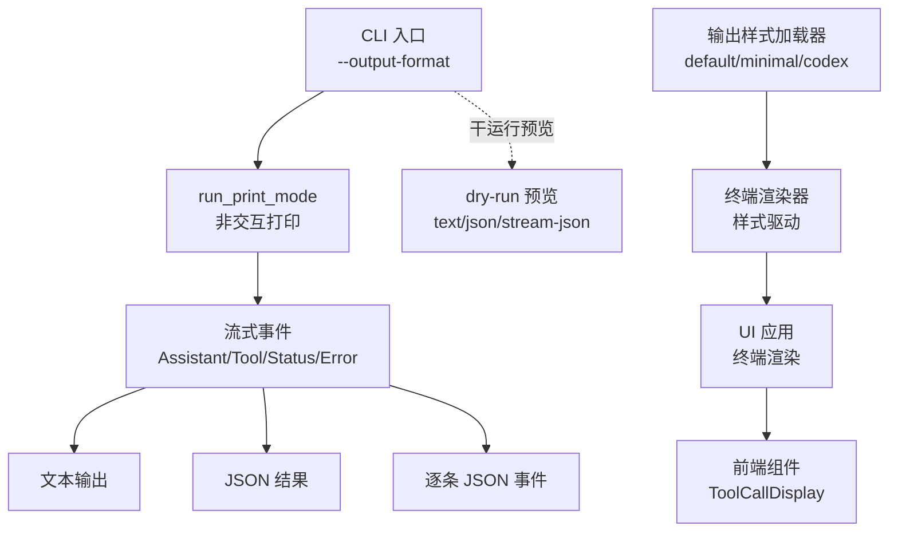
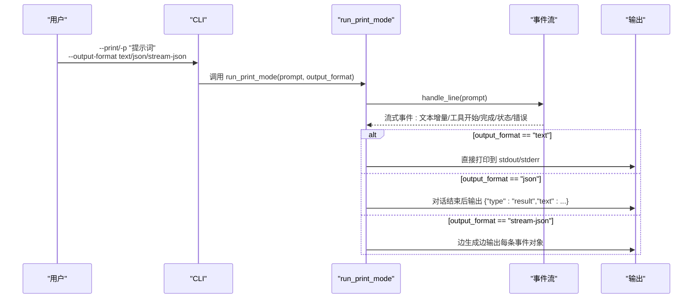
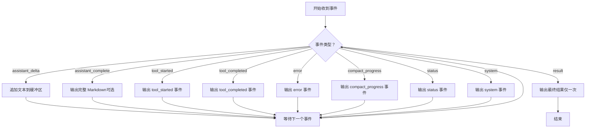
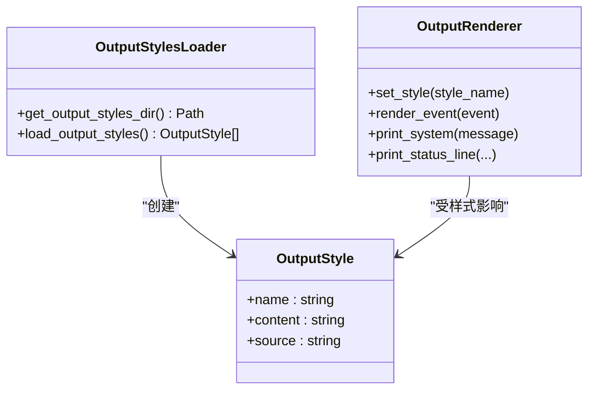
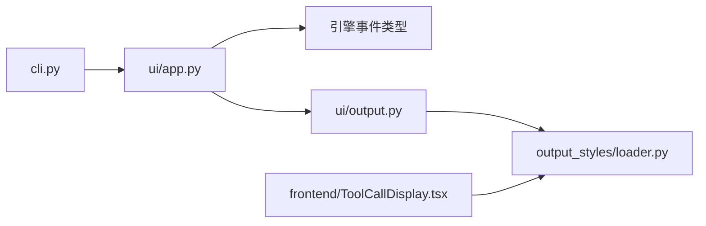

# 输出格式

<cite>
**本文引用的文件**
- [src/openharness/cli.py](file://src/openharness/cli.py)
- [src/openharness/ui/app.py](file://src/openharness/ui/app.py)
- [src/openharness/ui/output.py](file://src/openharness/ui/output.py)
- [src/openharness/output_styles/loader.py](file://src/openharness/output_styles/loader.py)
- [src/openharness/output_styles/__init__.py](file://src/openharness/output_styles/__init__.py)
- [src/openharness/commands/registry.py](file://src/openharness/commands/registry.py)
- [src/openharness/ui/backend_host.py](file://src/openharness/ui/backend_host.py)
- [tests/test_config/test_output_styles_loader.py](file://tests/test_config/test_output_styles_loader.py)
- [frontend/terminal/src/components/ToolCallDisplay.tsx](file://frontend/terminal/src/components/ToolCallDisplay.tsx)
</cite>

## 目录
1. [简介](#简介)
2. [项目结构](#项目结构)
3. [核心组件](#核心组件)
4. [架构总览](#架构总览)
5. [详细组件分析](#详细组件分析)
6. [依赖关系分析](#依赖关系分析)
7. [性能考量](#性能考量)
8. [故障排查指南](#故障排查指南)
9. [结论](#结论)
10. [附录](#附录)

## 简介
本文件系统性说明 OpenHarness 的输出格式体系，覆盖以下内容：
- 可用的输出格式选项：文本（默认）、JSON、流式 JSON（stream-json）
- 每种格式的特点、适用场景、数据结构与解析要点
- 在不同使用场景（交互会话、非交互打印、干运行预览）下的行为差异
- 输出格式的选择原则与性能权衡建议
- 与“输出样式”（Output Style）的区别与关联

## 项目结构
与输出格式直接相关的代码分布在 CLI、UI、输出样式加载器与前端组件中：
- CLI 提供 --output-format 参数，支持 text/json/stream-json
- UI 打印模式根据格式选择不同的事件序列化策略
- 输出样式（Output Style）用于终端渲染风格（如 default/minimal/codex），与输出格式（text/json/stream-json）是不同维度的概念
- 前端终端组件对 codex 风格有专门的渲染逻辑

**图表来源**
- [src/openharness/cli.py:2179-2184](file://src/openharness/cli.py#L2179-L2184)
- [src/openharness/ui/app.py:177-320](file://src/openharness/ui/app.py#L177-L320)
- [src/openharness/ui/output.py:20-266](file://src/openharness/ui/output.py#L20-L266)
- [src/openharness/output_styles/loader.py:27-42](file://src/openharness/output_styles/loader.py#L27-L42)
- [frontend/terminal/src/components/ToolCallDisplay.tsx:17](file://frontend/terminal/src/components/ToolCallDisplay.tsx#L17)

**章节来源**
- [src/openharness/cli.py:2179-2184](file://src/openharness/cli.py#L2179-L2184)
- [src/openharness/ui/app.py:177-320](file://src/openharness/ui/app.py#L177-L320)
- [src/openharness/output_styles/loader.py:27-42](file://src/openharness/output_styles/loader.py#L27-L42)

## 核心组件
- CLI 输出格式参数
  - 支持值：text（默认）、json、stream-json
  - 仅在 --print 或 --dry-run 使用；--dry-run 对 stream-json 不加缩进
- 运行时输出格式分支
  - text：直接打印到 stdout/stderr
  - json：在对话结束后输出一条包含最终结果的 JSON
  - stream-json：边生成边输出事件对象，每行一个 JSON 对象
- 输出样式（Output Style）
  - 与输出格式不同，控制终端渲染风格（default/minimal/codex）
  - 通过命令 /output-style 列表、设置与前端选择器管理

**章节来源**
- [src/openharness/cli.py:2179-2184](file://src/openharness/cli.py#L2179-L2184)
- [src/openharness/ui/app.py:235-320](file://src/openharness/ui/app.py#L235-L320)
- [src/openharness/output_styles/loader.py:27-42](file://src/openharness/output_styles/loader.py#L27-L42)
- [src/openharness/commands/registry.py:1768-1798](file://src/openharness/commands/registry.py#L1768-L1798)

## 架构总览
下图展示了从 CLI 到 UI、再到事件输出的完整路径，以及三种输出格式在各阶段的行为。

**图表来源**
- [src/openharness/cli.py:2430-2451](file://src/openharness/cli.py#L2430-L2451)
- [src/openharness/ui/app.py:177-320](file://src/openharness/ui/app.py#L177-L320)

## 详细组件分析

### 文本格式（text，默认）
- 行为特征
  - 将模型回复文本增量直接写入 stdout，并在回合结束换行
  - 工具执行开始与完成分别以可读的前缀与面板形式呈现
  - 系统消息与状态信息写入 stderr
- 适用场景
  - 人机交互、调试、日志阅读
- 解析方法
  - 无需解析 JSON，直接读取 stdout/stderr 即可
  - 若需提取最终回答，可从 stdout 截取最后一次模型输出后的片段

**章节来源**
- [src/openharness/ui/app.py:240-295](file://src/openharness/ui/app.py#L240-L295)
- [src/openharness/ui/output.py:20-266](file://src/openharness/ui/output.py#L20-L266)

### JSON 格式（json）
- 行为特征
  - 在一次对话完成后，输出一条包含最终文本的结果对象
  - 适合需要稳定结构化结果的集成场景
- 数据结构
  - 字段：type（固定为 result）、text（模型最终回复）
- 适用场景
  - 后端服务对接、自动化脚本消费结果
- 解析方法
  - 读取标准输出，解析单个 JSON 对象
  - 注意：该对象不包含中间事件，仅包含最终结果

**章节来源**
- [src/openharness/ui/app.py:316-318](file://src/openharness/ui/app.py#L316-L318)

### 流式 JSON 格式（stream-json）
- 行为特征
  - 事件按顺序逐条输出，每行一个 JSON 对象
  - 包含系统消息、模型文本增量、工具调用开始/完成、错误、压缩进度、状态等事件类型
  - 干运行预览模式下，stream-json 与 json 类似但不使用缩进
- 数据结构
  - 通用字段：type（事件类型）
  - 典型事件类型与字段：
    - system：message（字符串）
    - assistant_delta：text（字符串）
    - assistant_complete：text（字符串）
    - tool_started：tool_name（字符串）、tool_input（对象或字典）
    - tool_completed：tool_name（字符串）、output（字符串）、is_error（布尔）
    - error：message（字符串）、recoverable（布尔）
    - compact_progress：phase（字符串）、trigger（字符串）、attempt（整数）、message（字符串）
    - status：message（字符串）
    - result：text（字符串）（仅在对话结束时出现）
- 适用场景
  - 实时可视化、前端 TUI、实时分析与监控
- 解析方法
  - 逐行读取标准输出，解析每个 JSON 对象
  - 根据 type 字段区分事件类型，组合出完整的对话历史与工具调用链

**图表来源**
- [src/openharness/ui/app.py:235-320](file://src/openharness/ui/app.py#L235-L320)

**章节来源**
- [src/openharness/ui/app.py:235-320](file://src/openharness/ui/app.py#L235-L320)

### 干运行预览（dry-run）与输出格式
- 支持的格式：text、json、stream-json
- 行为差异
  - text：格式化为人类可读的文本摘要
  - json：输出完整预览对象（带缩进）
  - stream-json：输出完整预览对象（无缩进，逐行）
- 适用场景
  - 配置验证、权限与工具发现预览、系统提示词与 MCP 配置检查

**章节来源**
- [src/openharness/cli.py:2353-2366](file://src/openharness/cli.py#L2353-L2366)

### 输出样式（Output Style）与输出格式的关系
- 输出样式控制终端渲染风格（default/minimal/codex），影响文本输出的排版、颜色、工具输出展示方式
- 输出格式控制标准输出的数据结构（纯文本、JSON、流式 JSON）
- 二者可独立选择：例如在 text 格式下使用 codex 样式，或在 stream-json 下切换到 minimal 样式

**图表来源**
- [src/openharness/output_styles/loader.py:11-42](file://src/openharness/output_styles/loader.py#L11-L42)
- [src/openharness/ui/output.py:20-266](file://src/openharness/ui/output.py#L20-L266)

**章节来源**
- [src/openharness/output_styles/loader.py:27-42](file://src/openharness/output_styles/loader.py#L27-L42)
- [src/openharness/ui/output.py:20-266](file://src/openharness/ui/output.py#L20-L266)
- [src/openharness/commands/registry.py:1768-1798](file://src/openharness/commands/registry.py#L1768-L1798)
- [src/openharness/ui/backend_host.py:558-585](file://src/openharness/ui/backend_host.py#L558-L585)

## 依赖关系分析
- CLI 依赖 UI 的 run_print_mode 来执行非交互输出
- UI 依赖引擎事件类型来决定输出对象结构
- 输出样式加载器与渲染器共同决定文本渲染细节
- 前端组件对 codex 样式有特定的展示逻辑

**图表来源**
- [src/openharness/cli.py:2430-2451](file://src/openharness/cli.py#L2430-L2451)
- [src/openharness/ui/app.py:177-320](file://src/openharness/ui/app.py#L177-L320)
- [src/openharness/ui/output.py:20-266](file://src/openharness/ui/output.py#L20-L266)
- [src/openharness/output_styles/loader.py:27-42](file://src/openharness/output_styles/loader.py#L27-L42)
- [frontend/terminal/src/components/ToolCallDisplay.tsx:17](file://frontend/terminal/src/components/ToolCallDisplay.tsx#L17)

**章节来源**
- [src/openharness/cli.py:2430-2451](file://src/openharness/cli.py#L2430-L2451)
- [src/openharness/ui/app.py:177-320](file://src/openharness/ui/app.py#L177-L320)
- [src/openharness/ui/output.py:20-266](file://src/openharness/ui/output.py#L20-L266)
- [src/openharness/output_styles/loader.py:27-42](file://src/openharness/output_styles/loader.py#L27-L42)
- [frontend/terminal/src/components/ToolCallDisplay.tsx:17](file://frontend/terminal/src/components/ToolCallDisplay.tsx#L17)

## 性能考量
- 文本格式（text）
  - 低开销，适合交互与调试
  - 无法直接解析中间事件，需要依赖终端输出进行语义理解
- JSON 格式（json）
  - 仅输出最终结果，避免中间事件解析成本
  - 适合后端集成，减少客户端解析负担
- 流式 JSON（stream-json）
  - 事件逐条输出，利于实时可视化与监控
  - 事件数量较多时，I/O 与解析成本上升
  - 干运行预览的 stream-json 不使用缩进，降低体积与解析复杂度
- 输出样式（Output Style）
  - minimal 样式减少装饰与高亮，提升渲染速度
  - codex 样式更紧凑，适合快速审阅

[本节为通用指导，无需列出具体文件来源]

## 故障排查指南
- 问题：--dry-run 报错不支持的输出格式
  - 现象：提示 --dry-run 仅支持 text/json/stream-json
  - 处理：确认使用上述三种格式之一
- 问题：stream-json 未按预期逐条输出
  - 现象：一次性输出多个对象
  - 处理：确保以逐行打印的方式输出，且每行是一个合法 JSON 对象
- 问题：最终结果缺失（json 格式）
  - 现象：只看到中间事件，没有最终 result 对象
  - 处理：确认对话已结束，且输出格式为 json；注意 json 仅在对话结束后输出一次最终结果
- 问题：codex 样式在前端显示异常
  - 现象：错误计数或行数统计与预期不符
  - 处理：前端组件对 codex 样式有特定阈值与截断逻辑，确认样式设置正确

**章节来源**
- [src/openharness/cli.py:2360-2366](file://src/openharness/cli.py#L2360-L2366)
- [src/openharness/ui/app.py:316-318](file://src/openharness/ui/app.py#L316-L318)
- [frontend/terminal/src/components/ToolCallDisplay.tsx:17](file://frontend/terminal/src/components/ToolCallDisplay.tsx#L17)

## 结论
- 选择原则
  - 交互与调试优先使用 text
  - 自动化集成优先使用 json
  - 实时可视化与监控优先使用 stream-json
- 输出样式（default/minimal/codex）与输出格式（text/json/stream-json）可独立配置，前者影响渲染，后者影响数据结构
- 干运行预览（dry-run）支持三种格式，便于在不执行模型与工具的前提下进行配置与权限验证

[本节为总结性内容，无需列出具体文件来源]

## 附录

### 输出格式与事件类型对照表
- system：系统消息
- assistant_delta：模型文本增量
- assistant_complete：模型回合完成
- tool_started：工具调用开始
- tool_completed：工具调用完成
- error：错误事件
- compact_progress：压缩进度事件
- status：状态消息
- result：最终结果（json 格式）

**章节来源**
- [src/openharness/ui/app.py:235-320](file://src/openharness/ui/app.py#L235-L320)

### 输出样式（Output Style）清单
- default：标准富文本终端输出
- minimal：极简纯文本输出
- codex：类 Codex 紧凑对话与工具输出
- 用户自定义：位于配置目录下的 *.md 文件，名称即样式名

**章节来源**
- [src/openharness/output_styles/loader.py:27-42](file://src/openharness/output_styles/loader.py#L27-L42)
- [tests/test_config/test_output_styles_loader.py:6-26](file://tests/test_config/test_output_styles_loader.py#L6-L26)
- [src/openharness/commands/registry.py:1768-1798](file://src/openharness/commands/registry.py#L1768-L1798)
- [src/openharness/ui/backend_host.py:558-585](file://src/openharness/ui/backend_host.py#L558-L585)