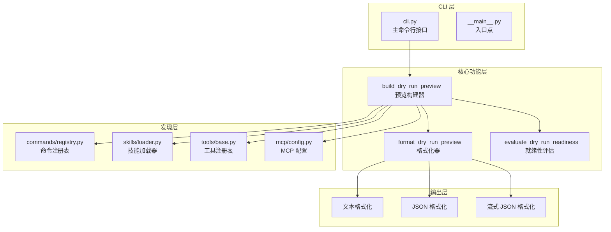
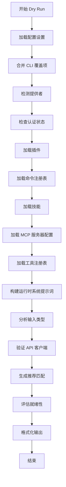
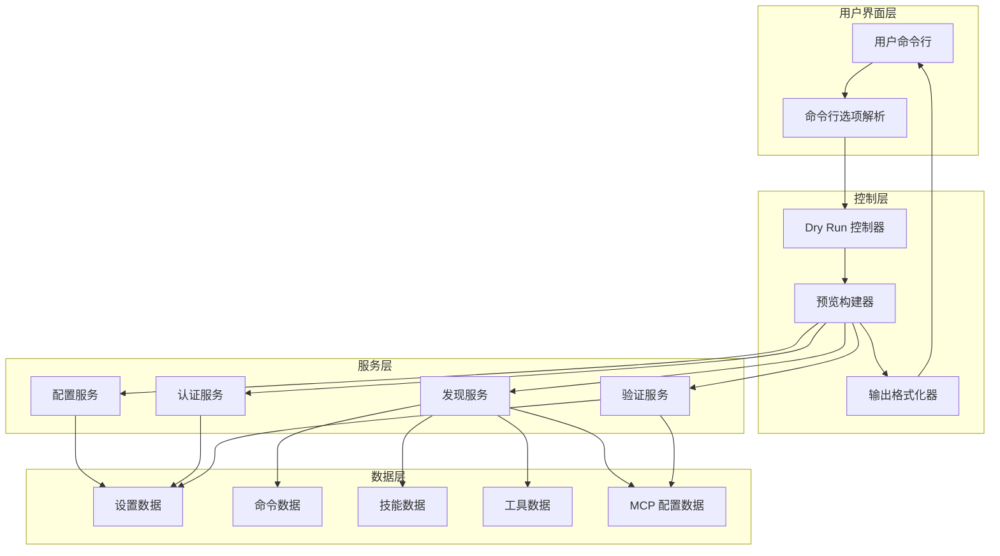
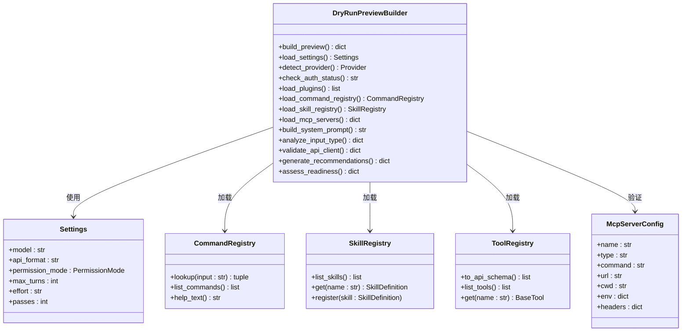
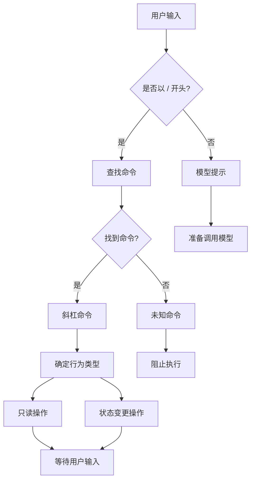
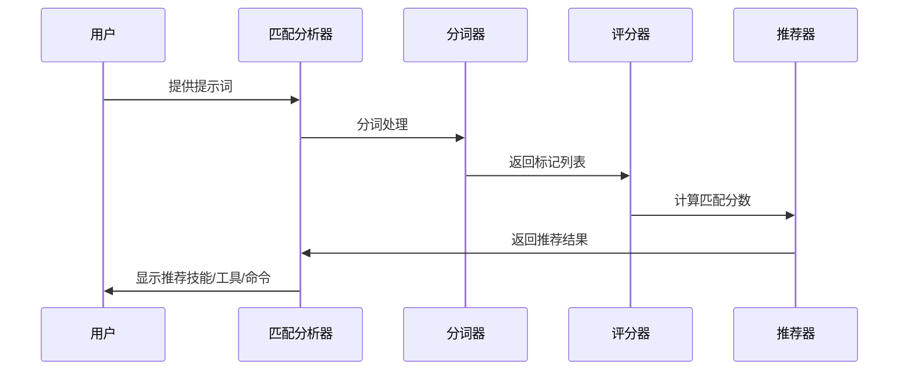
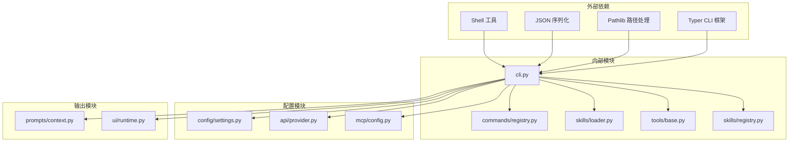

# Dry Run 预览功能

<cite>
**本文档引用的文件**
- [cli.py](file://src/openharness/cli.py)
- [__main__.py](file://src/openharness/__main__.py)
- [README.md](file://README.md)
- [test_cli.py](file://tests/test_commands/test_cli.py)
- [registry.py](file://src/openharness/commands/registry.py)
- [base.py](file://src/openharness/tools/base.py)
- [loader.py](file://src/openharness/skills/loader.py)
- [registry.py](file://src/openharness/skills/registry.py)
</cite>

## 目录
1. [简介](#简介)
2. [项目结构](#项目结构)
3. [核心组件](#核心组件)
4. [架构概览](#架构概览)
5. [详细组件分析](#详细组件分析)
6. [依赖关系分析](#依赖关系分析)
7. [性能考虑](#性能考虑)
8. [故障排除指南](#故障排除指南)
9. [结论](#结论)
10. [附录](#附录)

## 简介

OpenHarness 的 Dry Run（干运行）预览功能是一个强大的安全检查工具，允许用户在不执行任何实际操作的情况下预览 OpenHarness 将要使用的配置、认证状态、提示词组装过程、可用技能、命令和工具等信息。

该功能的核心特点：
- **完全静态分析**：不调用模型、不执行工具、不连接 MCP 服务器
- **全面配置验证**：解析设置、认证状态、提示词组装
- **智能入口点分析**：识别交互式会话、模型提示或斜杠命令
- **推荐匹配系统**：基于提示词内容推荐最相关的技能、工具和命令
- **多格式输出**：支持文本、JSON 和流式 JSON 格式

## 项目结构

OpenHarness 的 Dry Run 功能主要分布在以下关键文件中：



**图表来源**
- [cli.py:396-597](file://src/openharness/cli.py#L396-L597)
- [cli.py:600-742](file://src/openharness/cli.py#L600-L742)
- [registry.py:165-192](file://src/openharness/commands/registry.py#L165-L192)
- [loader.py:42-75](file://src/openharness/skills/loader.py#L42-L75)
- [base.py:60-80](file://src/openharness/tools/base.py#L60-L80)

**章节来源**
- [cli.py:2185-2190](file://src/openharness/cli.py#L2185-L2190)
- [__main__.py:1-7](file://src/openharness/__main__.py#L1-L7)

## 核心组件

### 主要命令行参数

Dry Run 功能通过 `--dry-run` 参数启用，支持以下相关选项：

| 参数 | 类型 | 描述 | 默认值 |
|------|------|------|--------|
| `--dry-run` | 布尔 | 启用干运行模式 | False |
| `-p`/`--print` | 字符串 | 非交互式输出模式，指定提示词 | None |
| `--output-format` | 字符串 | 输出格式：text/json/stream-json | text |

### 预览构建器核心流程



**图表来源**
- [cli.py:396-597](file://src/openharness/cli.py#L396-L597)

**章节来源**
- [cli.py:2185-2190](file://src/openharness/cli.py#L2185-L2190)
- [cli.py:2335-2366](file://src/openharness/cli.py#L2335-L2366)

## 架构概览

Dry Run 功能采用分层架构设计，确保预览过程的完整性和准确性：



**图表来源**
- [cli.py:2335-2366](file://src/openharness/cli.py#L2335-L2366)
- [cli.py:396-597](file://src/openharness/cli.py#L396-L597)

## 详细组件分析

### 预览构建器组件

预览构建器是 Dry Run 功能的核心组件，负责收集和分析所有相关信息：



**图表来源**
- [cli.py:396-597](file://src/openharness/cli.py#L396-L597)
- [registry.py:165-192](file://src/openharness/commands/registry.py#L165-L192)
- [loader.py:42-75](file://src/openharness/skills/loader.py#L42-L75)
- [base.py:60-80](file://src/openharness/tools/base.py#L60-L80)

### 入口点分析组件

入口点分析组件负责确定用户输入将触发的操作类型：



**图表来源**
- [cli.py:501-535](file://src/openharness/cli.py#L501-L535)
- [cli.py:124-201](file://src/openharness/cli.py#L124-L201)

**章节来源**
- [cli.py:501-535](file://src/openharness/cli.py#L501-L535)
- [cli.py:124-201](file://src/openharness/cli.py#L124-L201)

### 推荐匹配系统

推荐匹配系统使用复杂的算法来分析用户提示词并推荐最相关的技能、工具和命令：



**图表来源**
- [cli.py:253-330](file://src/openharness/cli.py#L253-L330)

**章节来源**
- [cli.py:253-330](file://src/openharness/cli.py#L253-L330)

### 就绪性评估组件

就绪性评估组件分析预览结果并提供执行建议：

| 就绪级别 | 状态描述 | 可能的原因 | 建议操作 |
|----------|----------|------------|----------|
| ready | 配置看起来可用 | 所有验证通过 | 直接运行提示词或打开交互式界面 |
| warning | 可以解析会话但有重要问题 | MCP 配置错误或缺少认证 | 修复 MCP 配置或添加认证信息 |
| blocked | 请求路径无法成功执行 | 未知斜杠命令或无法解析运行时客户端 | 修正命令名称或解决认证问题 |

**章节来源**
- [cli.py:333-393](file://src/openharness/cli.py#L333-L393)

## 依赖关系分析

Dry Run 功能涉及多个子系统的协调工作：



**图表来源**
- [cli.py:1-20](file://src/openharness/cli.py#L1-L20)
- [cli.py:410-418](file://src/openharness/cli.py#L410-L418)

**章节来源**
- [cli.py:1-20](file://src/openharness/cli.py#L1-L20)
- [cli.py:410-418](file://src/openharness/cli.py#L410-L418)

## 性能考虑

Dry Run 功能设计为快速响应，主要性能优化包括：

1. **延迟加载**：仅在需要时加载插件和扩展
2. **缓存策略**：避免重复计算相同的验证结果
3. **内存管理**：及时释放不需要的对象引用
4. **I/O 优化**：最小化文件系统访问次数

## 故障排除指南

### 常见问题及解决方案

| 问题类型 | 症状 | 可能原因 | 解决方案 |
|----------|------|----------|----------|
| 认证失败 | `auth_status: missing` | 缺少 API 密钥或认证信息 | 运行 `oh auth login` 或配置活动配置文件凭据 |
| MCP 服务器错误 | `mcp_errors: > 0` | 配置的 MCP 服务器有问题 | 检查 MCP 服务器配置或禁用有问题的服务器 |
| 未知斜杠命令 | `entrypoint.kind: unknown_slash_command` | 命令名称拼写错误 | 运行 `oh --dry-run -p "/help"` 查看可用命令 |
| 模型客户端解析失败 | `api_client.status: error` | 配置与模型不兼容 | 检查模型设置和 API 格式配置 |

### 调试技巧

1. **使用 JSON 输出格式**：`oh --dry-run -p "你的提示词" --output-format json`
2. **检查 MCP 配置**：`oh mcp list` 验证 MCP 服务器状态
3. **验证认证状态**：`oh auth status` 检查认证信息
4. **逐步缩小范围**：从简单提示词开始，逐步增加复杂度

**章节来源**
- [cli.py:333-393](file://src/openharness/cli.py#L333-L393)
- [test_cli.py:346-431](file://tests/test_commands/test_cli.py#L346-L431)

## 结论

OpenHarness 的 Dry Run 预览功能是一个设计精良的安全检查工具，它提供了：

- **完整的配置验证**：涵盖设置、认证、MCP 配置等各个方面
- **智能入口点分析**：准确识别用户意图和可能的操作路径
- **实用的推荐系统**：基于提示词内容提供相关技能、工具和命令推荐
- **灵活的输出格式**：支持人类可读和机器可读两种输出格式

该功能特别适用于：
- 配置调试和验证
- 权限测试和安全检查  
- 插件和扩展验证
- 开发环境的集成测试

## 附录

### 实际使用场景

#### 配置调试最佳实践
```bash
# 基本干运行预览
oh --dry-run

# 预览特定提示词
oh --dry-run -p "Review this bug fix"

# 获取结构化输出用于脚本
oh --dry-run -p "Explain this repository" --output-format json
```

#### 权限测试场景
```bash
# 测试不同权限模式
oh --dry-run --permission-mode default
oh --dry-run --permission-mode plan  
oh --dry-run --permission-mode full_auto
```

#### 插件验证场景
```bash
# 验证插件加载和配置
oh --dry-run --bare
oh --dry-run --mcp-config "[]"  # 禁用 MCP 服务器
```

### 高级选项配合使用

Dry Run 功能可以与其他高级选项配合使用：

- `--bare`：最小化模式，跳过钩子、插件、MCP 和自动发现
- `--mcp-config`：从 JSON 文件或字符串加载 MCP 服务器配置
- `--settings`：指定设置文件路径或内联 JSON 字符串
- `--debug`：启用调试日志记录

这些选项可以帮助用户更精确地控制预览过程和结果。