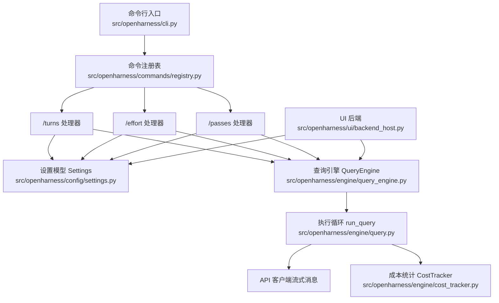
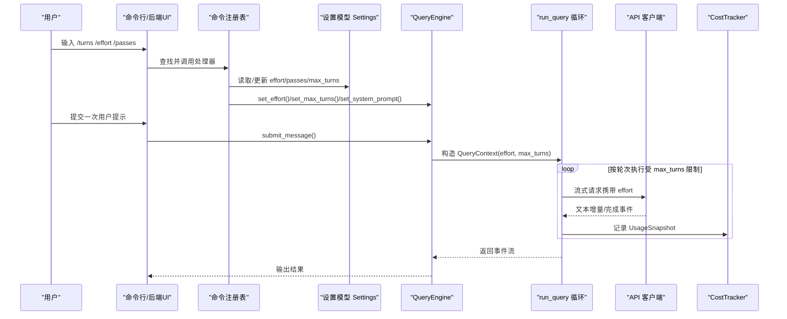
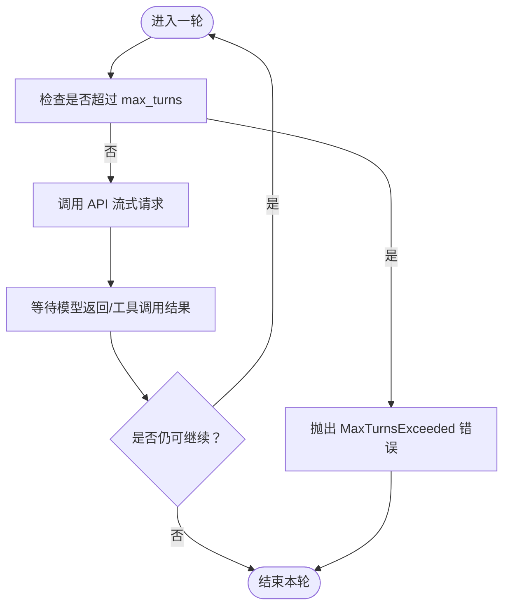
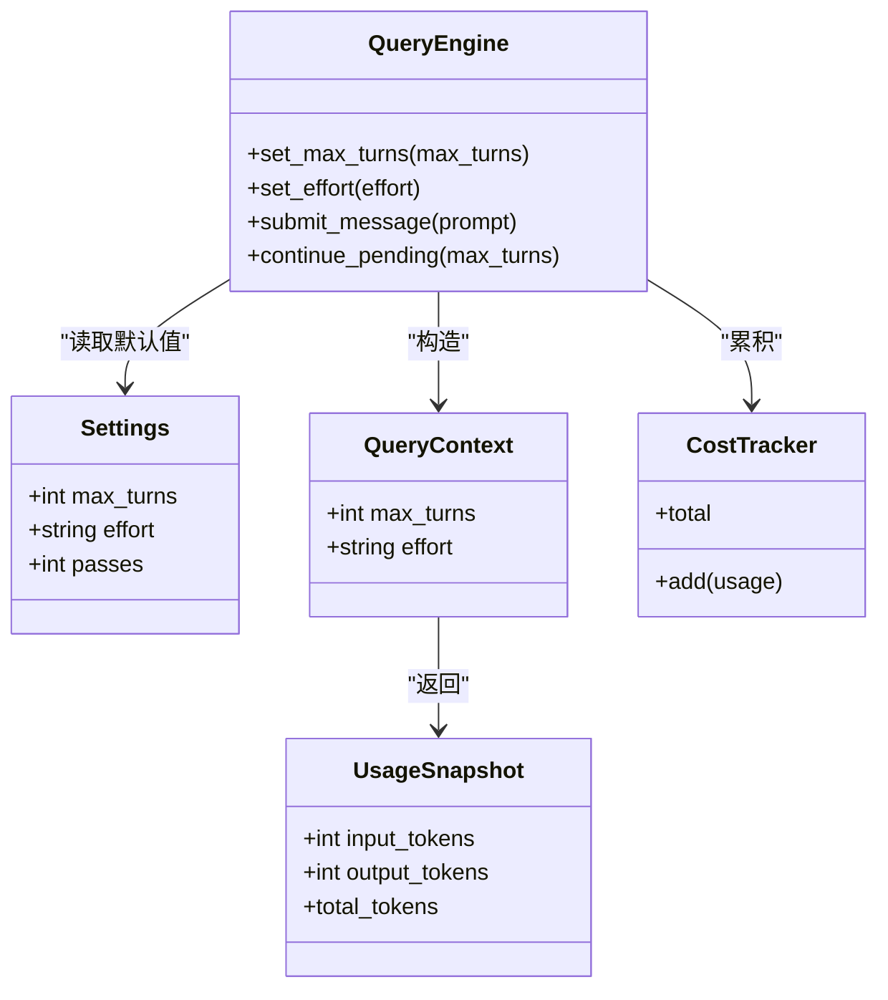
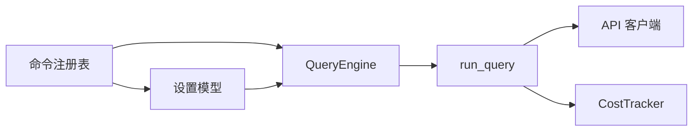

# 会话管理选项

<cite>
**本文引用的文件**
- [src/openharness/cli.py](file://src/openharness/cli.py)
- [src/openharness/commands/registry.py](file://src/openharness/commands/registry.py)
- [src/openharness/ui/backend_host.py](file://src/openharness/ui/backend_host.py)
- [src/openharness/config/settings.py](file://src/openharness/config/settings.py)
- [src/openharness/engine/query_engine.py](file://src/openharness/engine/query_engine.py)
- [src/openharness/engine/query.py](file://src/openharness/engine/query.py)
- [src/openharness/state/app_state.py](file://src/openharness/state/app_state.py)
- [src/openharness/engine/cost_tracker.py](file://src/openharness/engine/cost_tracker.py)
- [src/openharness/api/usage.py](file://src/openharness/api/usage.py)
- [README.md](file://README.md)
- [tests/test_commands/test_registry.py](file://tests/test_commands/test_registry.py)
</cite>

## 目录
1. [简介](#简介)
2. [项目结构](#项目结构)
3. [核心组件](#核心组件)
4. [架构总览](#架构总览)
5. [详细组件分析](#详细组件分析)
6. [依赖关系分析](#依赖关系分析)
7. [性能考量](#性能考量)
8. [故障排查指南](#故障排查指南)
9. [结论](#结论)
10. [附录](#附录)

## 简介
本指南聚焦 OpenHarness 的会话管理选项，系统讲解以下参数对会话行为与成本的影响：
- --max-turns：每次对话的最大轮数限制（单次用户输入的智能体交互轮次上限）
- --effort：推理努力程度（低/中/高/X高），用于控制模型在单轮内的思考深度与输出长度
- --passes：推理传递次数（1–8），用于控制多轮“推理-工具调用-再推理”的循环次数

我们将从命令注册、引擎执行、状态持久化、成本统计等维度，说明这些参数如何影响模型调用成本、响应质量与时长，并给出不同使用场景下的优化建议与实证对比思路。

## 项目结构
围绕会话管理的关键模块与文件如下：
- 命令注册与交互入口：/turns、/effort、/passes 命令处理器
- 设置模型与持久化：Settings 中的 effort、passes、max_turns 字段
- 引擎执行：QueryEngine 与 run_query 循环，读取 max_turns、effort 并驱动模型调用
- UI 后端：提供选择面板与当前值展示
- 成本统计：UsageSnapshot 与 CostTracker 聚合 token 使用

图表来源
- [src/openharness/cli.py](file://src/openharness/cli.py)
- [src/openharness/commands/registry.py](file://src/openharness/commands/registry.py)
- [src/openharness/config/settings.py](file://src/openharness/config/settings.py)
- [src/openharness/engine/query_engine.py](file://src/openharness/engine/query_engine.py)
- [src/openharness/engine/query.py](file://src/openharness/engine/query.py)
- [src/openharness/engine/cost_tracker.py](file://src/openharness/engine/cost_tracker.py)
- [src/openharness/ui/backend_host.py](file://src/openharness/ui/backend_host.py)

章节来源
- [src/openharness/cli.py](file://src/openharness/cli.py)
- [src/openharness/commands/registry.py](file://src/openharness/commands/registry.py)
- [src/openharness/config/settings.py](file://src/openharness/config/settings.py)
- [src/openharness/engine/query_engine.py](file://src/openharness/engine/query_engine.py)
- [src/openharness/engine/query.py](file://src/openharness/engine/query.py)
- [src/openharness/ui/backend_host.py](file://src/openharness/ui/backend_host.py)

## 核心组件
- 设置模型 Settings
  - effort：推理努力程度，默认 medium；支持 low/medium/high/xhigh
  - passes：推理传递次数，默认 1；范围 1–8
  - max_turns：每次用户输入的最大轮数，默认 200；None 表示无限制
- 命令处理器
  - /turns：显示或设置 max_turns，支持 unlimited
  - /effort：显示或设置 effort
  - /passes：显示或设置 passes
- 查询引擎 QueryEngine
  - 通过 set_max_turns/set_effort 更新运行时参数
  - 在 run_query 中按 max_turns 限制轮次，向 API 流式请求并携带 effort
- 成本统计 CostTracker
  - 聚合 UsageSnapshot，累计 input_tokens 与 output_tokens

章节来源
- [src/openharness/config/settings.py](file://src/openharness/config/settings.py)
- [src/openharness/commands/registry.py](file://src/openharness/commands/registry.py)
- [src/openharness/engine/query_engine.py](file://src/openharness/engine/query_engine.py)
- [src/openharness/engine/query.py](file://src/openharness/engine/query.py)
- [src/openharness/engine/cost_tracker.py](file://src/openharness/engine/cost_tracker.py)
- [src/openharness/api/usage.py](file://src/openharness/api/usage.py)

## 架构总览
下图展示了从命令到引擎再到 API 的关键数据流，以及成本统计路径：

图表来源
- [src/openharness/commands/registry.py](file://src/openharness/commands/registry.py)
- [src/openharness/config/settings.py](file://src/openharness/config/settings.py)
- [src/openharness/engine/query_engine.py](file://src/openharness/engine/query_engine.py)
- [src/openharness/engine/query.py](file://src/openharness/engine/query.py)
- [src/openharness/engine/cost_tracker.py](file://src/openharness/engine/cost_tracker.py)

## 详细组件分析

### 参数一：--max-turns（最大轮数）
- 作用
  - 控制“一次用户输入”所触发的智能体交互轮次上限
  - None 表示不限制；默认值为 200
- 命令行为
  - /turns show：同时显示引擎层与配置层的 max_turns
  - /turns unlimited：将引擎层设为 None（本次会话无硬性上限）
  - /turns COUNT：限制为 1–512 的整数
- 执行逻辑
  - run_query 在每轮开始检查是否超过 max_turns，超限抛出 MaxTurnsExceeded
- 成本与质量影响
  - 更高的 max_turns 可提升复杂任务的推理深度，但增加 token 与时间成本
  - 过小可能导致任务未完成即中断
- UI 展示
  - UI 后端提供 turns 选择面板，包含常用值集合与 unlimited

图表来源
- [src/openharness/engine/query.py](file://src/openharness/engine/query.py)

章节来源
- [src/openharness/commands/registry.py](file://src/openharness/commands/registry.py)
- [src/openharness/ui/backend_host.py](file://src/openharness/ui/backend_host.py)
- [src/openharness/engine/query.py](file://src/openharness/engine/query.py)
- [src/openharness/config/settings.py](file://src/openharness/config/settings.py)

### 参数二：--effort（推理努力程度）
- 作用
  - 控制单轮内模型的思考深度与输出长度（低/中/高/X高）
  - 影响模型在一轮中的 token 配额与生成策略
- 命令行为
  - /effort show：显示当前 effort
  - /effort low/medium/high/xhigh：切换 effort
  - /effort max 映射为 xhigh
- 执行逻辑
  - QueryEngine.set_effort 更新内部 effort
  - run_query 将 effort 传入 API 请求
- 成本与质量影响
  - effort 越高，通常输出更细致、更深入，但 token 使用更多，耗时更长
  - 对于需要深度分析的任务，建议从 medium 开始逐步上调
- UI 展示
  - UI 后端提供 effort 选择面板，包含 low/medium/high/xhigh

章节来源
- [src/openharness/commands/registry.py](file://src/openharness/commands/registry.py)
- [src/openharness/ui/backend_host.py](file://src/openharness/ui/backend_host.py)
- [src/openharness/engine/query_engine.py](file://src/openharness/engine/query_engine.py)
- [src/openharness/engine/query.py](file://src/openharness/engine/query.py)
- [src/openharness/config/settings.py](file://src/openharness/config/settings.py)

### 参数三：--passes（推理传递次数）
- 作用
  - 控制“推理-工具调用-再推理”的循环次数（1–8）
  - 与 effort 配合，可在同一轮内多次迭代以细化任务
- 命令行为
  - /passes show：显示当前 passes
  - /passes COUNT：限制为 1–8
- 执行逻辑
  - 通过设置模型与系统提示构建，影响后续系统提示与行为
- 成本与质量影响
  - passes 增加会放大 token 与时间开销，适合需要反复验证与细化的任务
  - 对于简单查询，1 即可满足；复杂分析可考虑 2–3
- UI 展示
  - UI 后端提供 passes 选择面板，1–8

章节来源
- [src/openharness/commands/registry.py](file://src/openharness/commands/registry.py)
- [src/openharness/ui/backend_host.py](file://src/openharness/ui/backend_host.py)
- [src/openharness/config/settings.py](file://src/openharness/config/settings.py)
- [src/openharness/state/app_state.py](file://src/openharness/state/app_state.py)

### 引擎执行与成本统计
- QueryEngine
  - 维护 max_turns、effort、system_prompt 等运行时参数
  - submit_message/continue_pending 构造 QueryContext 并调用 run_query
- run_query
  - 按 max_turns 限制轮次
  - 将 effort 作为请求参数传给 API 客户端
  - 自动压缩与重试处理（上下文过长、输出配额限制等）
- 成本统计
  - UsageSnapshot 记录 input_tokens 与 output_tokens
  - CostTracker 累加历史用量，便于成本估算与审计

图表来源
- [src/openharness/config/settings.py](file://src/openharness/config/settings.py)
- [src/openharness/engine/query_engine.py](file://src/openharness/engine/query_engine.py)
- [src/openharness/engine/query.py](file://src/openharness/engine/query.py)
- [src/openharness/engine/cost_tracker.py](file://src/openharness/engine/cost_tracker.py)
- [src/openharness/api/usage.py](file://src/openharness/api/usage.py)

章节来源
- [src/openharness/engine/query_engine.py](file://src/openharness/engine/query_engine.py)
- [src/openharness/engine/query.py](file://src/openharness/engine/query.py)
- [src/openharness/engine/cost_tracker.py](file://src/openharness/engine/cost_tracker.py)
- [src/openharness/api/usage.py](file://src/openharness/api/usage.py)

## 依赖关系分析
- 命令层依赖设置模型与引擎实例，负责参数读取、校验与持久化
- 引擎层依赖 API 客户端进行流式请求，并通过 QueryContext 传递 effort 与 max_turns
- 成本统计独立于业务逻辑，仅消费 UsageSnapshot 并聚合

图表来源
- [src/openharness/commands/registry.py](file://src/openharness/commands/registry.py)
- [src/openharness/config/settings.py](file://src/openharness/config/settings.py)
- [src/openharness/engine/query_engine.py](file://src/openharness/engine/query_engine.py)
- [src/openharness/engine/query.py](file://src/openharness/engine/query.py)
- [src/openharness/engine/cost_tracker.py](file://src/openharness/engine/cost_tracker.py)

章节来源
- [src/openharness/commands/registry.py](file://src/openharness/commands/registry.py)
- [src/openharness/config/settings.py](file://src/openharness/config/settings.py)
- [src/openharness/engine/query_engine.py](file://src/openharness/engine/query_engine.py)
- [src/openharness/engine/query.py](file://src/openharness/engine/query.py)
- [src/openharness/engine/cost_tracker.py](file://src/openharness/engine/cost_tracker.py)

## 性能考量
- 模型调用成本
  - effort 越高、max_turns 越大、passes 越多，token 使用越多，成本越高
  - 建议优先以 medium effort 与较小 max_turns/较小 passes 进行基准测试
- 响应质量与时长
  - 复杂任务（如代码重构、跨文件分析）通常需要更高 effort 与更多 passes
  - 对于快速查询，low effort 与较小 max_turns 可显著缩短时长
- 上下文与内存
  - run_query 内置自动压缩与重试机制，避免因上下文过长导致失败
  - 合理设置 max_turns 可减少不必要的重复调用

[本节为通用指导，不直接分析具体文件]

## 故障排查指南
- 超出最大轮数
  - 现象：抛出 MaxTurnsExceeded
  - 排查：检查 max_turns 是否过小；必要时调整为更大值或 unlimited
- 上下文过长
  - 现象：提示过长错误，触发自动压缩或重试
  - 排查：适当降低 effort 或减少 max_turns；确认系统提示长度
- 网络/API 错误
  - 现象：网络错误或 API 错误事件
  - 排查：检查网络连通性与凭据配置；必要时重试

章节来源
- [src/openharness/engine/query.py](file://src/openharness/engine/query.py)

## 结论
- --max-turns 控制单次用户输入的交互轮次上限，直接影响任务完成度与成本
- --effort 控制单轮推理深度与输出长度，是平衡质量与时长的关键开关
- --passes 控制多轮迭代次数，适合需要反复验证与细化的复杂任务
- 建议以 medium effort 与较小 max_turns/较小 passes 作为基线，按任务复杂度逐步调优，并结合 CostTracker 观察 token 使用变化

[本节为总结，不直接分析具体文件]

## 附录

### 不同场景的参数优化建议
- 快速查询
  - effort: low
  - max_turns: 32–64
  - passes: 1
  - 目标：最短时延与最低成本
- 深度分析
  - effort: medium–high
  - max_turns: 128–256
  - passes: 2–3
  - 目标：兼顾质量与时长
- 批量任务
  - effort: medium
  - max_turns: 64–128
  - passes: 1–2
  - 目标：稳定吞吐与可控成本

[本节为通用指导，不直接分析具体文件]

### 实证对比与调优流程
- 基线设置：medium effort、max_turns=200、passes=1
- 渐进式调优：
  - 先提高 effort（low→medium→high→xhigh），观察响应质量与耗时变化
  - 再增大 max_turns（64→128→256），评估任务完成度提升
  - 最后增加 passes（1→2→3），衡量迭代收益
- 成本度量：使用 CostTracker 的 total 与 UsageSnapshot 的 input/output tokens 进行量化对比

章节来源
- [src/openharness/engine/cost_tracker.py](file://src/openharness/engine/cost_tracker.py)
- [src/openharness/api/usage.py](file://src/openharness/api/usage.py)
- [tests/test_commands/test_registry.py](file://tests/test_commands/test_registry.py)