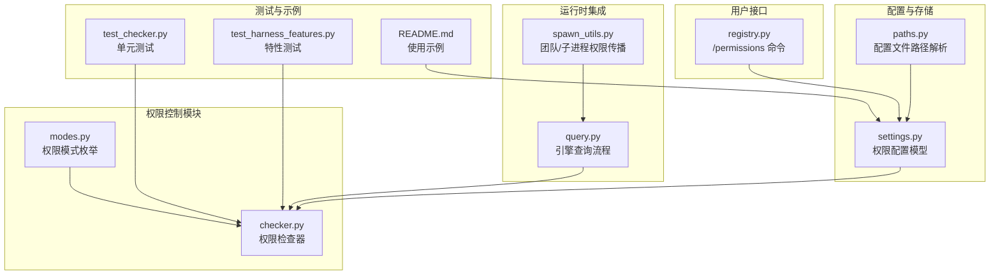
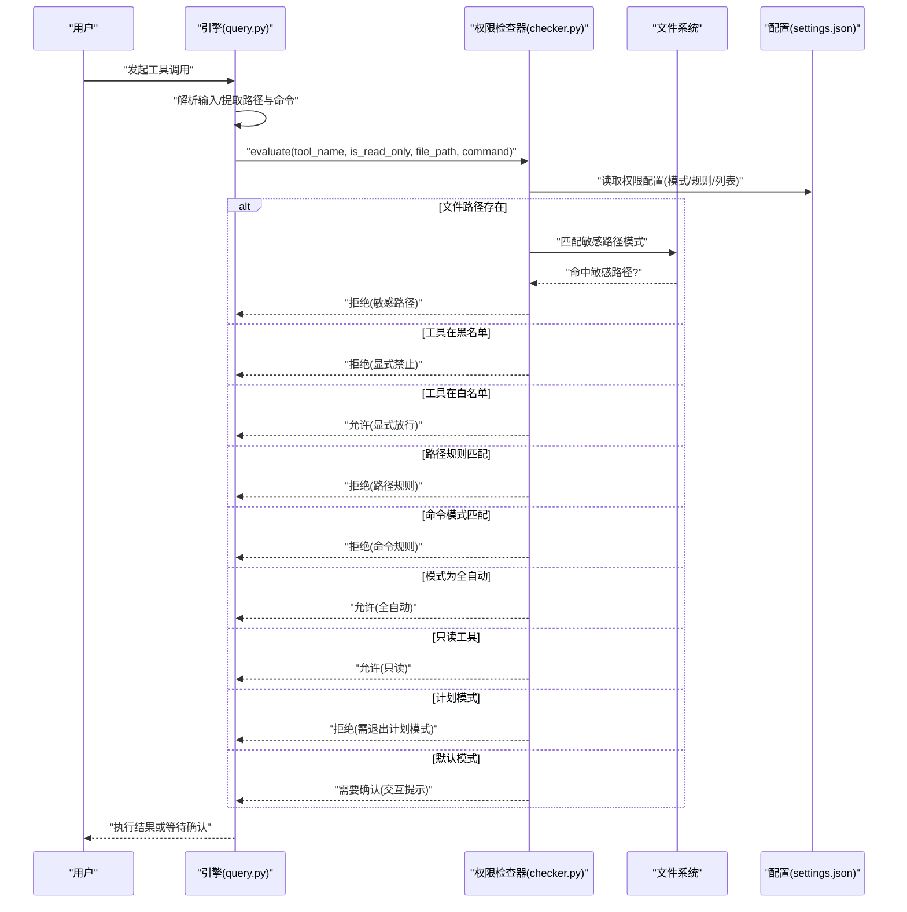
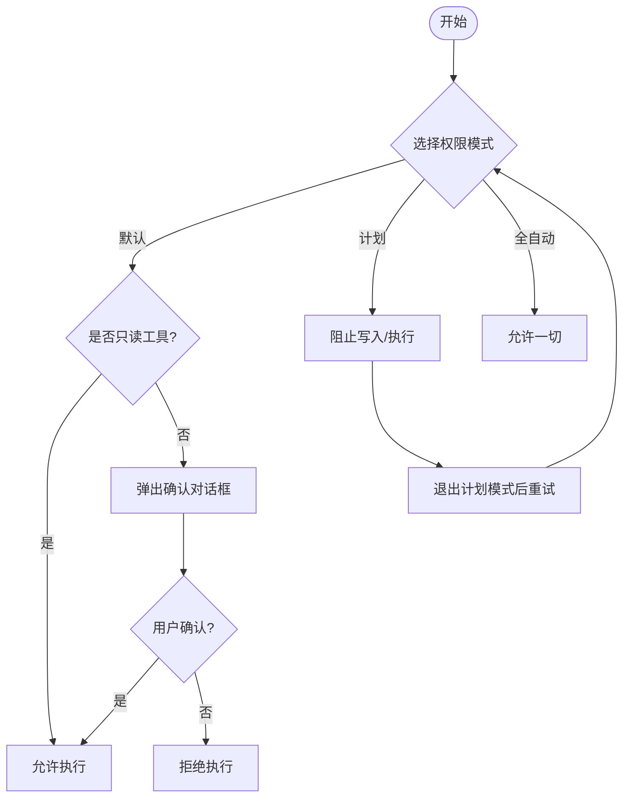
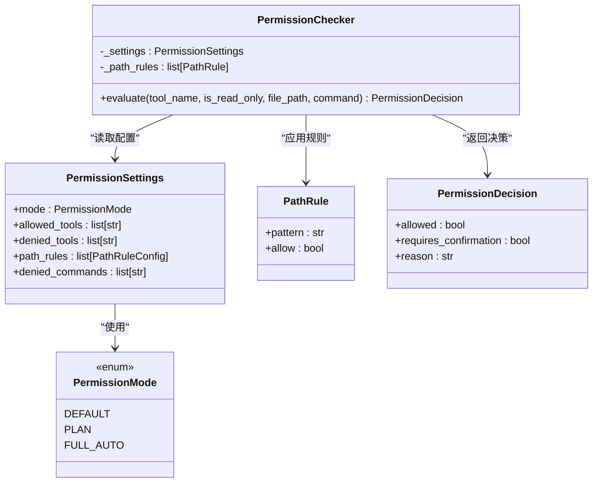
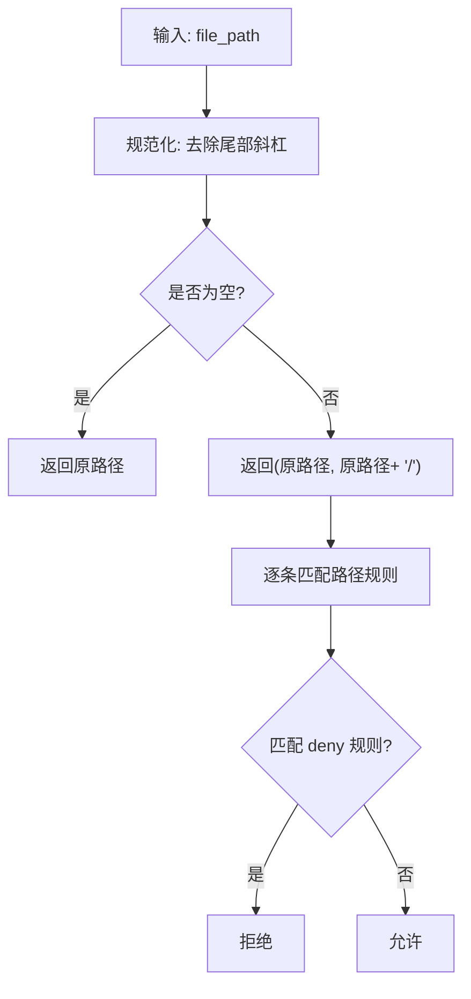
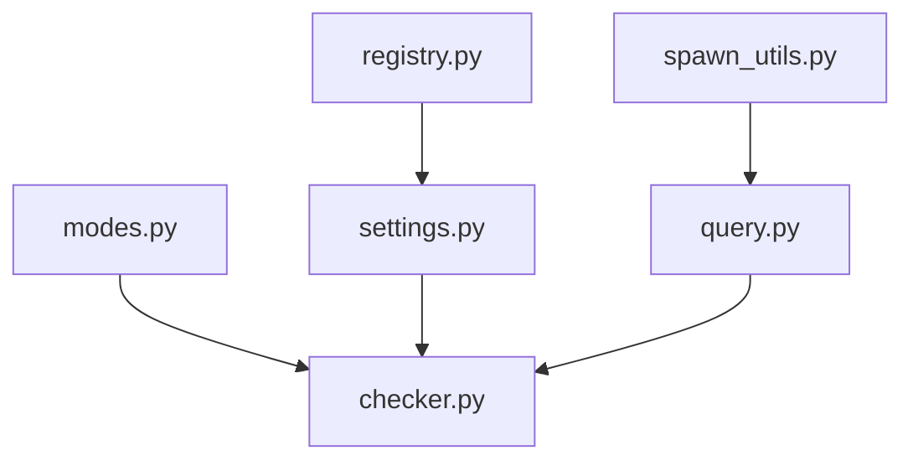

# 权限控制选项

<cite>
**本文档引用的文件**
- [checker.py](file://src/openharness/permissions/checker.py)
- [modes.py](file://src/openharness/permissions/modes.py)
- [settings.py](file://src/openharness/config/settings.py)
- [registry.py](file://src/openharness/commands/registry.py)
- [query.py](file://src/openharness/engine/query.py)
- [paths.py](file://src/openharness/config/paths.py)
- [spawn_utils.py](file://src/openharness/swarm/spawn_utils.py)
- [test_checker.py](file://tests/test_permissions/test_checker.py)
- [test_harness_features.py](file://scripts/test_harness_features.py)
- [README.md](file://README.md)
</cite>

## 目录
1. [简介](#简介)
2. [项目结构](#项目结构)
3. [核心组件](#核心组件)
4. [架构总览](#架构总览)
5. [详细组件分析](#详细组件分析)
6. [依赖关系分析](#依赖关系分析)
7. [性能考虑](#性能考虑)
8. [故障排除指南](#故障排除指南)
9. [结论](#结论)
10. [附录](#附录)

## 简介
本指南面向使用 OpenHarness 的开发者与运维人员，系统讲解权限控制选项的配置与使用方法。重点涵盖：
- --permission-mode 参数的三种模式（strict、permissive、custom）及其安全级别差异
- 权限检查机制、路径规则配置与命令过滤系统的工作原理
- 不同使用场景下的权限配置最佳实践（开发环境、生产环境、受限环境）
- 权限规则的语法说明与实际配置示例

OpenHarness 的权限子系统通过多层策略实现安全边界：内置敏感路径保护、工具白/黑名单、路径级规则、命令模式匹配以及运行时交互确认。

## 项目结构
权限控制相关代码主要分布在以下模块：
- 权限核心：permissions/checker.py、permissions/modes.py
- 配置模型：config/settings.py、config/paths.py
- 命令接口：commands/registry.py（/permissions 命令）
- 运行时集成：engine/query.py（工具调用前的权限检查）
- 多进程/团队协作：swarm/spawn_utils.py（子进程继承权限模式）
- 测试与示例：tests/test_permissions/test_checker.py、scripts/test_harness_features.py、README.md

**图表来源**
- [modes.py:1-14](file://src/openharness/permissions/modes.py#L1-L14)
- [checker.py:1-201](file://src/openharness/permissions/checker.py#L1-L201)
- [settings.py:50-58](file://src/openharness/config/settings.py#L50-L58)
- [paths.py:15-35](file://src/openharness/config/paths.py#L15-L35)
- [query.py:902-935](file://src/openharness/engine/query.py#L902-L935)
- [spawn_utils.py:140-152](file://src/openharness/swarm/spawn_utils.py#L140-L152)
- [registry.py:1480-1522](file://src/openharness/commands/registry.py#L1480-L1522)
- [test_checker.py:1-231](file://tests/test_permissions/test_checker.py#L1-L231)
- [test_harness_features.py:156-189](file://scripts/test_harness_features.py#L156-L189)
- [README.md:616-635](file://README.md#L616-L635)

**章节来源**
- [modes.py:1-14](file://src/openharness/permissions/modes.py#L1-L14)
- [checker.py:1-201](file://src/openharness/permissions/checker.py#L1-L201)
- [settings.py:50-58](file://src/openharness/config/settings.py#L50-L58)
- [paths.py:15-35](file://src/openharness/config/paths.py#L15-L35)
- [query.py:902-935](file://src/openharness/engine/query.py#L902-L935)
- [spawn_utils.py:140-152](file://src/openharness/swarm/spawn_utils.py#L140-L152)
- [registry.py:1480-1522](file://src/openharness/commands/registry.py#L1480-L1522)
- [test_checker.py:1-231](file://tests/test_permissions/test_checker.py#L1-L231)
- [test_harness_features.py:156-189](file://scripts/test_harness_features.py#L156-L189)
- [README.md:616-635](file://README.md#L616-L635)

## 核心组件
- 权限模式（PermissionMode）：定义默认、计划模式、全自动三种模式，作为权限检查的总体策略。
- 权限检查器（PermissionChecker）：根据模式、工具白/黑名单、路径规则、命令模式匹配进行决策，返回允许或需要确认的结果。
- 权限配置（PermissionSettings）：承载 mode、allowed_tools、denied_tools、path_rules、denied_commands 等字段。
- 命令接口（/permissions）：提供查看与切换权限模式的能力，并持久化到配置文件。
- 运行时集成：引擎在执行工具前调用权限检查器，确保每次操作都经过策略评估。

**章节来源**
- [modes.py:8-14](file://src/openharness/permissions/modes.py#L8-L14)
- [checker.py:57-156](file://src/openharness/permissions/checker.py#L57-L156)
- [settings.py:50-58](file://src/openharness/config/settings.py#L50-L58)
- [registry.py:1480-1522](file://src/openharness/commands/registry.py#L1480-L1522)
- [query.py:902-935](file://src/openharness/engine/query.py#L902-L935)

## 架构总览
下图展示了从用户输入到工具执行的完整权限检查流程，包括内置敏感路径保护、路径规则、命令过滤与模式决策。

**图表来源**
- [query.py:902-935](file://src/openharness/engine/query.py#L902-L935)
- [checker.py:75-156](file://src/openharness/permissions/checker.py#L75-L156)
- [settings.py:50-58](file://src/openharness/config/settings.py#L50-L58)

**章节来源**
- [query.py:902-935](file://src/openharness/engine/query.py#L902-L935)
- [checker.py:75-156](file://src/openharness/permissions/checker.py#L75-L156)
- [settings.py:50-58](file://src/openharness/config/settings.py#L50-L58)

## 详细组件分析

### 权限模式与安全级别
- 默认模式（default）
  - 行为：只读工具直接允许；写入/执行类工具需要用户确认。
  - 安全级别：中等，适合日常开发与探索性工作流。
  - 适用场景：本地开发、学习实验、需要人机协同的场景。
- 计划模式（plan）
  - 行为：阻止所有写入/执行类工具，直到退出计划模式。
  - 安全级别：高，适合大规模重构、代码审查、变更评审。
  - 适用场景：代码重构、批量修改、发布前审查。
- 全自动（full_auto）
  - 行为：允许一切工具调用，不进行交互确认。
  - 安全级别：低，仅建议在受控沙箱或隔离环境中使用。
  - 适用场景：自动化流水线、受控测试环境、无人值守任务。

**图表来源**
- [modes.py:8-14](file://src/openharness/permissions/modes.py#L8-L14)
- [checker.py:132-156](file://src/openharness/permissions/checker.py#L132-L156)

**章节来源**
- [modes.py:8-14](file://src/openharness/permissions/modes.py#L8-L14)
- [checker.py:132-156](file://src/openharness/permissions/checker.py#L132-L156)

### 权限检查机制
权限检查器按优先级顺序评估以下条件：
1. 内置敏感路径保护：无论模式为何，均拒绝访问常见凭证与密钥文件目录。
2. 显式工具黑名单：命中即拒绝。
3. 显式工具白名单：命中即允许。
4. 路径规则匹配：对文件路径应用 glob 规则，deny 优先于 allow。
5. 命令模式匹配：对命令字符串应用 fnmatch 模式，匹配即拒绝。
6. 模式判定：
   - 全自动：允许。
   - 只读工具：允许。
   - 计划模式：拒绝。
   - 默认模式：需要确认。

**图表来源**
- [checker.py:57-156](file://src/openharness/permissions/checker.py#L57-L156)
- [settings.py:50-58](file://src/openharness/config/settings.py#L50-L58)
- [modes.py:8-14](file://src/openharness/permissions/modes.py#L8-L14)

**章节来源**
- [checker.py:57-156](file://src/openharness/permissions/checker.py#L57-L156)
- [settings.py:50-58](file://src/openharness/config/settings.py#L50-L58)
- [modes.py:8-14](file://src/openharness/permissions/modes.py#L8-L14)

### 路径规则配置
- 规则类型：PathRuleConfig，包含 pattern（glob 模式）与 allow（布尔）。
- 解析逻辑：忽略空/非字符串 pattern，保留有效规则。
- 匹配策略：对目录型工具，会同时匹配“去除尾斜杠”和“带尾斜杠”的路径形式，确保 /etc 与 /etc/ 均被规则覆盖。
- 示例：禁止访问 /etc/* 下的所有文件，允许特定数据目录。

**图表来源**
- [checker.py:159-169](file://src/openharness/permissions/checker.py#L159-L169)
- [settings.py:43-48](file://src/openharness/config/settings.py#L43-L48)

**章节来源**
- [checker.py:159-169](file://src/openharness/permissions/checker.py#L159-L169)
- [settings.py:43-48](file://src/openharness/config/settings.py#L43-L48)

### 命令过滤系统
- 支持对命令字符串进行 fnmatch 模式匹配，用于阻断高风险命令（如 rm -rf /）。
- 与路径规则配合，可针对“安装包管理器命令”给出额外提示，提醒用户这些命令会改变工作区。

**章节来源**
- [checker.py:120-127](file://src/openharness/permissions/checker.py#L120-L127)
- [checker.py:172-200](file://src/openharness/permissions/checker.py#L172-L200)

### 命令接口：/permissions
- 查看当前模式与工具黑白名单。
- 设置模式：default、plan、full_auto。
- 切换后立即保存配置并更新运行时权限检查器。
- 该命令为本地命令，且支持远程管理员显式 opt-in。

**章节来源**
- [registry.py:1480-1522](file://src/openharness/commands/registry.py#L1480-L1522)

### 运行时集成与团队协作
- 引擎在执行工具前调用权限检查器，记录调试日志并输出决策原因。
- 子进程与团队成员在启动时可继承父进程的权限模式，避免重复检测带来的不一致。

**章节来源**
- [query.py:902-935](file://src/openharness/engine/query.py#L902-L935)
- [spawn_utils.py:140-152](file://src/openharness/swarm/spawn_utils.py#L140-L152)

## 依赖关系分析
- 权限模式与检查器：modes.py 提供枚举，checker.py 使用其值进行分支判断。
- 配置模型：settings.py 中的 PermissionSettings 为 checker.py 提供规则来源。
- 命令接口：commands/registry.py 读取/写入配置并刷新运行时检查器。
- 运行时：engine/query.py 在工具执行前统一调用权限检查器。
- 团队协作：swarm/spawn_utils.py 将权限模式传递给子进程，保证一致性。

**图表来源**
- [modes.py:8-14](file://src/openharness/permissions/modes.py#L8-L14)
- [checker.py:57-156](file://src/openharness/permissions/checker.py#L57-L156)
- [settings.py:50-58](file://src/openharness/config/settings.py#L50-L58)
- [registry.py:1480-1522](file://src/openharness/commands/registry.py#L1480-L1522)
- [query.py:902-935](file://src/openharness/engine/query.py#L902-L935)
- [spawn_utils.py:140-152](file://src/openharness/swarm/spawn_utils.py#L140-L152)

**章节来源**
- [modes.py:8-14](file://src/openharness/permissions/modes.py#L8-L14)
- [checker.py:57-156](file://src/openharness/permissions/checker.py#L57-L156)
- [settings.py:50-58](file://src/openharness/config/settings.py#L50-L58)
- [registry.py:1480-1522](file://src/openharness/commands/registry.py#L1480-L1522)
- [query.py:902-935](file://src/openharness/engine/query.py#L902-L935)
- [spawn_utils.py:140-152](file://src/openharness/swarm/spawn_utils.py#L140-L152)

## 性能考虑
- 权限检查为常量时间复杂度，规则数量有限，开销可忽略。
- 路径规则匹配采用 fnmatch，对 glob 模式进行线性扫描；建议合理组织规则数量与层级，避免过多嵌套通配导致匹配成本上升。
- 命令模式匹配同样为线性扫描，建议将高频高风险命令放在前面，减少后续匹配次数。
- 对于大型目录扫描工具（如 grep、glob），路径规范化确保规则能正确匹配根目录本身，避免遗漏。

[本节为通用指导，无需特定文件引用]

## 故障排除指南
- 问题：工具被意外拒绝
  - 检查是否命中敏感路径保护（如 ~/.ssh、~/.aws 等）。
  - 检查工具是否在 denied_tools 列表中。
  - 检查路径规则是否误伤目标路径。
  - 检查命令是否匹配 denied_commands。
  - 检查当前模式是否为 PLAN 或 DEFAULT 且未确认。
- 问题：路径规则无效
  - 确认 pattern 是否为非空字符串且为字符串类型。
  - 确认路径末尾斜杠处理是否符合预期（目录型工具会同时尝试带/与不带/两种形式）。
- 问题：子进程权限不一致
  - 确认父进程已正确设置权限模式并保存配置。
  - 确认子进程是否继承了正确的权限模式标志。

**章节来源**
- [test_checker.py:77-84](file://tests/test_permissions/test_checker.py#L77-L84)
- [test_checker.py:87-130](file://tests/test_permissions/test_checker.py#L87-L130)
- [test_checker.py:135-231](file://tests/test_permissions/test_checker.py#L135-L231)
- [test_harness_features.py:156-189](file://scripts/test_harness_features.py#L156-L189)

## 结论
OpenHarness 的权限控制系统以“最小授权 + 分层防护”为核心设计原则：内置敏感路径保护提供防御纵深，路径规则与命令过滤提供细粒度控制，模式切换满足不同场景的安全需求。通过 /permissions 命令与配置文件，用户可以灵活地在安全性与可用性之间取得平衡。

[本节为总结性内容，无需特定文件引用]

## 附录

### 使用场景与最佳实践
- 开发环境
  - 推荐模式：默认模式
  - 原因：兼顾安全与效率，写入/执行类操作需要确认，适合日常开发。
  - 建议：为常用工具添加白名单，减少频繁确认。
- 生产环境
  - 推荐模式：计划模式或全自动（受控沙箱）
  - 原因：计划模式可强制先评审再变更；全自动仅在严格沙箱与审计日志下使用。
  - 建议：结合路径规则限制关键目录访问，命令过滤阻断高危命令。
- 受限环境
  - 推荐模式：全自动（仅限隔离沙箱）
  - 原因：最大化自动化能力，但必须配合网络与文件系统限制。
  - 建议：严格限制 denied_commands 与 path_rules，启用敏感路径保护。

[本节为通用指导，无需特定文件引用]

### 权限规则语法说明
- 字段
  - mode：权限模式（default、plan、full_auto）
  - allowed_tools：允许的工具名称列表
  - denied_tools：禁止的工具名称列表
  - path_rules：路径规则数组，每项包含 pattern（glob 模式）与 allow（布尔）
  - denied_commands：禁止的命令模式列表（fnmatch）

- 示例（settings.json）
  - 模式与路径规则示例：参见 README 中的“路径级规则”示例。
  - 命令过滤示例：参考特性测试脚本中的 denied_commands 配置。

**章节来源**
- [README.md:616-635](file://README.md#L616-L635)
- [test_harness_features.py:156-189](file://scripts/test_harness_features.py#L156-L189)