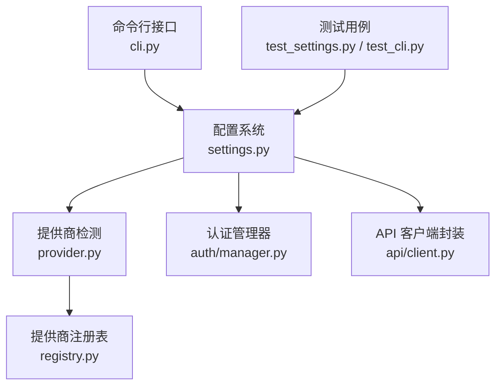
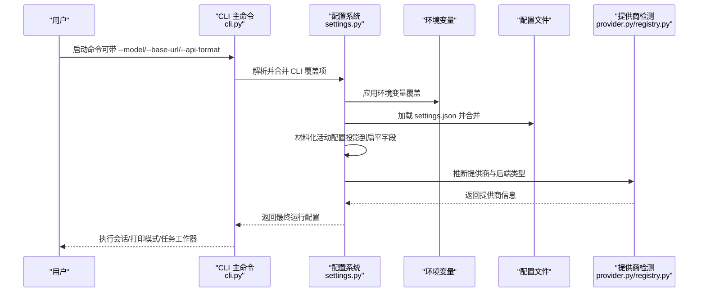
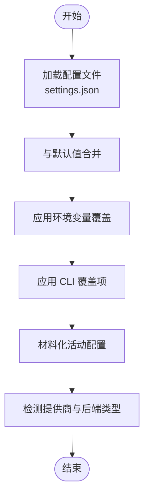
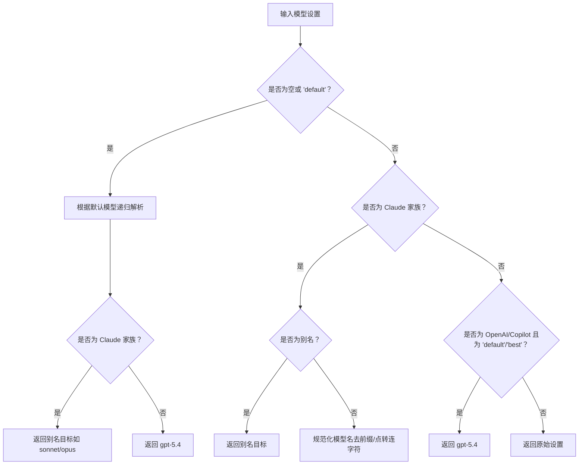
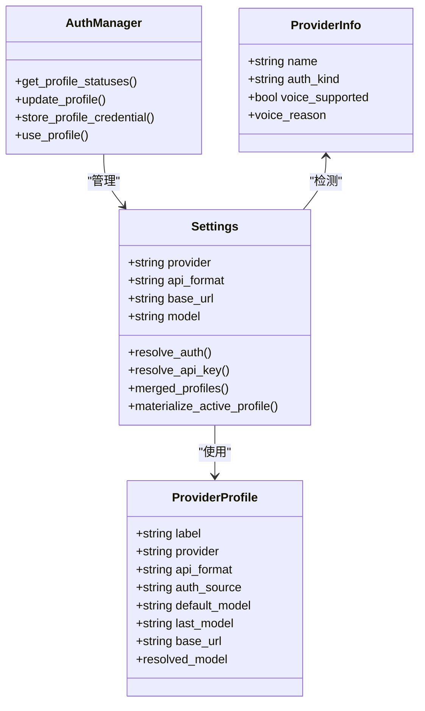
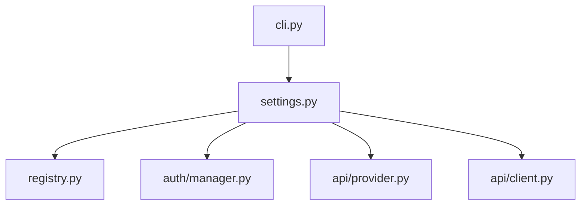

# 模型配置选项

<cite>
**本文档引用的文件**
- [settings.py](file://src/openharness/config/settings.py)
- [cli.py](file://src/openharness/cli.py)
- [provider.py](file://src/openharness/api/provider.py)
- [registry.py](file://src/openharness/api/registry.py)
- [client.py](file://src/openharness/api/client.py)
- [manager.py](file://src/openharness/auth/manager.py)
- [test_settings.py](file://tests/test_config/test_settings.py)
- [test_cli.py](file://tests/test_commands/test_cli.py)
</cite>

## 目录
1. [简介](#简介)
2. [项目结构](#项目结构)
3. [核心组件](#核心组件)
4. [架构总览](#架构总览)
5. [详细组件分析](#详细组件分析)
6. [依赖关系分析](#依赖关系分析)
7. [性能考虑](#性能考虑)
8. [故障排除指南](#故障排除指南)
9. [结论](#结论)
10. [附录](#附录)

## 简介
本指南面向 OpenHarness 的用户提供模型配置选项的完整使用说明，重点围绕以下关键参数展开：
- --model：模型别名或具体模型 ID
- --base-url：API 基础 URL
- --api-format：API 兼容格式（anthropic、openai、copilot）

文档将解释这些参数的作用机制、配置语法、取值范围，并提供针对不同 AI 提供商（如 Anthropic、OpenAI、GitHub Copilot 等）的配置示例。同时涵盖配置优先级、环境变量覆盖、配置文件合并机制，以及常见配置错误的诊断与解决方法。

## 项目结构
与模型配置相关的核心模块包括：
- 配置加载与合并：settings.py
- CLI 参数解析与调用：cli.py
- 提供商能力检测：provider.py、registry.py
- 认证与凭据管理：auth/manager.py
- 客户端封装与重试：api/client.py
- 测试验证：tests/test_config/test_settings.py、tests/test_commands/test_cli.py

图表来源
- [cli.py:2146-2260](file://src/openharness/cli.py#L2146-L2260)
- [settings.py:534-626](file://src/openharness/config/settings.py#L534-L626)
- [provider.py:42-94](file://src/openharness/api/provider.py#L42-L94)
- [registry.py:408-437](file://src/openharness/api/registry.py#L408-L437)
- [client.py:118-151](file://src/openharness/api/client.py#L118-L151)
- [manager.py:291-318](file://src/openharness/auth/manager.py#L291-L318)

章节来源
- [settings.py:1-8](file://src/openharness/config/settings.py#L1-L8)
- [cli.py:2146-2260](file://src/openharness/cli.py#L2146-L2260)

## 核心组件
- 配置模型 Settings：集中管理模型、API 格式、基础 URL、提供商等字段，并提供配置合并、环境变量覆盖、材料化（投影）等功能。
- 提供商配置 ProviderProfile：按“配置文件名”组织的命名工作流，包含提供商标识、API 格式、认证来源、默认/最近使用的模型、基础 URL、上下文窗口等。
- CLI 主命令与子命令：支持 --model、--base-url、--api-format 等参数，以及 provider 子命令用于增删改查配置文件中的提供商配置。
- 认证管理器 AuthManager：负责列出/切换/更新提供商配置，检查认证状态，存储/清除凭据。
- 提供商检测：根据模型名、API Key 前缀、基础 URL 关键词自动推断提供商类型与后端类型（anthropic/openai_compat/copilot）。
- 客户端封装：对 Anthropic SDK 进行轻量封装，统一错误翻译与重试逻辑。

章节来源
- [settings.py:116-139](file://src/openharness/config/settings.py#L116-L139)
- [settings.py:534-626](file://src/openharness/config/settings.py#L534-L626)
- [cli.py:2047-2091](file://src/openharness/cli.py#L2047-L2091)
- [manager.py:291-318](file://src/openharness/auth/manager.py#L291-L318)
- [provider.py:42-94](file://src/openharness/api/provider.py#L42-L94)
- [registry.py:408-437](file://src/openharness/api/registry.py#L408-L437)
- [client.py:118-151](file://src/openharness/api/client.py#L118-L151)

## 架构总览
OpenHarness 的模型配置遵循“CLI 参数 > 环境变量 > 配置文件 > 默认值”的优先级顺序。配置加载流程如下：

图表来源
- [cli.py:2340-2483](file://src/openharness/cli.py#L2340-L2483)
- [settings.py:848-875](file://src/openharness/config/settings.py#L848-L875)
- [settings.py:972-1008](file://src/openharness/config/settings.py#L972-L1008)
- [provider.py:42-94](file://src/openharness/api/provider.py#L42-L94)
- [registry.py:408-437](file://src/openharness/api/registry.py#L408-L437)

## 详细组件分析

### 参数作用与取值范围
- --model（-m）
  - 作用：指定模型别名或完整模型 ID。支持内置别名（如 sonnet、opus、haiku、best、opusplan 等），以及直接传入具体模型 ID。
  - 取值范围：字符串；对于 Claude 家族提供商会进行别名解析与规范化；对于 OpenAI/Copilot 家族提供商会保留原样或映射为推荐 ID。
  - 行为细节：当配置文件中存在 profile.last_model 或默认值时，会按规则解析为最终运行模型 ID；ANSI 转义序列会被清洗。
- --base-url
  - 作用：指定 API 基础 URL，用于兼容第三方网关或本地部署。
  - 取值范围：HTTP/HTTPS URL 字符串；若未显式设置且存在环境变量，则按优先级应用。
  - 行为细节：对于第三方 Anthropic 端点，订阅版认证有特殊限制（详见故障排除）。
- --api-format
  - 作用：声明 API 兼容格式，决定后端类型与认证方式。
  - 取值范围："anthropic"、"openai"、"copilot"；对应不同的后端类型与环境变量前缀。

章节来源
- [cli.py:2146-2152](file://src/openharness/cli.py#L2146-L2152)
- [cli.py:2236-2241](file://src/openharness/cli.py#L2236-L2241)
- [cli.py:2255-2260](file://src/openharness/cli.py#L2255-L2260)
- [settings.py:307-345](file://src/openharness/config/settings.py#L307-L345)
- [settings.py:894-901](file://src/openharness/config/settings.py#L894-L901)
- [settings.py:903-910](file://src/openharness/config/settings.py#L903-L910)

### 配置优先级与合并机制
- 优先级（从高到低）：CLI 覆盖项 > 环境变量 > 配置文件 > 默认值
- 合并策略：
  - CLI 覆盖项通过 merge_cli_overrides 应用，仅对非空值生效，并在必要时同步活动配置到配置文件层。
  - 环境变量覆盖通过 _apply_env_overrides 应用，支持 OPENHARNESS_* 通用变量与提供商特定变量（如 ANTHROPIC_BASE_URL、OPENAI_BASE_URL、ANTHROPIC_MODEL 等）。当活动配置已显式设置某字段时，通用提供商变量不会覆盖。
  - 配置文件 settings.json 中的字段与默认值合并，支持 profiles 与 active_profile 的组合。
  - 材料化（materialize_active_profile）将活动配置回写到扁平字段（provider、api_format、base_url、model 等），便于后续流程使用。

图表来源
- [settings.py:972-1008](file://src/openharness/config/settings.py#L972-L1008)
- [settings.py:878-964](file://src/openharness/config/settings.py#L878-L964)
- [settings.py:848-875](file://src/openharness/config/settings.py#L848-L875)
- [settings.py:606-626](file://src/openharness/config/settings.py#L606-L626)
- [provider.py:42-94](file://src/openharness/api/provider.py#L42-L94)

章节来源
- [settings.py:3-8](file://src/openharness/config/settings.py#L3-L8)
- [settings.py:848-875](file://src/openharness/config/settings.py#L848-L875)
- [settings.py:878-964](file://src/openharness/config/settings.py#L878-L964)
- [settings.py:972-1008](file://src/openharness/config/settings.py#L972-L1008)
- [settings.py:606-626](file://src/openharness/config/settings.py#L606-L626)

### 模型别名解析与规范化
- 别名解析：支持 sonnet、opus、haiku、best、opusplan 等别名；opusplan 在计划模式下解析为 opus，在其他模式下解析为 sonnet。
- 规范化：对 Claude 模型名称进行前缀去除与点号到连字符的转换，确保与运行时期望一致。
- 显示逻辑：当 last_model 为空且为 Claude 家族时，显示为 "default"；否则显示 last_model 或 default_model。

图表来源
- [settings.py:307-345](file://src/openharness/config/settings.py#L307-L345)
- [settings.py:172-185](file://src/openharness/config/settings.py#L172-L185)

章节来源
- [settings.py:152-169](file://src/openharness/config/settings.py#L152-L169)
- [settings.py:307-345](file://src/openharness/config/settings.py#L307-L345)
- [settings.py:172-185](file://src/openharness/config/settings.py#L172-L185)

### 认证与提供商配置
- 认证来源：根据 api_format 与 provider 决定认证方式（API Key、OAuth、订阅桥接等）。
- 认证解析：优先使用环境变量或外部绑定，其次使用配置文件中的 api_key，最后抛出明确错误提示。
- 提供商检测：通过 ProviderSpec 注册表匹配 API Key 前缀、基础 URL 关键词、模型关键字，自动推断后端类型与默认 Base URL。

图表来源
- [settings.py:534-626](file://src/openharness/config/settings.py#L534-L626)
- [settings.py:116-139](file://src/openharness/config/settings.py#L116-L139)
- [manager.py:291-318](file://src/openharness/auth/manager.py#L291-L318)
- [provider.py:32-94](file://src/openharness/api/provider.py#L32-L94)

章节来源
- [settings.py:691-728](file://src/openharness/config/settings.py#L691-L728)
- [settings.py:730-846](file://src/openharness/config/settings.py#L730-L846)
- [provider.py:42-94](file://src/openharness/api/provider.py#L42-L94)
- [registry.py:17-49](file://src/openharness/api/registry.py#L17-L49)

### 不同提供商的配置示例
以下示例展示从默认配置到自定义提供商的完整设置过程（以路径引用代替具体代码内容）：
- 使用内置 OpenAI 兼容配置
  - 步骤：oh provider add openai-compatible --label "OpenAI" --provider openai --api-format openai --auth-source openai_api_key --model gpt-5.4
  - 验证：oh provider show
- 使用 Moonshot/Kimi（OpenAI 兼容）
  - 步骤：oh provider add moonshot --label "Moonshot" --provider moonshot --api-format openai --base-url https://api.moonshot.cn/v1 --model kimi-k2.5
  - 验证：oh provider show
- 使用 GitHub Copilot
  - 步骤：oh provider add copilot --label "Copilot" --provider copilot --api-format copilot
  - 验证：oh provider show
- 使用自定义第三方网关（如 OpenRouter）
  - 步骤：oh provider edit <profile> --base-url https://openrouter.ai/api/v1 --api-format openai
  - 验证：oh provider show

章节来源
- [test_cli.py:157-186](file://tests/test_commands/test_cli.py#L157-L186)
- [test_settings.py:169-191](file://tests/test_config/test_settings.py#L169-L191)

### 环境变量覆盖与配置文件合并
- 支持的环境变量：
  - OPENHARNESS_MODEL、OPENHARNESS_BASE_URL、OPENHARNESS_API_FORMAT、OPENHARNESS_PROVIDER、OPENHARNESS_MAX_TOKENS、OPENHARNESS_TIMEOUT、OPENHARNESS_MAX_TURNS、OPENHARNESS_CONTEXT_WINDOW_TOKENS、OPENHARNESS_AUTO_COMPACT_THRESHOLD_TOKENS、OPENHARNESS_SANDBOX_ENABLED、OPENHARNESS_SANDBOX_FAIL_IF_UNAVAILABLE、OPENHARNESS_SANDBOX_BACKEND、OPENHARNESS_SANDBOX_DOCKER_IMAGE
  - ANTHROPIC_MODEL、ANTHROPIC_BASE_URL、ANTHROPIC_API_KEY、OPENAI_API_KEY、OPENAI_BASE_URL
- 合并规则：当活动配置未显式设置某字段时，通用提供商变量才会生效；OPENHARNESS_* 变量始终覆盖。

章节来源
- [settings.py:878-964](file://src/openharness/config/settings.py#L878-L964)
- [settings.py:972-1008](file://src/openharness/config/settings.py#L972-L1008)

## 依赖关系分析
- CLI 依赖配置系统进行参数解析与覆盖，再由配置系统驱动提供商检测与认证解析。
- 配置系统依赖注册表进行提供商自动识别，依赖认证管理器进行凭据存储与校验。
- 客户端封装依赖配置系统提供的模型、基础 URL、认证信息等参数。

图表来源
- [cli.py:2340-2483](file://src/openharness/cli.py#L2340-L2483)
- [settings.py:534-626](file://src/openharness/config/settings.py#L534-L626)
- [registry.py:408-437](file://src/openharness/api/registry.py#L408-L437)
- [manager.py:291-318](file://src/openharness/auth/manager.py#L291-L318)
- [provider.py:42-94](file://src/openharness/api/provider.py#L42-L94)
- [client.py:118-151](file://src/openharness/api/client.py#L118-L151)

章节来源
- [cli.py:2340-2483](file://src/openharness/cli.py#L2340-L2483)
- [settings.py:534-626](file://src/openharness/config/settings.py#L534-L626)

## 性能考虑
- 配置加载与合并为内存操作，开销极小。
- 环境变量覆盖与 ANSI 清洗在加载阶段完成，避免运行时重复计算。
- 客户端封装采用指数退避与抖动的重试策略，提升网络不稳定场景下的成功率。

## 故障排除指南
- “未找到 API 密钥”
  - 现象：resolve_api_key/resolve_auth 抛出异常。
  - 排查：确认 api_format 对应的环境变量（ANTHROPIC_API_KEY 或 OPENAI_API_KEY）是否设置；或在配置文件中设置 api_key；或使用认证管理器配置外部绑定。
  - 参考：[settings.py:691-728](file://src/openharness/config/settings.py#L691-L728)
- “第三方 Anthropic 端点不支持订阅版认证”
  - 现象：当 base_url 指向第三方 Anthropic 网关且使用订阅版认证时抛出异常。
  - 解决：改用 API Key 方式的 Anthropic 兼容配置，或使用订阅版认证但指向官方端点。
  - 参考：[settings.py:749-755](file://src/openharness/config/settings.py#L749-L755)
- “模型别名解析不符合预期”
  - 现象：输入别名后未得到期望的运行模型 ID。
  - 排查：确认 provider 是否为 Claude 家族；检查 permission.mode 是否影响 opusplan 的解析；查看 display_model_setting 的显示逻辑。
  - 参考：[settings.py:307-345](file://src/openharness/config/settings.py#L307-L345)
- “环境变量未生效”
  - 现象：设置了 ANTHROPIC_BASE_URL/OPENAI_BASE_URL/OPENHARNESS_MODEL 等但未生效。
  - 排查：若活动配置已显式设置相应字段，通用提供商变量不会覆盖；请检查 OPENHARNESS_* 通用变量或调整活动配置。
  - 参考：[settings.py:881-884](file://src/openharness/config/settings.py#L881-L884)
- “CLI 覆盖项未合并到配置文件层”
  - 现象：通过 CLI 设置的 --model/--base-url 等未反映在配置文件中。
  - 排查：merge_cli_overrides 仅在需要同步到配置文件层时才触发；如需持久化，请使用 provider 子命令或保存设置。
  - 参考：[settings.py:848-875](file://src/openharness/config/settings.py#L848-L875)

章节来源
- [settings.py:691-728](file://src/openharness/config/settings.py#L691-L728)
- [settings.py:749-755](file://src/openharness/config/settings.py#L749-L755)
- [settings.py:307-345](file://src/openharness/config/settings.py#L307-L345)
- [settings.py:881-884](file://src/openharness/config/settings.py#L881-L884)
- [settings.py:848-875](file://src/openharness/config/settings.py#L848-L875)

## 结论
OpenHarness 的模型配置体系通过清晰的优先级与强大的合并机制，实现了灵活而可靠的多提供商支持。理解 --model、--base-url、--api-format 的作用与交互，结合环境变量覆盖与配置文件管理，可以快速适配从官方平台到第三方网关的各种场景。遇到问题时，可依据本文档的故障排除指南逐项排查，通常能迅速定位并解决问题。

## 附录
- 常用命令参考
  - 查看/编辑提供商配置：oh provider show/list/add/edit/remove/clear
  - 会话启动参数：--model/-m、--base-url、--api-format、--api-key/-k、--system-prompt/-s、--permission-mode 等
- 测试用例参考
  - 配置加载与覆盖：tests/test_config/test_settings.py
  - CLI 提供商配置流程：tests/test_commands/test_cli.py