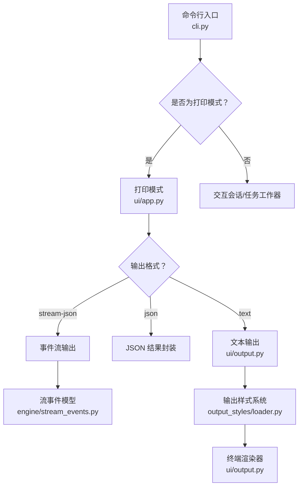
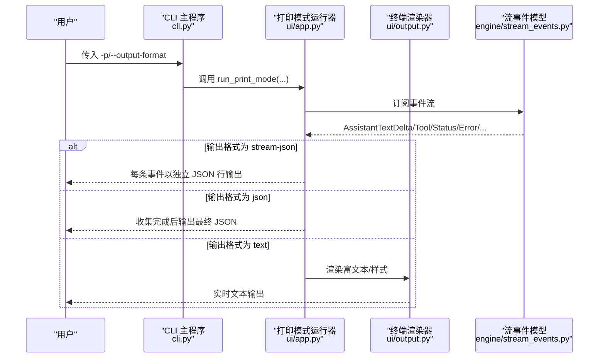
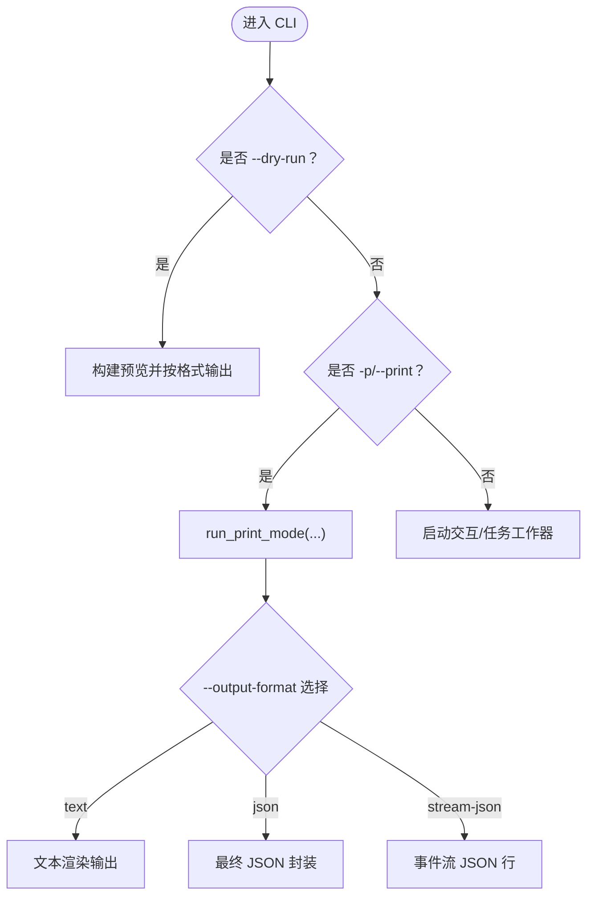
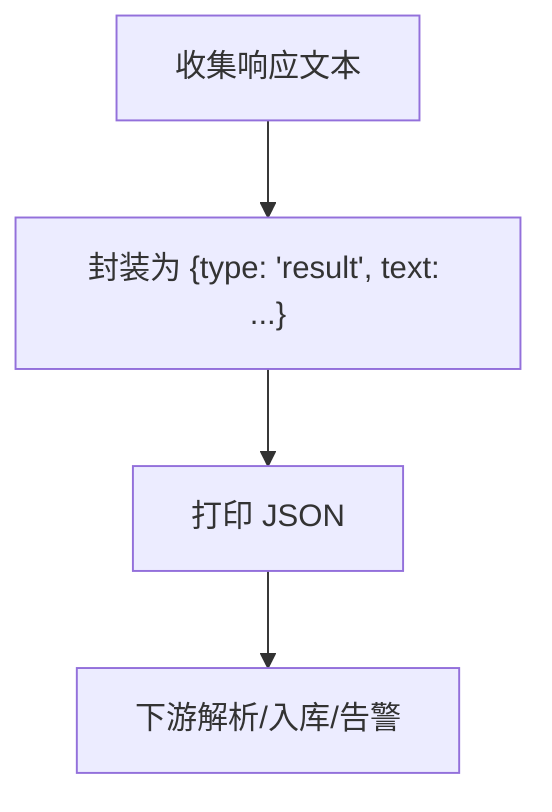
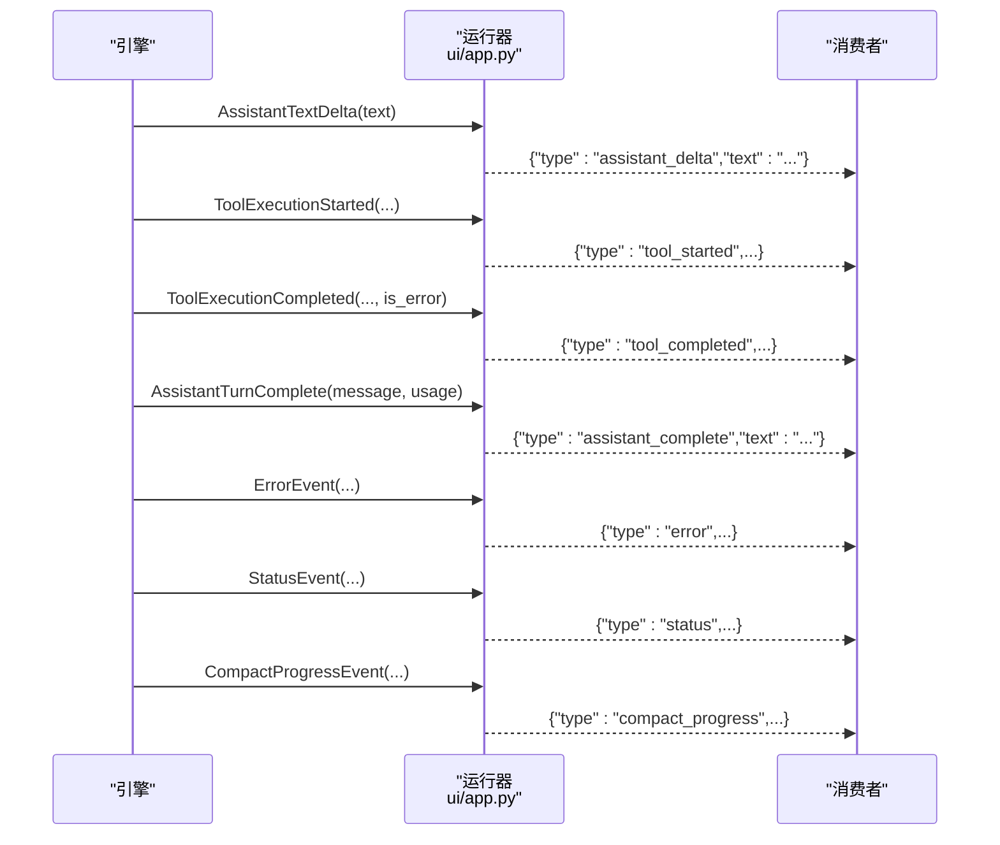
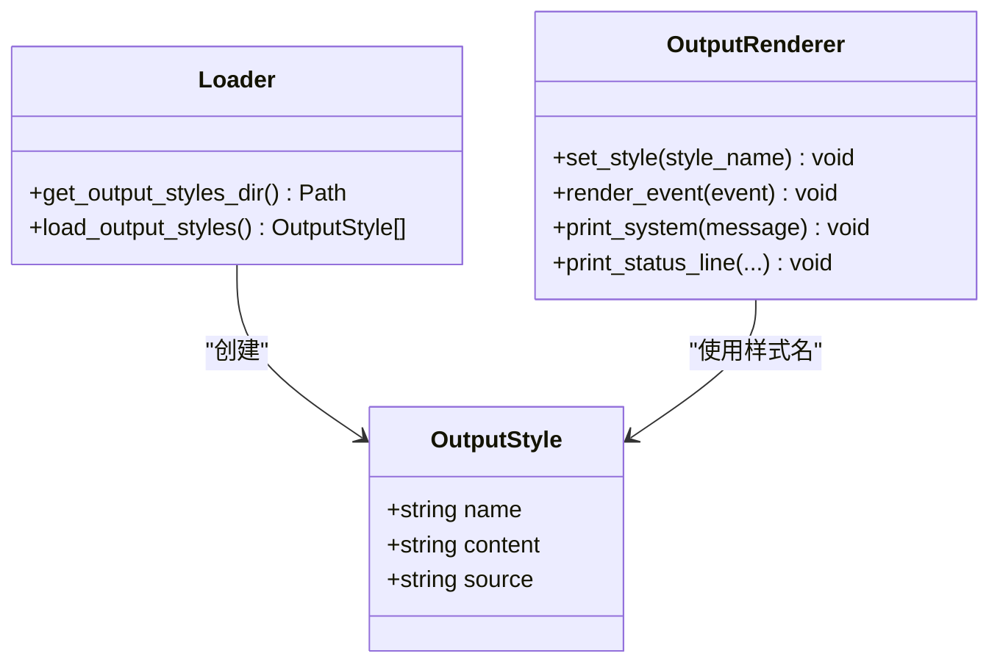
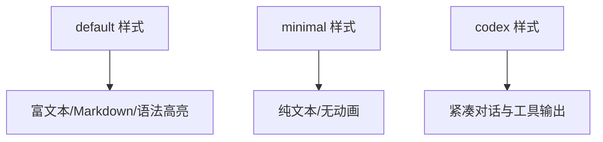
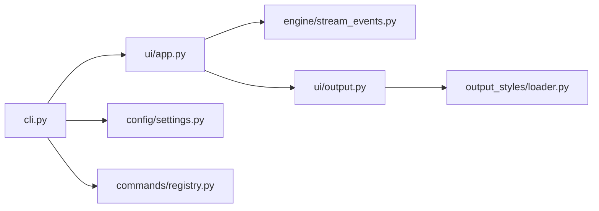

# 输出控制选项

<cite>
**本文引用的文件**
- [src/openharness/cli.py](file://src/openharness/cli.py)
- [src/openharness/ui/app.py](file://src/openharness/ui/app.py)
- [src/openharness/ui/output.py](file://src/openharness/ui/output.py)
- [src/openharness/engine/stream_events.py](file://src/openharness/engine/stream_events.py)
- [src/openharness/output_styles/loader.py](file://src/openharness/output_styles/loader.py)
- [src/openharness/commands/registry.py](file://src/openharness/commands/registry.py)
- [src/openharness/config/settings.py](file://src/openharness/config/settings.py)
- [scripts/test_cli_flags.py](file://scripts/test_cli_flags.py)
- [tests/test_config/test_output_styles_loader.py](file://tests/test_config/test_output_styles_loader.py)
- [frontend/terminal/src/components/ToolCallDisplay.tsx](file://frontend/terminal/src/components/ToolCallDisplay.tsx)
</cite>

## 目录
1. [简介](#简介)
2. [项目结构](#项目结构)
3. [核心组件](#核心组件)
4. [架构总览](#架构总览)
5. [详细组件分析](#详细组件分析)
6. [依赖关系分析](#依赖关系分析)
7. [性能考量](#性能考量)
8. [故障排查指南](#故障排查指南)
9. [结论](#结论)
10. [附录](#附录)

## 简介
本指南聚焦 OpenHarness 的输出控制选项，系统讲解以下内容：
- 命令行参数与行为：--print（-p）、--output-format 及其在非交互与打印模式下的作用
- 输出样式系统：--output-style 与内置/自定义输出样式的加载与切换
- JSON 输出模式：数据结构、解析要点与典型用途
- 流式输出（stream-json）：事件流机制、实时性与消费方式
- 使用场景与最佳实践：自动化脚本、日志记录、调试分析
- 扩展与定制：输出样式的自定义与前端渲染适配

## 项目结构
围绕输出控制的关键模块分布如下：
- CLI 层：定义 --print、--output-format、--dry-run 等参数，并分派到相应运行路径
- 运行时层：根据输出格式选择文本渲染或事件流输出
- 输出样式系统：加载内置与用户自定义样式，供终端渲染器使用
- 流事件模型：统一的增量事件类型，支撑流式输出与终端渲染

**图表来源**
- [src/openharness/cli.py:2171-2190](file://src/openharness/cli.py#L2171-L2190)
- [src/openharness/ui/app.py:240-321](file://src/openharness/ui/app.py#L240-L321)
- [src/openharness/ui/output.py:20-266](file://src/openharness/ui/output.py#L20-L266)
- [src/openharness/engine/stream_events.py:12-91](file://src/openharness/engine/stream_events.py#L12-L91)
- [src/openharness/output_styles/loader.py:27-42](file://src/openharness/output_styles/loader.py#L27-L42)

**章节来源**
- [src/openharness/cli.py:2171-2190](file://src/openharness/cli.py#L2171-L2190)
- [src/openharness/ui/app.py:240-321](file://src/openharness/ui/app.py#L240-L321)
- [src/openharness/ui/output.py:20-266](file://src/openharness/ui/output.py#L20-L266)
- [src/openharness/engine/stream_events.py:12-91](file://src/openharness/engine/stream_events.py#L12-L91)
- [src/openharness/output_styles/loader.py:27-42](file://src/openharness/output_styles/loader.py#L27-L42)

## 核心组件
- 输出格式参数
  - --print（-p）：非交互打印模式，支持 --output-format=text/json/stream-json
  - --output-format：text（默认）、json、stream-json
  - --dry-run：预览模式，支持 text/json/stream-json
- 输出样式系统
  - 内置样式：default、minimal、codex
  - 自定义样式：位于配置目录下的 output_styles/*.md
  - 切换与查询：/output-style show/list/set
- 流事件模型
  - AssistantTextDelta、AssistantTurnComplete、ToolExecutionStarted、ToolExecutionCompleted、ErrorEvent、StatusEvent、CompactProgressEvent
- 终端渲染器
  - 根据样式名称渲染富文本、工具调用摘要、语法高亮等

**章节来源**
- [src/openharness/cli.py:2171-2190](file://src/openharness/cli.py#L2171-L2190)
- [src/openharness/cli.py:2353-2366](file://src/openharness/cli.py#L2353-L2366)
- [src/openharness/output_styles/loader.py:27-42](file://src/openharness/output_styles/loader.py#L27-L42)
- [src/openharness/engine/stream_events.py:12-91](file://src/openharness/engine/stream_events.py#L12-L91)
- [src/openharness/ui/output.py:20-266](file://src/openharness/ui/output.py#L20-L266)

## 架构总览
下图展示从 CLI 到运行时、再到事件流与终端渲染的整体流程。

**图表来源**
- [src/openharness/cli.py:2430-2451](file://src/openharness/cli.py#L2430-L2451)
- [src/openharness/ui/app.py:240-321](file://src/openharness/ui/app.py#L240-L321)
- [src/openharness/ui/output.py:20-266](file://src/openharness/ui/output.py#L20-L266)
- [src/openharness/engine/stream_events.py:12-91](file://src/openharness/engine/stream_events.py#L12-L91)

## 详细组件分析

### 输出格式参数与行为
- --print（-p）
  - 启动非交互打印模式，将模型响应直接输出到标准输出
  - 需要提供提示词值；若为空则报错
- --output-format
  - text：默认文本输出，富文本渲染，带样式与进度提示
  - json：收集完整响应后一次性输出 JSON；包含 type 与 text 字段
  - stream-json：逐事件输出 JSON 行，便于实时消费与日志聚合
- --dry-run
  - 在不执行模型或工具的前提下，预览解析后的设置、技能、命令与工具
  - 支持 text/json/stream-json；其中 stream-json 用于前端或外部系统实时订阅

**图表来源**
- [src/openharness/cli.py:2353-2366](file://src/openharness/cli.py#L2353-L2366)
- [src/openharness/cli.py:2430-2451](file://src/openharness/cli.py#L2430-L2451)
- [src/openharness/ui/app.py:316-318](file://src/openharness/ui/app.py#L316-L318)

**章节来源**
- [src/openharness/cli.py:2171-2190](file://src/openharness/cli.py#L2171-L2190)
- [src/openharness/cli.py:2353-2366](file://src/openharness/cli.py#L2353-L2366)
- [src/openharness/cli.py:2430-2451](file://src/openharness/cli.py#L2430-L2451)
- [src/openharness/ui/app.py:316-318](file://src/openharness/ui/app.py#L316-L318)

### JSON 输出模式
- 数据结构
  - 最终 JSON 包含 type 与 text 字段，text 为完整响应文本
- 解析方法
  - 直接解析顶层对象，读取 type 与 text
  - 适用于自动化脚本、日志分析与结果提取
- 典型用途
  - 与 CI/CD 集成，提取关键信息
  - 与监控系统对接，统计响应时间与内容长度

**图表来源**
- [src/openharness/ui/app.py:316-318](file://src/openharness/ui/app.py#L316-L318)

**章节来源**
- [src/openharness/ui/app.py:316-318](file://src/openharness/ui/app.py#L316-L318)
- [scripts/test_cli_flags.py:81-97](file://scripts/test_cli_flags.py#L81-L97)

### 流式输出（stream-json）
- 工作机制
  - 事件驱动：引擎产生增量事件，运行器逐条输出 JSON 行
  - 事件类型覆盖：助手文本增量、回合完成、工具开始/完成、错误、状态、压缩进度等
  - 实时性：事件一产生即输出，适合实时日志、前端渲染与调试
- 输出示例（事件类型）
  - assistant_delta、assistant_complete、tool_started、tool_completed、error、status、compact_progress、system
- 消费建议
  - 按行读取，逐条解析 JSON 对象
  - 可结合缓冲区合并助手文本，再进行后续处理

**图表来源**
- [src/openharness/ui/app.py:240-295](file://src/openharness/ui/app.py#L240-L295)
- [src/openharness/engine/stream_events.py:12-91](file://src/openharness/engine/stream_events.py#L12-L91)

**章节来源**
- [src/openharness/ui/app.py:240-295](file://src/openharness/ui/app.py#L240-L295)
- [src/openharness/engine/stream_events.py:12-91](file://src/openharness/engine/stream_events.py#L12-L91)

### 输出样式系统
- 样式定义
  - 内置样式：default（富文本）、minimal（极简纯文本）、codex（紧凑对话与工具输出）
  - 自定义样式：在配置目录的 output_styles/*.md 中添加 Markdown 内容
- 加载与切换
  - CLI 通过 /output-style 子命令列出、显示与设置当前样式
  - 设置会持久化到配置并可同步到应用状态
- 终端渲染
  - 渲染器根据样式名称决定是否显示图标、Spinner、Markdown 渲染与语法高亮
  - codex 样式在前端有专门的渲染逻辑（如工具调用摘要与错误行数限制）

**图表来源**
- [src/openharness/output_styles/loader.py:11-42](file://src/openharness/output_styles/loader.py#L11-L42)
- [src/openharness/ui/output.py:20-266](file://src/openharness/ui/output.py#L20-L266)

**章节来源**
- [src/openharness/output_styles/loader.py:27-42](file://src/openharness/output_styles/loader.py#L27-L42)
- [src/openharness/commands/registry.py:1767-1798](file://src/openharness/commands/registry.py#L1767-L1798)
- [src/openharness/config/settings.py:566](file://src/openharness/config/settings.py#L566)
- [src/openharness/ui/output.py:20-266](file://src/openharness/ui/output.py#L20-L266)
- [tests/test_config/test_output_styles_loader.py:1-26](file://tests/test_config/test_output_styles_loader.py#L1-L26)
- [frontend/terminal/src/components/ToolCallDisplay.tsx:17](file://frontend/terminal/src/components/ToolCallDisplay.tsx#L17)

### 终端渲染器与样式差异
- default 样式
  - 富文本、Markdown 渲染、工具摘要、语法高亮、Spinner 动画
- minimal 样式
  - 极简输出，无动画与装饰，适合日志与批处理
- codex 样式
  - 紧凑对话与工具输出风格，前端有特定渲染逻辑（如错误行数限制）

**图表来源**
- [src/openharness/ui/output.py:34-149](file://src/openharness/ui/output.py#L34-L149)
- [frontend/terminal/src/components/ToolCallDisplay.tsx:17](file://frontend/terminal/src/components/ToolCallDisplay.tsx#L17)

**章节来源**
- [src/openharness/ui/output.py:34-149](file://src/openharness/ui/output.py#L34-L149)
- [frontend/terminal/src/components/ToolCallDisplay.tsx:17](file://frontend/terminal/src/components/ToolCallDisplay.tsx#L17)

## 依赖关系分析
- CLI 依赖运行器与设置
- 运行器依赖流事件模型与终端渲染器
- 终端渲染器依赖输出样式系统
- 输出样式系统依赖配置路径与用户自定义样式文件

**图表来源**
- [src/openharness/cli.py:2430-2451](file://src/openharness/cli.py#L2430-L2451)
- [src/openharness/ui/app.py:240-321](file://src/openharness/ui/app.py#L240-L321)
- [src/openharness/ui/output.py:20-266](file://src/openharness/ui/output.py#L20-L266)
- [src/openharness/output_styles/loader.py:27-42](file://src/openharness/output_styles/loader.py#L27-L42)
- [src/openharness/config/settings.py:566](file://src/openharness/config/settings.py#L566)
- [src/openharness/commands/registry.py:1767-1798](file://src/openharness/commands/registry.py#L1767-L1798)

**章节来源**
- [src/openharness/cli.py:2430-2451](file://src/openharness/cli.py#L2430-L2451)
- [src/openharness/ui/app.py:240-321](file://src/openharness/ui/app.py#L240-L321)
- [src/openharness/ui/output.py:20-266](file://src/openharness/ui/output.py#L20-L266)
- [src/openharness/output_styles/loader.py:27-42](file://src/openharness/output_styles/loader.py#L27-L42)
- [src/openharness/config/settings.py:566](file://src/openharness/config/settings.py#L566)
- [src/openharness/commands/registry.py:1767-1798](file://src/openharness/commands/registry.py#L1767-L1798)

## 性能考量
- 文本渲染 vs JSON 输出
  - text：需要富文本与样式计算，I/O 为连续文本
  - json：仅在结束时输出一次，适合批量处理
  - stream-json：事件级输出，I/O 更频繁但延迟更低
- 样式影响
  - default/codex：启用 Markdown、语法高亮与面板，CPU/内存占用较高
  - minimal：最小化渲染开销，适合高吞吐批处理
- 流事件体积
  - stream-json 每条事件为独立 JSON 行，建议配合日志压缩与异步写入

[本节为通用指导，无需具体文件引用]

## 故障排查指南
- --print 缺少提示词
  - 现象：返回错误提示“-p/--print 需要提示词值”
  - 处理：确保 -p 后跟随完整提示词字符串
- --dry-run 不支持 --continue/--resume
  - 现象：返回错误提示“--dry-run 不支持 --continue/--resume”
  - 处理：在 --dry-run 模式下不要同时使用 --continue 或 --resume
- --dry-run 输出格式限制
  - 现象：传入除 text/json/stream-json 之外的格式会报错
  - 处理：仅使用 text/json/stream-json 三种格式
- JSON 输出解析失败
  - 现象：下游解析抛出 JSON 解码异常
  - 处理：确认输出未被其他日志污染；stream-json 模式需逐行解析

**章节来源**
- [src/openharness/cli.py:2331-2366](file://src/openharness/cli.py#L2331-L2366)
- [src/openharness/cli.py:2430-2434](file://src/openharness/cli.py#L2430-L2434)
- [scripts/test_cli_flags.py:81-97](file://scripts/test_cli_flags.py#L81-L97)

## 结论
- --print 与 --output-format 提供了灵活的非交互输出能力
- JSON 与 stream-json 分别满足“一次性结果”与“实时事件”的不同需求
- 输出样式系统让终端体验可定制，适合不同场景与偏好
- 建议在自动化与日志系统中优先采用 stream-json，以便低延迟与可扩展的事件消费

[本节为总结，无需具体文件引用]

## 附录

### 参数速查表
- --print（-p）：非交互打印模式，需提供提示词
- --output-format：text（默认）、json、stream-json
- --dry-run：预览模式，支持 text/json/stream-json
- /output-style：显示/列出/设置输出样式

**章节来源**
- [src/openharness/cli.py:2171-2190](file://src/openharness/cli.py#L2171-L2190)
- [src/openharness/cli.py:2353-2366](file://src/openharness/cli.py#L2353-L2366)
- [src/openharness/commands/registry.py:1767-1798](file://src/openharness/commands/registry.py#L1767-L1798)

### 使用示例与最佳实践
- 自动化脚本集成
  - 使用 --output-format json 获取最终结果，简化解析
  - 使用 --output-format stream-json 实时消费事件，便于日志聚合与告警
- 日志记录
  - 推荐 stream-json，逐行写入日志文件，便于检索与可视化
  - 若仅需最终结果，使用 json，减少日志体量
- 调试分析
  - 使用 --dry-run + --output-format json 查看解析后的配置与可用项
  - 使用 text 样式观察富文本渲染与工具摘要，定位问题
- 输出样式选择
  - 开发与演示：default/codex
  - 批处理与 CI：minimal
  - 自定义：在配置目录添加 output_styles/*.md 并通过 /output-style 设置

**章节来源**
- [src/openharness/cli.py:2353-2366](file://src/openharness/cli.py#L2353-L2366)
- [src/openharness/ui/app.py:316-318](file://src/openharness/ui/app.py#L316-L318)
- [src/openharness/output_styles/loader.py:27-42](file://src/openharness/output_styles/loader.py#L27-L42)
- [src/openharness/commands/registry.py:1767-1798](file://src/openharness/commands/registry.py#L1767-L1798)

### 输出格式转换与自定义样式
- 输出格式转换
  - text → json：在打印模式结束后统一封装为 {type: "result", text: ...}
  - text → stream-json：将各事件类型映射为独立 JSON 行
- 自定义样式扩展
  - 在配置目录创建 output_styles/*.md 文件，重启后即可通过 /output-style 列表与设置使用
  - 前端对 codex 样式有特殊渲染逻辑，可参考相关组件实现

**章节来源**
- [src/openharness/ui/app.py:316-318](file://src/openharness/ui/app.py#L316-L318)
- [src/openharness/ui/app.py:240-295](file://src/openharness/ui/app.py#L240-L295)
- [src/openharness/output_styles/loader.py:27-42](file://src/openharness/output_styles/loader.py#L27-L42)
- [tests/test_config/test_output_styles_loader.py:1-26](file://tests/test_config/test_output_styles_loader.py#L1-L26)
- [frontend/terminal/src/components/ToolCallDisplay.tsx:17](file://frontend/terminal/src/components/ToolCallDisplay.tsx#L17)