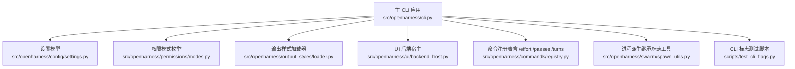
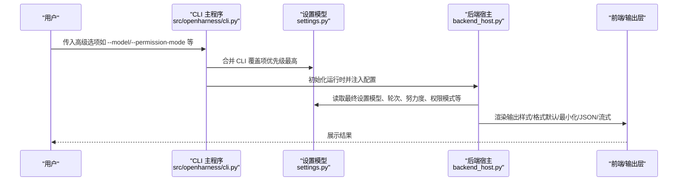

# 高级选项

<cite>
**本文引用的文件**
- [src/openharness/cli.py](file://src/openharness/cli.py)
- [src/openharness/config/settings.py](file://src/openharness/config/settings.py)
- [src/openharness/permissions/modes.py](file://src/openharness/permissions/modes.py)
- [src/openharness/output_styles/loader.py](file://src/openharness/output_styles/loader.py)
- [src/openharness/ui/backend_host.py](file://src/openharness/ui/backend_host.py)
- [src/openharness/commands/registry.py](file://src/openharness/commands/registry.py)
- [src/openharness/swarm/spawn_utils.py](file://src/openharness/swarm/spawn_utils.py)
- [scripts/test_cli_flags.py](file://scripts/test_cli_flags.py)
</cite>

## 目录
1. [简介](#简介)
2. [项目结构](#项目结构)
3. [核心组件](#核心组件)
4. [架构总览](#架构总览)
5. [详细组件分析](#详细组件分析)
6. [依赖关系分析](#依赖关系分析)
7. [性能考量](#性能考量)
8. [故障排查指南](#故障排查指南)
9. [结论](#结论)
10. [附录](#附录)

## 简介
本指南面向高级用户，系统梳理 OpenHarness CLI 的“高级选项”，涵盖以下类别与要点：
- 模型配置选项：--model、--base-url、--api-format
- 权限控制选项：--permission-mode
- 会话管理选项：--max-turns、--effort、--passes
- 输出控制选项：--output-style、--output-format（或 --json）、--stream
- 其他常用高级开关：--profile、--cwd、--print（非交互）

文档不仅说明每个选项的作用机制、取值范围、默认值与相互影响，还提供配置示例与最佳实践，帮助你充分发挥 CLI 的强大能力。

## 项目结构
OpenHarness 的 CLI 主入口位于主应用模块，通过 Typer 定义子命令与选项；配置与行为由设置模型、权限模式、输出样式加载器以及运行时后端共同决定。

图示来源
- [src/openharness/cli.py](file://src/openharness/cli.py)
- [src/openharness/config/settings.py](file://src/openharness/config/settings.py)
- [src/openharness/permissions/modes.py](file://src/openharness/permissions/modes.py)
- [src/openharness/output_styles/loader.py](file://src/openharness/output_styles/loader.py)
- [src/openharness/ui/backend_host.py](file://src/openharness/ui/backend_host.py)
- [src/openharness/commands/registry.py](file://src/openharness/commands/registry.py)
- [src/openharness/swarm/spawn_utils.py](file://src/openharness/swarm/spawn_utils.py)
- [scripts/test_cli_flags.py](file://scripts/test_cli_flags.py)

章节来源
- [src/openharness/cli.py](file://src/openharness/cli.py)
- [src/openharness/config/settings.py](file://src/openharness/config/settings.py)
- [src/openharness/permissions/modes.py](file://src/openharness/permissions/modes.py)
- [src/openharness/output_styles/loader.py](file://src/openharness/output_styles/loader.py)
- [src/openharness/ui/backend_host.py](file://src/openharness/ui/backend_host.py)
- [src/openharness/commands/registry.py](file://src/openharness/commands/registry.py)
- [src/openharness/swarm/spawn_utils.py](file://src/openharness/swarm/spawn_utils.py)
- [scripts/test_cli_flags.py](file://scripts/test_cli_flags.py)

## 核心组件
- 设置模型 Settings：集中定义模型、权限、输出样式、最大轮次、推理努力度、推理轮数等配置项，并提供解析与合并优先级逻辑。
- 权限模式 PermissionMode：定义默认、计划模式、全量自动三种权限策略。
- 输出样式 OutputStyle：内置 default/minimal/codex 三种样式，支持自定义扩展。
- UI 后端宿主 BackendHost：接收 CLI 传入的模型、轮次、努力度、权限模式等参数，驱动运行时。
- 命令注册表：提供 /effort、/passes、/turns 等交互式配置命令。
- 进程派生工具：在多智能体场景中，将父进程的高级选项安全地传递给子进程。

章节来源
- [src/openharness/config/settings.py](file://src/openharness/config/settings.py)
- [src/openharness/permissions/modes.py](file://src/openharness/permissions/modes.py)
- [src/openharness/output_styles/loader.py](file://src/openharness/output_styles/loader.py)
- [src/openharness/ui/backend_host.py](file://src/openharness/ui/backend_host.py)
- [src/openharness/commands/registry.py](file://src/openharness/commands/registry.py)
- [src/openharness/swarm/spawn_utils.py](file://src/openharness/swarm/spawn_utils.py)

## 架构总览
下图展示 CLI 选项如何进入设置模型并在运行时生效：

图示来源
- [src/openharness/cli.py](file://src/openharness/cli.py)
- [src/openharness/config/settings.py](file://src/openharness/config/settings.py)
- [src/openharness/ui/backend_host.py](file://src/openharness/ui/backend_host.py)

章节来源
- [src/openharness/cli.py](file://src/openharness/cli.py)
- [src/openharness/config/settings.py](file://src/openharness/config/settings.py)
- [src/openharness/ui/backend_host.py](file://src/openharness/ui/backend_host.py)

## 详细组件分析

### 模型配置选项
- --model
  - 作用：覆盖当前会话使用的模型名称或别名（如 sonnet/opus/haiku 等），支持继承模式（在某些派生场景中不显式传递）。
  - 取值范围：字符串；可为具体模型 ID 或受支持的别名（例如 Claude 家族别名）。
  - 默认值：来自设置模型的默认值（通常为推荐模型）。
  - 相互影响：与 --base-url、--api-format 共同决定最终解析后的运行时模型 ID；当设置为“inherit”时，子进程从环境变量继承父进程模型，避免重复传参。
  - 示例：--model claude-sonnet-4-6 或 --model sonnet
  - 最佳实践：在多智能体协作中，若希望子进程与父进程共享模型，使用“inherit”语义（由派生工具处理）。

- --base-url
  - 作用：指定兼容 OpenAI 协议的第三方服务基础地址，用于覆盖默认提供商端点。
  - 取值范围：URL 字符串；http/https/ws/wss 传输类型需满足要求。
  - 默认值：None（使用提供商默认端点）。
  - 相互影响：与 --api-format 协同决定认证与客户端构造方式；与 --model 共同参与最终模型解析。
  - 示例：--base-url https://api.moonshot.cn/v1

- --api-format
  - 作用：声明 API 协议格式（如 anthropic/openai/copilot），影响认证与请求封装。
  - 取值范围："anthropic"|"openai"|"copilot"
  - 默认值："anthropic"
  - 相互影响：与 --model、--base-url、--profile 共同决定最终运行时客户端与模型解析。

章节来源
- [src/openharness/config/settings.py](file://src/openharness/config/settings.py)
- [src/openharness/swarm/spawn_utils.py](file://src/openharness/swarm/spawn_utils.py)
- [src/openharness/cli.py](file://src/openharness/cli.py)

### 权限控制选项
- --permission-mode
  - 作用：设置会话的权限策略，控制工具调用与编辑确认流程。
  - 取值范围：default、plan、full_auto（对应枚举值）。
  - 默认值：default
  - 相互影响：与命令注册表中的 /permissions 命令配合，可在运行时动态切换；UI 后端宿主接收该模式并更新权限检查器。
  - 示例：--permission-mode plan

章节来源
- [src/openharness/permissions/modes.py](file://src/openharness/permissions/modes.py)
- [src/openharness/commands/registry.py](file://src/openharness/commands/registry.py)
- [src/openharness/ui/backend_host.py](file://src/openharness/ui/backend_host.py)

### 会话管理选项
- --max-turns
  - 作用：限制对话轮次上限；支持“无限制”模式。
  - 取值范围：正整数或“unlimited”
  - 默认值：200
  - 相互影响：与 /turns 命令配合，可在运行时调整；UI 后端宿主据此设置引擎的最大轮次。
  - 示例：--max-turns 300 或 --max-turns unlimited

- --effort
  - 作用：设置推理努力度，影响模型的思考深度与响应速度。
  - 取值范围："low"|"medium"|"high"|"xhigh"
  - 默认值："medium"
  - 相互影响：与 /effort 命令配合，可在运行时调整；同时会重写系统提示以匹配当前努力度。
  - 示例：--effort high

- --passes
  - 作用：设置推理轮数（多次迭代），提升复杂任务的稳定性与质量。
  - 取值范围：1~8
  - 默认值：1
  - 相互影响：与 /passes 命令配合，可在运行时调整；同时会重写系统提示以启用多轮迭代。
  - 示例：--passes 3

章节来源
- [src/openharness/config/settings.py](file://src/openharness/config/settings.py)
- [src/openharness/commands/registry.py](file://src/openharness/commands/registry.py)
- [src/openharness/ui/backend_host.py](file://src/openharness/ui/backend_host.py)

### 输出控制选项
- --output-style
  - 作用：选择输出样式（界面渲染风格）。
  - 取值范围：default/minimal/codex 或自定义样式名称（位于配置目录下的输出样式文件）
  - 默认值：default
  - 相互影响：UI 后端宿主加载可用样式列表并允许交互选择；与 --output-format（JSON/流式）协同决定最终输出形态。
  - 示例：--output-style minimal

- --output-format（或 --json）
  - 作用：控制输出格式（文本/JSON/流式 JSON）。
  - 取值范围："text"|"json"|"stream-json"
  - 默认值："text"
  - 相互影响：与 UI 输出层配合，决定事件序列化与增量输出。
  - 示例：--output-format json 或 --output-format stream-json

- --stream
  - 作用：开启流式输出（与 --output-format stream-json 行为一致）。
  - 取值范围：布尔
  - 默认值：False
  - 示例：--stream

章节来源
- [src/openharness/output_styles/loader.py](file://src/openharness/output_styles/loader.py)
- [src/openharness/ui/backend_host.py](file://src/openharness/ui/backend_host.py)
- [scripts/test_cli_flags.py](file://scripts/test_cli_flags.py)

### 其他常用高级开关
- --profile
  - 作用：指定提供商标识（工作流配置），影响模型解析与认证来源。
  - 取值范围：内置或自定义配置文件中的配置名
  - 默认值：内置默认配置
  - 示例：--profile claude-api

- --cwd
  - 作用：设置工作目录，影响技能/插件/上下文加载。
  - 取值范围：路径字符串
  - 默认值：当前工作目录
  - 示例：--cwd /path/to/project

- --print（-p）
  - 作用：非交互模式执行单次提示并退出，常与 --model、--output-format 等联用。
  - 取值范围：提示文本
  - 默认值：无
  - 示例：--print "你好 OpenHarness" --model gpt-5.4

章节来源
- [src/openharness/cli.py](file://src/openharness/cli.py)
- [scripts/test_cli_flags.py](file://scripts/test_cli_flags.py)

## 依赖关系分析
- CLI 选项到设置模型的映射遵循“CLI 覆盖 > 环境变量 > 配置文件 > 默认值”的优先级。
- 运行时后端宿主从设置模型读取最终配置，驱动引擎与 UI 渲染。
- 命令注册表提供运行时交互式配置（/effort、/passes、/turns、/permissions），与设置模型保持同步。
- 多智能体派生场景中，派生工具负责将父进程的高级选项安全传递给子进程，避免重复传参与冲突。

图示来源
- [src/openharness/cli.py](file://src/openharness/cli.py)
- [src/openharness/config/settings.py](file://src/openharness/config/settings.py)
- [src/openharness/ui/backend_host.py](file://src/openharness/ui/backend_host.py)
- [src/openharness/commands/registry.py](file://src/openharness/commands/registry.py)
- [src/openharness/swarm/spawn_utils.py](file://src/openharness/swarm/spawn_utils.py)

章节来源
- [src/openharness/cli.py](file://src/openharness/cli.py)
- [src/openharness/config/settings.py](file://src/openharness/config/settings.py)
- [src/openharness/ui/backend_host.py](file://src/openharness/ui/backend_host.py)
- [src/openharness/commands/registry.py](file://src/openharness/commands/registry.py)
- [src/openharness/swarm/spawn_utils.py](file://src/openharness/swarm/spawn_utils.py)

## 性能考量
- --effort 与 --passes 提升推理深度与稳定性，但会增加耗时与成本；建议在复杂任务或需要高质量输出时适度提高。
- --max-turns 控制会话长度，合理设置可避免长尾消耗；对大规模工程建议结合“无限制”模式谨慎使用。
- --output-format 与 --stream 影响 I/O 开销与吞吐；生产环境建议使用流式 JSON 以便实时观测与日志聚合。
- --permission-mode 在计划模式下可减少人工干预，提高自动化程度，但需确保策略与安全目标一致。

## 故障排查指南
- 认证失败
  - 症状：无法解析运行时客户端或提示缺少凭据。
  - 排查：检查 --profile 对应的凭据是否已配置；确认 --api-format 与提供商匹配。
  - 参考：设置模型的认证解析逻辑与错误提示。

- MCP 服务器配置错误
  - 症状：MCP 配置存在无效 URL 或缺失命令。
  - 排查：使用 dry-run 预览功能查看 MCP 校验结果；修正 transport/url/command/cwd 等字段。

- 输出格式异常
  - 症状：JSON 解析失败或流式输出中断。
  - 排查：确认 --output-format 与 --stream 的组合使用；检查后端输出层事件序列化。

章节来源
- [src/openharness/config/settings.py](file://src/openharness/config/settings.py)
- [src/openharness/cli.py](file://src/openharness/cli.py)
- [src/openharness/ui/backend_host.py](file://src/openharness/ui/backend_host.py)

## 结论
通过合理配置模型、权限、会话与输出选项，你可以将 OpenHarness 的 CLI 调优至适合不同任务与环境的最佳状态。建议在开发与生产环境中分别采用不同的努力度与轮次策略，并结合流式输出与权限模式实现高效、可控且可观测的自动化流程。

## 附录
- 配置示例（不含具体代码片段）
  - 使用第三方 OpenAI 兼容服务进行一次性输出：
    - oh -p "生成一段测试代码" --model gpt-5.4 --base-url https://api.example.com/v1 --output-format json
  - 在计划模式下进行多轮推理：
    - oh --effort high --passes 3 --permission-mode plan
  - 自定义输出样式并开启流式输出：
    - oh --output-style codex --stream
  - 限制会话轮次并导出报告：
    - oh --max-turns 150 --output-format text

- 最佳实践
  - 将敏感凭据置于环境变量或外部凭据存储，避免直接暴露在命令行历史中。
  - 在 CI/CD 中使用 --print 与 --output-format json，便于后续处理与归档。
  - 多智能体场景中，优先使用“inherit”模型语义，避免重复传参导致的配置漂移。
  - 对高成本任务，先以 low/medium 努力度快速验证，再逐步提升以平衡成本与质量。