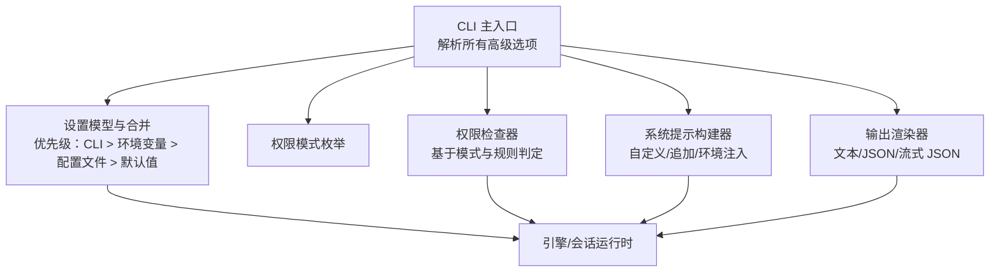
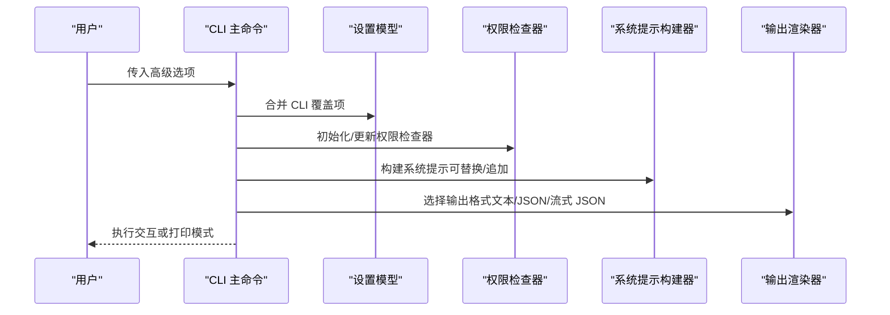
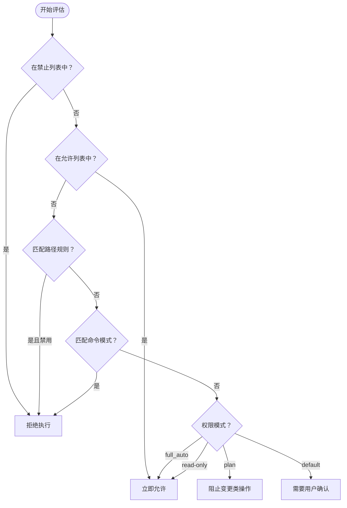
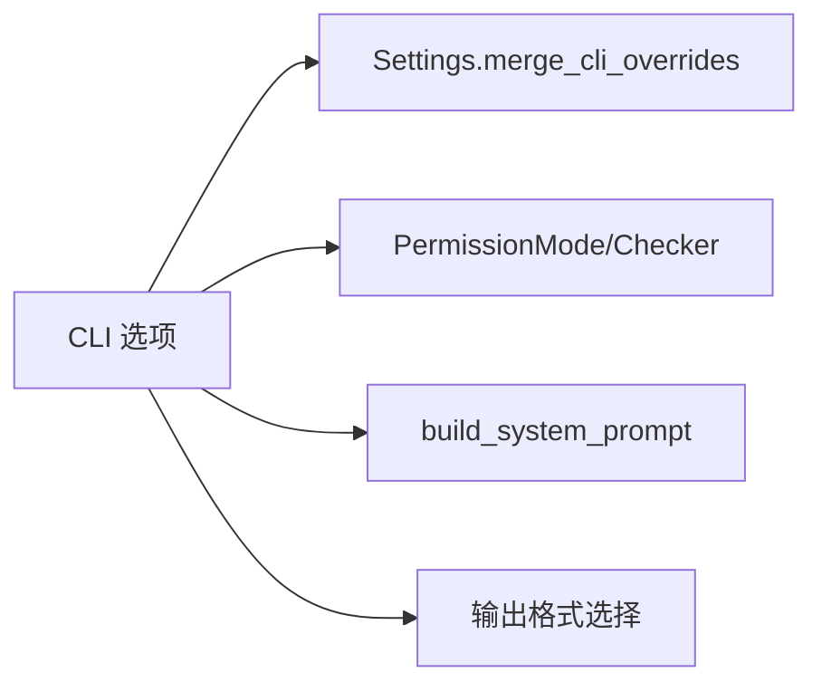

# 高级选项配置

<cite>
**本文引用的文件**
- [cli.py](file://src/openharness/cli.py)
- [settings.py](file://src/openharness/config/settings.py)
- [modes.py](file://src/openharness/permissions/modes.py)
- [checker.py](file://src/openharness/permissions/checker.py)
- [system_prompt.py](file://src/openharness/prompts/system_prompt.py)
- [app.py](file://src/openharness/ui/app.py)
- [test_cli_flags.py](file://scripts/test_cli_flags.py)
- [README.md](file://README.md)
</cite>

## 目录
1. [简介](#简介)
2. [项目结构](#项目结构)
3. [核心组件](#核心组件)
4. [架构总览](#架构总览)
5. [详细组件分析](#详细组件分析)
6. [依赖分析](#依赖分析)
7. [性能考虑](#性能考虑)
8. [故障排查指南](#故障排查指南)
9. [结论](#结论)
10. [附录](#附录)

## 简介
本文件面向高级用户，系统化梳理 OpenHarness CLI 的高级选项，包括模型与执行策略（--model、--effort、--max-turns）、输出格式（--output-format）、权限控制（--permission-mode、--dangerously-skip-permissions、--allowed-tools、--disallowed-tools）、系统上下文（--system-prompt、--append-system-prompt、--settings、--base-url、--api-key、--bare）。文档解释每个选项的作用机制、典型使用场景与最佳实践，并提供复杂场景下的参数组合示例，帮助您在不同工作流中高效、安全地使用 OpenHarness。

## 项目结构
OpenHarness 的 CLI 入口位于命令定义处，核心逻辑围绕设置加载、权限检查、系统提示构建与输出渲染展开。下图展示与“高级选项”直接相关的模块关系：

图表来源
- [cli.py:180-378](file://src/openharness/cli.py#L180-L378)
- [settings.py:49-121](file://src/openharness/config/settings.py#L49-L121)
- [modes.py:8-14](file://src/openharness/permissions/modes.py#L8-L14)
- [checker.py:30-99](file://src/openharness/permissions/checker.py#L30-L99)
- [system_prompt.py:41-63](file://src/openharness/prompts/system_prompt.py#L41-L63)
- [app.py:118-148](file://src/openharness/ui/app.py#L118-L148)

章节来源
- [cli.py:180-378](file://src/openharness/cli.py#L180-L378)
- [settings.py:49-121](file://src/openharness/config/settings.py#L49-L121)

## 核心组件
- CLI 主命令与选项解析：负责收集 --model、--effort、--max-turns、--output-format、--permission-mode、--dangerously-skip-permissions、--allowed-tools、--disallowed-tools、--system-prompt、--append-system-prompt、--settings、--base-url、--api-key、--bare 等参数，并分派到交互或打印模式。
- 设置模型与优先级：Settings 定义默认值与环境变量覆盖逻辑；merge_cli_overrides 支持 CLI 覆盖配置文件与默认值。
- 权限系统：PermissionMode 提供三种模式；PermissionChecker 基于允许/禁止列表、路径规则、命令模式与只读特性进行决策。
- 系统提示构建：支持完全替换（--system-prompt）或追加（--append-system-prompt），并自动注入环境信息。
- 输出渲染：支持文本、JSON、流式 JSON 三种输出格式，用于非交互打印模式。

章节来源
- [cli.py:180-378](file://src/openharness/cli.py#L180-L378)
- [settings.py:49-121](file://src/openharness/config/settings.py#L49-L121)
- [modes.py:8-14](file://src/openharness/permissions/modes.py#L8-L14)
- [checker.py:30-99](file://src/openharness/permissions/checker.py#L30-L99)
- [system_prompt.py:41-63](file://src/openharness/prompts/system_prompt.py#L41-L63)
- [app.py:118-148](file://src/openharness/ui/app.py#L118-L148)

## 架构总览
下图展示从 CLI 到运行时的关键调用链，体现高级选项如何影响后续处理流程：

图表来源
- [cli.py:341-378](file://src/openharness/cli.py#L341-L378)
- [settings.py:93-96](file://src/openharness/config/settings.py#L93-L96)
- [checker.py:30-99](file://src/openharness/permissions/checker.py#L30-L99)
- [system_prompt.py:41-63](file://src/openharness/prompts/system_prompt.py#L41-L63)
- [app.py:118-148](file://src/openharness/ui/app.py#L118-L148)

## 详细组件分析

### 模型与执行策略
- --model/-m
  - 作用：指定模型别名或完整模型 ID，影响推理后端与能力。
  - 机制：CLI 参数通过 Settings.merge_cli_overrides 应用，优先级高于配置文件与环境变量。
  - 使用场景：切换不同供应商或版本模型，或在 CI 中固定模型以保证一致性。
  - 最佳实践：在团队内统一模型别名映射，避免硬编码模型 ID。
- --effort
  - 作用：调整推理努力级别（low/medium/high），影响思考深度与耗时。
  - 机制：与系统提示联动，通过命令注册中的 /effort 控制当前会话的努力级别。
  - 使用场景：复杂问题采用 high，日常任务采用 low 以提升吞吐。
  - 最佳实践：结合 --max-turns 限制自动代理轮次，避免长时间运行。
- --max-turns
  - 作用：限制代理对话轮次，常与 --print 配合实现批处理。
  - 机制：在打印模式下由运行时控制最大轮次，防止无限循环。
  - 使用场景：批量处理、自动化脚本、CI 场景。
  - 最佳实践：与 --output-format json 或 stream-json 结合，便于下游解析。

章节来源
- [cli.py:205-229](file://src/openharness/cli.py#L205-L229)
- [settings.py:93-96](file://src/openharness/config/settings.py#L93-L96)
- [README.md:267-278](file://README.md#L267-L278)

### 输出格式
- --output-format
  - 取值：text（默认）、json、stream-json。
  - 机制：打印模式下根据该选项决定输出形态；流式 JSON 将事件拆分为多行独立 JSON 对象。
  - 使用场景：与 CI/CD 集成、日志采集、前端可视化。
  - 最佳实践：生产环境建议使用 json 或 stream-json，便于结构化处理。

章节来源
- [cli.py:238-243](file://src/openharness/cli.py#L238-L243)
- [app.py:118-148](file://src/openharness/ui/app.py#L118-L148)

### 权限控制
- --permission-mode
  - 取值：default、plan、full_auto。
  - 机制：设置 PermissionMode，影响工具执行是否需要确认或直接放行。
- --dangerously-skip-permissions
  - 作用：跳过权限检查，等价于设置为 full_auto。
  - 适用：沙箱隔离环境或调试阶段，需谨慎使用。
- --allowed-tools / --disallowed-tools
  - 作用：显式允许/禁止特定工具名称，支持逗号或空格分隔。
  - 机制：PermissionChecker 依据允许/禁止列表、路径规则、命令模式与只读属性综合判断。
- 权限决策流程（简化）

图表来源
- [checker.py:50-99](file://src/openharness/permissions/checker.py#L50-L99)
- [modes.py:8-14](file://src/openharness/permissions/modes.py#L8-L14)

章节来源
- [cli.py:245-268](file://src/openharness/cli.py#L245-L268)
- [checker.py:30-99](file://src/openharness/permissions/checker.py#L30-L99)
- [modes.py:8-14](file://src/openharness/permissions/modes.py#L8-L14)

### 系统上下文
- --system-prompt/-s
  - 作用：完全替换默认系统提示，适合定制角色与约束。
- --append-system-prompt
  - 作用：向默认系统提示追加内容，适合补充约束或上下文。
- --settings
  - 作用：加载外部 JSON 设置文件或内联 JSON 字符串，合并到当前设置。
- --base-url
  - 作用：设置兼容 Anthropic 的 API 基础地址，用于替代默认服务端点。
- --api-key/-k
  - 作用：覆盖配置与环境变量中的密钥，优先级最高。
- --bare
  - 作用：最小化模式，跳过钩子、插件、MCP 与自动发现，加速启动与调试。
- 系统提示构建
  - 机制：build_system_prompt 支持自定义提示与环境信息拼接；--system-prompt 完全替换，--append-system-prompt 追加到基础提示末尾。

章节来源
- [cli.py:270-307](file://src/openharness/cli.py#L270-L307)
- [settings.py:49-121](file://src/openharness/config/settings.py#L49-L121)
- [system_prompt.py:41-63](file://src/openharness/prompts/system_prompt.py#L41-L63)

## 依赖分析
- CLI 与设置模型
  - CLI 选项通过 Settings.merge_cli_overrides 应用，确保 CLI > 环境变量 > 配置文件 > 默认值的优先级。
- CLI 与权限系统
  - --dangerously-skip-permissions 直接将权限模式设为 full_auto，绕过 PermissionChecker 的多数判断。
- CLI 与系统提示
  - --system-prompt 与 --append-system-prompt 影响 build_system_prompt 的输出，进而影响模型提示词。
- CLI 与输出渲染
  - --output-format 决定打印模式下的输出形态，影响下游消费方式。

图表来源
- [cli.py:341-378](file://src/openharness/cli.py#L341-L378)
- [settings.py:93-96](file://src/openharness/config/settings.py#L93-L96)
- [checker.py:30-99](file://src/openharness/permissions/checker.py#L30-L99)
- [system_prompt.py:41-63](file://src/openharness/prompts/system_prompt.py#L41-L63)
- [app.py:118-148](file://src/openharness/ui/app.py#L118-L148)

章节来源
- [cli.py:341-378](file://src/openharness/cli.py#L341-L378)
- [settings.py:93-96](file://src/openharness/config/settings.py#L93-L96)

## 性能考虑
- 模型与令牌
  - 通过 --model 指定更合适的模型，避免不必要的高成本推理。
  - 结合 --max-turns 限制代理轮次，降低整体延迟与成本。
- 输出格式
  - 在批处理场景优先使用 --output-format json/stream-json，减少解析开销。
- 最小化模式
  - --bare 可显著缩短启动时间，适合快速验证或离线开发。

## 故障排查指南
- API 密钥未找到
  - 现象：运行时报错提示缺少 API 密钥。
  - 排查：检查 --api-key、环境变量 ANTHROPIC_API_KEY 与配置文件中的 api_key 是否正确设置。
  - 参考
    - [settings.py:76-91](file://src/openharness/config/settings.py#L76-L91)
- 输出格式异常
  - 现象：--output-format json 无法被下游解析。
  - 排查：确认输出确为单个 JSON 对象；如需流式，请使用 stream-json 并逐行解析。
  - 参考
    - [app.py:118-148](file://src/openharness/ui/app.py#L118-L148)
- 权限被阻断
  - 现象：工具执行被要求确认或直接拒绝。
  - 排查：检查 --permission-mode、--allowed-tools、--disallowed-tools、路径规则与命令模式。
  - 参考
    - [checker.py:50-99](file://src/openharness/permissions/checker.py#L50-L99)
- 系统提示未生效
  - 现象：--system-prompt 或 --append-system-prompt 未按预期生效。
  - 排查：确认未同时使用 --system-prompt（完全替换）与 --append-system-prompt；两者同时出现时，替换优先。
  - 参考
    - [system_prompt.py:41-63](file://src/openharness/prompts/system_prompt.py#L41-L63)

章节来源
- [settings.py:76-91](file://src/openharness/config/settings.py#L76-L91)
- [app.py:118-148](file://src/openharness/ui/app.py#L118-L148)
- [checker.py:50-99](file://src/openharness/permissions/checker.py#L50-L99)
- [system_prompt.py:41-63](file://src/openharness/prompts/system_prompt.py#L41-L63)

## 结论
通过合理组合高级 CLI 选项，您可以实现从模型选择、权限控制到输出形态的全链路定制。建议在生产环境中优先使用明确的模型与输出格式，配合严格的权限策略与最小化模式，以获得稳定、安全与高效的体验。

## 附录

### 复杂场景参数组合示例
以下示例均基于真实可用的 CLI 选项组合，适用于不同工作负载与安全需求。

- 示例一：批处理 + 流式输出 + 固定模型
  - 用途：CI 自动化脚本，需要稳定可解析的流式输出。
  - 组合：--print "<你的提示>" --model "<模型ID>" --output-format stream-json --max-turns 3
  - 参考
    - [cli.py:231-243](file://src/openharness/cli.py#L231-L243)
    - [cli.py:224-229](file://src/openharness/cli.py#L224-L229)
    - [app.py:118-148](file://src/openharness/ui/app.py#L118-L148)
- 示例二：严格权限 + 显式工具白名单
  - 用途：企业内网，仅允许必要工具。
  - 组合：--permission-mode default --allowed-tools "read_file,file_write,bash" --disallowed-tools "rm,chmod"
  - 参考
    - [cli.py:245-268](file://src/openharness/cli.py#L245-L268)
    - [checker.py:50-99](file://src/openharness/permissions/checker.py#L50-L99)
- 示例三：最小化启动 + 自定义提示 + 自定义基座地址
  - 用途：本地开发或沙箱调试，快速启动并注入特定上下文。
  - 组合：--bare --system-prompt "<你的系统提示>" --base-url "<自定义基座地址>"
  - 参考
    - [cli.py:270-307](file://src/openharness/cli.py#L270-L307)
    - [system_prompt.py:41-63](file://src/openharness/prompts/system_prompt.py#L41-L63)
- 示例四：计划模式 + 限制轮次 + JSON 输出
  - 用途：先审阅再执行，避免误操作。
  - 组合：--permission-mode plan --max-turns 2 --output-format json
  - 参考
    - [cli.py:245-246](file://src/openharness/cli.py#L245-L246)
    - [cli.py:224-229](file://src/openharness/cli.py#L224-L229)
    - [app.py:144-147](file://src/openharness/ui/app.py#L144-L147)

### 与官方帮助与测试的对应
- CLI 帮助输出包含各组选项与子命令，验证高级选项分组齐全。
  - 参考
    - [test_cli_flags.py:40-68](file://scripts/test_cli_flags.py#L40-L68)
- 打印模式与 JSON 输出的端到端验证。
  - 参考
    - [test_cli_flags.py:71-98](file://scripts/test_cli_flags.py#L71-L98)