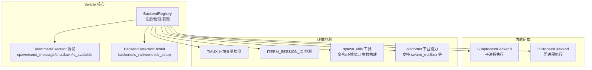
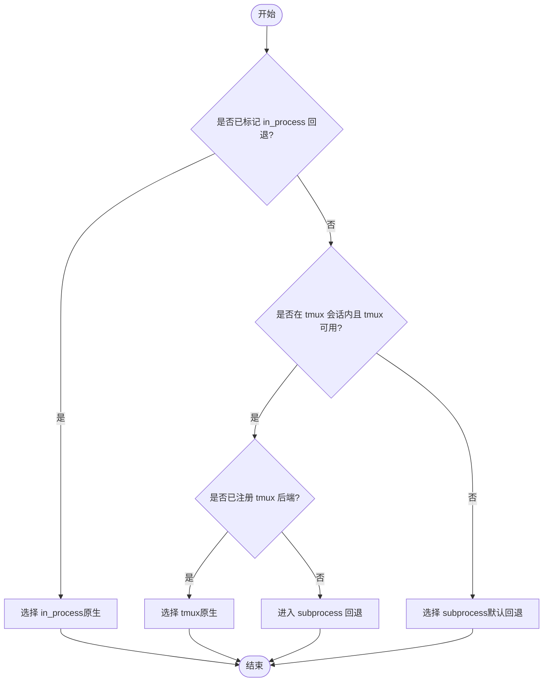
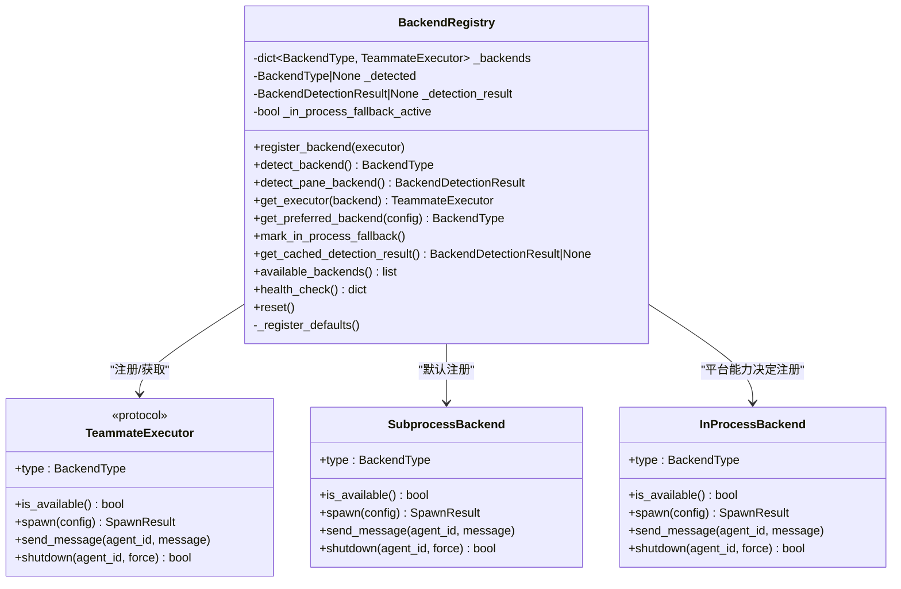
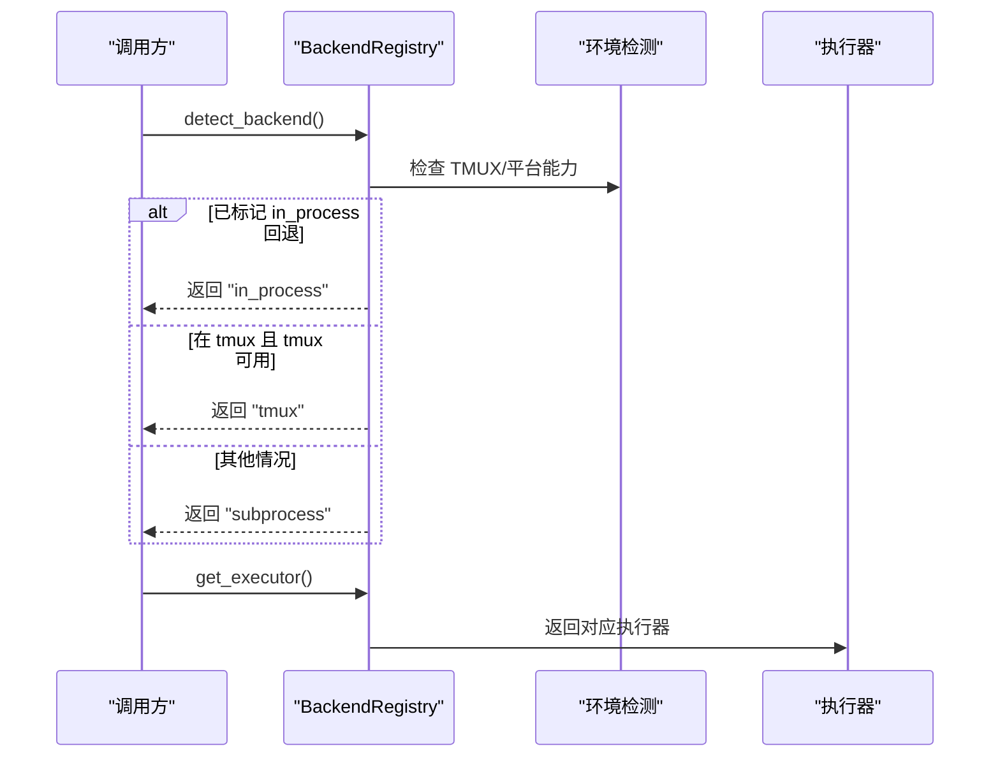
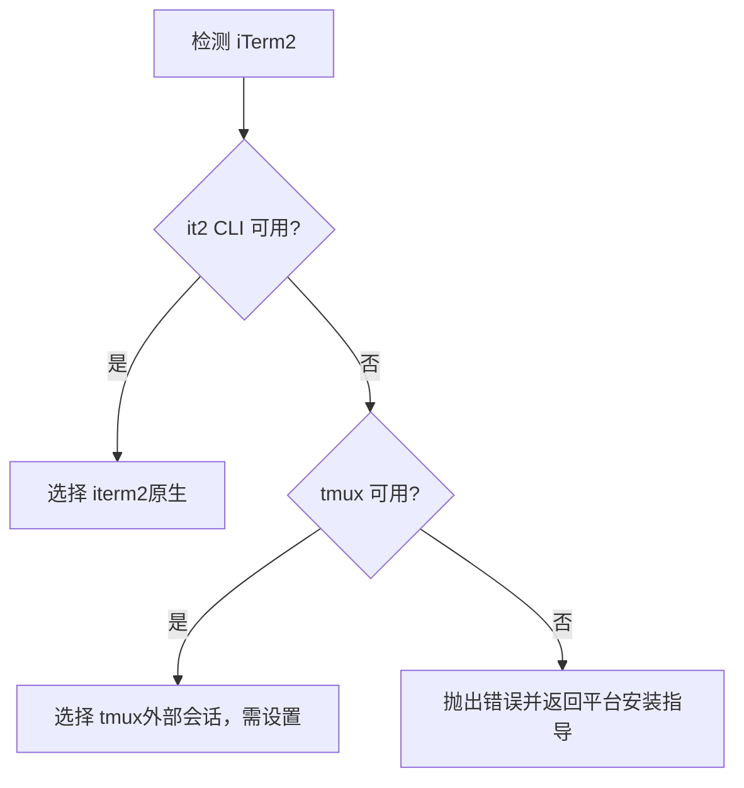
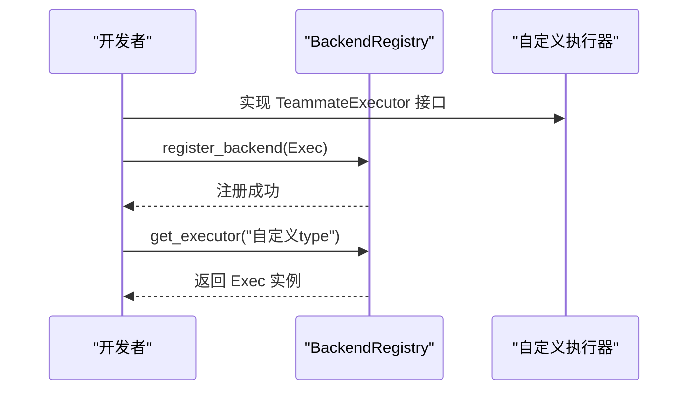
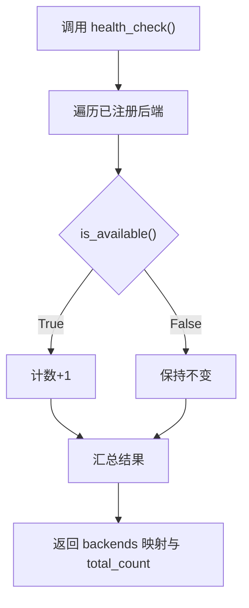
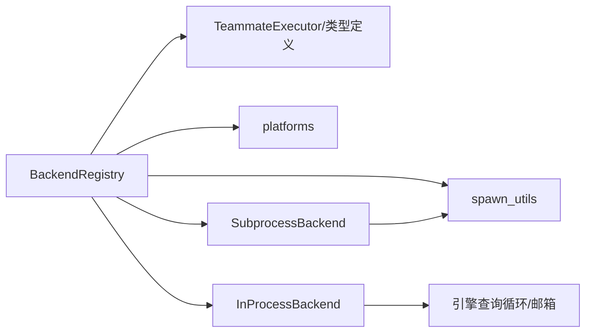

# 后端注册表

<cite>
**本文引用的文件**
- [src/openharness/swarm/registry.py](file://src/openharness/swarm/registry.py)
- [src/openharness/swarm/types.py](file://src/openharness/swarm/types.py)
- [src/openharness/swarm/in_process.py](file://src/openharness/swarm/in_process.py)
- [src/openharness/swarm/subprocess_backend.py](file://src/openharness/swarm/subprocess_backend.py)
- [src/openharness/swarm/spawn_utils.py](file://src/openharness/swarm/spawn_utils.py)
- [src/openharness/platforms.py](file://src/openharness/platforms.py)
- [tests/test_swarm/test_registry.py](file://tests/test_swarm/test_registry.py)
- [tests/test_swarm/test_types.py](file://tests/test_swarm/test_types.py)
</cite>

## 目录
1. [简介](#简介)
2. [项目结构](#项目结构)
3. [核心组件](#核心组件)
4. [架构总览](#架构总览)
5. [详细组件分析](#详细组件分析)
6. [依赖关系分析](#依赖关系分析)
7. [性能考量](#性能考量)
8. [故障排除指南](#故障排除指南)
9. [结论](#结论)
10. [附录](#附录)

## 简介
本文件面向 OpenHarness 的后端注册表系统，系统性阐述 BackendRegistry 类的设计与实现，详解后端检测优先级管道（in_process、tmux、subprocess），解释环境变量检测机制（TMUX、ITERM_SESSION_ID）与平台特定安装指导，介绍自定义后端注册方法与 TeammateExecutor 接口规范，并给出可用性检查、健康检查与缓存机制的技术细节，最后提供配置示例与故障排除建议。

## 项目结构
后端注册表位于 swarm 子系统中，围绕 TeammateExecutor 协议抽象出统一的执行后端接口，通过 BackendRegistry 统一注册、检测与获取执行器实例；默认注册 subprocess 与 in_process 两类后端，tmux 后端可按需注册；同时提供 pane 后端检测用于终端分屏场景（tmux/iTerm2）。

图示来源
- [src/openharness/swarm/registry.py:97-411](file://src/openharness/swarm/registry.py#L97-L411)
- [src/openharness/swarm/types.py:357-390](file://src/openharness/swarm/types.py#L357-L390)
- [src/openharness/swarm/subprocess_backend.py:28-172](file://src/openharness/swarm/subprocess_backend.py#L28-L172)
- [src/openharness/swarm/in_process.py:413-694](file://src/openharness/swarm/in_process.py#L413-L694)
- [src/openharness/swarm/spawn_utils.py:70-217](file://src/openharness/swarm/spawn_utils.py#L70-L217)
- [src/openharness/platforms.py:55-87](file://src/openharness/platforms.py#L55-L87)

章节来源
- [src/openharness/swarm/registry.py:1-411](file://src/openharness/swarm/registry.py#L1-L411)
- [src/openharness/swarm/types.py:1-399](file://src/openharness/swarm/types.py#L1-L399)

## 核心组件
- BackendRegistry：全局单例，负责后端注册、检测与获取，维护检测缓存与回退标记，提供健康检查与重置能力。
- TeammateExecutor 协议：统一的执行器接口，要求实现类型标识、可用性检查、spawn、send_message、shutdown。
- 内置后端：
  - SubprocessBackend：基于任务管理器的子进程执行。
  - InProcessBackend：在当前进程中作为 asyncio Task 运行，使用 ContextVar 隔离上下文。
- 环境检测工具：
  - TMUX/ITERM2 检测：通过环境变量判断运行环境。
  - spawn_utils：命令解析、环境变量继承、CLI 参数构建。
  - platforms：平台识别与能力矩阵，决定是否注册 in_process。

章节来源
- [src/openharness/swarm/registry.py:97-411](file://src/openharness/swarm/registry.py#L97-L411)
- [src/openharness/swarm/types.py:357-390](file://src/openharness/swarm/types.py#L357-L390)
- [src/openharness/swarm/subprocess_backend.py:28-172](file://src/openharness/swarm/subprocess_backend.py#L28-L172)
- [src/openharness/swarm/in_process.py:413-694](file://src/openharness/swarm/in_process.py#L413-L694)
- [src/openharness/swarm/spawn_utils.py:70-217](file://src/openharness/swarm/spawn_utils.py#L70-L217)
- [src/openharness/platforms.py:55-87](file://src/openharness/platforms.py#L55-L87)

## 架构总览
BackendRegistry 的职责是“注册 + 自动检测 + 缓存 + 获取”，并提供 pane 后端检测用于终端分屏场景。默认注册 subprocess 与 in_process（受平台能力影响），tmux 后端可选注册。检测优先级与行为如下：

图示来源
- [src/openharness/swarm/registry.py:128-183](file://src/openharness/swarm/registry.py#L128-L183)

## 详细组件分析

### BackendRegistry 类设计与实现
- 注册与获取
  - register_backend：按 executor.type 注册执行器。
  - get_executor：显式指定或自动检测后返回执行器实例。
  - get_preferred_backend：从配置或环境变量解析用户首选模式（auto/in_process/tmux）。
- 检测与缓存
  - detect_backend：优先 in_process 回退 > tmux > subprocess；结果缓存于 _detected/_detection_result。
  - mark_in_process_fallback：当无 pane 后端可用时，标记 in_process 为后续检测的首选。
  - reset：清空缓存并重新注册默认后端。
- 健康检查
  - health_check：遍历已注册后端调用 is_available，汇总可用数量。
- 默认注册
  - _register_defaults：注册 subprocess；若平台支持 swarm_mailbox，则注册 in_process；tmux 后端延迟注册。

图示来源
- [src/openharness/swarm/registry.py:97-411](file://src/openharness/swarm/registry.py#L97-L411)
- [src/openharness/swarm/types.py:357-390](file://src/openharness/swarm/types.py#L357-L390)
- [src/openharness/swarm/subprocess_backend.py:28-172](file://src/openharness/swarm/subprocess_backend.py#L28-L172)
- [src/openharness/swarm/in_process.py:413-694](file://src/openharness/swarm/in_process.py#L413-L694)

章节来源
- [src/openharness/swarm/registry.py:97-411](file://src/openharness/swarm/registry.py#L97-L411)

### 后端检测优先级管道
- in_process 回退优先：当 mark_in_process_fallback 被调用后，后续 detect_backend 直接返回 in_process。
- tmux 优先：若在 tmux 会话内且 tmux 可用，且 tmux 后端已注册，则选择 tmux。
- subprocess 回退：默认回退到 subprocess，保证安全可用。

图示来源
- [src/openharness/swarm/registry.py:128-183](file://src/openharness/swarm/registry.py#L128-L183)

章节来源
- [src/openharness/swarm/registry.py:128-183](file://src/openharness/swarm/registry.py#L128-L183)

### 环境变量检测机制与平台特定安装指导
- TMUX 检测：通过环境变量 TMUX 判断是否在 tmux 会话内，同时检查 tmux 二进制是否存在。
- iTerm2 检测：通过环境变量 ITERM_SESSION_ID 判断是否在 iTerm2 终端内；进一步检测 it2 CLI 是否可用。
- 平台能力：macOS/Linux/WSL 支持 tmux 与 swarm_mailbox；Windows 不支持 swarm_mailbox，tmux 不可用。
- 安装指导：根据平台返回不同安装说明，提示如何安装 tmux 或在 WSL 中安装 tmux。

图示来源
- [src/openharness/swarm/registry.py:185-268](file://src/openharness/swarm/registry.py#L185-L268)
- [src/openharness/platforms.py:55-87](file://src/openharness/platforms.py#L55-L87)

章节来源
- [src/openharness/swarm/registry.py:25-51](file://src/openharness/swarm/registry.py#L25-L51)
- [src/openharness/swarm/registry.py:185-268](file://src/openharness/swarm/registry.py#L185-L268)
- [src/openharness/platforms.py:55-87](file://src/openharness/platforms.py#L55-L87)

### 自定义后端注册与 TeammateExecutor 接口规范
- 注册方法：通过 register_backend 将自定义执行器按其 type 注册，后续可通过 get_executor(type) 获取。
- 接口规范：TeammateExecutor 协议要求实现 type、is_available、spawn、send_message、shutdown。
- 测试验证：测试覆盖了协议结构检查、缺失方法导致的类型检查失败等场景。

图示来源
- [src/openharness/swarm/registry.py:123-127](file://src/openharness/swarm/registry.py#L123-L127)
- [src/openharness/swarm/types.py:357-390](file://src/openharness/swarm/types.py#L357-L390)
- [tests/test_swarm/test_types.py:122-155](file://tests/test_swarm/test_types.py#L122-L155)

章节来源
- [src/openharness/swarm/registry.py:123-127](file://src/openharness/swarm/registry.py#L123-L127)
- [src/openharness/swarm/types.py:357-390](file://src/openharness/swarm/types.py#L357-L390)
- [tests/test_swarm/test_types.py:122-155](file://tests/test_swarm/test_types.py#L122-L155)

### 可用性检查、健康检查与缓存机制
- 可用性检查：各执行器实现 is_available，如 SubprocessBackend/InProcessBackend 均返回 True。
- 健康检查：BackendRegistry.health_check 遍历已注册执行器，统计可用数量与类型信息。
- 缓存机制：detect_backend 对首次检测结果进行缓存，避免重复检测；reset 可清空缓存并重新注册默认后端；mark_in_process_fallback 会清除缓存并强制下次检测重新计算。

图示来源
- [src/openharness/swarm/registry.py:340-362](file://src/openharness/swarm/registry.py#L340-L362)

章节来源
- [src/openharness/swarm/registry.py:340-362](file://src/openharness/swarm/registry.py#L340-L362)
- [src/openharness/swarm/registry.py:364-374](file://src/openharness/swarm/registry.py#L364-L374)

### TeammateExecutor 协议与数据模型
- 协议字段：type、is_available、spawn、send_message、shutdown。
- 数据模型：BackendType、BackendDetectionResult、TeammateSpawnConfig、SpawnResult、TeammateMessage 等。

章节来源
- [src/openharness/swarm/types.py:16-399](file://src/openharness/swarm/types.py#L16-L399)

### 内置后端实现要点
- SubprocessBackend
  - 使用任务管理器创建子进程，支持继承 CLI 标志与环境变量。
  - 通过 stdin 发送消息，JSON 行格式区分结构化消息与普通提示。
- InProcessBackend
  - 使用 asyncio Task 与 ContextVar 隔离每个同伴的状态。
  - 提供优雅关闭与强制终止两种策略，支持统计与状态查询。

章节来源
- [src/openharness/swarm/subprocess_backend.py:28-172](file://src/openharness/swarm/subprocess_backend.py#L28-L172)
- [src/openharness/swarm/in_process.py:413-694](file://src/openharness/swarm/in_process.py#L413-L694)

## 依赖关系分析
- BackendRegistry 依赖：
  - 平台能力：决定是否注册 in_process。
  - 环境检测：TMUX/ITERM2 检测与 tmux 可用性判断。
  - spawn_utils：命令解析、环境变量继承、CLI 参数构建。
  - TeammateExecutor 协议：统一接口约束。
- 执行器实现：
  - SubprocessBackend：依赖任务管理器与 spawn_utils。
  - InProcessBackend：依赖引擎查询循环与邮箱通信。

图示来源
- [src/openharness/swarm/registry.py:10-12](file://src/openharness/swarm/registry.py#L10-L12)
- [src/openharness/swarm/subprocess_backend.py:9-20](file://src/openharness/swarm/subprocess_backend.py#L9-L20)
- [src/openharness/platforms.py:55-87](file://src/openharness/platforms.py#L55-L87)

章节来源
- [src/openharness/swarm/registry.py:10-12](file://src/openharness/swarm/registry.py#L10-L12)
- [src/openharness/swarm/subprocess_backend.py:9-20](file://src/openharness/swarm/subprocess_backend.py#L9-L20)
- [src/openharness/platforms.py:55-87](file://src/openharness/platforms.py#L55-L87)

## 性能考量
- 检测缓存：detect_backend 结果缓存，避免重复 IO 与环境探测，提升启动速度。
- in_process 优势：无需进程间通信，上下文隔离通过 ContextVar 实现，延迟低、开销小。
- subprocess 代价：进程创建与 stdin/stdout 通信带来额外开销，但具备更强隔离性。
- 健康检查：health_check 仅调用 is_available，复杂度与已注册后端数量线性相关。

## 故障排除指南
- 无法检测到 tmux
  - 确认 TMUX 环境变量存在且 tmux 二进制在 PATH 中。
  - 若在 iTerm2 且未安装 it2 CLI，将触发安装提示；可按提示安装 it2。
- Windows 平台不可用
  - Windows 不支持 in_process 与 tmux，需在 WSL 中运行 tmux 或使用 subprocess。
- 自定义后端未生效
  - 确保自定义执行器实现了 TeammateExecutor 协议所有方法，否则类型检查会失败。
  - 使用 register_backend 注册后，通过 get_executor("自定义type") 获取。
- 检测结果不更新
  - 调用 reset 清除缓存后重新检测；或在必要时调用 mark_in_process_fallback 强制切换回 in_process。

章节来源
- [src/openharness/swarm/registry.py:185-268](file://src/openharness/swarm/registry.py#L185-L268)
- [src/openharness/platforms.py:68-77](file://src/openharness/platforms.py#L68-L77)
- [tests/test_swarm/test_types.py:144-155](file://tests/test_swarm/test_types.py#L144-L155)

## 结论
BackendRegistry 通过统一协议与优先级检测，将 in_process、tmux、subprocess 三类后端整合为一致的执行层，结合平台能力与环境变量检测，提供稳健的可用性保障。默认注册与缓存机制降低启动成本，健康检查便于运维观测。自定义后端可通过 TeammateExecutor 协议无缝接入，满足扩展需求。

## 附录

### 配置示例与最佳实践
- 设置首选后端
  - 通过配置字典传入 teammate_mode："auto"/"in_process"/"tmux"。
  - 或设置环境变量 OPENHARNESS_TEAMMATE_MODE："auto"/"in_process"/"tmux"。
- 自定义执行器注册
  - 实现 TeammateExecutor 接口，调用 register_backend 注册。
- 代理与证书透传
  - 通过 spawn_utils.build_inherited_env_vars 自动转发代理与证书相关环境变量，确保子进程访问一致性。

章节来源
- [src/openharness/swarm/registry.py:292-318](file://src/openharness/swarm/registry.py#L292-L318)
- [src/openharness/swarm/spawn_utils.py:185-206](file://src/openharness/swarm/spawn_utils.py#L185-L206)