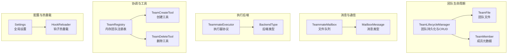
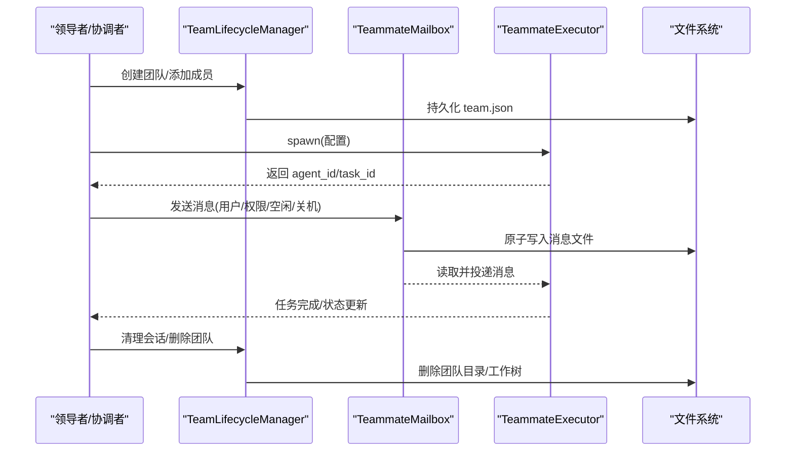
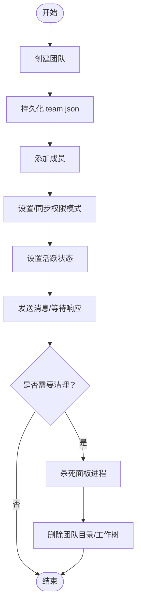
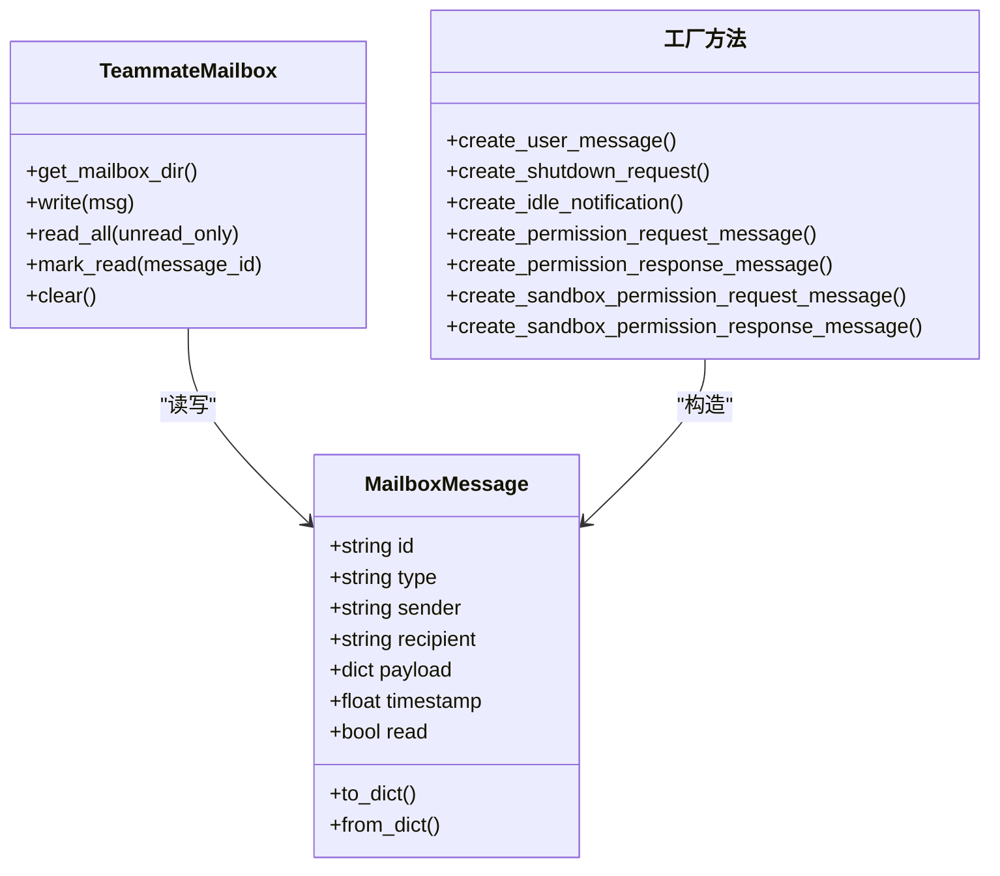
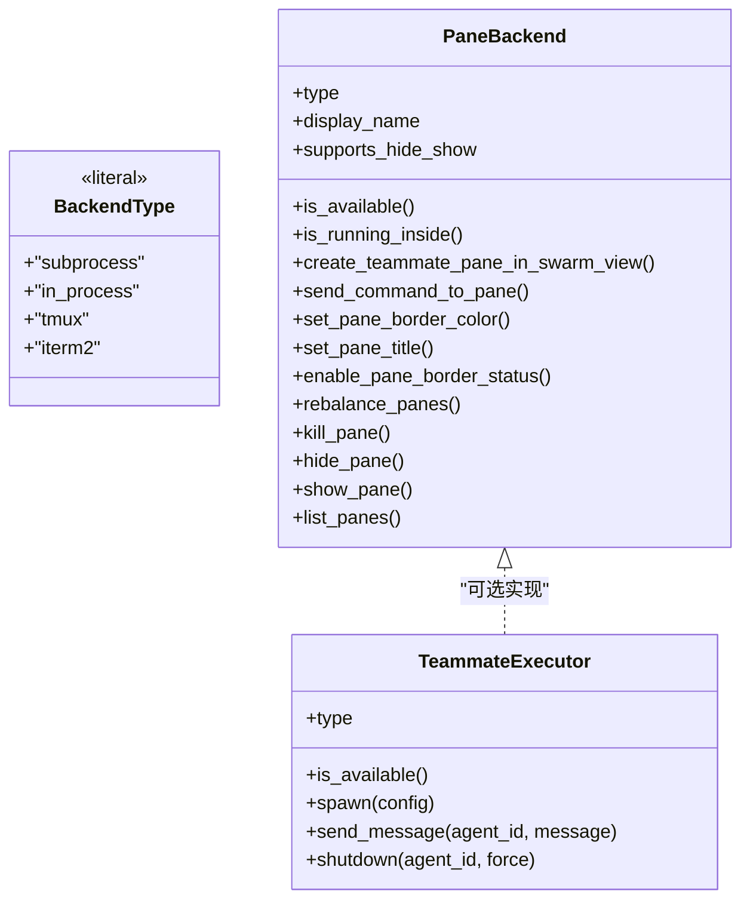
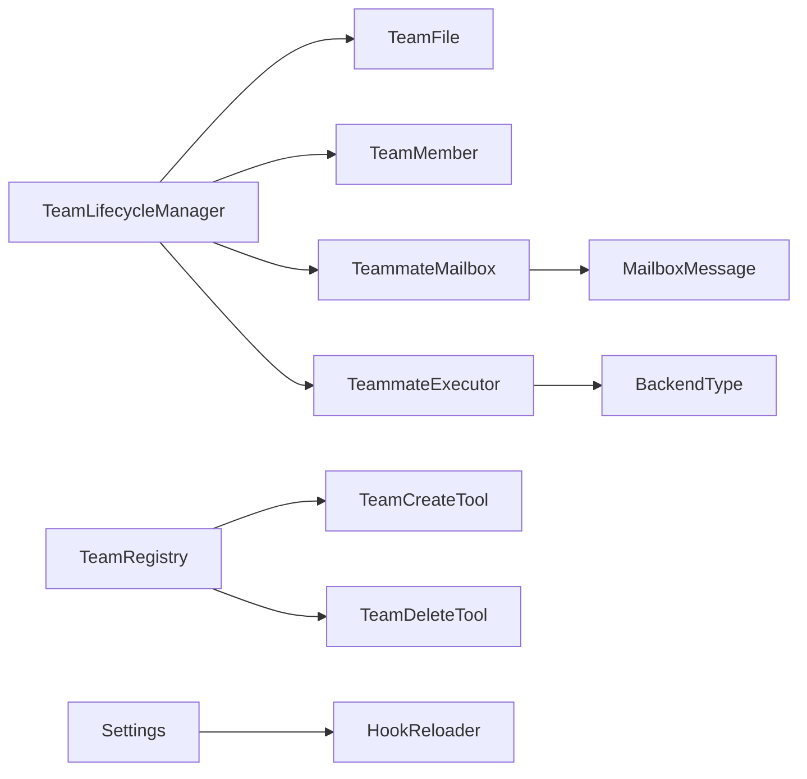

# 团队生命周期管理

<cite>
**本文引用的文件**
- [team_lifecycle.py](file://src/openharness/swarm/team_lifecycle.py)
- [types.py](file://src/openharness/swarm/types.py)
- [mailbox.py](file://src/openharness/swarm/mailbox.py)
- [coordinator_mode.py](file://src/openharness/coordinator/coordinator_mode.py)
- [hot_reload.py](file://src/openharness/hooks/hot_reload.py)
- [settings.py](file://src/openharness/config/settings.py)
- [team.py](file://src/openharness/memory/team.py)
- [team_create_tool.py](file://src/openharness/tools/team_create_tool.py)
- [team_delete_tool.py](file://src/openharness/tools/team_delete_tool.py)
- [test_team_lifecycle.py](file://tests/test_swarm/test_team_lifecycle.py)
- [test_in_process.py](file://tests/test_swarm/test_in_process.py)
- [test_registry.py](file://tests/test_coordinator/test_registry.py)
</cite>

## 目录
1. [简介](#简介)
2. [项目结构](#项目结构)
3. [核心组件](#核心组件)
4. [架构总览](#架构总览)
5. [详细组件分析](#详细组件分析)
6. [依赖关系分析](#依赖关系分析)
7. [性能考量](#性能考量)
8. [故障排查指南](#故障排查指南)
9. [结论](#结论)
10. [附录](#附录)

## 简介
本文件系统化阐述 OpenHarness 的团队生命周期管理系统，覆盖从团队创建、成员加入与状态管理、任务分派与执行、到团队销毁与资源清理的全链路流程；同时说明团队配置的动态更新与热重载能力、团队间通信协议与消息传递机制、监控与日志采集、以及多团队并行运行的配置与性能优化建议。目标是帮助开发者与运维人员在理解代码实现细节的同时，快速掌握如何安全、高效地使用与扩展团队生命周期管理能力。

## 项目结构
围绕团队生命周期的关键模块分布如下：
- 队列与消息：基于文件系统的异步消息队列，支持原子写入与并发安全
- 类型与协议：统一的后端类型、执行器协议、消息类型定义
- 生命周期管理：团队元数据持久化、成员管理、会话清理与工作树清理
- 协调模式：内存态团队注册表与任务通知格式
- 配置与热重载：设置模型与钩子热重载
- 工具接口：团队创建/删除等工具入口
- 内存与安全：团队共享记忆目录与敏感信息扫描

图示来源
- [team_lifecycle.py:780-911](file://src/openharness/swarm/team_lifecycle.py#L780-L911)
- [types.py:16-399](file://src/openharness/swarm/types.py#L16-L399)
- [mailbox.py:102-523](file://src/openharness/swarm/mailbox.py#L102-L523)
- [coordinator_mode.py:27-71](file://src/openharness/coordinator/coordinator_mode.py#L27-L71)
- [hot_reload.py:11-31](file://src/openharness/hooks/hot_reload.py#L11-L31)
- [settings.py:534-800](file://src/openharness/config/settings.py#L534-L800)
- [team_create_tool.py:18-32](file://src/openharness/tools/team_create_tool.py#L18-L32)
- [team_delete_tool.py:17-31](file://src/openharness/tools/team_delete_tool.py#L17-L31)

章节来源
- [team_lifecycle.py:1-911](file://src/openharness/swarm/team_lifecycle.py#L1-L911)
- [types.py:1-399](file://src/openharness/swarm/types.py#L1-L399)
- [mailbox.py:1-523](file://src/openharness/swarm/mailbox.py#L1-L523)
- [coordinator_mode.py:1-521](file://src/openharness/coordinator/coordinator_mode.py#L1-L521)
- [hot_reload.py:1-31](file://src/openharness/hooks/hot_reload.py#L1-L31)
- [settings.py:1-1030](file://src/openharness/config/settings.py#L1-L1030)
- [team_create_tool.py:1-32](file://src/openharness/tools/team_create_tool.py#L1-L32)
- [team_delete_tool.py:1-31](file://src/openharness/tools/team_delete_tool.py#L1-L31)

## 核心组件
- TeamLifecycleManager：负责团队的创建、查询、成员增删、权限模式同步、活跃状态更新、会话清理与工作树清理等持久化操作。
- TeamFile/TeamMember：团队与成员的序列化数据模型，支持磁盘读写与增量更新。
- TeammateMailbox/MailboxMessage：基于文件的原子消息队列，支持用户消息、权限请求/响应、沙箱权限请求/响应、空闲通知与关机请求等消息类型。
- TeammateExecutor/BackendType：抽象执行器协议与后端类型（子进程、进程内、tmux、iTerm2），统一 spawn/send_message/shutdown 接口。
- TeamRegistry：内存态团队注册表，用于协调模式下的轻量团队管理与任务通知格式。
- HookReloader/Settings：设置变更检测与钩子重新加载，实现配置的动态更新与热重载。
- TeamCreateTool/TeamDeleteTool：通过工具接口创建与删除内存态团队，便于与外部系统集成。

章节来源
- [team_lifecycle.py:780-911](file://src/openharness/swarm/team_lifecycle.py#L780-L911)
- [types.py:16-399](file://src/openharness/swarm/types.py#L16-L399)
- [mailbox.py:102-523](file://src/openharness/swarm/mailbox.py#L102-L523)
- [coordinator_mode.py:27-71](file://src/openharness/coordinator/coordinator_mode.py#L27-L71)
- [hot_reload.py:11-31](file://src/openharness/hooks/hot_reload.py#L11-L31)
- [settings.py:534-800](file://src/openharness/config/settings.py#L534-L800)
- [team_create_tool.py:18-32](file://src/openharness/tools/team_create_tool.py#L18-L32)
- [team_delete_tool.py:17-31](file://src/openharness/tools/team_delete_tool.py#L17-L31)

## 架构总览
下图展示了团队生命周期管理在系统中的位置与交互关系：Leader 通过工具或协调模式创建团队与成员，消息通过文件队列在团队成员之间传递；生命周期管理器负责团队元数据持久化与清理；配置层支持热重载以动态调整行为。

图示来源
- [team_lifecycle.py:780-911](file://src/openharness/swarm/team_lifecycle.py#L780-L911)
- [mailbox.py:102-523](file://src/openharness/swarm/mailbox.py#L102-L523)
- [types.py:357-399](file://src/openharness/swarm/types.py#L357-L399)

## 详细组件分析

### 组件一：TeamLifecycleManager（团队生命周期管理）
职责与特性
- 团队 CRUD：创建、列出、删除团队；成员增删与按条件移除（如 tmux pane 或 agent_id）。
- 成员状态与模式：设置成员权限模式、同步当前代理的权限模式、批量更新模式；设置成员活跃状态。
- 会话清理：注册/注销会话创建的团队，优雅/非优雅退出时清理面板进程与团队目录。
- 工作树清理：识别并销毁团队成员的工作树（优先 git worktree remove，失败回退至删除目录）。
- 数据持久化：TeamFile/TeamMember 序列化/反序列化，原子写入（.tmp 后 rename）。

关键流程示意

图示来源
- [team_lifecycle.py:780-911](file://src/openharness/swarm/team_lifecycle.py#L780-L911)
- [team_lifecycle.py:627-693](file://src/openharness/swarm/team_lifecycle.py#L627-L693)
- [team_lifecycle.py:746-773](file://src/openharness/swarm/team_lifecycle.py#L746-L773)

章节来源
- [team_lifecycle.py:780-911](file://src/openharness/swarm/team_lifecycle.py#L780-L911)
- [test_team_lifecycle.py:1-163](file://tests/test_swarm/test_team_lifecycle.py#L1-L163)

### 组件二：消息与通信（TeammateMailbox 与消息类型）
职责与特性
- 文件队列：每个消息作为独立 JSON 文件存储，采用 .tmp + rename 实现原子写入，避免部分读取。
- 并发安全：通过独占锁与线程池处理阻塞 I/O，避免并发冲突。
- 消息类型：用户消息、权限请求/响应、沙箱权限请求/响应、空闲通知、关机请求等。
- 辅助工厂：提供多种消息构造函数，便于在不同场景下发消息。

消息类型与工厂函数

图示来源
- [mailbox.py:38-76](file://src/openharness/swarm/mailbox.py#L38-L76)
- [mailbox.py:102-230](file://src/openharness/swarm/mailbox.py#L102-L230)
- [mailbox.py:237-396](file://src/openharness/swarm/mailbox.py#L237-L396)

章节来源
- [mailbox.py:1-523](file://src/openharness/swarm/mailbox.py#L1-L523)

### 组件三：执行后端与类型（BackendType 与 TeammateExecutor）
职责与特性
- BackendType：定义支持的后端类型（子进程、进程内、tmux、iTerm2）。
- PaneBackend：抽象终端面板管理（创建、隐藏/显示、命令发送、颜色标题、布局重排、关闭）。
- TeammateExecutor：统一的执行器协议，屏蔽不同后端差异，提供 spawn/send_message/shutdown 能力。
- 类型守卫：判断是否为面板后端，辅助路由与布局策略。

类关系示意

图示来源
- [types.py:16-399](file://src/openharness/swarm/types.py#L16-L399)

章节来源
- [types.py:1-399](file://src/openharness/swarm/types.py#L1-L399)

### 组件四：协调模式与团队注册表
职责与特性
- TeamRegistry：内存态团队注册表，支持创建/删除团队、添加代理、发送消息、列出团队。
- TaskNotification：标准化的任务完成通知格式，包含任务 ID、状态、摘要、结果与用量统计。
- 协调模式：通过环境变量控制，匹配会话模式，注入用户上下文与系统提示，提供工具集与工作流指导。

章节来源
- [coordinator_mode.py:27-71](file://src/openharness/coordinator/coordinator_mode.py#L27-L71)
- [coordinator_mode.py:79-157](file://src/openharness/coordinator/coordinator_mode.py#L79-L157)
- [coordinator_mode.py:186-521](file://src/openharness/coordinator/coordinator_mode.py#L186-L521)
- [test_registry.py:1-26](file://tests/test_coordinator/test_registry.py#L1-L26)

### 组件五：配置动态更新与热重载
职责与特性
- Settings：集中式设置模型，支持多源合并（CLI、环境变量、配置文件、默认值），包含权限、内存、沙箱、MCP 等配置。
- HookReloader：监听设置文件变更，触发钩子注册表重建，实现配置驱动的钩子热重载。

章节来源
- [settings.py:534-800](file://src/openharness/config/settings.py#L534-L800)
- [hot_reload.py:11-31](file://src/openharness/hooks/hot_reload.py#L11-L31)

### 组件六：工具接口（团队创建/删除）
职责与特性
- TeamCreateTool/TeamDeleteTool：通过工具接口创建与删除内存态团队，便于与外部系统集成与自动化编排。

章节来源
- [team_create_tool.py:18-32](file://src/openharness/tools/team_create_tool.py#L18-L32)
- [team_delete_tool.py:17-31](file://src/openharness/tools/team_delete_tool.py#L17-L31)

## 依赖关系分析
- TeamLifecycleManager 依赖 TeamFile/TeamMember 进行持久化，依赖 mailbox 目录结构进行消息投递。
- 执行后端通过 TeammateExecutor 抽象统一，支持多后端切换与面板管理。
- 协调模式与工具接口共同构成团队创建/删除的上层入口。
- 配置层通过 HookReloader 实现热重载，影响钩子与运行时行为。
- 内存与安全模块提供团队共享记忆的安全写入与敏感信息扫描。

图示来源
- [team_lifecycle.py:780-911](file://src/openharness/swarm/team_lifecycle.py#L780-L911)
- [types.py:16-399](file://src/openharness/swarm/types.py#L16-L399)
- [mailbox.py:102-523](file://src/openharness/swarm/mailbox.py#L102-L523)
- [coordinator_mode.py:27-71](file://src/openharness/coordinator/coordinator_mode.py#L27-L71)
- [hot_reload.py:11-31](file://src/openharness/hooks/hot_reload.py#L11-L31)
- [settings.py:534-800](file://src/openharness/config/settings.py#L534-L800)
- [team_create_tool.py:18-32](file://src/openharness/tools/team_create_tool.py#L18-L32)
- [team_delete_tool.py:17-31](file://src/openharness/tools/team_delete_tool.py#L17-L31)

章节来源
- [team_lifecycle.py:1-911](file://src/openharness/swarm/team_lifecycle.py#L1-L911)
- [types.py:1-399](file://src/openharness/swarm/types.py#L1-L399)
- [mailbox.py:1-523](file://src/openharness/swarm/mailbox.py#L1-L523)
- [coordinator_mode.py:1-521](file://src/openharness/coordinator/coordinator_mode.py#L1-L521)
- [hot_reload.py:1-31](file://src/openharness/hooks/hot_reload.py#L1-L31)
- [settings.py:1-1030](file://src/openharness/config/settings.py#L1-L1030)
- [team_create_tool.py:1-32](file://src/openharness/tools/team_create_tool.py#L1-L32)
- [team_delete_tool.py:1-31](file://src/openharness/tools/team_delete_tool.py#L1-L31)

## 性能考量
- 异步 I/O 与线程池：消息写入与读取通过事件循环与线程池处理阻塞 I/O，降低主线程阻塞风险。
- 原子写入：.tmp + rename 保证并发读取一致性，减少锁竞争。
- 并行清理：会话清理阶段并发杀死面板进程与删除目录，缩短整体停机时间。
- 后端选择：优先 in_process（若已激活）或 tmux/iTerm2（可用且在会话内），否则回退到子进程，平衡性能与稳定性。
- 工作树清理：优先 git worktree remove，失败回退 rmtree，兼顾可靠性与速度。

章节来源
- [mailbox.py:126-152](file://src/openharness/swarm/mailbox.py#L126-L152)
- [team_lifecycle.py:671-693](file://src/openharness/swarm/team_lifecycle.py#L671-L693)
- [types.py:128-135](file://src/openharness/swarm/types.py#L128-L135)

## 故障排查指南
常见问题与处理
- 消息读取异常：消息文件损坏或不完整时，读取逻辑会跳过错误文件，避免崩溃；建议检查磁盘空间与权限。
- 并发写入冲突：通过独占锁与临时文件确保原子性；若出现锁文件残留，需手动清理或重启服务。
- 面板进程孤儿：优雅退出时先尝试杀死面板进程，再删除目录；非优雅退出可通过会话清理流程自动处理。
- 权限模式未生效：确认环境变量 CLAUDE_CODE_TEAM_NAME 与 CLAUDE_CODE_AGENT_NAME 设置正确，或使用同步函数更新。
- 工作树删除失败：git worktree remove 失败时回退 rmtree；若仍失败，检查路径权限与磁盘占用。

章节来源
- [mailbox.py:163-178](file://src/openharness/swarm/mailbox.py#L163-L178)
- [team_lifecycle.py:627-693](file://src/openharness/swarm/team_lifecycle.py#L627-L693)
- [team_lifecycle.py:746-773](file://src/openharness/swarm/team_lifecycle.py#L746-L773)
- [test_in_process.py:169-182](file://tests/test_swarm/test_in_process.py#L169-L182)

## 结论
OpenHarness 的团队生命周期管理以“文件系统消息队列 + 可插拔执行后端 + 持久化团队元数据”为核心，实现了从创建到销毁的全链路闭环。通过异步 I/O、原子写入与并发清理保障了高可靠与高性能；通过协调模式与工具接口提供了灵活的上层集成；通过配置热重载与钩子机制实现了动态行为调整。结合本文提供的监控、日志与故障排查建议，可在生产环境中稳定运行多团队并行场景。

## 附录
- 多团队并行运行建议
  - 使用不同的团队名称与工作树隔离，避免文件写入冲突。
  - 在 tmux/iTerm2 中启用面板布局与隐藏/显示功能，提升可视化效率。
  - 对于高并发场景，优先选择 in_process 或 tmux 后端，并合理设置超时与重试策略。
- 监控与日志
  - 利用执行后端的状态接口（如 in_process 的状态字典）采集任务耗时与完成状态。
  - 记录消息队列的读写延迟与错误计数，定位 I/O 性能瓶颈。
  - 通过 TaskNotification 汇总任务结果与用量，形成可观测性报表。
- 安全与合规
  - 使用团队共享记忆的安全写入与敏感信息扫描，防止密钥泄露。
  - 严格限制工作树与文件系统访问，遵循最小权限原则。