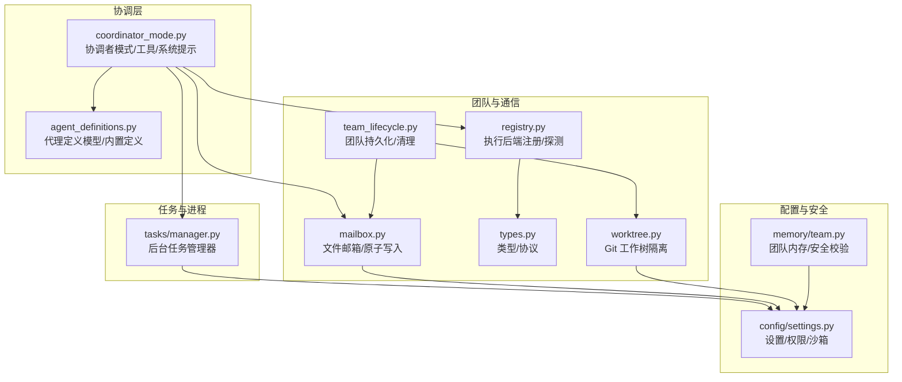
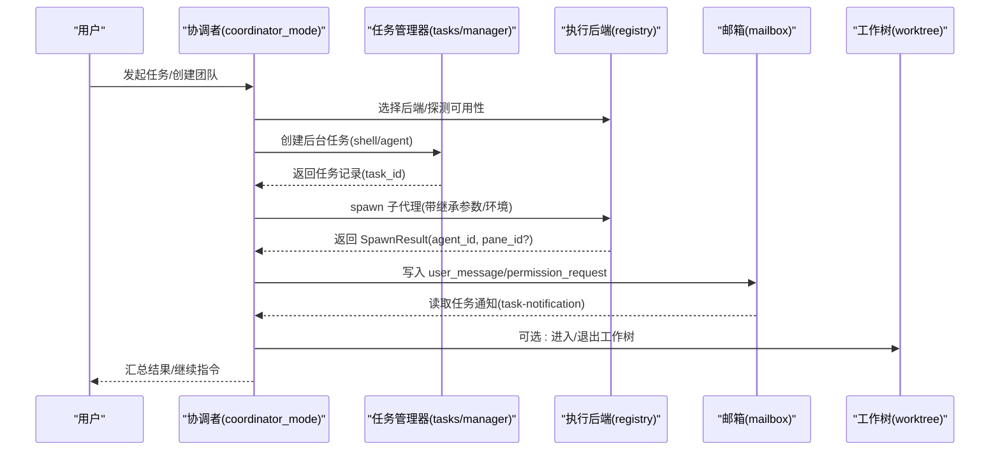
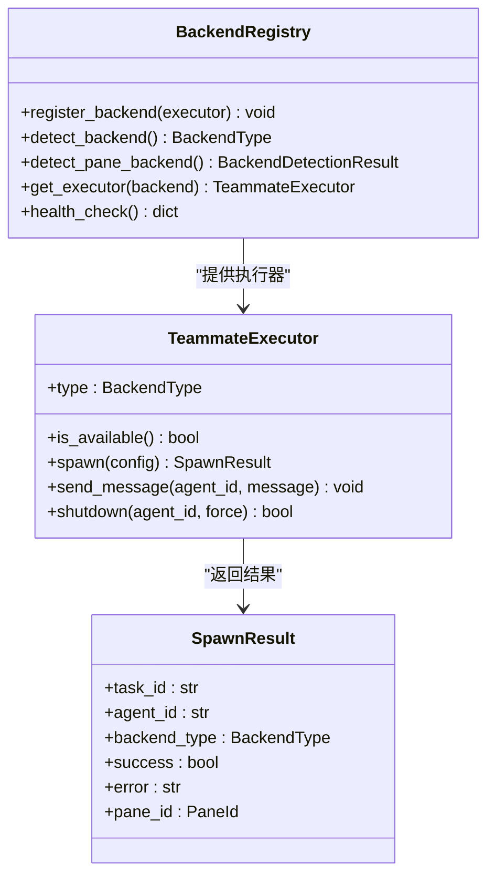
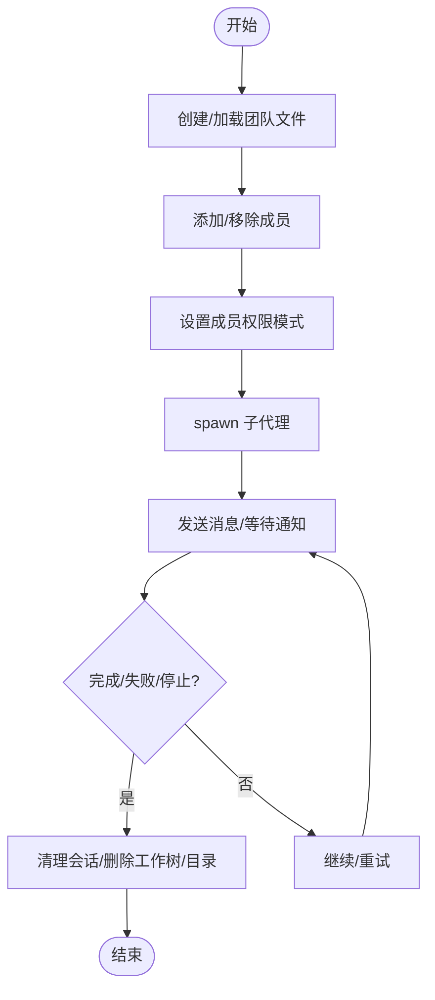
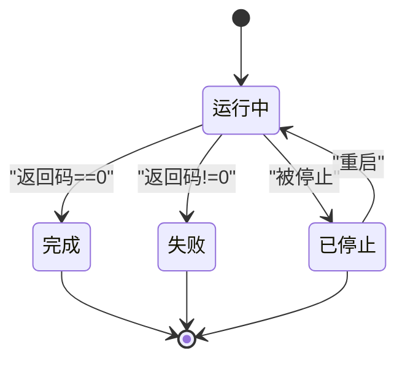
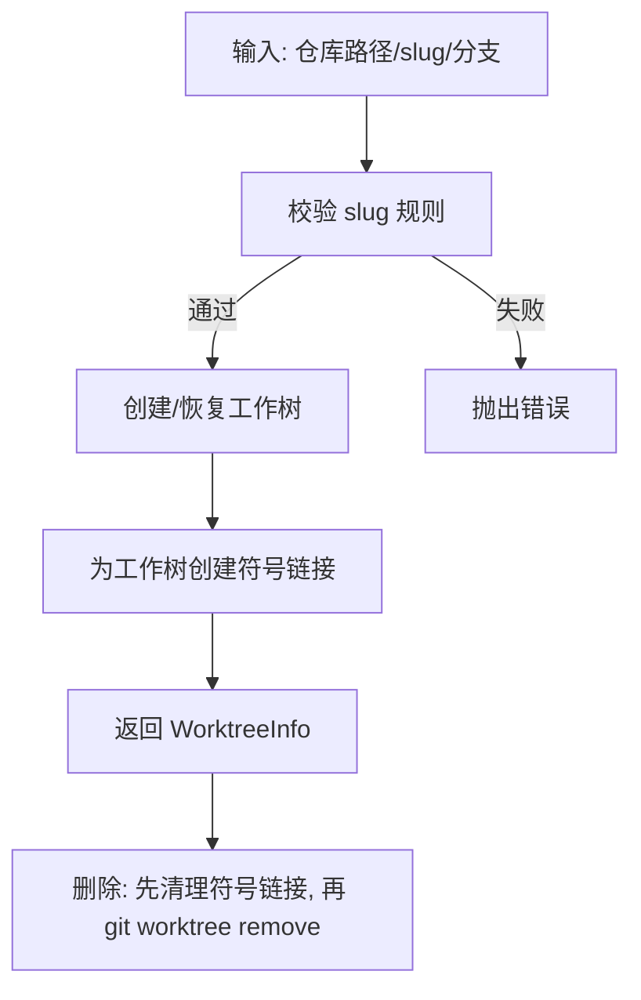
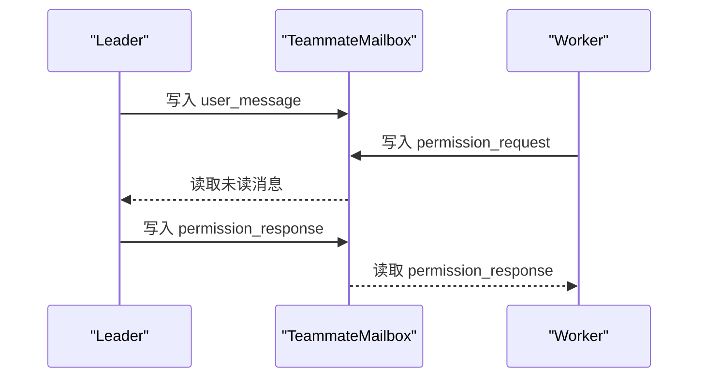
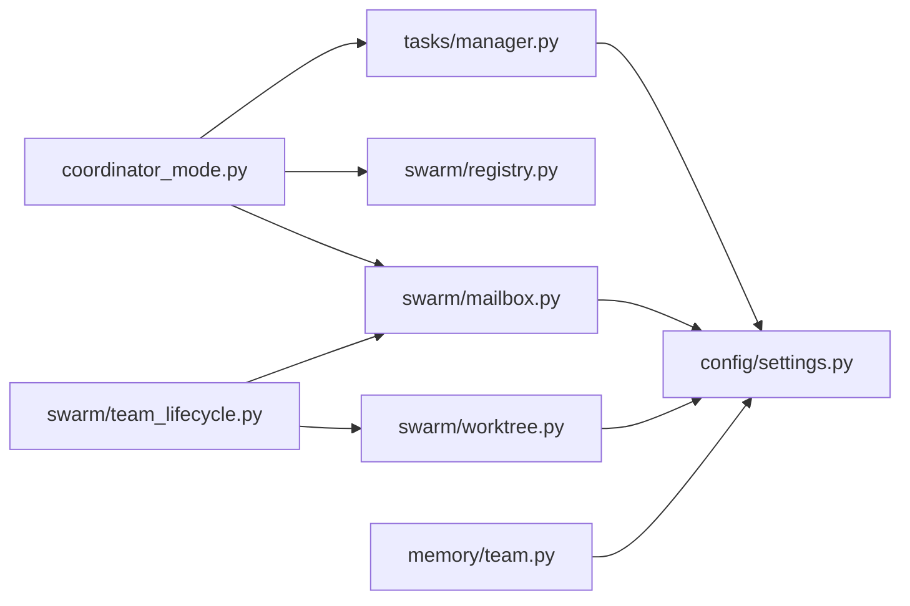

# 多代理协调

<cite>
**本文引用的文件**
- [worktree.py](file://src/openharness/swarm/worktree.py)
- [team_lifecycle.py](file://src/openharness/swarm/team_lifecycle.py)
- [coordinator_mode.py](file://src/openharness/coordinator/coordinator_mode.py)
- [registry.py](file://src/openharness/swarm/registry.py)
- [types.py](file://src/openharness/swarm/types.py)
- [mailbox.py](file://src/openharness/swarm/mailbox.py)
- [manager.py](file://src/openharness/tasks/manager.py)
- [team.py](file://src/openharness/memory/team.py)
- [agent_definitions.py](file://src/openharness/coordinator/agent_definitions.py)
- [team_create_tool.py](file://src/openharness/tools/team_create_tool.py)
- [task_create_tool.py](file://src/openharness/tools/task_create_tool.py)
- [enter_worktree_tool.py](file://src/openharness/tools/enter_worktree_tool.py)
- [exit_worktree_tool.py](file://src/openharness/tools/exit_worktree_tool.py)
- [spawn_utils.py](file://src/openharness/swarm/spawn_utils.py)
- [settings.py](file://src/openharness/config/settings.py)
</cite>

## 目录
1. [简介](#简介)
2. [项目结构](#项目结构)
3. [核心组件](#核心组件)
4. [架构总览](#架构总览)
5. [组件详解](#组件详解)
6. [依赖关系分析](#依赖关系分析)
7. [性能与可扩展性](#性能与可扩展性)
8. [故障排查指南](#故障排查指南)
9. [结论](#结论)
10. [附录：配置与最佳实践](#附录配置与最佳实践)

## 简介
本文件面向 OpenHarness 的多代理协调系统，系统化阐述子代理的生成与委托机制、团队注册表与任务管理设计、后台任务生命周期、工作树隔离在多代理协作中的作用，并给出任务调度、资源分配、通信协议等高级主题的实践建议与案例。

## 项目结构
OpenHarness 将多代理协调能力分布在多个模块中：
- 协调与编排：coordinator 模块负责模式检测、工具注入、系统提示与任务通知格式；agent_definitions 提供内置与自定义代理定义。
- 团队与消息：swarm 模块提供团队生命周期、邮箱式消息总线、执行后端注册与探测、工作树隔离。
- 任务与进程：tasks 模块提供后台任务管理器，统一管理 shell 与本地代理子进程。
- 配置与安全：config/settings 定义全局设置、权限与沙箱策略；memory/team 提供团队共享内存的安全写入与敏感信息扫描。

图表来源
- [coordinator_mode.py:186-521](file://src/openharness/coordinator/coordinator_mode.py#L186-L521)
- [agent_definitions.py:60-136](file://src/openharness/coordinator/agent_definitions.py#L60-L136)
- [team_lifecycle.py:780-911](file://src/openharness/swarm/team_lifecycle.py#L780-L911)
- [mailbox.py:102-231](file://src/openharness/swarm/mailbox.py#L102-L231)
- [registry.py:97-411](file://src/openharness/swarm/registry.py#L97-L411)
- [types.py:16-399](file://src/openharness/swarm/types.py#L16-L399)
- [worktree.py:135-316](file://src/openharness/swarm/worktree.py#L135-L316)
- [manager.py:49-476](file://src/openharness/tasks/manager.py#L49-L476)
- [settings.py:534-800](file://src/openharness/config/settings.py#L534-L800)
- [team.py:16-91](file://src/openharness/memory/team.py#L16-L91)

章节来源
- [coordinator_mode.py:186-521](file://src/openharness/coordinator/coordinator_mode.py#L186-L521)
- [agent_definitions.py:60-136](file://src/openharness/coordinator/agent_definitions.py#L60-L136)
- [team_lifecycle.py:780-911](file://src/openharness/swarm/team_lifecycle.py#L780-L911)
- [mailbox.py:102-231](file://src/openharness/swarm/mailbox.py#L102-L231)
- [registry.py:97-411](file://src/openharness/swarm/registry.py#L97-L411)
- [types.py:16-399](file://src/openharness/swarm/types.py#L16-L399)
- [worktree.py:135-316](file://src/openharness/swarm/worktree.py#L135-L316)
- [manager.py:49-476](file://src/openharness/tasks/manager.py#L49-L476)
- [settings.py:534-800](file://src/openharness/config/settings.py#L534-L800)
- [team.py:16-91](file://src/openharness/memory/team.py#L16-L91)

## 核心组件
- 协调者模式与工具集：通过环境变量与系统提示注入协调者角色，提供 spawn/continue/stop 等工具，规范任务通知的 XML 结构。
- 执行后端注册与探测：自动选择 tmux/子进程/原生进程等后端，支持 pane 后端（tmux/iTerm2）的创建与控制。
- 文件邮箱消息总线：以原子 JSON 文件实现 leader-worker 间异步通信，支持权限请求/响应、沙箱权限、空闲通知与关机信号。
- 团队生命周期管理：团队元数据持久化到磁盘，支持成员增删、状态同步、会话清理与工作树清理。
- 后台任务管理器：统一管理 shell 命令与本地代理子进程，提供重启、输出读取、完成监听与优雅关闭。
- 工作树隔离：基于 Git worktree 的隔离目录，支持符号链接缓存目录、路径验证与清理。
- 代理定义与内置模板：标准化代理字段（工具、技能、MCP、权限模式、隔离方式等），内置 Explore/Plan/worker/verification 等模板。
- 配置与安全：集中设置模型、权限、沙箱、插件、MCP 服务器等；团队内存写入进行路径与敏感信息校验。

章节来源
- [coordinator_mode.py:186-521](file://src/openharness/coordinator/coordinator_mode.py#L186-L521)
- [registry.py:97-411](file://src/openharness/swarm/registry.py#L97-L411)
- [mailbox.py:102-231](file://src/openharness/swarm/mailbox.py#L102-L231)
- [team_lifecycle.py:780-911](file://src/openharness/swarm/team_lifecycle.py#L780-L911)
- [manager.py:49-476](file://src/openharness/tasks/manager.py#L49-L476)
- [worktree.py:135-316](file://src/openharness/swarm/worktree.py#L135-L316)
- [agent_definitions.py:60-136](file://src/openharness/coordinator/agent_definitions.py#L60-L136)
- [settings.py:534-800](file://src/openharness/config/settings.py#L534-L800)
- [team.py:16-91](file://src/openharness/memory/team.py#L16-L91)

## 架构总览
下图展示多代理协调的关键交互：协调者通过工具创建团队/任务，使用执行后端启动子代理；子代理通过邮箱向协调者汇报结果；团队生命周期与工作树保障隔离与清理；任务管理器统一生命周期与输出。

图表来源
- [coordinator_mode.py:186-521](file://src/openharness/coordinator/coordinator_mode.py#L186-L521)
- [manager.py:49-476](file://src/openharness/tasks/manager.py#L49-L476)
- [registry.py:97-411](file://src/openharness/swarm/registry.py#L97-L411)
- [mailbox.py:102-231](file://src/openharness/swarm/mailbox.py#L102-L231)
- [worktree.py:135-316](file://src/openharness/swarm/worktree.py#L135-L316)

## 组件详解

### 子代理生成与委托机制
- 工具注入：协调者模式下注入 spawn/continue/stop 等工具，系统提示明确并发与合成规范。
- 执行后端选择：优先 tmux/iTerm2 pane 后端，否则回退到子进程或原生进程；失败时可标记进入原生进程回退模式。
- 继承参数与环境：构建 CLI 标志与环境变量转发，确保子代理与父进程一致的模型、权限模式、插件与设置。
- 消息协议：通过邮箱写入 user_message/permission_request 等，解析统一的 task-notification XML。

图表来源
- [types.py:357-399](file://src/openharness/swarm/types.py#L357-L399)
- [registry.py:97-411](file://src/openharness/swarm/registry.py#L97-L411)
- [types.py:321-341](file://src/openharness/swarm/types.py#L321-L341)

章节来源
- [coordinator_mode.py:186-521](file://src/openharness/coordinator/coordinator_mode.py#L186-L521)
- [spawn_utils.py:70-217](file://src/openharness/swarm/spawn_utils.py#L70-L217)
- [registry.py:97-411](file://src/openharness/swarm/registry.py#L97-L411)
- [types.py:357-399](file://src/openharness/swarm/types.py#L357-L399)

### 团队注册表与任务管理
- 团队持久化：团队元数据保存为 team.json，支持成员、权限路径、隐藏面板等字段；提供同步/异步读写辅助函数。
- 成员管理：按 agent_id/name 移除成员、设置模式、同步当前 agent 的模式；支持会话清理与 pane 杀死。
- 任务管理：统一管理 shell 与本地代理子进程，支持命令行/argv 启动、stdin 写入、输出读取、完成监听、优雅关闭与重启。

图表来源
- [team_lifecycle.py:780-911](file://src/openharness/swarm/team_lifecycle.py#L780-L911)
- [team_lifecycle.py:671-693](file://src/openharness/swarm/team_lifecycle.py#L671-L693)
- [manager.py:49-476](file://src/openharness/tasks/manager.py#L49-L476)

章节来源
- [team_lifecycle.py:780-911](file://src/openharness/swarm/team_lifecycle.py#L780-L911)
- [team_lifecycle.py:671-693](file://src/openharness/swarm/team_lifecycle.py#L671-L693)
- [manager.py:49-476](file://src/openharness/tasks/manager.py#L49-L476)

### 后台任务生命周期管理
- 生命周期：running/failed/completed/killed；支持任务更新、输出读取、完成监听回调。
- 重启策略：当子代理断开或崩溃时自动重启，保留输出日志并标注重启信息。
- 关闭流程：优雅终止（terminate）与强制终止（kill），关闭 stdin 并等待进程退出。

图表来源
- [manager.py:249-272](file://src/openharness/tasks/manager.py#L249-L272)
- [manager.py:346-364](file://src/openharness/tasks/manager.py#L346-L364)

章节来源
- [manager.py:49-476](file://src/openharness/tasks/manager.py#L49-L476)

### 工作树（Worktree）隔离与协作
- 路径与分支：支持 slug 规范化、分支命名、符号链接常用目录（如 node_modules、.venv）以减少存储占用。
- 创建/删除：快速恢复已存在工作树；删除前先清理符号链接，再调用 git worktree remove。
- 清理策略：按活跃 agent_id 清理过期工作树，避免资源泄露。

图表来源
- [worktree.py:21-56](file://src/openharness/swarm/worktree.py#L21-L56)
- [worktree.py:150-212](file://src/openharness/swarm/worktree.py#L150-L212)
- [worktree.py:213-252](file://src/openharness/swarm/worktree.py#L213-L252)

章节来源
- [worktree.py:135-316](file://src/openharness/swarm/worktree.py#L135-L316)

### 邮箱式消息总线与权限协议
- 数据模型：MailboxMessage 支持 user_message、permission_request/response、sandbox_permission_request/response、shutdown、idle_notification 等类型。
- 原子写入：使用 .tmp + rename 避免部分读取；锁文件保护并发写入。
- 类型守卫：提供 is_permission_request/is_sandbox_permission_response 等类型判断辅助。

图表来源
- [mailbox.py:102-231](file://src/openharness/swarm/mailbox.py#L102-L231)
- [mailbox.py:403-462](file://src/openharness/swarm/mailbox.py#L403-L462)

章节来源
- [mailbox.py:102-231](file://src/openharness/swarm/mailbox.py#L102-L231)

### 代理定义与内置模板
- 定义模型：AgentDefinition 包含名称、描述、系统提示、工具、技能、MCP、钩子、颜色、模型、努力级别、权限模式、最大轮次、记忆范围、隔离方式等。
- 内置模板：general-purpose、Explore、Plan、worker、verification 等，覆盖探索、规划、实现与验证阶段。

章节来源
- [agent_definitions.py:60-136](file://src/openharness/coordinator/agent_definitions.py#L60-L136)
- [agent_definitions.py:510-621](file://src/openharness/coordinator/agent_definitions.py#L510-L621)

### 配置与安全
- 设置模型：集中管理 API、权限、内存、沙箱、插件、MCP 服务器、主题与输出风格等。
- 权限与沙箱：支持网络/文件系统限制、Docker 沙箱参数、路径规则与命令拒绝列表。
- 团队内存：写入前进行路径合法性与符号链接逃逸检查，扫描潜在敏感信息并阻止写入。

章节来源
- [settings.py:534-800](file://src/openharness/config/settings.py#L534-L800)
- [team.py:16-91](file://src/openharness/memory/team.py#L16-L91)

## 依赖关系分析
- 协调者依赖任务管理器与执行后端注册表，通过工具注入与系统提示驱动子代理行为。
- 团队生命周期与邮箱共同构成 leader-worker 通信通道，配合工作树实现隔离。
- 配置模块贯穿全局，影响代理行为、权限与沙箱策略；团队内存提供跨进程共享但受安全约束。

图表来源
- [coordinator_mode.py:186-521](file://src/openharness/coordinator/coordinator_mode.py#L186-L521)
- [manager.py:49-476](file://src/openharness/tasks/manager.py#L49-L476)
- [registry.py:97-411](file://src/openharness/swarm/registry.py#L97-L411)
- [mailbox.py:102-231](file://src/openharness/swarm/mailbox.py#L102-L231)
- [team_lifecycle.py:780-911](file://src/openharness/swarm/team_lifecycle.py#L780-L911)
- [worktree.py:135-316](file://src/openharness/swarm/worktree.py#L135-L316)
- [settings.py:534-800](file://src/openharness/config/settings.py#L534-L800)
- [team.py:16-91](file://src/openharness/memory/team.py#L16-L91)

章节来源
- [coordinator_mode.py:186-521](file://src/openharness/coordinator/coordinator_mode.py#L186-L521)
- [registry.py:97-411](file://src/openharness/swarm/registry.py#L97-L411)
- [mailbox.py:102-231](file://src/openharness/swarm/mailbox.py#L102-L231)
- [team_lifecycle.py:780-911](file://src/openharness/swarm/team_lifecycle.py#L780-L911)
- [manager.py:49-476](file://src/openharness/tasks/manager.py#L49-L476)
- [worktree.py:135-316](file://src/openharness/swarm/worktree.py#L135-L316)
- [settings.py:534-800](file://src/openharness/config/settings.py#L534-L800)
- [team.py:16-91](file://src/openharness/memory/team.py#L16-L91)

## 性能与可扩展性
- 并发与并行：协调者鼓励并行研究与实现，避免串行；写操作在同一文件集合上串行化，读操作异步化。
- I/O 优化：邮箱采用原子写入与锁文件，减少竞争；工作树符号链接减少重复存储。
- 资源回收：会话清理与工作树清理确保长期运行不泄漏；任务管理器支持优雅关闭与重启。
- 可观测性：任务输出文件尾部读取、完成监听回调、重启计数与状态注记便于问题定位。

[本节为通用指导，无需特定文件引用]

## 故障排查指南
- 子代理无法启动：检查执行后端可用性与探测结果；确认环境变量与 CLI 标志正确转发；查看任务输出日志与重启计数。
- 权限被拒：核对权限模式与工具白名单；检查邮箱中的 permission_request/response；必要时调整 team_allowed_paths。
- 工作树异常：确认 slug 合法性与分支命名；删除前确保符号链接清理；检查 git 工作树目录是否存在。
- 团队清理失败：检查 session 注册与 pane 杀死逻辑；确认 team.json 是否存在且可写；必要时手动清理目录。

章节来源
- [registry.py:97-411](file://src/openharness/swarm/registry.py#L97-L411)
- [manager.py:49-476](file://src/openharness/tasks/manager.py#L49-L476)
- [mailbox.py:102-231](file://src/openharness/swarm/mailbox.py#L102-L231)
- [worktree.py:135-316](file://src/openharness/swarm/worktree.py#L135-L316)
- [team_lifecycle.py:671-693](file://src/openharness/swarm/team_lifecycle.py#L671-L693)

## 结论
OpenHarness 的多代理协调体系以“协调者模式 + 执行后端 + 文件邮箱 + 团队生命周期 + 后台任务管理 + 工作树隔离”为核心，既保证了子代理的独立性与可控性，又提供了高效的协作与可观测性。通过严格的权限与安全策略、完善的清理与回收机制，系统可在复杂工程场景中稳定运行并持续演进。

[本节为总结，无需特定文件引用]

## 附录：配置与最佳实践

### 多代理协调配置示例
- 协调者模式启用：通过环境变量开启协调者模式，系统提示注入工具上下文与 scratchpad 目录说明。
- 执行后端选择：优先 tmux/iTerm2 pane 后端；若不可用，回退到子进程；失败时可标记进入原生进程回退模式。
- 任务类型：local_bash 用于只读/脚本任务；local_agent 用于需要模型推理的任务；支持 argv 直接执行避免平台引号问题。
- 工作树隔离：在需要隔离文件系统变更时启用 worktree 模式；注意清理过期工作树与符号链接。

章节来源
- [coordinator_mode.py:186-521](file://src/openharness/coordinator/coordinator_mode.py#L186-L521)
- [spawn_utils.py:70-217](file://src/openharness/swarm/spawn_utils.py#L70-L217)
- [manager.py:49-476](file://src/openharness/tasks/manager.py#L49-L476)
- [worktree.py:135-316](file://src/openharness/swarm/worktree.py#L135-L316)

### 最佳实践
- 任务调度
  - 研究阶段并行启动多个 worker；实现阶段同一文件集合串行，避免竞态。
  - 使用 task-notification XML 明确状态与摘要，便于协调者聚合与汇报。
- 资源分配
  - 为不同角色（researcher/tester/verifier）配置独立权限模式与工具集。
  - 利用工作树隔离高风险实现，降低回滚成本。
- 通信协议
  - 使用邮箱消息类型守卫函数解析请求/响应，确保消息一致性。
  - 对于长耗时任务，定期发送 idle_notification 提升可观测性。
- 安全与合规
  - 团队内存写入前进行路径与敏感信息校验；禁止写入潜在密钥类内容。
  - 沙箱策略最小化放行域与文件系统访问，必要时启用 Docker 沙箱。

章节来源
- [mailbox.py:403-462](file://src/openharness/swarm/mailbox.py#L403-L462)
- [team.py:16-91](file://src/openharness/memory/team.py#L16-L91)
- [settings.py:534-800](file://src/openharness/config/settings.py#L534-L800)

### 实际案例
- 并行研究与实现：协调者同时启动 Explore/Plan/worker，分别负责探索、设计与实现；完成后由 verification agent 独立验证。
- 分支与工作树：在 worktree 中进行实验性修改，失败即删除工作树，保持主干干净。
- 权限与合规：对编辑敏感文件的请求进行权限审批，审批通过后才允许写入。

章节来源
- [agent_definitions.py:510-621](file://src/openharness/coordinator/agent_definitions.py#L510-L621)
- [worktree.py:135-316](file://src/openharness/swarm/worktree.py#L135-L316)
- [mailbox.py:277-341](file://src/openharness/swarm/mailbox.py#L277-L341)