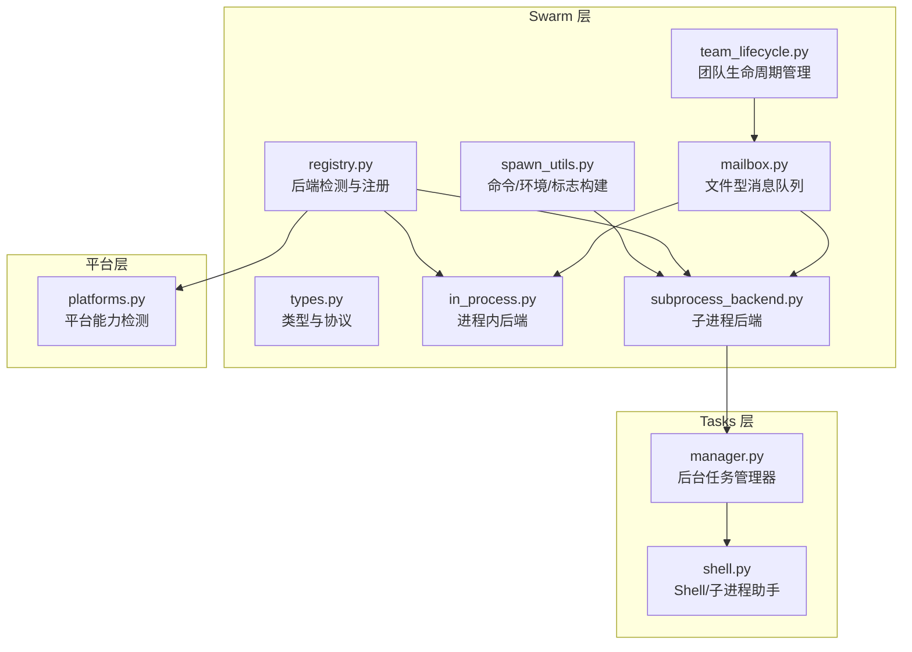
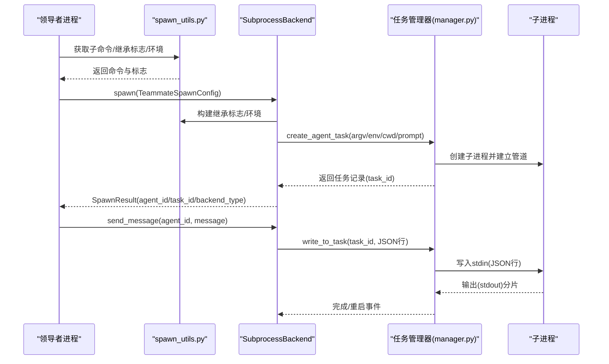
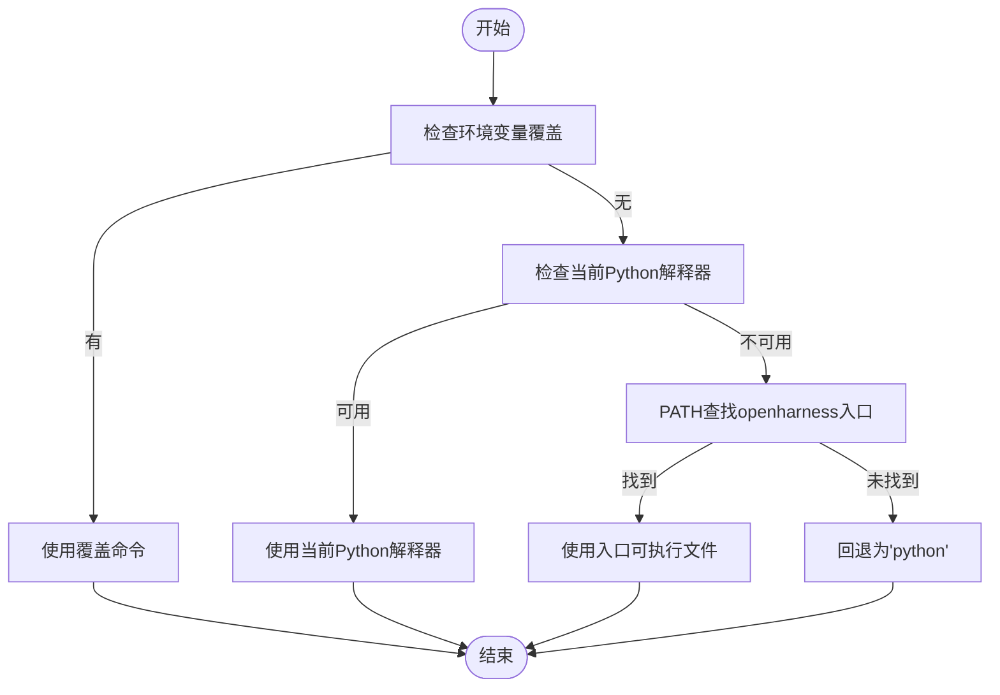
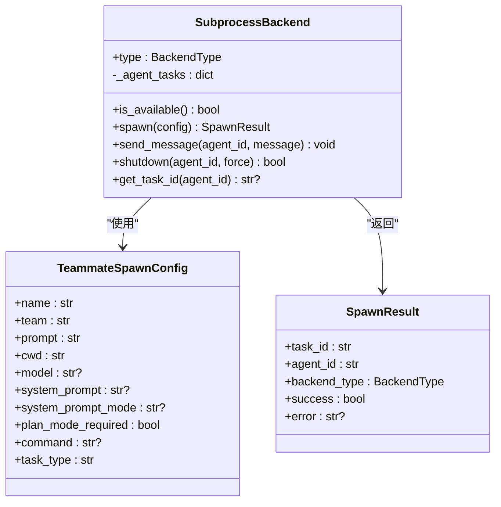
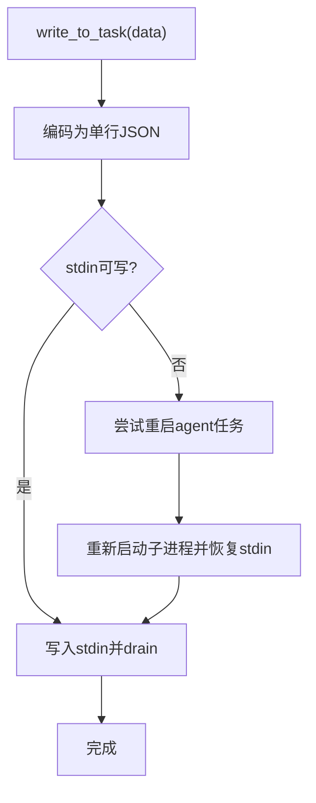
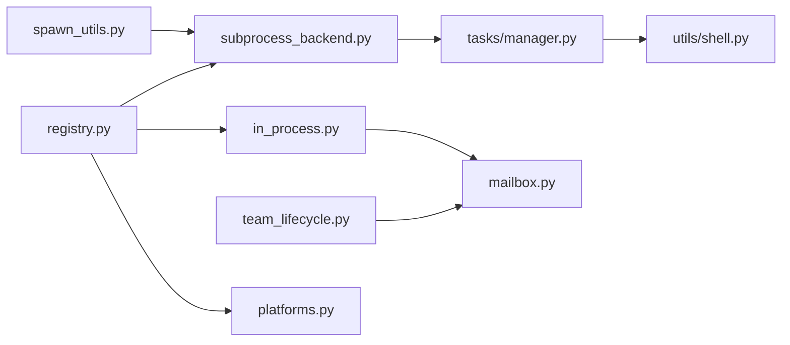

# 子进程生成工具

<cite>
**本文引用的文件**
- [spawn_utils.py](file://src/openharness/swarm/spawn_utils.py)
- [subprocess_backend.py](file://src/openharness/swarm/subprocess_backend.py)
- [types.py](file://src/openharness/swarm/types.py)
- [team_lifecycle.py](file://src/openharness/swarm/team_lifecycle.py)
- [registry.py](file://src/openharness/swarm/registry.py)
- [mailbox.py](file://src/openharness/swarm/mailbox.py)
- [in_process.py](file://src/openharness/swarm/in_process.py)
- [manager.py](file://src/openharness/tasks/manager.py)
- [shell.py](file://src/openharness/utils/shell.py)
- [platforms.py](file://src/openharness/platforms.py)
- [__init__.py](file://src/openharness/swarm/__init__.py)
</cite>

## 目录
1. [简介](#简介)
2. [项目结构](#项目结构)
3. [核心组件](#核心组件)
4. [架构总览](#架构总览)
5. [详细组件分析](#详细组件分析)
6. [依赖关系分析](#依赖关系分析)
7. [性能考量](#性能考量)
8. [故障排查指南](#故障排查指南)
9. [结论](#结论)
10. [附录](#附录)

## 简介
本文件面向 OpenHarness 的“子进程生成工具”体系，系统化阐述子代理（Teammate）的创建、启动与管理机制，重点覆盖以下方面：
- spawn_utils 模块中的命令解析、环境变量转发、CLI 标志构建等辅助函数的实现原理与使用方法
- 进程间通信（IPC）、信号处理与资源隔离的技术细节
- 子进程的环境配置、工作目录设置与权限继承机制
- 子进程监控、重启策略与故障转移的实现方案
- 跨平台兼容性处理与最佳实践
- 调试、日志收集与性能分析的方法

## 项目结构
OpenHarness 将“子代理执行后端”抽象为统一协议，并通过注册表按环境能力自动选择最优后端。spawn_utils 提供跨后端一致的子进程生成所需的基础能力；任务管理器负责实际的子进程生命周期与 IO；邮箱系统提供文件型消息队列用于 leader-worker 通信。

图示来源
- [spawn_utils.py:1-217](file://src/openharness/swarm/spawn_utils.py#L1-L217)
- [subprocess_backend.py:1-172](file://src/openharness/swarm/subprocess_backend.py#L1-L172)
- [types.py:1-399](file://src/openharness/swarm/types.py#L1-L399)
- [registry.py:1-411](file://src/openharness/swarm/registry.py#L1-L411)
- [mailbox.py:1-523](file://src/openharness/swarm/mailbox.py#L1-L523)
- [in_process.py:1-694](file://src/openharness/swarm/in_process.py#L1-L694)
- [team_lifecycle.py:1-911](file://src/openharness/swarm/team_lifecycle.py#L1-L911)
- [manager.py:1-476](file://src/openharness/tasks/manager.py#L1-L476)
- [shell.py:1-148](file://src/openharness/utils/shell.py#L1-L148)
- [platforms.py:1-88](file://src/openharness/platforms.py#L1-L88)

章节来源
- [__init__.py:1-71](file://src/openharness/swarm/__init__.py#L1-L71)

## 核心组件
- spawn_utils：提供“获取子进程命令”“构建继承 CLI 标志”“构建继承环境变量”“tmux 可用性判断”等基础能力，确保子进程与父进程在模型、权限模式、系统提示词、插件目录、执行模式等方面保持一致。
- subprocess_backend：将子代理以子进程方式运行，通过任务管理器进行创建、输入写入、终止控制，实现与父进程的标准流交互。
- in_process_backend：在当前进程中以 asyncio Task 形式运行子代理，借助 contextvars 实现上下文隔离，适合快速开发与测试场景。
- mailbox：基于文件系统的异步消息队列，支持原子写入、锁文件与只读标记，作为 leader 与 worker 的消息通道。
- team_lifecycle：持久化团队元数据（team.json），提供成员管理、会话清理、工作树清理等团队级生命周期操作。
- tasks/manager：统一的任务管理器，负责子进程的创建、输出复制、输入写入、重启与完成通知，屏蔽平台差异。
- utils/shell：平台感知的 shell 命令解析与子进程创建，支持沙箱包装与 PTY 包装。
- platforms：平台能力矩阵，决定是否启用 tmux、swarm 邮箱、沙箱等特性。

章节来源
- [spawn_utils.py:70-217](file://src/openharness/swarm/spawn_utils.py#L70-L217)
- [subprocess_backend.py:28-172](file://src/openharness/swarm/subprocess_backend.py#L28-L172)
- [in_process.py:413-694](file://src/openharness/swarm/in_process.py#L413-L694)
- [mailbox.py:102-230](file://src/openharness/swarm/mailbox.py#L102-L230)
- [team_lifecycle.py:780-911](file://src/openharness/swarm/team_lifecycle.py#L780-L911)
- [manager.py:49-476](file://src/openharness/tasks/manager.py#L49-L476)
- [shell.py:17-148](file://src/openharness/utils/shell.py#L17-L148)
- [platforms.py:55-88](file://src/openharness/platforms.py#L55-L88)

## 架构总览
下图展示从“spawn_utils”到“任务管理器”的关键调用链，以及“子进程后端”如何与“任务管理器”协作来完成子代理的创建与通信。

图示来源
- [spawn_utils.py:96-182](file://src/openharness/swarm/spawn_utils.py#L96-L182)
- [subprocess_backend.py:47-115](file://src/openharness/swarm/subprocess_backend.py#L47-L115)
- [manager.py:114-158](file://src/openharness/tasks/manager.py#L114-L158)

## 详细组件分析

### spawn_utils 模块详解
- get_teammate_command：解析子进程可执行命令优先级
  - 环境变量覆盖（OPENHARNESS_TEAMMATE_COMMAND）
  - 当前 Python 解释器（sys.executable）
  - PATH 中的可执行入口（openharness）
  - 默认回退为 “python”
- build_inherited_cli_flags：构建从父进程继承的 CLI 标志
  - 权限模式：跳过权限/接受编辑
  - 模型覆盖（排除“inherit”）
  - 系统提示词（默认/追加）
  - 设置文件路径（--settings）
  - 插件目录（--plugin-dir 多次）
  - 执行模式（--teammate-mode）
  - 额外标志（原样附加，调用方负责值转义）
- build_inherited_env_vars：构建要传递给子进程的环境变量
  - 固定注入：OPENHARNESS_AGENT_TEAMS=1、CLAUDE_CODE_COORDINATOR_MODE=0
  - 动态转发：API 密钥/基础地址、远程标记、代理、CA 证书、OpenHarness 自身提供商设置等
- is_tmux_available/is_inside_tmux：tmux 可用性与当前环境判断

图示来源
- [spawn_utils.py:70-94](file://src/openharness/swarm/spawn_utils.py#L70-L94)

章节来源
- [spawn_utils.py:70-217](file://src/openharness/swarm/spawn_utils.py#L70-L217)

### SubprocessBackend：子进程后端
- spawn：根据配置构建 argv/env，调用任务管理器创建本地 agent 任务；记录 agent_id -> task_id 映射
- send_message：将消息序列化为单行 JSON，写入对应任务的 stdin
- shutdown：通过任务管理器终止子进程，清理映射
- get_task_id：查询 agent 对应的任务 ID

图示来源
- [subprocess_backend.py:28-172](file://src/openharness/swarm/subprocess_backend.py#L28-L172)
- [types.py:258-314](file://src/openharness/swarm/types.py#L258-L314)
- [types.py:321-340](file://src/openharness/swarm/types.py#L321-L340)

章节来源
- [subprocess_backend.py:28-172](file://src/openharness/swarm/subprocess_backend.py#L28-L172)
- [types.py:258-340](file://src/openharness/swarm/types.py#L258-L340)

### InProcessBackend：进程内后端
- 使用 asyncio.Task 在当前进程内运行子代理，通过 contextvars 实现上下文隔离
- 支持优雅取消与强制终止，维护活跃代理列表与统计信息
- 通过邮箱系统与 leader 通信，支持直接注入消息队列以降低延迟

章节来源
- [in_process.py:413-694](file://src/openharness/swarm/in_process.py#L413-L694)

### 任务管理器（BackgroundTaskManager）
- create_shell_task/create_agent_task：创建 shell 或 agent 子进程，支持 argv 直接执行（避免 Windows Git Bash 平台问题）
- write_to_task：将输入按“单行 JSON”封装写入子进程 stdin，若断开则自动重启 agent 任务
- stop_task：发送 SIGTERM，超时后 SIGKILL，关闭 stdin
- 输出复制：异步读取 stdout，写入任务输出文件
- 重启策略：记录重启次数与状态提示，保留历史输出

图示来源
- [manager.py:23-44](file://src/openharness/tasks/manager.py#L23-L44)
- [manager.py:215-230](file://src/openharness/tasks/manager.py#L215-L230)
- [manager.py:346-363](file://src/openharness/tasks/manager.py#L346-L363)

章节来源
- [manager.py:49-476](file://src/openharness/tasks/manager.py#L49-L476)

### 邮箱系统（文件型消息队列）
- 原子写入：先写 .tmp 再 rename，避免并发读取半成品
- 锁文件：.write_lock 防止竞态
- 类型识别：从序列化文本中识别消息类型（用户消息、权限请求/响应、沙箱权限请求/响应、关机、空闲通知）
- 读取策略：支持仅读取未读消息，标记已读

章节来源
- [mailbox.py:102-230](file://src/openharness/swarm/mailbox.py#L102-L230)
- [mailbox.py:469-523](file://src/openharness/swarm/mailbox.py#L469-L523)

### 团队生命周期管理
- 团队元数据持久化：team.json，包含团队描述、成员、允许路径、隐藏面板等
- 成员管理：增删改查、模式同步、活跃状态更新
- 会话清理：异常退出时清理孤儿面板与团队目录
- 工作树清理：优先使用 git worktree remove --force，失败回退到 rmtree

章节来源
- [team_lifecycle.py:780-911](file://src/openharness/swarm/team_lifecycle.py#L780-L911)
- [team_lifecycle.py:627-693](file://src/openharness/swarm/team_lifecycle.py#L627-L693)
- [team_lifecycle.py:700-740](file://src/openharness/swarm/team_lifecycle.py#L700-L740)

### 后端注册与检测
- BackendRegistry：按优先级检测可用后端（in_process 优先、tmux、subprocess）
- pane 后端检测：tmux（内部会话）、iTerm2（含 it2 CLI）、外部 tmux 会话
- 平台能力：决定是否支持 tmux、swarm 邮箱、沙箱等

章节来源
- [registry.py:97-335](file://src/openharness/swarm/registry.py#L97-L335)
- [platforms.py:55-88](file://src/openharness/platforms.py#L55-L88)

## 依赖关系分析
- spawn_utils 与 subprocess_backend：前者提供命令/标志/环境，后者使用任务管理器创建子进程
- subprocess_backend 与 tasks/manager：后者负责实际子进程生命周期与 IO
- in_process_backend 与 mailbox：通过邮箱进行消息传递
- team_lifecycle 与 mailbox：团队目录与邮箱目录同源，便于无缝通信
- utils/shell 与 tasks/manager：平台感知的 shell 解析与子进程创建，被任务管理器复用

图示来源
- [spawn_utils.py:9-13](file://src/openharness/swarm/spawn_utils.py#L9-L13)
- [subprocess_backend.py:9-19](file://src/openharness/swarm/subprocess_backend.py#L9-L19)
- [manager.py:15-17](file://src/openharness/tasks/manager.py#L15-L17)
- [shell.py:12-14](file://src/openharness/utils/shell.py#L12-L14)
- [registry.py:10-12](file://src/openharness/swarm/registry.py#L10-L12)
- [platforms.py:55-88](file://src/openharness/platforms.py#L55-L88)

章节来源
- [types.py:1-399](file://src/openharness/swarm/types.py#L1-L399)

## 性能考量
- 直接 argv 执行优于 shell 评估：避免 Windows Git Bash 在嵌套 create_subprocess_exec 时对 Windows 路径的转义问题
- 单行 JSON 输入：减少 readline 解析开销，提高吞吐
- 异步输出复制：非阻塞地将子进程 stdout 写入文件，避免阻塞主循环
- 重启策略：在 stdin 断开时自动重启 agent 任务，保证服务连续性
- PTY 包装：在 macOS 上通过 script 命令包装以获得更接近真实终端的行为（可选）

章节来源
- [manager.py:70-113](file://src/openharness/tasks/manager.py#L70-L113)
- [manager.py:215-230](file://src/openharness/tasks/manager.py#L215-L230)
- [manager.py:346-363](file://src/openharness/tasks/manager.py#L346-L363)
- [shell.py:108-122](file://src/openharness/utils/shell.py#L108-L122)

## 故障排查指南
- 子进程无法启动
  - 检查 get_teammate_command 的解析顺序与覆盖变量
  - 确认任务管理器的 argv/env/cwd 是否正确传入
- 子进程崩溃或退出码非零
  - 查看任务输出文件尾部内容（read_task_output）
  - 关注重启计数与状态提示
- 输入无响应
  - 确认 send_message 是否正确序列化为单行 JSON
  - 检查任务管理器是否触发了自动重启
- tmux/iTerm2 会话异常
  - 使用 BackendRegistry 的健康检查与检测结果
  - 在会话清理阶段确认孤儿面板是否被正确杀死
- 权限与代理设置
  - 确认 build_inherited_env_vars 是否转发了必要的 API/代理/CA 变量
  - 检查 CLAUDE_CODE_REMOTE 与 CLAUDE_CODE_REMOTE_MEMORY_DIR 的组合

章节来源
- [spawn_utils.py:185-206](file://src/openharness/swarm/spawn_utils.py#L185-L206)
- [subprocess_backend.py:117-140](file://src/openharness/swarm/subprocess_backend.py#L117-L140)
- [manager.py:231-238](file://src/openharness/tasks/manager.py#L231-L238)
- [manager.py:193-214](file://src/openharness/tasks/manager.py#L193-L214)
- [registry.py:340-362](file://src/openharness/swarm/registry.py#L340-L362)
- [team_lifecycle.py:627-669](file://src/openharness/swarm/team_lifecycle.py#L627-L669)

## 结论
OpenHarness 的子进程生成工具通过 spawn_utils 提供一致的命令/环境/标志构建能力，结合任务管理器与多种后端（子进程、进程内、tmux/iTerm2），实现了跨平台、可扩展且高可靠的子代理生命周期管理。其设计强调：
- 环境与配置的显式继承
- 文件型消息队列的可靠 IPC
- 平台感知的 shell 与子进程创建
- 自动重启与会话清理保障稳定性

## 附录

### 进程间通信与信号处理
- IPC：子进程后端通过 stdin/stdout 与任务管理器交互；进程内后端通过邮箱系统与 leader 通信
- 信号：stop_task 发送 SIGTERM，超时后 SIGKILL；进程内后端通过双信号控制器实现优雅/强制终止

章节来源
- [subprocess_backend.py:141-167](file://src/openharness/swarm/subprocess_backend.py#L141-L167)
- [manager.py:193-214](file://src/openharness/tasks/manager.py#L193-L214)
- [in_process.py:52-98](file://src/openharness/swarm/in_process.py#L52-L98)

### 资源隔离与权限继承
- 环境隔离：spawn_utils 转发关键环境变量；任务管理器合并 env 与父进程环境
- 权限继承：build_inherited_cli_flags 传递权限模式与系统提示词
- 工作目录：spawn 与任务管理器均支持 cwd 参数

章节来源
- [spawn_utils.py:185-206](file://src/openharness/swarm/spawn_utils.py#L185-L206)
- [spawn_utils.py:96-182](file://src/openharness/swarm/spawn_utils.py#L96-L182)
- [subprocess_backend.py:87-98](file://src/openharness/swarm/subprocess_backend.py#L87-L98)
- [manager.py:290-333](file://src/openharness/tasks/manager.py#L290-L333)

### 跨平台兼容性与最佳实践
- 平台能力：macOS/Linux/WSL 支持 tmux 与 swarm 邮箱；Windows 不支持 tmux/swarm 邮箱
- Shell 选择：Windows 优先 bash（可用时），否则 PowerShell/cmd；类 Unix 优先 bash（可用时），否则 sh
- PTY 包装：macOS 下通过 script 命令包装以模拟真实终端行为
- Windows 特例：子进程 spawn 优先 argv 直接执行，避免 Git Bash 对 Windows 路径的转义问题

章节来源
- [platforms.py:55-88](file://src/openharness/platforms.py#L55-L88)
- [shell.py:17-48](file://src/openharness/utils/shell.py#L17-L48)
- [shell.py:108-122](file://src/openharness/utils/shell.py#L108-L122)
- [manager.py:70-87](file://src/openharness/tasks/manager.py#L70-L87)