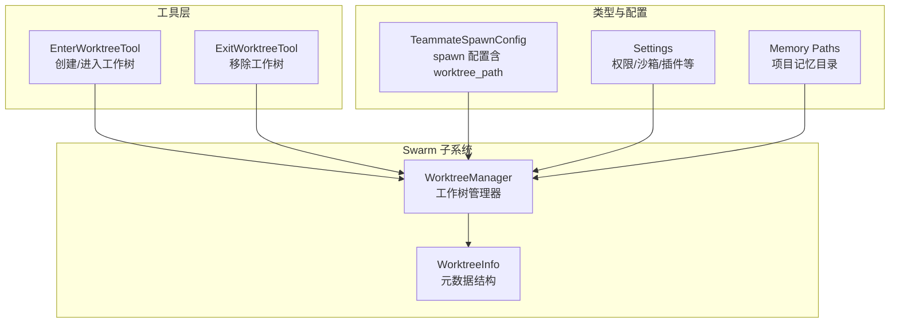
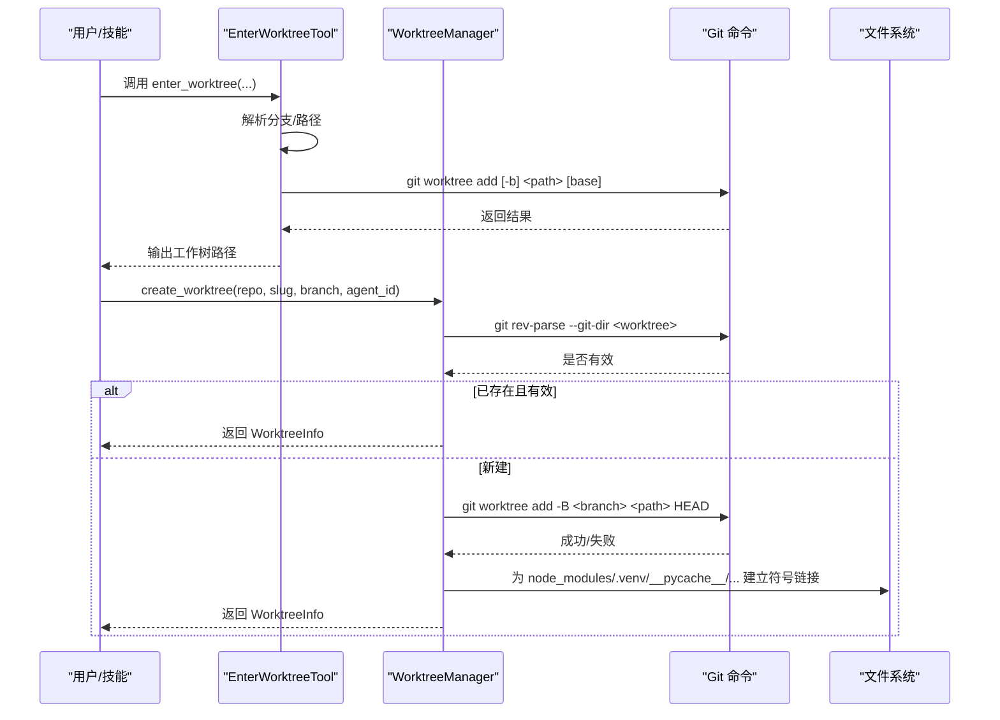
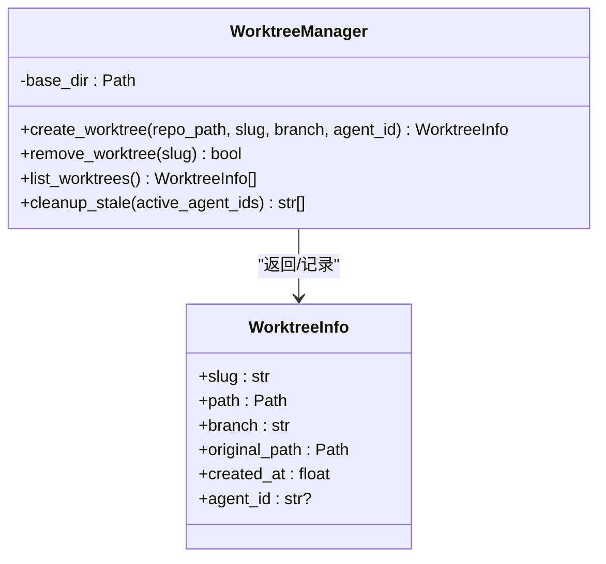
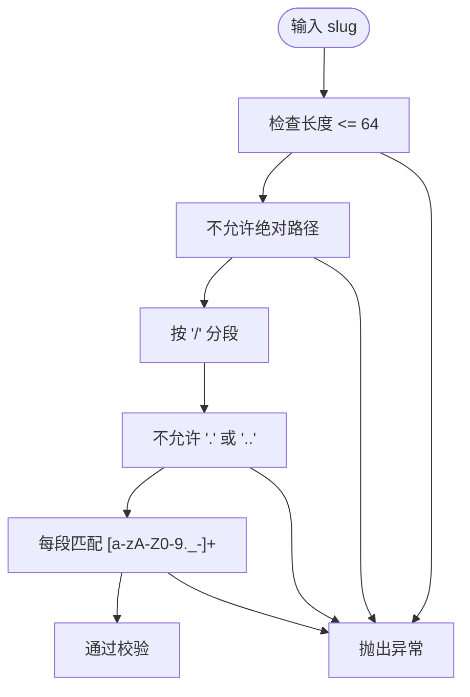
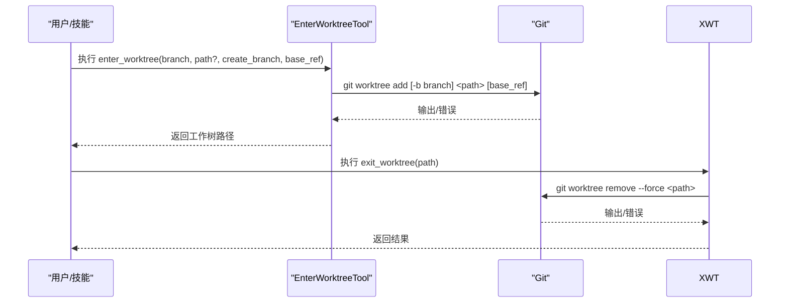
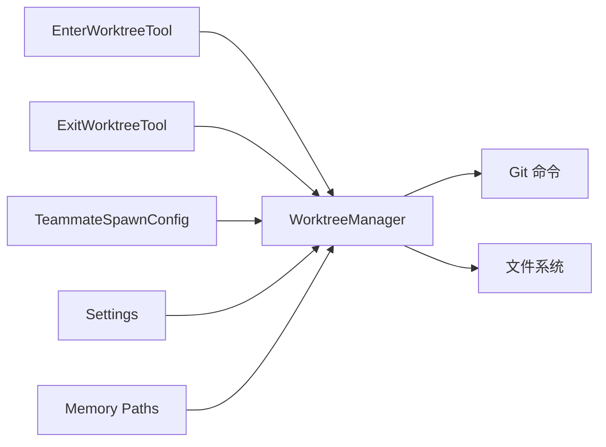

# 工作树管理

<cite>
**本文引用的文件**
- [worktree.py](file://src/openharness/swarm/worktree.py)
- [enter_worktree_tool.py](file://src/openharness/tools/enter_worktree_tool.py)
- [exit_worktree_tool.py](file://src/openharness/tools/exit_worktree_tool.py)
- [test_worktree.py](file://tests/test_swarm/test_worktree.py)
- [types.py](file://src/openharness/swarm/types.py)
- [settings.py](file://src/openharness/config/settings.py)
- [paths.py](file://src/openharness/memory/paths.py)
- [README.md](file://README.md)
</cite>

## 目录
1. [简介](#简介)
2. [项目结构](#项目结构)
3. [核心组件](#核心组件)
4. [架构总览](#架构总览)
5. [详细组件分析](#详细组件分析)
6. [依赖关系分析](#依赖关系分析)
7. [性能考量](#性能考量)
8. [故障排查指南](#故障排查指南)
9. [结论](#结论)
10. [附录](#附录)

## 简介
本文件系统性阐述 OpenHarness 的工作树（Worktree）管理系统，重点覆盖以下方面：
- 工作树的概念与在多代理协作中的作用：通过 Git 工作树实现文件系统隔离，保障多智能体并行执行时的数据独立与可回溯。
- 创建、切换与同步机制：统一的异步管理器负责创建、枚举、清理与回收；工具层提供便捷的命令入口。
- 与版本控制系统的集成：基于 Git 工作树的生命周期管理，结合符号链接减少重复资源占用。
- 隔离机制、数据共享与冲突处理：隔离文件系统、共享大型目录、分支命名规范与清理策略。
- 备份、恢复与迁移：通过 Git 分支与工作树路径的映射实现可追踪的迁移与恢复。
- 性能优化、内存与存储控制：符号链接复用、清理过期工作树、并发安全与错误降级。
- 多代理共享工作树的配置示例与安全注意事项：权限模型、路径规则与最小暴露面。

## 项目结构
围绕工作树管理的关键代码分布在如下模块：
- swarm/worktree.py：工作树管理器与数据结构定义，提供创建、删除、枚举、清理等核心能力。
- tools/enter_worktree_tool.py 与 tools/exit_worktree_tool.py：面向用户的工具封装，便于在命令行或技能中使用。
- tests/test_swarm/test_worktree.py：对 slug 校验与内部辅助函数的单元测试。
- swarm/types.py：团队与代理类型定义，其中包含 worktree_path 字段用于指定工作树路径。
- config/settings.py：全局设置与权限模型，为工作树的安全与访问控制提供基础。
- memory/paths.py：项目持久化记忆目录计算，与工作树配合实现会话与知识的持久化。
- README.md：整体项目概览，包含工作树在协作模式中的定位。

图表来源
- [worktree.py:62-72](file://src/openharness/swarm/worktree.py#L62-L72)
- [worktree.py:135-141](file://src/openharness/swarm/worktree.py#L135-L141)
- [enter_worktree_tool.py:23-28](file://src/openharness/tools/enter_worktree_tool.py#L23-L28)
- [exit_worktree_tool.py:19-24](file://src/openharness/tools/exit_worktree_tool.py#L19-L24)
- [types.py:303-304](file://src/openharness/swarm/types.py#L303-L304)
- [settings.py:50-58](file://src/openharness/config/settings.py#L50-L58)
- [paths.py:11-17](file://src/openharness/memory/paths.py#L11-L17)

章节来源
- [worktree.py:1-316](file://src/openharness/swarm/worktree.py#L1-L316)
- [enter_worktree_tool.py:1-81](file://src/openharness/tools/enter_worktree_tool.py#L1-L81)
- [exit_worktree_tool.py:1-43](file://src/openharness/tools/exit_worktree_tool.py#L1-L43)
- [test_worktree.py:1-131](file://tests/test_swarm/test_worktree.py#L1-L131)
- [types.py:303-304](file://src/openharness/swarm/types.py#L303-L304)
- [settings.py:50-58](file://src/openharness/config/settings.py#L50-L58)
- [paths.py:1-23](file://src/openharness/memory/paths.py#L1-L23)
- [README.md:446-502](file://README.md#L446-L502)

## 核心组件
- WorktreeManager：异步工作树管理器，负责创建、删除、枚举与清理过期工作树。支持将斜杠分隔的 slug 展平为目录名，并自动为大型公共目录建立符号链接以节省磁盘空间。
- WorktreeInfo：工作树元数据结构，记录 slug、路径、分支、原始仓库路径、创建时间以及所属 agent_id。
- EnterWorktreeTool/ExitWorktreeTool：面向用户的工具，封装 git worktree add/remove 的调用，支持自定义路径与分支。
- TeammateSpawnConfig：在 spawn 配置中可直接指定 worktree_path，使代理在隔离工作树中运行。
- 权限与安全：通过 Settings 中的权限模型与路径规则，限制工作树内的敏感操作。

章节来源
- [worktree.py:62-72](file://src/openharness/swarm/worktree.py#L62-L72)
- [worktree.py:135-141](file://src/openharness/swarm/worktree.py#L135-L141)
- [enter_worktree_tool.py:23-28](file://src/openharness/tools/enter_worktree_tool.py#L23-L28)
- [exit_worktree_tool.py:19-24](file://src/openharness/tools/exit_worktree_tool.py#L19-L24)
- [types.py:303-304](file://src/openharness/swarm/types.py#L303-L304)
- [settings.py:50-58](file://src/openharness/config/settings.py#L50-L58)

## 架构总览
工作树管理贯穿“配置/类型层”、“工具层”、“管理器层”与“Git 层”，形成从高层 spawn 到底层 Git 操作的完整闭环。

图表来源
- [enter_worktree_tool.py:30-57](file://src/openharness/tools/enter_worktree_tool.py#L30-L57)
- [worktree.py:150-211](file://src/openharness/swarm/worktree.py#L150-L211)

章节来源
- [worktree.py:150-211](file://src/openharness/swarm/worktree.py#L150-L211)
- [enter_worktree_tool.py:30-57](file://src/openharness/tools/enter_worktree_tool.py#L30-L57)

## 详细组件分析

### 组件一：WorktreeManager（工作树管理器）
- 角色与职责
  - 创建/恢复工作树：若目标路径已存在且是有效 Git 工作树，则快速恢复；否则新建并重置分支。
  - 删除工作树：先清理符号链接，再调用 git worktree remove --force。
  - 枚举与清理：遍历 base_dir 下所有子目录，验证是否为 Git 工作树，恢复分支与原始仓库路径；支持按 agent_id 清理过期工作树。
  - 数据结构：WorktreeInfo 记录 slug、路径、分支、原始仓库路径、创建时间、agent_id。
- 关键设计点
  - slug 规范化：斜杠替换为加号，避免嵌套目录与分支命名问题；同时保留原路径中的斜杠以便显示。
  - 符号链接复用：对 node_modules、.venv、__pycache__、.tox 等大目录进行符号链接，降低磁盘占用。
  - 并发与健壮性：通过异步子进程执行 Git 命令，设置环境变量抑制交互式提示；对异常进行降级处理（如符号链接失败不致命）。
  - 元数据与清理：通过 agent_id 标记归属，结合 cleanup_stale 实现无人使用的自动清理。

图表来源
- [worktree.py:62-72](file://src/openharness/swarm/worktree.py#L62-L72)
- [worktree.py:135-141](file://src/openharness/swarm/worktree.py#L135-L141)

章节来源
- [worktree.py:135-316](file://src/openharness/swarm/worktree.py#L135-L316)

### 组件二：Slug 校验与分支命名
- Slug 校验规则
  - 最大长度限制、不允许绝对路径、不允许 . 或 .. 段、不允许空段（如连续斜杠）。
  - 每段仅允许字母、数字、点、下划线、短横线。
- 分支命名
  - 将 slug 中的斜杠替换为加号后，前缀统一为 worktree-，确保分支名唯一且可识别。
- 测试覆盖
  - 对合法与非法输入进行边界测试，确保校验逻辑正确。

图表来源
- [worktree.py:21-55](file://src/openharness/swarm/worktree.py#L21-L55)
- [test_worktree.py:19-95](file://tests/test_swarm/test_worktree.py#L19-L95)

章节来源
- [worktree.py:21-55](file://src/openharness/swarm/worktree.py#L21-L55)
- [test_worktree.py:19-131](file://tests/test_swarm/test_worktree.py#L19-L131)

### 组件三：工具层（创建/移除工作树）
- EnterWorktreeTool
  - 输入参数：目标分支、可选路径、是否创建新分支、基引用。
  - 行为：解析仓库根目录与工作树路径，调用 git worktree add（必要时 -b），输出工作树路径。
- ExitWorktreeTool
  - 输入参数：工作树路径。
  - 行为：调用 git worktree remove --force 移除指定工作树。

图表来源
- [enter_worktree_tool.py:30-57](file://src/openharness/tools/enter_worktree_tool.py#L30-L57)
- [exit_worktree_tool.py:26-42](file://src/openharness/tools/exit_worktree_tool.py#L26-L42)

章节来源
- [enter_worktree_tool.py:1-81](file://src/openharness/tools/enter_worktree_tool.py#L1-L81)
- [exit_worktree_tool.py:1-43](file://src/openharness/tools/exit_worktree_tool.py#L1-L43)

### 组件四：与多代理协作的集成
- TeammateSpawnConfig 支持直接传入 worktree_path，使代理在指定工作树中运行，天然实现文件系统隔离。
- WorktreeManager 可为每个工作树关联 agent_id，便于通过 cleanup_stale 清理无人使用的过期工作树。
- README 的“Harness Flow”展示了工具与查询引擎的协作，工作树作为文件系统层与工具链无缝衔接。

章节来源
- [types.py:303-304](file://src/openharness/swarm/types.py#L303-L304)
- [worktree.py:295-315](file://src/openharness/swarm/worktree.py#L295-L315)
- [README.md:491-501](file://README.md#L491-L501)

## 依赖关系分析
- 内部依赖
  - WorktreeManager 依赖 Git 命令（rev-parse、worktree add/remove）与符号链接策略。
  - 工具层依赖 WorktreeManager 的异步接口，简化外部调用。
- 外部依赖
  - Git：工作树生命周期管理的核心。
  - 文件系统：符号链接、目录创建与删除。
- 安全与权限
  - Settings 提供权限模型与路径规则，限制工作树内的危险操作。
  - Memory Paths 提供项目记忆目录，与工作树配合实现跨会话的知识持久化。

图表来源
- [enter_worktree_tool.py:23-28](file://src/openharness/tools/enter_worktree_tool.py#L23-L28)
- [exit_worktree_tool.py:19-24](file://src/openharness/tools/exit_worktree_tool.py#L19-L24)
- [worktree.py:135-141](file://src/openharness/swarm/worktree.py#L135-L141)
- [types.py:303-304](file://src/openharness/swarm/types.py#L303-L304)
- [settings.py:50-58](file://src/openharness/config/settings.py#L50-L58)
- [paths.py:11-17](file://src/openharness/memory/paths.py#L11-L17)

章节来源
- [worktree.py:135-316](file://src/openharness/swarm/worktree.py#L135-L316)
- [enter_worktree_tool.py:1-81](file://src/openharness/tools/enter_worktree_tool.py#L1-L81)
- [exit_worktree_tool.py:1-43](file://src/openharness/tools/exit_worktree_tool.py#L1-L43)
- [types.py:303-304](file://src/openharness/swarm/types.py#L303-L304)
- [settings.py:50-58](file://src/openharness/config/settings.py#L50-L58)
- [paths.py:1-23](file://src/openharness/memory/paths.py#L1-L23)

## 性能考量
- 符号链接复用：对 node_modules、.venv、__pycache__、.tox 等大目录建立符号链接，显著降低磁盘占用与复制开销。
- 快速恢复：若工作树目录已存在且是有效 Git 工作树，直接返回 WorktreeInfo，避免重复创建。
- 异步执行：通过 asyncio 子进程执行 Git 命令，提升并发场景下的响应性。
- 清理策略：定期调用 cleanup_stale，释放无人使用的 agent 占用的工作树资源。
- I/O 降级：符号链接创建失败不中断流程，保证系统稳定性。

章节来源
- [worktree.py:105-118](file://src/openharness/swarm/worktree.py#L105-L118)
- [worktree.py:179-192](file://src/openharness/swarm/worktree.py#L179-L192)
- [worktree.py:295-315](file://src/openharness/swarm/worktree.py#L295-L315)

## 故障排查指南
- 创建失败
  - 现象：git worktree add 返回非零退出码。
  - 排查：检查仓库状态、分支名合法性、磁盘空间与权限；查看 stderr 输出。
  - 参考：创建流程中的错误处理与异常抛出位置。
- 无法识别工作树
  - 现象：list_worktrees 未识别某些目录。
  - 排查：确认目录内存在有效 .git；检查 git-common-dir 与 HEAD 引用。
- 删除失败
  - 现象：git worktree remove 失败。
  - 排查：先尝试清理符号链接；若失败，使用回退路径调用 remove。
- 权限相关
  - 现象：工具在工作树内执行被拒绝。
  - 排查：检查 Settings 中的权限模式与路径规则；必要时调整为 auto 或 plan 模式。

章节来源
- [worktree.py:194-200](file://src/openharness/swarm/worktree.py#L194-L200)
- [worktree.py:232-251](file://src/openharness/swarm/worktree.py#L232-L251)
- [settings.py:50-58](file://src/openharness/config/settings.py#L50-L58)

## 结论
OpenHarness 的工作树管理以 Git 为核心，结合异步管理器与符号链接策略，在多代理协作中实现了高效、安全、可维护的文件系统隔离。通过统一的 API 与工具封装，开发者可以轻松地在不同工作树之间切换与同步，同时借助清理与权限机制保障资源与安全。未来可在以下方向持续演进：更细粒度的缓存策略、工作树快照与增量备份、跨主机的共享工作树同步协议。

## 附录

### 多代理共享工作树的配置示例与安全考虑
- 配置示例
  - 在 TeammateSpawnConfig 中设置 worktree_path，使多个代理共享同一工作树路径，从而共享文件与上下文。
  - 使用 cleanup_stale 传入当前活跃 agent_id 集合，避免误删仍在使用的共享工作树。
- 安全考虑
  - 通过 Settings 的权限模型与路径规则限制写入与高风险命令。
  - 对共享工作树内的敏感路径进行白名单/黑名单控制，防止越权访问。
  - 采用符号链接复用大型依赖目录，减少重复拷贝带来的安全与性能隐患。

章节来源
- [types.py:303-304](file://src/openharness/swarm/types.py#L303-L304)
- [worktree.py:295-315](file://src/openharness/swarm/worktree.py#L295-L315)
- [settings.py:50-58](file://src/openharness/config/settings.py#L50-L58)