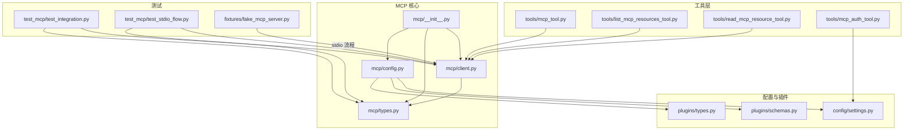
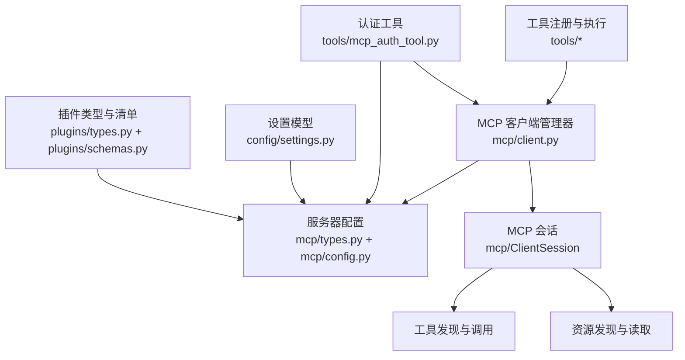
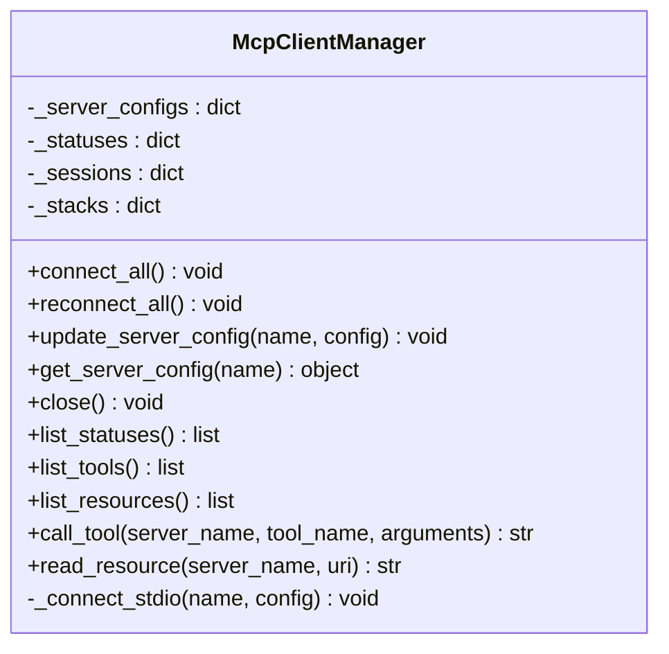
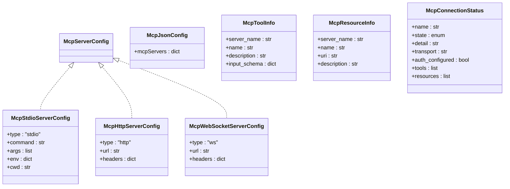
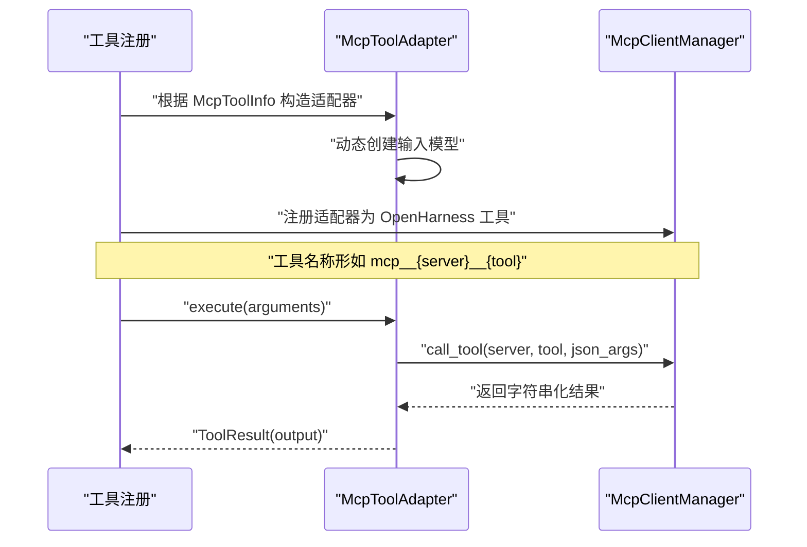
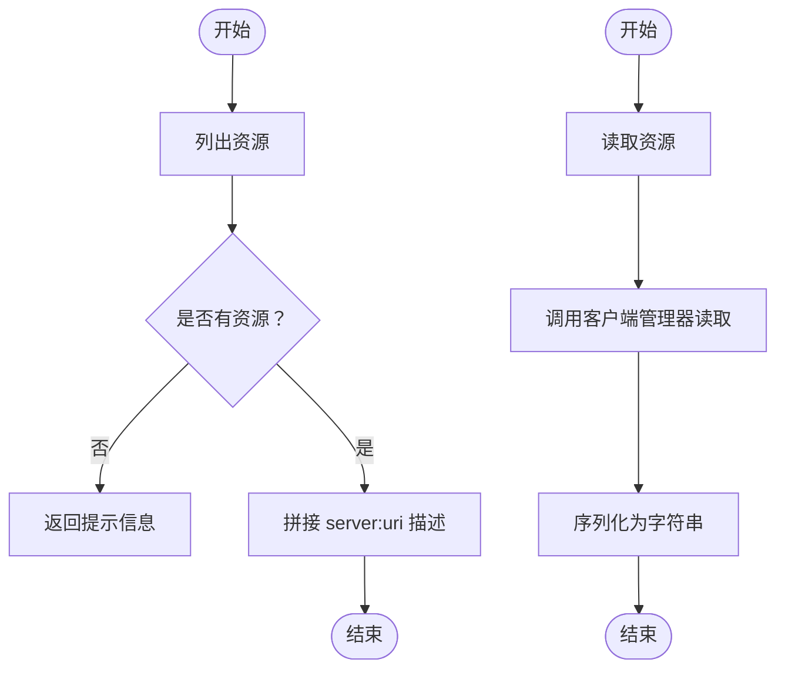
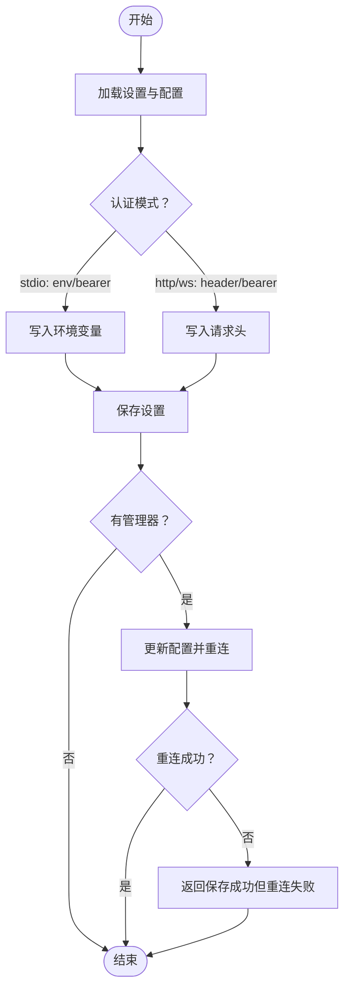
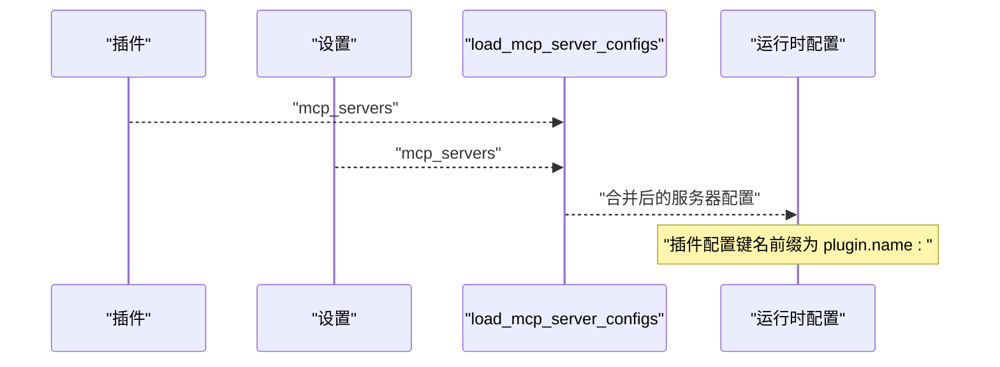
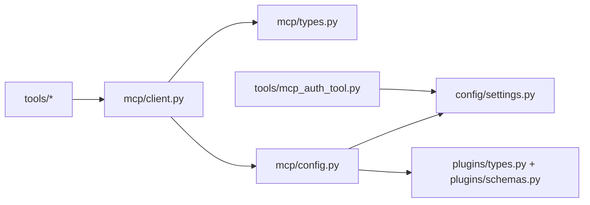

# MCP 集成工具

<cite>
**本文引用的文件**
- [mcp/__init__.py](file://src/openharness/mcp/__init__.py)
- [mcp/client.py](file://src/openharness/mcp/client.py)
- [mcp/config.py](file://src/openharness/mcp/config.py)
- [mcp/types.py](file://src/openharness/mcp/types.py)
- [tools/mcp_tool.py](file://src/openharness/tools/mcp_tool.py)
- [tools/list_mcp_resources_tool.py](file://src/openharness/tools/list_mcp_resources_tool.py)
- [tools/read_mcp_resource_tool.py](file://src/openharness/tools/read_mcp_resource_tool.py)
- [tools/mcp_auth_tool.py](file://src/openharness/tools/mcp_auth_tool.py)
- [config/settings.py](file://src/openharness/config/settings.py)
- [plugins/schemas.py](file://src/openharness/plugins/schemas.py)
- [plugins/types.py](file://src/openharness/plugins/types.py)
- [test_mcp/test_integration.py](file://tests/test_mcp/test_integration.py)
- [test_mcp/test_stdio_flow.py](file://tests/test_mcp/test_stdio_flow.py)
- [fixtures/fake_mcp_server.py](file://tests/fixtures/fake_mcp_server.py)
</cite>

## 目录
1. [简介](#简介)
2. [项目结构](#项目结构)
3. [核心组件](#核心组件)
4. [架构总览](#架构总览)
5. [详细组件分析](#详细组件分析)
6. [依赖分析](#依赖分析)
7. [性能考虑](#性能考虑)
8. [故障排除指南](#故障排除指南)
9. [结论](#结论)
10. [附录](#附录)

## 简介
本文件面向 OpenHarness 的 MCP（Model Context Protocol）集成工具，系统性阐述其协议封装与资源访问机制、连接建立流程、消息序列化与错误处理策略；同时覆盖 MCP 资源列表与读取工具的功能边界、认证工具的身份验证流程与安全令牌管理、服务器配置与连接参数、以及版本兼容性与扩展机制，并提供最佳实践与故障排除建议。

## 项目结构
MCP 集成相关代码主要分布在以下模块：
- mcp：MCP 客户端管理器、类型定义与配置加载
- tools：MCP 工具适配器与资源操作工具
- config：全局设置模型与持久化
- plugins：插件清单与运行时类型，支持在插件中声明 MCP 服务器
- tests：集成测试与伪 MCP 服务器示例

**图表来源**
- [mcp/__init__.py:1-75](file://src/openharness/mcp/__init__.py#L1-L75)
- [mcp/client.py:1-175](file://src/openharness/mcp/client.py#L1-L175)
- [mcp/types.py:1-77](file://src/openharness/mcp/types.py#L1-L77)
- [mcp/config.py:1-17](file://src/openharness/mcp/config.py#L1-L17)
- [tools/mcp_tool.py:1-56](file://src/openharness/tools/mcp_tool.py#L1-L56)
- [tools/list_mcp_resources_tool.py:1-37](file://src/openharness/tools/list_mcp_resources_tool.py#L1-L37)
- [tools/read_mcp_resource_tool.py:1-36](file://src/openharness/tools/read_mcp_resource_tool.py#L1-L36)
- [tools/mcp_auth_tool.py:1-72](file://src/openharness/tools/mcp_auth_tool.py#L1-L72)
- [config/settings.py:1-161](file://src/openharness/config/settings.py#L1-L161)
- [plugins/schemas.py:1-24](file://src/openharness/plugins/schemas.py#L1-L24)
- [plugins/types.py:1-33](file://src/openharness/plugins/types.py#L1-L33)
- [test_mcp/test_integration.py:1-80](file://tests/test_mcp/test_integration.py#L1-L80)
- [test_mcp/test_stdio_flow.py:1-55](file://tests/test_mcp/test_stdio_flow.py#L1-L55)
- [fixtures/fake_mcp_server.py:1-22](file://tests/fixtures/fake_mcp_server.py#L1-L22)

**章节来源**
- [mcp/__init__.py:1-75](file://src/openharness/mcp/__init__.py#L1-L75)
- [mcp/client.py:1-175](file://src/openharness/mcp/client.py#L1-L175)
- [mcp/types.py:1-77](file://src/openharness/mcp/types.py#L1-L77)
- [mcp/config.py:1-17](file://src/openharness/mcp/config.py#L1-L17)
- [tools/mcp_tool.py:1-56](file://src/openharness/tools/mcp_tool.py#L1-L56)
- [tools/list_mcp_resources_tool.py:1-37](file://src/openharness/tools/list_mcp_resources_tool.py#L1-L37)
- [tools/read_mcp_resource_tool.py:1-36](file://src/openharness/tools/read_mcp_resource_tool.py#L1-L36)
- [tools/mcp_auth_tool.py:1-72](file://src/openharness/tools/mcp_auth_tool.py#L1-L72)
- [config/settings.py:1-161](file://src/openharness/config/settings.py#L1-L161)
- [plugins/schemas.py:1-24](file://src/openharness/plugins/schemas.py#L1-L24)
- [plugins/types.py:1-33](file://src/openharness/plugins/types.py#L1-L33)
- [test_mcp/test_integration.py:1-80](file://tests/test_mcp/test_integration.py#L1-L80)
- [test_mcp/test_stdio_flow.py:1-55](file://tests/test_mcp/test_stdio_flow.py#L1-L55)
- [fixtures/fake_mcp_server.py:1-22](file://tests/fixtures/fake_mcp_server.py#L1-L22)

## 核心组件
- MCP 客户端管理器：负责连接、状态维护、工具与资源发现、调用与读取
- MCP 类型与配置：定义服务器配置、连接状态、工具与资源元数据
- 工具适配器：将 MCP 工具暴露为 OpenHarness 工具，动态构建输入模型
- 资源工具：列出与读取 MCP 资源
- 认证工具：更新服务器认证配置并尝试重连
- 配置加载：从设置与插件合并 MCP 服务器配置

**章节来源**
- [mcp/client.py:20-175](file://src/openharness/mcp/client.py#L20-L175)
- [mcp/types.py:11-77](file://src/openharness/mcp/types.py#L11-L77)
- [tools/mcp_tool.py:14-56](file://src/openharness/tools/mcp_tool.py#L14-L56)
- [tools/list_mcp_resources_tool.py:15-37](file://src/openharness/tools/list_mcp_resources_tool.py#L15-L37)
- [tools/read_mcp_resource_tool.py:18-36](file://src/openharness/tools/read_mcp_resource_tool.py#L18-L36)
- [tools/mcp_auth_tool.py:21-72](file://src/openharness/tools/mcp_auth_tool.py#L21-L72)
- [mcp/config.py:8-17](file://src/openharness/mcp/config.py#L8-L17)
- [config/settings.py:49-64](file://src/openharness/config/settings.py#L49-L64)

## 架构总览
下图展示 MCP 集成的整体交互：工具层通过客户端管理器访问 MCP 服务器，客户端管理器基于配置建立连接并进行工具与资源发现，认证工具负责更新配置并在可能时重连。

**图表来源**
- [mcp/client.py:20-175](file://src/openharness/mcp/client.py#L20-L175)
- [mcp/types.py:11-77](file://src/openharness/mcp/types.py#L11-L77)
- [mcp/config.py:8-17](file://src/openharness/mcp/config.py#L8-L17)
- [tools/mcp_tool.py:14-56](file://src/openharness/tools/mcp_tool.py#L14-L56)
- [tools/list_mcp_resources_tool.py:15-37](file://src/openharness/tools/list_mcp_resources_tool.py#L15-L37)
- [tools/read_mcp_resource_tool.py:18-36](file://src/openharness/tools/read_mcp_resource_tool.py#L18-L36)
- [tools/mcp_auth_tool.py:21-72](file://src/openharness/tools/mcp_auth_tool.py#L21-L72)
- [config/settings.py:49-64](file://src/openharness/config/settings.py#L49-L64)
- [plugins/types.py:14-33](file://src/openharness/plugins/types.py#L14-L33)
- [plugins/schemas.py:8-24](file://src/openharness/plugins/schemas.py#L8-L24)

## 详细组件分析

### MCP 客户端管理器（McpClientManager）
职责与行为
- 连接管理：按配置连接 stdio 服务器，记录连接状态与工具/资源元数据
- 会话生命周期：使用异步上下文栈管理会话与流，支持关闭与重连
- 工具调用：将结果内容序列化为字符串输出
- 资源读取：将资源内容序列化为字符串输出
- 状态查询：聚合所有服务器的状态、工具与资源列表

连接建立流程
- 支持 stdio 传输：通过 stdio_client 启动子进程，建立读写流，初始化会话
- 工具与资源发现：调用会话接口获取工具列表与资源列表，生成元数据对象
- 状态更新：成功则标记为已连接，失败则记录异常详情

错误处理
- 异常捕获：连接失败时关闭上下文栈，更新状态为失败
- 输出容错：当结果为空或非文本时，回退到 JSON 序列化或占位符

**图表来源**
- [mcp/client.py:20-175](file://src/openharness/mcp/client.py#L20-L175)

**章节来源**
- [mcp/client.py:20-175](file://src/openharness/mcp/client.py#L20-L175)

### MCP 类型与配置（mcp/types.py）
数据模型
- 服务器配置：stdio、http、ws 三类，含必要字段与默认值
- 运行时状态：连接状态、传输方式、认证是否配置、工具与资源列表
- 元数据：工具输入模式、资源标识与描述

**图表来源**
- [mcp/types.py:11-77](file://src/openharness/mcp/types.py#L11-L77)

**章节来源**
- [mcp/types.py:11-77](file://src/openharness/mcp/types.py#L11-L77)

### MCP 工具适配器（tools/mcp_tool.py）
功能要点
- 将 MCP 工具元数据转换为 OpenHarness 工具名称与输入模型
- 执行时将参数序列化为 JSON 并调用客户端管理器的工具调用方法
- 动态构建输入模型以匹配工具的 JSON Schema

**图表来源**
- [tools/mcp_tool.py:14-56](file://src/openharness/tools/mcp_tool.py#L14-L56)
- [mcp/client.py:92-106](file://src/openharness/mcp/client.py#L92-L106)

**章节来源**
- [tools/mcp_tool.py:14-56](file://src/openharness/tools/mcp_tool.py#L14-L56)
- [mcp/client.py:92-106](file://src/openharness/mcp/client.py#L92-L106)

### 资源列表与读取工具
- 列出资源：遍历客户端管理器中的资源列表，拼接服务器名与 URI、描述
- 读取资源：按服务器名与 URI 调用客户端管理器的资源读取方法，序列化为字符串

**图表来源**
- [tools/list_mcp_resources_tool.py:29-36](file://src/openharness/tools/list_mcp_resources_tool.py#L29-L36)
- [tools/read_mcp_resource_tool.py:32-35](file://src/openharness/tools/read_mcp_resource_tool.py#L32-L35)
- [mcp/client.py:85-119](file://src/openharness/mcp/client.py#L85-L119)

**章节来源**
- [tools/list_mcp_resources_tool.py:15-37](file://src/openharness/tools/list_mcp_resources_tool.py#L15-L37)
- [tools/read_mcp_resource_tool.py:18-36](file://src/openharness/tools/read_mcp_resource_tool.py#L18-L36)
- [mcp/client.py:85-119](file://src/openharness/mcp/client.py#L85-L119)

### 认证工具（McpAuthTool）
功能与流程
- 解析输入参数：服务器名、认证模式（bearer、header、env）、密钥与可选键名
- 基于配置类型选择合适的认证方式：
  - stdio：env 或 bearer 模式，写入环境变量
  - http/ws：header 或 bearer 模式，写入请求头
- 更新设置并持久化；若存在客户端管理器，则尝试更新配置并重连
- 返回结果：保存成功或重连失败的反馈

**图表来源**
- [tools/mcp_auth_tool.py:28-71](file://src/openharness/tools/mcp_auth_tool.py#L28-L71)
- [config/settings.py:144-160](file://src/openharness/config/settings.py#L144-L160)

**章节来源**
- [tools/mcp_auth_tool.py:21-72](file://src/openharness/tools/mcp_auth_tool.py#L21-L72)
- [config/settings.py:144-160](file://src/openharness/config/settings.py#L144-L160)

### 配置加载与插件集成（mcp/config.py, config/settings.py, plugins/*）
- 配置合并：从设置与启用的插件中合并 MCP 服务器配置，插件配置键名带前缀
- 设置模型：包含 mcp_servers 字段，支持 JSON 序列化与持久化
- 插件类型：LoadedPlugin 持有 mcp_servers 字典，便于统一注入

**图表来源**
- [mcp/config.py:8-17](file://src/openharness/mcp/config.py#L8-L17)
- [config/settings.py:49-64](file://src/openharness/config/settings.py#L49-L64)
- [plugins/types.py:14-33](file://src/openharness/plugins/types.py#L14-L33)
- [plugins/schemas.py:8-24](file://src/openharness/plugins/schemas.py#L8-L24)

**章节来源**
- [mcp/config.py:8-17](file://src/openharness/mcp/config.py#L8-L17)
- [config/settings.py:49-64](file://src/openharness/config/settings.py#L49-L64)
- [plugins/types.py:14-33](file://src/openharness/plugins/types.py#L14-L33)
- [plugins/schemas.py:8-24](file://src/openharness/plugins/schemas.py#L8-L24)

## 依赖分析
- 组件耦合
  - 工具层依赖客户端管理器，客户端管理器依赖类型定义与配置
  - 认证工具依赖设置模型与客户端管理器
  - 配置加载依赖插件类型与清单
- 外部依赖
  - 使用 mcp 客户端库进行会话管理与工具/资源发现
- 可能的循环依赖
  - 当前模块间为单向依赖，未见循环导入

**图表来源**
- [tools/mcp_tool.py:9-11](file://src/openharness/tools/mcp_tool.py#L9-L11)
- [tools/list_mcp_resources_tool.py:7-8](file://src/openharness/tools/list_mcp_resources_tool.py#L7-L8)
- [tools/read_mcp_resource_tool.py:7-8](file://src/openharness/tools/read_mcp_resource_tool.py#L7-L8)
- [tools/mcp_auth_tool.py:7-9](file://src/openharness/tools/mcp_auth_tool.py#L7-L9)
- [mcp/client.py:8-17](file://src/openharness/mcp/client.py#L8-L17)
- [mcp/types.py:5-8](file://src/openharness/mcp/types.py#L5-L8)
- [mcp/config.py:5-6](file://src/openharness/mcp/config.py#L5-L6)
- [config/settings.py:19-21](file://src/openharness/config/settings.py#L19-L21)
- [plugins/types.py:9-11](file://src/openharness/plugins/types.py#L9-L11)
- [plugins/schemas.py:5-6](file://src/openharness/plugins/schemas.py#L5-L6)

**章节来源**
- [tools/mcp_tool.py:9-11](file://src/openharness/tools/mcp_tool.py#L9-L11)
- [tools/list_mcp_resources_tool.py:7-8](file://src/openharness/tools/list_mcp_resources_tool.py#L7-L8)
- [tools/read_mcp_resource_tool.py:7-8](file://src/openharness/tools/read_mcp_resource_tool.py#L7-L8)
- [tools/mcp_auth_tool.py:7-9](file://src/openharness/tools/mcp_auth_tool.py#L7-L9)
- [mcp/client.py:8-17](file://src/openharness/mcp/client.py#L8-L17)
- [mcp/types.py:5-8](file://src/openharness/mcp/types.py#L5-L8)
- [mcp/config.py:5-6](file://src/openharness/mcp/config.py#L5-L6)
- [config/settings.py:19-21](file://src/openharness/config/settings.py#L19-L21)
- [plugins/types.py:9-11](file://src/openharness/plugins/types.py#L9-L11)
- [plugins/schemas.py:5-6](file://src/openharness/plugins/schemas.py#L5-L6)

## 性能考虑
- 连接复用：客户端管理器对每个服务器维持独立会话，避免重复握手开销
- 结果序列化：优先使用文本内容，否则回退到 JSON 序列化，减少解析成本
- 异步 I/O：通过异步上下文栈管理流，降低阻塞风险
- 配置合并：仅在启动或配置变更时执行，避免频繁 IO

[本节为通用指导，不直接分析具体文件]

## 故障排除指南
常见问题与定位
- 连接失败
  - 检查服务器命令、参数与工作目录是否正确
  - 查看连接状态详情，确认传输类型与认证配置
  - 参考连接异常捕获逻辑与状态更新
- 工具调用无输出
  - 确认工具返回内容类型，必要时检查结构化内容回退
  - 核对输入模式与必填字段
- 资源读取为空
  - 确认 URI 正确且资源存在
  - 检查会话初始化与资源列表发现
- 认证无效
  - 确认认证模式与配置类型匹配（stdio/env 或 http/ws/header）
  - 检查密钥与键名是否正确写入环境变量或请求头
  - 如重连失败，查看保存成功但重连异常的提示

参考测试用例
- 集成测试验证了配置合并、工具注册与资源列表
- 实际 stdio 测试展示了连接、工具调用与资源读取的完整流程

**章节来源**
- [mcp/client.py:166-175](file://src/openharness/mcp/client.py#L166-L175)
- [tools/mcp_tool.py:36-46](file://src/openharness/tools/mcp_tool.py#L36-L46)
- [tools/mcp_auth_tool.py:39-56](file://src/openharness/tools/mcp_auth_tool.py#L39-L56)
- [test_mcp/test_integration.py:35-80](file://tests/test_mcp/test_integration.py#L35-L80)
- [test_mcp/test_stdio_flow.py:16-55](file://tests/test_mcp/test_stdio_flow.py#L16-L55)

## 结论
OpenHarness 的 MCP 集成通过客户端管理器统一抽象连接、发现与调用流程，配合工具层适配器与资源工具，实现了对多类型 MCP 服务器的标准化接入。认证工具提供了灵活的安全令牌管理与自动重连能力。整体设计具备良好的扩展性与可维护性，适合在复杂场景中演进。

[本节为总结性内容，不直接分析具体文件]

## 附录

### MCP 协议版本兼容性与扩展机制
- 传输类型扩展：当前支持 stdio、http、ws 三类；新增类型需在类型定义与客户端连接逻辑中扩展
- 工具与资源发现：通过会话接口获取元数据，保持与 MCP 协议一致的发现机制
- 输入模式：基于 JSON Schema 动态构建输入模型，便于协议演进

**章节来源**
- [mcp/types.py:11-37](file://src/openharness/mcp/types.py#L11-L37)
- [mcp/client.py:121-175](file://src/openharness/mcp/client.py#L121-L175)

### MCP 服务器配置与连接参数
- stdio：command、args、env、cwd
- http：url、headers
- ws：url、headers
- 运行时状态：name、state、transport、auth_configured、tools、resources

**章节来源**
- [mcp/types.py:11-37](file://src/openharness/mcp/types.py#L11-L37)
- [mcp/types.py:66-77](file://src/openharness/mcp/types.py#L66-L77)

### 最佳实践
- 在插件中声明 MCP 服务器配置，使用前缀命名避免冲突
- 优先使用环境变量或请求头承载认证信息，避免硬编码
- 对工具输入进行严格校验，确保 JSON Schema 与实际参数一致
- 定期检查连接状态与资源可用性，及时处理失败节点

[本节为通用指导，不直接分析具体文件]