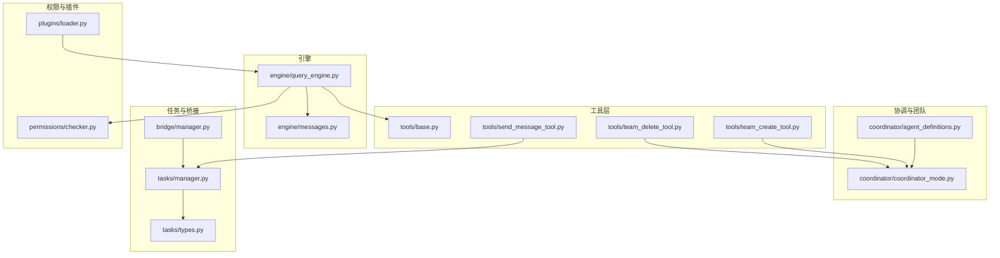
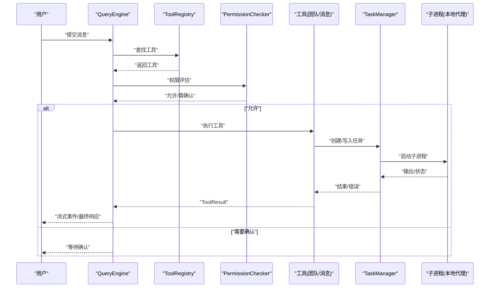
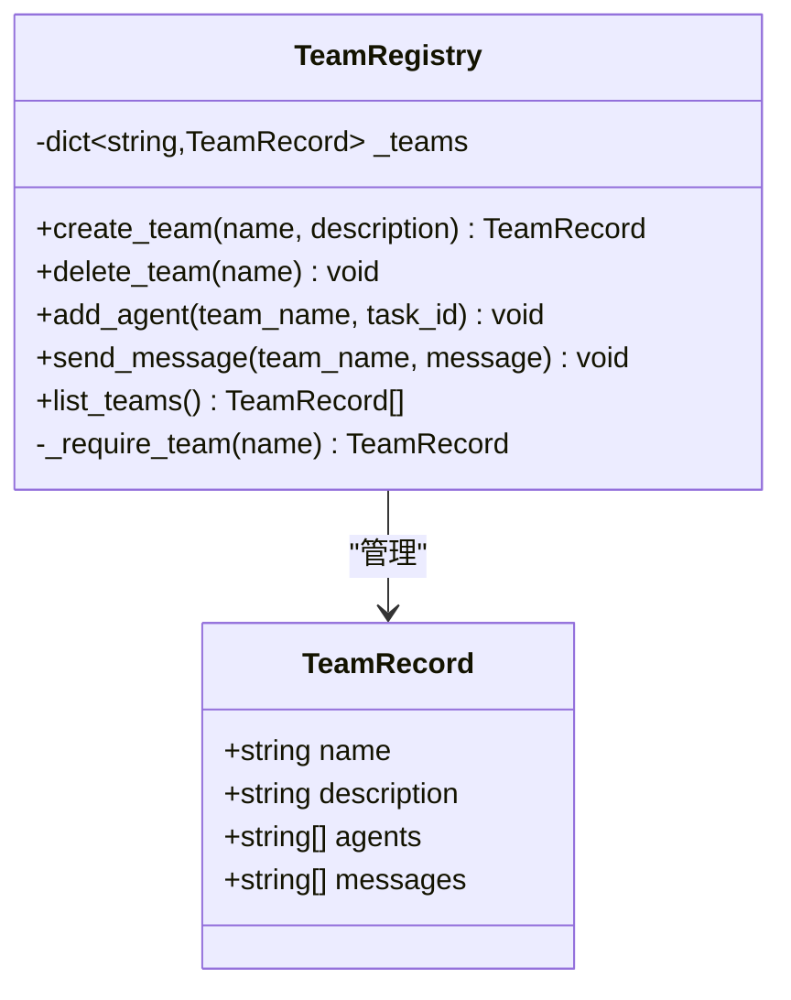
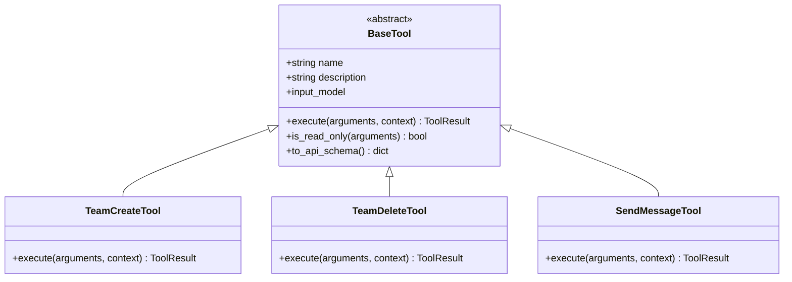
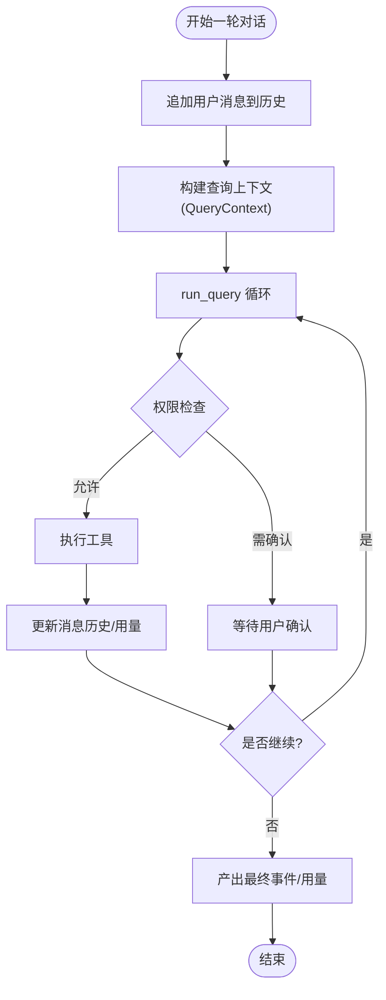
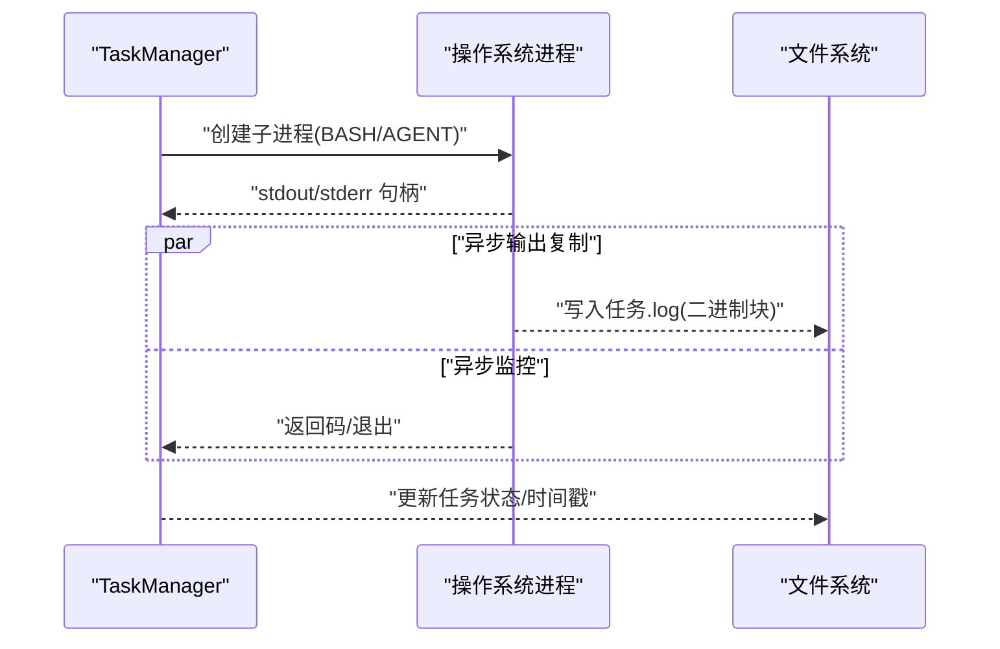
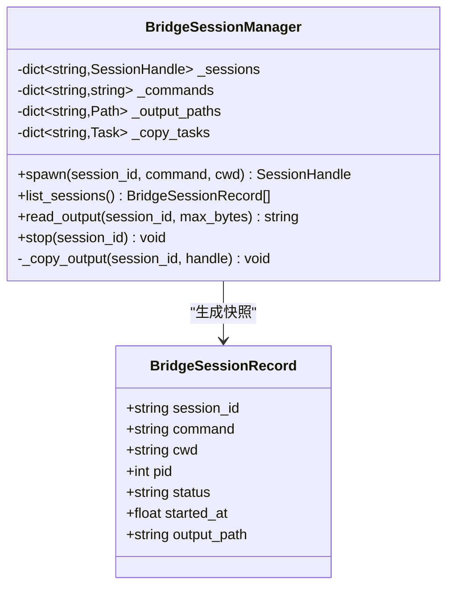
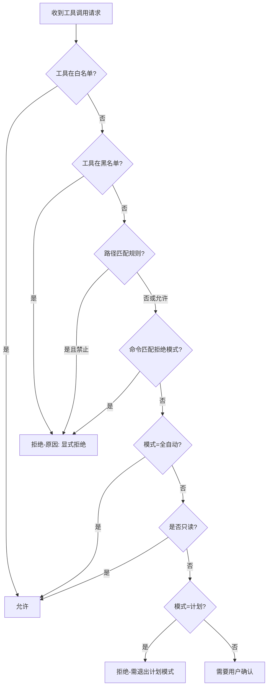
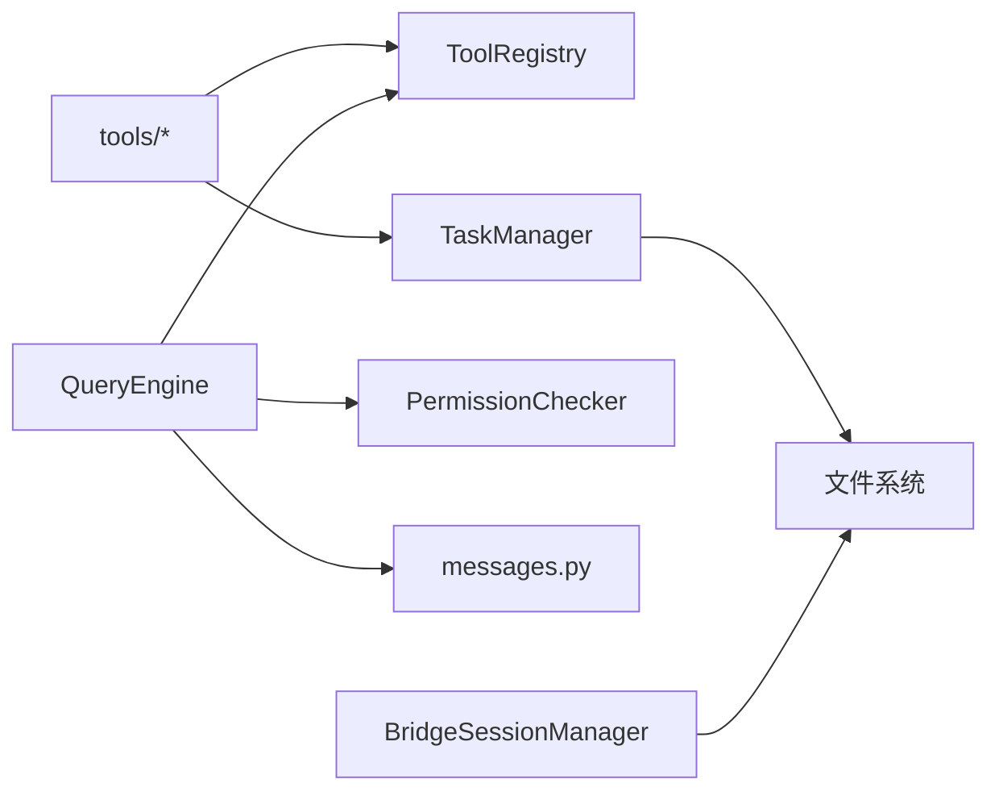

# 代理协作工具

<cite>
**本文引用的文件**
- [src/openharness/coordinator/__init__.py](file://src/openharness/coordinator/__init__.py)
- [src/openharness/coordinator/agent_definitions.py](file://src/openharness/coordinator/agent_definitions.py)
- [src/openharness/coordinator/coordinator_mode.py](file://src/openharness/coordinator/coordinator_mode.py)
- [src/openharness/tools/team_create_tool.py](file://src/openharness/tools/team_create_tool.py)
- [src/openharness/tools/team_delete_tool.py](file://src/openharness/tools/team_delete_tool.py)
- [src/openharness/tools/send_message_tool.py](file://src/openharness/tools/send_message_tool.py)
- [src/openharness/engine/messages.py](file://src/openharness/engine/messages.py)
- [src/openharness/engine/query_engine.py](file://src/openharness/engine/query_engine.py)
- [src/openharness/times/manager.py](file://src/openharness/tasks/manager.py)
- [src/openharness/times/types.py](file://src/openharness/tasks/types.py)
- [src/openharness/bridge/manager.py](file://src/openharness/bridge/manager.py)
- [src/openharness/tools/base.py](file://src/openharness/tools/base.py)
- [src/openharness/permissions/checker.py](file://src/openharness/permissions/checker.py)
- [src/openharness/plugins/loader.py](file://src/openharness/plugins/loader.py)
</cite>

## 目录
1. [简介](#简介)
2. [项目结构](#项目结构)
3. [核心组件](#核心组件)
4. [架构总览](#架构总览)
5. [详细组件分析](#详细组件分析)
6. [依赖分析](#依赖分析)
7. [性能考虑](#性能考虑)
8. [故障排除指南](#故障排除指南)
9. [结论](#结论)
10. [附录：配置示例与最佳实践](#附录配置示例与最佳实践)

## 简介
本文件面向 OpenHarness 的“代理协作工具”能力，系统性阐述以下主题：
- 子代理工具的创建与管理：包括代理配置、生命周期管理、资源隔离与输出追踪。
- 团队管理工具：团队创建、成员（任务）管理、消息收发与状态维护。
- 消息传递工具：跨代理通信机制、消息路由、序列化与异步处理。
- 多代理协调：同步与异步模式、任务分发、结果聚合与冲突解决策略。
- 配置示例、最佳实践与故障排除。
- 复杂协作场景的实际应用案例。

## 项目结构
OpenHarness 将“代理协作”相关能力分布在多个模块中：
- 协调器与团队：coordinator 提供内置代理角色与轻量团队注册表。
- 工具层：tools 提供团队与消息操作工具，统一抽象于 base。
- 引擎层：engine 负责对话消息模型与查询执行循环。
- 任务与桥接：tasks 管理本地/远程/进程内代理任务；bridge 管理 UI/命令桥接会话。
- 权限控制：permissions 提供工具执行的权限检查。
- 插件加载：plugins 支持从插件目录发现与加载技能、钩子与 MCP 配置。

图表来源
- [src/openharness/coordinator/agent_definitions.py:1-23](file://src/openharness/coordinator/agent_definitions.py#L1-L23)
- [src/openharness/coordinator/coordinator_mode.py:1-63](file://src/openharness/coordinator/coordinator_mode.py#L1-L63)
- [src/openharness/tools/base.py:1-76](file://src/openharness/tools/base.py#L1-L76)
- [src/openharness/tools/team_create_tool.py:1-32](file://src/openharness/tools/team_create_tool.py#L1-L32)
- [src/openharness/tools/team_delete_tool.py:1-31](file://src/openharness/tools/team_delete_tool.py#L1-L31)
- [src/openharness/tools/send_message_tool.py:1-32](file://src/openharness/tools/send_message_tool.py#L1-L32)
- [src/openharness/engine/messages.py:1-109](file://src/openharness/engine/messages.py#L1-L109)
- [src/openharness/engine/query_engine.py:1-101](file://src/openharness/engine/query_engine.py#L1-L101)
- [src/openharness/tasks/manager.py:1-281](file://src/openharness/tasks/manager.py#L1-L281)
- [src/openharness/tasks/types.py:1-31](file://src/openharness/tasks/types.py#L1-L31)
- [src/openharness/bridge/manager.py:1-108](file://src/openharness/bridge/manager.py#L1-L108)
- [src/openharness/permissions/checker.py:1-100](file://src/openharness/permissions/checker.py#L1-L100)
- [src/openharness/plugins/loader.py:1-195](file://src/openharness/plugins/loader.py#L1-L195)

章节来源
- [src/openharness/coordinator/__init__.py:1-13](file://src/openharness/coordinator/__init__.py#L1-L13)

## 核心组件
- 协调器与团队
  - 内置代理角色定义：用于快速选择不同职责的本地代理模板。
  - 轻量团队注册表：内存中的团队记录、成员列表与消息队列，支持创建/删除/添加成员/发送消息等操作。
- 工具层
  - 统一工具抽象：工具名称、描述、输入模型、执行接口与结果标准化。
  - 团队工具：创建/删除团队。
  - 消息工具：向运行中的本地代理任务写入消息。
- 引擎层
  - 对话消息模型：文本块、工具调用块、工具结果块及序列化/反序列化。
  - 查询引擎：持有对话历史、工具注册表与权限检查器，驱动模型循环与流式事件。
- 任务与桥接
  - 任务管理器：启动/停止本地/远程/进程内代理任务，stdin/stdout 管道读写与输出文件落盘。
  - 桥接会话管理器：UI/命令桥接子进程的生命周期与输出复制。
- 权限控制
  - 基于工具名、路径规则、命令模式与模式（全自动/计划模式/默认）的决策。
- 插件加载
  - 发现用户与项目级插件目录，解析清单，加载技能、钩子与 MCP 配置。

章节来源
- [src/openharness/coordinator/agent_definitions.py:1-23](file://src/openharness/coordinator/agent_definitions.py#L1-L23)
- [src/openharness/coordinator/coordinator_mode.py:1-63](file://src/openharness/coordinator/coordinator_mode.py#L1-L63)
- [src/openharness/tools/base.py:1-76](file://src/openharness/tools/base.py#L1-L76)
- [src/openharness/tools/team_create_tool.py:1-32](file://src/openharness/tools/team_create_tool.py#L1-L32)
- [src/openharness/tools/team_delete_tool.py:1-31](file://src/openharness/tools/team_delete_tool.py#L1-L31)
- [src/openharness/tools/send_message_tool.py:1-32](file://src/openharness/tools/send_message_tool.py#L1-L32)
- [src/openharness/engine/messages.py:1-109](file://src/openharness/engine/messages.py#L1-L109)
- [src/openharness/engine/query_engine.py:1-101](file://src/openharness/engine/query_engine.py#L1-L101)
- [src/openharness/times/manager.py:1-281](file://src/openharness/tasks/manager.py#L1-L281)
- [src/openharness/bridge/manager.py:1-108](file://src/openharness/bridge/manager.py#L1-L108)
- [src/openharness/permissions/checker.py:1-100](file://src/openharness/permissions/checker.py#L1-L100)
- [src/openharness/plugins/loader.py:1-195](file://src/openharness/plugins/loader.py#L1-L195)

## 架构总览
下图展示从用户输入到工具执行、消息传递与任务生命周期的整体流程。

图表来源
- [src/openharness/engine/query_engine.py:1-101](file://src/openharness/engine/query_engine.py#L1-L101)
- [src/openharness/tools/base.py:1-76](file://src/openharness/tools/base.py#L1-L76)
- [src/openharness/permissions/checker.py:1-100](file://src/openharness/permissions/checker.py#L1-L100)
- [src/openharness/times/manager.py:1-281](file://src/openharness/tasks/manager.py#L1-L281)

## 详细组件分析

### 协调器与团队
- 角色定义：提供默认/工作/探索三类内置代理角色，便于快速选择不同职责的本地代理。
- 团队注册表：以内存字典存储团队，提供创建/删除、添加成员、发送消息与列表查询等方法；通过单例全局访问。

图表来源
- [src/openharness/coordinator/coordinator_mode.py:1-63](file://src/openharness/coordinator/coordinator_mode.py#L1-L63)

章节来源
- [src/openharness/coordinator/agent_definitions.py:1-23](file://src/openharness/coordinator/agent_definitions.py#L1-L23)
- [src/openharness/coordinator/coordinator_mode.py:1-63](file://src/openharness/coordinator/coordinator_mode.py#L1-L63)

### 工具层与消息传递
- 工具抽象：统一的工具名称、描述、输入模型与执行接口；结果标准化为输出字符串与错误标记。
- 团队工具：创建/删除团队，基于团队注册表进行持久化（内存）操作。
- 消息工具：向指定任务的 stdin 写入消息，内部委托任务管理器完成写入与必要时的重启恢复。

图表来源
- [src/openharness/tools/base.py:1-76](file://src/openharness/tools/base.py#L1-L76)
- [src/openharness/tools/team_create_tool.py:1-32](file://src/openharness/tools/team_create_tool.py#L1-L32)
- [src/openharness/tools/team_delete_tool.py:1-31](file://src/openharness/tools/team_delete_tool.py#L1-L31)
- [src/openharness/tools/send_message_tool.py:1-32](file://src/openharness/tools/send_message_tool.py#L1-L32)

章节来源
- [src/openharness/tools/base.py:1-76](file://src/openharness/tools/base.py#L1-L76)
- [src/openharness/tools/team_create_tool.py:1-32](file://src/openharness/tools/team_create_tool.py#L1-L32)
- [src/openharness/tools/team_delete_tool.py:1-31](file://src/openharness/tools/team_delete_tool.py#L1-L31)
- [src/openharness/tools/send_message_tool.py:1-32](file://src/openharness/tools/send_message_tool.py#L1-L32)

### 引擎与消息模型
- 消息模型：文本块、工具调用块、工具结果块，支持序列化为外部 API 参数格式与反序列化。
- 查询引擎：维护对话历史、工具注册表与权限检查器，驱动一次或多轮对话，产出流式事件与用量统计。

图表来源
- [src/openharness/engine/query_engine.py:1-101](file://src/openharness/engine/query_engine.py#L1-L101)
- [src/openharness/engine/messages.py:1-109](file://src/openharness/engine/messages.py#L1-L109)

章节来源
- [src/openharness/engine/messages.py:1-109](file://src/openharness/engine/messages.py#L1-L109)
- [src/openharness/engine/query_engine.py:1-101](file://src/openharness/engine/query_engine.py#L1-L101)

### 任务管理与资源隔离
- 任务类型：本地 Bash、本地代理、远程代理、进程内队友。
- 生命周期：创建任务、启动子进程、监控输出、写入 stdin、停止任务、重启代理任务（在断开或不可写时自动恢复）。
- 资源隔离：每个任务拥有独立输出文件、stdin/stdout 管道锁、生成计数与元数据，避免并发冲突。
- 输出追踪：输出以二进制增量写入任务日志文件，支持尾部截断读取。

图表来源
- [src/openharness/times/manager.py:1-281](file://src/openharness/tasks/manager.py#L1-L281)
- [src/openharness/times/types.py:1-31](file://src/openharness/tasks/types.py#L1-L31)

章节来源
- [src/openharness/times/manager.py:1-281](file://src/openharness/tasks/manager.py#L1-L281)
- [src/openharness/times/types.py:1-31](file://src/openharness/tasks/types.py#L1-L31)

### 桥接会话管理
- 会话生命周期：启动、输出复制、状态转换、停止与清理。
- 输出落盘：桥接输出实时写入独立日志文件，支持尾部读取。
- UI 安全快照：会话记录包含命令、工作目录、PID、状态、时间戳与输出路径。

图表来源
- [src/openharness/bridge/manager.py:1-108](file://src/openharness/bridge/manager.py#L1-L108)

章节来源
- [src/openharness/bridge/manager.py:1-108](file://src/openharness/bridge/manager.py#L1-L108)

### 权限控制与安全
- 决策维度：工具白/黑名单、路径规则、命令模式匹配、模式（全自动/计划/默认）。
- 行为策略：显式允许/拒绝、只读工具放行、计划模式阻断变更、默认模式要求确认。

图表来源
- [src/openharness/permissions/checker.py:1-100](file://src/openharness/permissions/checker.py#L1-L100)

章节来源
- [src/openharness/permissions/checker.py:1-100](file://src/openharness/permissions/checker.py#L1-L100)

### 插件加载与扩展
- 插件发现：用户与项目两级插件目录，支持标准与特定子目录布局。
- 清单解析：读取插件清单，决定启用状态与默认启用项。
- 技能/命令/代理/钩子/MCP：从多处位置加载，统一注入到系统。

章节来源
- [src/openharness/plugins/loader.py:1-195](file://src/openharness/plugins/loader.py#L1-L195)

## 依赖分析
- 组件耦合
  - 工具层依赖工具抽象与执行上下文，团队工具依赖团队注册表，消息工具依赖任务管理器。
  - 引擎层依赖工具注册表、权限检查器与消息模型，驱动查询循环。
  - 任务管理器与桥接管理器分别独立管理子进程与输出，降低耦合。
- 外部依赖
  - 子进程与文件系统 IO 是主要外部交互点；权限检查器与插件加载器提供可配置扩展点。

图表来源
- [src/openharness/engine/query_engine.py:1-101](file://src/openharness/engine/query_engine.py#L1-L101)
- [src/openharness/tools/base.py:1-76](file://src/openharness/tools/base.py#L1-L76)
- [src/openharness/times/manager.py:1-281](file://src/openharness/tasks/manager.py#L1-L281)
- [src/openharness/bridge/manager.py:1-108](file://src/openharness/bridge/manager.py#L1-L108)

## 性能考虑
- 异步 IO：任务与桥接均采用异步读写与后台复制，避免阻塞主线程。
- 输出落盘：二进制块增量写入，减少频繁系统调用；尾部读取限制大小，避免大文件读取开销。
- 并发控制：每任务独立锁保障 stdin 写入与输出文件写入的原子性。
- 进程复用与重启：代理任务断线自动重启，减少人工干预与会话中断。
- 权限检查：在工具执行前进行快速判定，避免无效调用带来的资源浪费。

## 故障排除指南
- 无法写入任务 stdin
  - 现象：写入抛出异常或断开。
  - 排查：确认任务类型支持输入；查看任务状态与进程是否存在；检查重启计数与日志。
  - 处理：触发自动重启后重试；若仍失败，检查 API 密钥或命令参数。
- 任务未运行
  - 现象：任务不存在或状态非运行。
  - 排查：列出任务并核对 ID；确认命令是否为空；检查工作目录与权限。
- 权限被拒绝
  - 现象：工具执行被拒绝或需要确认。
  - 排查：检查工具是否在黑名单；路径规则是否匹配；命令是否命中拒绝模式；当前模式是否为计划模式。
  - 处理：调整配置或切换模式；对需要确认的工具进行交互确认。
- 输出为空或过旧
  - 现象：读取输出为空或内容陈旧。
  - 排查：确认输出路径存在；检查复制任务是否仍在运行；确认最大读取字节限制。
  - 处理：增大读取上限或等待复制任务完成。

章节来源
- [src/openharness/times/manager.py:1-281](file://src/openharness/tasks/manager.py#L1-L281)
- [src/openharness/bridge/manager.py:1-108](file://src/openharness/bridge/manager.py#L1-L108)
- [src/openharness/permissions/checker.py:1-100](file://src/openharness/permissions/checker.py#L1-L100)

## 结论
OpenHarness 的代理协作工具通过“工具抽象 + 查询引擎 + 任务/桥接管理 + 权限控制”的组合，实现了：
- 可扩展的团队与代理管理；
- 高效稳定的异步消息传递与任务生命周期；
- 可配置的安全策略与插件生态；
- 面向复杂协作场景的同步/异步协调能力。

## 附录：配置示例与最佳实践

### 配置示例
- 创建团队
  - 使用团队创建工具传入团队名称与描述，返回创建结果。
  - 参考路径：[tools/team_create_tool.py:1-32](file://src/openharness/tools/team_create_tool.py#L1-L32)
- 删除团队
  - 使用团队删除工具传入团队名称，返回删除结果。
  - 参考路径：[tools/team_delete_tool.py:1-31](file://src/openharness/tools/team_delete_tool.py#L1-L31)
- 向任务发送消息
  - 使用消息工具传入目标任务 ID 与消息内容，返回发送结果。
  - 参考路径：[tools/send_message_tool.py:1-32](file://src/openharness/tools/send_message_tool.py#L1-L32)
- 启动本地代理任务
  - 通过任务管理器创建本地代理任务，自动注入 API 密钥与模型参数。
  - 参考路径：[tasks/manager.py:1-281](file://src/openharness/tasks/manager.py#L1-L281)
- 设置权限模式
  - 在权限设置中配置模式、工具黑白名单、路径规则与命令拒绝模式。
  - 参考路径：[permissions/checker.py:1-100](file://src/openharness/permissions/checker.py#L1-L100)

### 最佳实践
- 任务隔离
  - 为不同职责的任务使用独立工作目录与输出文件，便于定位问题与审计。
- 自动重启
  - 依赖自动重启机制处理短暂断连；如频繁重启，检查上游服务稳定性与网络环境。
- 权限最小化
  - 默认模式下仅放行只读工具；对变更型工具开启确认流程。
- 输出监控
  - 定期读取任务日志尾部，结合流式事件进行实时监控。
- 插件治理
  - 明确插件启用策略，定期审查插件清单与钩子配置。

### 复杂协作场景案例
- 场景一：多代理并行探索与汇总
  - 步骤：创建多个“探索”角色任务，分别执行检索/分析；通过消息工具下发统一指令；收集输出并汇总。
  - 关注点：任务 ID 管理、输出落盘与聚合、冲突去重。
- 场景二：计划-执行分离
  - 步骤：进入计划模式，先由“探索”代理生成方案；退出计划模式后，再由“工作”代理执行具体任务。
  - 关注点：权限检查在计划模式下阻断变更；执行阶段按工具白名单放行。
- 场景三：跨模块协作（插件）
  - 步骤：加载插件中的技能/钩子/MCP 配置，作为工具扩展参与协作。
  - 关注点：插件清单校验、钩子匹配器与命令替换变量。