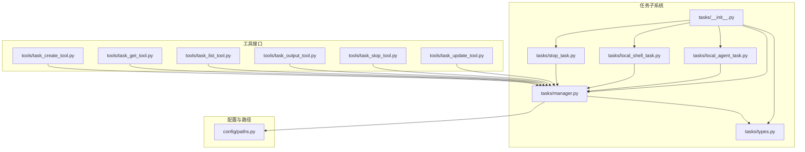
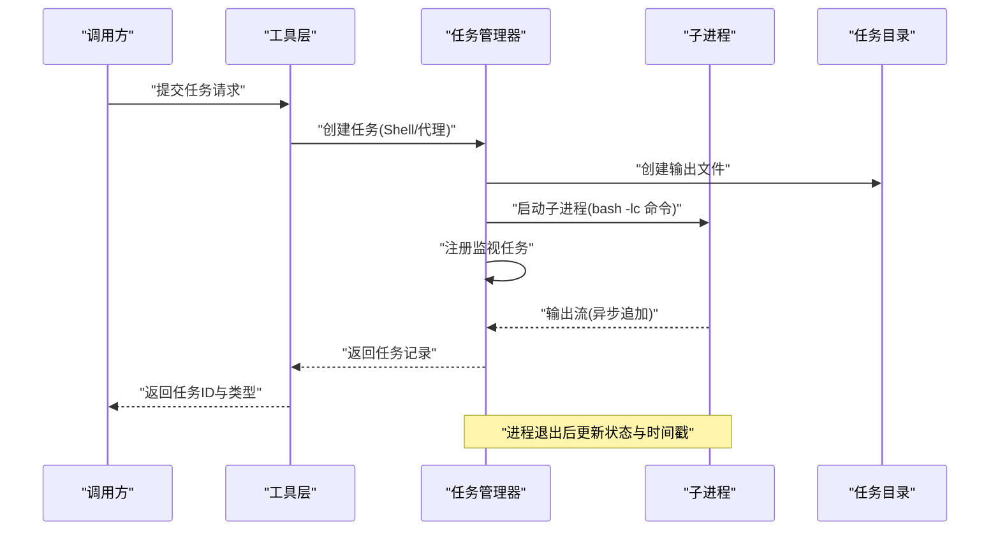
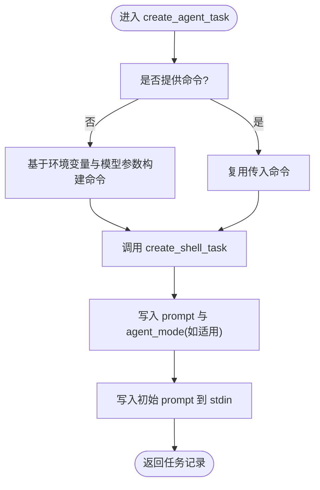
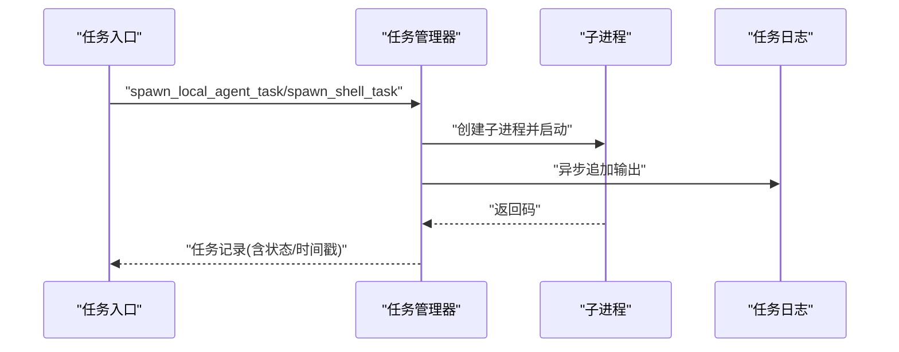
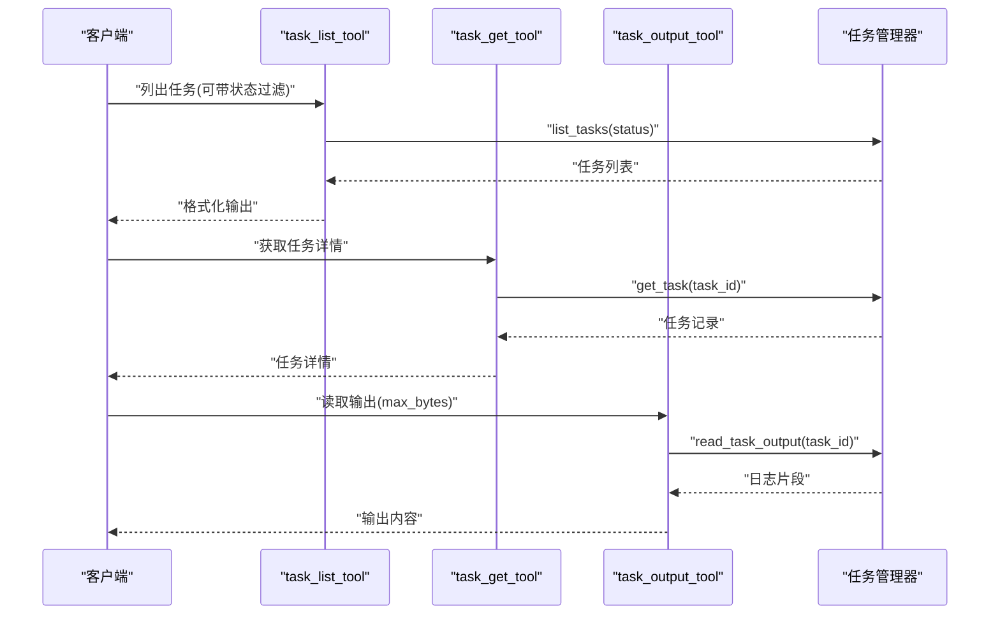
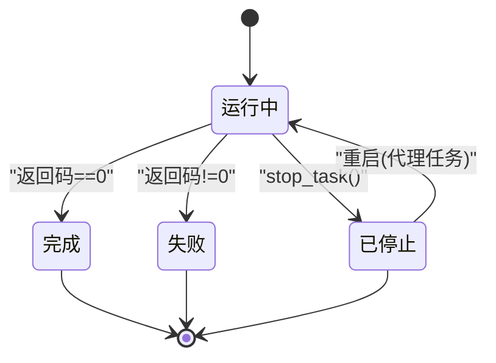
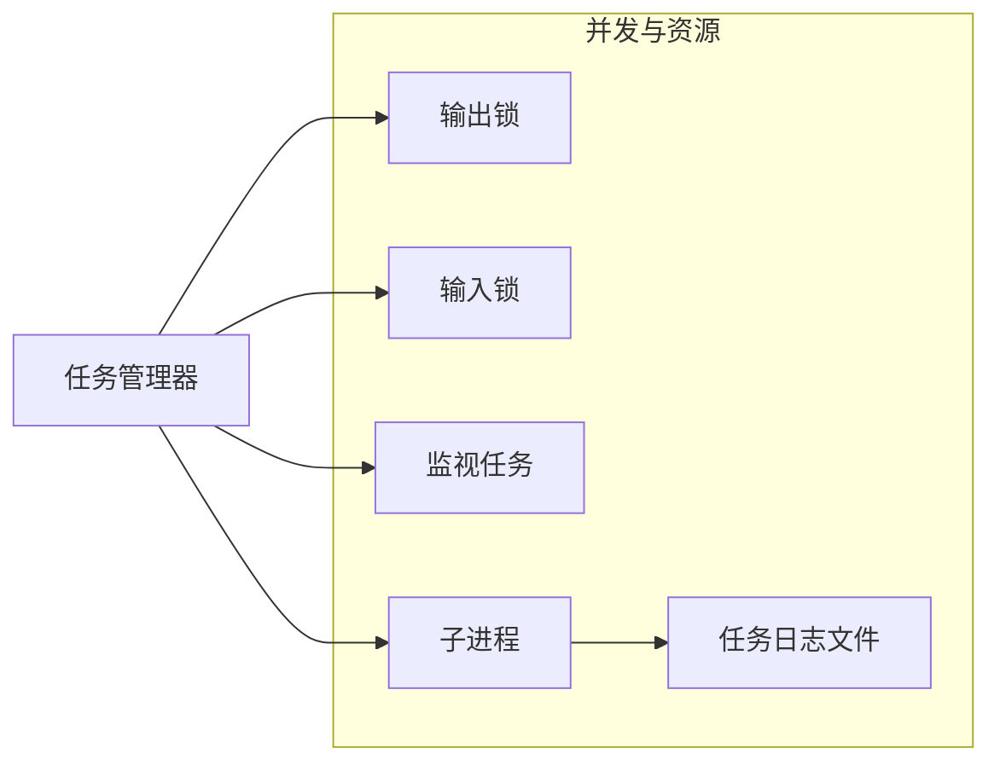
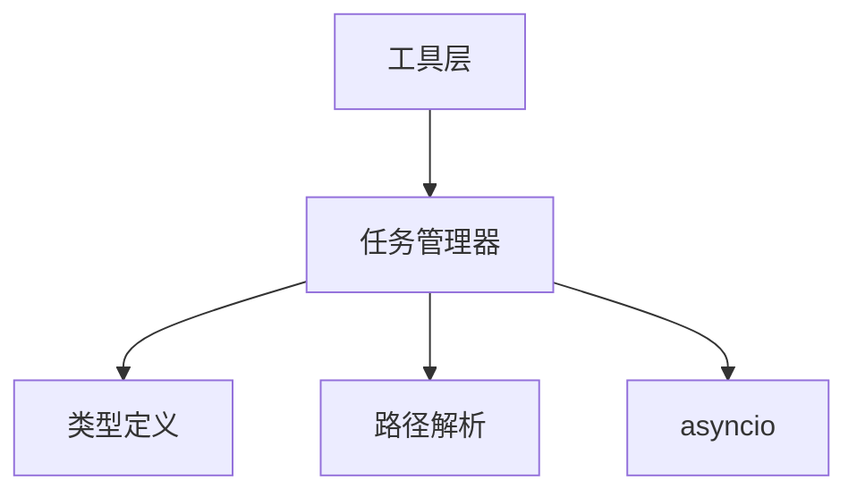

# 任务管理工具

<cite>
**本文引用的文件**
- [src/openharness/tasks/__init__.py](file://src/openharness/tasks/__init__.py)
- [src/openharness/tasks/types.py](file://src/openharness/tasks/types.py)
- [src/openharness/tasks/manager.py](file://src/openharness/tasks/manager.py)
- [src/openharness/tasks/local_agent_task.py](file://src/openharness/tasks/local_agent_task.py)
- [src/openharness/tasks/local_shell_task.py](file://src/openharness/tasks/local_shell_task.py)
- [src/openharness/tasks/stop_task.py](file://src/openharness/tasks/stop_task.py)
- [src/openharness/tools/task_create_tool.py](file://src/openharness/tools/task_create_tool.py)
- [src/openharness/tools/task_get_tool.py](file://src/openharness/tools/task_get_tool.py)
- [src/openharness/tools/task_list_tool.py](file://src/openharness/tools/task_list_tool.py)
- [src/openharness/tools/task_output_tool.py](file://src/openharness/tools/task_output_tool.py)
- [src/openharness/tools/task_stop_tool.py](file://src/openharness/tools/task_stop_tool.py)
- [src/openharness/tools/task_update_tool.py](file://src/openharness/tools/task_update_tool.py)
- [src/openharness/config/paths.py](file://src/openharness/config/paths.py)
- [tests/test_tasks/test_manager.py](file://tests/test_tasks/test_manager.py)
- [tests/test_tools/test_task_tools.py](file://tests/test_tools/test_task_tools.py)
</cite>

## 目录
1. [简介](#简介)
2. [项目结构](#项目结构)
3. [核心组件](#核心组件)
4. [架构总览](#架构总览)
5. [详细组件分析](#详细组件分析)
6. [依赖分析](#依赖分析)
7. [性能考虑](#性能考虑)
8. [故障排查指南](#故障排查指南)
9. [结论](#结论)
10. [附录](#附录)

## 简介
本文件系统性梳理 OpenHarness 的任务管理工具，覆盖以下方面：
- 任务创建：任务定义、参数配置与优先级设置（通过元数据实现）
- 任务查询：状态获取、结果检索与进度监控
- 任务列表：筛选、排序与分页机制
- 本地代理任务：异步执行模型、任务队列、并发控制与资源管理
- 本地 Shell 任务：命令执行与输出处理
- 生命周期：从创建到执行、监控再到清理的全链路说明
- 调度策略与性能优化建议

## 项目结构
任务管理相关代码主要分布在 tasks 子模块与 tools 子模块中，并通过统一的路径解析模块提供持久化目录。



**图表来源**
- [src/openharness/tasks/__init__.py:1-19](file://src/openharness/tasks/__init__.py#L1-L19)
- [src/openharness/tasks/types.py:1-31](file://src/openharness/tasks/types.py#L1-L31)
- [src/openharness/tasks/manager.py:1-281](file://src/openharness/tasks/manager.py#L1-L281)
- [src/openharness/tasks/local_agent_task.py:1-29](file://src/openharness/tasks/local_agent_task.py#L1-L29)
- [src/openharness/tasks/local_shell_task.py:1-18](file://src/openharness/tasks/local_shell_task.py#L1-L18)
- [src/openharness/tasks/stop_task.py:1-12](file://src/openharness/tasks/stop_task.py#L1-L12)
- [src/openharness/tools/task_create_tool.py:1-57](file://src/openharness/tools/task_create_tool.py#L1-L57)
- [src/openharness/tools/task_get_tool.py:1-34](file://src/openharness/tools/task_get_tool.py#L1-L34)
- [src/openharness/tools/task_list_tool.py:1-36](file://src/openharness/tools/task_list_tool.py#L1-L36)
- [src/openharness/tools/task_output_tool.py:1-36](file://src/openharness/tools/task_output_tool.py#L1-L36)
- [src/openharness/tools/task_stop_tool.py:1-31](file://src/openharness/tools/task_stop_tool.py#L1-L31)
- [src/openharness/tools/task_update_tool.py:1-51](file://src/openharness/tools/task_update_tool.py#L1-L51)
- [src/openharness/config/paths.py:1-117](file://src/openharness/config/paths.py#L1-L117)

**章节来源**
- [src/openharness/tasks/__init__.py:1-19](file://src/openharness/tasks/__init__.py#L1-L19)
- [src/openharness/config/paths.py:78-82](file://src/openharness/config/paths.py#L78-L82)

## 核心组件
- 任务类型与记录
  - 任务类型：local_bash、local_agent、remote_agent、in_process_teammate
  - 任务状态：pending、running、completed、failed、killed
  - 任务记录包含标识、类型、状态、描述、工作目录、输出文件、命令、提示词、时间戳、返回码以及可扩展元数据
- 任务管理器
  - 单例模式：按任务目录键值缓存默认实例，确保同一数据根下的全局一致性
  - 支持 Shell 与代理两类任务的创建、停止、输入写入、输出读取与进程监视
  - 提供更新任务元数据（描述、进度、状态备注）的能力
- 工具接口
  - 任务创建、查询、列表、输出读取、停止、更新等工具封装了统一的输入模型与执行流程

**章节来源**
- [src/openharness/tasks/types.py:10-31](file://src/openharness/tasks/types.py#L10-L31)
- [src/openharness/tasks/manager.py:18-281](file://src/openharness/tasks/manager.py#L18-L281)
- [src/openharness/tools/task_create_tool.py:13-57](file://src/openharness/tools/task_create_tool.py#L13-L57)
- [src/openharness/tools/task_get_tool.py:11-34](file://src/openharness/tools/task_get_tool.py#L11-L34)
- [src/openharness/tools/task_list_tool.py:11-36](file://src/openharness/tools/task_list_tool.py#L11-L36)
- [src/openharness/tools/task_output_tool.py:11-36](file://src/openharness/tools/task_output_tool.py#L11-L36)
- [src/openharness/tools/task_stop_tool.py:11-31](file://src/openharness/tools/task_stop_tool.py#L11-L31)
- [src/openharness/tools/task_update_tool.py:11-51](file://src/openharness/tools/task_update_tool.py#L11-L51)

## 架构总览
任务管理采用“工具层 + 管理器 + 类型定义”的分层设计。工具层负责输入校验与调用，管理器负责异步子进程生命周期与状态维护，类型定义提供强约束的数据模型。



**图表来源**
- [src/openharness/tasks/manager.py:29-92](file://src/openharness/tasks/manager.py#L29-L92)
- [src/openharness/tasks/manager.py:170-191](file://src/openharness/tasks/manager.py#L170-L191)
- [src/openharness/config/paths.py:78-82](file://src/openharness/config/paths.py#L78-L82)

## 详细组件分析

### 任务类型与记录
- 数据模型
  - 字段覆盖：标识、类型、状态、描述、工作目录、输出文件、命令、提示词、时间戳、返回码、元数据字典
  - 元数据用于承载进度百分比、状态备注、重启次数等运行期信息
- 类型别名
  - 任务类型与状态均为受限字面量，便于静态检查与工具链约束

```mermaid
classDiagram
class TaskRecord {
+string id
+TaskType type
+TaskStatus status
+string description
+string cwd
+Path output_file
+string|None command
+string|None prompt
+float created_at
+float|None started_at
+float|None ended_at
+int|None return_code
+dict metadata
}
class TaskType {
<<literal>>
"local_bash"
"local_agent"
"remote_agent"
"in_process_teammate"
}
class TaskStatus {
<<literal>>
"pending"
"running"
"completed"
"failed"
"killed"
}
TaskRecord --> TaskType : "使用"
TaskRecord --> TaskStatus : "使用"
```

**图表来源**
- [src/openharness/tasks/types.py:10-31](file://src/openharness/tasks/types.py#L10-L31)

**章节来源**
- [src/openharness/tasks/types.py:10-31](file://src/openharness/tasks/types.py#L10-L31)

### 任务管理器（BackgroundTaskManager）
- 创建任务
  - Shell 任务：生成唯一任务ID、创建空输出文件、初始化锁与代数计数、启动 bash 子进程
  - 代理任务：若未显式提供命令，则基于环境变量与可选模型参数拼装命令；随后复用 Shell 任务流程
- 进程监视与状态更新
  - 异步复制 stdout 到任务日志文件，进程结束后根据返回码更新状态与结束时间
  - 使用“代数”避免竞态：当任务被重启时，旧监视器会感知到代数变化而提前退出
- 输入/输出与并发控制
  - 每个任务拥有独立的输出锁与输入锁，保证并发安全
  - 写入 stdin 时自动确保可写进程存在；对代理任务在断开时自动重启
- 查询与更新
  - 按状态过滤与按创建时间倒序排序
  - 更新描述、进度（0~100）、状态备注；备注为空则移除
- 停止任务
  - 发送终止信号，等待超时后强制杀死；更新状态为 killed 并记录结束时间



**图表来源**
- [src/openharness/tasks/manager.py:58-92](file://src/openharness/tasks/manager.py#L58-L92)
- [src/openharness/tasks/manager.py:29-57](file://src/openharness/tasks/manager.py#L29-L57)

**章节来源**
- [src/openharness/tasks/manager.py:18-281](file://src/openharness/tasks/manager.py#L18-L281)

### 本地代理任务与本地 Shell 任务
- 本地代理任务
  - 通过工具或直接调用入口函数创建；若未指定命令，将自动拼装命令行
  - 支持在运行中向 stdin 写入数据，具备断线重连能力
- 本地 Shell 任务
  - 直接以 bash -lc 执行传入命令，输出实时写入任务日志文件



**图表来源**
- [src/openharness/tasks/local_agent_task.py:11-29](file://src/openharness/tasks/local_agent_task.py#L11-L29)
- [src/openharness/tasks/local_shell_task.py:11-18](file://src/openharness/tasks/local_shell_task.py#L11-L18)
- [src/openharness/tasks/manager.py:209-229](file://src/openharness/tasks/manager.py#L209-L229)

**章节来源**
- [src/openharness/tasks/local_agent_task.py:1-29](file://src/openharness/tasks/local_agent_task.py#L1-L29)
- [src/openharness/tasks/local_shell_task.py:1-18](file://src/openharness/tasks/local_shell_task.py#L1-L18)

### 任务查询与进度监控
- 获取单个任务详情
  - 通过任务 ID 返回任务记录字符串表示
- 列出任务
  - 可按状态过滤，按创建时间倒序排列
- 输出读取
  - 读取任务日志文件尾部内容，支持最大字节数限制
- 进度与状态备注
  - 通过更新工具设置 progress 与 status_note，便于 UI 展示与协调



**图表来源**
- [src/openharness/tools/task_list_tool.py:28-35](file://src/openharness/tools/task_list_tool.py#L28-L35)
- [src/openharness/tools/task_get_tool.py:28-33](file://src/openharness/tools/task_get_tool.py#L28-L33)
- [src/openharness/tools/task_output_tool.py:29-35](file://src/openharness/tools/task_output_tool.py#L29-L35)
- [src/openharness/tasks/manager.py:94-103](file://src/openharness/tasks/manager.py#L94-L103)
- [src/openharness/tasks/manager.py:162-168](file://src/openharness/tasks/manager.py#L162-L168)

**章节来源**
- [src/openharness/tools/task_list_tool.py:1-36](file://src/openharness/tools/task_list_tool.py#L1-L36)
- [src/openharness/tools/task_get_tool.py:1-34](file://src/openharness/tools/task_get_tool.py#L1-L34)
- [src/openharness/tools/task_output_tool.py:1-36](file://src/openharness/tools/task_output_tool.py#L1-L36)
- [src/openharness/tasks/manager.py:94-168](file://src/openharness/tasks/manager.py#L94-L168)

### 任务生命周期与清理
- 创建：生成任务记录、创建输出文件、启动子进程、注册监视任务
- 执行：异步复制输出至日志文件；进程退出后更新状态与时间戳
- 监控：通过输出读取与状态查询持续观察任务进展
- 清理：停止任务时尝试优雅终止，超时后强制杀死；更新状态为 killed



**图表来源**
- [src/openharness/tasks/manager.py:170-191](file://src/openharness/tasks/manager.py#L170-L191)
- [src/openharness/tasks/manager.py:127-145](file://src/openharness/tasks/manager.py#L127-L145)

**章节来源**
- [src/openharness/tasks/manager.py:170-229](file://src/openharness/tasks/manager.py#L170-L229)
- [src/openharness/tasks/manager.py:127-145](file://src/openharness/tasks/manager.py#L127-L145)

### 任务调度策略与并发控制
- 任务队列
  - 通过后台监视任务与事件循环维持任务队列；每个任务独立的等待器与进程对象
- 并发控制
  - 通过每任务一个输出锁与输入锁，避免并发写入冲突
  - 代理任务在断线时自动重启，保持交互连续性
- 资源管理
  - 任务日志文件按任务隔离存储于任务目录
  - 任务记录仅保存必要字段，避免内存膨胀



**图表来源**
- [src/openharness/tasks/manager.py:21-27](file://src/openharness/tasks/manager.py#L21-L27)
- [src/openharness/tasks/manager.py:192-202](file://src/openharness/tasks/manager.py#L192-L202)
- [src/openharness/tasks/manager.py:209-229](file://src/openharness/tasks/manager.py#L209-L229)

**章节来源**
- [src/openharness/tasks/manager.py:21-27](file://src/openharness/tasks/manager.py#L21-L27)
- [src/openharness/tasks/manager.py:192-202](file://src/openharness/tasks/manager.py#L192-L202)
- [src/openharness/tasks/manager.py:209-229](file://src/openharness/tasks/manager.py#L209-L229)

### 参数配置与优先级设置
- 任务创建参数
  - 任务类型：local_bash 或 local_agent
  - 描述：简短任务说明
  - 命令：local_bash 必填；local_agent 可由工具自动拼装
  - 提示词：local_agent 必填
  - 模型：可选，影响代理命令拼装
- 优先级设置
  - 通过元数据中的进度百分比与状态备注实现“软优先级”，便于 UI 与协调层进行排序与展示
  - 管理器提供更新接口，支持在运行中调整描述、进度与备注

**章节来源**
- [src/openharness/tools/task_create_tool.py:13-57](file://src/openharness/tools/task_create_tool.py#L13-L57)
- [src/openharness/tools/task_update_tool.py:11-51](file://src/openharness/tools/task_update_tool.py#L11-L51)
- [src/openharness/tasks/manager.py:105-125](file://src/openharness/tasks/manager.py#L105-L125)

### 任务筛选、排序与分页
- 筛选
  - 支持按状态过滤（如 running/completed/failed/killed）
- 排序
  - 默认按创建时间倒序排列
- 分页
  - 当前实现返回完整列表；如需分页，可在上层应用中按需切片

**章节来源**
- [src/openharness/tools/task_list_tool.py:28-35](file://src/openharness/tools/task_list_tool.py#L28-L35)
- [src/openharness/tasks/manager.py:98-103](file://src/openharness/tasks/manager.py#L98-L103)

### 本地 Shell 任务的命令执行与输出处理
- 命令执行
  - 使用 bash -lc 启动子进程，确保交互式环境与登录 shell 行为
- 输出处理
  - 异步读取 stdout，按块写入对应任务日志文件
  - 读取时支持最大字节数限制，避免一次性加载过大日志

**章节来源**
- [src/openharness/tasks/manager.py:216-224](file://src/openharness/tasks/manager.py#L216-L224)
- [src/openharness/tasks/manager.py:192-202](file://src/openharness/tasks/manager.py#L192-L202)
- [src/openharness/tools/task_output_tool.py:11-36](file://src/openharness/tools/task_output_tool.py#L11-L36)

## 依赖分析
- 组件耦合
  - 工具层仅依赖任务管理器接口，低耦合、高内聚
  - 任务管理器依赖类型定义与路径解析模块
- 外部依赖
  - asyncio：异步子进程与事件循环
  - 路径解析：XDG 风格的目录约定，支持环境变量覆盖



**图表来源**
- [src/openharness/tasks/manager.py:1-16](file://src/openharness/tasks/manager.py#L1-L16)
- [src/openharness/config/paths.py:78-82](file://src/openharness/config/paths.py#L78-L82)

**章节来源**
- [src/openharness/tasks/manager.py:1-16](file://src/openharness/tasks/manager.py#L1-L16)
- [src/openharness/config/paths.py:78-82](file://src/openharness/config/paths.py#L78-L82)

## 性能考虑
- I/O 优化
  - 输出按块读写，避免频繁系统调用
  - 日志截断策略：读取时仅返回最大字节数，降低内存占用
- 并发与锁
  - 每任务独立锁，减少争用；仅在必要时持有
- 进程生命周期
  - 代数机制避免监视器竞态；优雅终止+超时强制杀死，平衡可靠性与响应性
- 目录与磁盘
  - 任务日志按任务隔离存储，便于清理与审计；建议定期清理过期任务日志

[本节为通用性能建议，不直接分析具体文件]

## 故障排查指南
- 无法创建代理任务
  - 若未提供命令且缺少必需环境变量，会抛出错误；请显式提供命令或设置环境变量
- 写入代理任务失败
  - 若任务不接受输入或进程不可写，会触发断线重连；检查任务类型与命令是否支持交互
- 停止任务无效
  - 仅运行中的任务可停止；已完成或已停止的任务无法再次停止
- 输出为空或过少
  - 检查最大字节数限制；确认任务确实在运行且有输出产生

**章节来源**
- [src/openharness/tasks/manager.py:70-80](file://src/openharness/tasks/manager.py#L70-L80)
- [src/openharness/tasks/manager.py:147-161](file://src/openharness/tasks/manager.py#L147-L161)
- [src/openharness/tasks/manager.py:127-145](file://src/openharness/tasks/manager.py#L127-L145)
- [src/openharness/tools/task_output_tool.py:15-36](file://src/openharness/tools/task_output_tool.py#L15-L36)

## 结论
OpenHarness 的任务管理工具以清晰的分层设计实现了对本地 Shell 与本地代理任务的统一管理。通过异步子进程模型、细粒度的并发控制与完善的生命周期管理，系统在易用性与可靠性之间取得良好平衡。配合工具层提供的查询、更新与输出读取能力，用户可以高效地完成任务的创建、监控与清理。

## 附录
- 目录约定
  - 任务日志目录位于数据目录下的 tasks 子目录，可通过环境变量覆盖
- 测试参考
  - 单测覆盖了任务创建、输出读取、代理任务写入与重启、停止等关键路径

**章节来源**
- [src/openharness/config/paths.py:78-82](file://src/openharness/config/paths.py#L78-L82)
- [tests/test_tasks/test_manager.py:14-86](file://tests/test_tasks/test_manager.py#L14-L86)
- [tests/test_tools/test_task_tools.py:19-111](file://tests/test_tools/test_task_tools.py#L19-L111)