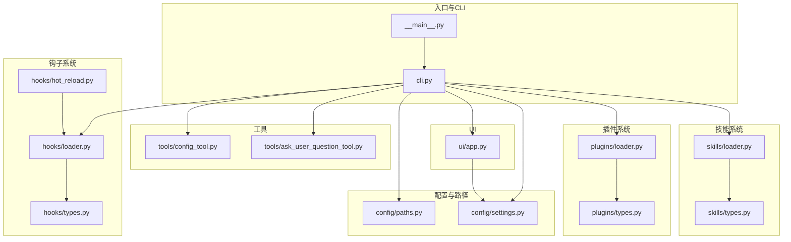
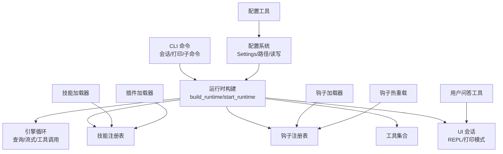
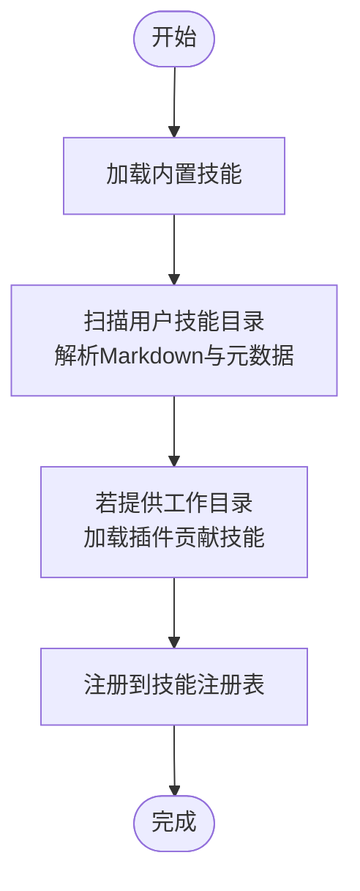
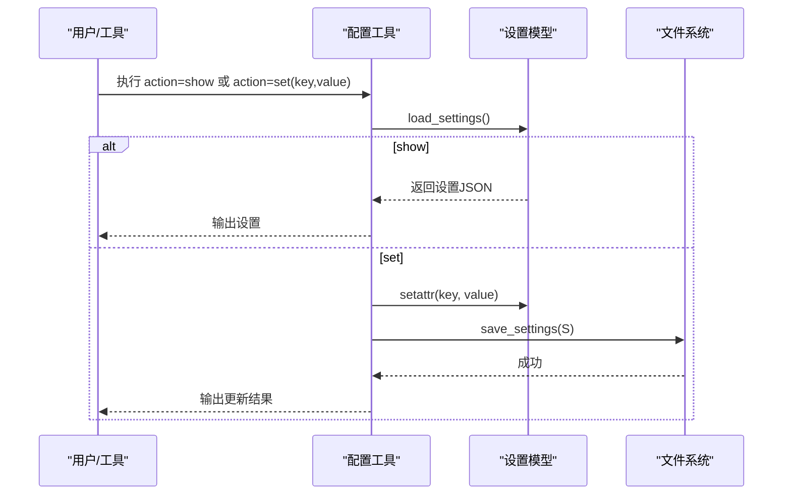
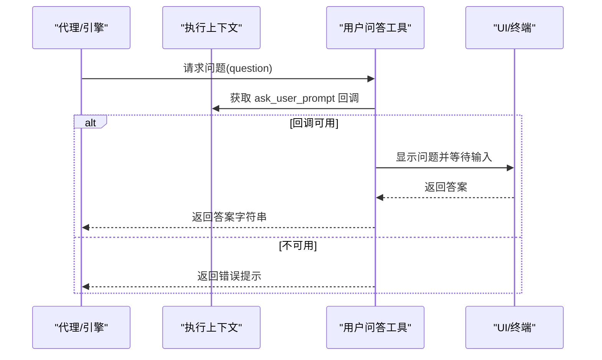
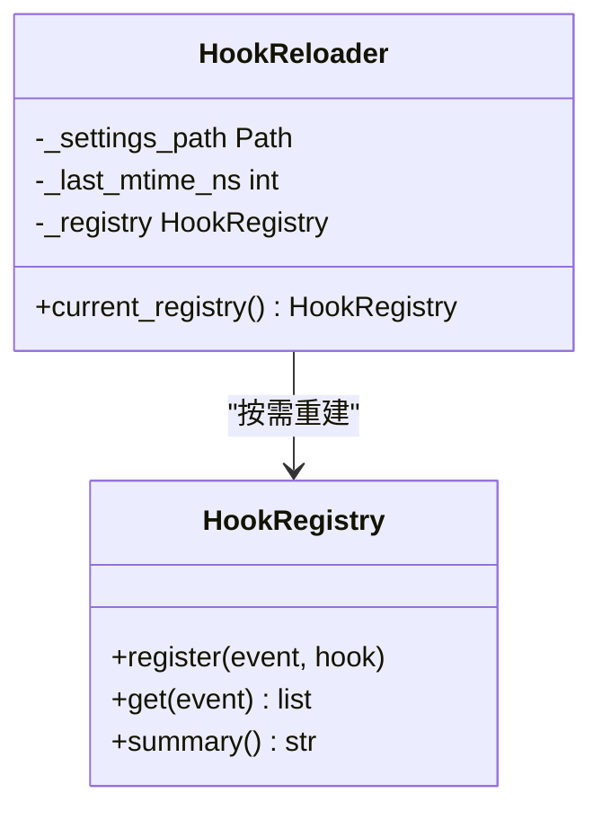
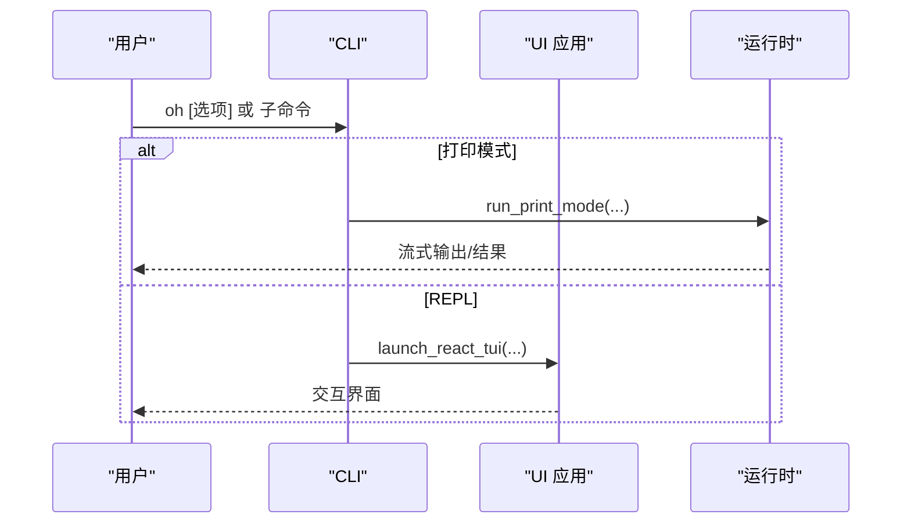
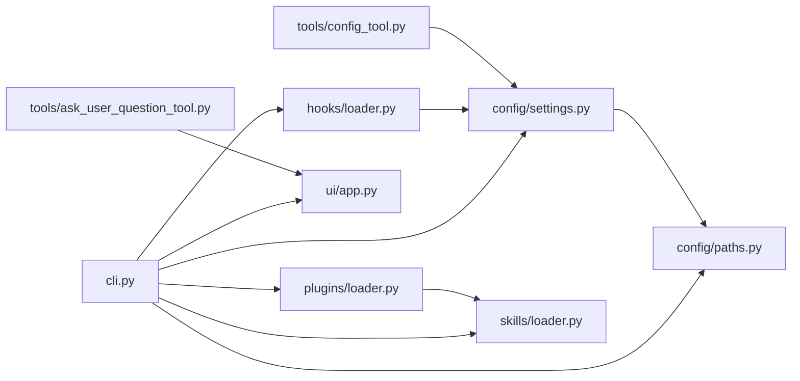

# 元工具

<cite>
**本文引用的文件**
- [README.md](file://README.md)
- [__main__.py](file://src/openharness/__main__.py)
- [cli.py](file://src/openharness/cli.py)
- [paths.py](file://src/openharness/config/paths.py)
- [settings.py](file://src/openharness/config/settings.py)
- [config_tool.py](file://src/openharness/tools/config_tool.py)
- [ask_user_question_tool.py](file://src/openharness/tools/ask_user_question_tool.py)
- [loader.py（技能）](file://src/openharness/skills/loader.py)
- [types.py（技能）](file://src/openharness/skills/types.py)
- [loader.py（插件）](file://src/openharness/plugins/loader.py)
- [types.py（插件）](file://src/openharness/plugins/types.py)
- [loader.py（钩子）](file://src/openharness/hooks/loader.py)
- [hot_reload.py](file://src/openharness/hooks/hot_reload.py)
- [types.py（钩子结果）](file://src/openharness/hooks/types.py)
- [app.py](file://src/openharness/ui/app.py)
</cite>

## 目录
1. [简介](#简介)
2. [项目结构](#项目结构)
3. [核心组件](#核心组件)
4. [架构总览](#架构总览)
5. [组件详解](#组件详解)
6. [依赖关系分析](#依赖关系分析)
7. [性能考量](#性能考量)
8. [故障排查指南](#故障排查指南)
9. [结论](#结论)
10. [附录](#附录)

## 简介
本文件面向 OpenHarness 的“元工具”能力，系统性阐述其在系统中的定位与职责：以最小代码体量实现对“技能加载、配置管理、用户交互”的统一抽象与编排。重点覆盖以下方面：
- 技能加载工具：技能文件解析、元数据提取、用户与插件贡献技能的合并、动态加载与依赖管理。
- 配置管理工具：设置读取、环境变量与命令行覆盖、修改与持久化。
- 用户交互工具：问答机制与上下文保持。
- 元工具在架构中的作用：作为入口与编排中枢，连接引擎、工具、技能、插件、钩子、UI 等子系统。
- 使用场景、配置项与扩展方法、最佳实践与性能优化、与外部系统的集成指南。

## 项目结构
OpenHarness 采用按功能域分层的模块组织方式，元工具相关的关键路径如下：
- CLI 入口与主命令：src/openharness/cli.py
- 配置与路径：src/openharness/config/paths.py、src/openharness/config/settings.py
- 技能系统：src/openharness/skills/loader.py、src/openharness/skills/types.py
- 插件系统：src/openharness/plugins/loader.py、src/openharness/plugins/types.py
- 钩子系统：src/openharness/hooks/loader.py、src/openharness/hooks/hot_reload.py、src/openharness/hooks/types.py
- 工具：配置工具、用户问答工具等
- UI 会话入口：src/openharness/ui/app.py
- 包入口：src/openharness/__main__.py

图表来源
- [__main__.py:1-7](file://src/openharness/__main__.py#L1-L7)
- [cli.py:1-378](file://src/openharness/cli.py#L1-L378)
- [paths.py:1-117](file://src/openharness/config/paths.py#L1-L117)
- [settings.py:1-161](file://src/openharness/config/settings.py#L1-L161)
- [loader.py（技能）:1-97](file://src/openharness/skills/loader.py#L1-L97)
- [types.py（技能）:1-17](file://src/openharness/skills/types.py#L1-L17)
- [loader.py（插件）:1-195](file://src/openharness/plugins/loader.py#L1-L195)
- [types.py（插件）:1-33](file://src/openharness/plugins/types.py#L1-L33)
- [loader.py（钩子）:1-61](file://src/openharness/hooks/loader.py#L1-L61)
- [hot_reload.py:1-32](file://src/openharness/hooks/hot_reload.py#L1-L32)
- [types.py（钩子结果）:1-39](file://src/openharness/hooks/types.py#L1-L39)
- [config_tool.py:1-38](file://src/openharness/tools/config_tool.py#L1-L38)
- [ask_user_question_tool.py:1-47](file://src/openharness/tools/ask_user_question_tool.py#L1-L47)
- [app.py:1-149](file://src/openharness/ui/app.py#L1-L149)

章节来源
- [README.md:127-147](file://README.md#L127-L147)
- [__main__.py:1-7](file://src/openharness/__main__.py#L1-L7)
- [cli.py:1-378](file://src/openharness/cli.py#L1-L378)

## 核心组件
- CLI 主命令与子命令：负责会话启动、打印模式、MCP/插件/认证管理等。
- 配置与路径：提供设置模型、环境变量覆盖、默认值合并、配置文件读写与路径解析。
- 技能加载器：从内置与用户目录加载 Markdown 技能，解析元数据，支持插件贡献技能。
- 插件加载器：发现与加载插件清单、技能、钩子、MCP 配置。
- 钩子系统：事件驱动的生命周期钩子注册与执行，支持热重载。
- 工具：配置工具用于读取/更新设置；用户问答工具用于交互式提问与答案返回。
- UI 会话入口：提供 REPL 与非交互打印模式，承载对话与输出渲染。

章节来源
- [cli.py:179-378](file://src/openharness/cli.py#L179-L378)
- [settings.py:49-161](file://src/openharness/config/settings.py#L49-L161)
- [paths.py:15-117](file://src/openharness/config/paths.py#L15-L117)
- [loader.py（技能）:21-56](file://src/openharness/skills/loader.py#L21-L56)
- [loader.py（插件）:53-106](file://src/openharness/plugins/loader.py#L53-L106)
- [loader.py（钩子）:40-61](file://src/openharness/hooks/loader.py#L40-L61)
- [hot_reload.py:11-32](file://src/openharness/hooks/hot_reload.py#L11-L32)
- [config_tool.py:19-38](file://src/openharness/tools/config_tool.py#L19-L38)
- [ask_user_question_tool.py:21-47](file://src/openharness/tools/ask_user_question_tool.py#L21-L47)
- [app.py:15-149](file://src/openharness/ui/app.py#L15-L149)

## 架构总览
元工具在整体架构中扮演“编排中枢”角色：
- CLI 解析参数与子命令，决定运行模式（REPL 或打印模式），并构建运行时环境。
- 配置子系统提供设置来源与优先级（CLI > 环境变量 > 配置文件 > 默认值）。
- 技能与插件子系统提供知识与扩展能力，通过注册表统一暴露给引擎。
- 钩子系统提供生命周期事件扩展点，支持热重载。
- 工具子系统提供配置读写与用户问答等基础能力。
- UI 子系统承载交互体验，负责事件渲染与状态展示。

图表来源
- [cli.py:179-378](file://src/openharness/cli.py#L179-L378)
- [app.py:15-149](file://src/openharness/ui/app.py#L15-L149)
- [settings.py:123-161](file://src/openharness/config/settings.py#L123-L161)
- [loader.py（技能）:21-37](file://src/openharness/skills/loader.py#L21-L37)
- [loader.py（插件）:53-106](file://src/openharness/plugins/loader.py#L53-L106)
- [loader.py（钩子）:40-61](file://src/openharness/hooks/loader.py#L40-L61)
- [hot_reload.py:14-32](file://src/openharness/hooks/hot_reload.py#L14-L32)
- [config_tool.py:26-38](file://src/openharness/tools/config_tool.py#L26-L38)
- [ask_user_question_tool.py:32-47](file://src/openharness/tools/ask_user_question_tool.py#L32-L47)

## 组件详解

### 技能加载与动态加载机制
- 技能来源与合并
  - 内置技能：来自打包资源，直接注册到技能注册表。
  - 用户技能：扫描用户配置目录下的 Markdown 文件，解析元数据后注册。
  - 插件技能：当工作目录存在插件时，加载插件贡献的技能并注册。
- 元数据提取
  - 支持 YAML 前言块与标题/段落回退策略，提取名称与描述。
- 依赖管理
  - 技能定义包含来源标识与路径，便于追踪与调试。
  - 插件可声明技能目录，统一由加载器扫描并注入注册表。
- 动态加载与热重载
  - 钩子支持基于设置文件变更的热重载，确保钩子定义随配置变化而更新。

图表来源
- [loader.py（技能）:21-56](file://src/openharness/skills/loader.py#L21-L56)
- [loader.py（技能）:58-97](file://src/openharness/skills/loader.py#L58-L97)
- [types.py（技能）:8-17](file://src/openharness/skills/types.py#L8-L17)
- [loader.py（插件）:74-106](file://src/openharness/plugins/loader.py#L74-L106)

章节来源
- [loader.py（技能）:21-56](file://src/openharness/skills/loader.py#L21-L56)
- [loader.py（技能）:58-97](file://src/openharness/skills/loader.py#L58-L97)
- [types.py（技能）:8-17](file://src/openharness/skills/types.py#L8-L17)
- [loader.py（插件）:74-106](file://src/openharness/plugins/loader.py#L74-L106)

### 配置管理工具：读取、修改与持久化
- 设置模型与优先级
  - 提供 API 密钥、模型、最大令牌数、基础 URL、权限、钩子、内存、插件启用映射、MCP 服务器等字段。
  - 优先级：CLI 覆盖 > 环境变量 > 配置文件 > 默认值。
- 路径解析
  - 支持通过环境变量覆盖配置/数据/日志/会话等目录位置。
- 读取与持久化
  - 读取：从默认或指定路径加载 JSON 并校验模型。
  - 持久化：将设置对象序列化为 JSON 并写入文件。
- 配置工具
  - 提供 show/set 动作，支持在运行时读取与更新设置，并保存到配置文件。

图表来源
- [config_tool.py:26-38](file://src/openharness/tools/config_tool.py#L26-L38)
- [settings.py:123-161](file://src/openharness/config/settings.py#L123-L161)
- [paths.py:32-34](file://src/openharness/config/paths.py#L32-L34)

章节来源
- [settings.py:49-161](file://src/openharness/config/settings.py#L49-L161)
- [paths.py:15-117](file://src/openharness/config/paths.py#L15-L117)
- [config_tool.py:19-38](file://src/openharness/tools/config_tool.py#L19-L38)

### 用户交互工具：问答机制与上下文保持
- 交互设计
  - 用户问答工具通过回调函数向当前会话询问问题，并返回用户输入的答案。
  - 在非交互打印模式下，该工具不可用，会返回错误提示。
- 上下文保持
  - 问答回调通过执行上下文的元数据传递，保证在一次会话内可多次提问并保持连贯性。

图表来源
- [ask_user_question_tool.py:32-47](file://src/openharness/tools/ask_user_question_tool.py#L32-L47)
- [app.py:75-87](file://src/openharness/ui/app.py#L75-L87)

章节来源
- [ask_user_question_tool.py:21-47](file://src/openharness/tools/ask_user_question_tool.py#L21-L47)
- [app.py:50-89](file://src/openharness/ui/app.py#L50-L89)

### 钩子系统与热重载
- 钩子注册与聚合
  - 将设置与插件中的钩子按事件类型注册到注册表，支持命令、提示词、HTTP、代理等类型。
- 热重载
  - 基于设置文件的最后修改时间判断是否需要重新加载钩子定义，避免频繁 IO。

图表来源
- [loader.py（钩子）:10-38](file://src/openharness/hooks/loader.py#L10-L38)
- [hot_reload.py:11-32](file://src/openharness/hooks/hot_reload.py#L11-L32)

章节来源
- [loader.py（钩子）:40-61](file://src/openharness/hooks/loader.py#L40-L61)
- [hot_reload.py:14-32](file://src/openharness/hooks/hot_reload.py#L14-L32)

### CLI 与会话入口
- 主命令
  - 支持会话控制（继续、恢复、命名）、模型与努力级别、输出格式、权限模式、系统提示词、设置文件、基础 URL、API Key、裸模式、调试、MCP 配置、工作目录、仅后端模式等。
- 运行模式
  - REPL：交互式 React TUI。
  - 打印模式：提交提示、流式输出、退出。

图表来源
- [cli.py:179-378](file://src/openharness/cli.py#L179-L378)
- [app.py:15-48](file://src/openharness/ui/app.py#L15-L48)

章节来源
- [cli.py:179-378](file://src/openharness/cli.py#L179-L378)
- [app.py:15-149](file://src/openharness/ui/app.py#L15-L149)

## 依赖关系分析
- 组件耦合
  - CLI 依赖配置、路径、插件、技能、钩子、工具与 UI。
  - 技能与插件加载器依赖设置与路径解析。
  - 钩子热重载依赖设置文件监控。
  - 配置工具依赖设置模型与路径。
- 外部依赖
  - Typer 用于 CLI 定义与子命令。
  - Pydantic 用于设置模型与校验。
  - React TUI 用于前端交互（通过后端协议）。

图表来源
- [cli.py:1-378](file://src/openharness/cli.py#L1-L378)
- [settings.py:1-161](file://src/openharness/config/settings.py#L1-L161)
- [paths.py:1-117](file://src/openharness/config/paths.py#L1-L117)
- [loader.py（插件）:1-195](file://src/openharness/plugins/loader.py#L1-L195)
- [loader.py（技能）:1-97](file://src/openharness/skills/loader.py#L1-L97)
- [loader.py（钩子）:1-61](file://src/openharness/hooks/loader.py#L1-L61)
- [app.py:1-149](file://src/openharness/ui/app.py#L1-L149)
- [config_tool.py:1-38](file://src/openharness/tools/config_tool.py#L1-L38)
- [ask_user_question_tool.py:1-47](file://src/openharness/tools/ask_user_question_tool.py#L1-L47)

章节来源
- [cli.py:1-378](file://src/openharness/cli.py#L1-L378)

## 性能考量
- 最小化 IO
  - 技能与插件扫描仅在必要时进行；钩子热重载通过文件时间戳快速判断是否需要重建。
- 懒加载与按需注册
  - 技能与插件在会话启动阶段集中加载，避免重复扫描。
- 配置缓存
  - 设置模型在进程内复用，减少重复解析与序列化。
- 输出流式化
  - 打印模式支持流式 JSON 事件，降低内存峰值与延迟。

## 故障排查指南
- 配置文件读取失败
  - 检查配置文件路径与权限，确认 JSON 格式正确。
  - 参考设置加载逻辑与路径解析。
- 钩子未生效
  - 确认设置中钩子定义正确，检查热重载是否触发。
- 技能未出现
  - 检查用户技能目录与插件技能目录是否存在，Markdown 文件是否包含有效元数据。
- 用户问答工具不可用
  - 确认当前会话提供了有效的问答回调；非交互模式下该工具不可用。

章节来源
- [settings.py:123-161](file://src/openharness/config/settings.py#L123-L161)
- [paths.py:32-34](file://src/openharness/config/paths.py#L32-L34)
- [hot_reload.py:20-32](file://src/openharness/hooks/hot_reload.py#L20-L32)
- [ask_user_question_tool.py:32-47](file://src/openharness/tools/ask_user_question_tool.py#L32-L47)

## 结论
元工具通过 CLI 编排、配置与路径抽象、技能与插件动态加载、钩子热重载以及用户交互工具，实现了对 OpenHarness 的统一接入与扩展。它既满足日常开发的交互需求，也支持脚本化与自动化场景，是连接底层引擎与上层应用的关键枢纽。

## 附录

### 使用场景
- 日常开发：REPL 交互、命令选择、权限弹窗、会话恢复。
- 自动化脚本：打印模式配合 JSON/流式 JSON 输出，便于管道与 CI 集成。
- 扩展与定制：添加自定义技能、插件与钩子，增强领域能力与安全边界。

### 配置选项速览（节选）
- 会话控制：--continue、--resume、--name
- 模型与努力：--model、--effort、--max-turns
- 输出：--print、--output-format
- 权限：--permission-mode、--dangerously-skip-permissions、--allowed-tools、--disallowed-tools
- 系统与上下文：--system-prompt、--append-system-prompt、--settings、--base-url、--api-key、--bare
- 高级：--debug、--mcp-config、--cwd、--backend-only

章节来源
- [cli.py:179-378](file://src/openharness/cli.py#L179-L378)

### 扩展方法
- 添加自定义工具：参考工具基类与输入模型定义。
- 添加自定义技能：在用户技能目录放置 Markdown 文件，支持 YAML 前言块。
- 添加插件：在用户或项目插件目录创建清单与贡献内容（commands/agents/hooks/mcp）。
- 添加钩子：在设置中定义事件钩子，或通过插件提供结构化钩子文件。

章节来源
- [README.md:302-356](file://README.md#L302-L356)
- [loader.py（技能）:58-97](file://src/openharness/skills/loader.py#L58-L97)
- [loader.py（插件）:29-106](file://src/openharness/plugins/loader.py#L29-L106)
- [loader.py（钩子）:128-184](file://src/openharness/hooks/loader.py#L128-L184)

### 最佳实践
- 使用环境变量与 CLI 覆盖敏感配置，避免硬编码。
- 将技能与插件按领域拆分，保持清晰的目录结构。
- 合理使用钩子进行安全与审计，避免滥用命令执行。
- 在自动化场景中使用打印模式与流式 JSON，提升可观测性与可维护性。

### 性能优化建议
- 减少不必要的插件与技能加载，按需启用。
- 利用钩子热重载避免重启，提高迭代效率。
- 对大文件操作使用流式处理与分块读取，降低内存占用。

### 与外部系统的集成指南
- MCP 服务器：通过设置或插件清单配置，统一在会话中使用。
- 第三方工具：通过插件封装命令与钩子，实现跨系统协作。
- UI 与后端：通过仅后端模式与 React TUI 协议对接，适配不同部署形态。

章节来源
- [cli.py:39-92](file://src/openharness/cli.py#L39-L92)
- [loader.py（插件）:187-195](file://src/openharness/plugins/loader.py#L187-L195)
- [app.py:27-47](file://src/openharness/ui/app.py#L27-L47)