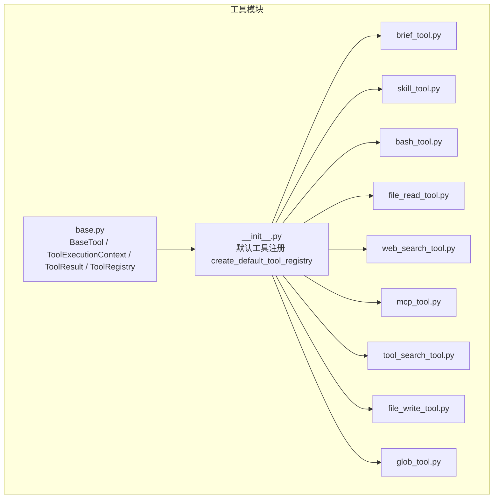
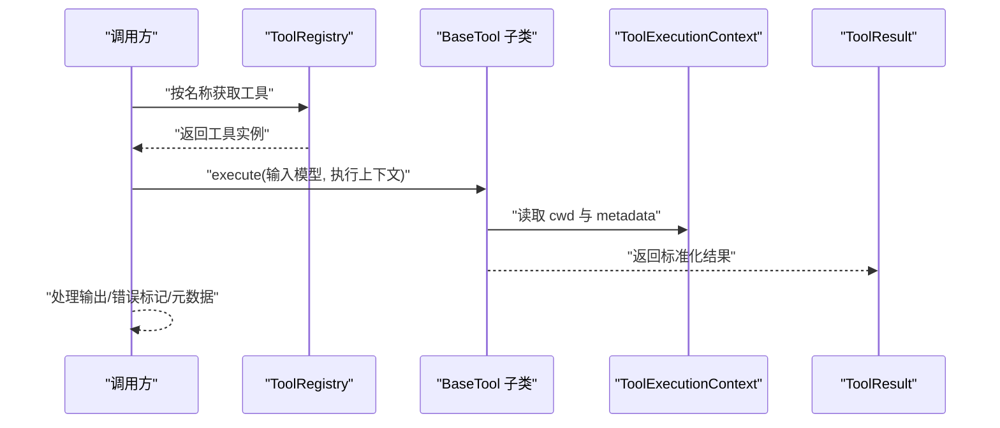
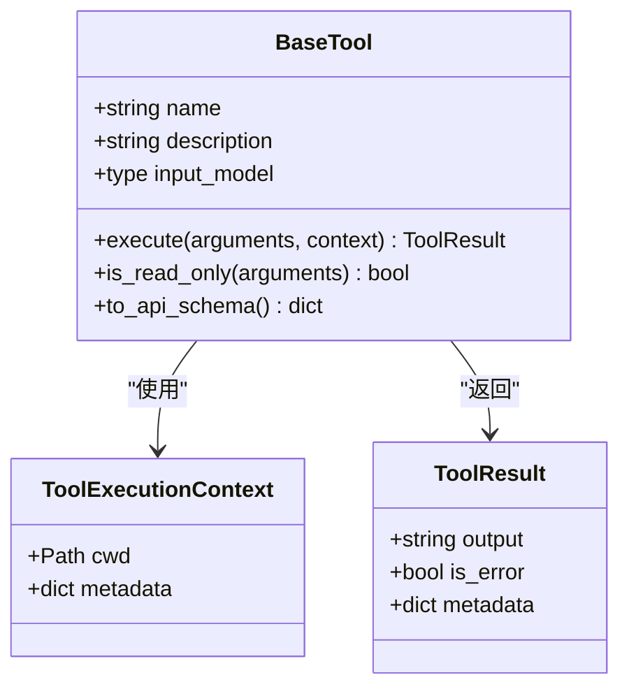
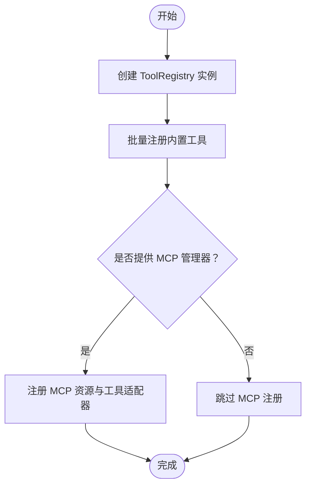
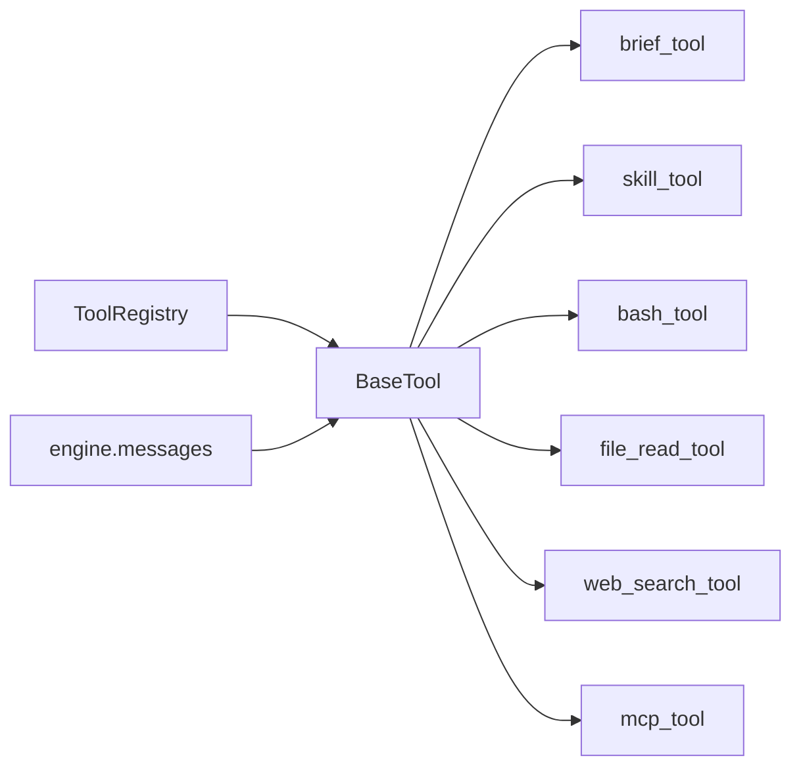

# 工具架构设计

<cite>
**本文引用的文件**
- [src/openharness/tools/base.py](file://src/openharness/tools/base.py)
- [src/openharness/tools/__init__.py](file://src/openharness/tools/__init__.py)
- [src/openharness/tools/brief_tool.py](file://src/openharness/tools/brief_tool.py)
- [src/openharness/tools/skill_tool.py](file://src/openharness/tools/skill_tool.py)
- [src/openharness/tools/bash_tool.py](file://src/openharness/tools/bash_tool.py)
- [src/openharness/tools/file_read_tool.py](file://src/openharness/tools/file_read_tool.py)
- [src/openharness/tools/web_search_tool.py](file://src/openharness/tools/web_search_tool.py)
- [src/openharness/tools/mcp_tool.py](file://src/openharness/tools/mcp_tool.py)
- [src/openharness/tools/tool_search_tool.py](file://src/openharness/tools/tool_search_tool.py)
- [src/openharness/tools/file_write_tool.py](file://src/openharness/tools/file_write_tool.py)
- [src/openharness/tools/glob_tool.py](file://src/openharness/tools/glob_tool.py)
- [src/openharness/engine/messages.py](file://src/openharness/engine/messages.py)
- [tests/test_tools/test_core_tools.py](file://tests/test_tools/test_core_tools.py)
- [tests/test_mcp/test_stdio_flow.py](file://tests/test_mcp/test_stdio_flow.py)
- [tests/test_plugins/test_lifecycle_flow.py](file://tests/test_plugins/test_lifecycle_flow.py)
</cite>

## 目录
1. [简介](#简介)
2. [项目结构](#项目结构)
3. [核心组件](#核心组件)
4. [架构总览](#架构总览)
5. [详细组件分析](#详细组件分析)
6. [依赖分析](#依赖分析)
7. [性能考量](#性能考量)
8. [故障排查指南](#故障排查指南)
9. [结论](#结论)
10. [附录：自定义工具开发指南](#附录自定义工具开发指南)

## 简介
本文件系统性阐述 OpenHarness 的工具架构设计，重点围绕以下主题：
- BaseTool 抽象基类的设计理念与职责边界
- 工具接口定义（输入模型）、执行上下文与结果标准化
- ToolRegistry 注册表机制：注册、查找与 API 模式生成
- ToolExecutionContext 执行上下文的作用与 ToolResult 标准化结果的设计考虑
- 工具的 JSON Schema 自动生成机制与 Anthropic API 兼容性
- 工具开发基础架构指南与最佳实践，并给出可直接参考的代码示例路径

## 项目结构
OpenHarness 将“工具”作为可插拔能力单元，统一通过 BaseTool 抽象层进行封装，并由 ToolRegistry 进行集中管理。默认工具集合在工具包初始化中批量注册，同时支持动态扩展（如 MCP 工具适配器）。

图表来源
- [src/openharness/tools/base.py:1-76](file://src/openharness/tools/base.py#L1-L76)
- [src/openharness/tools/__init__.py:45-92](file://src/openharness/tools/__init__.py#L45-L92)

章节来源
- [src/openharness/tools/base.py:1-76](file://src/openharness/tools/base.py#L1-L76)
- [src/openharness/tools/__init__.py:1-102](file://src/openharness/tools/__init__.py#L1-L102)

## 核心组件
- BaseTool：所有工具的抽象基类，定义统一的名称、描述、输入模型以及异步执行接口；提供只读判定与 Anthropic API 兼容的 JSON Schema 生成。
- ToolExecutionContext：跨调用共享的执行上下文，包含工作目录与任意元数据字典。
- ToolResult：标准化的结果载体，包含输出文本、错误标记与附加元数据。
- ToolRegistry：工具注册表，负责工具实例的注册、查询、列举与 API 模式导出。

章节来源
- [src/openharness/tools/base.py:30-76](file://src/openharness/tools/base.py#L30-L76)

## 架构总览
下图展示了工具生命周期的关键交互：调用方通过 ToolRegistry 获取工具实例，使用 Pydantic 输入模型校验参数，传入 ToolExecutionContext 后调用 BaseTool.execute，最终返回 ToolResult。同时，BaseTool 提供 to_api_schema 将工具信息转换为 Anthropic Messages API 所需格式。

图表来源
- [src/openharness/tools/base.py:30-76](file://src/openharness/tools/base.py#L30-L76)
- [src/openharness/tools/__init__.py:45-92](file://src/openharness/tools/__init__.py#L45-L92)

## 详细组件分析

### BaseTool 抽象基类与工具接口
- 统一接口
  - name/description/input_model：工具标识、描述与输入模型类型
  - execute(arguments, context) -> ToolResult：异步执行入口
  - is_read_only(arguments) -> bool：可选的只读判定，默认返回 False
  - to_api_schema() -> dict：生成 Anthropic Messages API 兼容的工具描述
- 输入模型与校验
  - 使用 Pydantic BaseModel 定义输入字段与约束，自动获得 model_json_schema 输出
- 结果标准化
  - ToolResult 包含 output、is_error、metadata，便于上层统一处理

图表来源
- [src/openharness/tools/base.py:13-52](file://src/openharness/tools/base.py#L13-L52)

章节来源
- [src/openharness/tools/base.py:30-52](file://src/openharness/tools/base.py#L30-L52)

### ToolRegistry 注册表机制
- 职责
  - register(tool): 将工具实例以 name 为键注册
  - get(name): 按名称检索工具
  - list_tools(): 返回所有已注册工具列表
  - to_api_schema(): 逐个调用工具的 to_api_schema，汇总为 API 模式数组
- 默认注册流程
  - create_default_tool_registry 在工具包初始化时批量注册内置工具
  - 若提供 MCP 管理器，会动态注册 MCP 资源与工具适配器

图表来源
- [src/openharness/tools/__init__.py:45-92](file://src/openharness/tools/__init__.py#L45-L92)

章节来源
- [src/openharness/tools/base.py:55-76](file://src/openharness/tools/base.py#L55-L76)
- [src/openharness/tools/__init__.py:45-92](file://src/openharness/tools/__init__.py#L45-L92)

### ToolExecutionContext 执行上下文
- 作用
  - 提供统一的工作目录 cwd，确保工具在正确的根路径下运行
  - 提供 metadata 字典，用于传递额外上下文（例如工具注册表、用户回调等）
- 典型用途
  - 文件类工具解析相对路径
  - 交互式工具（如 AskUserQuestion）通过 metadata 获取回调函数

章节来源
- [src/openharness/tools/base.py:13-28](file://src/openharness/tools/base.py#L13-L28)
- [src/openharness/tools/tool_search_tool.py:27-38](file://src/openharness/tools/tool_search_tool.py#L27-L38)
- [tests/test_tools/test_integration_flows.py:184-203](file://tests/test_tools/test_integration_flows.py#L184-L203)

### ToolResult 标准化结果
- 设计考虑
  - output：统一的文本输出，便于渲染与日志记录
  - is_error：布尔标记，便于上层快速判断失败
  - metadata：承载额外信息（如命令返回码、统计信息等），避免破坏输出格式
- 典型场景
  - 命令行工具：返回 stdout/stderr 拼接文本，并在非零退出码时设置 is_error
  - 文本处理工具：返回处理后的字符串或截断提示

章节来源
- [src/openharness/tools/base.py:21-28](file://src/openharness/tools/base.py#L21-L28)
- [src/openharness/tools/bash_tool.py:65-69](file://src/openharness/tools/bash_tool.py#L65-L69)

### JSON Schema 自动生成与 Anthropic API 兼容
- 自动生成
  - BaseTool.to_api_schema 直接使用 input_model.model_json_schema() 生成输入模式
- 兼容性
  - 输出字段包含 name、description、input_schema，符合 Anthropic Messages API 的工具声明规范
- 验证与使用
  - 测试中验证了工具注册表导出的 API 模式与 MCP 工具适配器的输入模型生成逻辑

章节来源
- [src/openharness/tools/base.py:46-52](file://src/openharness/tools/base.py#L46-L52)
- [src/openharness/tools/mcp_tool.py:36-46](file://src/openharness/tools/mcp_tool.py#L36-L46)
- [tests/test_mcp/test_stdio_flow.py:39-52](file://tests/test_mcp/test_stdio_flow.py#L39-L52)

### 典型工具实现与行为特征
- 只读工具
  - brief_tool：短文本摘要，is_read_only 返回 True
  - skill_tool：读取技能内容，is_read_only 返回 True
  - file_read_tool：读取文件内容，is_read_only 返回 True
  - glob_tool：文件系统枚举，is_read_only 返回 True
  - tool_search_tool：查询可用工具列表，is_read_only 返回 True
- 有副作用工具
  - bash_tool：执行系统命令，可能产生错误并设置 is_error
  - file_write_tool：写入文件
  - web_search_tool：网络请求，可能失败并设置 is_error
- 交互式工具
  - agent_tool：创建本地/远程代理任务，支持团队关联
- MCP 工具适配
  - mcp_tool：将外部 MCP 工具桥接为 OpenHarness 工具，动态生成输入模型

章节来源
- [src/openharness/tools/brief_tool.py:24-33](file://src/openharness/tools/brief_tool.py#L24-L33)
- [src/openharness/tools/skill_tool.py:24-33](file://src/openharness/tools/skill_tool.py#L24-L33)
- [src/openharness/tools/file_read_tool.py:27-55](file://src/openharness/tools/file_read_tool.py#L27-L55)
- [src/openharness/tools/glob_tool.py:27-39](file://src/openharness/tools/glob_tool.py#L27-L39)
- [src/openharness/tools/tool_search_tool.py:23-38](file://src/openharness/tools/tool_search_tool.py#L23-L38)
- [src/openharness/tools/bash_tool.py:28-69](file://src/openharness/tools/bash_tool.py#L28-L69)
- [src/openharness/tools/file_write_tool.py:27-36](file://src/openharness/tools/file_write_tool.py#L27-L36)
- [src/openharness/tools/web_search_tool.py:37-65](file://src/openharness/tools/web_search_tool.py#L37-L65)
- [src/openharness/tools/mcp_tool.py:14-33](file://src/openharness/tools/mcp_tool.py#L14-L33)

## 依赖分析
- 组件耦合
  - 工具实现依赖 BaseTool 抽象，确保统一的接口与结果格式
  - ToolRegistry 仅持有 BaseTool 实例，保持低耦合
  - MCP 适配器通过动态输入模型生成与外部服务通信，不改变工具层契约
- 外部集成点
  - Anthropic API 兼容：通过 BaseTool.to_api_schema 输出标准模式
  - 引擎消息序列化：引擎侧将 ToolResult 序列化为 API 参数格式

图表来源
- [src/openharness/tools/base.py:30-76](file://src/openharness/tools/base.py#L30-L76)
- [src/openharness/engine/messages.py:62-88](file://src/openharness/engine/messages.py#L62-L88)

章节来源
- [src/openharness/tools/base.py:30-76](file://src/openharness/tools/base.py#L30-L76)
- [src/openharness/engine/messages.py:62-88](file://src/openharness/engine/messages.py#L62-L88)

## 性能考量
- I/O 限制
  - 文件读写与网络请求是主要瓶颈，建议合理设置超时与输出截断
- 并发与资源
  - 异步执行提升吞吐，但需注意外部进程与网络请求的并发上限
- 结果截断
  - 对长输出进行截断与摘要，避免传输与渲染开销过大

## 故障排查指南
- 常见问题定位
  - 工具未注册：检查 ToolRegistry 是否包含目标工具名
  - 输入校验失败：确认 Pydantic 输入模型字段与取值范围
  - 上下文缺失：当工具需要 registry 或回调时，确保 ToolExecutionContext.metadata 正确填充
- 典型错误场景
  - 文件不存在或不可读：返回 is_error=True 并携带明确错误信息
  - 命令超时或非零退出码：设置 is_error=True 并记录返回码
  - 网络异常：捕获 HTTP 错误并返回可诊断的错误信息
- 参考测试
  - 文件读写与编辑链路、Glob/Grep、Bash 执行、技能读取、笔记本编辑、LSP 查询、工作树操作、Cron 与远程触发等

章节来源
- [tests/test_tools/test_core_tools.py:34-248](file://tests/test_tools/test_core_tools.py#L34-L248)
- [tests/test_mcp/test_stdio_flow.py:39-52](file://tests/test_mcp/test_stdio_flow.py#L39-L52)
- [tests/test_plugins/test_lifecycle_flow.py:75-93](file://tests/test_plugins/test_lifecycle_flow.py#L75-L93)

## 结论
OpenHarness 的工具架构以 BaseTool 为核心抽象，结合 ToolExecutionContext 与 ToolResult 实现了统一的工具接口、执行上下文与结果标准化。ToolRegistry 提供了灵活的注册与发现机制，并通过 to_api_schema 无缝对接 Anthropic API。内置工具覆盖文件系统、网络搜索、命令执行、技能与交互等场景，MCP 适配器进一步扩展了外部工具生态。整体设计具备良好的可扩展性与可维护性。

## 附录：自定义工具开发指南
- 继承关系与抽象方法实现
  - 新建子类并实现 execute(arguments, context) -> ToolResult
  - 定义输入模型（Pydantic BaseModel），并在类属性中赋值给 input_model
  - 如为只读操作，重写 is_read_only 返回 True
- 最佳实践
  - 明确定义输入字段与约束，确保 model_json_schema 能正确生成
  - 在 ToolExecutionContext 中解析相对路径，保证可移植性
  - 对外部调用设置合理超时与错误处理，必要时在 metadata 中传递回调
  - 对长输出进行截断或摘要，避免影响用户体验
- 示例参考（请参阅对应文件路径）
  - 基础只读工具：[brief_tool.py:17-33](file://src/openharness/tools/brief_tool.py#L17-L33)
  - 技能读取工具：[skill_tool.py:17-33](file://src/openharness/tools/skill_tool.py#L17-L33)
  - 文件读取工具：[file_read_tool.py:20-55](file://src/openharness/tools/file_read_tool.py#L20-L55)
  - 命令执行工具：[bash_tool.py:21-69](file://src/openharness/tools/bash_tool.py#L21-L69)
  - 文件写入工具：[file_write_tool.py:20-36](file://src/openharness/tools/file_write_tool.py#L20-L36)
  - 网络搜索工具：[web_search_tool.py:26-65](file://src/openharness/tools/web_search_tool.py#L26-L65)
  - MCP 适配器：[mcp_tool.py:14-33](file://src/openharness/tools/mcp_tool.py#L14-L33)
  - 工具搜索工具：[tool_search_tool.py:16-38](file://src/openharness/tools/tool_search_tool.py#L16-L38)
  - 默认注册流程：[__init__.py:45-92](file://src/openharness/tools/__init__.py#L45-L92)