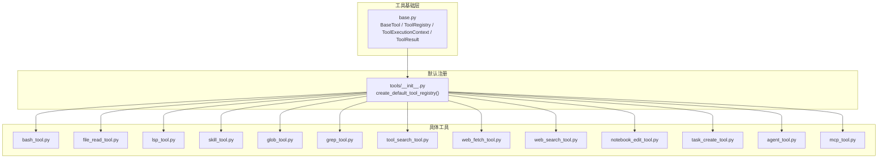
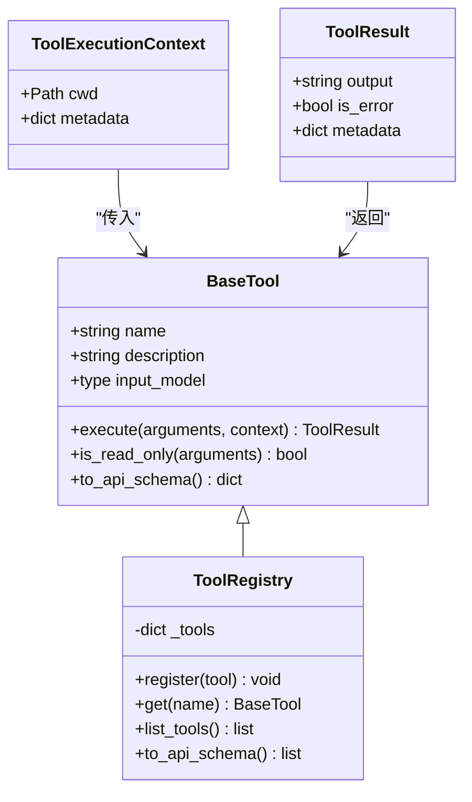
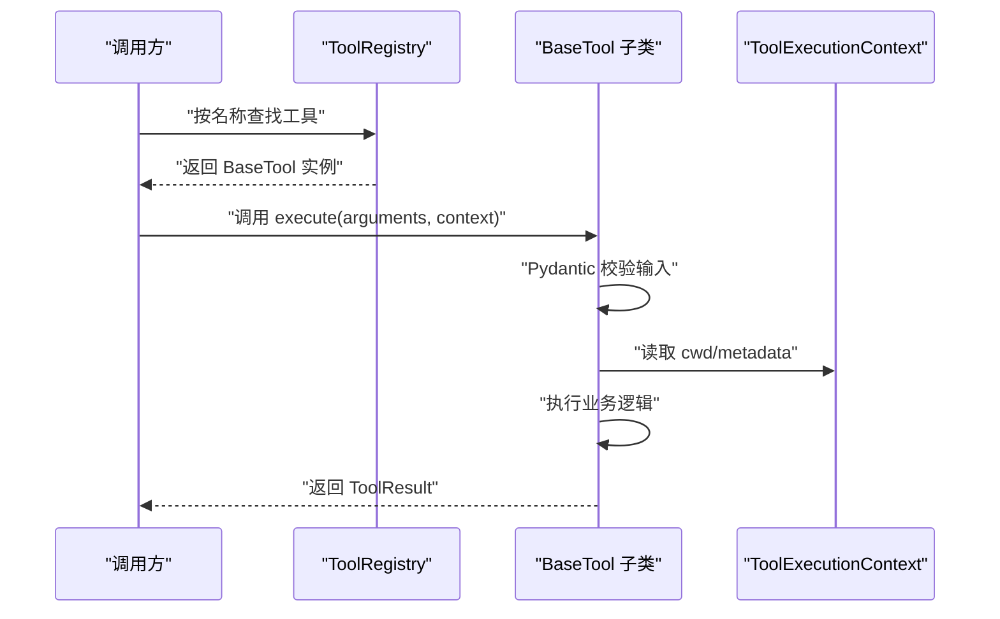
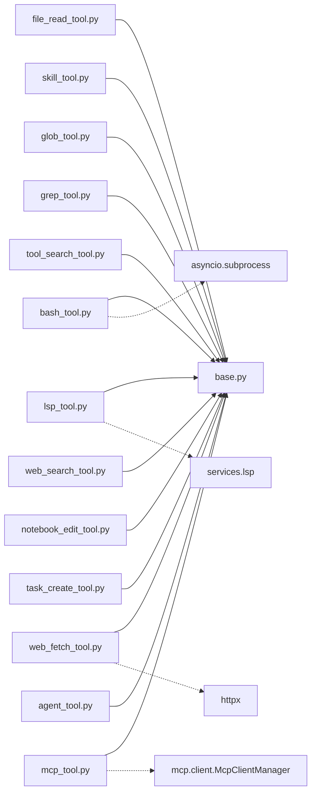

# 工具系统

<cite>
**本文引用的文件**
- [tools/__init__.py](file://src/openharness/tools/__init__.py)
- [tools/base.py](file://src/openharness/tools/base.py)
- [tools/mcp_tool.py](file://src/openharness/tools/mcp_tool.py)
- [tools/bash_tool.py](file://src/openharness/tools/bash_tool.py)
- [tools/file_read_tool.py](file://src/openharness/tools/file_read_tool.py)
- [tools/web_search_tool.py](file://src/openharness/tools/web_search_tool.py)
- [tools/skill_tool.py](file://src/openharness/tools/skill_tool.py)
- [tools/lsp_tool.py](file://src/openharness/tools/lsp_tool.py)
- [tools/glob_tool.py](file://src/openharness/tools/glob_tool.py)
- [tools/grep_tool.py](file://src/openharness/tools/grep_tool.py)
- [tools/tool_search_tool.py](file://src/openharness/tools/tool_search_tool.py)
- [tools/web_fetch_tool.py](file://src/openharness/tools/web_fetch_tool.py)
- [tools/notebook_edit_tool.py](file://src/openharness/tools/notebook_edit_tool.py)
- [tools/task_create_tool.py](file://src/openharness/tools/task_create_tool.py)
- [tools/agent_tool.py](file://src/openharness/tools/agent_tool.py)
</cite>

## 目录
1. [简介](#简介)
2. [项目结构](#项目结构)
3. [核心组件](#核心组件)
4. [架构总览](#架构总览)
5. [详细组件分析](#详细组件分析)
6. [依赖分析](#依赖分析)
7. [性能考虑](#性能考虑)
8. [故障排查指南](#故障排查指南)
9. [结论](#结论)
10. [附录：工具清单与使用要点](#附录工具清单与使用要点)

## 简介
本文件系统性阐述 OpenHarness 的工具系统，围绕以下主题展开：
- 设计理念：BaseTool 抽象基类、工具注册表与输入验证机制
- 生命周期：从注册到执行的完整流程
- 分类体系：文件操作、搜索、代理协作、任务管理、MCP 集成等
- 开发最佳实践：输入模型设计、权限集成与钩子支持
- 自描述能力：JSON Schema 自动生成与 API 兼容
- 工具清单：覆盖 43+ 工具的分类说明与使用要点

## 项目结构
工具系统位于 src/openharness/tools 目录，采用“按功能模块化”的组织方式：
- 基础抽象：base.py 定义 BaseTool、ToolRegistry、ToolExecutionContext、ToolResult
- 默认注册：tools/__init__.py 提供 create_default_tool_registry，集中注册内置工具，并可选接入 MCP 工具
- 具体工具：每个工具独立文件，遵循统一的命名规范（如 *_tool.py），均继承 BaseTool 并实现 execute

图表来源
- [tools/base.py:1-76](file://src/openharness/tools/base.py#L1-L76)
- [tools/__init__.py:45-92](file://src/openharness/tools/__init__.py#L45-L92)

章节来源
- [tools/__init__.py:1-102](file://src/openharness/tools/__init__.py#L1-L102)
- [tools/base.py:1-76](file://src/openharness/tools/base.py#L1-L76)

## 核心组件
- BaseTool：所有工具的抽象基类，要求实现 execute；提供 is_read_only 与 to_api_schema 能力
- ToolExecutionContext：跨调用共享上下文，包含工作目录与元数据字典
- ToolResult：标准化返回值，包含输出文本、错误标记与元数据
- ToolRegistry：工具名称到实例的映射，提供注册、查询、枚举与 API Schema 导出

图表来源
- [tools/base.py:13-76](file://src/openharness/tools/base.py#L13-L76)

章节来源
- [tools/base.py:13-76](file://src/openharness/tools/base.py#L13-L76)

## 架构总览
工具系统通过“注册表驱动 + 统一抽象”的方式实现高内聚、低耦合：
- 注册阶段：create_default_tool_registry 将内置工具批量注册；若存在 MCP 管理器，则动态适配 MCP 工具
- 执行阶段：根据名称从注册表检索工具，使用 Pydantic 输入模型进行参数校验，再调用 execute
- 输出阶段：统一包装为 ToolResult，便于上层处理与展示

图表来源
- [tools/base.py:30-76](file://src/openharness/tools/base.py#L30-L76)
- [tools/__init__.py:45-92](file://src/openharness/tools/__init__.py#L45-L92)

章节来源
- [tools/__init__.py:45-92](file://src/openharness/tools/__init__.py#L45-L92)
- [tools/base.py:30-76](file://src/openharness/tools/base.py#L30-L76)

## 详细组件分析

### 基础抽象与注册表
- BaseTool.execute 为异步接口，确保 IO 密集型工具（网络、文件、进程）具备良好并发表现
- is_read_only 默认返回 False，允许只读工具覆写以启用安全策略或优化
- to_api_schema 基于 Pydantic 模型的 model_json_schema 自动生成 Anthropic Messages API 兼容的输入模式
- ToolRegistry 提供线程安全的工具注册与查询，to_api_schema 支持导出全部工具的 API 描述

章节来源
- [tools/base.py:30-76](file://src/openharness/tools/base.py#L30-L76)

### Shell 命令执行（BashTool）
- 输入模型包含命令、工作目录覆盖与超时秒数
- 异步子进程执行，捕获标准输出与错误输出，支持超时与截断
- 返回码作为 is_error 的依据，metadata 中携带 returncode

章节来源
- [tools/bash_tool.py:13-70](file://src/openharness/tools/bash_tool.py#L13-L70)

### 文件读取（FileReadTool）
- 输入模型包含路径、起始行偏移与行数限制
- 解析相对路径至绝对路径，检测二进制内容并拒绝读取
- 输出带行号的文本片段，只读工具

章节来源
- [tools/file_read_tool.py:12-63](file://src/openharness/tools/file_read_tool.py#L12-L63)

### 代码智能（LspTool）
- 输入模型定义多种操作：符号列表、工作区符号、跳转定义、引用定位、悬停信息
- 运行时校验参数组合，确保必要字段齐全
- 仅支持 Python 文件，输出格式化位置与签名/文档信息

章节来源
- [tools/lsp_tool.py:20-155](file://src/openharness/tools/lsp_tool.py#L20-L155)

### 技能读取（SkillTool）
- 通过技能注册表按名称检索内容，支持大小写变体匹配
- 只读工具，用于向代理提供预置提示或知识

章节来源
- [tools/skill_tool.py:11-34](file://src/openharness/tools/skill_tool.py#L11-L34)

### 文件系统扫描（GlobTool）
- 输入模型包含通配符模式、可选根目录与结果上限
- 相对路径解析至工作目录，输出相对根目录的匹配项

章节来源
- [tools/glob_tool.py:12-47](file://src/openharness/tools/glob_tool.py#L12-L47)

### 内容搜索（GrepTool）
- 输入模型包含正则表达式、搜索根目录、文件通配、大小写敏感与结果上限
- 遍历匹配文件，逐行匹配并输出“文件:行号:内容”格式

章节来源
- [tools/grep_tool.py:13-68](file://src/openharness/tools/grep_tool.py#L13-L68)

### 工具检索（ToolSearchTool）
- 在 ToolExecutionContext.metadata 中读取工具注册表，按名称或描述进行子串匹配
- 输出“名称: 描述”的列表

章节来源
- [tools/tool_search_tool.py:10-39](file://src/openharness/tools/tool_search_tool.py#L10-L39)

### 网页抓取（WebFetchTool）
- 输入模型包含 URL 与最大字符数
- 自动识别 HTML 并转换为纯文本，截断过长内容，输出响应头信息与正文

章节来源
- [tools/web_fetch_tool.py:13-62](file://src/openharness/tools/web_fetch_tool.py#L13-L62)

### 网络搜索（WebSearchTool）
- 输入模型包含查询词、最大结果数与可选搜索端点
- 使用 DuckDuckGo HTML 接口抓取并解析标题、URL 与摘要

章节来源
- [tools/web_search_tool.py:15-118](file://src/openharness/tools/web_search_tool.py#L15-L118)

### Jupyter 笔记本编辑（NotebookEditTool）
- 输入模型包含路径、单元索引、新源码、单元类型、追加/替换模式与缺失即建
- 支持创建空笔记本与规范化源码格式

章节来源
- [tools/notebook_edit_tool.py:14-98](file://src/openharness/tools/notebook_edit_tool.py#L14-L98)

### 任务创建（TaskCreateTool）
- 输入模型包含任务类型（本地 Shell 或本地代理）、描述、命令或提示、模型
- 根据类型创建对应任务，返回任务 ID 与类型

章节来源
- [tools/task_create_tool.py:13-57](file://src/openharness/tools/task_create_tool.py#L13-L57)

### 代理工具（AgentTool）
- 输入模型包含描述、提示、模型、模式（本地/远程/同进程队友）、团队绑定与可选启动命令
- 校验模式合法性，创建代理任务并可加入团队

章节来源
- [tools/agent_tool.py:14-56](file://src/openharness/tools/agent_tool.py#L14-L56)

### MCP 工具适配（McpToolAdapter）
- 将外部 MCP 服务器提供的工具暴露为 OpenHarness 工具
- 动态生成输入模型（基于 JSON Schema），名称规范化，执行时转发到 MCP 管理器

章节来源
- [tools/mcp_tool.py:14-56](file://src/openharness/tools/mcp_tool.py#L14-L56)

## 依赖分析
- 工具间无直接循环依赖：所有工具仅依赖基础抽象与少量服务模块
- 与外部系统的集成点：
  - 网络：httpx 用于网页抓取与搜索
  - 进程：asyncio.subprocess 用于 Shell 命令执行
  - LSP：通过服务层封装 Python 代码智能能力
  - MCP：通过客户端管理器桥接外部工具

图表来源
- [tools/bash_tool.py:28-70](file://src/openharness/tools/bash_tool.py#L28-L70)
- [tools/web_fetch_tool.py:27-62](file://src/openharness/tools/web_fetch_tool.py#L27-L62)
- [tools/lsp_tool.py:65-155](file://src/openharness/tools/lsp_tool.py#L65-L155)
- [tools/mcp_tool.py:26-33](file://src/openharness/tools/mcp_tool.py#L26-L33)

章节来源
- [tools/bash_tool.py:28-70](file://src/openharness/tools/bash_tool.py#L28-L70)
- [tools/web_fetch_tool.py:27-62](file://src/openharness/tools/web_fetch_tool.py#L27-L62)
- [tools/lsp_tool.py:65-155](file://src/openharness/tools/lsp_tool.py#L65-L155)
- [tools/mcp_tool.py:26-33](file://src/openharness/tools/mcp_tool.py#L26-L33)

## 性能考虑
- IO 并发：Shell 命令与网络请求采用异步，避免阻塞事件循环
- 结果截断：对长输出进行截断，防止消息长度超限
- 限制参数：文件扫描与搜索提供上限参数，避免资源耗尽
- 只读优先：标记只读工具有助于启用缓存与安全策略

## 故障排查指南
- 输入校验失败：检查 Pydantic 字段约束与必填项
- 超时与错误码：关注 BashTool 的超时与 returncode
- 路径解析问题：确认相对路径是否正确解析到 cwd
- 网络异常：WebFetchTool/WebSearchTool 对 HTTP 错误进行统一处理
- MCP 工具不可用：确认 MCP 管理器状态与工具可用性

章节来源
- [tools/bash_tool.py:44-70](file://src/openharness/tools/bash_tool.py#L44-L70)
- [tools/web_fetch_tool.py:33-50](file://src/openharness/tools/web_fetch_tool.py#L33-L50)
- [tools/web_search_tool.py:52-65](file://src/openharness/tools/web_search_tool.py#L52-L65)
- [tools/mcp_tool.py:26-33](file://src/openharness/tools/mcp_tool.py#L26-L33)

## 结论
OpenHarness 工具系统以清晰的抽象与注册机制为核心，结合 Pydantic 输入校验与统一结果封装，实现了高可扩展与可维护的工具生态。通过内置工具与 MCP 适配器，系统既能满足本地开发场景，又能灵活接入外部能力。

## 附录：工具清单与使用要点
- 文件操作
  - read_file：只读读取文本文件，支持行范围与二进制检测
  - glob：通配符匹配文件，支持根目录与上限
  - grep：正则搜索文件内容，支持大小写与上限
  - notebook_edit：编辑 Jupyter 单元，支持创建与追加
- 搜索
  - tool_search：在工具注册表中按名称/描述检索
  - web_search：网络搜索，返回标题、URL 与摘要
  - web_fetch：抓取单页并提取可读文本
- 代理协作
  - agent：创建本地/远程/同进程代理任务，可选绑定团队
  - skill：读取技能内容
- 任务管理
  - task_create：创建本地 Shell 或本地代理任务
- MCP 集成
  - mcp__{server}__{tool}：动态适配 MCP 工具，名称规范化

章节来源
- [tools/file_read_tool.py:20-63](file://src/openharness/tools/file_read_tool.py#L20-L63)
- [tools/glob_tool.py:20-47](file://src/openharness/tools/glob_tool.py#L20-L47)
- [tools/grep_tool.py:23-68](file://src/openharness/tools/grep_tool.py#L23-L68)
- [tools/notebook_edit_tool.py:25-98](file://src/openharness/tools/notebook_edit_tool.py#L25-L98)
- [tools/tool_search_tool.py:16-39](file://src/openharness/tools/tool_search_tool.py#L16-L39)
- [tools/web_search_tool.py:26-118](file://src/openharness/tools/web_search_tool.py#L26-L118)
- [tools/web_fetch_tool.py:20-62](file://src/openharness/tools/web_fetch_tool.py#L20-L62)
- [tools/agent_tool.py:28-56](file://src/openharness/tools/agent_tool.py#L28-L56)
- [tools/skill_tool.py:17-34](file://src/openharness/tools/skill_tool.py#L17-L34)
- [tools/task_create_tool.py:23-57](file://src/openharness/tools/task_create_tool.py#L23-L57)
- [tools/mcp_tool.py:14-56](file://src/openharness/tools/mcp_tool.py#L14-L56)