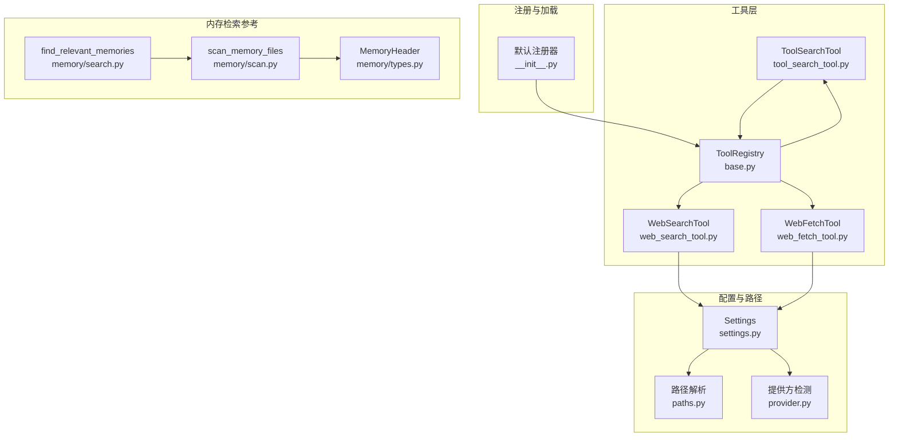
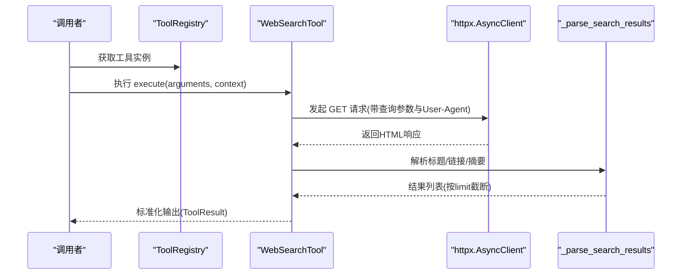
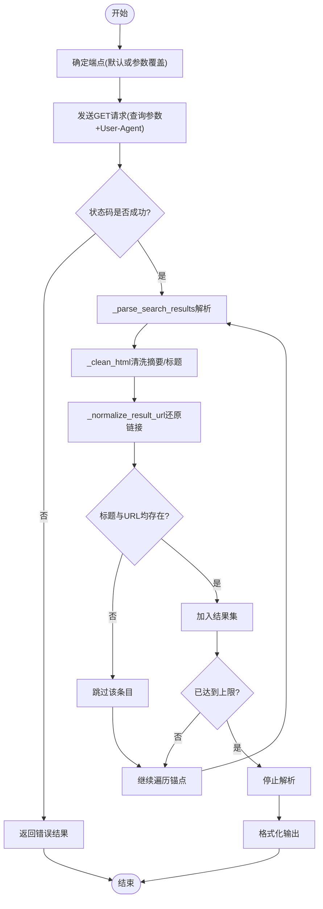
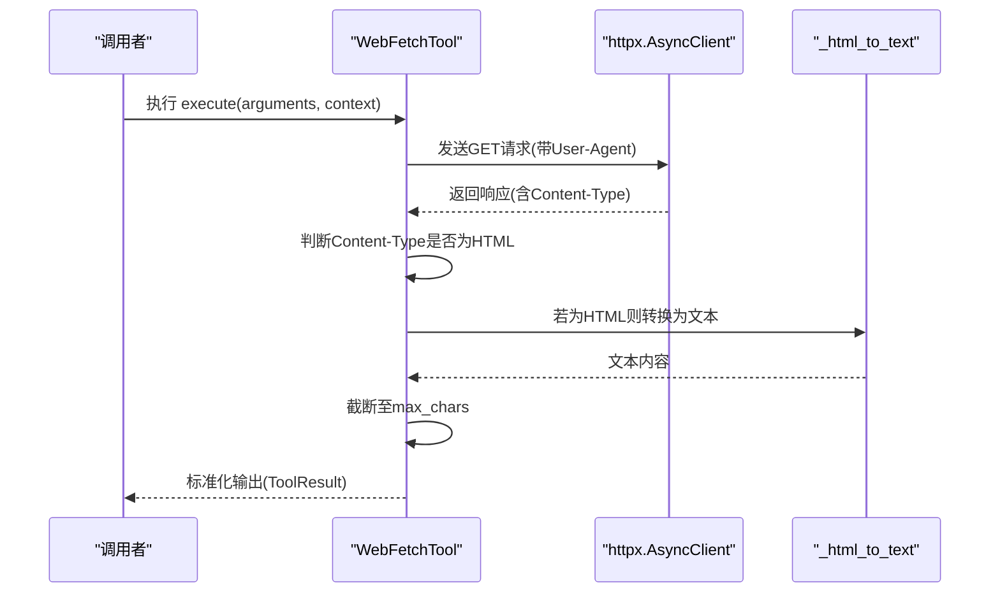
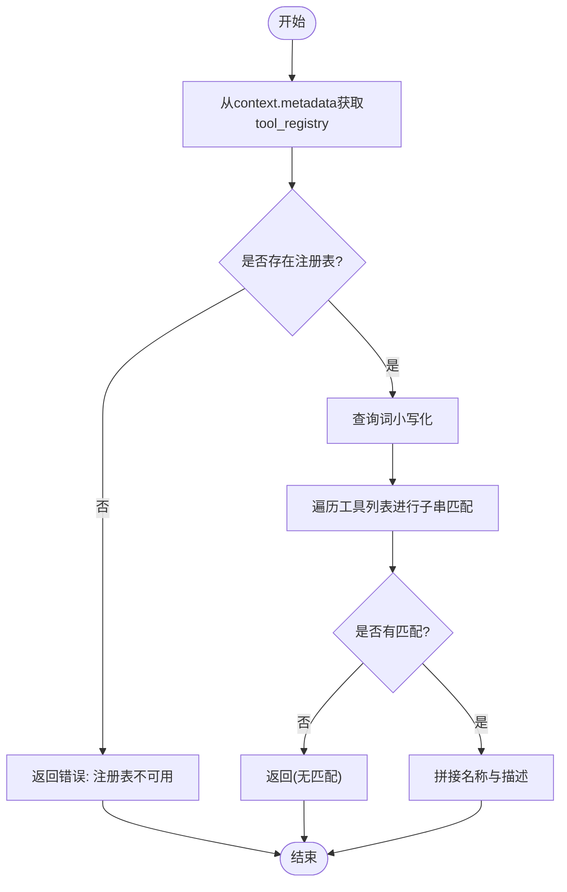
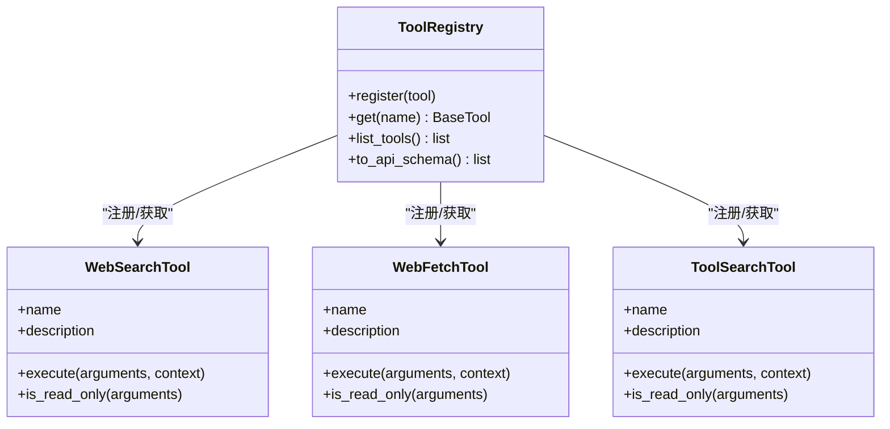
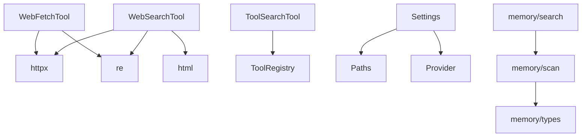

# 搜索工具

<cite>
**本文引用的文件**
- [web_search_tool.py](file://src/openharness/tools/web_search_tool.py)
- [web_fetch_tool.py](file://src/openharness/tools/web_fetch_tool.py)
- [tool_search_tool.py](file://src/openharness/tools/tool_search_tool.py)
- [base.py](file://src/openharness/tools/base.py)
- [__init__.py](file://src/openharness/tools/__init__.py)
- [settings.py](file://src/openharness/config/settings.py)
- [paths.py](file://src/openharness/config/paths.py)
- [provider.py](file://src/openharness/api/provider.py)
- [test_web_fetch_tool.py](file://tests/test_tools/test_web_fetch_tool.py)
- [search.py](file://src/openharness/memory/search.py)
- [scan.py](file://src/openharness/memory/scan.py)
- [types.py](file://src/openharness/memory/types.py)
</cite>

## 目录
1. [简介](#简介)
2. [项目结构](#项目结构)
3. [核心组件](#核心组件)
4. [架构总览](#架构总览)
5. [详细组件分析](#详细组件分析)
6. [依赖分析](#依赖分析)
7. [性能考虑](#性能考虑)
8. [故障排查指南](#故障排查指南)
9. [结论](#结论)
10. [附录](#附录)

## 简介
本文件面向 OpenHarness 的搜索工具链，系统化阐述以下能力与实现细节：
- Web 搜索工具：搜索引擎集成（默认 DuckDuckGo HTML）、搜索算法、结果排序与去重机制
- 网页抓取工具：HTTP 请求处理（请求头设置、重定向跟随、超时控制）、响应解析与内容提取
- 工具搜索工具：内部工具发现机制（工具元数据检索、相关性评分与结果过滤）
- 搜索结果标准化与缓存策略：输出格式统一、可扩展的缓存设计建议
- 配置选项、API 密钥设置与使用限制：环境变量、配置文件、运行时参数
- 实际使用场景与最佳实践：端到端工作流、测试与验证方法

## 项目结构
搜索工具位于工具模块中，围绕统一的工具抽象体系构建，并通过注册中心集中管理。配置与路径由配置模块提供，API 提供方检测用于识别认证方式。

**图表来源**
- [__init__.py:45-92](file://src/openharness/tools/__init__.py#L45-L92)
- [base.py:55-76](file://src/openharness/tools/base.py#L55-L76)
- [web_search_tool.py:26-65](file://src/openharness/tools/web_search_tool.py#L26-L65)
- [web_fetch_tool.py:20-50](file://src/openharness/tools/web_fetch_tool.py#L20-L50)
- [tool_search_tool.py:16-38](file://src/openharness/tools/tool_search_tool.py#L16-L38)
- [settings.py:49-96](file://src/openharness/config/settings.py#L49-L96)
- [paths.py:15-51](file://src/openharness/config/paths.py#L15-L51)
- [provider.py:20-65](file://src/openharness/api/provider.py#L20-L65)
- [search.py:12-30](file://src/openharness/memory/search.py#L12-L30)
- [scan.py:11-39](file://src/openharness/memory/scan.py#L11-L39)
- [types.py:9-16](file://src/openharness/memory/types.py#L9-L16)

**章节来源**
- [__init__.py:45-92](file://src/openharness/tools/__init__.py#L45-L92)
- [base.py:55-76](file://src/openharness/tools/base.py#L55-L76)

## 核心组件
- WebSearchTool：基于 HTML 搜索端点发起 GET 请求，解析返回页面中的标题、链接与摘要，按上限截断并标准化输出。
- WebFetchTool：抓取单个网页，自动识别 HTML 并转换为纯文本，支持最大字符数截断。
- ToolSearchTool：在工具注册表中进行名称与描述的子串匹配，返回匹配列表。
- ToolRegistry：工具注册与查询的核心容器，提供 API 规范导出与工具枚举。
- 默认注册器：集中注册内置工具，包括 WebSearchTool、WebFetchTool、ToolSearchTool 等。

**章节来源**
- [web_search_tool.py:26-65](file://src/openharness/tools/web_search_tool.py#L26-L65)
- [web_fetch_tool.py:20-50](file://src/openharness/tools/web_fetch_tool.py#L20-L50)
- [tool_search_tool.py:16-38](file://src/openharness/tools/tool_search_tool.py#L16-L38)
- [base.py:55-76](file://src/openharness/tools/base.py#L55-L76)
- [__init__.py:45-92](file://src/openharness/tools/__init__.py#L45-L92)

## 架构总览
下图展示工具调用与上下文传递的关键交互：

**图表来源**
- [web_search_tool.py:37-65](file://src/openharness/tools/web_search_tool.py#L37-L65)
- [web_search_tool.py:68-102](file://src/openharness/tools/web_search_tool.py#L68-L102)

## 详细组件分析

### WebSearchTool 组件分析
- 功能职责：执行 Web 搜索，返回标题、URL 与摘要的紧凑列表。
- 搜索引擎集成：默认使用 DuckDuckGo HTML 端点；支持通过参数覆盖自定义端点，便于私有后端或测试。
- 请求处理：异步客户端，启用重定向跟随与超时控制；设置 User-Agent 头以提升兼容性。
- 结果解析：
  - 使用正则匹配特定类名的摘要节点与结果链接节点；
  - 清洗 HTML 片段，去除标签与多余空白；
  - 对 DuckDuckGo 的跳转链接进行还原（从短链恢复目标 URL）。
- 排序与去重：
  - 依据页面中锚点出现顺序收集结果；
  - 去重逻辑：仅当标题与 URL 均存在才加入结果集，避免重复条目；
  - 截断：达到最大结果数量即停止。
- 输出标准化：统一格式化为“序号. 标题”、“URL: ...”、“摘要(可选)”的多行文本。

**图表来源**
- [web_search_tool.py:43-51](file://src/openharness/tools/web_search_tool.py#L43-L51)
- [web_search_tool.py:68-102](file://src/openharness/tools/web_search_tool.py#L68-L102)
- [web_search_tool.py:105-117](file://src/openharness/tools/web_search_tool.py#L105-L117)

**章节来源**
- [web_search_tool.py:26-65](file://src/openharness/tools/web_search_tool.py#L26-L65)
- [web_search_tool.py:68-117](file://src/openharness/tools/web_search_tool.py#L68-L117)

### WebFetchTool 组件分析
- 功能职责：抓取单个网页并返回简洁可读的文本摘要。
- 请求处理：异步客户端，启用重定向跟随与超时控制；设置 User-Agent 头。
- 内容提取：
  - 自动识别 HTML 类型，使用正则剔除脚本与样式块，再剥离标签；
  - 将多个空白字符归一化为空格，保留换行；
  - 支持最大字符数截断，超出部分追加省略标记。
- 输出标准化：包含 URL、状态码、内容类型以及清洗后的正文。

**图表来源**
- [web_fetch_tool.py:27-50](file://src/openharness/tools/web_fetch_tool.py#L27-L50)
- [web_fetch_tool.py:57-61](file://src/openharness/tools/web_fetch_tool.py#L57-L61)

**章节来源**
- [web_fetch_tool.py:20-50](file://src/openharness/tools/web_fetch_tool.py#L20-L50)
- [web_fetch_tool.py:57-61](file://src/openharness/tools/web_fetch_tool.py#L57-L61)

### ToolSearchTool 组件分析
- 功能职责：在工具注册表中按名称与描述进行子串匹配，返回匹配项列表。
- 上下文依赖：需要 ToolExecutionContext 中的工具注册表元数据。
- 匹配策略：大小写不敏感的子串匹配，优先返回可用匹配，否则提示无匹配。
- 过滤与排序：当前为线性过滤，未引入额外相关性评分；可扩展为基于词频或编辑距离的评分。

**图表来源**
- [tool_search_tool.py:27-38](file://src/openharness/tools/tool_search_tool.py#L27-L38)

**章节来源**
- [tool_search_tool.py:16-38](file://src/openharness/tools/tool_search_tool.py#L16-L38)

### 工具注册与发现机制
- 默认注册器：集中创建并注册内置工具，包括 WebSearchTool、WebFetchTool、ToolSearchTool 等。
- 注册表接口：提供注册、获取、列举与 API 规范导出能力，便于外部系统消费工具清单。

**图表来源**
- [base.py:55-76](file://src/openharness/tools/base.py#L55-L76)
- [__init__.py:45-92](file://src/openharness/tools/__init__.py#L45-L92)

**章节来源**
- [base.py:55-76](file://src/openharness/tools/base.py#L55-L76)
- [__init__.py:45-92](file://src/openharness/tools/__init__.py#L45-L92)

## 依赖分析
- 工具层依赖：
  - httpx：异步 HTTP 客户端，负责请求与响应。
  - re、html：正则与 HTML 实体解码，用于解析与清洗。
  - pydantic：模型定义与 JSON Schema 导出。
- 配置与路径依赖：
  - Settings：提供 API Key、模型等全局配置解析。
  - Paths：提供配置与数据目录解析，影响缓存与日志位置。
  - Provider：提供方检测，辅助判断认证方式与能力。
- 内存检索（参考）：
  - memory/search、memory/scan、memory/types：启发式检索与文件扫描，体现“相关性评分与排序”的通用模式，可借鉴到工具搜索与网页结果排序。

**图表来源**
- [web_search_tool.py:9-12](file://src/openharness/tools/web_search_tool.py#L9-L12)
- [web_fetch_tool.py:7-10](file://src/openharness/tools/web_fetch_tool.py#L7-L10)
- [tool_search_tool.py:7](file://src/openharness/tools/tool_search_tool.py#L7)
- [settings.py:49-96](file://src/openharness/config/settings.py#L49-L96)
- [paths.py:15-51](file://src/openharness/config/paths.py#L15-L51)
- [provider.py:20-65](file://src/openharness/api/provider.py#L20-L65)
- [search.py:12-30](file://src/openharness/memory/search.py#L12-L30)
- [scan.py:11-39](file://src/openharness/memory/scan.py#L11-L39)
- [types.py:9-16](file://src/openharness/memory/types.py#L9-L16)

**章节来源**
- [settings.py:49-96](file://src/openharness/config/settings.py#L49-L96)
- [paths.py:15-51](file://src/openharness/config/paths.py#L15-L51)
- [provider.py:20-65](file://src/openharness/api/provider.py#L20-L65)
- [search.py:12-30](file://src/openharness/memory/search.py#L12-L30)
- [scan.py:11-39](file://src/openharness/memory/scan.py#L11-L39)
- [types.py:9-16](file://src/openharness/memory/types.py#L9-L16)

## 性能考虑
- 异步 I/O：使用 httpx 异步客户端，减少阻塞，提高并发效率。
- 超时与重定向：合理设置超时与跟随重定向，平衡稳定性与性能。
- 正则解析：在中等规模 HTML 页面上具备较好性能；对超大页面建议分页或增量解析。
- 截断策略：对网页内容与搜索结果进行上限控制，避免输出膨胀。
- 缓存策略（建议）：可引入基于查询参数与时间戳的缓存键，结合数据目录存储结果快照，降低重复请求成本。

[本节为通用指导，无需具体文件来源]

## 故障排查指南
- WebSearchTool 失败：
  - 检查网络连通性与代理设置；
  - 确认端点可达且返回 2xx；
  - 查看异常消息中的 HTTP 错误详情。
- WebFetchTool 失败：
  - 检查 URL 是否有效；
  - 关注 Content-Type 与响应体长度；
  - 调整 max_chars 参数以适配长文本。
- ToolSearchTool 无匹配：
  - 确认 context.metadata 中包含有效的工具注册表；
  - 检查查询词大小写与子串匹配逻辑。
- 测试验证：
  - 单元测试通过本地 HTTP 服务器模拟响应，验证解析与输出格式。

**章节来源**
- [web_search_tool.py:52-53](file://src/openharness/tools/web_search_tool.py#L52-L53)
- [web_fetch_tool.py:33-34](file://src/openharness/tools/web_fetch_tool.py#L33-L34)
- [tool_search_tool.py:28-30](file://src/openharness/tools/tool_search_tool.py#L28-L30)
- [test_web_fetch_tool.py:41-87](file://tests/test_tools/test_web_fetch_tool.py#L41-L87)

## 结论
OpenHarness 的搜索工具链以统一的工具抽象为基础，提供了 Web 搜索、网页抓取与内部工具发现三大能力。WebSearchTool 采用简单可靠的正则解析与 URL 还原策略，WebFetchTool 提供 HTML 到文本的稳健转换，ToolSearchTool 则实现了基于注册表的快速发现。配合配置与路径模块，工具可在不同环境中稳定运行。未来可在工具搜索与网页结果排序中引入更精细的相关性评分与缓存机制，进一步提升性能与体验。

[本节为总结性内容，无需具体文件来源]

## 附录

### 配置选项与使用限制
- API 密钥与认证
  - 通过环境变量或配置文件设置 API Key，提供方检测用于识别认证方式。
- 运行时参数
  - WebSearchTool：查询词、最大结果数、可选搜索端点覆盖。
  - WebFetchTool：URL、最大字符数。
  - ToolSearchTool：查询词。
- 使用限制
  - 结果上限：WebSearchTool 的最大结果数受参数约束；
  - 字符截断：WebFetchTool 的输出长度受参数约束；
  - 超时与重定向：默认启用超时与重定向跟随，确保健壮性。

**章节来源**
- [settings.py:52-64](file://src/openharness/config/settings.py#L52-L64)
- [settings.py:76-91](file://src/openharness/config/settings.py#L76-L91)
- [web_search_tool.py:15-23](file://src/openharness/tools/web_search_tool.py#L15-L23)
- [web_fetch_tool.py:13-17](file://src/openharness/tools/web_fetch_tool.py#L13-L17)
- [tool_search_tool.py:10-13](file://src/openharness/tools/tool_search_tool.py#L10-L13)

### 实际使用场景与最佳实践
- 场景一：快速检索与摘要
  - 先用 WebSearchTool 获取候选链接，再用 WebFetchTool 抓取关键页面，最后进行内容摘要与整理。
- 场景二：工具发现与编排
  - 使用 ToolSearchTool 在工具注册表中查找可用工具，结合任务编排系统动态选择工具。
- 最佳实践
  - 明确端点覆盖与超时设置，避免长时间阻塞；
  - 合理设置最大结果数与字符截断，保证输出可控；
  - 在测试中使用本地 HTTP 服务器模拟响应，验证解析与格式化逻辑。

**章节来源**
- [test_web_fetch_tool.py:41-87](file://tests/test_tools/test_web_fetch_tool.py#L41-L87)
- [__init__.py:45-92](file://src/openharness/tools/__init__.py#L45-L92)