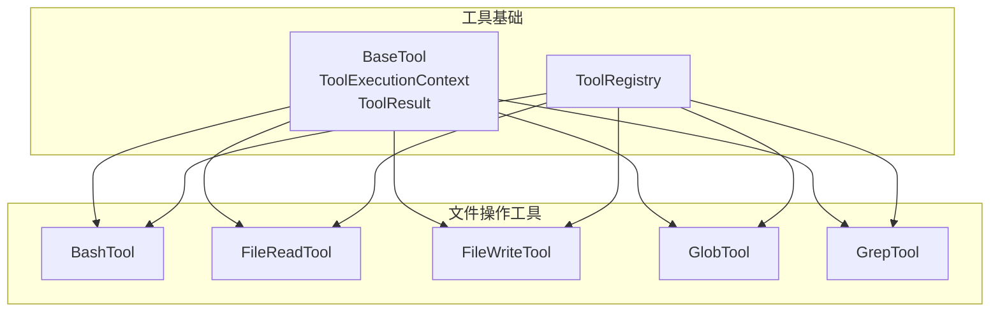
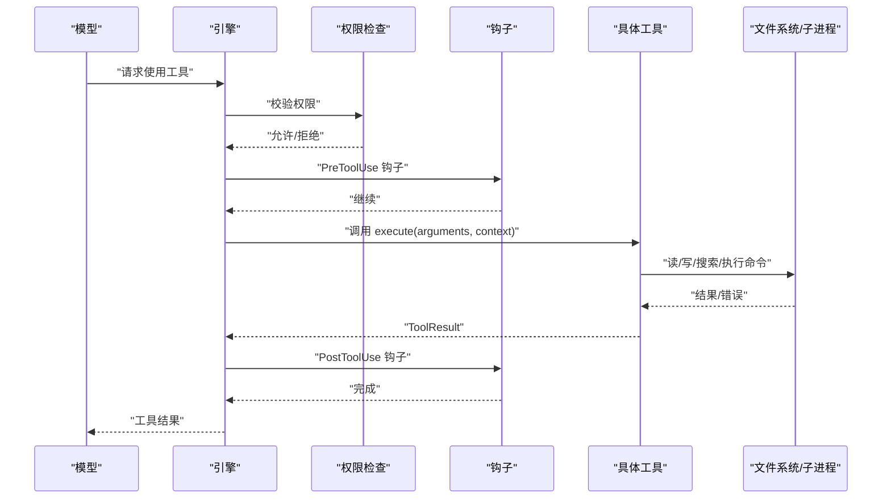
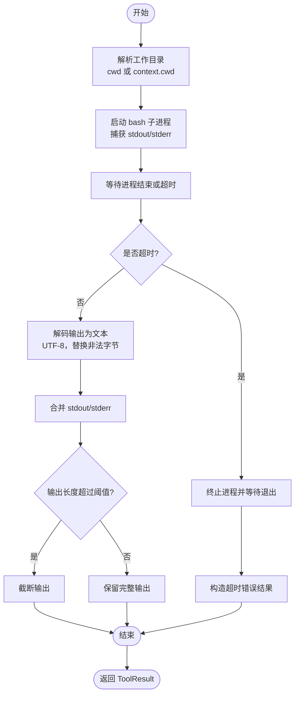
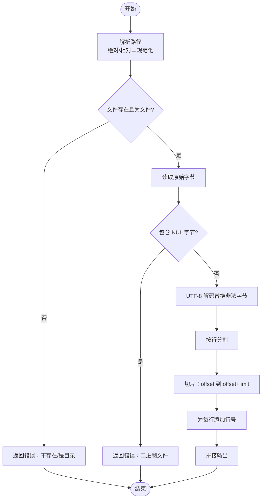
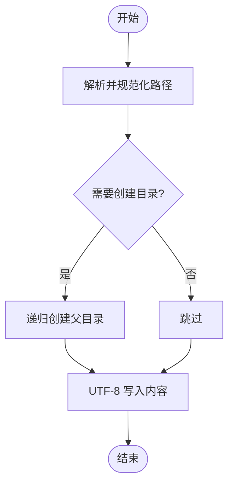
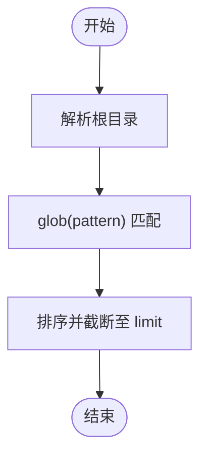
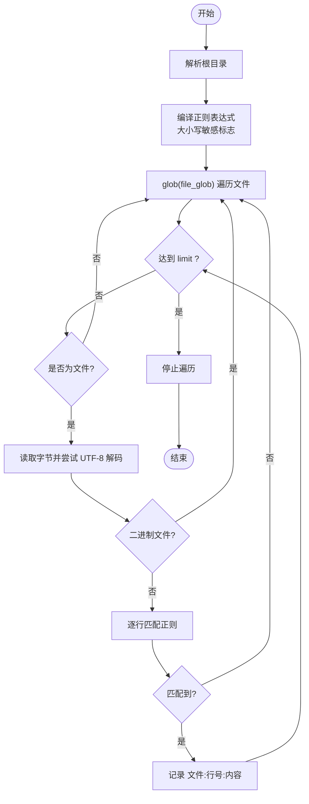
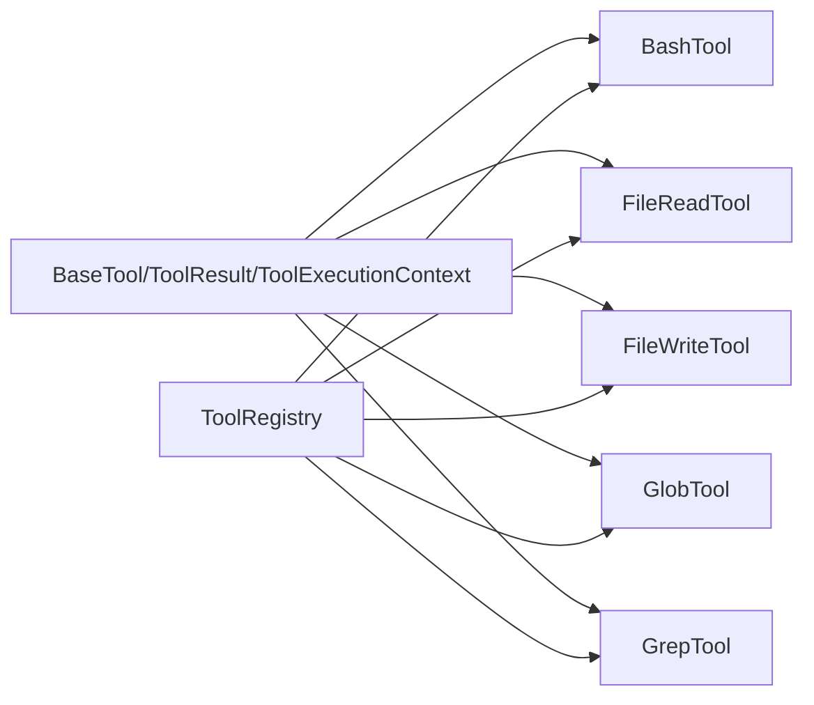

# 文件操作工具

<cite>
**本文引用的文件**
- [src/openharness/tools/base.py](file://src/openharness/tools/base.py)
- [src/openharness/tools/__init__.py](file://src/openharness/tools/__init__.py)
- [src/openharness/tools/bash_tool.py](file://src/openharness/tools/bash_tool.py)
- [src/openharness/tools/file_read_tool.py](file://src/openharness/tools/file_read_tool.py)
- [src/openharness/tools/file_write_tool.py](file://src/openharness/tools/file_write_tool.py)
- [src/openharness/tools/glob_tool.py](file://src/openharness/tools/glob_tool.py)
- [src/openharness/tools/grep_tool.py](file://src/openharness/tools/grep_tool.py)
- [README.md](file://README.md)
</cite>

## 目录
1. [简介](#简介)
2. [项目结构](#项目结构)
3. [核心组件](#核心组件)
4. [架构总览](#架构总览)
5. [详细组件分析](#详细组件分析)
6. [依赖分析](#依赖分析)
7. [性能考虑](#性能考虑)
8. [故障排查指南](#故障排查指南)
9. [结论](#结论)
10. [附录](#附录)

## 简介
本文件面向 OpenHarness 的文件操作工具集，围绕以下目标展开：Bash 工具的命令执行与安全控制、文件读取工具的多模式读取策略、文件写入工具的安全机制（路径解析、目录创建、编码写入）、全局匹配工具的通配符搜索能力、以及代码搜索工具的正则表达式检索与结果呈现。文档同时提供参数说明、使用示例与安全注意事项，帮助开发者在保证安全的前提下高效使用这些工具。

## 项目结构
OpenHarness 将工具以“纯 Python 实现”的理念组织，文件操作相关工具位于 tools 子模块中，统一继承自基础抽象类，注册到默认工具注册表中，供上层引擎按需调用。

图示来源
- [src/openharness/tools/base.py:30-76](file://src/openharness/tools/base.py#L30-L76)
- [src/openharness/tools/__init__.py:45-92](file://src/openharness/tools/__init__.py#L45-L92)

章节来源
- [src/openharness/tools/base.py:13-76](file://src/openharness/tools/base.py#L13-L76)
- [src/openharness/tools/__init__.py:1-102](file://src/openharness/tools/__init__.py#L1-L102)

## 核心组件
- 基础抽象与执行上下文
  - BaseTool：定义工具接口、只读语义钩子与 API Schema 导出。
  - ToolExecutionContext：封装当前工作目录与通用元数据。
  - ToolResult：标准化返回值，包含输出文本、错误标记与扩展元数据。
- 工具注册表
  - ToolRegistry：集中管理工具名称到实现的映射，支持导出 API Schema。

章节来源
- [src/openharness/tools/base.py:13-76](file://src/openharness/tools/base.py#L13-L76)
- [src/openharness/tools/__init__.py:55-92](file://src/openharness/tools/__init__.py#L55-L92)

## 架构总览
下图展示了工具调用链路：模型通过消息流触发工具调用，权限与钩子在执行前后介入，最终由具体工具完成文件系统或进程操作。

图示来源
- [src/openharness/tools/base.py:30-76](file://src/openharness/tools/base.py#L30-L76)
- [src/openharness/tools/__init__.py:45-92](file://src/openharness/tools/__init__.py#L45-L92)

## 详细组件分析

### Bash 工具（shell 命令执行）
- 能力概述
  - 在本地仓库环境中异步启动交互式 bash 子进程，捕获标准输出与标准错误。
  - 支持工作目录覆盖、超时控制与返回码记录。
  - 输出截断保护，避免过长输出导致传输开销。
- 关键行为
  - 进程创建与通信：使用 asyncio 子进程接口，设置超时等待与异常处理。
  - 输出处理：UTF-8 解码（替换非法字节），合并 stdout/stderr；空输出时返回提示；超长输出截断。
  - 错误处理：超时强制终止进程；非零返回码标记为错误结果。
- 参数说明
  - command：要执行的 shell 命令字符串。
  - cwd：可选的工作目录（相对路径将基于当前工作目录解析）。
  - timeout_seconds：执行超时秒数，默认 120，范围 1–600。
- 使用示例（路径参考）
  - 执行命令并查看输出与返回码：[src/openharness/tools/bash_tool.py:28-69](file://src/openharness/tools/bash_tool.py#L28-L69)
- 安全注意事项
  - 命令注入风险：仅接受显式传入的命令字符串，不进行二次解析；建议结合权限模式与路径规则限制危险命令。
  - 超时保护：合理设置超时，防止长时间运行任务阻塞。
  - 输出截断：注意截断可能丢失关键信息，必要时分段查询或调整超时。

图示来源
- [src/openharness/tools/bash_tool.py:28-69](file://src/openharness/tools/bash_tool.py#L28-L69)

章节来源
- [src/openharness/tools/bash_tool.py:13-70](file://src/openharness/tools/bash_tool.py#L13-L70)

### 文件读取工具（文本/二进制/范围读取）
- 能力概述
  - 以 UTF-8 文本模式读取文件，支持行号编号输出。
  - 检测二进制文件（含 NUL 字节）并拒绝以文本方式读取。
  - 支持偏移量与行数限制，避免一次性读取过大文件。
- 关键行为
  - 路径解析：支持绝对/相对路径，相对路径基于当前工作目录解析并规范化。
  - 内容检测：读取原始字节，若包含 NUL 则判定为二进制，返回错误。
  - 文本处理：按行分割，切片选择指定范围，添加行号后拼接输出。
- 参数说明
  - path：要读取的文件路径。
  - offset：起始行偏移（从 0 开始）。
  - limit：返回的最大行数，默认 200，范围 1–2000。
- 使用示例（路径参考）
  - 读取指定范围的文本并显示行号：[src/openharness/tools/file_read_tool.py:31-55](file://src/openharness/tools/file_read_tool.py#L31-L55)
- 安全注意事项
  - 二进制防护：遇到二进制文件直接拒绝，避免产生不可控输出。
  - 路径解析：始终使用解析函数确保相对路径在工作目录内，防止越权访问。

图示来源
- [src/openharness/tools/file_read_tool.py:31-55](file://src/openharness/tools/file_read_tool.py#L31-L55)

章节来源
- [src/openharness/tools/file_read_tool.py:12-63](file://src/openharness/tools/file_read_tool.py#L12-L63)

### 文件写入工具（安全写入与目录创建）
- 能力概述
  - 将完整文本内容写入目标文件，支持自动创建父级目录。
  - 使用 UTF-8 编码写入，确保跨平台一致性。
- 关键行为
  - 路径解析：同读取工具，确保路径在工作目录内并规范化。
  - 目录创建：可选地递归创建缺失的父目录。
  - 写入执行：以 UTF-8 写入文本，返回成功信息。
- 参数说明
  - path：目标文件路径。
  - content：完整文件内容。
  - create_directories：是否自动创建缺失的父目录，默认开启。
- 使用示例（路径参考）
  - 写入文本并自动创建目录：[src/openharness/tools/file_write_tool.py:27-36](file://src/openharness/tools/file_write_tool.py#L27-L36)
- 安全注意事项
  - 原子性：当前实现为直接写入，未采用临时文件+重命名的原子写法；对于关键配置建议外部流程保障原子性。
  - 权限与路径：结合权限模式与路径规则，避免写入受保护位置。

图示来源
- [src/openharness/tools/file_write_tool.py:27-36](file://src/openharness/tools/file_write_tool.py#L27-L36)

章节来源
- [src/openharness/tools/file_write_tool.py:12-44](file://src/openharness/tools/file_write_tool.py#L12-L44)

### 全局匹配工具（通配符搜索）
- 能力概述
  - 基于 glob 模式在指定根目录下递归查找匹配文件，支持限制返回数量。
  - 默认只读，适合扫描与发现场景。
- 关键行为
  - 根目录解析：可选根路径，未提供时使用当前工作目录。
  - 匹配与排序：对匹配结果按相对路径排序，截断至 limit。
- 参数说明
  - pattern：glob 模式（如 **/*）。
  - root：可选搜索根目录，默认当前工作目录。
  - limit：最大返回数量，默认 200，上限 5000。
- 使用示例（路径参考）
  - 查找所有文件并限制数量：[src/openharness/tools/glob_tool.py:31-39](file://src/openharness/tools/glob_tool.py#L31-L39)
- 性能优化建议
  - 合理设置 pattern 与 limit，避免遍历过多文件。
  - 优先缩小 root 范围，减少 IO 压力。

图示来源
- [src/openharness/tools/glob_tool.py:31-39](file://src/openharness/tools/glob_tool.py#L31-L39)

章节来源
- [src/openharness/tools/glob_tool.py:12-47](file://src/openharness/tools/glob_tool.py#L12-L47)

### 代码搜索工具（正则表达式全文检索）
- 能力概述
  - 在指定目录范围内按行扫描文本文件，使用正则表达式匹配并返回“文件:行号:内容”格式的结果。
  - 支持大小写敏感/不敏感、文件模式过滤与结果上限。
- 关键行为
  - 根目录解析：可选根路径，未提供时使用当前工作目录。
  - 正则编译：根据大小写选项设置标志位。
  - 文件扫描：遍历匹配文件，跳过二进制文件，逐行匹配并累计结果，达到上限即停止。
- 参数说明
  - pattern：正则表达式。
  - root：可选搜索根目录。
  - file_glob：文件匹配模式，默认 **/*。
  - case_sensitive：是否区分大小写，默认 True。
  - limit：最大返回数量，默认 200，上限 2000。
- 使用示例（路径参考）
  - 正则搜索并返回前若干匹配：[src/openharness/tools/grep_tool.py:34-60](file://src/openharness/tools/grep_tool.py#L34-L60)
- 性能优化建议
  - 使用更精确的 file_glob 缩小搜索范围。
  - 合理设置 limit，避免全库扫描造成性能问题。
  - 对于大文件，建议先用 Glob 工具定位候选文件再用 Grep 精查。

图示来源
- [src/openharness/tools/grep_tool.py:34-60](file://src/openharness/tools/grep_tool.py#L34-L60)

章节来源
- [src/openharness/tools/grep_tool.py:13-68](file://src/openharness/tools/grep_tool.py#L13-L68)

## 依赖分析
- 组件耦合
  - 所有工具均依赖基础抽象类与执行上下文，保持一致的输入/输出与只读语义。
  - 工具注册表集中管理工具实例，便于按名称检索与 API Schema 导出。
- 外部依赖
  - asyncio：用于异步子进程与 I/O。
  - pydantic：用于输入模型的类型校验与 JSON Schema 导出。
  - pathlib：用于路径解析与规范化。
- 可能的循环依赖
  - 当前模块间为单向依赖（工具→基础类），未见循环导入迹象。

图示来源
- [src/openharness/tools/base.py:30-76](file://src/openharness/tools/base.py#L30-L76)
- [src/openharness/tools/__init__.py:45-92](file://src/openharness/tools/__init__.py#L45-L92)

章节来源
- [src/openharness/tools/base.py:13-76](file://src/openharness/tools/base.py#L13-L76)
- [src/openharness/tools/__init__.py:45-92](file://src/openharness/tools/__init__.py#L45-L92)

## 性能考虑
- I/O 与内存
  - 读取工具与 grep 工具均采用按行扫描策略，避免一次性加载大文件到内存。
  - glob 工具对结果进行排序与截断，限制返回数量。
- 超时与上限
  - Bash 工具提供超时控制；grep 工具提供结果上限；读取工具提供行数限制。
- 建议
  - 对于大规模扫描，优先缩小搜索范围（root 与 file_glob），并合理设置 limit。
  - 对于大文件，建议先用 Glob 定位，再用 grep 精查。

## 故障排查指南
- Bash 工具
  - 超时：确认命令复杂度与资源占用，适当提高 timeout_seconds。
  - 返回码非零：检查命令合法性与环境变量，必要时在本地复现。
  - 输出截断：分段查询或调整超时，关注关键片段。
- 文件读取工具
  - “二进制文件无法作为文本读取”：确认文件类型，改用其他工具或二进制处理流程。
  - “文件不存在/是目录”：检查路径解析逻辑，确保使用相对路径时基于正确 cwd。
- 文件写入工具
  - 权限不足：结合权限模式与路径规则，确认目标路径可写。
  - 目录未创建：启用 create_directories 或手动预创建。
- 全局匹配工具
  - 无匹配：检查 pattern 与 root 设置，确认文件是否存在。
- 代码搜索工具
  - 结果为空：确认大小写敏感设置、file_glob 是否过于严格，或 limit 是否过小。
  - 性能差：缩小搜索范围与文件集合，提升正则效率。

章节来源
- [src/openharness/tools/bash_tool.py:44-50](file://src/openharness/tools/bash_tool.py#L44-L50)
- [src/openharness/tools/file_read_tool.py:37-44](file://src/openharness/tools/file_read_tool.py#L37-L44)
- [src/openharness/tools/glob_tool.py:37-38](file://src/openharness/tools/glob_tool.py#L37-L38)
- [src/openharness/tools/grep_tool.py:58-60](file://src/openharness/tools/grep_tool.py#L58-L60)

## 结论
OpenHarness 的文件操作工具以统一的抽象与严格的输入校验为基础，提供了从命令执行、文本读取、安全写入、文件发现到正则搜索的完整能力。通过路径解析、只读语义、超时与上限控制等机制，工具在保证安全性的同时兼顾了易用性与性能。建议在生产使用中结合权限模式与路径规则，配合合理的搜索范围与超时设置，获得稳定可靠的体验。

## 附录
- 工具注册与可用性
  - 默认注册表包含 Bash、Glob、Grep、Read、Write 等工具，可通过 API Schema 获取工具描述与输入规范。
- 参考资料
  - 项目特性与工具概览：[README.md:172-193](file://README.md#L172-L193)

章节来源
- [src/openharness/tools/__init__.py:45-92](file://src/openharness/tools/__init__.py#L45-L92)
- [README.md:172-193](file://README.md#L172-L193)