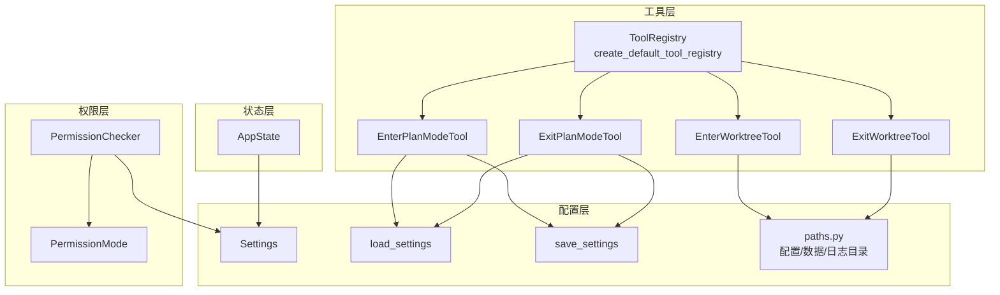
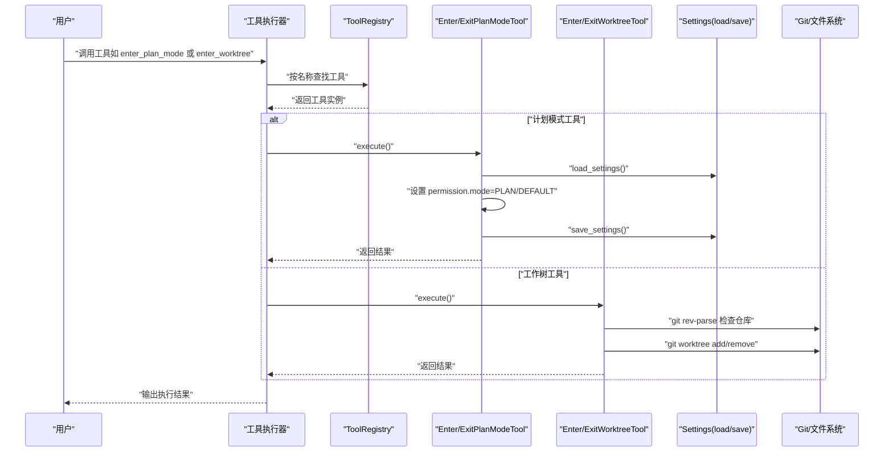
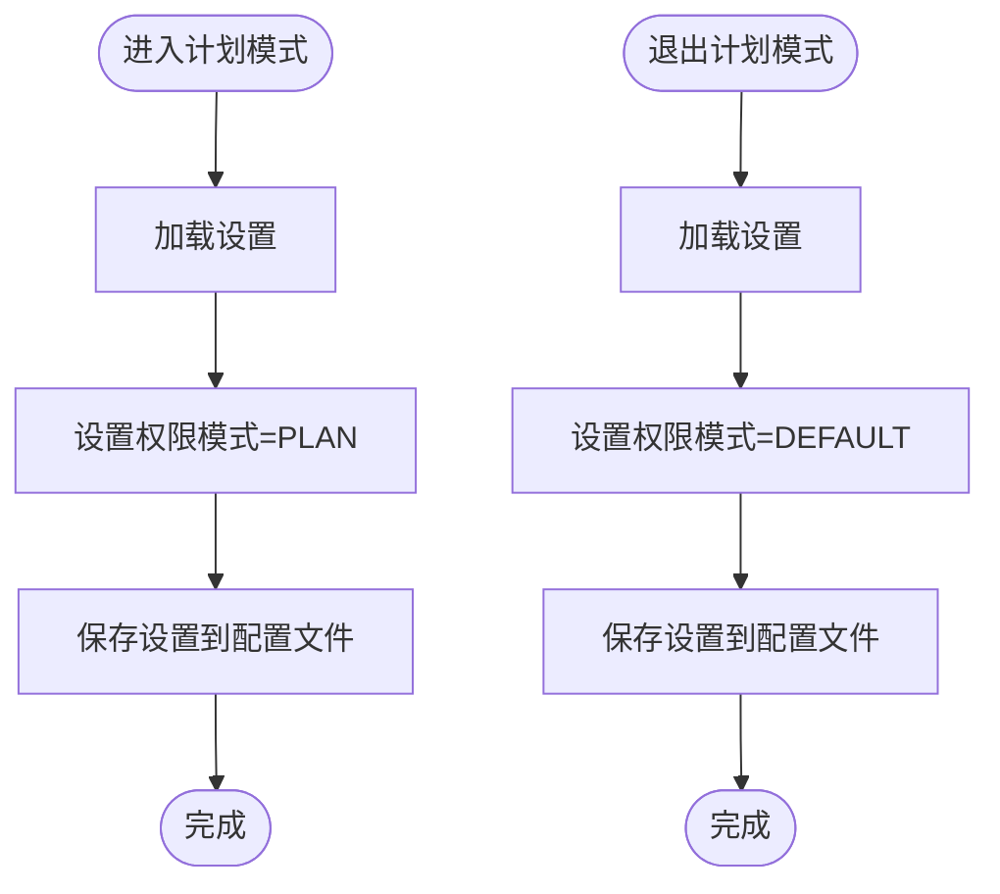
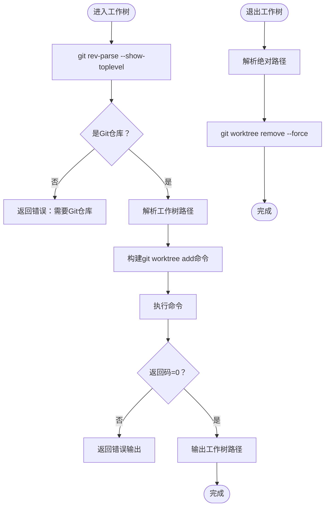
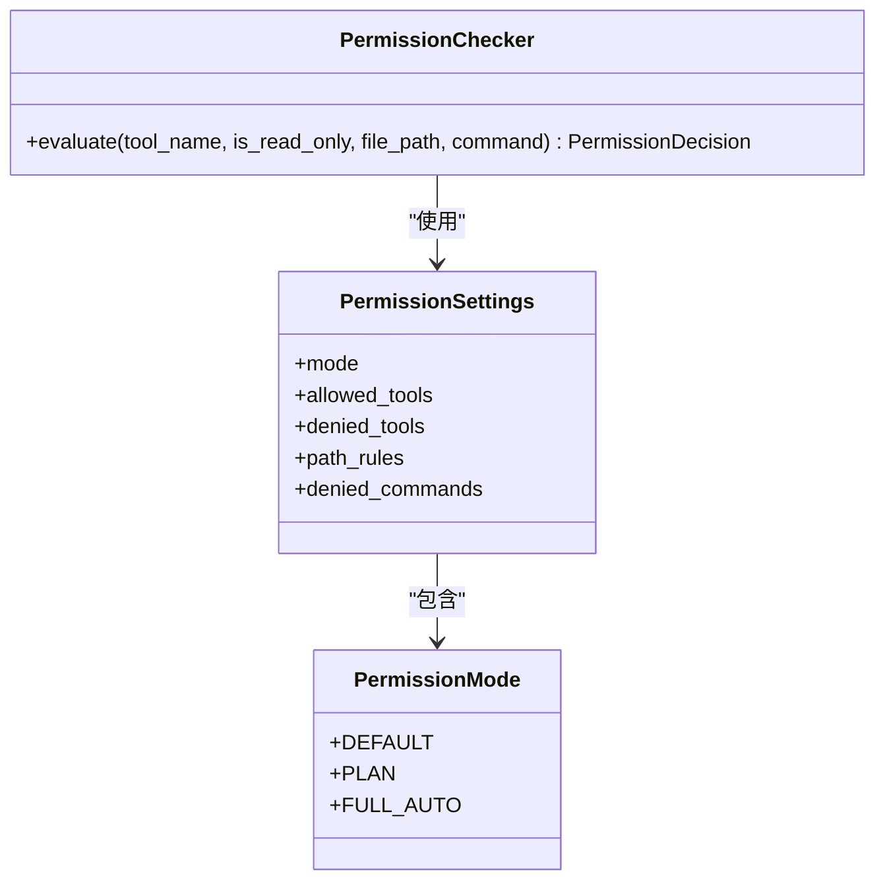
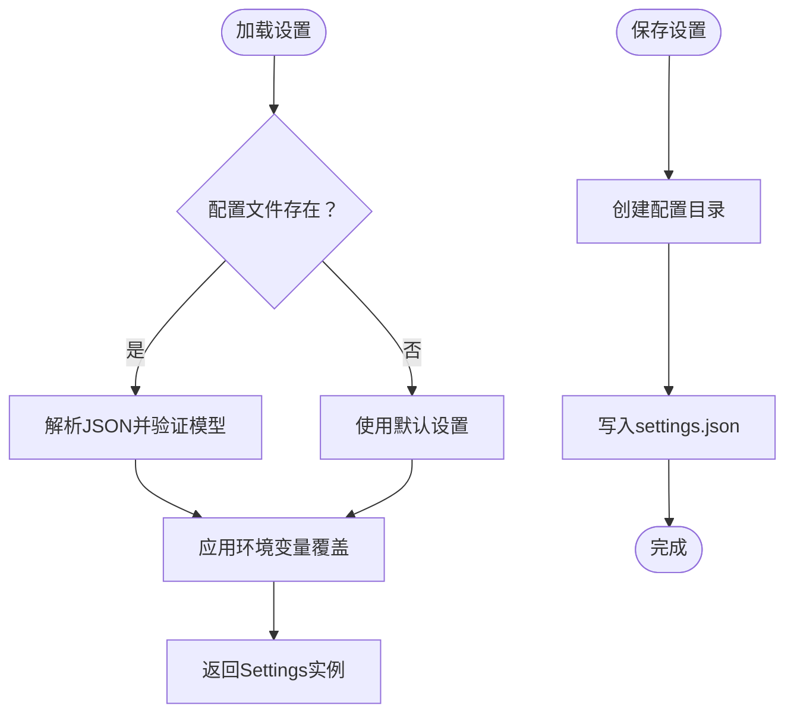
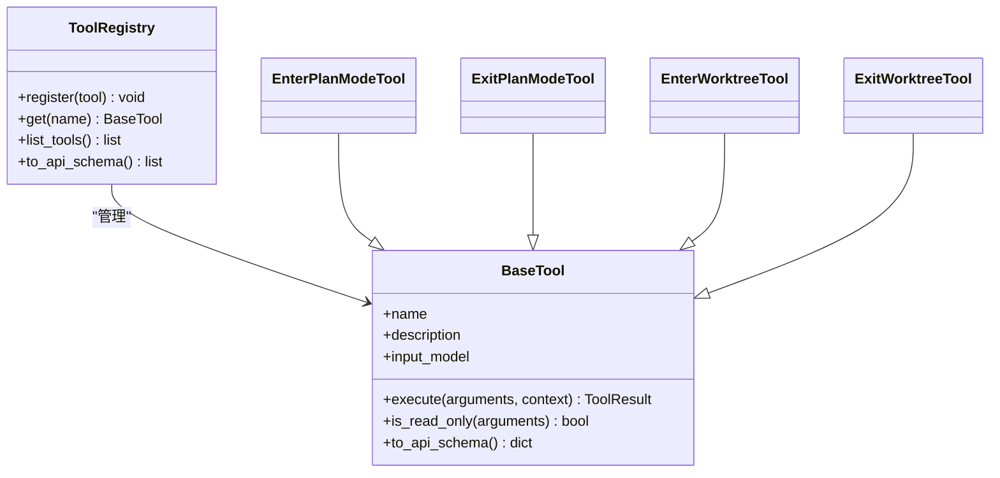
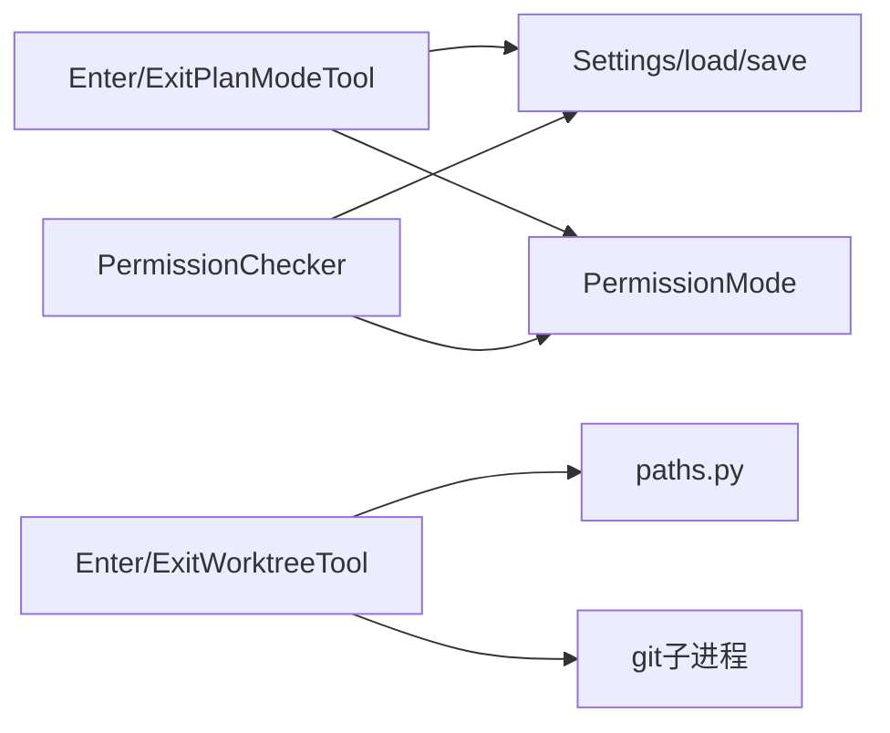

# 模式切换工具

<cite>
**本文引用的文件**
- [enter_plan_mode_tool.py](file://src/openharness/tools/enter_plan_mode_tool.py)
- [exit_plan_mode_tool.py](file://src/openharness/tools/exit_plan_mode_tool.py)
- [enter_worktree_tool.py](file://src/openharness/tools/enter_worktree_tool.py)
- [exit_worktree_tool.py](file://src/openharness/tools/exit_worktree_tool.py)
- [modes.py](file://src/openharness/permissions/modes.py)
- [checker.py](file://src/openharness/permissions/checker.py)
- [settings.py](file://src/openharness/config/settings.py)
- [paths.py](file://src/openharness/config/paths.py)
- [base.py](file://src/openharness/tools/base.py)
- [app_state.py](file://src/openharness/state/app_state.py)
- [__init__.py（工具注册）](file://src/openharness/tools/__init__.py)
- [test_core_tools.py（测试）](file://tests/test_tools/test_core_tools.py)
</cite>

## 目录
1. [简介](#简介)
2. [项目结构](#项目结构)
3. [核心组件](#核心组件)
4. [架构总览](#架构总览)
5. [详细组件分析](#详细组件分析)
6. [依赖分析](#依赖分析)
7. [性能考虑](#性能考虑)
8. [故障排查指南](#故障排查指南)
9. [结论](#结论)
10. [附录](#附录)

## 简介
本文件面向 OpenHarness 的“模式切换工具”，聚焦两类能力：
- 计划模式工具：用于进入与退出“计划模式”（PLAN），以限制或允许工具执行，保障在探索阶段的安全性。
- 工作树工具：用于创建/删除 Git 工作树（worktree），实现工作区隔离与状态持久化。

文档将从架构、数据流、处理逻辑、错误处理与回滚机制等维度进行深入说明，并给出使用场景、配置选项与最佳实践。

## 项目结构
围绕模式切换相关的模块分布如下：
- 工具层：计划模式进入/退出工具、工作树进入/退出工具、通用工具基类与注册表。
- 权限层：权限模式枚举、权限检查器（根据模式与规则判定工具是否可执行）。
- 配置层：设置模型、加载/保存逻辑、路径解析（含配置文件位置）。
- 状态层：应用状态模型（UI/会话共享状态）。

图表来源
- [enter_plan_mode_tool.py:16-28](file://src/openharness/tools/enter_plan_mode_tool.py#L16-L28)
- [exit_plan_mode_tool.py:16-28](file://src/openharness/tools/exit_plan_mode_tool.py#L16-L28)
- [enter_worktree_tool.py:23-57](file://src/openharness/tools/enter_worktree_tool.py#L23-L57)
- [exit_worktree_tool.py:19-42](file://src/openharness/tools/exit_worktree_tool.py#L19-L42)
- [modes.py:8-14](file://src/openharness/permissions/modes.py#L8-L14)
- [checker.py:30-99](file://src/openharness/permissions/checker.py#L30-L99)
- [settings.py:49-161](file://src/openharness/config/settings.py#L49-L161)
- [paths.py:15-117](file://src/openharness/config/paths.py#L15-L117)
- [base.py:30-76](file://src/openharness/tools/base.py#L30-L76)
- [app_state.py:8-31](file://src/openharness/state/app_state.py#L8-L31)
- [__init__.py（工具注册）:45-92](file://src/openharness/tools/__init__.py#L45-L92)

章节来源
- [enter_plan_mode_tool.py:16-28](file://src/openharness/tools/enter_plan_mode_tool.py#L16-L28)
- [exit_plan_mode_tool.py:16-28](file://src/openharness/tools/exit_plan_mode_tool.py#L16-L28)
- [enter_worktree_tool.py:23-57](file://src/openharness/tools/enter_worktree_tool.py#L23-L57)
- [exit_worktree_tool.py:19-42](file://src/openharness/tools/exit_worktree_tool.py#L19-L42)
- [modes.py:8-14](file://src/openharness/permissions/modes.py#L8-L14)
- [checker.py:30-99](file://src/openharness/permissions/checker.py#L30-L99)
- [settings.py:49-161](file://src/openharness/config/settings.py#L49-L161)
- [paths.py:15-117](file://src/openharness/config/paths.py#L15-L117)
- [base.py:30-76](file://src/openharness/tools/base.py#L30-L76)
- [app_state.py:8-31](file://src/openharness/state/app_state.py#L8-L31)
- [__init__.py（工具注册）:45-92](file://src/openharness/tools/__init__.py#L45-L92)

## 核心组件
- 计划模式工具
  - 进入计划模式：读取当前设置，将权限模式设为 PLAN，写回配置文件。
  - 退出计划模式：读取当前设置，将权限模式设为 DEFAULT，写回配置文件。
- 工作树工具
  - 进入工作树：校验 Git 仓库，解析目标路径，调用 git worktree add 创建工作树；支持基于现有分支或新建分支。
  - 退出工作树：调用 git worktree remove --force 删除指定工作树路径。
- 权限检查器
  - 基于权限模式与规则（显式允许/拒绝、路径规则、命令模式）判断工具是否可执行；PLAN 模式下阻断变更型工具。
- 设置与路径
  - Settings 模型定义权限、内存、UI 等配置；load_settings/ save_settings 提供配置加载与持久化；paths.py 解析配置/数据/日志等目录。
- 工具基类与注册
  - BaseTool 定义统一接口；ToolRegistry 负责注册与检索；默认注册表包含计划模式与工作树工具。

章节来源
- [enter_plan_mode_tool.py:23-28](file://src/openharness/tools/enter_plan_mode_tool.py#L23-L28)
- [exit_plan_mode_tool.py:23-28](file://src/openharness/tools/exit_plan_mode_tool.py#L23-L28)
- [enter_worktree_tool.py:30-57](file://src/openharness/tools/enter_worktree_tool.py#L30-L57)
- [exit_worktree_tool.py:26-42](file://src/openharness/tools/exit_worktree_tool.py#L26-L42)
- [checker.py:43-99](file://src/openharness/permissions/checker.py#L43-L99)
- [settings.py:49-161](file://src/openharness/config/settings.py#L49-L161)
- [paths.py:15-117](file://src/openharness/config/paths.py#L15-L117)
- [base.py:30-76](file://src/openharness/tools/base.py#L30-L76)
- [__init__.py（工具注册）:45-92](file://src/openharness/tools/__init__.py#L45-L92)

## 架构总览
下图展示模式切换工具在系统中的交互关系与数据流向：

图表来源
- [enter_plan_mode_tool.py:23-28](file://src/openharness/tools/enter_plan_mode_tool.py#L23-L28)
- [exit_plan_mode_tool.py:23-28](file://src/openharness/tools/exit_plan_mode_tool.py#L23-L28)
- [enter_worktree_tool.py:30-57](file://src/openharness/tools/enter_worktree_tool.py#L30-L57)
- [exit_worktree_tool.py:26-42](file://src/openharness/tools/exit_worktree_tool.py#L26-L42)
- [settings.py:123-161](file://src/openharness/config/settings.py#L123-L161)

## 详细组件分析

### 计划模式工具
- 功能职责
  - 进入计划模式：将权限模式切换为 PLAN，使变更型工具被阻断，仅允许只读工具。
  - 退出计划模式：将权限模式切回 DEFAULT，恢复交互式确认流程。
- 数据流与处理逻辑
  - 读取配置 → 修改权限模式字段 → 写回配置文件 → 返回结果。
- 错误处理
  - 工具执行本身不抛异常，通过 ToolResult 的 is_error 字段标识失败。
- 权限影响
  - PLAN 模式下，权限检查器对非只读工具直接拒绝；DEFAULT 模式下需要用户确认。

图表来源
- [enter_plan_mode_tool.py:23-28](file://src/openharness/tools/enter_plan_mode_tool.py#L23-L28)
- [exit_plan_mode_tool.py:23-28](file://src/openharness/tools/exit_plan_mode_tool.py#L23-L28)
- [settings.py:144-161](file://src/openharness/config/settings.py#L144-L161)

章节来源
- [enter_plan_mode_tool.py:16-28](file://src/openharness/tools/enter_plan_mode_tool.py#L16-L28)
- [exit_plan_mode_tool.py:16-28](file://src/openharness/tools/exit_plan_mode_tool.py#L16-L28)
- [checker.py:87-92](file://src/openharness/permissions/checker.py#L87-L92)
- [settings.py:144-161](file://src/openharness/config/settings.py#L144-L161)

### 工作树工具
- 功能职责
  - 创建工作树：支持基于现有分支或新建分支；自动解析工作树路径（默认位于仓库根下的 .openharness/worktrees/<slug>）。
  - 删除工作树：强制移除指定工作树路径。
- 数据流与处理逻辑
  - 校验 Git 仓库 → 解析工作树路径 → 执行 git worktree add/remove → 返回路径或错误信息。
- 文件系统隔离与状态持久化
  - 工作树作为独立工作副本，隔离文件变更；配置文件与数据目录由 paths.py 统一管理，确保跨项目一致的持久化行为。
- 错误处理
  - 若不在 Git 仓库中或命令执行失败，返回 is_error=True 的结果；输出包含标准输出或错误输出文本。

图表来源
- [enter_worktree_tool.py:30-57](file://src/openharness/tools/enter_worktree_tool.py#L30-L57)
- [enter_worktree_tool.py:73-80](file://src/openharness/tools/enter_worktree_tool.py#L73-L80)
- [exit_worktree_tool.py:26-42](file://src/openharness/tools/exit_worktree_tool.py#L26-L42)
- [paths.py:15-117](file://src/openharness/config/paths.py#L15-L117)

章节来源
- [enter_worktree_tool.py:14-57](file://src/openharness/tools/enter_worktree_tool.py#L14-L57)
- [exit_worktree_tool.py:13-42](file://src/openharness/tools/exit_worktree_tool.py#L13-L42)
- [paths.py:15-117](file://src/openharness/config/paths.py#L15-L117)

### 权限检查与模式状态
- 权限模式
  - DEFAULT：默认模式，变更型工具需用户确认。
  - PLAN：计划模式，阻断变更型工具，仅允许只读工具。
  - FULL_AUTO：自动放行所有工具（不在本文重点范围内）。
- 权限检查策略
  - 显式允许/拒绝列表优先级最高。
  - 路径规则匹配后，deny 规则优先。
  - FULL_AUTO 直接放行。
  - 只读工具始终允许。
  - PLAN 模式阻断非只读工具。
  - 其他情况要求确认。

图表来源
- [modes.py:8-14](file://src/openharness/permissions/modes.py#L8-L14)
- [settings.py:31-39](file://src/openharness/config/settings.py#L31-L39)
- [checker.py:30-99](file://src/openharness/permissions/checker.py#L30-L99)

章节来源
- [modes.py:8-14](file://src/openharness/permissions/modes.py#L8-L14)
- [checker.py:30-99](file://src/openharness/permissions/checker.py#L30-L99)
- [settings.py:31-39](file://src/openharness/config/settings.py#L31-L39)

### 配置加载与保存、路径解析
- 加载顺序（高优先级覆盖低优先级）
  - CLI 参数
  - 环境变量（如 ANTHROPIC_API_KEY、OPENHARNESS_MODEL 等）
  - 配置文件（~/.openharness/settings.json）
  - 默认值
- 保存逻辑
  - 自动创建配置目录，序列化为 JSON 并写入文件。
- 路径解析
  - 支持通过环境变量覆盖配置/数据/日志目录；默认位于用户主目录下的 .openharness。

图表来源
- [settings.py:123-161](file://src/openharness/config/settings.py#L123-L161)
- [paths.py:15-117](file://src/openharness/config/paths.py#L15-L117)

章节来源
- [settings.py:76-121](file://src/openharness/config/settings.py#L76-L121)
- [settings.py:123-161](file://src/openharness/config/settings.py#L123-L161)
- [paths.py:15-117](file://src/openharness/config/paths.py#L15-L117)

### 工具注册与可用性
- 默认注册表包含计划模式与工作树工具，便于直接调用。
- 工具基类提供统一的输入模型、执行上下文与结果封装。

图表来源
- [base.py:30-76](file://src/openharness/tools/base.py#L30-L76)
- [__init__.py（工具注册）:45-92](file://src/openharness/tools/__init__.py#L45-L92)

章节来源
- [base.py:30-76](file://src/openharness/tools/base.py#L30-L76)
- [__init__.py（工具注册）:45-92](file://src/openharness/tools/__init__.py#L45-L92)

## 依赖分析
- 组件耦合
  - 计划模式工具强依赖配置加载/保存与权限模式枚举。
  - 工作树工具依赖 Git 子进程与路径解析。
  - 权限检查器依赖设置模型与模式枚举。
- 外部依赖
  - Git 命令行工具用于工作树管理。
  - JSON 序列化用于配置持久化。
- 潜在循环依赖
  - 当前模块间为单向依赖，未发现循环。

图表来源
- [enter_plan_mode_tool.py:7-8](file://src/openharness/tools/enter_plan_mode_tool.py#L7-L8)
- [exit_plan_mode_tool.py:7-8](file://src/openharness/tools/exit_plan_mode_tool.py#L7-L8)
- [enter_worktree_tool.py:5,6,7:5-7](file://src/openharness/tools/enter_worktree_tool.py#L5-L7)
- [exit_worktree_tool.py:5,6:5-6](file://src/openharness/tools/exit_worktree_tool.py#L5-L6)
- [settings.py:19-21](file://src/openharness/config/settings.py#L19-L21)
- [modes.py:8-14](file://src/openharness/permissions/modes.py#L8-L14)
- [paths.py:15-117](file://src/openharness/config/paths.py#L15-L117)
- [checker.py:30-99](file://src/openharness/permissions/checker.py#L30-L99)

章节来源
- [enter_plan_mode_tool.py:7-8](file://src/openharness/tools/enter_plan_mode_tool.py#L7-L8)
- [exit_plan_mode_tool.py:7-8](file://src/openharness/tools/exit_plan_mode_tool.py#L7-L8)
- [enter_worktree_tool.py:5,6,7:5-7](file://src/openharness/tools/enter_worktree_tool.py#L5-L7)
- [exit_worktree_tool.py:5,6:5-6](file://src/openharness/tools/exit_worktree_tool.py#L5-L6)
- [settings.py:19-21](file://src/openharness/config/settings.py#L19-L21)
- [modes.py:8-14](file://src/openharness/permissions/modes.py#L8-L14)
- [paths.py:15-117](file://src/openharness/config/paths.py#L15-L117)
- [checker.py:30-99](file://src/openharness/permissions/checker.py#L30-L99)

## 性能考虑
- 工作树工具
  - 创建/删除工作树涉及外部进程调用，建议在批量操作时合并命令或减少频繁切换。
  - 路径解析与目录创建为本地 IO，开销较低。
- 计划模式工具
  - 配置读写为小规模 JSON 文件，I/O 开销可忽略。
- 权限检查
  - 检查逻辑为纯内存计算，复杂度与规则数量线性相关，建议控制规则条目数量以保持响应速度。

## 故障排查指南
- 工作树工具
  - 不在 Git 仓库：返回错误提示需要仓库上下文。
  - 命令失败：查看返回的错误输出，确认分支名、路径与权限。
- 计划模式工具
  - 配置保存失败：检查配置目录权限与磁盘空间。
  - 权限未生效：确认当前会话已重新加载设置，或重启相关服务。
- 权限检查
  - 工具被阻断：检查是否处于 PLAN 模式或被显式拒绝；必要时调整 allowed_tools/denied_tools/path_rules。
- 状态同步
  - UI 与后端状态不同步：检查 AppState 中的 permission_mode 是否与配置一致；必要时刷新界面状态。

章节来源
- [enter_worktree_tool.py:35-37](file://src/openharness/tools/enter_worktree_tool.py#L35-L37)
- [enter_worktree_tool.py:55-56](file://src/openharness/tools/enter_worktree_tool.py#L55-L56)
- [exit_worktree_tool.py:41](file://src/openharness/tools/exit_worktree_tool.py#L41)
- [checker.py:52-58](file://src/openharness/permissions/checker.py#L52-L58)
- [checker.py:87-92](file://src/openharness/permissions/checker.py#L87-L92)
- [app_state.py:12-13](file://src/openharness/state/app_state.py#L12-L13)

## 结论
- 计划模式工具通过修改配置文件中的权限模式，实现对工具执行的即时约束，适合在探索阶段降低风险。
- 工作树工具通过 Git 工作树实现文件系统级隔离，结合路径解析与持久化策略，提供安全可控的工作区管理。
- 权限检查器与设置模型共同构成模式切换的决策基础，确保操作的可预测性与一致性。
- 建议在生产环境中配合严格的路径规则与命令模式，以进一步提升安全性。

## 附录
- 使用场景
  - 探索性开发：进入 PLAN 模式，仅允许只读工具，避免误改。
  - 多分支实验：使用工作树工具快速切换不同分支的工作副本。
- 配置选项
  - 权限模式：DEFAULT/PLAN/FULL_AUTO。
  - 路径规则：glob 模式匹配，支持允许/拒绝。
  - 命令模式：对危险命令进行模式匹配拦截。
- 最佳实践
  - 在进入 PLAN 模式前，明确哪些工具需要临时放行（allowed_tools）。
  - 使用工作树工具时，尽量使用默认路径策略，避免跨分区或权限受限的路径。
  - 定期清理不再使用的工作树，释放磁盘空间。
  - 对关键配置文件启用备份，以防意外覆盖。

章节来源
- [checker.py:52-77](file://src/openharness/permissions/checker.py#L52-L77)
- [enter_worktree_tool.py:73-80](file://src/openharness/tools/enter_worktree_tool.py#L73-L80)
- [settings.py:31-39](file://src/openharness/config/settings.py#L31-L39)