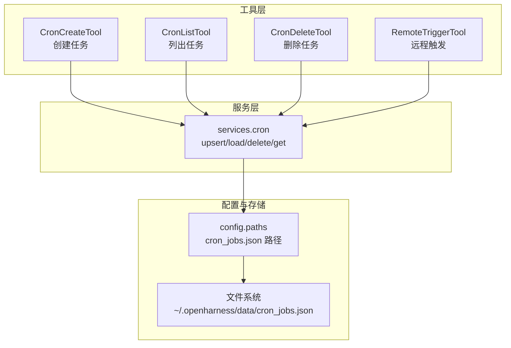
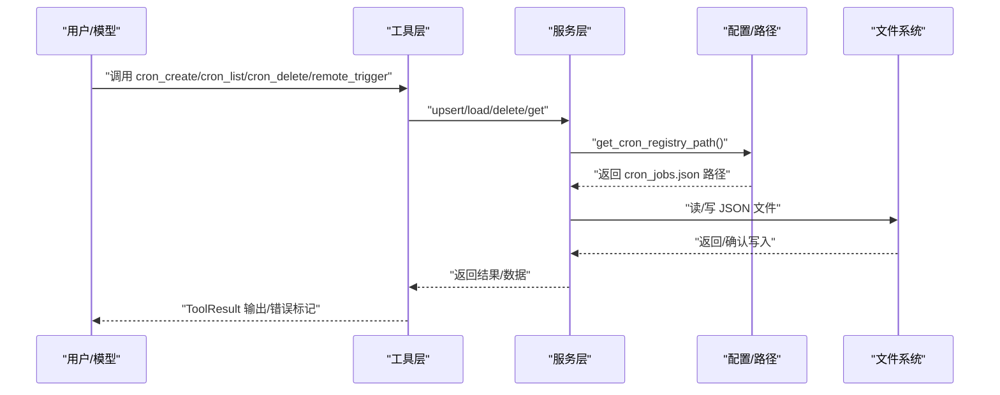
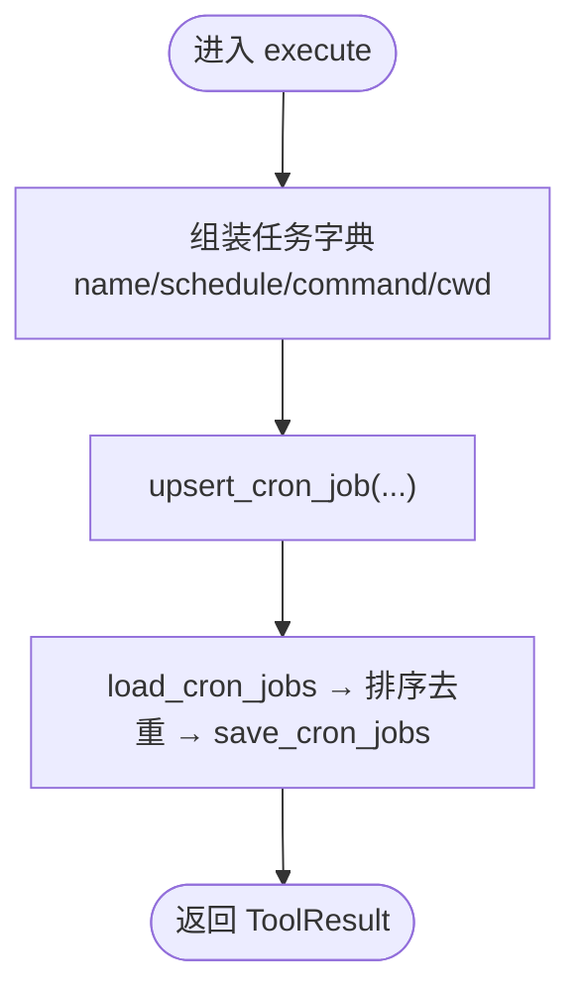
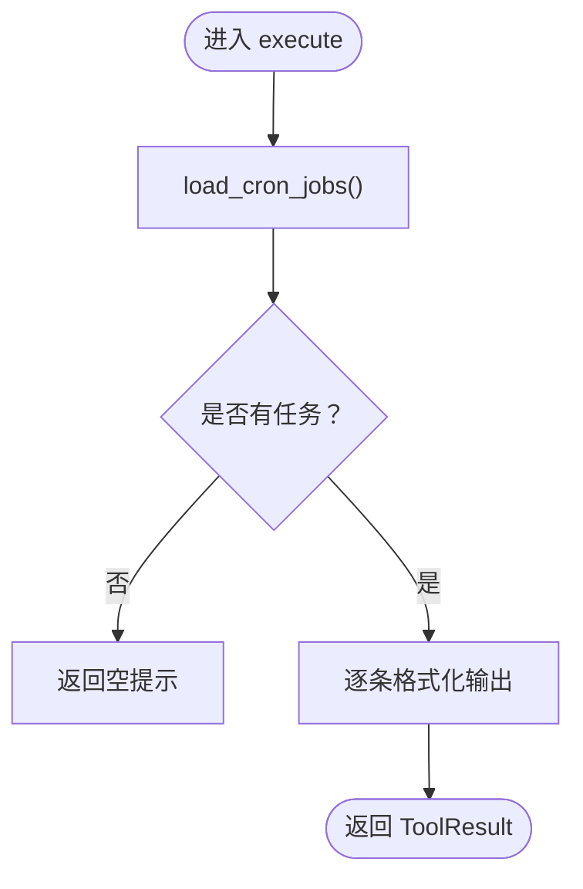
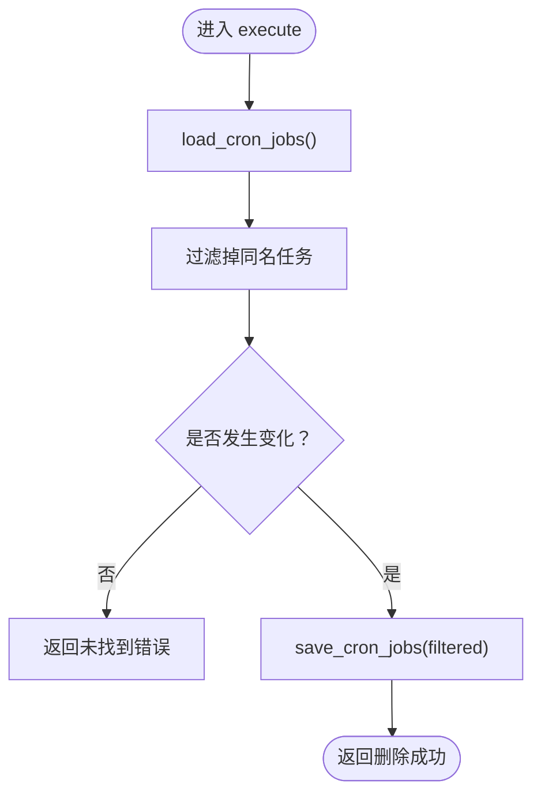
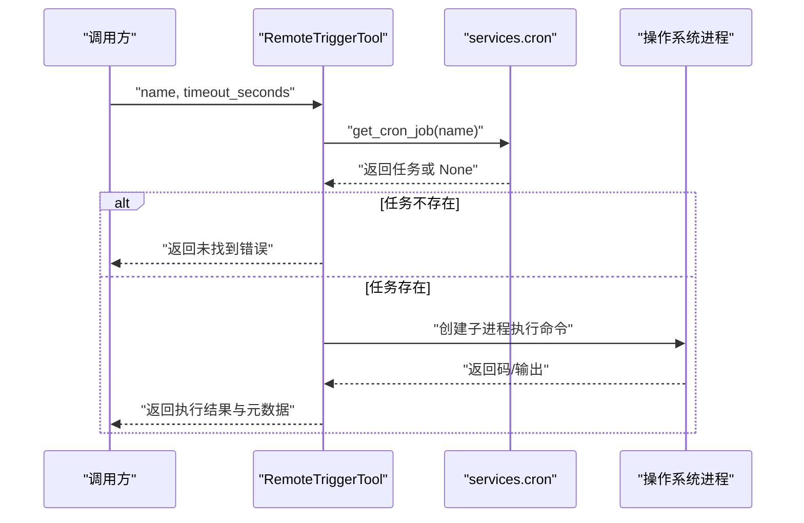
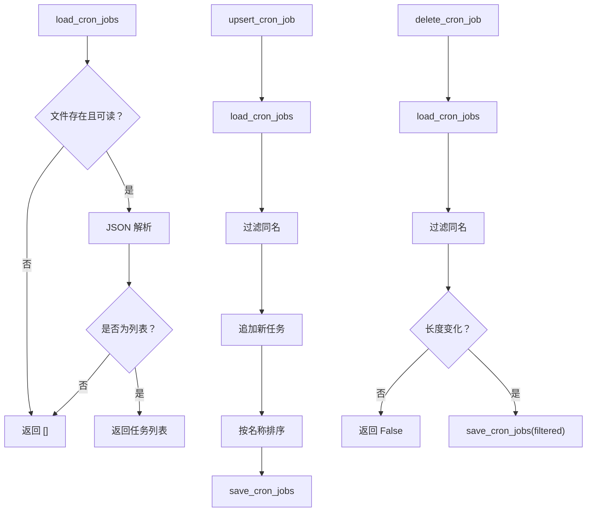
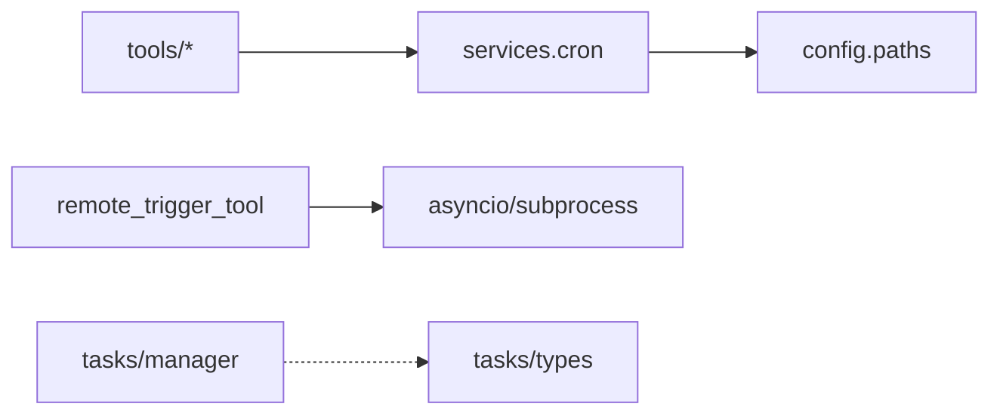

# 调度工具

<cite>
**本文引用的文件**
- [cron_create_tool.py](file://src/openharness/tools/cron_create_tool.py)
- [cron_list_tool.py](file://src/openharness/tools/cron_list_tool.py)
- [cron_delete_tool.py](file://src/openharness/tools/cron_delete_tool.py)
- [remote_trigger_tool.py](file://src/openharness/tools/remote_trigger_tool.py)
- [cron.py](file://src/openharness/services/cron.py)
- [paths.py](file://src/openharness/config/paths.py)
- [base.py](file://src/openharness/tools/base.py)
- [types.py](file://src/openharness/tasks/types.py)
- [manager.py](file://src/openharness/tasks/manager.py)
- [README.md](file://README.md)
</cite>

## 目录
1. [简介](#简介)
2. [项目结构](#项目结构)
3. [核心组件](#核心组件)
4. [架构总览](#架构总览)
5. [详细组件分析](#详细组件分析)
6. [依赖分析](#依赖分析)
7. [性能考虑](#性能考虑)
8. [故障排除指南](#故障排除指南)
9. [结论](#结论)
10. [附录](#附录)

## 简介
本文件面向 OpenHarness 的调度工具，系统性说明以下能力与实现细节：
- Cron 创建工具：如何定义定时任务（名称、可读表达式、命令、工作目录），以及任务参数配置。
- Cron 列表工具：如何查询已配置任务并进行状态监控。
- Cron 删除工具：如何清理任务并回收资源。
- 远程触发工具：如何对外部事件进行响应并执行回调。
- 时间配置、频率设置与执行策略：当前实现采用“人类可读表达式”作为调度描述，但未内置解析器；执行策略基于子进程同步运行与超时控制。
- 持久化存储、异常处理与日志记录：任务注册表以 JSON 文件形式持久化；执行过程通过返回结果与元数据反馈状态；日志输出由底层任务管理器统一管理。

## 项目结构
调度工具位于 tools 子模块，核心服务位于 services 子模块，路径解析与持久化位置在 config 子模块中。整体采用“工具层-服务层-配置层”的分层设计，工具通过服务接口访问持久化存储与执行逻辑。

图表来源
- [cron_create_tool.py:1-41](file://src/openharness/tools/cron_create_tool.py#L1-L41)
- [cron_list_tool.py:1-39](file://src/openharness/tools/cron_list_tool.py#L1-L39)
- [cron_delete_tool.py:1-33](file://src/openharness/tools/cron_delete_tool.py#L1-L33)
- [remote_trigger_tool.py:1-70](file://src/openharness/tools/remote_trigger_tool.py#L1-L70)
- [cron.py:1-54](file://src/openharness/services/cron.py#L1-L54)
- [paths.py:97-99](file://src/openharness/config/paths.py#L97-L99)

章节来源
- [README.md:172-187](file://README.md#L172-L187)

## 核心组件
- CronCreateTool：接收任务名称、人类可读表达式、命令与可选工作目录，调用服务层写入注册表。
- CronListTool：读取注册表并格式化输出所有任务信息。
- CronDeleteTool：按名称删除任务，返回成功或未找到提示。
- RemoteTriggerTool：按名称获取任务，使用子进程立即执行命令，支持超时控制与返回码标记。
- services.cron：提供加载、保存、插入/更新、删除、按名检索等注册表操作。
- config.paths：提供 cron_jobs.json 的持久化路径解析。

章节来源
- [cron_create_tool.py:11-40](file://src/openharness/tools/cron_create_tool.py#L11-L40)
- [cron_list_tool.py:11-38](file://src/openharness/tools/cron_list_tool.py#L11-L38)
- [cron_delete_tool.py:11-32](file://src/openharness/tools/cron_delete_tool.py#L11-L32)
- [remote_trigger_tool.py:14-69](file://src/openharness/tools/remote_trigger_tool.py#L14-L69)
- [cron.py:12-53](file://src/openharness/services/cron.py#L12-L53)
- [paths.py:97-99](file://src/openharness/config/paths.py#L97-L99)

## 架构总览
调度工具的调用链路如下：工具层接收输入并通过服务层访问持久化存储；远程触发工具在运行时通过子进程执行命令，并将输出与返回码反馈给调用方。

图表来源
- [cron_create_tool.py:27-40](file://src/openharness/tools/cron_create_tool.py#L27-L40)
- [cron_list_tool.py:26-38](file://src/openharness/tools/cron_list_tool.py#L26-L38)
- [cron_delete_tool.py:24-32](file://src/openharness/tools/cron_delete_tool.py#L24-L32)
- [remote_trigger_tool.py:28-69](file://src/openharness/tools/remote_trigger_tool.py#L28-L69)
- [cron.py:12-53](file://src/openharness/services/cron.py#L12-L53)
- [paths.py:97-99](file://src/openharness/config/paths.py#L97-L99)

## 详细组件分析

### Cron 创建工具
- 输入模型包含任务名称、人类可读表达式、命令与可选工作目录；未强制校验表达式格式，需确保上游提供合法值。
- 执行流程：将参数组装为字典后调用 upsert_cron_job，内部先过滤同名任务，再追加排序并持久化。
- 返回：成功时输出包含任务名称的结果；失败场景由上层工具封装为错误结果。

图表来源
- [cron_create_tool.py:27-40](file://src/openharness/tools/cron_create_tool.py#L27-L40)
- [cron.py:30-35](file://src/openharness/services/cron.py#L30-L35)

章节来源
- [cron_create_tool.py:11-40](file://src/openharness/tools/cron_create_tool.py#L11-L40)
- [cron.py:30-35](file://src/openharness/services/cron.py#L30-L35)

### Cron 列表工具
- 只读工具，不修改任何状态。
- 执行流程：加载注册表，遍历输出每条任务的名称、表达式与命令；若为空则返回提示信息。

图表来源
- [cron_list_tool.py:26-38](file://src/openharness/tools/cron_list_tool.py#L26-L38)
- [cron.py:12-21](file://src/openharness/services/cron.py#L12-L21)

章节来源
- [cron_list_tool.py:11-38](file://src/openharness/tools/cron_list_tool.py#L11-L38)
- [cron.py:12-21](file://src/openharness/services/cron.py#L12-L21)

### Cron 删除工具
- 执行流程：尝试删除指定名称的任务；若未发生过滤变化，表示未找到该任务，返回错误结果；否则持久化更新后的列表。

图表来源
- [cron_delete_tool.py:24-32](file://src/openharness/tools/cron_delete_tool.py#L24-L32)
- [cron.py:38-45](file://src/openharness/services/cron.py#L38-L45)

章节来源
- [cron_delete_tool.py:11-32](file://src/openharness/tools/cron_delete_tool.py#L11-L32)
- [cron.py:38-45](file://src/openharness/services/cron.py#L38-L45)

### 远程触发工具
- 执行流程：按名称获取任务，解析工作目录（支持用户家目录展开），创建子进程执行命令，等待完成或超时，收集标准输出与错误输出，根据返回码标记错误。
- 超时控制：默认最大 600 秒，最小 1 秒，超出则终止进程并返回超时错误。
- 输出处理：对 UTF-8 解码进行容错处理，合并 stdout/stderr 并去除空白行。

图表来源
- [remote_trigger_tool.py:28-69](file://src/openharness/tools/remote_trigger_tool.py#L28-L69)
- [cron.py:48-53](file://src/openharness/services/cron.py#L48-L53)

章节来源
- [remote_trigger_tool.py:14-69](file://src/openharness/tools/remote_trigger_tool.py#L14-L69)
- [cron.py:48-53](file://src/openharness/services/cron.py#L48-L53)

### 服务层：Cron 注册表
- 加载：读取 JSON 文件，若文件不存在或 JSON 解析失败则返回空列表。
- 保存：将任务列表以缩进格式写回文件。
- upsert：移除同名任务后追加新任务，按名称排序并保存。
- delete：按名称过滤，若未变化表示未找到，否则保存。
- get：线性查找返回匹配任务。

图表来源
- [cron.py:12-53](file://src/openharness/services/cron.py#L12-L53)

章节来源
- [cron.py:12-53](file://src/openharness/services/cron.py#L12-L53)

### 配置与持久化路径
- cron_jobs.json 默认位于数据目录下的 cron_jobs.json，可通过环境变量覆盖配置与数据目录。
- 提供多类路径解析函数，便于扩展其他持久化文件。

章节来源
- [paths.py:97-99](file://src/openharness/config/paths.py#L97-L99)

### 工具抽象与执行上下文
- 工具基类提供统一的输入模型、执行签名与只读判定。
- ToolResult 统一承载输出文本、错误标记与元数据。
- ToolExecutionContext 提供当前工作目录与通用元数据。

章节来源
- [base.py:13-75](file://src/openharness/tools/base.py#L13-L75)

### 与后台任务管理的关系
- 远程触发工具直接使用子进程执行命令，不依赖后台任务管理器。
- 后台任务管理器用于长期运行的 Shell/Agent 任务，提供进程生命周期管理、输出读取与重启能力；与 Cron 工具的职责边界清晰。

章节来源
- [manager.py:18-280](file://src/openharness/tasks/manager.py#L18-L280)
- [types.py:14-31](file://src/openharness/tasks/types.py#L14-L31)

## 依赖分析
- 工具层依赖服务层接口，服务层依赖配置层提供的路径解析。
- 远程触发工具额外依赖异步子进程接口与时间超时控制。
- 任务类型与状态枚举由任务模块提供，用于统一后台任务语义。

图表来源
- [cron_create_tool.py:7-8](file://src/openharness/tools/cron_create_tool.py#L7-L8)
- [cron_list_tool.py:7-8](file://src/openharness/tools/cron_list_tool.py#L7-L8)
- [cron_delete_tool.py:7-8](file://src/openharness/tools/cron_delete_tool.py#L7-L8)
- [remote_trigger_tool.py:5-11](file://src/openharness/tools/remote_trigger_tool.py#L5-L11)
- [cron.py](file://src/openharness/services/cron.py#L9)
- [paths.py:97-99](file://src/openharness/config/paths.py#L97-L99)
- [manager.py:14-15](file://src/openharness/tasks/manager.py#L14-L15)
- [types.py:10-11](file://src/openharness/tasks/types.py#L10-L11)

章节来源
- [cron.py:1-54](file://src/openharness/services/cron.py#L1-L54)
- [paths.py:1-117](file://src/openharness/config/paths.py#L1-L117)
- [manager.py:1-280](file://src/openharness/tasks/manager.py#L1-L280)
- [types.py:1-31](file://src/openharness/tasks/types.py#L1-L31)

## 性能考虑
- 注册表读写：每次 CRUD 操作均进行完整文件读写，适合小规模任务集；大规模任务或高并发场景建议引入索引或缓存层。
- 远程触发：子进程同步等待，超时控制避免阻塞；建议合理设置超时阈值并结合日志定位慢任务。
- 输出处理：UTF-8 容错解码与空行裁剪减少噪声，但大体量输出仍可能影响 I/O 性能。

## 故障排除指南
- 任务未找到
  - 现象：列出或删除时提示未找到。
  - 排查：确认名称大小写与拼写；检查注册表文件是否存在且可读。
  - 参考
    - [cron_list_tool.py:32-38](file://src/openharness/tools/cron_list_tool.py#L32-L38)
    - [cron_delete_tool.py:30-32](file://src/openharness/tools/cron_delete_tool.py#L30-L32)
- 远程触发超时
  - 现象：返回超时错误。
  - 排查：调整 timeout_seconds 参数；检查命令执行耗时与外部依赖；查看返回码与输出。
  - 参考
    - [remote_trigger_tool.py:46-57](file://src/openharness/tools/remote_trigger_tool.py#L46-L57)
- JSON 解析失败
  - 现象：注册表为空或读取异常。
  - 排查：检查 cron_jobs.json 格式与权限；必要时备份并重建。
  - 参考
    - [cron.py:17-21](file://src/openharness/services/cron.py#L17-L21)
- 工作目录问题
  - 现象：命令在错误目录执行。
  - 排查：确认 cwd 字段与上下文目录；注意用户家目录展开行为。
  - 参考
    - [cron_create_tool.py](file://src/openharness/tools/cron_create_tool.py#L37)
    - [remote_trigger_tool.py](file://src/openharness/tools/remote_trigger_tool.py#L37)

## 结论
OpenHarness 的调度工具以简洁的文件注册表为核心，提供创建、查询、删除与远程触发能力。其设计强调易用性与可观测性：任务参数通过 Pydantic 校验，执行结果标准化返回，远程触发具备超时与输出聚合。对于更复杂的调度需求（如 Cron 解析器、分布式调度、可视化面板），可在现有服务层之上扩展实现。

## 附录

### 使用示例（步骤说明）
- 创建任务
  - 准备参数：名称、人类可读表达式、命令、可选工作目录。
  - 调用工具：cron_create。
  - 验证：cron_list 查看是否入库。
  - 参考
    - [cron_create_tool.py:27-40](file://src/openharness/tools/cron_create_tool.py#L27-L40)
    - [cron_list_tool.py:26-38](file://src/openharness/tools/cron_list_tool.py#L26-L38)
- 查询任务
  - 调用工具：cron_list。
  - 参考
    - [cron_list_tool.py:26-38](file://src/openharness/tools/cron_list_tool.py#L26-L38)
- 删除任务
  - 调用工具：cron_delete。
  - 参考
    - [cron_delete_tool.py:24-32](file://src/openharness/tools/cron_delete_tool.py#L24-L32)
- 远程触发
  - 调用工具：remote_trigger（可设置超时）。
  - 参考
    - [remote_trigger_tool.py:28-69](file://src/openharness/tools/remote_trigger_tool.py#L28-L69)

### 时间配置、频率设置与执行策略
- 时间配置
  - 采用“人类可读表达式”字段，用于描述任务计划意图；当前实现未内置解析器，需确保上游提供可被理解的字符串。
- 频率设置
  - 未提供专用频率字段；建议通过表达式体现周期性（例如每日、每周等）。
- 执行策略
  - 远程触发采用同步子进程执行，支持超时控制与返回码标记；未内置重试与并发限制。

章节来源
- [cron_create_tool.py:14-16](file://src/openharness/tools/cron_create_tool.py#L14-L16)
- [remote_trigger_tool.py](file://src/openharness/tools/remote_trigger_tool.py#L18)
- [remote_trigger_tool.py:46-57](file://src/openharness/tools/remote_trigger_tool.py#L46-L57)