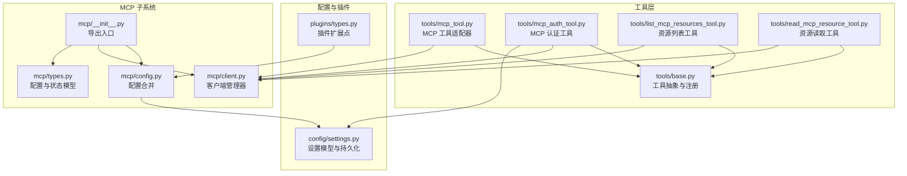
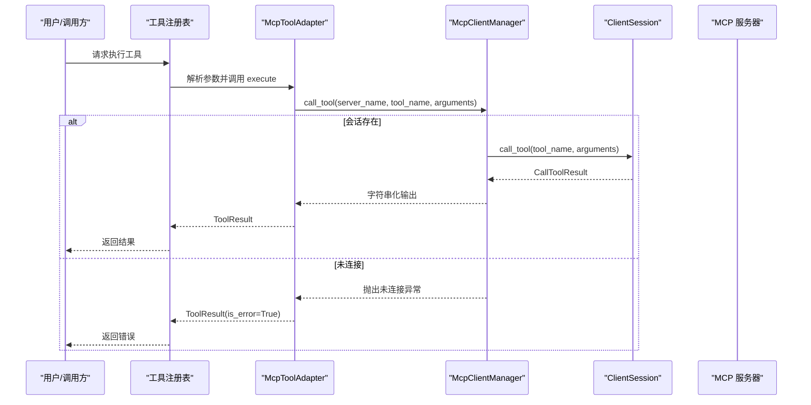
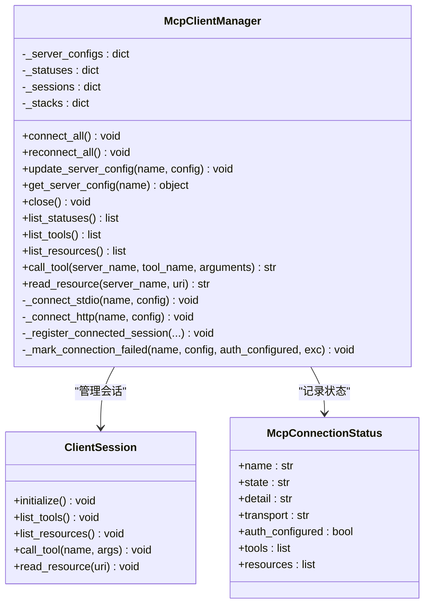
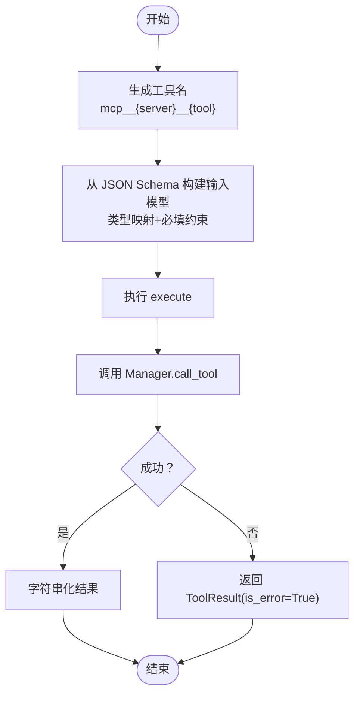
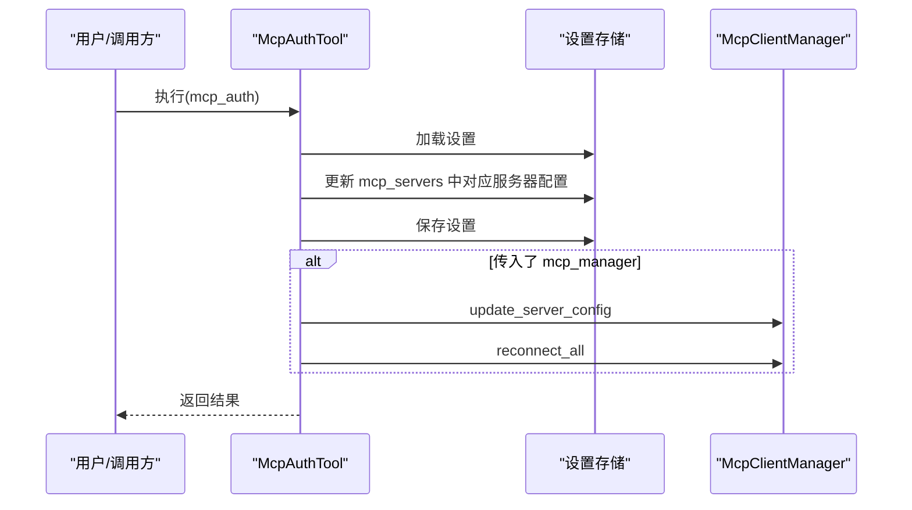
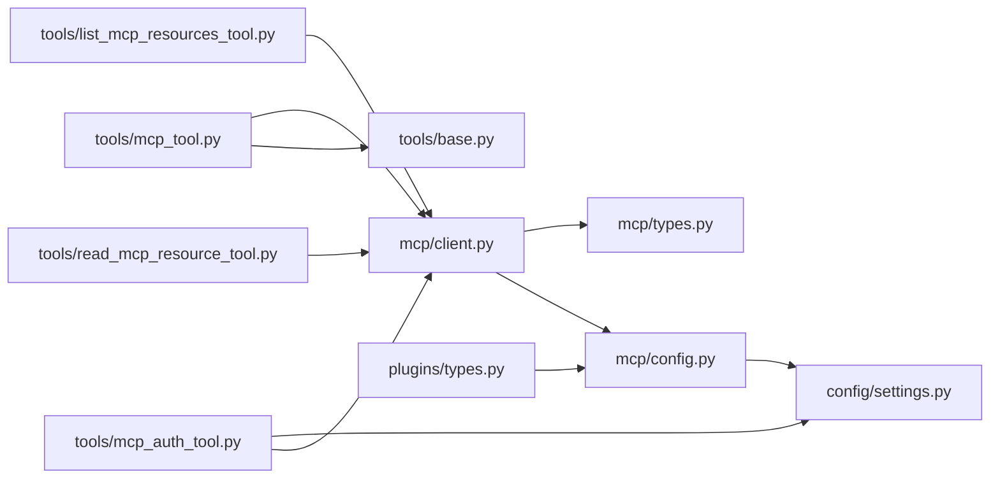

# MCP 集成工具

<cite>
**本文引用的文件**
- [mcp/__init__.py](file://src/openharness/mcp/__init__.py)
- [mcp/client.py](file://src/openharness/mcp/client.py)
- [mcp/config.py](file://src/openharness/mcp/config.py)
- [mcp/types.py](file://src/openharness/mcp/types.py)
- [tools/mcp_tool.py](file://src/openharness/tools/mcp_tool.py)
- [tools/mcp_auth_tool.py](file://src/openharness/tools/mcp_auth_tool.py)
- [tools/list_mcp_resources_tool.py](file://src/openharness/tools/list_mcp_resources_tool.py)
- [tools/read_mcp_resource_tool.py](file://src/openharness/tools/read_mcp_resource_tool.py)
- [tools/base.py](file://src/openharness/tools/base.py)
- [config/settings.py](file://src/openharness/config/settings.py)
- [plugins/types.py](file://src/openharness/plugins/types.py)
- [test_mcp/test_integration.py](file://tests/test_mcp/test_integration.py)
- [test_tools/test_mcp_tool.py](file://tests/test_tools/test_mcp_tool.py)
- [test_tools/test_mcp_auth_tool.py](file://tests/test_tools/test_mcp_auth_tool.py)
- [fixtures/fake_mcp_server.py](file://tests/fixtures/fake_mcp_server.py)
</cite>

## 目录
1. [简介](#简介)
2. [项目结构](#项目结构)
3. [核心组件](#核心组件)
4. [架构总览](#架构总览)
5. [详细组件分析](#详细组件分析)
6. [依赖关系分析](#依赖关系分析)
7. [性能考虑](#性能考虑)
8. [故障排查指南](#故障排查指南)
9. [结论](#结论)
10. [附录：配置与使用示例](#附录配置与使用示例)

## 简介
本文件面向 MCP（Model Context Protocol）集成工具，系统性阐述以下内容：
- MCP 协议支持与客户端管理器设计
- 认证机制与配置持久化
- 工具适配器 McpToolAdapter 的参数转换与结果处理
- MCP 服务器的发现、连接、认证流程
- MCP 工具的动态注册、资源列表获取、远程工具调用
- MCP 协议的配置项、错误处理策略与性能优化建议

## 项目结构
MCP 相关代码主要分布在如下模块：
- mcp 子系统：协议配置、状态模型、客户端管理器
- tools 子系统：MCP 工具适配器与辅助工具（认证、资源列举、资源读取）
- config 与 plugins：配置加载与插件扩展点
- 测试：覆盖集成流程、输入模型生成、认证更新与重连行为

图表来源
- [mcp/__init__.py:1-80](file://src/openharness/mcp/__init__.py#L1-L80)
- [mcp/client.py:1-299](file://src/openharness/mcp/client.py#L1-L299)
- [mcp/config.py:1-17](file://src/openharness/mcp/config.py#L1-L17)
- [mcp/types.py:1-77](file://src/openharness/mcp/types.py#L1-L77)
- [tools/base.py:1-81](file://src/openharness/tools/base.py#L1-L81)
- [tools/mcp_tool.py:1-73](file://src/openharness/tools/mcp_tool.py#L1-L73)
- [tools/mcp_auth_tool.py:1-72](file://src/openharness/tools/mcp_auth_tool.py#L1-L72)
- [tools/list_mcp_resources_tool.py:1-37](file://src/openharness/tools/list_mcp_resources_tool.py#L1-L37)
- [tools/read_mcp_resource_tool.py:1-39](file://src/openharness/tools/read_mcp_resource_tool.py#L1-L39)
- [config/settings.py:534-564](file://src/openharness/config/settings.py#L534-L564)
- [plugins/types.py:40-60](file://src/openharness/plugins/types.py#L40-L60)

章节来源
- [mcp/__init__.py:1-80](file://src/openharness/mcp/__init__.py#L1-L80)
- [mcp/client.py:1-299](file://src/openharness/mcp/client.py#L1-L299)
- [mcp/config.py:1-17](file://src/openharness/mcp/config.py#L1-L17)
- [mcp/types.py:1-77](file://src/openharness/mcp/types.py#L1-L77)
- [tools/base.py:1-81](file://src/openharness/tools/base.py#L1-L81)
- [tools/mcp_tool.py:1-73](file://src/openharness/tools/mcp_tool.py#L1-L73)
- [tools/mcp_auth_tool.py:1-72](file://src/openharness/tools/mcp_auth_tool.py#L1-L72)
- [tools/list_mcp_resources_tool.py:1-37](file://src/openharness/tools/list_mcp_resources_tool.py#L1-L37)
- [tools/read_mcp_resource_tool.py:1-39](file://src/openharness/tools/read_mcp_resource_tool.py#L1-L39)
- [config/settings.py:534-564](file://src/openharness/config/settings.py#L534-L564)
- [plugins/types.py:40-60](file://src/openharness/plugins/types.py#L40-L60)

## 核心组件
- MCP 客户端管理器：负责多服务器连接、会话生命周期、工具与资源清单、远程调用与资源读取
- MCP 工具适配器：将远端工具元数据映射为本地工具，自动构建输入模型并执行参数序列化
- 认证工具：持久化不同传输类型的认证信息，并在可能时触发重连
- 资源工具：列出已连接服务器暴露的资源或按服务器+URI读取资源
- 配置与插件：从设置与插件合并 MCP 服务器配置；设置模型包含 mcp_servers 字段

章节来源
- [mcp/client.py:29-299](file://src/openharness/mcp/client.py#L29-L299)
- [tools/mcp_tool.py:14-73](file://src/openharness/tools/mcp_tool.py#L14-L73)
- [tools/mcp_auth_tool.py:21-72](file://src/openharness/tools/mcp_auth_tool.py#L21-L72)
- [tools/list_mcp_resources_tool.py:15-37](file://src/openharness/tools/list_mcp_resources_tool.py#L15-L37)
- [tools/read_mcp_resource_tool.py:18-39](file://src/openharness/tools/read_mcp_resource_tool.py#L18-L39)
- [mcp/config.py:8-17](file://src/openharness/mcp/config.py#L8-L17)
- [config/settings.py:563](file://src/openharness/config/settings.py#L563)

## 架构总览
下图展示 MCP 客户端管理器如何与工具层、配置层交互，以及认证工具如何影响运行时连接状态。

图表来源
- [tools/mcp_tool.py:26-36](file://src/openharness/tools/mcp_tool.py#L26-L36)
- [mcp/client.py:129-154](file://src/openharness/mcp/client.py#L129-L154)

章节来源
- [tools/mcp_tool.py:14-73](file://src/openharness/tools/mcp_tool.py#L14-L73)
- [mcp/client.py:129-154](file://src/openharness/mcp/client.py#L129-L154)

## 详细组件分析

### MCP 客户端管理器（McpClientManager）
职责与能力：
- 统一管理多个 MCP 服务器连接（当前实现支持 stdio 与 http）
- 连接建立后自动拉取工具清单与资源清单
- 提供工具调用与资源读取的统一接口
- 记录每个服务器的连接状态与认证配置情况
- 支持重连与关闭操作

关键流程：
- 连接所有服务器：根据配置类型选择 stdio 或 http 连接路径
- 注册会话：初始化会话并查询工具与资源清单
- 工具调用：将参数序列化为 JSON 并字符串化返回值
- 资源读取：将二进制或文本内容拼接为字符串

图表来源
- [mcp/client.py:29-299](file://src/openharness/mcp/client.py#L29-L299)
- [mcp/types.py:66-77](file://src/openharness/mcp/types.py#L66-L77)

章节来源
- [mcp/client.py:29-299](file://src/openharness/mcp/client.py#L29-L299)
- [mcp/types.py:66-77](file://src/openharness/mcp/types.py#L66-L77)

### MCP 工具适配器（McpToolAdapter）
功能要点：
- 将远端工具元数据映射为本地工具名称与输入模型
- 自动构建 Pydantic 输入模型，基于 JSON Schema 类型映射与必填字段约束
- 执行时将参数序列化为 JSON（排除 None），并捕获未连接错误返回标准 ToolResult

图表来源
- [tools/mcp_tool.py:14-73](file://src/openharness/tools/mcp_tool.py#L14-L73)
- [tools/base.py:26-50](file://src/openharness/tools/base.py#L26-L50)

章节来源
- [tools/mcp_tool.py:14-73](file://src/openharness/tools/mcp_tool.py#L14-L73)
- [tools/base.py:26-50](file://src/openharness/tools/base.py#L26-L50)

### 认证工具（McpAuthTool）
功能要点：
- 支持三种模式：bearer、header、env
- 根据服务器类型（http/ws 使用 header/bearer；stdio 使用 env/bearer）更新配置
- 持久化到设置文件，并尝试更新内存中的配置与重连
- 对未知服务器或不支持的配置类型返回错误

图表来源
- [tools/mcp_auth_tool.py:28-72](file://src/openharness/tools/mcp_auth_tool.py#L28-L72)
- [config/settings.py:563](file://src/openharness/config/settings.py#L563)

章节来源
- [tools/mcp_auth_tool.py:21-72](file://src/openharness/tools/mcp_auth_tool.py#L21-L72)
- [config/settings.py:563](file://src/openharness/config/settings.py#L563)

### 资源工具（ListMcpResourcesTool / ReadMcpResourceTool）
功能要点：
- 列举所有已连接服务器的资源，格式化输出
- 读取指定服务器与 URI 的资源内容，字符串化返回

章节来源
- [tools/list_mcp_resources_tool.py:15-37](file://src/openharness/tools/list_mcp_resources_tool.py#L15-L37)
- [tools/read_mcp_resource_tool.py:18-39](file://src/openharness/tools/read_mcp_resource_tool.py#L18-L39)

### 配置与插件扩展（load_mcp_server_configs）
- 合并设置与插件提供的 MCP 服务器配置
- 插件配置键名采用“插件名:服务器名”的命名空间避免冲突

章节来源
- [mcp/config.py:8-17](file://src/openharness/mcp/config.py#L8-L17)
- [plugins/types.py:51](file://src/openharness/plugins/types.py#L51)

## 依赖关系分析
- 外部库依赖：mcp 客户端库用于 stdio 与 http 流式通信
- 内部依赖：工具层依赖客户端管理器；认证工具依赖设置存储与可选的管理器实例
- 配置依赖：设置模型包含 mcp_servers 字段，插件通过 LoadedPlugin.mcp_servers 扩展

图表来源
- [mcp/client.py:16-22](file://src/openharness/mcp/client.py#L16-L22)
- [mcp/types.py:11-37](file://src/openharness/mcp/types.py#L11-L37)
- [mcp/config.py:8-17](file://src/openharness/mcp/config.py#L8-L17)
- [tools/mcp_tool.py:9-11](file://src/openharness/tools/mcp_tool.py#L9-L11)
- [tools/base.py:35-50](file://src/openharness/tools/base.py#L35-L50)
- [tools/list_mcp_resources_tool.py:7-8](file://src/openharness/tools/list_mcp_resources_tool.py#L7-L8)
- [tools/read_mcp_resource_tool.py:7-8](file://src/openharness/tools/read_mcp_resource_tool.py#L7-L8)
- [tools/mcp_auth_tool.py:7-9](file://src/openharness/tools/mcp_auth_tool.py#L7-L9)
- [config/settings.py:563](file://src/openharness/config/settings.py#L563)
- [plugins/types.py:51](file://src/openharness/plugins/types.py#L51)

章节来源
- [mcp/client.py:16-22](file://src/openharness/mcp/client.py#L16-L22)
- [mcp/types.py:11-37](file://src/openharness/mcp/types.py#L11-L37)
- [mcp/config.py:8-17](file://src/openharness/mcp/config.py#L8-L17)
- [tools/mcp_tool.py:9-11](file://src/openharness/tools/mcp_tool.py#L9-L11)
- [tools/base.py:35-50](file://src/openharness/tools/base.py#L35-L50)
- [tools/list_mcp_resources_tool.py:7-8](file://src/openharness/tools/list_mcp_resources_tool.py#L7-L8)
- [tools/read_mcp_resource_tool.py:7-8](file://src/openharness/tools/read_mcp_resource_tool.py#L7-L8)
- [tools/mcp_auth_tool.py:7-9](file://src/openharness/tools/mcp_auth_tool.py#L7-L9)
- [config/settings.py:563](file://src/openharness/config/settings.py#L563)
- [plugins/types.py:51](file://src/openharness/plugins/types.py#L51)

## 性能考虑
- 连接复用：通过 ClientSession 初始化一次，后续工具调用与资源读取复用该会话，减少握手开销
- 异步 I/O：使用异步客户端与流式读写，适合高并发场景
- 结果字符串化：对非文本内容进行 JSON 序列化，避免大对象重复解析
- 清理策略：连接失败时使用 AsyncExitStack 做最佳努力清理，防止资源泄漏
- 可选资源列表：当服务器不支持资源列表方法时，忽略特定错误继续运行

章节来源
- [mcp/client.py:45-68](file://src/openharness/mcp/client.py#L45-L68)
- [mcp/client.py:218-250](file://src/openharness/mcp/client.py#L218-L250)
- [mcp/client.py:268-270](file://src/openharness/mcp/client.py#L268-L270)
- [mcp/client.py:103-110](file://src/openharness/mcp/client.py#L103-L110)

## 故障排查指南
常见问题与定位：
- 未连接错误：当服务器未连接或会话丢失时，工具调用会抛出未连接异常并被适配器捕获为错误结果
- 连接失败：连接过程中异常会被记录为失败状态，包含传输类型与详细信息
- 认证失败：根据服务器类型与模式更新配置后，若重连失败，工具会返回提示信息
- 资源不可用：当服务器不支持资源列表或读取失败，会返回相应错误

章节来源
- [mcp/client.py:129-154](file://src/openharness/mcp/client.py#L129-L154)
- [mcp/client.py:86-101](file://src/openharness/mcp/client.py#L86-L101)
- [tools/mcp_auth_tool.py:61-69](file://src/openharness/tools/mcp_auth_tool.py#L61-L69)
- [tools/read_mcp_resource_tool.py:32-38](file://src/openharness/tools/read_mcp_resource_tool.py#L32-L38)

## 结论
MCP 集成工具通过客户端管理器实现了对多服务器、多传输协议的支持，并提供了完善的工具与资源抽象。工具适配器将远端能力无缝映射为本地工具，认证工具则确保配置变更后的连接一致性。整体设计具备良好的扩展性与可维护性，适合在复杂工作流中集成外部 MCP 服务。

## 附录：配置与使用示例

### MCP 配置项
- 设置模型包含 mcp_servers 字典，键为服务器名，值为 McpServerConfig（支持 stdio/http/ws）
- 插件可通过 LoadedPlugin.mcp_servers 提供额外服务器配置，键名自动加上“插件名:”前缀

章节来源
- [config/settings.py:563](file://src/openharness/config/settings.py#L563)
- [plugins/types.py:51](file://src/openharness/plugins/types.py#L51)

### 使用步骤
- 发现与连接
  - 通过配置合并函数加载设置与插件的 MCP 服务器配置
  - 使用客户端管理器连接所有服务器，自动拉取工具与资源清单
- 动态注册
  - 工具适配器根据工具元数据动态生成本地工具名称与输入模型
  - 工具注册表按名称索引，便于调用
- 远程工具调用
  - 通过 McpToolAdapter.execute 触发远程工具调用，参数自动序列化
- 资源管理
  - 使用资源列表工具查看可用资源
  - 使用资源读取工具按服务器与 URI 获取内容
- 认证更新
  - 使用认证工具更新指定服务器的认证配置并尝试重连

章节来源
- [mcp/config.py:8-17](file://src/openharness/mcp/config.py#L8-L17)
- [mcp/client.py:45-68](file://src/openharness/mcp/client.py#L45-L68)
- [tools/mcp_tool.py:14-36](file://src/openharness/tools/mcp_tool.py#L14-L36)
- [tools/list_mcp_resources_tool.py:25-36](file://src/openharness/tools/list_mcp_resources_tool.py#L25-L36)
- [tools/read_mcp_resource_tool.py:28-38](file://src/openharness/tools/read_mcp_resource_tool.py#L28-L38)
- [tools/mcp_auth_tool.py:28-72](file://src/openharness/tools/mcp_auth_tool.py#L28-L72)

### 测试参考
- 集成测试验证配置合并、工具注册与资源列表
- 工具输入模型生成测试覆盖 JSON Schema 类型映射与必填约束
- 认证工具测试覆盖 http/ws 与 stdio 的认证更新与重连行为

章节来源
- [test_mcp/test_integration.py:35-80](file://tests/test_mcp/test_integration.py#L35-L80)
- [test_tools/test_mcp_tool.py:9-95](file://tests/test_tools/test_mcp_tool.py#L9-L95)
- [test_tools/test_mcp_auth_tool.py:35-102](file://tests/test_tools/test_mcp_auth_tool.py#L35-L102)
- [fixtures/fake_mcp_server.py:10-17](file://tests/fixtures/fake_mcp_server.py#L10-L17)