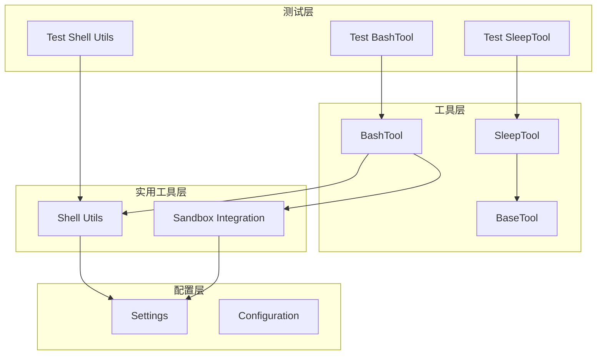
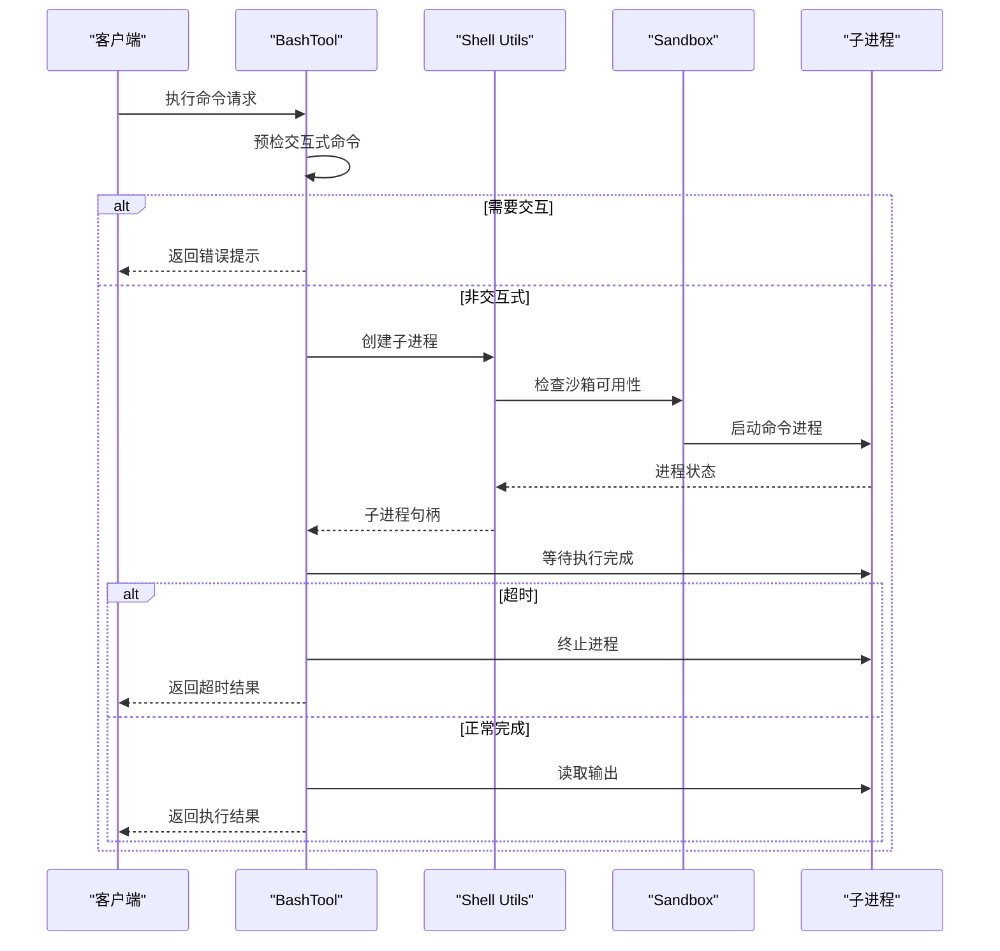
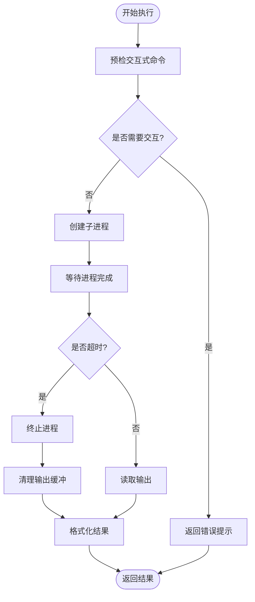
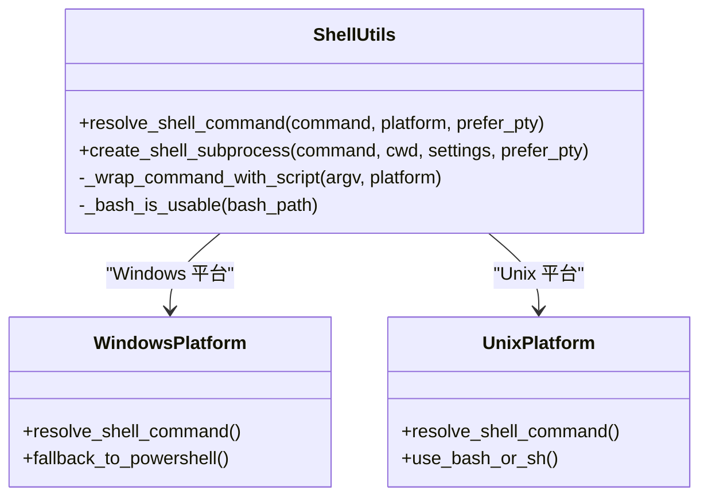
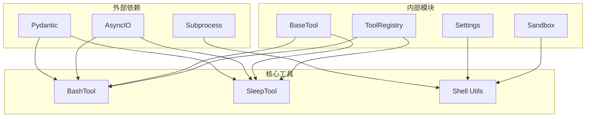

# Shell 命令工具

<cite>
**本文档引用的文件**
- [bash_tool.py](file://src/openharness/tools/bash_tool.py)
- [sleep_tool.py](file://src/openharness/tools/sleep_tool.py)
- [shell.py](file://src/openharness/utils/shell.py)
- [base.py](file://src/openharness/tools/base.py)
- [settings.py](file://src/openharness/config/settings.py)
- [__init__.py](file://src/openharness/sandbox/__init__.py)
- [test_bash_tool.py](file://tests/test_tools/test_bash_tool.py)
- [test_sleep_tool.py](file://tests/test_tools/test_sleep_tool.py)
- [test_shell.py](file://tests/test_utils/test_shell.py)
- [__init__.py](file://src/openharness/tools/__init__.py)
</cite>

## 目录
1. [简介](#简介)
2. [项目结构](#项目结构)
3. [核心组件](#核心组件)
4. [架构概览](#架构概览)
5. [详细组件分析](#详细组件分析)
6. [依赖关系分析](#依赖关系分析)
7. [性能考虑](#性能考虑)
8. [故障排除指南](#故障排除指南)
9. [最佳实践](#最佳实践)
10. [结论](#结论)

## 简介

OpenHarness 提供了强大的 Shell 命令执行能力，通过 BashTool 和 SleepTool 两个核心工具，实现了安全、可控的命令执行环境。这些工具不仅支持跨平台的 Shell 执行，还集成了完整的安全沙箱机制、超时控制和输出管理功能。

BashTool 是一个非交互式的 Shell 命令执行工具，专门设计用于在受控环境中执行命令，避免与用户进行实时交互。SleepTool 则提供了精确的延时功能，用于协调异步操作和调试场景。

## 项目结构

OpenHarness 的 Shell 工具系统采用模块化设计，主要包含以下关键组件：



**图表来源**
- [bash_tool.py:1-219](file://src/openharness/tools/bash_tool.py#L1-L219)
- [sleep_tool.py:1-33](file://src/openharness/tools/sleep_tool.py#L1-L33)
- [shell.py:1-148](file://src/openharness/utils/shell.py#L1-L148)

**章节来源**
- [bash_tool.py:1-219](file://src/openharness/tools/bash_tool.py#L1-L219)
- [sleep_tool.py:1-33](file://src/openharness/tools/sleep_tool.py#L1-L33)
- [shell.py:1-148](file://src/openharness/utils/shell.py#L1-L148)

## 核心组件

### BashTool - Shell 命令执行器

BashTool 是 OpenHarness 的核心 Shell 工具，提供了安全、可控的命令执行能力。其主要特性包括：

- **非交互式执行**：自动检测并阻止需要用户交互的命令
- **超时控制**：可配置的执行时间限制
- **输出管理**：完整的标准输出和错误输出捕获
- **沙箱集成**：支持 Docker 和其他沙箱后端
- **安全预检**：智能识别潜在的交互式命令

### SleepTool - 定时延迟工具

SleepTool 提供了精确的时间延迟功能，支持 0 到 30 秒的延时范围。其设计特点：

- **只读属性**：确保不会对系统状态产生副作用
- **异步执行**：不阻塞主线程
- **精确控制**：支持小数秒级的延时精度

**章节来源**
- [bash_tool.py:27-85](file://src/openharness/tools/bash_tool.py#L27-L85)
- [sleep_tool.py:18-32](file://src/openharness/tools/sleep_tool.py#L18-L32)

## 架构概览

OpenHarness 的 Shell 工具系统采用分层架构设计，确保了高度的模块化和可扩展性：



**图表来源**
- [bash_tool.py:34-85](file://src/openharness/tools/bash_tool.py#L34-L85)
- [shell.py:51-105](file://src/openharness/utils/shell.py#L51-L105)

## 详细组件分析

### BashTool 实现详解

BashTool 的实现体现了现代异步编程的最佳实践，采用了多种安全和性能优化措施：

#### 命令执行流程



**图表来源**
- [bash_tool.py:34-85](file://src/openharness/tools/bash_tool.py#L34-L85)

#### 关键实现特性

1. **超时控制机制**：
   - 默认超时时间为 600 秒（10 分钟）
   - 支持自定义超时范围（1-600 秒）
   - 超时后自动清理资源并返回部分输出

2. **安全预检系统**：
   - 智能识别常见的交互式命令模式
   - 自动检测包管理器初始化命令
   - 提供非交互式替代方案建议

3. **输出管理策略**：
   - 标准输出和错误输出合并处理
   - 输出截断保护（最多 12000 字符）
   - 异步输出读取避免阻塞

**章节来源**
- [bash_tool.py:19-25](file://src/openharness/tools/bash_tool.py#L19-L25)
- [bash_tool.py:43-85](file://src/openharness/tools/bash_tool.py#L43-L85)
- [bash_tool.py:103-141](file://src/openharness/tools/bash_tool.py#L103-L141)

### Shell 工具库

Shell 工具库提供了跨平台的 Shell 命令执行支持，是整个系统的核心基础设施：

#### 平台适配机制



**图表来源**
- [shell.py:17-48](file://src/openharness/utils/shell.py#L17-L48)
- [shell.py:51-105](file://src/openharness/utils/shell.py#L51-L105)

#### 关键功能特性

1. **智能平台检测**：
   - Windows：优先使用 bash，不可用时回退到 PowerShell 或 cmd
   - Unix：优先使用 bash，不可用时使用 sh
   - 自动检测 bash 可用性避免无效调用

2. **沙箱集成**：
   - 支持 Docker 后端沙箱
   - 自动处理沙箱路径包装
   - 失败时的优雅降级

3. **PTY 支持**：
   - Linux/macOS 上的伪终端支持
   - script 命令包装以启用 PTY 功能

**章节来源**
- [shell.py:17-48](file://src/openharness/utils/shell.py#L17-L48)
- [shell.py:51-105](file://src/openharness/utils/shell.py#L51-L105)
- [shell.py:108-121](file://src/openharness/utils/shell.py#L108-L121)

### SleepTool 实现分析

SleepTool 虽然简单，但体现了只读工具的设计原则：

#### 工具特性

- **只读属性**：`is_read_only()` 方法始终返回 `True`
- **异步执行**：使用 `asyncio.sleep()` 实现非阻塞延时
- **安全范围**：限制最大延时时间为 30 秒

**章节来源**
- [sleep_tool.py:18-32](file://src/openharness/tools/sleep_tool.py#L18-L32)

## 依赖关系分析

OpenHarness Shell 工具系统的依赖关系清晰且层次分明：



**图表来源**
- [base.py:35-50](file://src/openharness/tools/base.py#L35-L50)
- [__init__.py:48-98](file://src/openharness/tools/__init__.py#L48-L98)

### 关键依赖说明

1. **Pydantic 验证**：所有工具输入都经过严格的类型验证
2. **AsyncIO 异步**：支持非阻塞的并发执行
3. **Subprocess 管理**：底层进程生命周期管理
4. **配置系统集成**：与全局设置无缝集成

**章节来源**
- [base.py:17-50](file://src/openharness/tools/base.py#L17-L50)
- [__init__.py:48-98](file://src/openharness/tools/__init__.py#L48-L98)

## 性能考虑

### 内存管理

- **输出缓冲**：使用 `bytearray` 避免频繁的字符串拼接
- **超时保护**：防止长时间运行的命令占用内存
- **资源清理**：确保进程终止后及时释放资源

### 并发处理

- **异步 I/O**：避免阻塞事件循环
- **超时机制**：防止无限等待
- **信号处理**：正确处理取消和中断

### 跨平台优化

- **平台特定优化**：针对不同操作系统进行性能调优
- **缓存机制**：避免重复的平台检测
- **连接复用**：在可能的情况下重用连接

## 故障排除指南

### 常见问题及解决方案

#### BashTool 执行失败

1. **交互式命令被拒绝**
   - 症状：返回错误提示要求使用非交互式标志
   - 解决：添加 `--yes`、`--non-interactive` 等标志

2. **超时错误**
   - 症状：命令执行超过超时时间
   - 解决：增加 `timeout_seconds` 参数或优化命令

3. **沙箱不可用**
   - 症状：Docker 服务未运行
   - 解决：启动 Docker 服务或禁用沙箱

#### Shell 工具问题

1. **平台检测失败**
   - 症状：无法找到合适的 Shell
   - 解决：手动指定 Shell 路径或安装相应工具

2. **权限问题**
   - 症状：命令执行被拒绝
   - 解决：检查文件权限和沙箱配置

**章节来源**
- [test_bash_tool.py:76-118](file://tests/test_tools/test_bash_tool.py#L76-L118)
- [test_shell.py:91-126](file://tests/test_utils/test_shell.py#L91-L126)

## 最佳实践

### 安全最佳实践

1. **命令预检**
   ```python
   # 使用非交互式标志
   command = "npm install --yes"
   ```

2. **超时设置**
   ```python
   # 为长时间运行的命令设置合理超时
   timeout_seconds = 300  # 5分钟
   ```

3. **输出截断**
   ```python
   # 处理大量输出
   max_output_size = 10000
   ```

### 性能优化建议

1. **批量执行**
   ```python
   # 将多个相关命令组合执行
   commands = ["ls -la", "pwd", "whoami"]
   ```

2. **异步处理**
   ```python
   # 使用 asyncio.gather 并发执行多个命令
   results = await asyncio.gather(*tasks)
   ```

3. **资源管理**
   ```python
   # 及时清理临时文件和进程
   cleanup_path.unlink(missing_ok=True)
   ```

### 错误处理策略

1. **超时处理**
   ```python
   try:
       result = await bash_tool.execute(command, context)
   except asyncio.TimeoutError:
       # 处理超时情况
       pass
   ```

2. **异常捕获**
   ```python
   try:
       result = await bash_tool.execute(command, context)
   except SandboxUnavailableError:
       # 处理沙箱不可用
       pass
   ```

3. **输出验证**
   ```python
   if result.is_error:
       # 检查返回码和输出
       return result.output
   ```

## 结论

OpenHarness 的 Shell 命令工具系统展现了现代异步编程和安全沙箱技术的完美结合。通过 BashTool 和 SleepTool，开发者可以获得：

- **安全性**：内置的安全检查和沙箱隔离
- **可靠性**：完善的错误处理和超时控制
- **易用性**：简洁的 API 设计和丰富的配置选项
- **可扩展性**：模块化的架构支持功能扩展

这些工具不仅满足了日常开发需求，还为更复杂的自动化场景提供了坚实的基础。通过遵循本文档的最佳实践，开发者可以充分利用这些工具的强大功能，同时确保系统的安全性和稳定性。