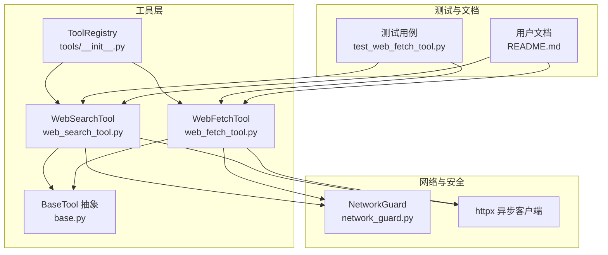
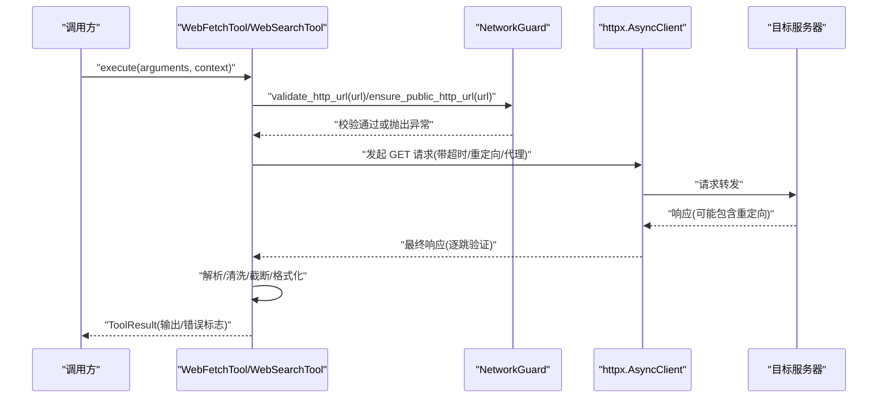
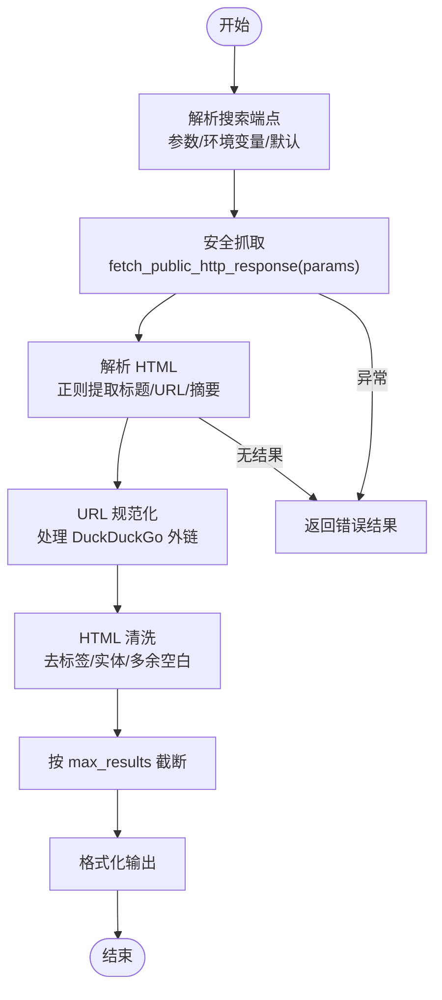
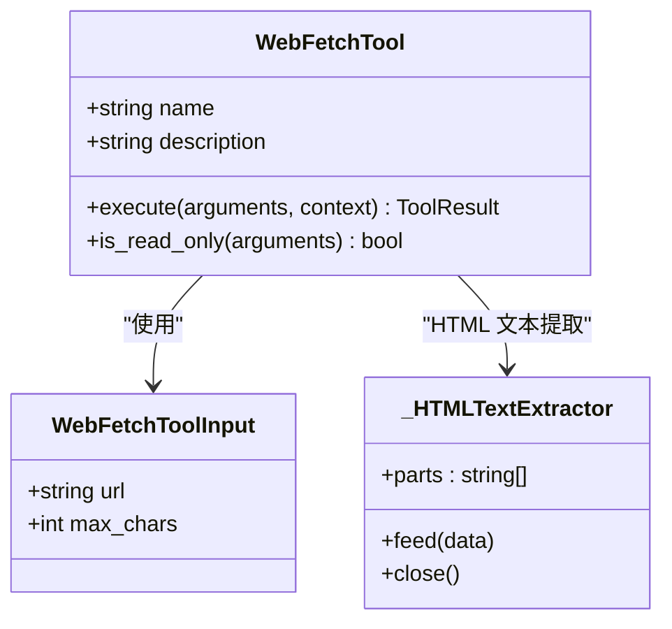
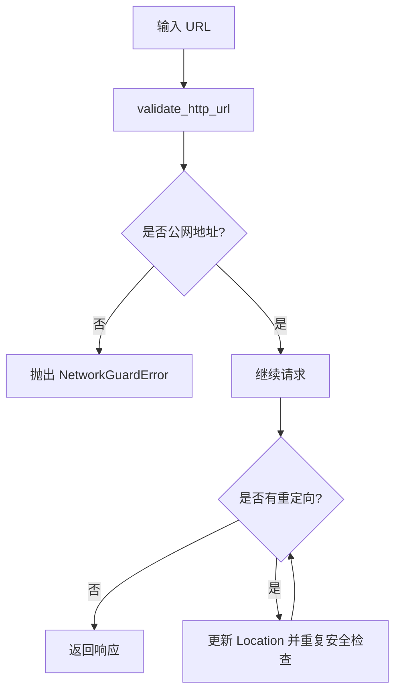
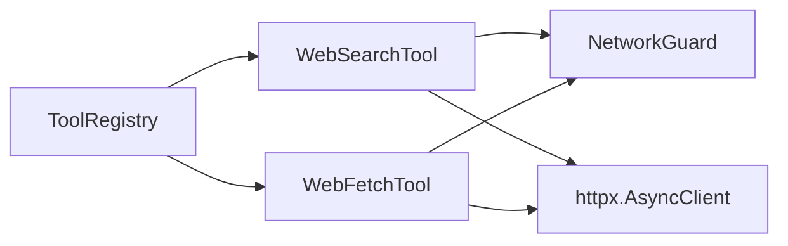

# Web 和网络工具

<cite>
**本文引用的文件**
- [web_search_tool.py](file://src/openharness/tools/web_search_tool.py)
- [web_fetch_tool.py](file://src/openharness/tools/web_fetch_tool.py)
- [network_guard.py](file://src/openharness/utils/network_guard.py)
- [base.py](file://src/openharness/tools/base.py)
- [__init__.py](file://src/openharness/tools/__init__.py)
- [test_web_fetch_tool.py](file://tests/test_tools/test_web_fetch_tool.py)
- [README.md](file://README.md)
</cite>

## 目录
1. [简介](#简介)
2. [项目结构](#项目结构)
3. [核心组件](#核心组件)
4. [架构总览](#架构总览)
5. [详细组件分析](#详细组件分析)
6. [依赖关系分析](#依赖关系分析)
7. [性能考量](#性能考量)
8. [故障排除指南](#故障排除指南)
9. [结论](#结论)
10. [附录](#附录)

## 简介
本文件面向使用 OpenHarness 的开发者与使用者，系统性地介绍 Web 搜索与网页抓取两大网络工具：web_search_tool 与 web_fetch_tool。内容涵盖：
- 搜索引擎集成与查询构建（含环境变量与自定义搜索端点）
- HTTP 请求处理、响应解析与内容提取
- 安全边界（URL 校验、公网地址限制、SSRF 防护、代理配置）
- 超时与重定向控制、错误处理策略
- 实际应用场景与最佳实践
- 高级功能：代理、认证、重试与并发

## 项目结构
Web 与网络工具位于 OpenHarness 的工具层，采用统一的工具抽象与执行框架，并通过安全网关进行网络访问控制。

图表来源
- [web_search_tool.py:1-120](file://src/openharness/tools/web_search_tool.py#L1-L120)
- [web_fetch_tool.py:1-118](file://src/openharness/tools/web_fetch_tool.py#L1-L118)
- [network_guard.py:1-135](file://src/openharness/utils/network_guard.py#L1-L135)
- [base.py:1-81](file://src/openharness/tools/base.py#L1-L81)
- [__init__.py:44-107](file://src/openharness/tools/__init__.py#L44-L107)
- [test_web_fetch_tool.py:1-193](file://tests/test_tools/test_web_fetch_tool.py#L1-L193)
- [README.md:570-585](file://README.md#L570-L585)

章节来源
- [web_search_tool.py:1-120](file://src/openharness/tools/web_search_tool.py#L1-L120)
- [web_fetch_tool.py:1-118](file://src/openharness/tools/web_fetch_tool.py#L1-L118)
- [network_guard.py:1-135](file://src/openharness/utils/network_guard.py#L1-L135)
- [base.py:1-81](file://src/openharness/tools/base.py#L1-L81)
- [__init__.py:44-107](file://src/openharness/tools/__init__.py#L44-L107)
- [README.md:570-585](file://README.md#L570-L585)

## 核心组件
- WebSearchTool：基于 HTML 搜索端点（默认 DuckDuckGo）执行搜索，解析标题、链接与摘要，返回紧凑结果列表。
- WebFetchTool：抓取单个网页，自动识别 HTML 并转换为纯文本，支持长度截断与“外部内容”标记。
- NetworkGuard：统一的 URL 校验、公网地址检查、代理校验与逐跳重定向安全检查。
- BaseTool/ToolRegistry：工具抽象与注册表，提供统一的输入模型、执行接口与 API Schema 输出。

章节来源
- [web_search_tool.py:28-67](file://src/openharness/tools/web_search_tool.py#L28-L67)
- [web_fetch_tool.py:33-71](file://src/openharness/tools/web_fetch_tool.py#L33-L71)
- [network_guard.py:25-96](file://src/openharness/utils/network_guard.py#L25-L96)
- [base.py:35-81](file://src/openharness/tools/base.py#L35-L81)
- [__init__.py:44-98](file://src/openharness/tools/__init__.py#L44-L98)

## 架构总览
Web 工具的执行路径遵循“输入校验 → 安全检查 → HTTP 请求 → 响应解析 → 结果封装”的通用模式。

图表来源
- [web_fetch_tool.py:40-71](file://src/openharness/tools/web_fetch_tool.py#L40-L71)
- [web_search_tool.py:39-67](file://src/openharness/tools/web_search_tool.py#L39-L67)
- [network_guard.py:54-96](file://src/openharness/utils/network_guard.py#L54-L96)

## 详细组件分析

### WebSearchTool 组件分析
- 输入模型：查询词、最大结果数、可选自定义搜索 URL。
- 执行流程：
  - 解析搜索端点：优先使用参数传入，其次环境变量，最后默认 DuckDuckGo HTML 端点。
  - 使用安全抓取函数发起请求（带超时与 User-Agent）。
  - 解析 HTML 结果，提取标题、URL 与摘要；对 URL 进行规范化（如 DuckDuckGo 外链跳转）。
  - 将结果格式化为简洁列表输出。
- 关键实现要点：
  - 正则匹配结果块与摘要片段，清洗 HTML 并去除多余空白。
  - 对外链 URL 进行解码还原，避免“点击劫持”式跳转。
  - 错误处理：捕获 HTTP 与安全异常，返回错误结果。

图表来源
- [web_search_tool.py:39-67](file://src/openharness/tools/web_search_tool.py#L39-L67)
- [web_search_tool.py:70-119](file://src/openharness/tools/web_search_tool.py#L70-L119)

章节来源
- [web_search_tool.py:17-26](file://src/openharness/tools/web_search_tool.py#L17-L26)
- [web_search_tool.py:39-67](file://src/openharness/tools/web_search_tool.py#L39-L67)
- [web_search_tool.py:70-119](file://src/openharness/tools/web_search_tool.py#L70-L119)
- [README.md:570-576](file://README.md#L570-L576)

### WebFetchTool 组件分析
- 输入模型：URL、最大字符数。
- 执行流程：
  - 先进行 URL 语法与安全校验（禁止嵌入凭据、仅允许公网地址）。
  - 使用安全抓取函数发起请求（设置 User-Agent、超时、最大重定向次数）。
  - 若内容类型为 HTML，则转换为纯文本；否则直接读取文本。
  - 根据最大字符数进行截断，并添加“外部内容”提示。
  - 返回包含 URL、状态码、内容类型与正文的结构化输出。
- 关键实现要点：
  - 自定义 HTML 解析器，跳过脚本与样式块，避免复杂正则导致的性能问题。
  - 统一的“不可信任内容”横幅，提醒下游不要将其视为指令。
  - 严格的 URL 校验与代理校验，确保 SSRF 防护生效。

图表来源
- [web_fetch_tool.py:26-31](file://src/openharness/tools/web_fetch_tool.py#L26-L31)
- [web_fetch_tool.py:33-71](file://src/openharness/tools/web_fetch_tool.py#L33-L71)
- [web_fetch_tool.py:95-118](file://src/openharness/tools/web_fetch_tool.py#L95-L118)

章节来源
- [web_fetch_tool.py:26-31](file://src/openharness/tools/web_fetch_tool.py#L26-L31)
- [web_fetch_tool.py:40-71](file://src/openharness/tools/web_fetch_tool.py#L40-L71)
- [web_fetch_tool.py:78-84](file://src/openharness/tools/web_fetch_tool.py#L78-L84)
- [web_fetch_tool.py:95-118](file://src/openharness/tools/web_fetch_tool.py#L95-L118)

### NetworkGuard 安全与网络控制
- URL 校验：仅允许 http/https，必须包含主机名，禁止嵌入用户名/密码。
- 公网地址检查：解析目标主机到 IP，拒绝非全局地址（回环、私网、链路本地）。
- 代理校验：支持通过环境变量或显式参数指定代理，代理 URL 同样禁止嵌入凭据。
- 逐跳重定向安全：在每个重定向位置重复执行安全检查，防止中间人绕过。
- 超时与重定向上限：统一的超时与最大重定向次数，避免资源耗尽。

图表来源
- [network_guard.py:25-51](file://src/openharness/utils/network_guard.py#L25-L51)
- [network_guard.py:54-96](file://src/openharness/utils/network_guard.py#L54-L96)

章节来源
- [network_guard.py:25-51](file://src/openharness/utils/network_guard.py#L25-L51)
- [network_guard.py:54-96](file://src/openharness/utils/network_guard.py#L54-L96)

### 工具注册与 API Schema
- 默认工具注册表包含 WebFetchTool 与 WebSearchTool，便于在运行时通过统一接口调用。
- 工具提供 API Schema，便于与模型服务对接。

章节来源
- [__init__.py:44-98](file://src/openharness/tools/__init__.py#L44-L98)
- [base.py:51-57](file://src/openharness/tools/base.py#L51-L57)

## 依赖关系分析
- WebSearchTool 与 WebFetchTool 均依赖 NetworkGuard 的 URL 校验与安全抓取能力。
- 两者均使用 httpx 异步客户端，具备超时与重定向控制。
- 工具注册表集中管理工具实例，提供统一的 API Schema 输出。

图表来源
- [web_search_tool.py:14](file://src/openharness/tools/web_search_tool.py#L14)
- [web_fetch_tool.py:12-16](file://src/openharness/tools/web_fetch_tool.py#L12-L16)
- [network_guard.py:54-96](file://src/openharness/utils/network_guard.py#L54-L96)
- [__init__.py:44-98](file://src/openharness/tools/__init__.py#L44-L98)

章节来源
- [web_search_tool.py:14](file://src/openharness/tools/web_search_tool.py#L14)
- [web_fetch_tool.py:12-16](file://src/openharness/tools/web_fetch_tool.py#L12-L16)
- [network_guard.py:54-96](file://src/openharness/utils/network_guard.py#L54-L96)
- [__init__.py:44-98](file://src/openharness/tools/__init__.py#L44-L98)

## 性能考量
- HTML 文本提取：使用轻量级 HTMLParser，跳过脚本与样式块，避免正则陷阱，适合大体量 HTML 快速抽取。
- 正则解析：搜索结果解析采用分步正则匹配与清洗，兼顾准确性与性能。
- 超时与重定向：默认超时与最大重定向次数限制，防止长时间阻塞与无限循环重定向。
- 截断策略：对长文本进行截断并保留语义完整性，减少下游处理负担。

章节来源
- [web_fetch_tool.py:78-84](file://src/openharness/tools/web_fetch_tool.py#L78-L84)
- [web_search_tool.py:70-104](file://src/openharness/tools/web_search_tool.py#L70-L104)
- [test_web_fetch_tool.py:76-88](file://tests/test_tools/test_web_fetch_tool.py#L76-L88)

## 故障排除指南
- URL 嵌入凭据被拒绝：工具明确禁止在 URL 中嵌入用户名/密码，需移除后重试。
- 非公网地址被拒绝：仅允许访问公网地址，内网、回环、私网地址会被拒绝。
- 代理配置错误：代理 URL 必须为 http/https 且不含嵌入凭据；可通过环境变量或参数显式指定。
- 搜索端点不可达：默认使用 DuckDuckGo HTML 端点，若区域受限，可通过环境变量指向可信公共搜索端点或自建 SearXNG。
- 重定向过多：超过最大重定向次数会触发错误，检查目标站点是否存在循环重定向。
- HTML 解析异常：若页面结构变化导致解析失败，可调整正则或切换到更稳定的解析策略。

章节来源
- [test_web_fetch_tool.py:91-112](file://tests/test_tools/test_web_fetch_tool.py#L91-L112)
- [test_web_fetch_tool.py:115-139](file://tests/test_tools/test_web_fetch_tool.py#L115-L139)
- [test_web_fetch_tool.py:142-179](file://tests/test_tools/test_web_fetch_tool.py#L142-L179)
- [README.md:570-585](file://README.md#L570-L585)

## 结论
WebSearchTool 与 WebFetchTool 在 OpenHarness 中提供了安全、可控、高性能的网络访问能力。通过统一的工具抽象、严格的 URL 校验与代理控制，以及合理的超时与重定向策略，二者能够稳定地支撑各类网络操作场景。建议在生产环境中：
- 明确搜索端点与代理配置，避免 SSRF 风险。
- 合理设置最大字符数与超时时间，平衡性能与完整性。
- 在需要时启用代理，但务必保证代理 URL 不含嵌入凭据。

## 附录

### 实际应用场景
- 快速检索：使用 WebSearchTool 获取相关网页列表，再用 WebFetchTool 抓取关键页面内容。
- 内容摘要：对长网页进行 HTML 到文本转换，结合最大字符数截断，生成可读摘要。
- 安全预览：在权限模式下先进行 dry-run 预览，确认网络访问与工具调用路径。

章节来源
- [README.md:570-585](file://README.md#L570-L585)