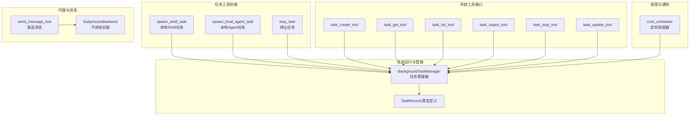
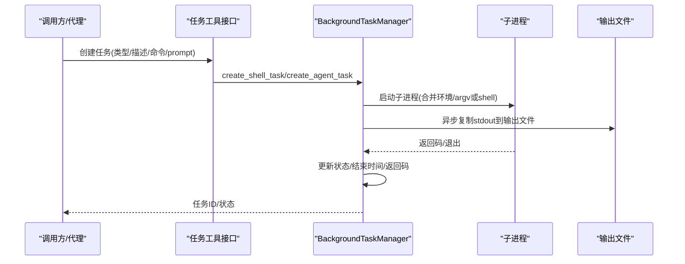
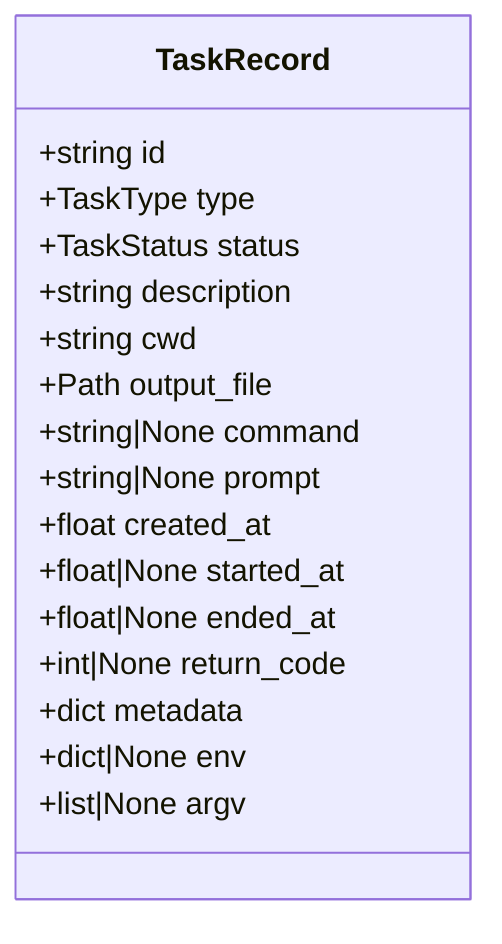
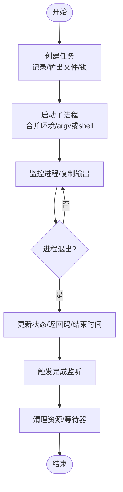
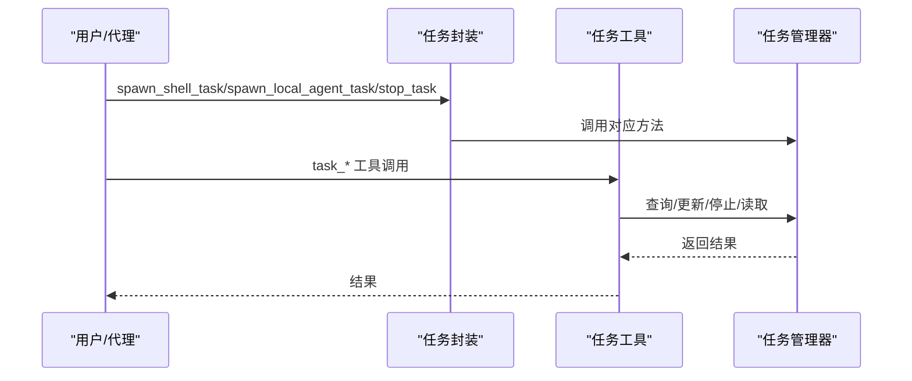
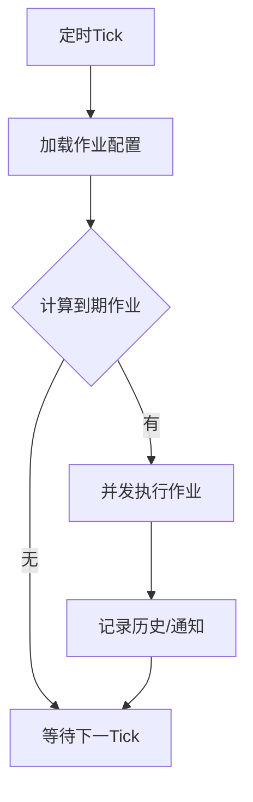
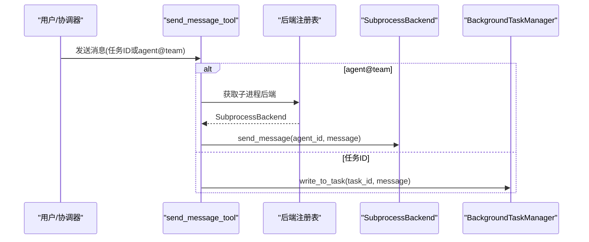
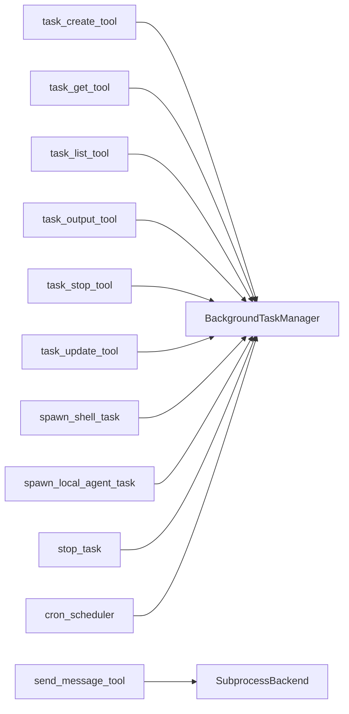

# 任务管理工具

<cite>
**本文引用的文件**
- [src/openharness/tasks/manager.py](file://src/openharness/tasks/manager.py)
- [src/openharness/tasks/types.py](file://src/openharness/tasks/types.py)
- [src/openharness/tasks/local_agent_task.py](file://src/openharness/tasks/local_agent_task.py)
- [src/openharness/tasks/local_shell_task.py](file://src/openharness/tasks/local_shell_task.py)
- [src/openharness/tasks/stop_task.py](file://src/openharness/tasks/stop_task.py)
- [src/openharness/tools/task_create_tool.py](file://src/openharness/tools/task_create_tool.py)
- [src/openharness/tools/task_get_tool.py](file://src/openharness/tools/task_get_tool.py)
- [src/openharness/tools/task_list_tool.py](file://src/openharness/tools/task_list_tool.py)
- [src/openharness/tools/task_output_tool.py](file://src/openharness/tools/task_output_tool.py)
- [src/openharness/tools/task_stop_tool.py](file://src/openharness/tools/task_stop_tool.py)
- [src/openharness/tools/task_update_tool.py](file://src/openharness/tools/task_update_tool.py)
- [src/openharness/services/cron_scheduler.py](file://src/openharness/services/cron_scheduler.py)
- [src/openharness/swarm/subprocess_backend.py](file://src/openharness/swarm/subprocess_backend.py)
- [src/openharness/tools/send_message_tool.py](file://src/openharness/tools/send_message_tool.py)
- [tests/test_tasks/test_manager.py](file://tests/test_tasks/test_manager.py)
- [tests/test_tools/test_task_tools.py](file://tests/test_tools/test_task_tools.py)
</cite>

## 目录
1. [简介](#简介)
2. [项目结构](#项目结构)
3. [核心组件](#核心组件)
4. [架构总览](#架构总览)
5. [详细组件分析](#详细组件分析)
6. [依赖分析](#依赖分析)
7. [性能考虑](#性能考虑)
8. [故障排查指南](#故障排查指南)
9. [结论](#结论)
10. [附录：使用场景与示例路径](#附录使用场景与示例路径)

## 简介
本文件面向“任务管理工具”的技术文档，系统性阐述任务生命周期管理（创建、查询、列表、输出读取、停止、更新）、状态管理、并发控制、持久化机制、调度与通知、以及与代理系统的集成方式。文档以代码为依据，结合测试用例与工具接口，帮助开发者快速理解并正确使用任务管理能力。

## 项目结构
任务管理相关代码主要分布在以下模块：
- 任务运行时与管理器：tasks/manager.py、tasks/types.py
- 任务工具封装：tasks/local_agent_task.py、tasks/local_shell_task.py、tasks/stop_task.py
- 工具接口（CLI/外部调用）：tools/task_*.py
- 调度与通知：services/cron_scheduler.py
- 代理与消息路由：swarm/subprocess_backend.py、tools/send_message_tool.py
- 测试验证：tests/test_tasks/test_manager.py、tests/test_tools/test_task_tools.py

图表来源
- [src/openharness/tasks/manager.py:49-476](file://src/openharness/tasks/manager.py#L49-L476)
- [src/openharness/tasks/types.py:14-33](file://src/openharness/tasks/types.py#L14-L33)
- [src/openharness/tasks/local_shell_task.py:11-18](file://src/openharness/tasks/local_shell_task.py#L11-L18)
- [src/openharness/tasks/local_agent_task.py:11-29](file://src/openharness/tasks/local_agent_task.py#L11-L29)
- [src/openharness/tasks/stop_task.py:9-12](file://src/openharness/tasks/stop_task.py#L9-L12)
- [src/openharness/tools/task_create_tool.py:30-57](file://src/openharness/tools/task_create_tool.py#L30-L57)
- [src/openharness/tools/task_get_tool.py:28-34](file://src/openharness/tools/task_get_tool.py#L28-L34)
- [src/openharness/tools/task_list_tool.py:28-36](file://src/openharness/tools/task_list_tool.py#L28-L36)
- [src/openharness/tools/task_output_tool.py:29-36](file://src/openharness/tools/task_output_tool.py#L29-L36)
- [src/openharness/tools/task_stop_tool.py:24-31](file://src/openharness/tools/task_stop_tool.py#L24-L31)
- [src/openharness/tools/task_update_tool.py:27-51](file://src/openharness/tools/task_update_tool.py#L27-L51)
- [src/openharness/services/cron_scheduler.py:443-480](file://src/openharness/services/cron_scheduler.py#L443-L480)
- [src/openharness/swarm/subprocess_backend.py](file://src/openharness/swarm/subprocess_backend.py)
- [src/openharness/tools/send_message_tool.py:34-58](file://src/openharness/tools/send_message_tool.py#L34-L58)

章节来源
- [src/openharness/tasks/manager.py:1-476](file://src/openharness/tasks/manager.py#L1-L476)
- [src/openharness/tasks/types.py:1-33](file://src/openharness/tasks/types.py#L1-L33)
- [src/openharness/tools/task_create_tool.py:1-57](file://src/openharness/tools/task_create_tool.py#L1-L57)
- [src/openharness/tools/task_get_tool.py:1-34](file://src/openharness/tools/task_get_tool.py#L1-L34)
- [src/openharness/tools/task_list_tool.py:1-36](file://src/openharness/tools/task_list_tool.py#L1-L36)
- [src/openharness/tools/task_output_tool.py:1-36](file://src/openharness/tools/task_output_tool.py#L1-L36)
- [src/openharness/tools/task_stop_tool.py:1-31](file://src/openharness/tools/task_stop_tool.py#L1-L31)
- [src/openharness/tools/task_update_tool.py:1-51](file://src/openharness/tools/task_update_tool.py#L1-L51)
- [src/openharness/services/cron_scheduler.py:1-596](file://src/openharness/services/cron_scheduler.py#L1-L596)
- [src/openharness/swarm/subprocess_backend.py](file://src/openharness/swarm/subprocess_backend.py)
- [src/openharness/tools/send_message_tool.py:1-58](file://src/openharness/tools/send_message_tool.py#L1-L58)

## 核心组件
- 任务数据模型：TaskRecord 定义了任务标识、类型、状态、描述、工作目录、输出文件、命令/参数、时间戳、返回码、元数据、环境变量等字段。
- 任务管理器：BackgroundTaskManager 提供任务创建、查询、列表、输出读取、停止、更新、完成监听、进程生命周期管理等能力；内部维护任务字典、进程映射、等待任务、输出/输入锁、重启计数与状态提示等。
- 任务工具封装：提供 spawn_shell_task、spawn_local_agent_task、stop_task 的高层封装，便于直接调用默认任务管理器。
- 外部工具接口：task_create_tool、task_get_tool、task_list_tool、task_output_tool、task_stop_tool、task_update_tool 将任务管理能力暴露为可被外部系统或代理使用的工具。
- 调度与通知：cron_scheduler 提供定时任务执行、历史记录、通知通道（如飞书）等能力，支持通过命令或 payload 执行任务。
- 代理与消息：send_message_tool 通过 SubprocessBackend 将消息路由到代理，确保 AgentTool 派生的任务在后台以子进程形式运行，便于被任务工具轮询。

章节来源
- [src/openharness/tasks/types.py:14-33](file://src/openharness/tasks/types.py#L14-L33)
- [src/openhHarness/tasks/manager.py:49-476](file://src/openharness/tasks/manager.py#L49-L476)
- [src/openharness/tasks/local_shell_task.py:11-18](file://src/openharness/tasks/local_shell_task.py#L11-L18)
- [src/openharness/tasks/local_agent_task.py:11-29](file://src/openharness/tasks/local_agent_task.py#L11-L29)
- [src/openharness/tasks/stop_task.py:9-12](file://src/openharness/tasks/stop_task.py#L9-L12)
- [src/openharness/tools/task_create_tool.py:23-57](file://src/openharness/tools/task_create_tool.py#L23-L57)
- [src/openharness/tools/task_get_tool.py:17-34](file://src/openharness/tools/task_get_tool.py#L17-L34)
- [src/openharness/tools/task_list_tool.py:17-36](file://src/openharness/tools/task_list_tool.py#L17-L36)
- [src/openharness/tools/task_output_tool.py:18-36](file://src/openharness/tools/task_output_tool.py#L18-L36)
- [src/openharness/tools/task_stop_tool.py:17-31](file://src/openharness/tools/task_stop_tool.py#L17-L31)
- [src/openharness/tools/task_update_tool.py:20-51](file://src/openharness/tools/task_update_tool.py#L20-L51)
- [src/openharness/services/cron_scheduler.py:312-414](file://src/openharness/services/cron_scheduler.py#L312-L414)
- [src/openharness/tools/send_message_tool.py:34-58](file://src/openharness/tools/send_message_tool.py#L34-L58)

## 架构总览
任务管理采用“管理器 + 工具封装 + 外部工具接口 + 调度/通知 + 代理消息”的分层设计：
- 运行时层：BackgroundTaskManager 统一管理子进程、输出写入、状态流转、完成回调。
- 接口层：工具封装与工具接口提供一致的对外能力，便于 CLI 或代理系统调用。
- 集成层：send_message_tool 与 SubprocessBackend 协作，保证代理任务可被任务工具轮询。
- 调度层：cron_scheduler 以独立进程/循环模式执行定时任务，记录历史并可选通知。

图表来源
- [src/openharness/tasks/manager.py:290-333](file://src/openharness/tasks/manager.py#L290-L333)
- [src/openharness/tools/task_create_tool.py:30-57](file://src/openharness/tools/task_create_tool.py#L30-L57)

章节来源
- [src/openharness/tasks/manager.py:49-476](file://src/openharness/tasks/manager.py#L49-L476)
- [src/openharness/tools/task_create_tool.py:1-57](file://src/openharness/tools/task_create_tool.py#L1-L57)

## 详细组件分析

### 任务数据模型与状态
- 数据模型：TaskRecord 包含任务标识、类型、状态、描述、工作目录、输出文件、命令/argv、时间戳、返回码、元数据、环境变量等。
- 状态枚举：TaskStatus 支持 pending/running/completed/failed/killed。
- 任务类型：TaskType 支持 local_bash、local_agent、remote_agent、in_process_teammate、dream。

图表来源
- [src/openharness/tasks/types.py:14-33](file://src/openharness/tasks/types.py#L14-L33)

章节来源
- [src/openharness/tasks/types.py:1-33](file://src/openharness/tasks/types.py#L1-L33)

### 任务管理器：生命周期与并发控制
- 创建任务：支持本地 Shell 与本地 Agent 两类；Agent 可通过 argv 直接执行或通过命令字符串经 shell 启动；环境变量会合并传递给子进程。
- 输出管理：异步从 stdout 读取并写入输出文件，带输出锁；支持按最大字节截断读取。
- 输入管理：对 Agent 任务写入 stdin 做输入锁保护；若进程不可写，自动重启 Agent 任务并在输出中插入重启提示。
- 状态流转：进程退出后根据返回码更新为 completed 或 failed；显式停止标记为 killed。
- 完成监听：注册回调，在任务进入终止态时触发快照回调。
- 关闭策略：同步/异步关闭，确保等待器与子进程安全回收。

图表来源
- [src/openharness/tasks/manager.py:249-272](file://src/openharness/tasks/manager.py#L249-L272)
- [src/openharness/tasks/manager.py:290-333](file://src/openharness/tasks/manager.py#L290-L333)
- [src/openharness/tasks/manager.py:365-374](file://src/openharness/tasks/manager.py#L365-L374)

章节来源
- [src/openharness/tasks/manager.py:49-476](file://src/openharness/tasks/manager.py#L49-L476)

### 任务工具封装与外部工具接口
- 本地任务封装：spawn_shell_task、spawn_local_agent_task、stop_task 直接委托默认任务管理器。
- 外部工具接口：task_create_tool、task_get_tool、task_list_tool、task_output_tool、task_stop_tool、task_update_tool 提供统一的工具调用入口，便于代理或 CLI 使用。

图表来源
- [src/openharness/tasks/local_shell_task.py:11-18](file://src/openharness/tasks/local_shell_task.py#L11-L18)
- [src/openharness/tasks/local_agent_task.py:11-29](file://src/openharness/tasks/local_agent_task.py#L11-L29)
- [src/openharness/tasks/stop_task.py:9-12](file://src/openharness/tasks/stop_task.py#L9-L12)
- [src/openharness/tools/task_create_tool.py:30-57](file://src/openharness/tools/task_create_tool.py#L30-L57)
- [src/openharness/tools/task_get_tool.py:28-34](file://src/openharness/tools/task_get_tool.py#L28-L34)
- [src/openharness/tools/task_list_tool.py:28-36](file://src/openharness/tools/task_list_tool.py#L28-L36)
- [src/openharness/tools/task_output_tool.py:29-36](file://src/openharness/tools/task_output_tool.py#L29-L36)
- [src/openharness/tools/task_stop_tool.py:24-31](file://src/openharness/tools/task_stop_tool.py#L24-L31)
- [src/openharness/tools/task_update_tool.py:27-51](file://src/openharness/tools/task_update_tool.py#L27-L51)

章节来源
- [src/openharness/tasks/local_shell_task.py:1-18](file://src/openharness/tasks/local_shell_task.py#L1-L18)
- [src/openharness/tasks/local_agent_task.py:1-29](file://src/openharness/tasks/local_agent_task.py#L1-L29)
- [src/openharness/tasks/stop_task.py:1-12](file://src/openharness/tasks/stop_task.py#L1-L12)
- [src/openharness/tools/task_create_tool.py:1-57](file://src/openharness/tools/task_create_tool.py#L1-L57)
- [src/openharness/tools/task_get_tool.py:1-34](file://src/openharness/tools/task_get_tool.py#L1-L34)
- [src/openharness/tools/task_list_tool.py:1-36](file://src/openharness/tools/task_list_tool.py#L1-L36)
- [src/openharness/tools/task_output_tool.py:1-36](file://src/openharness/tools/task_output_tool.py#L1-L36)
- [src/openharness/tools/task_stop_tool.py:1-31](file://src/openharness/tools/task_stop_tool.py#L1-L31)
- [src/openharness/tools/task_update_tool.py:1-51](file://src/openharness/tools/task_update_tool.py#L1-L51)

### 调度与通知：cron_scheduler
- 调度循环：周期性检查启用的作业，满足条件即并发执行；支持信号优雅关闭、PID 文件管理。
- 执行与记录：捕获 stdout/stderr，记录历史；支持超时、沙箱不可用等异常处理。
- 通知：根据配置向飞书等渠道发送通知。

图表来源
- [src/openharness/services/cron_scheduler.py:443-480](file://src/openharness/services/cron_scheduler.py#L443-L480)
- [src/openharness/services/cron_scheduler.py:312-414](file://src/openharness/services/cron_scheduler.py#L312-L414)

章节来源
- [src/openharness/services/cron_scheduler.py:1-596](file://src/openharness/services/cron_scheduler.py#L1-L596)

### 代理系统集成：消息路由与后端选择
- 发送消息工具：当目标为 agent@team 形式时，通过 SubprocessBackend 路由消息；否则直接写入任务 stdin。
- 后端一致性：AgentTool 与 send_message_tool 均使用子进程后端，确保任务 ID 注册到 BackgroundTaskManager，便于被任务工具轮询。

图表来源
- [src/openharness/tools/send_message_tool.py:34-58](file://src/openharness/tools/send_message_tool.py#L34-L58)
- [src/openharness/swarm/subprocess_backend.py](file://src/openharness/swarm/subprocess_backend.py)
- [src/openharness/tasks/manager.py:215-230](file://src/openharness/tasks/manager.py#L215-L230)

章节来源
- [src/openharness/tools/send_message_tool.py:1-58](file://src/openharness/tools/send_message_tool.py#L1-L58)
- [src/openharness/swarm/subprocess_backend.py](file://src/openharness/swarm/subprocess_backend.py)
- [src/openharness/tasks/manager.py:1-476](file://src/openharness/tasks/manager.py#L1-L476)

## 依赖分析
- 内聚与耦合：任务管理器集中处理子进程、输出、状态与监听，工具层仅做薄封装；调度器与任务管理器松耦合，通过通用的子进程执行接口协作。
- 外部依赖：依赖平台环境（Windows/Linux）、子进程创建、文件系统输出、可选通知通道（飞书）。
- 循环依赖：未见直接循环依赖；工具与管理器通过函数调用解耦。

图表来源
- [src/openharness/tools/task_create_tool.py:30-57](file://src/openharness/tools/task_create_tool.py#L30-L57)
- [src/openharness/tools/task_get_tool.py:28-34](file://src/openharness/tools/task_get_tool.py#L28-L34)
- [src/openharness/tools/task_list_tool.py:28-36](file://src/openharness/tools/task_list_tool.py#L28-L36)
- [src/openharness/tools/task_output_tool.py:29-36](file://src/openharness/tools/task_output_tool.py#L29-L36)
- [src/openharness/tools/task_stop_tool.py:24-31](file://src/openharness/tools/task_stop_tool.py#L24-L31)
- [src/openharness/tools/task_update_tool.py:27-51](file://src/openharness/tools/task_update_tool.py#L27-L51)
- [src/openharness/tasks/local_shell_task.py:11-18](file://src/openharness/tasks/local_shell_task.py#L11-L18)
- [src/openharness/tasks/local_agent_task.py:11-29](file://src/openharness/tasks/local_agent_task.py#L11-L29)
- [src/openharness/tasks/stop_task.py:9-12](file://src/openharness/tasks/stop_task.py#L9-L12)
- [src/openharness/tools/send_message_tool.py:34-58](file://src/openharness/tools/send_message_tool.py#L34-L58)
- [src/openharness/services/cron_scheduler.py:312-414](file://src/openharness/services/cron_scheduler.py#L312-L414)

章节来源
- [src/openharness/tasks/manager.py:1-476](file://src/openharness/tasks/manager.py#L1-L476)
- [src/openharness/tools/task_create_tool.py:1-57](file://src/openharness/tools/task_create_tool.py#L1-L57)
- [src/openharness/tools/task_get_tool.py:1-34](file://src/openharness/tools/task_get_tool.py#L1-L34)
- [src/openharness/tools/task_list_tool.py:1-36](file://src/openharness/tools/task_list_tool.py#L1-L36)
- [src/openharness/tools/task_output_tool.py:1-36](file://src/openharness/tools/task_output_tool.py#L1-L36)
- [src/openharness/tools/task_stop_tool.py:1-31](file://src/openharness/tools/task_stop_tool.py#L1-L31)
- [src/openharness/tools/task_update_tool.py:1-51](file://src/openharness/tools/task_update_tool.py#L1-L51)
- [src/openharness/services/cron_scheduler.py:1-596](file://src/openharness/services/cron_scheduler.py#L1-L596)
- [src/openharness/tools/send_message_tool.py:1-58](file://src/openharness/tools/send_message_tool.py#L1-L58)

## 性能考虑
- 并发与锁：输出与输入均使用 asyncio.Lock 串行化访问，避免竞争；进程等待与输出复制采用异步任务分离，提升吞吐。
- I/O 优化：输出以二进制追加写入文件，减少文本编码开销；读取时支持最大字节数限制，避免大输出阻塞。
- 资源回收：关闭时等待器取消、stdin 关闭、进程杀死与等待，确保资源不泄漏。
- 调度并发：cron_scheduler 对到期作业并发执行，提高吞吐；同时对异常进行隔离记录。

[本节为通用指导，无需列出具体文件来源]

## 故障排查指南
- 无法写入任务：若任务类型不接受输入，写入会抛出错误；对于 Agent 任务，写入失败会尝试重启并提示上下文未保留。
- 任务不存在：查询/停止/更新时若任务不存在，会抛出错误；请确认任务 ID 正确。
- 命令与 argv 冲突：创建任务时必须二选一；两者都提供或都不提供会报错。
- 环境变量未生效：确保通过 env 参数传入而非拼接到命令字符串；测试覆盖了环境变量透传。
- 调度器未启动：检查 PID 文件与日志；可通过状态接口查看运行状态与历史文件位置。

章节来源
- [src/openharness/tasks/manager.py:193-230](file://src/openharness/tasks/manager.py#L193-L230)
- [src/openharness/tasks/manager.py:88-92](file://src/openharness/tasks/manager.py#L88-L92)
- [src/openharness/tasks/manager.py:290-333](file://src/openharness/tasks/manager.py#L290-L333)
- [tests/test_tasks/test_manager.py:142-163](file://tests/test_tasks/test_manager.py#L142-L163)
- [tests/test_tasks/test_manager.py:166-183](file://tests/test_tasks/test_manager.py#L166-L183)
- [src/openharness/services/cron_scheduler.py:578-592](file://src/openharness/services/cron_scheduler.py#L578-L592)

## 结论
任务管理工具通过统一的管理器抽象，提供了完整的任务生命周期能力，并以工具接口与代理系统深度集成。其并发控制、输出持久化与完成监听机制，配合调度器的通知能力，形成了可扩展、可观测的任务执行体系。建议在生产环境中关注环境变量透传、输入/输出锁、以及代理消息路由的一致性，确保任务稳定运行与可观测性。

[本节为总结性内容，无需列出具体文件来源]

## 附录：使用场景与示例路径
- 创建本地 Shell 任务并读取输出
  - 示例路径：[tests/test_tools/test_task_tools.py:31-57](file://tests/test_tools/test_task_tools.py#L31-L57)
- 更新任务元数据（进度/备注/描述）
  - 示例路径：[tests/test_tools/test_task_tools.py:69-100](file://tests/test_tools/test_task_tools.py#L69-L100)
- AgentTool 使用子进程后端并可被任务工具轮询
  - 示例路径：[tests/test_tools/test_task_tools.py:102-159](file://tests/test_tools/test_task_tools.py#L102-L159)
- 发送消息至代理（agent@team）通过子进程后端
  - 示例路径：[tests/test_tools/test_task_tools.py:161-198](file://tests/test_tools/test_task_tools.py#L161-L198)
- 任务重启与上下文提示
  - 示例路径：[tests/test_tasks/test_manager.py:67-91](file://tests/test_tasks/test_manager.py#L67-L91)
- 环境变量透传与 argv 直接执行
  - 示例路径：[tests/test_tasks/test_manager.py:94-139](file://tests/test_tasks/test_manager.py#L94-L139)
- 停止任务与状态变更
  - 示例路径：[tests/test_tasks/test_manager.py:196-210](file://tests/test_tasks/test_manager.py#L196-L210)
- 定时任务执行与通知
  - 示例路径：[src/openharness/services/cron_scheduler.py:443-480](file://src/openharness/services/cron_scheduler.py#L443-L480)
  - 示例路径：[src/openharness/services/cron_scheduler.py:249-281](file://src/openharness/services/cron_scheduler.py#L249-L281)