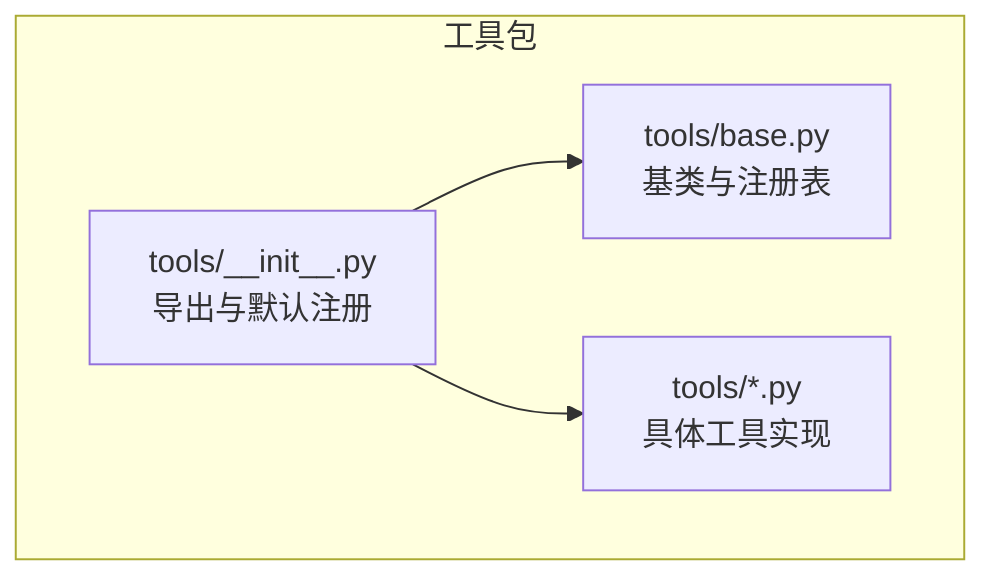
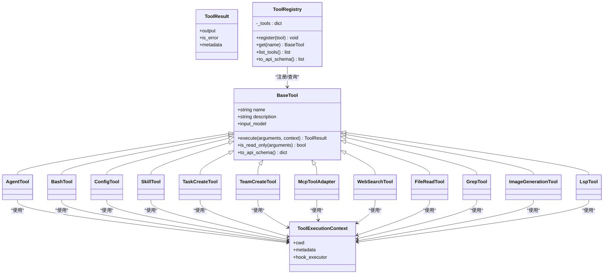
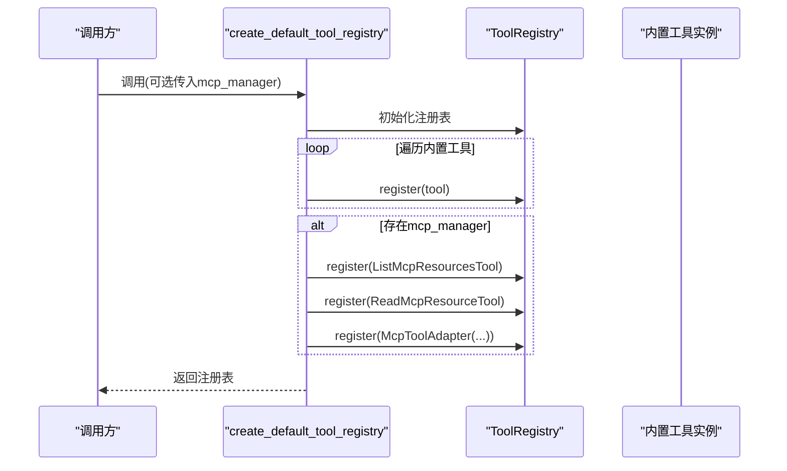
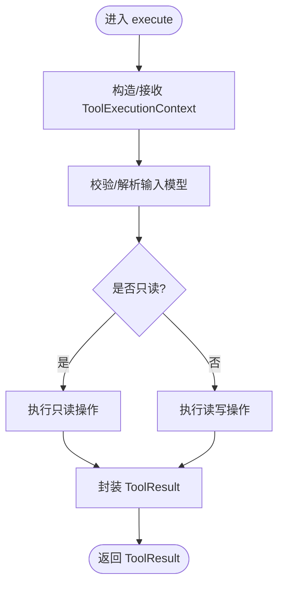
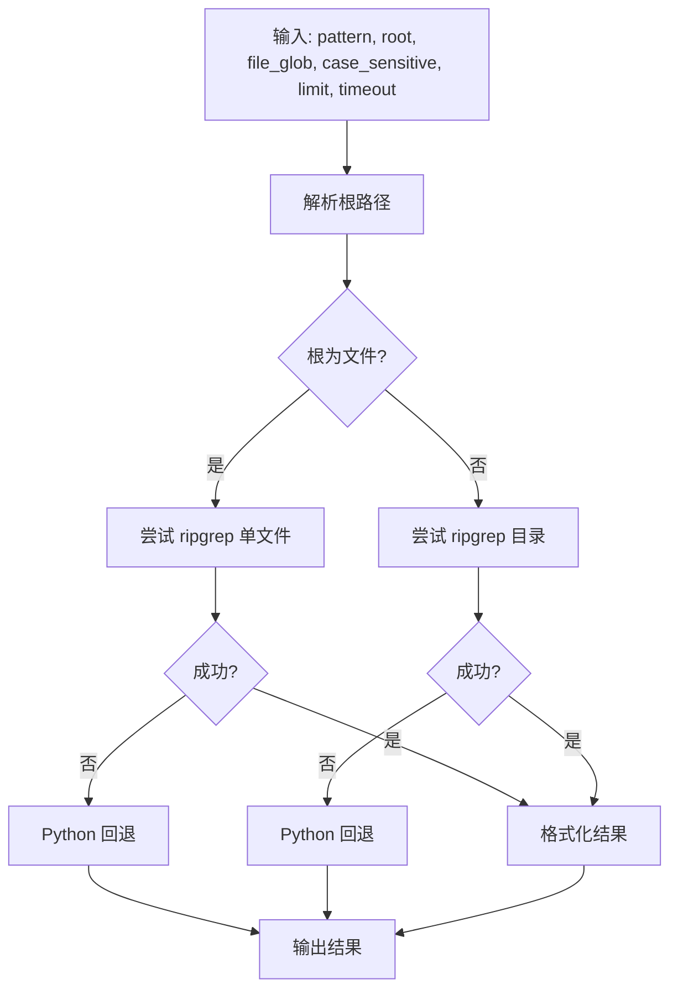
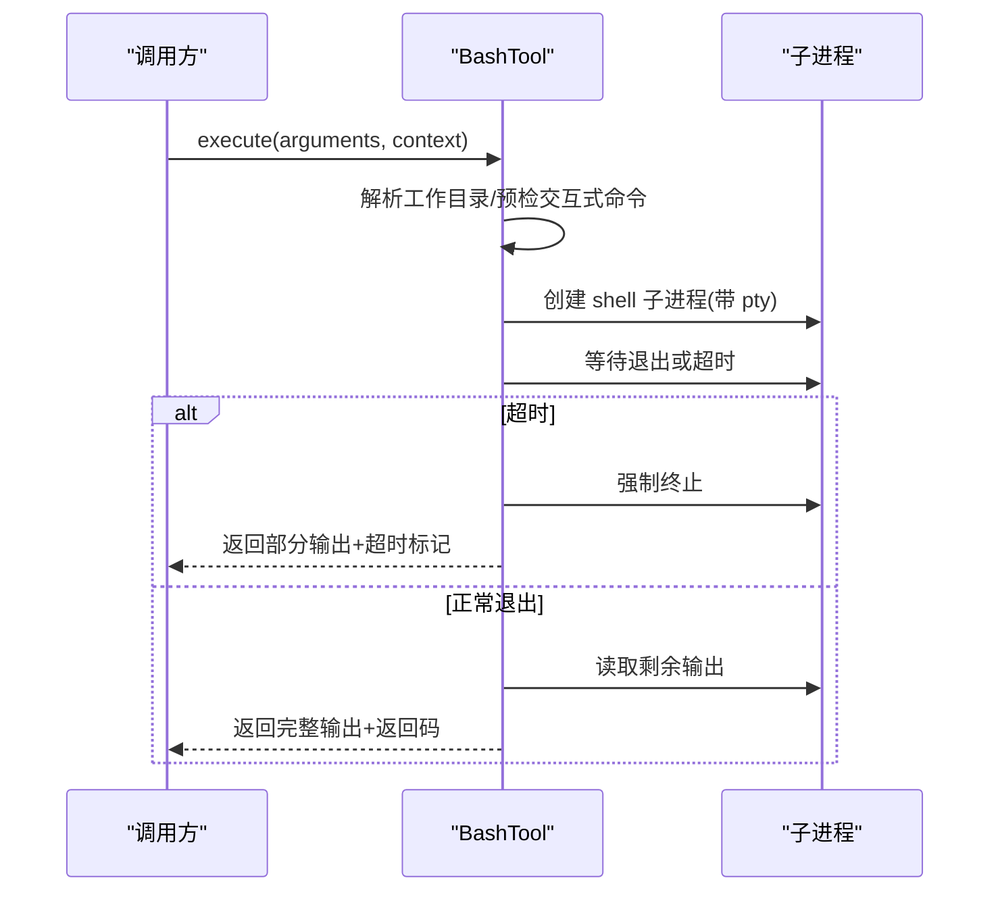
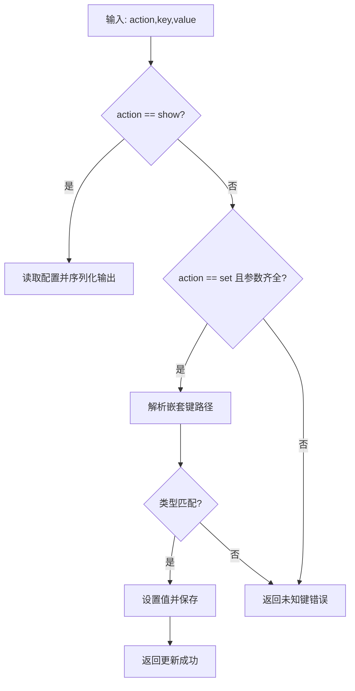
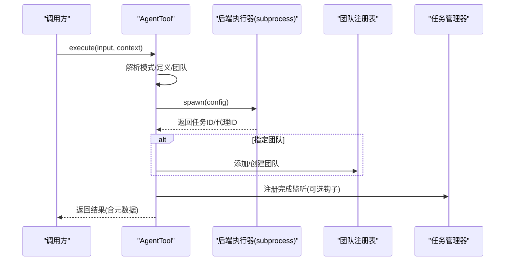
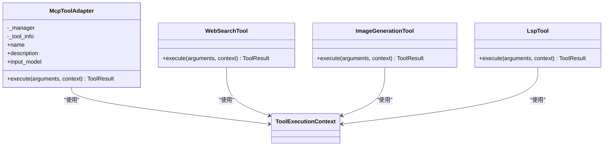
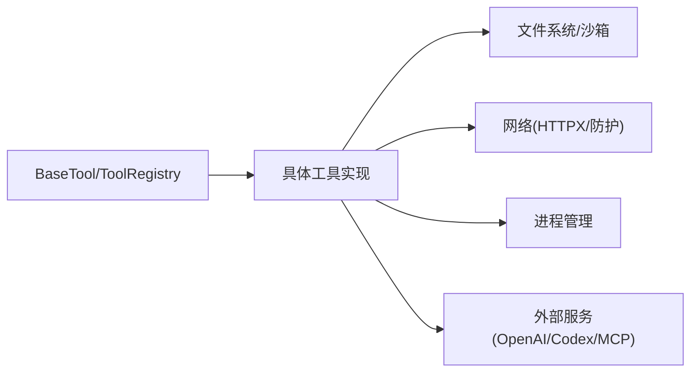

# 内置工具概览

<cite>
**本文引用的文件**
- [tools/__init__.py](file://src/openharness/tools/__init__.py)
- [tools/base.py](file://src/openharness/tools/base.py)
- [tools/agent_tool.py](file://src/openharness/tools/agent_tool.py)
- [tools/brief_tool.py](file://src/openharness/tools/brief_tool.py)
- [tools/bash_tool.py](file://src/openharness/tools/bash_tool.py)
- [tools/config_tool.py](file://src/openharness/tools/config_tool.py)
- [tools/skill_tool.py](file://src/openharness/tools/skill_tool.py)
- [tools/task_create_tool.py](file://src/openharness/tools/task_create_tool.py)
- [tools/team_create_tool.py](file://src/openharness/tools/team_create_tool.py)
- [tools/mcp_tool.py](file://src/openharness/tools/mcp_tool.py)
- [tools/web_search_tool.py](file://src/openharness/tools/web_search_tool.py)
- [tools/file_read_tool.py](file://src/openharness/tools/file_read_tool.py)
- [tools/grep_tool.py](file://src/openharness/tools/grep_tool.py)
- [tools/image_generation_tool.py](file://src/openharness/tools/image_generation_tool.py)
- [tools/lsp_tool.py](file://src/openharness/tools/lsp_tool.py)
</cite>

## 目录
1. [简介](#简介)
2. [项目结构](#项目结构)
3. [核心组件](#核心组件)
4. [架构总览](#架构总览)
5. [详细组件分析](#详细组件分析)
6. [依赖分析](#依赖分析)
7. [性能考虑](#性能考虑)
8. [故障排查指南](#故障排查指南)
9. [结论](#结论)
10. [附录](#附录)

## 简介
本文件为 OpenHarness 内置工具系统的概览文档，面向开发者与高级用户，系统性介绍 43+ 种内置工具的整体架构与分类体系，涵盖工具注册表的工作原理、工具基类设计、执行上下文管理、初始化流程与默认注册机制，并提供整体架构图与组件关系说明，帮助读者快速理解工具系统的设计理念与扩展方式。

## 项目结构
OpenHarness 的内置工具位于 tools 包中，采用“按功能分模块”的组织方式：每个工具独立实现为一个类，统一继承自抽象基类，通过工具注册表集中管理。默认注册流程由工厂函数负责，自动构建包含所有内置工具的注册表实例。

**图表来源**
- [tools/__init__.py:1-108](file://src/openharness/tools/__init__.py#L1-L108)
- [tools/base.py:1-81](file://src/openharness/tools/base.py#L1-L81)

**章节来源**
- [tools/__init__.py:1-108](file://src/openharness/tools/__init__.py#L1-L108)
- [tools/base.py:1-81](file://src/openharness/tools/base.py#L1-L81)

## 核心组件
- 工具基类与接口
  - 抽象基类定义了工具名称、描述、输入模型与异步执行接口；提供只读能力判定与 API 规范化输出。
- 执行上下文
  - 封装工作目录、元数据与钩子执行器，贯穿所有工具调用，便于跨工具共享环境与事件通知。
- 工具结果
  - 统一的标准化输出结构，包含文本输出、错误标记与附加元数据。
- 工具注册表
  - 提供工具名到实现的映射、查询、枚举与 API 模式导出能力。

上述组件共同构成工具系统的核心抽象层，确保工具实现的一致性与可扩展性。

**章节来源**
- [tools/base.py:17-81](file://src/openharness/tools/base.py#L17-L81)

## 架构总览
OpenHarness 的工具系统采用“基类 + 注册表 + 默认工厂”的三层架构：
- 基类层：统一规范工具行为与接口。
- 注册表层：集中管理工具实例，支持查询与模式导出。
- 工厂层：默认注册机制，按序创建并注册内置工具，必要时注入外部能力（如 MCP）。

**图表来源**
- [tools/base.py:35-81](file://src/openharness/tools/base.py#L35-L81)
- [tools/agent_tool.py:38-142](file://src/openharness/tools/agent_tool.py#L38-L142)
- [tools/bash_tool.py:27-219](file://src/openharness/tools/bash_tool.py#L27-L219)
- [tools/config_tool.py:21-55](file://src/openharness/tools/config_tool.py#L21-L55)
- [tools/skill_tool.py:17-44](file://src/openharness/tools/skill_tool.py#L17-L44)
- [tools/task_create_tool.py:23-57](file://src/openharness/tools/task_create_tool.py#L23-L57)
- [tools/team_create_tool.py:18-32](file://src/openharness/tools/team_create_tool.py#L18-L32)
- [tools/mcp_tool.py:14-73](file://src/openharness/tools/mcp_tool.py#L14-L73)
- [tools/web_search_tool.py:28-120](file://src/openharness/tools/web_search_tool.py#L28-L120)
- [tools/file_read_tool.py:20-73](file://src/openharness/tools/file_read_tool.py#L20-L73)
- [tools/grep_tool.py:29-375](file://src/openharness/tools/grep_tool.py#L29-L375)
- [tools/image_generation_tool.py:74-357](file://src/openharness/tools/image_generation_tool.py#L74-L357)
- [tools/lsp_tool.py:51-155](file://src/openharness/tools/lsp_tool.py#L51-L155)

## 详细组件分析

### 工具注册表与默认工厂
- 默认注册机制
  - 工厂函数创建注册表实例，遍历内置工具列表逐一注册；当存在 MCP 管理器时，额外注册 MCP 资源与工具适配器。
- 注册表能力
  - 支持按名获取、列举全部工具、导出 API 规范化模式，便于上层服务或前端展示工具清单。

**图表来源**
- [tools/__init__.py:48-98](file://src/openharness/tools/__init__.py#L48-L98)

**章节来源**
- [tools/__init__.py:48-98](file://src/openharness/tools/__init__.py#L48-L98)

### 工具基类与执行上下文
- 基类职责
  - 定义统一的异步执行接口、只读能力判定、API 模式导出；派生类仅需实现执行逻辑与输入模型。
- 执行上下文
  - 提供工作目录、通用元数据与钩子执行器，使工具可在不同运行环境中保持一致的调用体验。
- 结果标准化
  - 统一输出结构，便于上层处理错误、元数据与人类可读文本。

**图表来源**
- [tools/base.py:35-58](file://src/openharness/tools/base.py#L35-L58)
- [tools/base.py:17-33](file://src/openharness/tools/base.py#L17-L33)

**章节来源**
- [tools/base.py:17-81](file://src/openharness/tools/base.py#L17-L81)

### 典型工具类别与代表实现

#### 文件与内容类
- 文本文件读取
  - 功能：按行号范围读取本地文本文件，支持沙箱路径校验与二进制检测。
  - 关键点：路径解析、权限与类型校验、行号编号输出。
- 内容搜索
  - 功能：基于正则表达式搜索文件内容，优先使用 ripgrep，回退纯 Python 实现。
  - 关键点：超时控制、限流、输出格式化、Docker 环境下的命令执行。

**图表来源**
- [tools/grep_tool.py:40-94](file://src/openharness/tools/grep_tool.py#L40-L94)
- [tools/grep_tool.py:164-236](file://src/openharness/tools/grep_tool.py#L164-L236)
- [tools/grep_tool.py:239-308](file://src/openharness/tools/grep_tool.py#L239-L308)
- [tools/file_read_tool.py:31-65](file://src/openharness/tools/file_read_tool.py#L31-L65)

**章节来源**
- [tools/file_read_tool.py:20-73](file://src/openharness/tools/file_read_tool.py#L20-L73)
- [tools/grep_tool.py:29-375](file://src/openharness/tools/grep_tool.py#L29-L375)

#### Shell 与任务类
- Shell 命令执行
  - 功能：在本地仓库执行非交互式 shell 命令，捕获标准输出/错误，支持超时与强制终止。
  - 关键点：进程生命周期管理、超时处理、交互式脚手架提示、输出截断与格式化。
- 后台任务创建
  - 功能：创建本地 shell 或本地代理任务，支持描述与工作目录。
  - 关键点：任务类型校验、参数完整性检查、任务管理器集成。

**图表来源**
- [tools/bash_tool.py:34-85](file://src/openharness/tools/bash_tool.py#L34-L85)
- [tools/bash_tool.py:88-114](file://src/openharness/tools/bash_tool.py#L88-L114)
- [tools/bash_tool.py:144-152](file://src/openharness/tools/bash_tool.py#L144-L152)

**章节来源**
- [tools/bash_tool.py:27-219](file://src/openharness/tools/bash_tool.py#L27-L219)
- [tools/task_create_tool.py:23-57](file://src/openharness/tools/task_create_tool.py#L23-L57)

#### 配置与技能类
- 设置读取与更新
  - 功能：读取或设置 OpenHarness 配置项，支持嵌套键路径与类型转换。
- 技能内容读取
  - 功能：从技能注册表加载技能内容，支持大小写不敏感查找与禁用模型调用的提示。

**图表来源**
- [tools/config_tool.py:28-54](file://src/openharness/tools/config_tool.py#L28-L54)

**章节来源**
- [tools/config_tool.py:21-55](file://src/openharness/tools/config_tool.py#L21-L55)
- [tools/skill_tool.py:17-44](file://src/openharness/tools/skill_tool.py#L17-L44)

#### 团队与代理类
- 代理工具
  - 功能：在子进程后端启动本地/远程/同进程代理，支持团队注册与钩子事件上报。
- 团队创建
  - 功能：在内存中创建轻量级团队，用于代理任务编排。
- 任务工具族
  - 功能：创建/列出/获取/停止/输出/更新任务，与后台任务管理器集成。

**图表来源**
- [tools/agent_tool.py:45-141](file://src/openharness/tools/agent_tool.py#L45-L141)

**章节来源**
- [tools/agent_tool.py:38-142](file://src/openharness/tools/agent_tool.py#L38-L142)
- [tools/team_create_tool.py:18-32](file://src/openharness/tools/team_create_tool.py#L18-L32)
- [tools/task_create_tool.py:23-57](file://src/openharness/tools/task_create_tool.py#L23-L57)

#### MCP 与网络类
- MCP 工具适配器
  - 功能：将远端 MCP 工具动态暴露为本地工具，自动根据输入模式生成输入模型。
- 网络搜索
  - 功能：调用公共 HTML 搜索端点，解析标题/链接/摘要，限制最大结果数。
- 图像生成
  - 功能：支持 OpenAI 与 Codex 两种提供商，生成或编辑位图图像，支持多图输出与覆盖策略。
- LSP 代码智能
  - 功能：工作区符号检索、文档符号、跳转定义、引用查找、悬停信息，仅支持 Python 文件。

**图表来源**
- [tools/mcp_tool.py:14-73](file://src/openharness/tools/mcp_tool.py#L14-L73)
- [tools/web_search_tool.py:28-120](file://src/openharness/tools/web_search_tool.py#L28-L120)
- [tools/image_generation_tool.py:74-357](file://src/openharness/tools/image_generation_tool.py#L74-L357)
- [tools/lsp_tool.py:51-155](file://src/openharness/tools/lsp_tool.py#L51-L155)

**章节来源**
- [tools/mcp_tool.py:14-73](file://src/openharness/tools/mcp_tool.py#L14-L73)
- [tools/web_search_tool.py:28-120](file://src/openharness/tools/web_search_tool.py#L28-L120)
- [tools/image_generation_tool.py:74-357](file://src/openharness/tools/image_generation_tool.py#L74-L357)
- [tools/lsp_tool.py:51-155](file://src/openharness/tools/lsp_tool.py#L51-L155)

## 依赖分析
- 组件耦合
  - 工具实现依赖于注册表与基类，遵循“低耦合、高内聚”原则；工具间无直接依赖，通过上下文与服务层间接协作。
- 外部依赖
  - 进程管理：子进程创建与信号处理。
  - 网络访问：HTTP 客户端与网络防护。
  - 文件系统：路径解析、沙箱校验与权限控制。
  - 第三方服务：OpenAI/Codex 图像服务、MCP 服务器。
- 循环依赖
  - 当前结构未见循环导入；工具注册在模块顶层完成，避免运行时循环依赖。

**图表来源**
- [tools/base.py:35-81](file://src/openharness/tools/base.py#L35-L81)
- [tools/bash_tool.py:13-13](file://src/openharness/tools/bash_tool.py#L13-L13)
- [tools/web_search_tool.py:14-14](file://src/openharness/tools/web_search_tool.py#L14-L14)
- [tools/image_generation_tool.py:17-17](file://src/openharness/tools/image_generation_tool.py#L17-L17)
- [tools/mcp_tool.py:11-11](file://src/openharness/tools/mcp_tool.py#L11-L11)

**章节来源**
- [tools/base.py:35-81](file://src/openharness/tools/base.py#L35-L81)
- [tools/bash_tool.py:13-13](file://src/openharness/tools/bash_tool.py#L13-L13)
- [tools/web_search_tool.py:14-14](file://src/openharness/tools/web_search_tool.py#L14-L14)
- [tools/image_generation_tool.py:17-17](file://src/openharness/tools/image_generation_tool.py#L17-L17)
- [tools/mcp_tool.py:11-11](file://src/openharness/tools/mcp_tool.py#L11-L11)

## 性能考虑
- I/O 与超时
  - Shell 与搜索工具均设置超时与输出截断，避免长时间阻塞；搜索工具在 Docker 环境下通过会话执行命令，减少主机资源占用。
- 并发与流式
  - 图像生成采用流式 SSE 处理，逐步产出结果；搜索工具解析 HTML 时进行片段裁剪与去噪，降低内存压力。
- 回退策略
  - 搜索工具优先使用高性能工具（如 ripgrep），失败时回退至纯 Python 实现，保证可用性与可移植性。
- 只读工具
  - 大多数查询类工具声明为只读，便于缓存与并发安全。

[本节为通用指导，无需特定文件来源]

## 故障排查指南
- 交互式命令无法执行
  - 现象：返回需要交互的提示与非交互建议。
  - 处理：为脚手架命令添加非交互标志，或在外部终端先行执行。
- 命令超时
  - 现象：返回超时信息与部分输出。
  - 处理：缩短任务时间、优化命令、或在外部终端验证。
- 文件访问受限
  - 现象：沙箱拒绝访问或路径无效。
  - 处理：确认路径合法性与沙箱白名单，避免读取二进制文件。
- 网络搜索失败
  - 现象：网络防护或 HTTP 错误。
  - 处理：检查网络策略与代理配置，或更换搜索端点。
- 图像生成失败
  - 现象：API 密钥缺失或提供商不可用。
  - 处理：配置相应密钥或切换提供商，检查输出目录权限。

**章节来源**
- [tools/bash_tool.py:155-219](file://src/openharness/tools/bash_tool.py#L155-L219)
- [tools/file_read_tool.py:38-54](file://src/openharness/tools/file_read_tool.py#L38-L54)
- [tools/web_search_tool.py:44-55](file://src/openharness/tools/web_search_tool.py#L44-L55)
- [tools/image_generation_tool.py:132-136](file://src/openharness/tools/image_generation_tool.py#L132-L136)

## 结论
OpenHarness 的内置工具系统以清晰的抽象层与注册机制为核心，通过默认工厂实现开箱即用的工具集，并为扩展提供了稳定接口。工具分类覆盖文件/内容、Shell/任务、配置/技能、团队/代理、MCP/网络与图像/LSP 等场景，既满足日常开发需求，又为复杂任务编排与外部能力接入提供便利。建议在扩展新工具时遵循基类约定、输入模型约束与只读声明，确保一致性与可维护性。

[本节为总结性内容，无需特定文件来源]

## 附录
- 默认注册工具清单（节选）
  - 命令执行：bash
  - 文件操作：read_file、grep、read_mcp_resource、list_mcp_resources
  - 编辑与笔记：file_edit、notebook_edit
  - 代码智能：lsp
  - 图像：image_generation、image_to_text
  - 技能与搜索：skill、web_search、web_fetch、tool_search
  - 配置与摘要：config、brief
  - 休眠：sleep
  - 工作树与计划模式：enter_worktree、exit_worktree、enter_plan_mode、exit_plan_mode
  - 计划任务：cron_create、cron_list、cron_delete、cron_toggle
  - 远程触发：remote_trigger
  - 任务管理：task_create、task_get、task_list、task_stop、task_output、task_update
  - 代理与消息：agent、send_message
  - 团队：team_create、team_delete
  - MCP 工具适配：mcp__{server}__{tool}

**章节来源**
- [tools/__init__.py:48-98](file://src/openharness/tools/__init__.py#L48-L98)