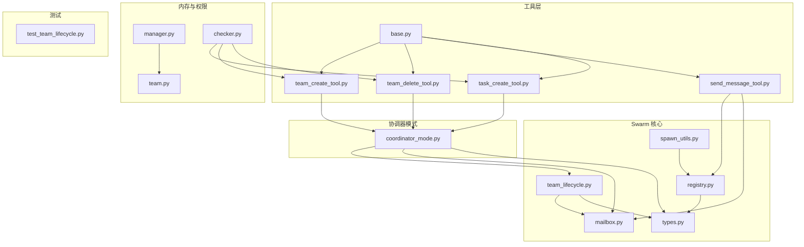
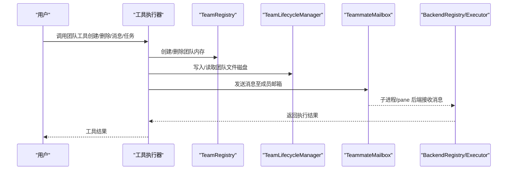
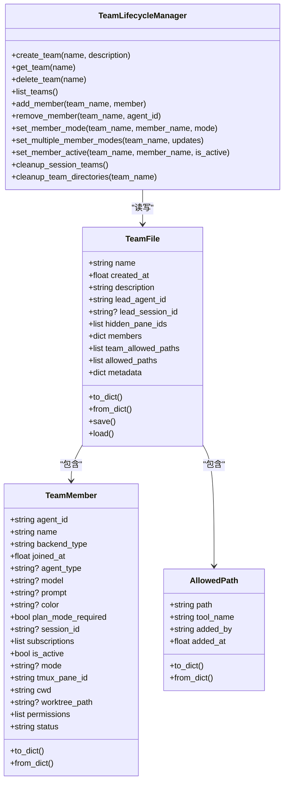
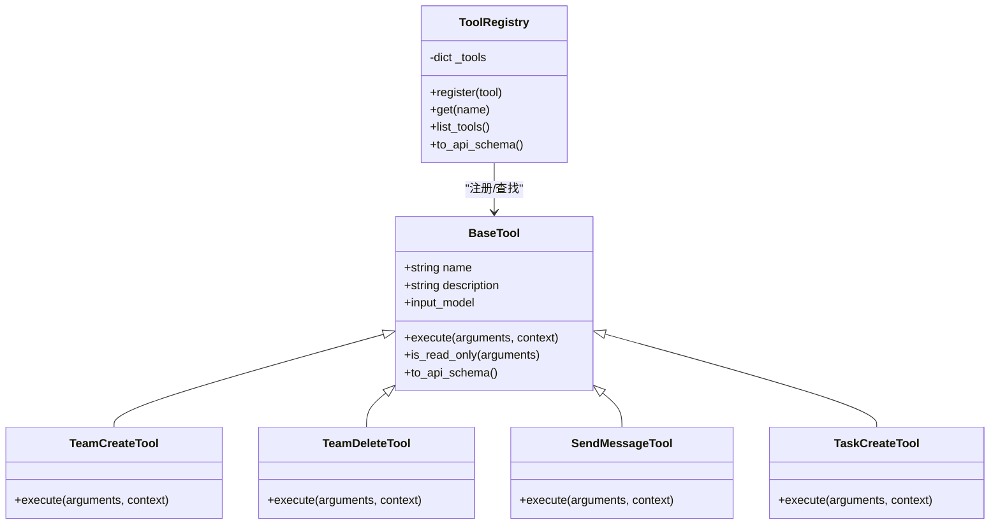
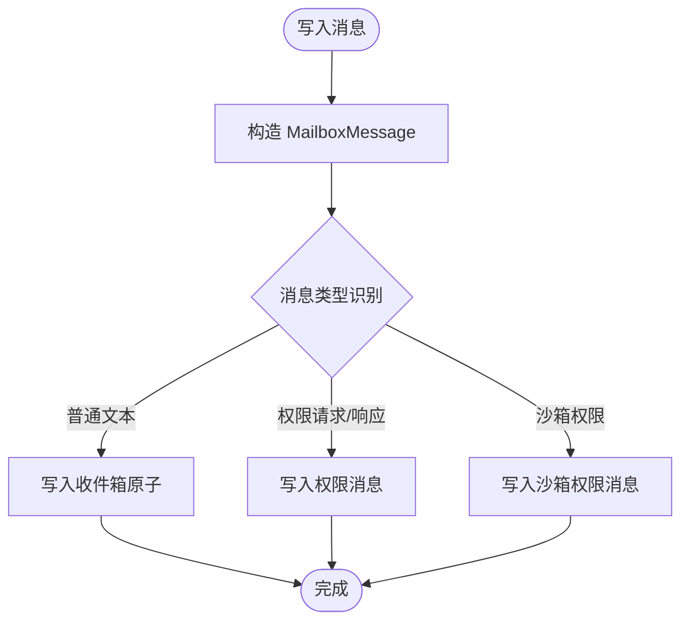
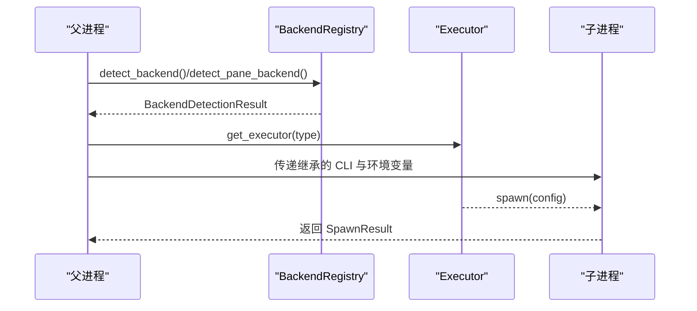
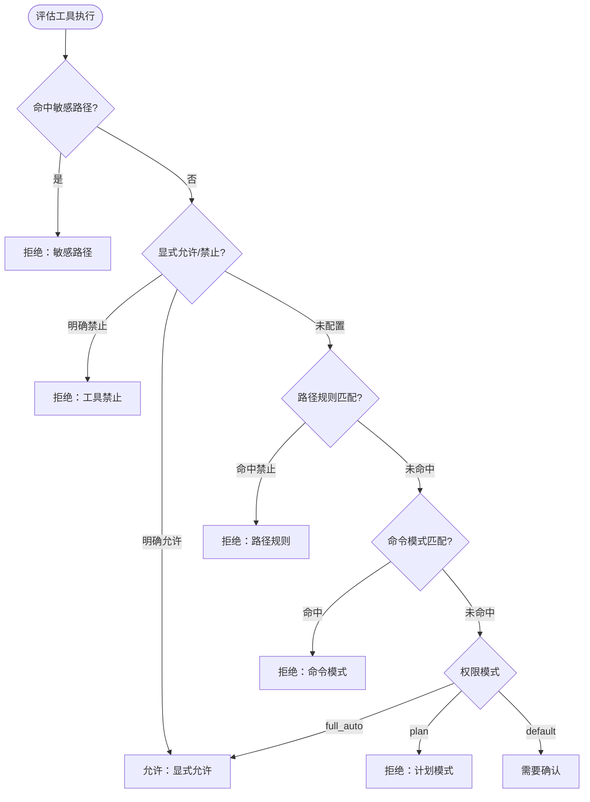
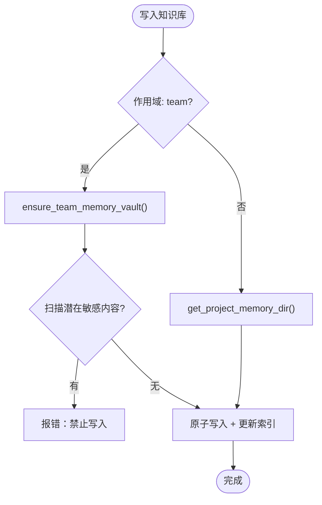
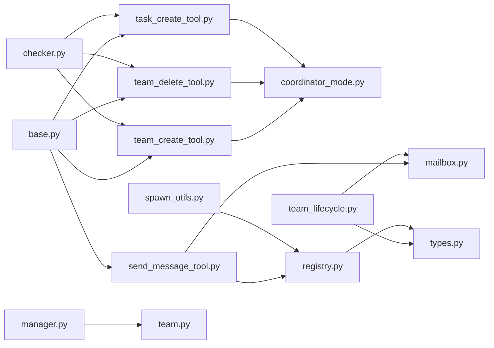

# 团队协调工具

<cite>
**本文引用的文件**
- [team_create_tool.py](file://src/openharness/tools/team_create_tool.py)
- [team_delete_tool.py](file://src/openharness/tools/team_delete_tool.py)
- [team_lifecycle.py](file://src/openharness/swarm/team_lifecycle.py)
- [team.py](file://src/openharness/memory/team.py)
- [types.py](file://src/openharness/swarm/types.py)
- [coordinator_mode.py](file://src/openharness/coordinator/coordinator_mode.py)
- [mailbox.py](file://src/openharness/swarm/mailbox.py)
- [base.py](file://src/openharness/tools/base.py)
- [registry.py](file://src/openharness/swarm/registry.py)
- [manager.py](file://src/openharness/memory/manager.py)
- [spawn_utils.py](file://src/openharness/swarm/spawn_utils.py)
- [send_message_tool.py](file://src/openharness/tools/send_message_tool.py)
- [task_create_tool.py](file://src/openharness/tools/task_create_tool.py)
- [checker.py](file://src/openharness/permissions/checker.py)
- [test_team_lifecycle.py](file://tests/test_swarm/test_team_lifecycle.py)
</cite>

## 目录
1. [简介](#简介)
2. [项目结构](#项目结构)
3. [核心组件](#核心组件)
4. [架构总览](#架构总览)
5. [详细组件分析](#详细组件分析)
6. [依赖关系分析](#依赖关系分析)
7. [性能考量](#性能考量)
8. [故障排查指南](#故障排查指南)
9. [结论](#结论)
10. [附录](#附录)

## 简介
本技术文档面向“团队协调工具”，系统性阐述基于多代理协作的团队管理能力与实现细节。重点覆盖以下方面：
- 代理工具：团队创建、删除、消息发送、任务创建等核心工具
- 团队生命周期：团队的持久化存储、成员管理、状态同步与清理
- 权限控制：工具执行权限策略、敏感路径保护与模式切换
- 通信机制：文件邮箱（Mailbox）异步消息队列、跨进程/跨终端通信
- 高级能力：团队配置、动态扩缩容、故障恢复与会话清理
- 实际场景：并行研究、任务分解、验证与回滚、跨文件变更协调

## 项目结构
围绕团队协调的关键模块分布如下：
- 工具层：team_create_tool、team_delete_tool、send_message_tool、task_create_tool
- 协调器模式：coordinator_mode 提供环境检测、工具集与系统提示
- Swarm 生命周期与类型：team_lifecycle、types 定义团队数据模型与后端类型
- 通信与邮箱：mailbox 提供文件型异步消息队列
- 执行后端注册与选择：registry、spawn_utils
- 内存与安全：memory.manager、memory.team、permissions.checker
- 测试：test_swarm/test_team_lifecycle 验证生命周期 CRUD

图表来源
- [team_create_tool.py:1-32](file://src/openharness/tools/team_create_tool.py#L1-L32)
- [team_delete_tool.py:1-31](file://src/openharness/tools/team_delete_tool.py#L1-L31)
- [send_message_tool.py:1-59](file://src/openharness/tools/send_message_tool.py#L1-L59)
- [task_create_tool.py:1-57](file://src/openharness/tools/task_create_tool.py#L1-L57)
- [base.py:1-81](file://src/openharness/tools/base.py#L1-L81)
- [coordinator_mode.py:1-521](file://src/openharness/coordinator/coordinator_mode.py#L1-L521)
- [team_lifecycle.py:1-911](file://src/openharness/swarm/team_lifecycle.py#L1-L911)
- [types.py:1-399](file://src/openharness/swarm/types.py#L1-L399)
- [mailbox.py:1-523](file://src/openharness/swarm/mailbox.py#L1-L523)
- [registry.py:1-411](file://src/openharness/swarm/registry.py#L1-L411)
- [spawn_utils.py:1-217](file://src/openharness/swarm/spawn_utils.py#L1-L217)
- [manager.py:1-184](file://src/openharness/memory/manager.py#L1-L184)
- [team.py:1-91](file://src/openharness/memory/team.py#L1-L91)
- [checker.py:1-201](file://src/openharness/permissions/checker.py#L1-L201)
- [test_team_lifecycle.py:1-198](file://tests/test_swarm/test_team_lifecycle.py#L1-L198)

章节来源
- [team_create_tool.py:1-32](file://src/openharness/tools/team_create_tool.py#L1-L32)
- [team_delete_tool.py:1-31](file://src/openharness/tools/team_delete_tool.py#L1-L31)
- [coordinator_mode.py:1-521](file://src/openharness/coordinator/coordinator_mode.py#L1-L521)
- [team_lifecycle.py:1-911](file://src/openharness/swarm/team_lifecycle.py#L1-L911)
- [types.py:1-399](file://src/openharness/swarm/types.py#L1-L399)
- [mailbox.py:1-523](file://src/openharness/swarm/mailbox.py#L1-L523)
- [registry.py:1-411](file://src/openharness/swarm/registry.py#L1-L411)
- [spawn_utils.py:1-217](file://src/openharness/swarm/spawn_utils.py#L1-L217)
- [manager.py:1-184](file://src/openharness/memory/manager.py#L1-L184)
- [team.py:1-91](file://src/openharness/memory/team.py#L1-L91)
- [checker.py:1-201](file://src/openharness/permissions/checker.py#L1-L201)
- [test_team_lifecycle.py:1-198](file://tests/test_swarm/test_team_lifecycle.py#L1-L198)

## 核心组件
- 工具抽象与注册：BaseTool、ToolResult、ToolExecutionContext、ToolRegistry 提供统一工具接口与注册表
- 团队工具：team_create_tool、team_delete_tool 基于协调器模式的 TeamRegistry 进行团队的内存创建与删除
- 协调器模式：coordinator_mode 提供环境检测、工具集、系统提示与通知格式
- 生命周期管理：team_lifecycle 提供 TeamFile、TeamMember、AllowedPath 的序列化与磁盘持久化，以及成员增删、模式同步、会话清理等
- 通信邮箱：mailbox 提供文件型异步消息队列，支持原子写入、读取、标记已读、清空与多种消息类型
- 后端执行：registry 负责后端检测与选择（in_process、tmux、subprocess），spawn_utils 提供命令与环境变量继承
- 内存与安全：memory.manager 统一管理项目/团队知识库；memory.team 限制敏感内容写入；permissions.checker 实施权限策略
- 消息发送：send_message_tool 将消息路由到子进程或 Swarm 成员
- 任务创建：task_create_tool 支持本地 Bash 与本地 Agent 两类后台任务

章节来源
- [base.py:1-81](file://src/openharness/tools/base.py#L1-L81)
- [team_create_tool.py:18-32](file://src/openharness/tools/team_create_tool.py#L18-L32)
- [team_delete_tool.py:17-31](file://src/openharness/tools/team_delete_tool.py#L17-L31)
- [coordinator_mode.py:66-72](file://src/openharness/coordinator/coordinator_mode.py#L66-L72)
- [team_lifecycle.py:780-860](file://src/openharness/swarm/team_lifecycle.py#L780-L860)
- [mailbox.py:102-230](file://src/openharness/swarm/mailbox.py#L102-L230)
- [registry.py:97-183](file://src/openharness/swarm/registry.py#L97-L183)
- [spawn_utils.py:70-182](file://src/openharness/swarm/spawn_utils.py#L70-L182)
- [manager.py:39-121](file://src/openharness/memory/manager.py#L39-L121)
- [team.py:34-91](file://src/openharness/memory/team.py#L34-L91)
- [checker.py:57-156](file://src/openharness/permissions/checker.py#L57-L156)
- [send_message_tool.py:24-59](file://src/openharness/tools/send_message_tool.py#L24-L59)
- [task_create_tool.py:23-57](file://src/openharness/tools/task_create_tool.py#L23-L57)

## 架构总览
下图展示从工具调用到团队生命周期与通信的全链路：

图表来源
- [team_create_tool.py:25-32](file://src/openharness/tools/team_create_tool.py#L25-L32)
- [team_delete_tool.py:24-31](file://src/openharness/tools/team_delete_tool.py#L24-L31)
- [coordinator_mode.py:66-72](file://src/openharness/coordinator/coordinator_mode.py#L66-L72)
- [team_lifecycle.py:796-860](file://src/openharness/swarm/team_lifecycle.py#L796-L860)
- [mailbox.py:126-230](file://src/openharness/swarm/mailbox.py#L126-L230)
- [registry.py:270-291](file://src/openharness/swarm/registry.py#L270-L291)

## 详细组件分析

### 组件A：团队生命周期管理（TeamLifecycleManager）
- 数据模型
  - TeamMember：成员信息（agent_id、name、backend_type、joined_at、agent_type、model、prompt、color、plan_mode_required、session_id、subscriptions、is_active、mode、tmux_pane_id、cwd、worktree_path、permissions、status）
  - TeamFile：团队元数据（name、description、created_at、lead_agent_id、lead_session_id、hidden_pane_ids、members、team_allowed_paths、allowed_paths、metadata）
  - AllowedPath：允许路径规则（path、tool_name、added_by、added_at）
- 核心能力
  - 团队 CRUD：create_team、get_team、delete_team、list_teams
  - 成员管理：add_member、remove_member、remove_teammate_from_team_file、remove_member_from_team、remove_member_by_agent_id
  - 模式与状态：set_member_mode、set_multiple_member_modes、sync_teammate_mode、set_member_active
  - 会话清理：register_team_for_session_cleanup、unregister_team_for_session_cleanup、cleanup_session_teams、cleanup_team_directories
  - 文件持久化：read_team_file、write_team_file、read_team_file_async、write_team_file_async
- 复杂度与性能
  - 序列化/反序列化 O(n)（n 为成员数量）
  - 异步读写通过线程池避免阻塞事件循环
  - 会话清理并发处理多个团队目录

图表来源
- [team_lifecycle.py:57-186](file://src/openharness/swarm/team_lifecycle.py#L57-L186)
- [team_lifecycle.py:189-257](file://src/openharness/swarm/team_lifecycle.py#L189-L257)
- [team_lifecycle.py:780-860](file://src/openharness/swarm/team_lifecycle.py#L780-L860)

章节来源
- [team_lifecycle.py:57-280](file://src/openharness/swarm/team_lifecycle.py#L57-L280)
- [team_lifecycle.py:304-466](file://src/openharness/swarm/team_lifecycle.py#L304-L466)
- [team_lifecycle.py:612-692](file://src/openharness/swarm/team_lifecycle.py#L612-L692)
- [team_lifecycle.py:746-773](file://src/openharness/swarm/team_lifecycle.py#L746-L773)

### 组件B：工具抽象与团队工具
- BaseTool 抽象：定义工具名称、描述、输入模型、执行方法与只读判断
- ToolRegistry 注册表：按名称注册与查找工具，输出 API 规格
- 团队工具
  - team_create_tool：调用 get_team_registry().create_team
  - team_delete_tool：调用 get_team_registry().delete_team
  - send_message_tool：通过后端执行器向 Swarm 成员发送消息
  - task_create_tool：创建本地 Bash 或本地 Agent 任务

图表来源
- [base.py:35-81](file://src/openharness/tools/base.py#L35-L81)
- [team_create_tool.py:18-32](file://src/openharness/tools/team_create_tool.py#L18-L32)
- [team_delete_tool.py:17-31](file://src/openharness/tools/team_delete_tool.py#L17-L31)
- [send_message_tool.py:24-59](file://src/openharness/tools/send_message_tool.py#L24-L59)
- [task_create_tool.py:23-57](file://src/openharness/tools/task_create_tool.py#L23-L57)

章节来源
- [base.py:17-81](file://src/openharness/tools/base.py#L17-L81)
- [team_create_tool.py:18-32](file://src/openharness/tools/team_create_tool.py#L18-L32)
- [team_delete_tool.py:17-31](file://src/openharness/tools/team_delete_tool.py#L17-L31)
- [send_message_tool.py:24-59](file://src/openharness/tools/send_message_tool.py#L24-L59)
- [task_create_tool.py:23-57](file://src/openharness/tools/task_create_tool.py#L23-L57)

### 组件C：通信与消息队列（Mailbox）
- MailboxMessage：消息体（id、type、sender、recipient、payload、timestamp、read）
- TeammateMailbox：每个 agent 的收件箱，文件型原子写入、批量读取、标记已读、清空
- 类型守卫：is_permission_request、is_permission_response、is_sandbox_permission_request、is_sandbox_permission_response
- 全局写入：write_to_mailbox 支持不同消息类型的自动识别与路由

图表来源
- [mailbox.py:126-230](file://src/openharness/swarm/mailbox.py#L126-L230)
- [mailbox.py:403-461](file://src/openharness/swarm/mailbox.py#L403-L461)
- [mailbox.py:469-523](file://src/openharness/swarm/mailbox.py#L469-L523)

章节来源
- [mailbox.py:38-76](file://src/openharness/swarm/mailbox.py#L38-L76)
- [mailbox.py:102-230](file://src/openharness/swarm/mailbox.py#L102-L230)
- [mailbox.py:403-461](file://src/openharness/swarm/mailbox.py#L403-L461)
- [mailbox.py:469-523](file://src/openharness/swarm/mailbox.py#L469-L523)

### 组件D：后端执行与环境传播
- BackendRegistry：检测并选择最佳执行后端（in_process、tmux、subprocess），缓存检测结果
- BackendDetectionResult：返回后端类型、是否原生环境、是否需要额外设置
- spawn_utils：构建继承 CLI 参数与环境变量，确保子进程与父进程一致的配置与权限模式

图表来源
- [registry.py:128-183](file://src/openharness/swarm/registry.py#L128-L183)
- [registry.py:185-269](file://src/openharness/swarm/registry.py#L185-L269)
- [spawn_utils.py:70-182](file://src/openharness/swarm/spawn_utils.py#L70-L182)

章节来源
- [registry.py:97-183](file://src/openharness/swarm/registry.py#L97-L183)
- [registry.py:185-269](file://src/openharness/swarm/registry.py#L185-L269)
- [spawn_utils.py:70-182](file://src/openharness/swarm/spawn_utils.py#L70-L182)

### 组件E：权限控制与安全
- PermissionChecker：根据权限模式与规则评估工具执行许可，内置敏感路径白名单与命令模式匹配
- 敏感路径保护：对 SSH、AWS、GCP、Azure、GPG、Docker、K8s、OpenHarness 凭据目录进行严格限制
- 模式策略：full_auto（全放行）、default（默认需确认）、plan（计划模式阻止变更）

图表来源
- [checker.py:75-156](file://src/openharness/permissions/checker.py#L75-L156)
- [checker.py:18-37](file://src/openharness/permissions/checker.py#L18-L37)

章节来源
- [checker.py:57-156](file://src/openharness/permissions/checker.py#L57-L156)
- [checker.py:18-37](file://src/openharness/permissions/checker.py#L18-L37)

### 组件F：内存与团队知识库
- memory.manager：统一管理项目/团队知识库，支持去重、签名、索引更新与软删除
- memory.team：团队共享内存目录的创建与安全校验，防止路径逃逸与敏感内容写入

图表来源
- [manager.py:39-121](file://src/openharness/memory/manager.py#L39-L121)
- [team.py:34-91](file://src/openharness/memory/team.py#L34-L91)

章节来源
- [manager.py:39-121](file://src/openharness/memory/manager.py#L39-L121)
- [team.py:34-91](file://src/openharness/memory/team.py#L34-L91)

## 依赖关系分析
- 工具层依赖协调器模式与工具抽象，团队工具进一步依赖 TeamRegistry
- 生命周期管理依赖邮箱模块以实现成员间通信，并与类型定义协同
- 后端注册依赖平台能力检测，spawn_utils 提供环境与参数继承
- 权限检查贯穿工具执行路径，保障安全边界
- 内存管理与团队知识库相互配合，提供跨成员的知识共享与安全校验

图表来源
- [base.py:35-81](file://src/openharness/tools/base.py#L35-L81)
- [team_create_tool.py:7-8](file://src/openharness/tools/team_create_tool.py#L7-L8)
- [team_delete_tool.py:7-8](file://src/openharness/tools/team_delete_tool.py#L7-L8)
- [send_message_tool.py:9-12](file://src/openharness/tools/send_message_tool.py#L9-L12)
- [task_create_tool.py:9-10](file://src/openharness/tools/task_create_tool.py#L9-L10)
- [coordinator_mode.py:7-8](file://src/openharness/coordinator/coordinator_mode.py#L7-L8)
- [team_lifecycle.py:25-26](file://src/openharness/swarm/team_lifecycle.py#L25-L26)
- [registry.py:10-12](file://src/openharness/swarm/registry.py#L10-L12)
- [spawn_utils.py:10-11](file://src/openharness/swarm/spawn_utils.py#L10-L11)
- [manager.py:8-27](file://src/openharness/memory/manager.py#L8-L27)
- [team.py:9-10](file://src/openharness/memory/team.py#L9-L10)
- [checker.py:9-10](file://src/openharness/permissions/checker.py#L9-L10)

章节来源
- [base.py:35-81](file://src/openharness/tools/base.py#L35-L81)
- [team_create_tool.py:7-8](file://src/openharness/tools/team_create_tool.py#L7-L8)
- [team_delete_tool.py:7-8](file://src/openharness/tools/team_delete_tool.py#L7-L8)
- [send_message_tool.py:9-12](file://src/openharness/tools/send_message_tool.py#L9-L12)
- [task_create_tool.py:9-10](file://src/openharness/tools/task_create_tool.py#L9-L10)
- [coordinator_mode.py:7-8](file://src/openharness/coordinator/coordinator_mode.py#L7-L8)
- [team_lifecycle.py:25-26](file://src/openharness/swarm/team_lifecycle.py#L25-L26)
- [registry.py:10-12](file://src/openharness/swarm/registry.py#L10-L12)
- [spawn_utils.py:10-11](file://src/openharness/swarm/spawn_utils.py#L10-L11)
- [manager.py:8-27](file://src/openharness/memory/manager.py#L8-L27)
- [team.py:9-10](file://src/openharness/memory/team.py#L9-L10)
- [checker.py:9-10](file://src/openharness/permissions/checker.py#L9-L10)

## 性能考量
- 异步 I/O：邮箱读写通过线程池执行阻塞操作，避免事件循环阻塞
- 原子写入：消息文件先写临时文件再重命名，保证并发读取一致性
- 缓存检测：后端检测结果在进程内缓存，减少重复检测开销
- 并发清理：会话结束时并发清理多个团队目录与 pane，提升回收效率
- 序列化成本：TeamFile 成员较多时，序列化/反序列化为 O(n)，建议分批操作或增量更新

## 故障排查指南
- 团队创建失败
  - 检查团队名是否已存在；查看工具返回错误信息
  - 参考路径：[team_create_tool.py:25-32](file://src/openharness/tools/team_create_tool.py#L25-L32)
- 团队删除失败
  - 确认团队是否存在；检查异常抛出位置
  - 参考路径：[team_delete_tool.py:24-31](file://src/openharness/tools/team_delete_tool.py#L24-L31)
- 消息发送失败
  - 检查 agent_id 格式（name@team）与后端可用性；查看执行器 send_message 结果
  - 参考路径：[send_message_tool.py:31-59](file://src/openharness/tools/send_message_tool.py#L31-L59)
- 会话清理异常
  - 确认是否注册了会话清理；检查 pane 后端可用性与权限
  - 参考路径：[team_lifecycle.py:612-692](file://src/openharness/swarm/team_lifecycle.py#L612-L692)
- 权限被拒绝
  - 检查权限模式与规则；确认是否命中敏感路径或命令模式
  - 参考路径：[checker.py:75-156](file://src/openharness/permissions/checker.py#L75-L156)

章节来源
- [team_create_tool.py:25-32](file://src/openharness/tools/team_create_tool.py#L25-L32)
- [team_delete_tool.py:24-31](file://src/openharness/tools/team_delete_tool.py#L24-L31)
- [send_message_tool.py:31-59](file://src/openharness/tools/send_message_tool.py#L31-L59)
- [team_lifecycle.py:612-692](file://src/openharness/swarm/team_lifecycle.py#L612-L692)
- [checker.py:75-156](file://src/openharness/permissions/checker.py#L75-L156)

## 结论
本团队协调工具通过“工具层—生命周期—通信—执行—权限—内存”的完整栈，实现了轻量、可扩展且安全的多代理协作框架。其关键优势包括：
- 清晰的工具抽象与注册机制，便于扩展新工具
- 基于文件的生命周期与邮箱通信，降低耦合、提升可靠性
- 灵活的后端选择与环境传播，适配多种运行环境
- 严格的权限策略与敏感路径保护，保障安全边界
- 完备的测试覆盖，确保生命周期 CRUD 的正确性

## 附录
- 实际应用场景示例（路径指引）
  - 并行研究与任务分解：使用协调器模式与 Agent 工具启动多个研究者并行工作，参考系统提示与工具集
    - 参考路径：[coordinator_mode.py:252-521](file://src/openharness/coordinator/coordinator_mode.py#L252-L521)
  - 动态扩缩容：通过 TeamLifecycleManager 增加/移除成员，结合后端注册与 spawn_utils 实现动态扩容
    - 参考路径：[team_lifecycle.py:346-466](file://src/openharness/swarm/team_lifecycle.py#L346-L466)、[registry.py:270-291](file://src/openharness/swarm/registry.py#L270-L291)、[spawn_utils.py:70-182](file://src/openharness/swarm/spawn_utils.py#L70-L182)
  - 故障恢复：利用会话清理流程，确保异常退出时的 pane 与目录清理
    - 参考路径：[team_lifecycle.py:671-692](file://src/openharness/swarm/team_lifecycle.py#L671-L692)、[team_lifecycle.py:746-773](file://src/openharness/swarm/team_lifecycle.py#L746-L773)
  - 权限控制：在默认模式下对变更类工具进行确认，必要时切换到 full_auto 模式
    - 参考路径：[checker.py:128-156](file://src/openharness/permissions/checker.py#L128-L156)
  - 团队配置：通过 TeamFile 的 metadata 字段保存团队配置，结合 AllowedPath 控制编辑范围
    - 参考路径：[team_lifecycle.py:189-257](file://src/openharness/swarm/team_lifecycle.py#L189-L257)

章节来源
- [coordinator_mode.py:252-521](file://src/openharness/coordinator/coordinator_mode.py#L252-L521)
- [team_lifecycle.py:346-466](file://src/openharness/swarm/team_lifecycle.py#L346-L466)
- [registry.py:270-291](file://src/openharness/swarm/registry.py#L270-L291)
- [spawn_utils.py:70-182](file://src/openharness/swarm/spawn_utils.py#L70-L182)
- [team_lifecycle.py:671-692](file://src/openharness/swarm/team_lifecycle.py#L671-L692)
- [team_lifecycle.py:746-773](file://src/openharness/swarm/team_lifecycle.py#L746-L773)
- [checker.py:128-156](file://src/openharness/permissions/checker.py#L128-L156)
- [team_lifecycle.py:189-257](file://src/openharness/swarm/team_lifecycle.py#L189-L257)