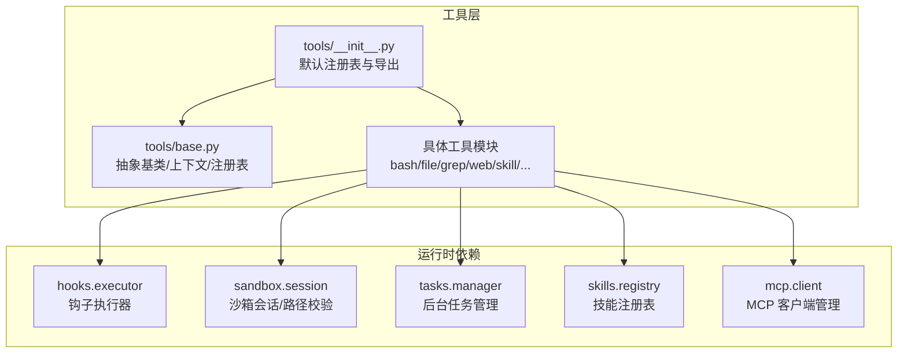
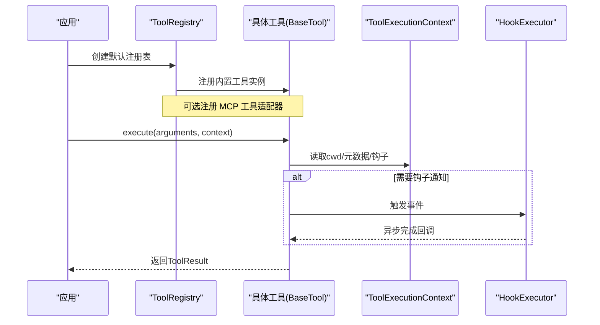
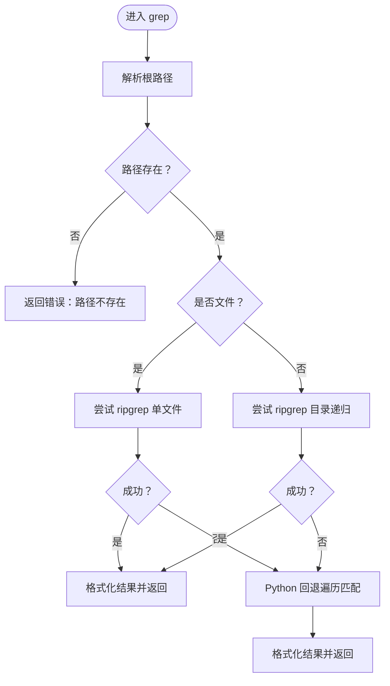
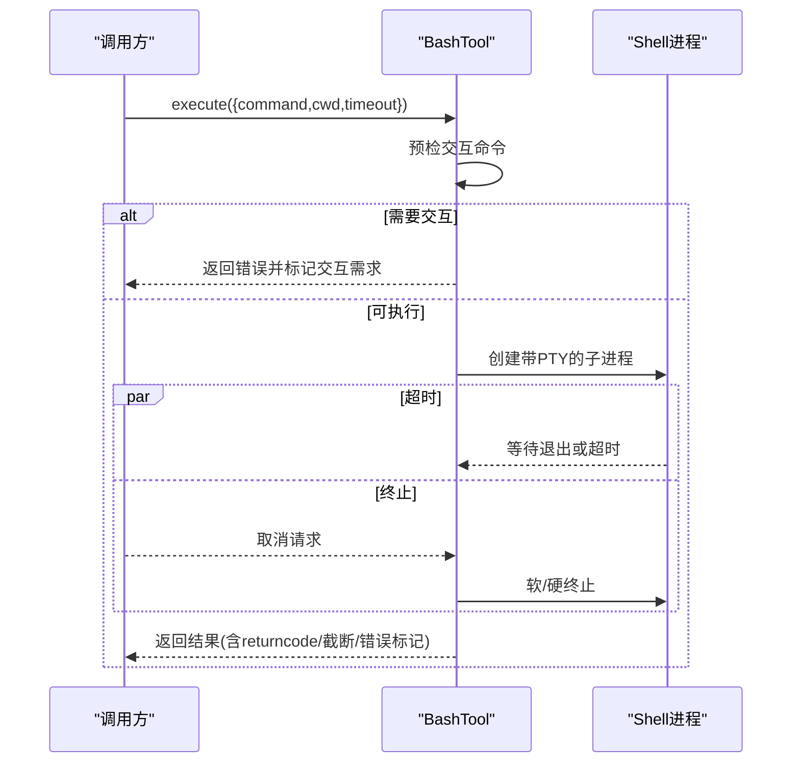
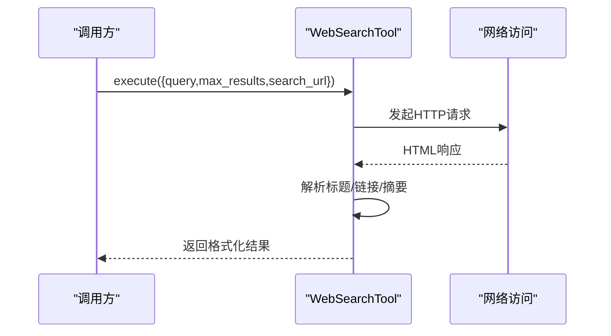
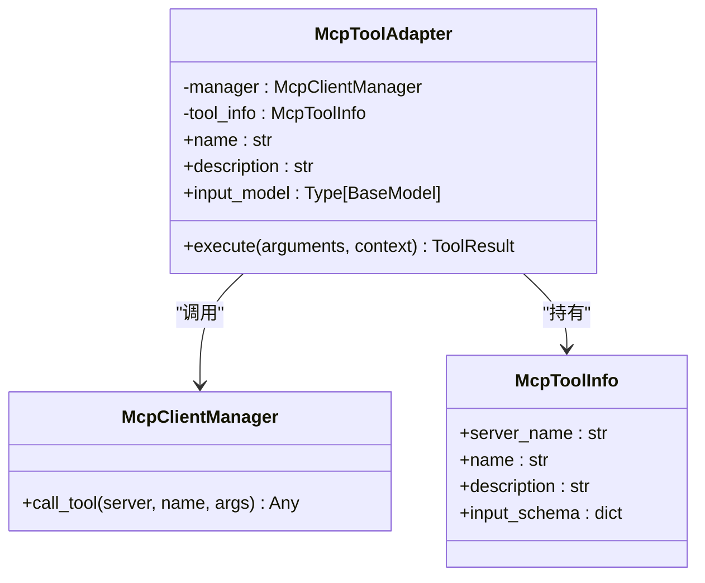
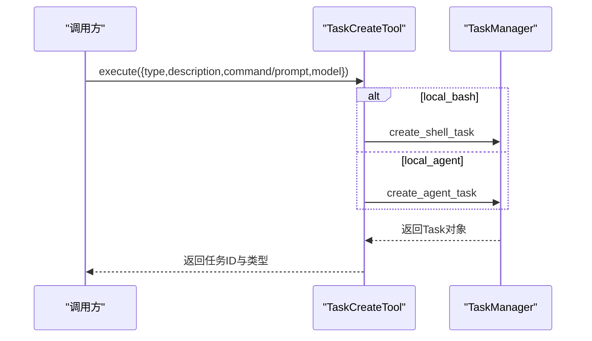
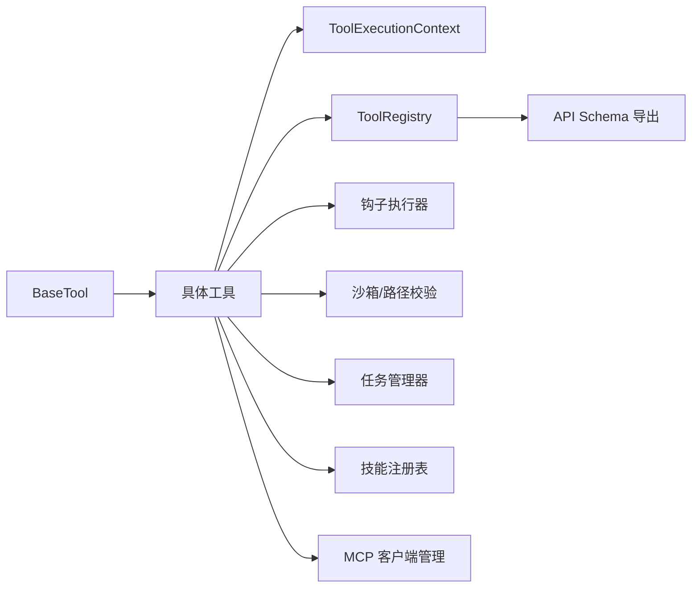

# 工具系统详解

<cite>
**本文引用的文件**
- [tools/__init__.py](file://src/openharness/tools/__init__.py)
- [tools/base.py](file://src/openharness/tools/base.py)
- [tools/bash_tool.py](file://src/openharness/tools/bash_tool.py)
- [tools/file_read_tool.py](file://src/openharness/tools/file_read_tool.py)
- [tools/file_write_tool.py](file://src/openharness/tools/file_write_tool.py)
- [tools/grep_tool.py](file://src/openharness/tools/grep_tool.py)
- [tools/web_search_tool.py](file://src/openharness/tools/web_search_tool.py)
- [tools/web_fetch_tool.py](file://src/openharness/tools/web_fetch_tool.py)
- [tools/mcp_tool.py](file://src/openharness/tools/mcp_tool.py)
- [tools/tool_search_tool.py](file://src/openharness/tools/tool_search_tool.py)
- [tools/skill_tool.py](file://src/openharness/tools/skill_tool.py)
- [tools/task_create_tool.py](file://src/openharness/tools/task_create_tool.py)
- [tools/team_create_tool.py](file://src/openharness/tools/team_create_tool.py)
- [tools/agent_tool.py](file://src/openharness/tools/agent_tool.py)
</cite>

## 目录
1. [简介](#简介)
2. [项目结构](#项目结构)
3. [核心组件](#核心组件)
4. [架构总览](#架构总览)
5. [详细组件分析](#详细组件分析)
6. [依赖关系分析](#依赖关系分析)
7. [性能考量](#性能考量)
8. [故障排查指南](#故障排查指南)
9. [结论](#结论)
10. [附录：工具清单与分类](#附录工具清单与分类)

## 简介
本文件面向 OpenHarness 的“工具系统”，系统性阐述内置工具的设计理念、执行流程、权限与安全控制、钩子集成、注册与动态加载机制，并提供自定义工具开发指南与最佳实践。OpenHarness 提供 43+ 种内置工具，覆盖文件操作、Shell 命令、内容检索、Web 访问、MCP 集成、任务与团队编排、技能读取、以及交互式问答等场景。

## 项目结构
工具系统位于 src/openharness/tools 目录，采用“按功能分模块”的组织方式，每个工具独立实现为一个类，统一继承自抽象基类 BaseTool，并通过工具注册表集中管理。默认注册表在初始化时批量注册所有内置工具，并可按需扩展 MCP 工具适配器。

图示来源
- [tools/__init__.py:48-98](file://src/openharness/tools/__init__.py#L48-L98)
- [tools/base.py:35-81](file://src/openharness/tools/base.py#L35-L81)

章节来源
- [tools/__init__.py:1-108](file://src/openharness/tools/__init__.py#L1-L108)
- [tools/base.py:1-81](file://src/openharness/tools/base.py#L1-L81)

## 核心组件
- 抽象基类 BaseTool：定义工具名称、描述、输入模型、执行接口与只读判定；提供 to_api_schema 将工具暴露给外部 API。
- 执行上下文 ToolExecutionContext：携带当前工作目录、元数据、钩子执行器等。
- 结果封装 ToolResult：标准化输出文本、错误标记与元数据。
- 工具注册表 ToolRegistry：维护名称到工具实例的映射，支持查询、枚举与 API 模式导出。

章节来源
- [tools/base.py:17-81](file://src/openharness/tools/base.py#L17-L81)

## 架构总览
默认注册表在启动时创建并注册所有内置工具，若存在 MCP 管理器，则动态注册 MCP 资源列表、资源读取与工具适配器。工具执行时可访问上下文中的钩子执行器，以触发生命周期事件（如子代理停止）。

图示来源
- [tools/__init__.py:48-98](file://src/openharness/tools/__init__.py#L48-L98)
- [tools/base.py:17-58](file://src/openharness/tools/base.py#L17-L58)

## 详细组件分析

### 文件操作类工具
- read_file：读取本地 UTF-8 文本文件，支持行号编号与范围切片；在容器沙箱中进行路径合法性校验；二进制文件拒绝读取。
- write_file：写入完整文件内容；支持目录自动创建；可结合用户审批提示生成差异摘要后确认写入。
- grep：基于 ripgrep 的高性能全文检索，不命中则回退纯 Python 实现；支持大小写敏感、限制数量、超时控制、隐藏文件过滤等。

图示来源
- [tools/grep_tool.py:40-94](file://src/openharness/tools/grep_tool.py#L40-L94)
- [tools/grep_tool.py:164-236](file://src/openharness/tools/grep_tool.py#L164-L236)
- [tools/grep_tool.py:239-308](file://src/openharness/tools/grep_tool.py#L239-L308)

章节来源
- [tools/file_read_tool.py:20-65](file://src/openharness/tools/file_read_tool.py#L20-L65)
- [tools/file_write_tool.py:21-60](file://src/openharness/tools/file_write_tool.py#L21-L60)
- [tools/grep_tool.py:29-141](file://src/openharness/tools/grep_tool.py#L29-L141)

### Shell 命令工具 bash
- 功能：在本地仓库工作目录执行 shell 命令，捕获标准输出/错误合并输出；对交互式脚手架命令进行预检并提示非交互限制；支持超时、强制终止、输出截断与元数据返回。
- 安全：当沙箱不可用时直接返回错误；取消任务时区分软/硬终止；对疑似需要交互的命令给出改进建议。

图示来源
- [tools/bash_tool.py:34-85](file://src/openharness/tools/bash_tool.py#L34-L85)
- [tools/bash_tool.py:155-219](file://src/openharness/tools/bash_tool.py#L155-L219)

章节来源
- [tools/bash_tool.py:27-85](file://src/openharness/tools/bash_tool.py#L27-L85)

### Web 访问类工具
- web_search：调用公共 HTML 搜索端点，解析标题/链接/摘要，返回紧凑结果列表；支持最大结果数限制与环境变量覆盖端点。
- web_fetch：获取单个网页内容，自动识别 HTML 并抽取纯文本，添加“外部内容”提示与长度截断。

图示来源
- [tools/web_search_tool.py:39-67](file://src/openharness/tools/web_search_tool.py#L39-L67)

章节来源
- [tools/web_search_tool.py:28-67](file://src/openharness/tools/web_search_tool.py#L28-L67)
- [tools/web_fetch_tool.py:33-71](file://src/openharness/tools/web_fetch_tool.py#L33-L71)

### MCP 集成工具
- mcp__* 适配器：将远端 MCP 服务器提供的工具动态映射为本地工具名，自动从 JSON Schema 生成输入模型；调用时转发参数并返回远端输出；连接异常时返回错误。

图示来源
- [tools/mcp_tool.py:14-36](file://src/openharness/tools/mcp_tool.py#L14-L36)
- [tools/mcp_tool.py:49-73](file://src/openharness/tools/mcp_tool.py#L49-L73)

章节来源
- [tools/mcp_tool.py:14-73](file://src/openharness/tools/mcp_tool.py#L14-L73)

### 任务与团队编排工具
- task_create：创建后台任务（本地 Shell 或本地 Agent），返回任务 ID 与类型；Agent 类型需要提供提示词与模型。
- team_create：在内存中创建轻量团队，用于后续将 Agent/任务归组管理。
- agent：根据模式选择本地子进程、远程或就地团队成员模式，支持挂接到指定团队并发出子代理生命周期事件。

图示来源
- [tools/task_create_tool.py:30-56](file://src/openharness/tools/task_create_tool.py#L30-L56)

章节来源
- [tools/task_create_tool.py:23-56](file://src/openharness/tools/task_create_tool.py#L23-L56)
- [tools/team_create_tool.py:18-31](file://src/openharness/tools/team_create_tool.py#L18-L31)
- [tools/agent_tool.py:38-141](file://src/openharness/tools/agent_tool.py#L38-L141)

### 其他实用工具
- tool_search：在工具注册表中按名称或描述进行子串匹配，返回可用工具清单。
- skill：读取已加载的技能内容，支持多来源（内置/用户/项目/插件），可拒绝被模型直接调用的技能。
- 其他：glob、image_to_text、image_generation、brief、sleep、enter/exit_plan_mode、enter/exit_worktree、todo_write、remote_trigger 等，均遵循统一的输入模型与执行接口规范。

章节来源
- [tools/tool_search_tool.py:16-38](file://src/openharness/tools/tool_search_tool.py#L16-L38)
- [tools/skill_tool.py:17-43](file://src/openharness/tools/skill_tool.py#L17-L43)

## 依赖关系分析
- 工具与运行时依赖解耦：工具通过上下文访问钩子、沙箱、任务管理器、技能注册表与 MCP 管理器，避免在工具内部直接耦合具体实现。
- 默认注册表集中管理：统一创建与注册内置工具，支持条件注册 MCP 工具。
- 输入模型与 API 导出：工具通过 to_api_schema 将输入模型暴露给外部 API，便于前端与外部系统理解工具签名。

图示来源
- [tools/base.py:35-81](file://src/openharness/tools/base.py#L35-L81)
- [tools/__init__.py:48-98](file://src/openharness/tools/__init__.py#L48-L98)

章节来源
- [tools/base.py:35-81](file://src/openharness/tools/base.py#L35-L81)
- [tools/__init__.py:48-98](file://src/openharness/tools/__init__.py#L48-L98)

## 性能考量
- 搜索性能：优先使用 ripgrep 进行全文检索，不命中时再回退纯 Python 实现；对长行缓冲区设置上限避免内存压力；限制匹配数量与超时时间。
- Shell 执行：启用 PTY 以提升交互友好性；超时后先尽力读取剩余输出，再强制终止；输出超过阈值进行截断。
- 网络访问：为搜索与抓取设置合理超时与最大字符数；HTML 抽取使用轻量解析器避免正则陷阱。
- 注册与发现：工具注册表为 O(1) 查找；API 模式导出批量生成，适合前端快速渲染。

## 故障排查指南
- bash 工具
  - 交互式脚手架命令：出现“需要交互输入”的提示时，建议使用非交互标志或在外部终端先行执行。
  - 超时：查看返回的元数据包含 returncode 与 timed_out 标记；必要时增加超时或拆分子任务。
  - 沙箱不可用：当返回沙箱相关错误时，检查沙箱状态与权限配置。
- grep 工具
  - ripgrep 缺失：自动回退 Python 实现；若性能不足，安装 ripgrep 并确保 PATH 可见。
  - 大文件/隐藏文件：注意 include_hidden 逻辑与 glob 匹配规则。
- web_* 工具
  - URL 校验失败：确认 URL 合法且可公开访问；检查网络守卫策略。
  - 搜索无结果：调整 query 或减少 max_results；必要时更换 search_url。
- MCP 工具
  - 连接异常：检查 MCP 服务器状态与认证；确认工具名称与输入模型映射正确。
- 任务与团队
  - 任务创建失败：核对 type 与必填字段（command/prompt）；Agent 类型需提供模型与密钥。
  - 团队创建失败：检查团队名唯一性与注册表状态。

章节来源
- [tools/bash_tool.py:155-219](file://src/openharness/tools/bash_tool.py#L155-L219)
- [tools/grep_tool.py:164-236](file://src/openharness/tools/grep_tool.py#L164-L236)
- [tools/web_search_tool.py:44-67](file://src/openharness/tools/web_search_tool.py#L44-L67)
- [tools/web_fetch_tool.py:40-71](file://src/openharness/tools/web_fetch_tool.py#L40-L71)
- [tools/mcp_tool.py:26-36](file://src/openharness/tools/mcp_tool.py#L26-L36)
- [tools/task_create_tool.py:30-56](file://src/openharness/tools/task_create_tool.py#L30-L56)
- [tools/team_create_tool.py:25-31](file://src/openharness/tools/team_create_tool.py#L25-L31)

## 结论
OpenHarness 工具系统以清晰的抽象与统一的执行模型为核心，既保证了内置工具的即插即用，又通过注册表与动态适配支持 MCP 等外部能力扩展。配合上下文钩子、沙箱与网络守卫等机制，工具在易用性、安全性与可维护性之间取得良好平衡。建议在自定义工具开发中严格遵循输入模型、只读判定、错误处理与 API 导出规范，以融入整体生态。

## 附录：工具清单与分类
- 文件操作
  - read_file：读取文本文件（行号编号、范围切片）
  - write_file：写入完整文件内容（可选差异提示与目录创建）
  - grep：基于 ripgrep 的全文检索（回退纯 Python）
- Shell 命令
  - bash：本地 Shell 执行（超时、交互提示、输出截断）
- Web 访问
  - web_search：公共 HTML 搜索（紧凑结果）
  - web_fetch：网页抓取与文本抽取（长度截断、外部内容提示）
- MCP 集成
  - mcp__{server}__{tool}：远端工具适配器（动态命名与输入模型）
- 任务与团队
  - task_create：创建后台任务（local_bash/local_agent）
  - team_create：创建内存团队
  - agent：本地/远程/就地团队成员模式（支持团队挂接与钩子事件）
- 其他实用
  - tool_search：按名称/描述搜索工具
  - skill：读取技能内容（多来源、禁用模型调用）
  - 其余工具：glob、image_to_text、image_generation、brief、sleep、enter/exit_plan_mode、enter/exit_worktree、todo_write、remote_trigger 等

章节来源
- [tools/__init__.py:48-98](file://src/openharness/tools/__init__.py#L48-L98)