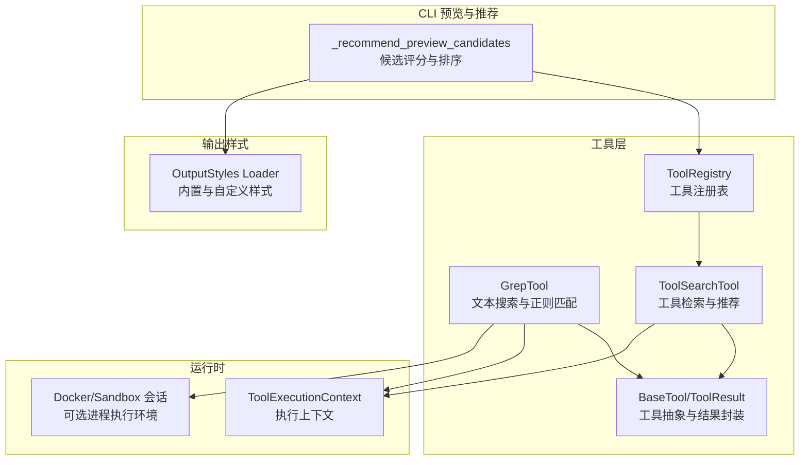
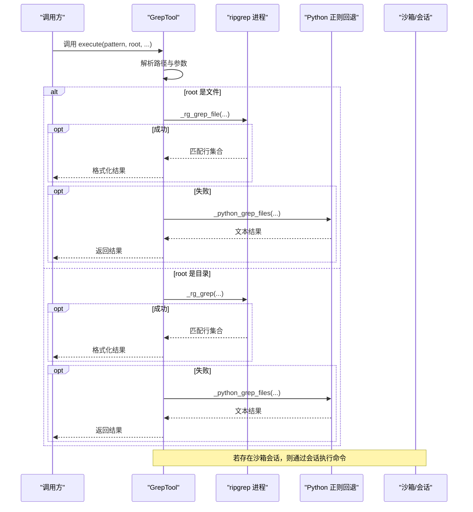
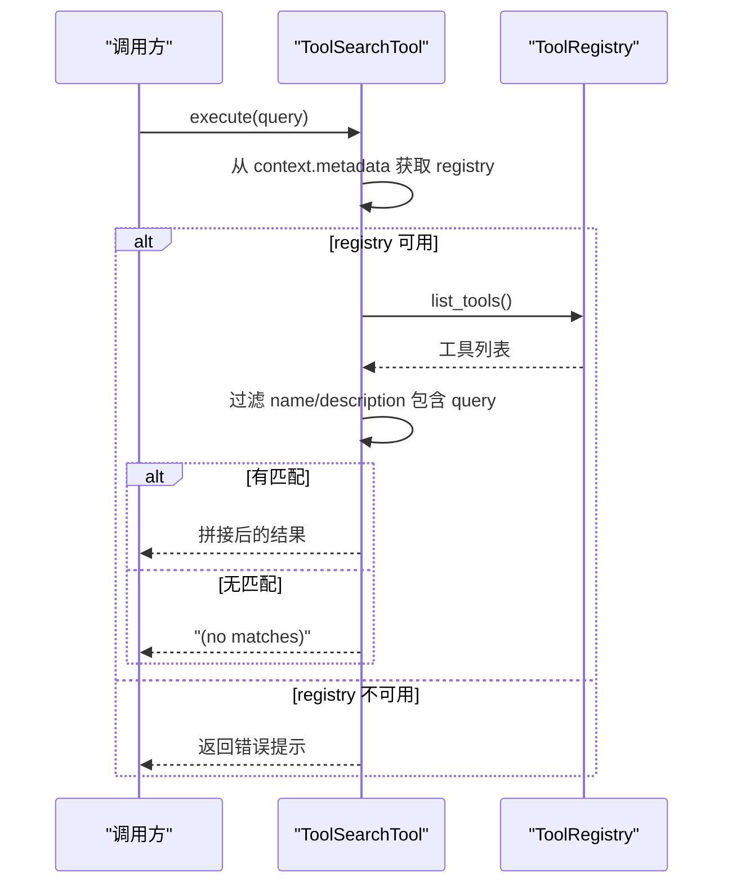
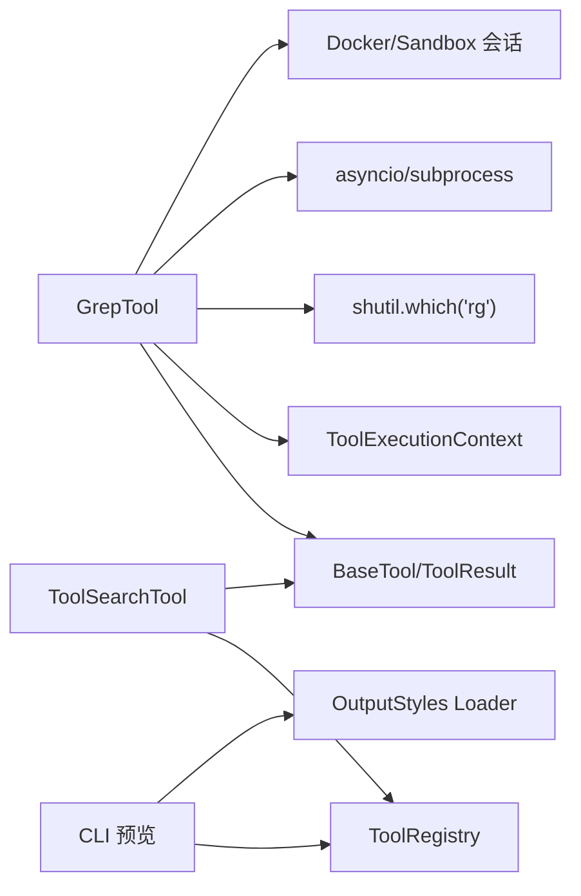

# 搜索和 Grep 工具

<cite>
**本文引用的文件**
- [src/openharness/tools/grep_tool.py](file://src/openharness/tools/grep_tool.py)
- [src/openharness/tools/tool_search_tool.py](file://src/openharness/tools/tool_search_tool.py)
- [src/openharness/tools/base.py](file://src/openharness/tools/base.py)
- [src/openharness/tools/__init__.py](file://src/openharness/tools/__init__.py)
- [src/openharness/cli.py](file://src/openharness/cli.py)
- [tests/test_tools/test_grep_tool.py](file://tests/test_tools/test_grep_tool.py)
- [src/openharness/output_styles/loader.py](file://src/openharness/output_styles/loader.py)
</cite>

## 目录
1. [简介](#简介)
2. [项目结构](#项目结构)
3. [核心组件](#核心组件)
4. [架构总览](#架构总览)
5. [详细组件分析](#详细组件分析)
6. [依赖关系分析](#依赖关系分析)
7. [性能考量](#性能考量)
8. [故障排查指南](#故障排查指南)
9. [结论](#结论)
10. [附录：使用示例与最佳实践](#附录使用示例与最佳实践)

## 简介
本文件面向“搜索与 Grep 工具”的技术文档，聚焦以下目标：
- 深入解析 GrepTool 的文本搜索能力、正则表达式支持、文件过滤与路径解析策略
- 详述 tool_search_tool 的工具查找与推荐机制
- 解释搜索算法、匹配策略、超时与资源控制、错误处理与回退策略
- 提供多种搜索场景的使用示例（文件内容搜索、工具查找、模式匹配）
- 说明搜索结果的格式化与展示方式，并给出输出样式的配置建议

## 项目结构
与搜索和 Grep 相关的核心模块位于 tools 子系统，CLI 层提供候选推荐与预览；输出样式由 output_styles 子系统统一管理。

图示来源
- [src/openharness/tools/grep_tool.py:29-94](file://src/openharness/tools/grep_tool.py#L29-L94)
- [src/openharness/tools/tool_search_tool.py:16-38](file://src/openharness/tools/tool_search_tool.py#L16-L38)
- [src/openharness/tools/base.py:17-81](file://src/openharness/tools/base.py#L17-L81)
- [src/openharness/tools/__init__.py:48-98](file://src/openharness/tools/__init__.py#L48-L98)
- [src/openharness/cli.py:253-330](file://src/openharness/cli.py#L253-L330)
- [src/openharness/output_styles/loader.py:27-42](file://src/openharness/output_styles/loader.py#L27-L42)

章节来源
- [src/openharness/tools/grep_tool.py:1-375](file://src/openharness/tools/grep_tool.py#L1-L375)
- [src/openharness/tools/tool_search_tool.py:1-39](file://src/openharness/tools/tool_search_tool.py#L1-L39)
- [src/openharness/tools/base.py:1-81](file://src/openharness/tools/base.py#L1-L81)
- [src/openharness/tools/__init__.py:1-108](file://src/openharness/tools/__init__.py#L1-L108)
- [src/openharness/cli.py:240-799](file://src/openharness/cli.py#L240-L799)
- [src/openharness/output_styles/loader.py:1-42](file://src/openharness/output_styles/loader.py#L1-L42)

## 核心组件
- GrepTool：基于 ripgrep 的高性能文本搜索工具，支持正则、大小写敏感、文件通配、限制条数、超时控制与回退到纯 Python 正则实现。
- ToolSearchTool：在工具注册表中按名称或描述进行子串匹配，返回匹配列表。
- BaseTool/ToolResult/ToolRegistry：统一的工具抽象、标准化结果封装与注册表管理。
- CLI 候选推荐：对技能、工具、命令进行评分与排序，辅助用户选择合适工具。
- 输出样式：提供默认、极简、类 Codex 等内置样式，支持自定义扩展。

章节来源
- [src/openharness/tools/grep_tool.py:15-94](file://src/openharness/tools/grep_tool.py#L15-L94)
- [src/openharness/tools/tool_search_tool.py:10-38](file://src/openharness/tools/tool_search_tool.py#L10-L38)
- [src/openharness/tools/base.py:17-81](file://src/openharness/tools/base.py#L17-L81)
- [src/openharness/tools/__init__.py:48-98](file://src/openharness/tools/__init__.py#L48-L98)
- [src/openharness/cli.py:253-330](file://src/openharness/cli.py#L253-L330)
- [src/openharness/output_styles/loader.py:27-42](file://src/openharness/output_styles/loader.py#L27-L42)

## 架构总览
GrepTool 的执行流程优先尝试外部 ripgrep，失败或不可用时回退到纯 Python 正则扫描；ToolSearchTool 通过 ToolRegistry 获取工具清单并进行字符串匹配；CLI 层负责将工具与技能、命令进行评分与推荐展示。

图示来源
- [src/openharness/tools/grep_tool.py:40-94](file://src/openharness/tools/grep_tool.py#L40-L94)
- [src/openharness/tools/grep_tool.py:164-236](file://src/openharness/tools/grep_tool.py#L164-L236)
- [src/openharness/tools/grep_tool.py:239-308](file://src/openharness/tools/grep_tool.py#L239-L308)

## 详细组件分析

### GrepTool 组件分析
- 输入模型与参数
  - pattern：正则表达式
  - root：搜索根目录或文件；多根需分别调用
  - file_glob：文件通配符，默认递归所有文件
  - case_sensitive：大小写敏感开关
  - limit：最大匹配条数（1..2000）
  - timeout_seconds：超时秒数（1..120）

- 执行策略
  - 路径解析：支持相对路径、~ 展开、绝对路径与当前工作目录组合
  - 文件/目录分支：文件直接走文件级搜索，目录走目录级搜索
  - 优先使用 ripgrep：通过外部命令执行，支持隐藏文件检测、大小写、通配等参数
  - 回退策略：ripgrep 不可用或异常时，使用纯 Python 正则逐行扫描，跳过含 NUL 字节与二进制文件

- 结果格式化
  - 目录搜索：ripgrep 输出行原样拼接；若命中超时标记则追加超时提示
  - 文件搜索：为每行添加相对路径前缀，便于定位
  - 无匹配：输出“(no matches)”
  - 超时：is_error 标记为真，便于上层感知

- 超时与资源控制
  - 使用 asyncio.wait_for 控制读取超时
  - 超时后终止进程（先 terminate 再 kill），避免僵尸进程
  - stdout 行缓冲限制提升稳定性，避免长行导致 LimitOverrunError

- 错误处理
  - 无效正则：Python 回退阶段捕获并返回错误信息
  - 不存在的 root：立即返回错误，提示多根需分次调用
  - ripgrep 异常退出码：除 0/1 与特定信号外均回退

图示来源
- [src/openharness/tools/grep_tool.py:40-94](file://src/openharness/tools/grep_tool.py#L40-L94)
- [src/openharness/tools/grep_tool.py:105-141](file://src/openharness/tools/grep_tool.py#L105-L141)
- [src/openharness/tools/grep_tool.py:164-236](file://src/openharness/tools/grep_tool.py#L164-L236)
- [src/openharness/tools/grep_tool.py:239-308](file://src/openharness/tools/grep_tool.py#L239-L308)

章节来源
- [src/openharness/tools/grep_tool.py:15-94](file://src/openharness/tools/grep_tool.py#L15-L94)
- [src/openharness/tools/grep_tool.py:105-141](file://src/openharness/tools/grep_tool.py#L105-L141)
- [src/openharness/tools/grep_tool.py:164-308](file://src/openharness/tools/grep_tool.py#L164-L308)
- [tests/test_tools/test_grep_tool.py:46-193](file://tests/test_tools/test_grep_tool.py#L46-L193)

### ToolSearchTool 组件分析
- 功能：在工具注册表中按名称或描述进行不区分大小写的子串匹配
- 输入：query
- 执行：从 context.metadata 中获取 ToolRegistry，遍历工具并筛选
- 输出：以“名称: 描述”形式拼接，无匹配返回“(no matches)”

图示来源
- [src/openharness/tools/tool_search_tool.py:27-38](file://src/openharness/tools/tool_search_tool.py#L27-L38)
- [src/openharness/tools/base.py:60-81](file://src/openharness/tools/base.py#L60-L81)

章节来源
- [src/openharness/tools/tool_search_tool.py:10-38](file://src/openharness/tools/tool_search_tool.py#L10-L38)
- [src/openharness/tools/base.py:60-81](file://src/openharness/tools/base.py#L60-L81)

### CLI 候选推荐与评分
- 评分逻辑：对技能、工具、命令的名称、描述、行为等字段进行分词与匹配，计算匹配度与关键词理由
- 过滤阈值：技能≥4，工具≥4，命令≥8
- 排序与截断：按分数降序，分别截取前若干项用于预览

图示来源
- [src/openharness/cli.py:222-241](file://src/openharness/cli.py#L222-L241)
- [src/openharness/cli.py:253-330](file://src/openharness/cli.py#L253-L330)

章节来源
- [src/openharness/cli.py:222-330](file://src/openharness/cli.py#L222-L330)

### 输出样式与展示
- 内置样式：default/minimal/codex
- 自定义样式：在配置目录下创建 output_styles/*.md 即可加载
- CLI 预览：将工具、技能、命令等信息以结构化文本展示，便于用户决策

章节来源
- [src/openharness/output_styles/loader.py:27-42](file://src/openharness/output_styles/loader.py#L27-L42)
- [src/openharness/cli.py:600-742](file://src/openharness/cli.py#L600-L742)

## 依赖关系分析
- GrepTool 依赖
  - 外部命令 ripgrep（可选）：提升性能与稳定性
  - Python 标准库：asyncio、re、shutil、pathlib
  - 沙箱/会话：在可用时通过会话执行命令，否则直接创建子进程
  - 工具基类与结果封装：BaseTool、ToolResult、ToolExecutionContext
- ToolSearchTool 依赖
  - ToolRegistry：从上下文中获取工具清单
  - BaseTool：工具抽象
- CLI 依赖
  - 工具注册表：用于候选评分与推荐
  - 输出样式：用于预览展示

图示来源
- [src/openharness/tools/grep_tool.py:164-236](file://src/openharness/tools/grep_tool.py#L164-L236)
- [src/openharness/tools/tool_search_tool.py:27-38](file://src/openharness/tools/tool_search_tool.py#L27-L38)
- [src/openharness/tools/base.py:17-81](file://src/openharness/tools/base.py#L17-L81)
- [src/openharness/tools/__init__.py:48-98](file://src/openharness/tools/__init__.py#L48-L98)
- [src/openharness/cli.py:253-330](file://src/openharness/cli.py#L253-L330)
- [src/openharness/output_styles/loader.py:27-42](file://src/openharness/output_styles/loader.py#L27-L42)

章节来源
- [src/openharness/tools/grep_tool.py:1-375](file://src/openharness/tools/grep_tool.py#L1-L375)
- [src/openharness/tools/tool_search_tool.py:1-39](file://src/openharness/tools/tool_search_tool.py#L1-L39)
- [src/openharness/tools/base.py:1-81](file://src/openharness/tools/base.py#L1-L81)
- [src/openharness/tools/__init__.py:1-108](file://src/openharness/tools/__init__.py#L1-L108)
- [src/openharness/cli.py:240-799](file://src/openharness/cli.py#L240-L799)
- [src/openharness/output_styles/loader.py:1-42](file://src/openharness/output_styles/loader.py#L1-L42)

## 性能考量
- 优先使用 ripgrep：在大目录与大量文件场景下显著优于纯 Python 实现
- 流式读取与缓冲限制：避免长行导致内存与缓冲溢出
- 超时与资源回收：超时后主动终止进程，防止资源泄漏
- 二进制文件规避：跳过含 NUL 字节的内容，减少无效扫描
- 限制条数与超时：通过 limit 与 timeout 控制响应时间与资源占用

章节来源
- [src/openharness/tools/grep_tool.py:164-236](file://src/openharness/tools/grep_tool.py#L164-L236)
- [src/openharness/tools/grep_tool.py:211-236](file://src/openharness/tools/grep_tool.py#L211-L236)
- [tests/test_tools/test_grep_tool.py:70-94](file://tests/test_tools/test_grep_tool.py#L70-L94)

## 故障排查指南
- 未找到 ripgrep
  - 现象：GrepTool 回退到 Python 正则
  - 建议：安装 ripgrep 或确保 PATH 可发现
- 无效正则表达式
  - 现象：Python 回退阶段报告“无效正则”错误
  - 建议：检查 pattern 语法，必要时转义特殊字符
- 搜索根不存在
  - 现象：立即返回错误，提示多根需分次调用
  - 建议：确认 root 路径正确，或将多个根拆分为多次调用
- 超时
  - 现象：is_error 标记为真，输出超时提示
  - 建议：增大 timeout_seconds，缩小搜索范围（调整 file_glob 或 root），或改用更精确的 pattern
- 权限问题
  - 现象：无法访问某些文件或目录
  - 建议：检查文件权限与 SELinux/AppArmor 等安全策略

章节来源
- [tests/test_tools/test_grep_tool.py:46-193](file://tests/test_tools/test_grep_tool.py#L46-L193)
- [src/openharness/tools/grep_tool.py:114-118](file://src/openharness/tools/grep_tool.py#L114-L118)
- [src/openharness/tools/grep_tool.py:42-49](file://src/openharness/tools/grep_tool.py#L42-L49)
- [src/openharness/tools/grep_tool.py:214-230](file://src/openharness/tools/grep_tool.py#L214-L230)

## 结论
GrepTool 提供了高性能与稳健的文本搜索能力，结合 ripgrep 的强大能力与 Python 回退方案，兼顾易用性与可靠性。ToolSearchTool 则为工具发现与推荐提供了简洁高效的机制。CLI 的候选评分与输出样式进一步提升了交互体验与可读性。整体设计在可扩展性、安全性与性能之间取得良好平衡。

## 附录：使用示例与最佳实践
- 文件内容搜索（正则）
  - 场景：在源码中查找特定函数签名
  - 建议：使用大小写敏感，设置较小的 limit 与合理的 timeout；对复杂模式进行转义
  - 参考路径：[GrepTool.execute:40-94](file://src/openharness/tools/grep_tool.py#L40-L94)
- 工具查找与推荐
  - 场景：快速定位“读取文件”或“写入文件”相关工具
  - 建议：使用 tool_search_tool 并在 query 中输入关键词；结合 CLI 预览中的“Likely Matches”栏
  - 参考路径：[ToolSearchTool.execute:27-38](file://src/openharness/tools/tool_search_tool.py#L27-L38)，[CLI 候选推荐:253-330](file://src/openharness/cli.py#L253-L330)
- 模式匹配与高亮
  - 建议：ripgrep 默认输出不含颜色，如需高亮可在外部管线中接入着色器；GrepTool 输出为纯文本，便于后续处理
  - 参考路径：[ripgrep 参数构建:178-193](file://src/openharness/tools/grep_tool.py#L178-L193)
- 批量处理与多根搜索
  - 建议：多根场景应分别调用 GrepTool，避免单次传入多个 root 导致错误
  - 参考路径：[根解析与错误提示:40-49](file://src/openharness/tools/grep_tool.py#L40-L49)
- 输出样式定制
  - 建议：根据团队偏好选择 default/minimal/codex，或在配置目录下新增自定义样式文件
  - 参考路径：[输出样式加载:27-42](file://src/openharness/output_styles/loader.py#L27-L42)