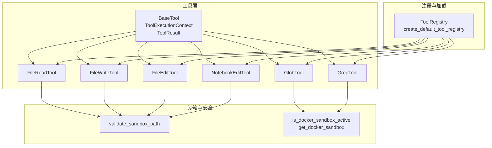
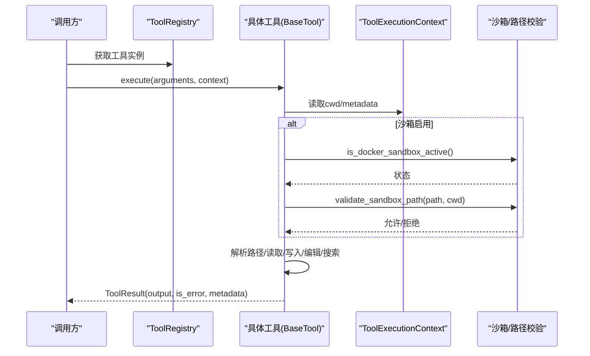
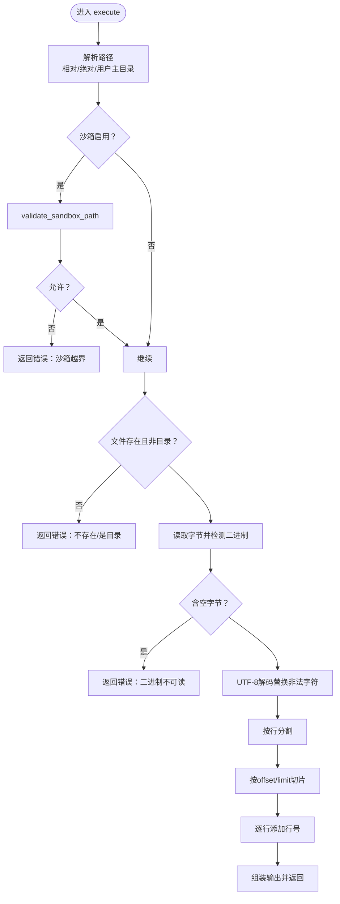
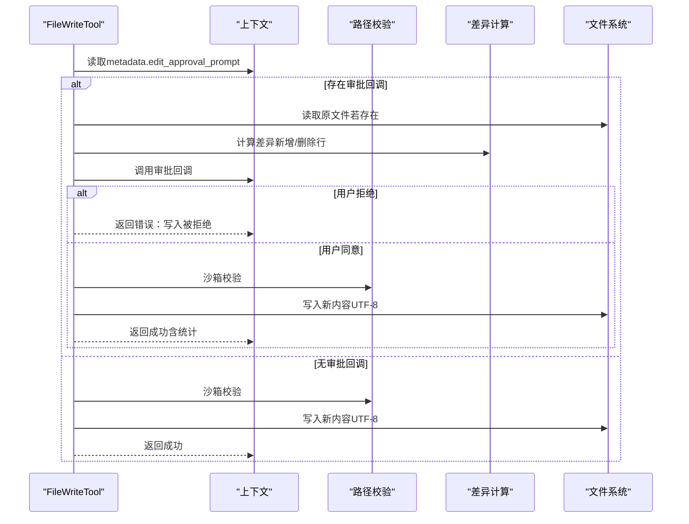
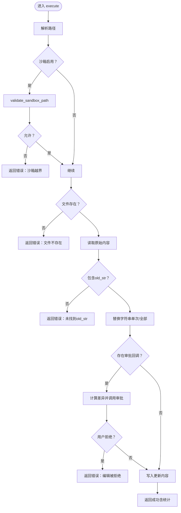
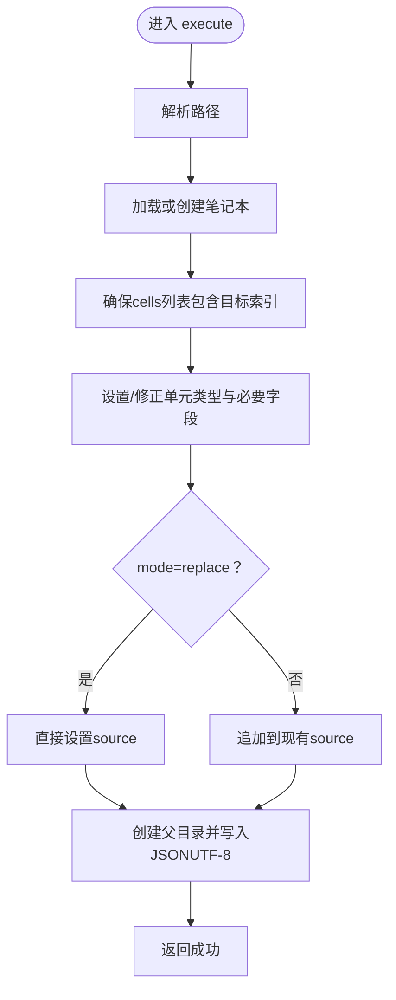
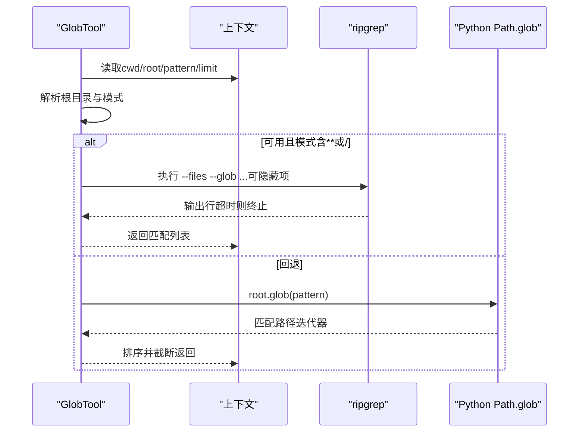
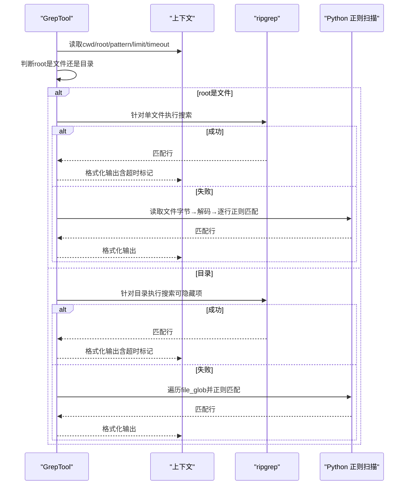
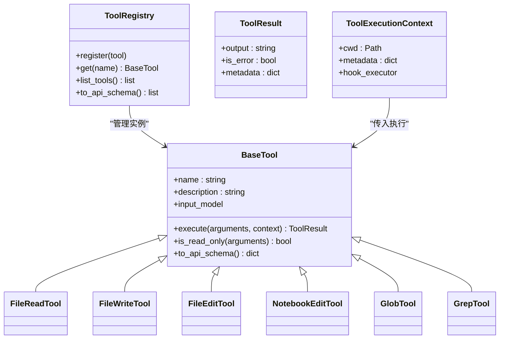

# 文件操作工具

<cite>
**本文引用的文件**
- [src/openharness/tools/base.py](file://src/openharness/tools/base.py)
- [src/openharness/tools/file_read_tool.py](file://src/openharness/tools/file_read_tool.py)
- [src/openharness/tools/file_write_tool.py](file://src/openharness/tools/file_write_tool.py)
- [src/openharness/tools/file_edit_tool.py](file://src/openharness/tools/file_edit_tool.py)
- [src/openharness/tools/notebook_edit_tool.py](file://src/openharness/tools/notebook_edit_tool.py)
- [src/openharness/tools/glob_tool.py](file://src/openharness/tools/glob_tool.py)
- [src/openharness/tools/grep_tool.py](file://src/openharness/tools/grep_tool.py)
- [src/openharness/sandbox/path_validator.py](file://src/openharness/sandbox/path_validator.py)
- [src/openharness/sandbox/session.py](file://src/openharness/sandbox/session.py)
- [src/openharness/tools/__init__.py](file://src/openharness/tools/__init__.py)
- [tests/test_tools/test_core_tools.py](file://tests/test_tools/test_core_tools.py)
- [tests/test_sandbox/test_path_validator.py](file://tests/test_sandbox/test_path_validator.py)
</cite>

## 目录
1. [简介](#简介)
2. [项目结构](#项目结构)
3. [核心组件](#核心组件)
4. [架构总览](#架构总览)
5. [详细组件分析](#详细组件分析)
6. [依赖关系分析](#依赖关系分析)
7. [性能考量](#性能考量)
8. [故障排查指南](#故障排查指南)
9. [结论](#结论)
10. [附录](#附录)

## 简介
本文件面向“文件操作工具”的技术文档，覆盖以下能力：
- 文件读取：按行号范围读取文本文件内容，支持偏移与限制。
- 文件写入：创建或覆盖文本文件，支持目录自动创建与可选的变更审批流程。
- 文件编辑：替换现有字符串（单次或全部），支持变更审批与差异统计。
- 笔记本编辑：对 Jupyter Notebook 的单元进行创建或编辑（无需完整 nbformat）。
- 文件查找：基于通配符模式列出匹配文件，支持根目录与限制数量。
- 内容搜索：基于正则表达式在文件中检索，优先使用 ripgrep，失败时回退到纯 Python 实现。

文档将从架构、数据流、处理逻辑、参数与返回值、错误处理、安全与性能等方面进行系统化说明，并提供可溯源的章节来源与图示。

## 项目结构
文件操作工具位于工具层，统一继承自基础抽象类，注册于默认工具注册表；在沙箱环境中通过路径校验模块进行边界约束；部分工具在执行前会检测是否处于 Docker 沙箱并调用相应校验逻辑。

**图表来源**
- [src/openharness/tools/base.py:17-81](file://src/openharness/tools/base.py#L17-L81)
- [src/openharness/tools/file_read_tool.py:20-73](file://src/openharness/tools/file_read_tool.py#L20-L73)
- [src/openharness/tools/file_write_tool.py:21-88](file://src/openharness/tools/file_write_tool.py#L21-L88)
- [src/openharness/tools/file_edit_tool.py:22-96](file://src/openharness/tools/file_edit_tool.py#L22-L96)
- [src/openharness/tools/notebook_edit_tool.py:25-98](file://src/openharness/tools/notebook_edit_tool.py#L25-L98)
- [src/openharness/tools/glob_tool.py:25-176](file://src/openharness/tools/glob_tool.py#L25-L176)
- [src/openharness/tools/grep_tool.py:29-375](file://src/openharness/tools/grep_tool.py#L29-L375)
- [src/openharness/tools/__init__.py:48-98](file://src/openharness/tools/__init__.py#L48-L98)
- [src/openharness/sandbox/path_validator.py:8-38](file://src/openharness/sandbox/path_validator.py#L8-L38)
- [src/openharness/sandbox/session.py:19-27](file://src/openharness/sandbox/session.py#L19-L27)

**章节来源**
- [src/openharness/tools/__init__.py:48-98](file://src/openharness/tools/__init__.py#L48-L98)
- [src/openharness/tools/base.py:17-81](file://src/openharness/tools/base.py#L17-L81)

## 核心组件
- 工具基类与上下文
  - BaseTool：定义工具名称、描述、输入模型、执行接口与只读判定。
  - ToolExecutionContext：传递工作目录、元数据（如审批回调）、钩子执行器。
  - ToolResult：标准化输出、错误标记与元数据。
- 工具注册表
  - ToolRegistry：维护名称到实例映射，导出 API 规范。
  - create_default_tool_registry：内置工具集合注册入口。

**章节来源**
- [src/openharness/tools/base.py:17-81](file://src/openharness/tools/base.py#L17-L81)
- [src/openharness/tools/__init__.py:48-98](file://src/openharness/tools/__init__.py#L48-L98)

## 架构总览
文件操作工具遵循统一的执行流程：解析路径 → 沙箱校验（如启用）→ 执行业务逻辑 → 返回标准化结果。搜索类工具在可用时优先使用 ripgrep，否则回退至纯 Python 实现以保证可移植性。

**图表来源**
- [src/openharness/tools/base.py:35-49](file://src/openharness/tools/base.py#L35-L49)
- [src/openharness/tools/file_read_tool.py:31-65](file://src/openharness/tools/file_read_tool.py#L31-L65)
- [src/openharness/tools/file_write_tool.py:28-60](file://src/openharness/tools/file_write_tool.py#L28-L60)
- [src/openharness/tools/file_edit_tool.py:29-68](file://src/openharness/tools/file_edit_tool.py#L29-L68)
- [src/openharness/tools/glob_tool.py:36-41](file://src/openharness/tools/glob_tool.py#L36-L41)
- [src/openharness/tools/grep_tool.py:40-94](file://src/openharness/tools/grep_tool.py#L40-L94)
- [src/openharness/sandbox/path_validator.py:8-38](file://src/openharness/sandbox/path_validator.py#L8-L38)
- [src/openharness/sandbox/session.py:24-26](file://src/openharness/sandbox/session.py#L24-L26)

## 详细组件分析

### 文件读取工具（read_file）
- 功能要点
  - 读取本地仓库中的文本文件，按行号范围输出带编号的行。
  - 支持偏移量与最大行数限制。
  - 自动检测二进制文件并拒绝读取。
- 参数与返回
  - 输入模型字段：path（相对或绝对路径）、offset（起始行，从0开始）、limit（返回行数上限，默认200，最小1，最大2000）。
  - 返回：ToolResult，输出为带行号的文本；若越界或无内容返回提示信息。
- 错误处理
  - 文件不存在、目标是目录、二进制文件、沙箱越界均返回错误标记与提示。
- 安全与路径
  - 使用工作目录解析相对路径，支持用户主目录展开；沙箱启用时调用路径校验。
- 性能与行为
  - 采用UTF-8解码并按行切分，仅截取指定范围，避免全量读取。

**图表来源**
- [src/openharness/tools/file_read_tool.py:31-65](file://src/openharness/tools/file_read_tool.py#L31-L65)
- [src/openharness/sandbox/path_validator.py:8-38](file://src/openharness/sandbox/path_validator.py#L8-L38)

**章节来源**
- [src/openharness/tools/file_read_tool.py:12-73](file://src/openharness/tools/file_read_tool.py#L12-L73)

### 文件写入工具（write_file）
- 功能要点
  - 创建或覆盖文本文件；可选自动创建父级目录。
  - 变更审批：若上下文提供审批回调，则计算差异并询问用户，用户拒绝则不写入。
  - 统计变更：显示新增/删除行数。
- 参数与返回
  - 输入模型字段：path、content、create_directories（默认开启）。
  - 返回：ToolResult，输出包含写入路径与变更统计；若被拒绝或越界返回错误。
- 错误处理
  - 沙箱越界、审批拒绝、创建目录失败等场景返回错误。
- 安全与路径
  - 路径解析与沙箱校验同上。
- 示例参考
  - 测试覆盖了审批流程、拒绝后不创建父目录、差异统计输出等行为。

**图表来源**
- [src/openharness/tools/file_write_tool.py:28-60](file://src/openharness/tools/file_write_tool.py#L28-L60)
- [src/openharness/sandbox/path_validator.py:8-38](file://src/openharness/sandbox/path_validator.py#L8-L38)

**章节来源**
- [src/openharness/tools/file_write_tool.py:13-88](file://src/openharness/tools/file_write_tool.py#L13-L88)
- [tests/test_tools/test_core_tools.py:60-100](file://tests/test_tools/test_core_tools.py#L60-L100)

### 文件编辑工具（edit_file）
- 功能要点
  - 在现有文件中替换字符串；支持仅替换首个或全部出现。
  - 变更审批与差异统计逻辑与写入工具一致。
- 参数与返回
  - 输入模型字段：path、old_str、new_str、replace_all（默认关闭）。
  - 返回：ToolResult，输出包含更新路径与变更统计；未找到旧字符串或越界返回错误。
- 错误处理
  - 文件不存在、old_str不在文件中、沙箱越界、审批拒绝等。
- 安全与路径
  - 同上。

**图表来源**
- [src/openharness/tools/file_edit_tool.py:29-68](file://src/openharness/tools/file_edit_tool.py#L29-L68)
- [src/openharness/sandbox/path_validator.py:8-38](file://src/openharness/sandbox/path_validator.py#L8-L38)

**章节来源**
- [src/openharness/tools/file_edit_tool.py:13-96](file://src/openharness/tools/file_edit_tool.py#L13-L96)
- [tests/test_tools/test_core_tools.py:102-127](file://tests/test_tools/test_core_tools.py#L102-L127)

### 笔记本编辑工具（notebook_edit）
- 功能要点
  - 编辑或创建 Jupyter Notebook 单元（code/markdown），支持替换或追加源码。
  - 自动补齐缺失的单元索引与必要字段。
- 参数与返回
  - 输入模型字段：path、cell_index（从0开始）、new_source、cell_type（默认code）、mode（replace/append，默认replace）、create_if_missing（默认true）。
  - 返回：ToolResult，输出包含更新的单元索引与路径。
- 错误处理
  - 无法加载笔记本且不允许创建时返回错误；否则创建空笔记本骨架。
- 安全与路径
  - 同上。

**图表来源**
- [src/openharness/tools/notebook_edit_tool.py:32-59](file://src/openharness/tools/notebook_edit_tool.py#L32-L59)
- [src/openharness/sandbox/path_validator.py:8-38](file://src/openharness/sandbox/path_validator.py#L8-L38)

**章节来源**
- [src/openharness/tools/notebook_edit_tool.py:14-98](file://src/openharness/tools/notebook_edit_tool.py#L14-L98)
- [tests/test_tools/test_core_tools.py:280-288](file://tests/test_tools/test_core_tools.py#L280-L288)

### 文件查找工具（glob）
- 功能要点
  - 基于通配符模式列出匹配文件；支持指定搜索根目录与结果上限。
  - 对递归与斜杠模式优先使用 ripgrep（尊重 .gitignore 等），否则回退到 Python 的 Path.glob。
- 参数与返回
  - 输入模型字段：pattern（别名支持 path）、root（可选搜索根）、limit（默认200，上限5000）。
  - 返回：ToolResult，输出为换行分隔的相对路径列表；无匹配返回提示。
- 错误处理
  - 搜索根不存在或非目录时返回空结果。
- 性能与行为
  - 使用 ripgrep 并在超时后终止进程；限制读取长度避免缓冲区溢出；排序以保证确定性。

**图表来源**
- [src/openharness/tools/glob_tool.py:36-41](file://src/openharness/tools/glob_tool.py#L36-L41)
- [src/openharness/tools/glob_tool.py:98-176](file://src/openharness/tools/glob_tool.py#L98-L176)

**章节来源**
- [src/openharness/tools/glob_tool.py:14-176](file://src/openharness/tools/glob_tool.py#L14-L176)
- [tests/test_tools/test_core_tools.py:129-171](file://tests/test_tools/test_core_tools.py#L129-L171)

### 内容搜索工具（grep）
- 功能要点
  - 在文件中按正则表达式搜索；支持大小写敏感、文件通配、限制数量与超时。
  - 优先使用 ripgrep，失败或不可用时回退到纯 Python 正则扫描。
- 参数与返回
  - 输入模型字段：pattern、root（可选）、file_glob（默认**/*）、case_sensitive（默认true）、limit（默认200，上限2000）、timeout_seconds（默认20，上限120）。
  - 返回：ToolResult，输出为“路径:行号:行内容”；超时附加提示。
- 错误处理
  - 搜索根不存在、无效正则、ripgrep异常返回码时回退；超时标记错误状态。
- 性能与行为
  - 使用异步子进程读取标准输出，限制长行缓冲；超时后终止进程；根据是否包含隐藏文件决定是否启用隐藏项搜索。

**图表来源**
- [src/openharness/tools/grep_tool.py:40-94](file://src/openharness/tools/grep_tool.py#L40-L94)
- [src/openharness/tools/grep_tool.py:164-237](file://src/openharness/tools/grep_tool.py#L164-L237)
- [src/openharness/tools/grep_tool.py:239-309](file://src/openharness/tools/grep_tool.py#L239-L309)
- [src/openharness/tools/grep_tool.py:105-142](file://src/openharness/tools/grep_tool.py#L105-L142)

**章节来源**
- [src/openharness/tools/grep_tool.py:15-375](file://src/openharness/tools/grep_tool.py#L15-L375)
- [tests/test_tools/test_core_tools.py:129-153](file://tests/test_tools/test_core_tools.py#L129-L153)

## 依赖关系分析
- 工具与基础类
  - 所有文件操作工具均继承自 BaseTool，复用统一的执行框架与只读判定。
- 注册与发现
  - 默认注册表集中注册常用工具，便于外部通过名称调用。
- 沙箱与路径
  - 路径校验模块提供跨工具的一致性边界控制；沙箱会话模块用于判断是否启用容器环境并执行相应命令。

**图表来源**
- [src/openharness/tools/base.py:35-81](file://src/openharness/tools/base.py#L35-L81)
- [src/openharness/tools/__init__.py:48-98](file://src/openharness/tools/__init__.py#L48-L98)

**章节来源**
- [src/openharness/tools/base.py:17-81](file://src/openharness/tools/base.py#L17-L81)
- [src/openharness/tools/__init__.py:48-98](file://src/openharness/tools/__init__.py#L48-L98)

## 性能考量
- 搜索类工具优先使用 ripgrep，显著提升大仓库遍历与过滤效率；当不可用时回退到 Python，保证可移植性。
- glob 工具在递归或包含斜杠时使用 ripgrep 并限制读取时间，避免长时间阻塞；同时对输出进行排序以保持稳定。
- grep 工具对长行缓冲进行限制，防止内存压力；超时后主动终止进程并返回超时标记。
- 文件读取与编辑工具尽量按需读取与处理，避免全量载入。

[本节为通用性能讨论，不直接分析特定文件，故无章节来源]

## 故障排查指南
- 路径越界与权限
  - 若启用沙箱，所有文件操作前都会进行路径校验；越界将返回错误并提示原因。
  - 测试覆盖了相对路径、.. 路径穿越、符号链接逃逸、额外允许路径等场景。
- 二进制文件读取
  - 文本读取工具检测到空字节即判定为二进制文件并拒绝读取。
- 审批拒绝
  - 写入与编辑工具在存在审批回调时，若用户拒绝将不执行变更并返回错误。
- 搜索失败与超时
  - ripgrep 不可用或返回非预期退出码时会回退到 Python 实现；grep 在超时后返回超时标记并终止进程。
- 目录与文件根
  - glob 与 grep 对 root 为文件或目录分别处理，确保行为一致。

**章节来源**
- [src/openharness/sandbox/path_validator.py:8-38](file://src/openharness/sandbox/path_validator.py#L8-L38)
- [tests/test_sandbox/test_path_validator.py:10-89](file://tests/test_sandbox/test_path_validator.py#L10-L89)
- [src/openharness/tools/file_read_tool.py:47-54](file://src/openharness/tools/file_read_tool.py#L47-L54)
- [src/openharness/tools/file_write_tool.py:44-50](file://src/openharness/tools/file_write_tool.py#L44-L50)
- [src/openharness/tools/file_edit_tool.py:57-62](file://src/openharness/tools/file_edit_tool.py#L57-L62)
- [src/openharness/tools/grep_tool.py:174-176](file://src/openharness/tools/grep_tool.py#L174-L176)
- [src/openharness/tools/grep_tool.py:234-236](file://src/openharness/tools/grep_tool.py#L234-L236)
- [src/openharness/tools/grep_tool.py:220-222](file://src/openharness/tools/grep_tool.py#L220-L222)

## 结论
文件操作工具提供了从读取、写入、编辑到查找与搜索的完整能力集，具备统一的执行框架、可插拔的注册机制、完善的错误处理与安全边界控制。在生产环境中建议：
- 明确工作目录与沙箱边界，避免路径越界。
- 对写入与编辑操作启用审批流程，降低误操作风险。
- 在大仓库场景优先使用 grep/glob 的 ripgrep 能力，合理设置 limit 与超时。
- 注意二进制文件与编码问题，避免对非文本文件进行文本读取。

[本节为总结性内容，不直接分析特定文件，故无章节来源]

## 附录

### 参数与返回值速查
- read_file
  - 输入：path（字符串）、offset（整数，≥0）、limit（整数，1~2000）
  - 输出：带行号的文本；错误时输出错误信息
- write_file
  - 输入：path（字符串）、content（字符串）、create_directories（布尔）
  - 输出：写入成功信息；若启用审批，输出包含新增/删除统计
- edit_file
  - 输入：path（字符串）、old_str（字符串）、new_str（字符串）、replace_all（布尔）
  - 输出：更新成功信息；若启用审批，输出包含新增/删除统计
- notebook_edit
  - 输入：path（字符串）、cell_index（整数，≥0）、new_source（字符串）、cell_type（"code"|"markdown"）、mode（"replace"|"append"）、create_if_missing（布尔）
  - 输出：更新单元信息
- glob
  - 输入：pattern（字符串，别名支持 path）、root（字符串，可选）、limit（整数，1~5000）
  - 输出：换行分隔的相对路径；无匹配返回提示
- grep
  - 输入：pattern（正则）、root（字符串，可选）、file_glob（字符串）、case_sensitive（布尔）、limit（整数，1~2000）、timeout_seconds（整数，1~120）
  - 输出：路径:行号:行内容；超时附加提示

**章节来源**
- [src/openharness/tools/file_read_tool.py:12-18](file://src/openharness/tools/file_read_tool.py#L12-L18)
- [src/openharness/tools/file_write_tool.py:13-19](file://src/openharness/tools/file_write_tool.py#L13-L19)
- [src/openharness/tools/file_edit_tool.py:13-20](file://src/openharness/tools/file_edit_tool.py#L13-L20)
- [src/openharness/tools/notebook_edit_tool.py:14-23](file://src/openharness/tools/notebook_edit_tool.py#L14-L23)
- [src/openharness/tools/glob_tool.py:14-23](file://src/openharness/tools/glob_tool.py#L14-L23)
- [src/openharness/tools/grep_tool.py:15-27](file://src/openharness/tools/grep_tool.py#L15-L27)

### 使用示例（路径指引）
- 读取文件片段
  - [tests/test_tools/test_core_tools.py:44-49](file://tests/test_tools/test_core_tools.py#L44-L49)
- 写入文件并触发审批
  - [tests/test_tools/test_core_tools.py:67-84](file://tests/test_tools/test_core_tools.py#L67-L84)
- 拒绝写入并验证父目录未创建
  - [tests/test_tools/test_core_tools.py:92-99](file://tests/test_tools/test_core_tools.py#L92-L99)
- 编辑文件并触发审批
  - [tests/test_tools/test_core_tools.py:112-127](file://tests/test_tools/test_core_tools.py#L112-L127)
- glob 与 grep 基本用法
  - [tests/test_tools/test_core_tools.py:135-153](file://tests/test_tools/test_core_tools.py#L135-L153)
- glob 绝对模式
  - [tests/test_tools/test_core_tools.py:164-171](file://tests/test_tools/test_core_tools.py#L164-L171)
- 笔记本编辑
  - [tests/test_tools/test_core_tools.py:281-287](file://tests/test_tools/test_core_tools.py#L281-L287)