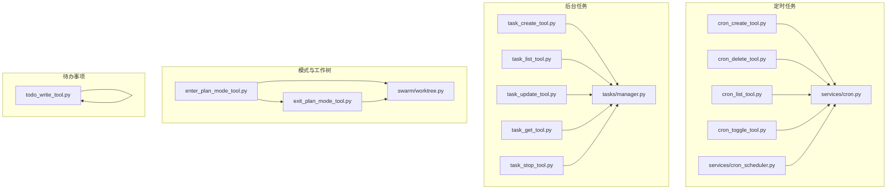
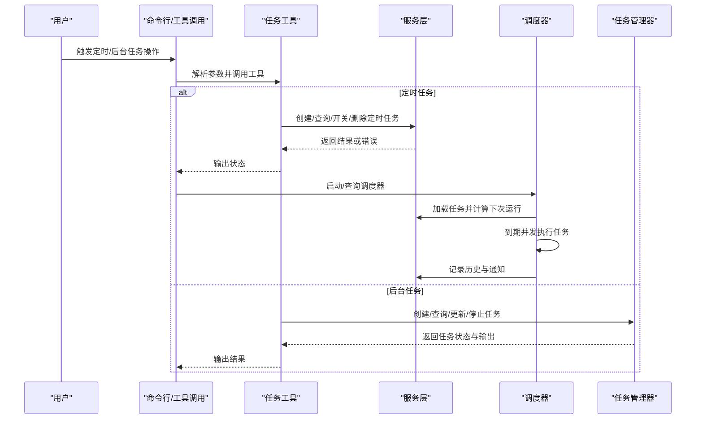
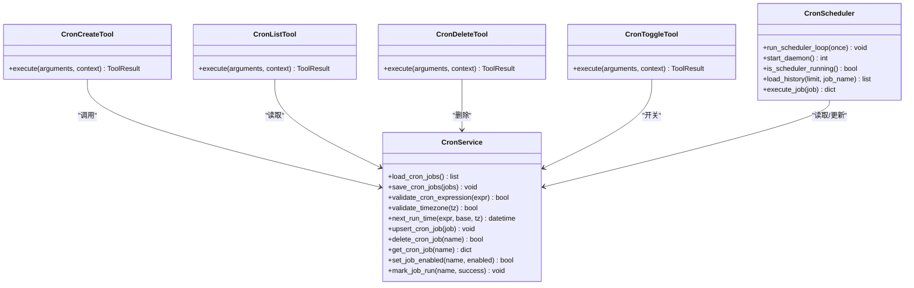
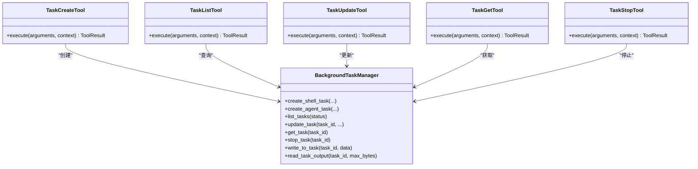
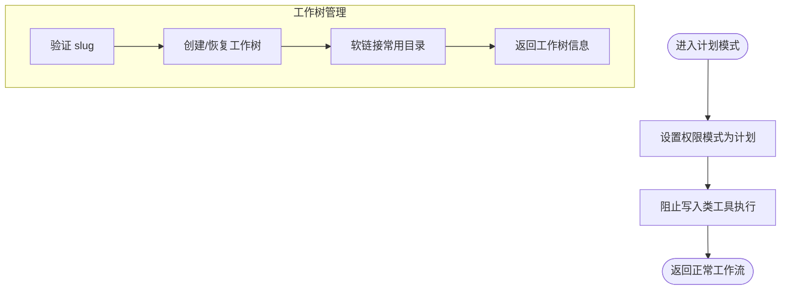
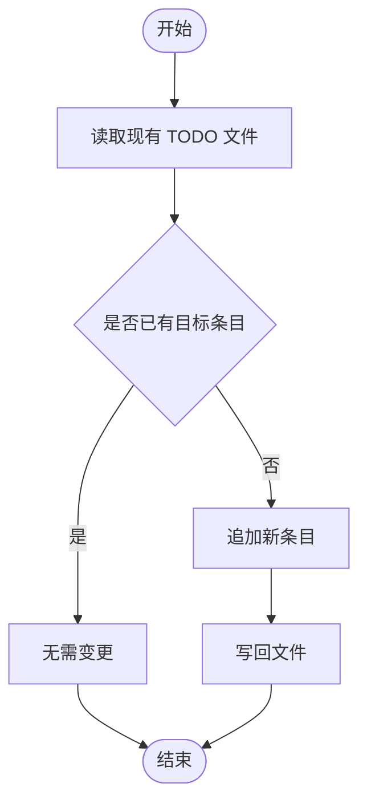
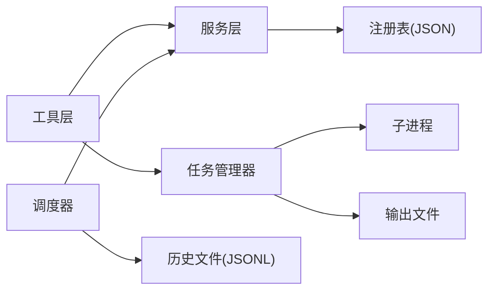

# 时间管理工具

<cite>
**本文引用的文件**
- [cron_create_tool.py](file://src/openharness/tools/cron_create_tool.py)
- [cron_delete_tool.py](file://src/openharness/tools/cron_delete_tool.py)
- [cron_list_tool.py](file://src/openharness/tools/cron_list_tool.py)
- [cron_toggle_tool.py](file://src/openharness/tools/cron_toggle_tool.py)
- [cron.py](file://src/openharness/services/cron.py)
- [cron_scheduler.py](file://src/openharness/services/cron_scheduler.py)
- [task_create_tool.py](file://src/openharness/tools/task_create_tool.py)
- [task_list_tool.py](file://src/openharness/tools/task_list_tool.py)
- [task_update_tool.py](file://src/openharness/tools/task_update_tool.py)
- [task_get_tool.py](file://src/openharness/tools/task_get_tool.py)
- [task_stop_tool.py](file://src/openharness/tools/task_stop_tool.py)
- [manager.py](file://src/openharness/tasks/manager.py)
- [enter_plan_mode_tool.py](file://src/openharness/tools/enter_plan_mode_tool.py)
- [exit_plan_mode_tool.py](file://src/openharness/tools/exit_plan_mode_tool.py)
- [worktree.py](file://src/openharness/swarm/worktree.py)
- [todo_write_tool.py](file://src/openharness/tools/todo_write_tool.py)
</cite>

## 目录
1. [简介](#简介)
2. [项目结构](#项目结构)
3. [核心组件](#核心组件)
4. [架构总览](#架构总览)
5. [详细组件分析](#详细组件分析)
6. [依赖关系分析](#依赖关系分析)
7. [性能考量](#性能考量)
8. [故障排查指南](#故障排查指南)
9. [结论](#结论)
10. [附录](#附录)

## 简介
本技术文档围绕时间管理工具展开，系统性介绍定时任务管理与后台任务管理两大能力域，并深入解析计划模式与工作树模式在时间管理中的作用机制。内容涵盖：
- 定时任务：创建、列表查询、删除、开关切换、通知与历史记录
- 后台任务：创建、查询、更新进度、停止与输出读取
- 计划模式：权限控制与执行限制
- 工作树模式：基于 Git 的隔离执行环境
- 待办事项：Markdown 清单维护
- 高级主题：时间调度、优先级、重复任务、日历集成（概念性）

## 项目结构
时间管理相关代码主要分布在以下模块：
- 定时任务工具与服务：tools/cron_* 与 services/cron*.py
- 后台任务工具与管理器：tools/task_* 与 tasks/manager.py
- 模式切换工具：tools/enter_plan_mode_tool.py、tools/exit_plan_mode_tool.py
- 工作树管理：swarm/worktree.py
- 待办事项工具：tools/todo_write_tool.py

图表来源
- [cron_create_tool.py:1-106](file://src/openharness/tools/cron_create_tool.py#L1-L106)
- [cron_delete_tool.py:1-33](file://src/openharness/tools/cron_delete_tool.py#L1-L33)
- [cron_list_tool.py:1-70](file://src/openharness/tools/cron_list_tool.py#L1-L70)
- [cron_toggle_tool.py:1-38](file://src/openharness/tools/cron_toggle_tool.py#L1-L38)
- [cron.py:1-138](file://src/openharness/services/cron.py#L1-L138)
- [cron_scheduler.py:1-596](file://src/openharness/services/cron_scheduler.py#L1-L596)
- [task_create_tool.py:1-57](file://src/openharness/tools/task_create_tool.py#L1-L57)
- [task_list_tool.py:1-36](file://src/openharness/tools/task_list_tool.py#L1-L36)
- [task_update_tool.py:1-51](file://src/openharness/tools/task_update_tool.py#L1-L51)
- [task_get_tool.py:1-34](file://src/openharness/tools/task_get_tool.py#L1-L34)
- [task_stop_tool.py:1-31](file://src/openharness/tools/task_stop_tool.py#L1-L31)
- [manager.py:1-476](file://src/openharness/tasks/manager.py#L1-L476)
- [enter_plan_mode_tool.py:1-29](file://src/openharness/tools/enter_plan_mode_tool.py#L1-L29)
- [exit_plan_mode_tool.py:1-29](file://src/openharness/tools/exit_plan_mode_tool.py#L1-L29)
- [worktree.py:1-316](file://src/openharness/swarm/worktree.py#L1-L316)
- [todo_write_tool.py:1-47](file://src/openharness/tools/todo_write_tool.py#L1-L47)

章节来源
- [cron_create_tool.py:1-106](file://src/openharness/tools/cron_create_tool.py#L1-L106)
- [cron.py:1-138](file://src/openharness/services/cron.py#L1-L138)
- [cron_scheduler.py:1-596](file://src/openharness/services/cron_scheduler.py#L1-L596)
- [task_create_tool.py:1-57](file://src/openharness/tools/task_create_tool.py#L1-L57)
- [manager.py:1-476](file://src/openharness/tasks/manager.py#L1-L476)
- [enter_plan_mode_tool.py:1-29](file://src/openharness/tools/enter_plan_mode_tool.py#L1-L29)
- [exit_plan_mode_tool.py:1-29](file://src/openharness/tools/exit_plan_mode_tool.py#L1-L29)
- [worktree.py:1-316](file://src/openharness/swarm/worktree.py#L1-L316)
- [todo_write_tool.py:1-47](file://src/openharness/tools/todo_write_tool.py#L1-L47)

## 核心组件
- 定时任务工具集：提供创建、列出、删除、开关定时任务的能力；与调度器配合实现周期性执行与通知。
- 调度器：后台守护进程，按固定间隔扫描到期任务并执行，记录历史与通知结果。
- 后台任务管理器：统一管理本地 Shell 与本地 Agent 任务，支持进度更新、状态查询、停止与输出读取。
- 计划模式工具：切换权限模式，限制写入类工具的执行，保障时间管理过程中的专注与安全。
- 工作树管理：基于 Git worktree 的隔离执行环境，便于多任务并行与上下文隔离。
- 待办事项工具：维护项目级 TODO 清单，支持新增、勾选完成与去重。

章节来源
- [cron_create_tool.py:44-106](file://src/openharness/tools/cron_create_tool.py#L44-L106)
- [cron_list_tool.py:16-70](file://src/openharness/tools/cron_list_tool.py#L16-L70)
- [cron_delete_tool.py:17-33](file://src/openharness/tools/cron_delete_tool.py#L17-L33)
- [cron_toggle_tool.py:18-38](file://src/openharness/tools/cron_toggle_tool.py#L18-L38)
- [cron_scheduler.py:443-480](file://src/openharness/services/cron_scheduler.py#L443-L480)
- [task_create_tool.py:23-57](file://src/openharness/tools/task_create_tool.py#L23-L57)
- [task_list_tool.py:17-36](file://src/openharness/tools/task_list_tool.py#L17-L36)
- [task_update_tool.py:20-51](file://src/openharness/tools/task_update_tool.py#L20-L51)
- [task_get_tool.py:17-34](file://src/openharness/tools/task_get_tool.py#L17-L34)
- [task_stop_tool.py:17-31](file://src/openharness/tools/task_stop_tool.py#L17-L31)
- [manager.py:49-476](file://src/openharness/tasks/manager.py#L49-L476)
- [enter_plan_mode_tool.py:16-29](file://src/openharness/tools/enter_plan_mode_tool.py#L16-L29)
- [exit_plan_mode_tool.py:16-29](file://src/openharness/tools/exit_plan_mode_tool.py#L16-L29)
- [worktree.py:135-316](file://src/openharness/swarm/worktree.py#L135-L316)
- [todo_write_tool.py:20-47](file://src/openharness/tools/todo_write_tool.py#L20-L47)

## 架构总览
下图展示定时任务与后台任务的端到端流程，以及与调度器、任务管理器、工作树与计划模式的关系。

图表来源
- [cron_create_tool.py:54-106](file://src/openharness/tools/cron_create_tool.py#L54-L106)
- [cron_scheduler.py:443-480](file://src/openharness/services/cron_scheduler.py#L443-L480)
- [task_create_tool.py:30-57](file://src/openharness/tools/task_create_tool.py#L30-L57)
- [manager.py:61-158](file://src/openharness/tasks/manager.py#L61-L158)

## 详细组件分析

### 定时任务管理
- 功能清单
  - 创建：校验表达式与时区，支持命令或消息型负载，可配置工作目录、时区、启用状态与通知目标。
  - 列表：显示任务名称、表达式、时区、命令/负载、通知、上次/下次运行时间与状态。
  - 删除：按名称删除任务。
  - 开关：按名称启用/禁用任务。
  - 调度：后台守护进程按固定间隔扫描到期任务，执行并记录历史与通知。
- 关键数据与流程
  - 注册表：以 JSON 文件持久化任务，带锁保护，原子写入。
  - 下次运行时间：支持 IANA 时区，返回 UTC 时间。
  - 执行：支持 Shell 命令与“agent_turn”消息型任务，超时与异常处理，输出截断与历史记录。
  - 通知：支持飞书私信通知，格式包含状态、耗时、输出摘要等。

图表来源
- [cron_create_tool.py:44-106](file://src/openharness/tools/cron_create_tool.py#L44-L106)
- [cron_list_tool.py:16-70](file://src/openharness/tools/cron_list_tool.py#L16-L70)
- [cron_delete_tool.py:17-33](file://src/openharness/tools/cron_delete_tool.py#L17-L33)
- [cron_toggle_tool.py:18-38](file://src/openharness/tools/cron_toggle_tool.py#L18-L38)
- [cron.py:23-138](file://src/openharness/services/cron.py#L23-L138)
- [cron_scheduler.py:443-480](file://src/openharness/services/cron_scheduler.py#L443-L480)

章节来源
- [cron_create_tool.py:13-106](file://src/openharness/tools/cron_create_tool.py#L13-L106)
- [cron_list_tool.py:12-70](file://src/openharness/tools/cron_list_tool.py#L12-L70)
- [cron_delete_tool.py:11-33](file://src/openharness/tools/cron_delete_tool.py#L11-L33)
- [cron_toggle_tool.py:11-38](file://src/openharness/tools/cron_toggle_tool.py#L11-L38)
- [cron.py:23-138](file://src/openharness/services/cron.py#L23-L138)
- [cron_scheduler.py:1-596](file://src/openharness/services/cron_scheduler.py#L1-L596)

### 后台任务管理
- 功能清单
  - 创建：支持本地 Shell 与本地 Agent 两类任务；Agent 任务默认通过子进程启动，必要时自动注入 API Key。
  - 查询：按状态过滤列出任务，支持读取输出尾部内容。
  - 更新：更新描述、进度百分比与状态备注，用于协作与 UI 展示。
  - 获取：返回任务详细状态。
  - 停止：终止运行中任务，处理超时与强制杀死。
- 关键数据与流程
  - 任务记录：包含类型、状态、描述、工作目录、输出文件、命令/参数、环境变量、元数据等。
  - 进程管理：统一管理子进程生命周期，复制输出、等待结束、清理资源。
  - 输入写入：对可输入任务进行协议封装后写入 stdin，必要时自动重启恢复交互。

图表来源
- [task_create_tool.py:23-57](file://src/openharness/tools/task_create_tool.py#L23-L57)
- [task_list_tool.py:17-36](file://src/openharness/tools/task_list_tool.py#L17-L36)
- [task_update_tool.py:20-51](file://src/openharness/tools/task_update_tool.py#L20-L51)
- [task_get_tool.py:17-34](file://src/openharness/tools/task_get_tool.py#L17-L34)
- [task_stop_tool.py:17-31](file://src/openharness/tools/task_stop_tool.py#L17-L31)
- [manager.py:49-476](file://src/openharness/tasks/manager.py#L49-L476)

章节来源
- [task_create_tool.py:1-57](file://src/openharness/tools/task_create_tool.py#L1-L57)
- [task_list_tool.py:1-36](file://src/openharness/tools/task_list_tool.py#L1-L36)
- [task_update_tool.py:1-51](file://src/openharness/tools/task_update_tool.py#L1-L51)
- [task_get_tool.py:1-34](file://src/openharness/tools/task_get_tool.py#L1-L34)
- [task_stop_tool.py:1-31](file://src/openharness/tools/task_stop_tool.py#L1-L31)
- [manager.py:1-476](file://src/openharness/tasks/manager.py#L1-L476)

### 计划模式与工作树模式
- 计划模式
  - 通过切换权限模式，限制写入类工具的执行，避免在规划阶段误操作。
  - UI 中有指示器提示当前是否处于计划模式及被阻塞的工具。
- 工作树模式
  - 基于 Git worktree 提供隔离执行环境，支持创建、移除、枚举与清理过期工作树。
  - 通过符号链接复用大型目录，减少磁盘占用。

图表来源
- [enter_plan_mode_tool.py:16-29](file://src/openharness/tools/enter_plan_mode_tool.py#L16-L29)
- [exit_plan_mode_tool.py:16-29](file://src/openharness/tools/exit_plan_mode_tool.py#L16-L29)
- [worktree.py:21-56](file://src/openharness/swarm/worktree.py#L21-L56)
- [worktree.py:150-212](file://src/openharness/swarm/worktree.py#L150-L212)

章节来源
- [enter_plan_mode_tool.py:1-29](file://src/openharness/tools/enter_plan_mode_tool.py#L1-L29)
- [exit_plan_mode_tool.py:1-29](file://src/openharness/tools/exit_plan_mode_tool.py#L1-L29)
- [worktree.py:1-316](file://src/openharness/swarm/worktree.py#L1-L316)

### 待办事项管理
- 功能：在指定路径维护 TODO.md，支持新增未完成项、勾选已完成项与去重。
- 行为：若已存在相同条目则无变更；否则追加新行。

图表来源
- [todo_write_tool.py:27-47](file://src/openharness/tools/todo_write_tool.py#L27-L47)

章节来源
- [todo_write_tool.py:1-47](file://src/openharness/tools/todo_write_tool.py#L1-L47)

## 依赖关系分析
- 工具到服务/管理器的依赖
  - 定时任务工具依赖服务层进行注册表读写与调度计算。
  - 调度器直接依赖服务层加载/更新任务与记录历史。
  - 后台任务工具依赖任务管理器进行进程生命周期管理。
- 平台与外部集成
  - 调度器通过子进程执行命令或消息型任务，支持超时与异常处理。
  - 通知通过 ohmo 网关发送飞书私信。
- 内聚与耦合
  - 工具层职责单一，服务/管理器层负责状态持久化与执行细节，内聚性高、耦合度低。
  - 调度器与服务层通过注册表解耦，便于扩展与测试。

图表来源
- [cron.py:23-41](file://src/openharness/services/cron.py#L23-L41)
- [cron_scheduler.py:54-85](file://src/openharness/services/cron_scheduler.py#L54-L85)
- [manager.py:61-158](file://src/openharness/tasks/manager.py#L61-L158)

章节来源
- [cron.py:1-138](file://src/openharness/services/cron.py#L1-L138)
- [cron_scheduler.py:1-596](file://src/openharness/services/cron_scheduler.py#L1-L596)
- [manager.py:1-476](file://src/openharness/tasks/manager.py#L1-L476)

## 性能考量
- 定时任务
  - 调度轮询间隔为固定秒数，建议根据任务数量与系统负载调整。
  - 并发执行到期任务，注意 I/O 与 CPU 资源竞争。
  - 历史文件采用逐条追加，建议定期归档或轮转。
- 后台任务
  - 输出复制采用分块读取，避免一次性占用内存。
  - 对可输入任务的 stdin 写入加锁，保证并发安全。
  - 任务重启会丢失交互上下文，需在设计上考虑幂等与状态持久化。
- 计划模式
  - 仅在 UI 层提示阻塞，不引入额外计算开销。
- 工作树
  - 使用符号链接减少磁盘占用，但需注意跨平台兼容性与权限问题。

## 故障排查指南
- 定时任务
  - 表达式无效：检查标准 5 字段格式与时区合法性。
  - 任务未执行：确认调度器已启动、任务启用且下次运行时间已到达。
  - 通知失败：检查通知类型与目标参数，查看历史记录中的错误字段。
- 后台任务
  - 无法写入输入：确认任务类型支持输入，必要时触发重启。
  - 进程未退出：检查超时与强制杀死逻辑，查看输出文件定位问题。
- 计划模式
  - 写入类工具被阻塞：切换回默认模式或调整权限策略。
- 工作树
  - 创建失败：检查 Git 可用性与仓库路径，确认 slug 合法性。
  - 清理无效：确认 agent_id 与活跃代理集合，避免误删。

章节来源
- [cron_create_tool.py:59-84](file://src/openharness/tools/cron_create_tool.py#L59-L84)
- [cron_scheduler.py:249-281](file://src/openharness/services/cron_scheduler.py#L249-L281)
- [manager.py:215-230](file://src/openharness/tasks/manager.py#L215-L230)
- [worktree.py:150-212](file://src/openharness/swarm/worktree.py#L150-L212)

## 结论
该时间管理工具以“定时任务 + 后台任务 + 模式与隔离”为核心，提供了从计划到执行再到追踪的完整闭环。通过清晰的工具层与服务/管理器层分离，既保证了易用性，也为扩展与维护提供了良好基础。建议在生产环境中结合日志与监控完善可观测性，并根据实际负载调优调度轮询与任务并发策略。

## 附录
- 使用场景示例（路径指引）
  - 创建每 5 分钟拉取一次的定时任务：[cron_create_tool.py:54-106](file://src/openharness/tools/cron_create_tool.py#L54-L106)
  - 查看所有任务与下次运行时间：[cron_list_tool.py:27-70](file://src/openharness/tools/cron_list_tool.py#L27-L70)
  - 启动调度器守护进程：[cron_scheduler.py:532-551](file://src/openharness/services/cron_scheduler.py#L532-L551)
  - 创建一个本地 Agent 任务并持续跟踪进度：[task_create_tool.py:40-56](file://src/openharness/tools/task_create_tool.py#L40-L56)，[task_update_tool.py:33-50](file://src/openharness/tools/task_update_tool.py#L33-L50)
  - 在计划模式下避免误写入：[enter_plan_mode_tool.py:23-28](file://src/openharness/tools/enter_plan_mode_tool.py#L23-L28)
  - 基于工作树隔离执行多个任务：[worktree.py:150-212](file://src/openharness/swarm/worktree.py#L150-L212)
  - 维护项目 TODO 清单：[todo_write_tool.py:27-47](file://src/openharness/tools/todo_write_tool.py#L27-L47)