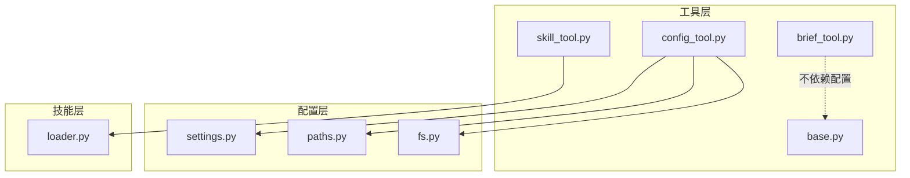
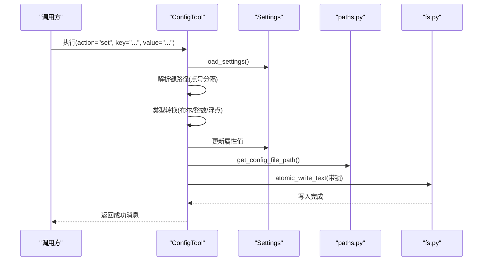
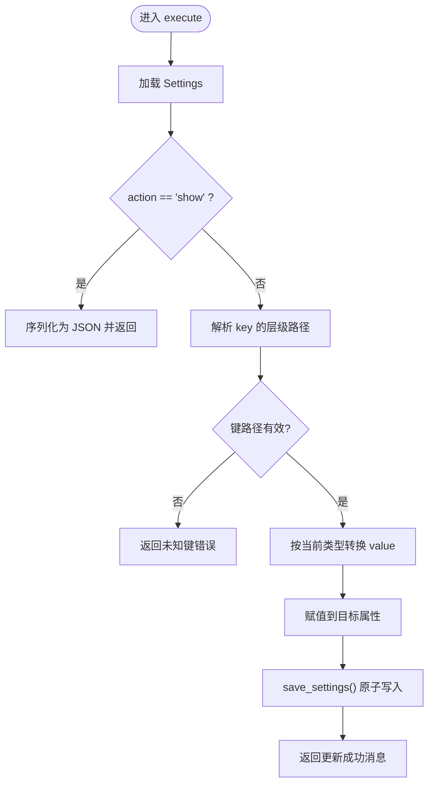
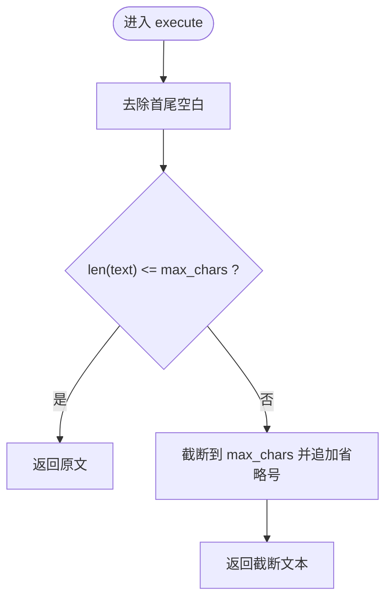
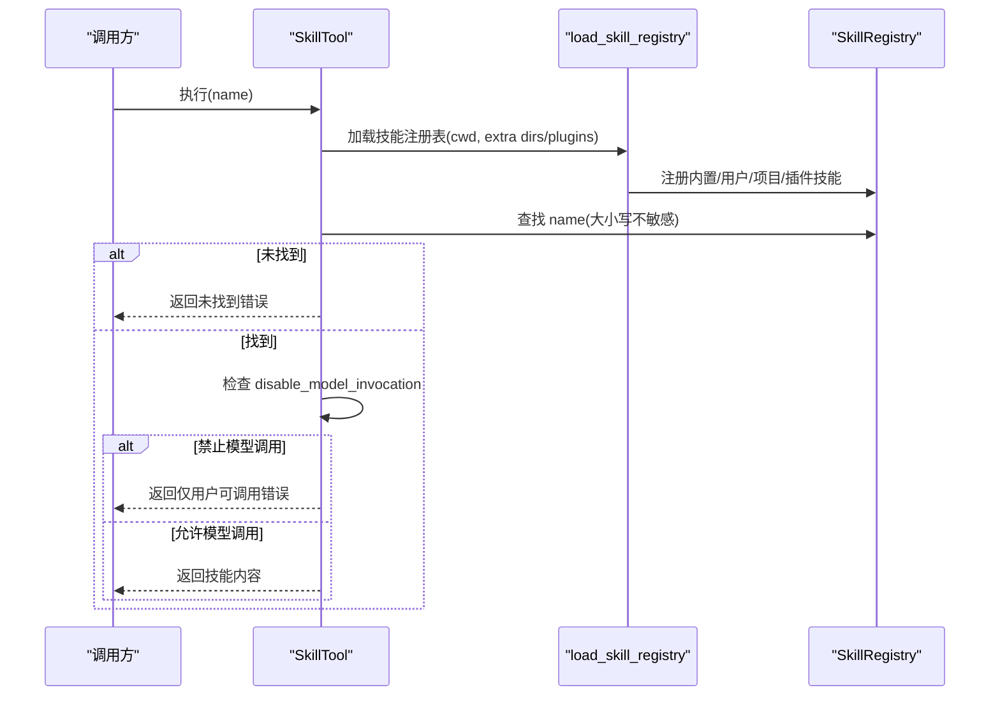
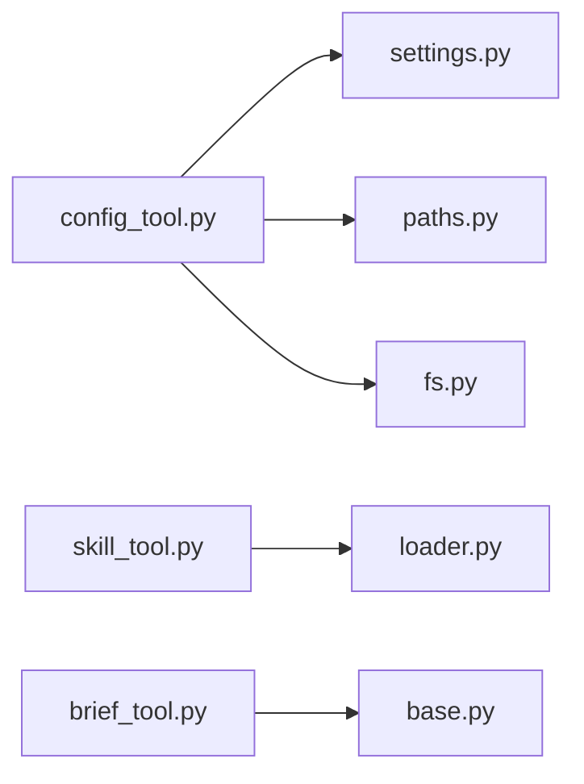

# 系统配置工具

<cite>
**本文引用的文件**
- [config_tool.py](file://src/openharness/tools/config_tool.py)
- [brief_tool.py](file://src/openharness/tools/brief_tool.py)
- [skill_tool.py](file://src/openharness/tools/skill_tool.py)
- [settings.py](file://src/openharness/config/settings.py)
- [paths.py](file://src/openharness/config/paths.py)
- [base.py](file://src/openharness/tools/base.py)
- [loader.py](file://src/openharness/skills/loader.py)
- [fs.py](file://src/openharness/utils/fs.py)
- [test_core_tools.py](file://tests/test_tools/test_core_tools.py)
</cite>

## 目录
1. [简介](#简介)
2. [项目结构](#项目结构)
3. [核心组件](#核心组件)
4. [架构总览](#架构总览)
5. [详细组件分析](#详细组件分析)
6. [依赖关系分析](#依赖关系分析)
7. [性能考量](#性能考量)
8. [故障排查指南](#故障排查指南)
9. [结论](#结论)
10. [附录](#附录)

## 简介
本文件面向“系统配置工具”的技术文档，围绕以下三个核心工具展开：
- config_tool：提供设置读取与写入能力，支持层级键路径更新与类型安全转换，并通过原子写入保障并发安全。
- brief_tool：对文本进行截断式摘要输出，用于紧凑显示与上下文控制。
- skill_tool：按名称检索已加载的技能内容，支持用户仅可调用技能的访问限制。

同时，文档涵盖配置模型、环境变量覆盖、配置文件路径解析、并发写入保护等高级主题，并给出常见使用场景与测试参考。

## 项目结构
与“系统配置工具”直接相关的模块组织如下：
- 工具层：tools 目录下包含 config_tool、brief_tool、skill_tool 及通用基类与注册表。
- 配置层：config 目录下包含 Settings 模型、加载/保存逻辑与路径解析。
- 技能层：skills 目录下包含技能发现、加载与注册表。
- 原子写入：utils/fs 提供原子写入与锁文件机制，确保配置持久化安全。

**图表来源**
- [config_tool.py:1-55](file://src/openharness/tools/config_tool.py#L1-L55)
- [brief_tool.py:1-34](file://src/openharness/tools/brief_tool.py#L1-L34)
- [skill_tool.py:1-44](file://src/openharness/tools/skill_tool.py#L1-L44)
- [settings.py:1-1030](file://src/openharness/config/settings.py#L1-L1030)
- [paths.py:1-161](file://src/openharness/config/paths.py#L1-L161)
- [loader.py:1-230](file://src/openharness/skills/loader.py#L1-L230)
- [fs.py:1-99](file://src/openharness/utils/fs.py#L1-L99)

**章节来源**
- [config_tool.py:1-55](file://src/openharness/tools/config_tool.py#L1-L55)
- [brief_tool.py:1-34](file://src/openharness/tools/brief_tool.py#L1-L34)
- [skill_tool.py:1-44](file://src/openharness/tools/skill_tool.py#L1-L44)
- [settings.py:1-1030](file://src/openharness/config/settings.py#L1-L1030)
- [paths.py:1-161](file://src/openharness/config/paths.py#L1-L161)
- [loader.py:1-230](file://src/openharness/skills/loader.py#L1-L230)
- [fs.py:1-99](file://src/openharness/utils/fs.py#L1-L99)

## 核心组件
- 配置工具（config_tool）
  - 功能：读取或设置 OpenHarness 设置；支持 show 与 set 两种动作；键路径支持点号分隔的层级访问；自动进行布尔/整数/浮点类型转换；变更后持久化到配置文件。
  - 关键流程：加载设置 -> 判断动作 -> 解析键路径 -> 类型转换 -> 写回 -> 保存。
- 摘要工具（brief_tool）
  - 功能：将输入文本按最大字符数截断，适合在受限上下文窗口中展示。
  - 关键流程：去除首尾空白 -> 判断长度 -> 截断并追加省略号。
- 技能工具（skill_tool）
  - 功能：根据名称查找已加载技能；若技能声明为仅用户可调用，则拒绝模型直接触发。
  - 关键流程：构建技能注册表 -> 查找名称（大小写不敏感）-> 校验是否允许模型调用 -> 返回内容或错误。

**章节来源**
- [config_tool.py:21-55](file://src/openharness/tools/config_tool.py#L21-L55)
- [brief_tool.py:17-34](file://src/openharness/tools/brief_tool.py#L17-L34)
- [skill_tool.py:17-44](file://src/openharness/tools/skill_tool.py#L17-L44)

## 架构总览
配置工具链路涉及配置模型、环境变量覆盖、文件路径解析与原子写入；技能工具链路涉及技能注册表与前端数据结构。

**图表来源**
- [config_tool.py:28-54](file://src/openharness/tools/config_tool.py#L28-L54)
- [settings.py:972-1029](file://src/openharness/config/settings.py#L972-L1029)
- [paths.py:32-34](file://src/openharness/config/paths.py#L32-L34)
- [fs.py:69-78](file://src/openharness/utils/fs.py#L69-L78)

## 详细组件分析

### 配置工具（config_tool）
- 输入模型
  - action：字符串，支持 "show" 或 "set"
  - key：字符串，层级键路径（如 "memory.enabled"）
  - value：字符串，待设置的新值
- 执行逻辑
  - show：返回当前设置的 JSON 字符串
  - set：解析 key 的层级路径，逐级定位目标属性，进行类型转换后写回，再保存到配置文件
- 错误处理
  - 未知键：返回错误结果
  - 参数缺失：返回用法提示
- 并发安全
  - 保存时使用独占锁与原子写入，避免竞态与部分写入

**图表来源**
- [config_tool.py:28-54](file://src/openharness/tools/config_tool.py#L28-L54)
- [settings.py:1011-1029](file://src/openharness/config/settings.py#L1011-L1029)

**章节来源**
- [config_tool.py:13-55](file://src/openharness/tools/config_tool.py#L13-L55)
- [settings.py:972-1029](file://src/openharness/config/settings.py#L972-L1029)
- [paths.py:32-34](file://src/openharness/config/paths.py#L32-L34)
- [fs.py:69-78](file://src/openharness/utils/fs.py#L69-L78)

### 摘要工具（brief_tool）
- 输入模型
  - text：待缩短的文本
  - max_chars：最大字符数，默认 200，范围 20-2000
- 执行逻辑
  - 去除首尾空白
  - 若长度小于等于阈值，直接返回原文
  - 否则截断至阈值并追加省略号
- 只读属性
  - is_read_only 返回 True，表示该工具不产生副作用

**图表来源**
- [brief_tool.py:28-34](file://src/openharness/tools/brief_tool.py#L28-L34)

**章节来源**
- [brief_tool.py:10-34](file://src/openharness/tools/brief_tool.py#L10-L34)

### 技能工具（skill_tool）
- 输入模型
  - name：技能名称
- 执行逻辑
  - 基于当前工作目录与元数据加载技能注册表
  - 支持精确匹配、全小写、首字母大写三种形式查找
  - 若技能声明禁止模型调用，返回错误并提示以命令方式调用
  - 否则返回技能内容
- 依赖
  - 技能注册表由技能加载器构建，支持内置、用户、项目与插件技能

**图表来源**
- [skill_tool.py:28-44](file://src/openharness/tools/skill_tool.py#L28-L44)
- [loader.py:42-76](file://src/openharness/skills/loader.py#L42-L76)

**章节来源**
- [skill_tool.py:11-44](file://src/openharness/tools/skill_tool.py#L11-L44)
- [loader.py:42-230](file://src/openharness/skills/loader.py#L42-L230)

## 依赖关系分析
- 配置工具依赖
  - Settings：配置模型与加载/保存
  - 路径解析：默认配置文件路径
  - 原子写入：独占锁 + 原子替换，防止并发写入损坏
- 技能工具依赖
  - 技能加载器：从多源目录加载技能，构建注册表
  - 上下文元数据：额外技能目录与插件根目录
- 工具基类
  - 统一的工具接口、只读判定与 API 模式导出

**图表来源**
- [config_tool.py:9-10](file://src/openharness/tools/config_tool.py#L9-L10)
- [settings.py:972-1029](file://src/openharness/config/settings.py#L972-L1029)
- [paths.py:32-34](file://src/openharness/config/paths.py#L32-L34)
- [fs.py:69-78](file://src/openharness/utils/fs.py#L69-L78)
- [skill_tool.py:7-8](file://src/openharness/tools/skill_tool.py#L7-L8)
- [loader.py:42-76](file://src/openharness/skills/loader.py#L42-L76)
- [brief_tool.py:7](file://src/openharness/tools/brief_tool.py#L7)
- [base.py:35-58](file://src/openharness/tools/base.py#L35-L58)

**章节来源**
- [config_tool.py:9-10](file://src/openharness/tools/config_tool.py#L9-L10)
- [skill_tool.py:7-8](file://src/openharness/tools/skill_tool.py#L7-L8)
- [brief_tool.py:7](file://src/openharness/tools/brief_tool.py#L7)
- [base.py:35-58](file://src/openharness/tools/base.py#L35-L58)

## 性能考量
- 配置读取
  - Settings 默认实例与文件合并，仅在首次加载时进行一次 JSON 解析与模型校验；后续可通过内存缓存减少 IO。
- 配置写入
  - 使用原子写入与独占锁，避免频繁写入导致的锁竞争；建议批量更新后再写入，降低锁持有时间。
- 文本摘要
  - 截断操作为 O(n) 时间复杂度，max_chars 限制在合理范围内（如 200-2000），避免过长文本带来的内存压力。
- 技能查找
  - 注册表为字典结构，查找近似 O(1)，但构建过程会遍历多个目录；建议在启动阶段预热注册表，避免运行时抖动。

[本节为通用性能讨论，无需特定文件来源]

## 故障排查指南
- 配置键不存在
  - 症状：返回“未知配置键”错误
  - 排查：确认键路径是否正确；支持点号分隔的层级；检查大小写与拼写
  - 参考实现位置：[config_tool.py:37-42](file://src/openharness/tools/config_tool.py#L37-L42)
- 类型转换失败
  - 症状：设置失败或异常
  - 排查：确认传入字符串与目标类型的兼容性（布尔/整数/浮点）
  - 参考实现位置：[config_tool.py:45-50](file://src/openharness/tools/config_tool.py#L45-L50)
- 并发写入冲突
  - 症状：配置文件损坏或读取异常
  - 排查：确保同一进程内串行写入；避免外部进程同时编辑；检查锁文件是否存在
  - 参考实现位置：[settings.py:1023-1029](file://src/openharness/config/settings.py#L1023-L1029)、[fs.py:69-78](file://src/openharness/utils/fs.py#L69-L78)
- 技能不可调用
  - 症状：返回“仅用户可调用”错误
  - 排查：检查技能 frontmatter 中的禁用标志；确认调用方式是否符合要求
  - 参考实现位置：[skill_tool.py:37-42](file://src/openharness/tools/skill_tool.py#L37-L42)
- 技能未找到
  - 症状：返回“技能未找到”
  - 排查：确认技能名称与实际一致；检查技能目录与权限；确认是否启用插件
  - 参考实现位置：[skill_tool.py:35](file://src/openharness/tools/skill_tool.py#L35)、[loader.py:42-76](file://src/openharness/skills/loader.py#L42-L76)

**章节来源**
- [config_tool.py:37-50](file://src/openharness/tools/config_tool.py#L37-L50)
- [settings.py:1023-1029](file://src/openharness/config/settings.py#L1023-L1029)
- [fs.py:69-78](file://src/openharness/utils/fs.py#L69-L78)
- [skill_tool.py:35-42](file://src/openharness/tools/skill_tool.py#L35-L42)
- [loader.py:42-76](file://src/openharness/skills/loader.py#L42-L76)

## 结论
- config_tool 提供了类型安全、层级化的配置读写能力，并通过原子写入与锁文件保障并发安全。
- brief_tool 以简单高效的截断策略满足紧凑显示需求。
- skill_tool 将技能内容暴露给模型调用，同时保留“仅用户可调用”的安全边界。
- 配置模型与环境变量覆盖机制、路径解析与原子写入共同构成了稳定可靠的配置基础设施。

[本节为总结性内容，无需特定文件来源]

## 附录

### 使用场景与示例（基于测试）
- 配置工具
  - 设置主题：action="set", key="theme", value="solarized"
  - 参考测试：[test_core_tools.py:223-228](file://tests/test_tools/test_core_tools.py#L223-L228)
- 摘要工具
  - 截断文本：text="abcdefghijklmnopqrstuvwxyz", max_chars=20
  - 参考测试：[test_core_tools.py:194-198](file://tests/test_tools/test_core_tools.py#L194-L198)
- 技能工具
  - 读取技能：name="Pytest"，需预先在配置目录下准备技能文件
  - 参考测试：[test_core_tools.py:210-214](file://tests/test_tools/test_core_tools.py#L210-L214)
  - 仅用户可调用技能：name="deploy"，应返回错误提示
  - 参考测试：[test_core_tools.py:246-252](file://tests/test_tools/test_core_tools.py#L246-L252)

**章节来源**
- [test_core_tools.py:194-252](file://tests/test_tools/test_core_tools.py#L194-L252)

### 高级主题
- 配置验证
  - Settings 使用 Pydantic 模型进行字段校验与默认值填充；支持从文件、环境变量与 CLI 覆盖合并。
  - 参考实现位置：[settings.py:534-626](file://src/openharness/config/settings.py#L534-L626)
- 版本管理与迁移
  - 当配置文件缺少“profiles/active_profile”字段时，系统会自动从旧字段推导并补全，保证向后兼容。
  - 参考实现位置：[settings.py:992-1002](file://src/openharness/config/settings.py#L992-L1002)
- 备份与恢复
  - 配置文件位于用户主目录下的 XDG 风格目录中；可通过复制该文件实现备份与恢复。
  - 参考实现位置：[paths.py:15-34](file://src/openharness/config/paths.py#L15-L34)

**章节来源**
- [settings.py:534-626](file://src/openharness/config/settings.py#L534-L626)
- [settings.py:992-1002](file://src/openharness/config/settings.py#L992-L1002)
- [paths.py:15-34](file://src/openharness/config/paths.py#L15-L34)