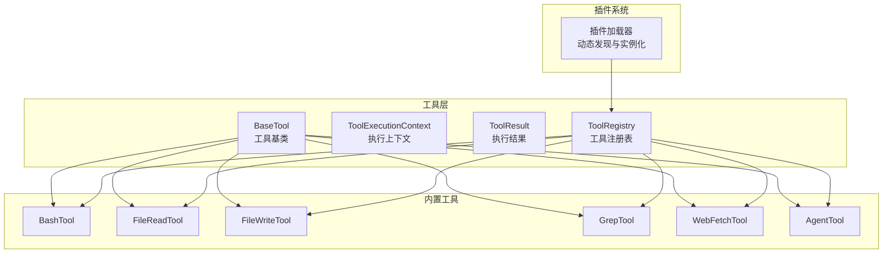
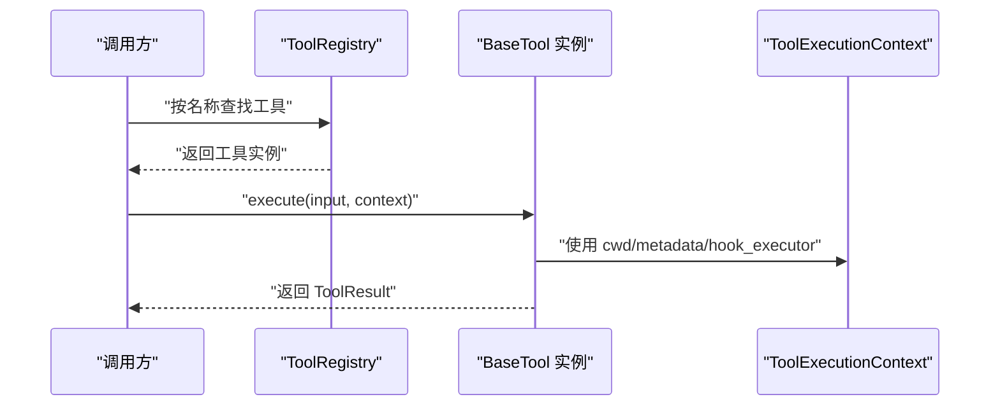
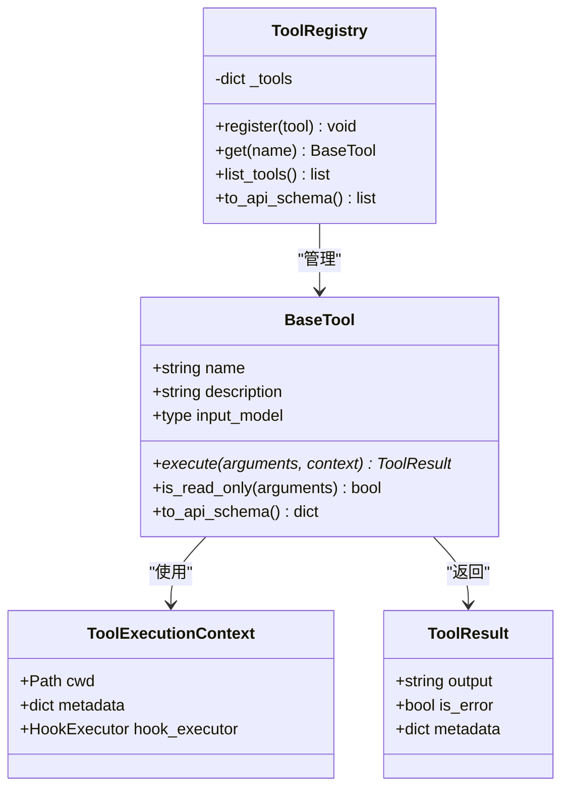
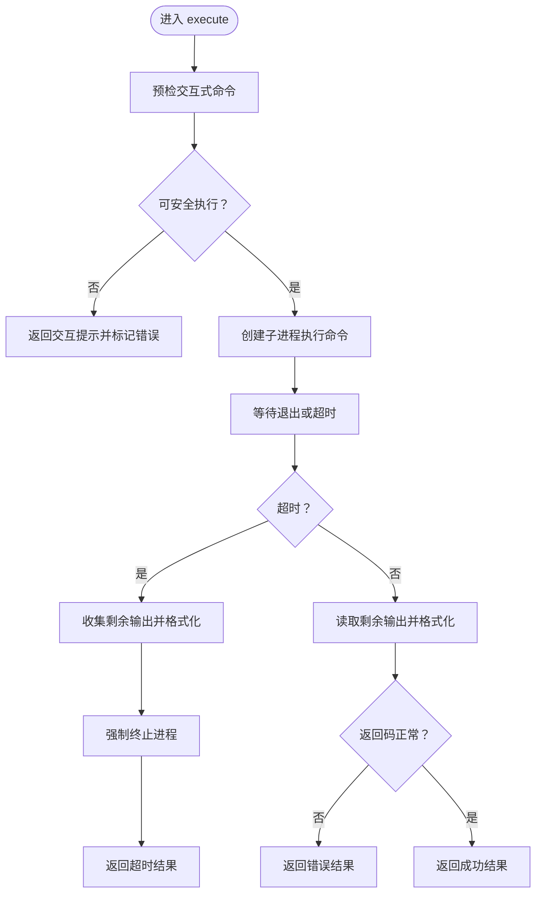
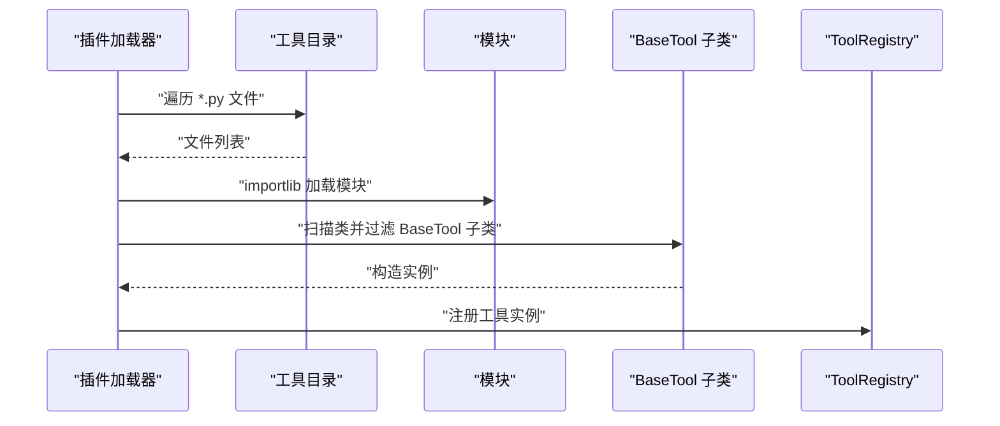
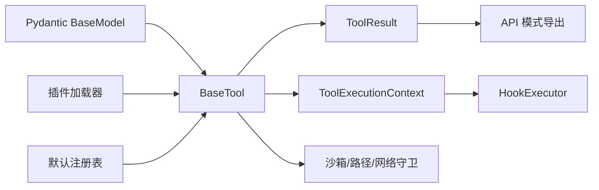

# 自定义工具开发

<cite>
**本文引用的文件**   
- [src/openharness/tools/base.py](file://src/openharness/tools/base.py)
- [src/openharness/tools/__init__.py](file://src/openharness/tools/__init__.py)
- [src/openharness/tools/agent_tool.py](file://src/openharness/tools/agent_tool.py)
- [src/openharness/tools/bash_tool.py](file://src/openharness/tools/bash_tool.py)
- [src/openharness/tools/web_fetch_tool.py](file://src/openharness/tools/web_fetch_tool.py)
- [src/openharness/tools/file_read_tool.py](file://src/openharness/tools/file_read_tool.py)
- [src/openharness/tools/file_write_tool.py](file://src/openharness/tools/file_write_tool.py)
- [src/openharness/tools/grep_tool.py](file://src/openharness/tools/grep_tool.py)
- [src/openharness/plugins/loader.py](file://src/openharness/plugins/loader.py)
- [src/openharness/hooks/loader.py](file://src/openharness/hooks/loader.py)
</cite>

## 目录
1. [简介](#简介)
2. [项目结构](#项目结构)
3. [核心组件](#核心组件)
4. [架构总览](#架构总览)
5. [详细组件分析](#详细组件分析)
6. [依赖关系分析](#依赖关系分析)
7. [性能考量](#性能考量)
8. [故障排查指南](#故障排查指南)
9. [结论](#结论)
10. [附录：开发流程与模板](#附录开发流程与模板)

## 简介
本指南面向希望在 OpenHarness 中开发自定义工具的工程师，系统讲解 BaseTool 基类设计、工具类继承规范、输入输出接口定义、参数校验、错误处理、性能优化与安全注意事项，并提供从需求分析到测试部署的完整流程，以及工具注册、动态加载与版本管理等高级技巧。文档同时给出多类内置工具作为参考实现，帮助快速上手。

## 项目结构
OpenHarness 的工具体系围绕“基类 + 注册表 + 内置工具 + 插件扩展”的模式组织：
- 工具基类与注册表位于 tools 子包，统一抽象工具的执行模型与对外接口。
- 内置工具覆盖文件读写、命令执行、内容检索、网页抓取、子代理编排等常见场景。
- 插件系统支持在运行时动态发现并加载工具模块，实现“即插即用”。

图表来源
- [src/openharness/tools/base.py:35-81](file://src/openharness/tools/base.py#L35-L81)
- [src/openharness/tools/__init__.py:48-98](file://src/openharness/tools/__init__.py#L48-L98)
- [src/openharness/plugins/loader.py:691-731](file://src/openharness/plugins/loader.py#L691-L731)

章节来源
- [src/openharness/tools/base.py:17-81](file://src/openharness/tools/base.py#L17-L81)
- [src/openharness/tools/__init__.py:1-108](file://src/openharness/tools/__init__.py#L1-L108)
- [src/openharness/plugins/loader.py:691-731](file://src/openharness/plugins/loader.py#L691-L731)

## 核心组件
- BaseTool 抽象了所有工具的共同行为：名称、描述、输入模型、执行方法、只读标记、API 模式导出。
- ToolExecutionContext 提供工作目录、元数据、钩子执行器等共享上下文。
- ToolResult 规范化工具返回值，统一输出文本、错误标志与元信息。
- ToolRegistry 负责工具注册、查询与 API 模式导出。

章节来源
- [src/openharness/tools/base.py:35-81](file://src/openharness/tools/base.py#L35-L81)

## 架构总览
下图展示工具调用链路：客户端或上层服务构造输入模型，通过 ToolRegistry 查找工具，调用 BaseTool.execute，最终以 ToolResult 返回。

图表来源
- [src/openharness/tools/base.py:60-81](file://src/openharness/tools/base.py#L60-L81)
- [src/openharness/tools/base.py:35-58](file://src/openharness/tools/base.py#L35-L58)

## 详细组件分析

### BaseTool 基类与工具注册表
- 设计要点
  - 输入模型由 Pydantic BaseModel 定义，确保参数自动校验与 JSON Schema 导出。
  - is_read_only 可选覆写，用于声明工具是否无副作用，便于策略控制。
  - to_api_schema 将工具元信息与输入模式导出为 API 可消费格式。
  - ToolRegistry 提供注册、查询、枚举与批量 API 模式导出能力。

图表来源
- [src/openharness/tools/base.py:17-81](file://src/openharness/tools/base.py#L17-L81)

章节来源
- [src/openharness/tools/base.py:35-81](file://src/openharness/tools/base.py#L35-L81)

### 内置工具：BashTool（命令执行）
- 输入模型包含命令、工作目录覆盖、超时秒数；执行时进行交互式命令预检，避免阻塞。
- 支持非交互式超时处理与输出截断，保证稳定性。
- 使用沙箱子进程执行，支持取消与强制终止。

图表来源
- [src/openharness/tools/bash_tool.py:34-85](file://src/openharness/tools/bash_tool.py#L34-L85)
- [src/openharness/tools/bash_tool.py:155-219](file://src/openharness/tools/bash_tool.py#L155-L219)

章节来源
- [src/openharness/tools/bash_tool.py:19-85](file://src/openharness/tools/bash_tool.py#L19-L85)
- [src/openharness/tools/bash_tool.py:155-219](file://src/openharness/tools/bash_tool.py#L155-L219)

### 内置工具：FileReadTool（文件读取）
- 仅只读访问，路径解析与权限校验在沙箱模式下受控。
- 支持偏移与行数限制，输出带行号；二进制文件拒绝读取。

章节来源
- [src/openharness/tools/file_read_tool.py:20-65](file://src/openharness/tools/file_read_tool.py#L20-L65)

### 内置工具：FileWriteTool（文件写入）
- 支持目录自动创建；可选用户审批流程，计算差异并以 ANSI 统计输出变更量。
- 沙箱模式下进行路径校验，拒绝越权写入。

章节来源
- [src/openharness/tools/file_write_tool.py:21-60](file://src/openharness/tools/file_write_tool.py#L21-L60)

### 内置工具：GrepTool（内容检索）
- 优先使用 ripgrep（rg）高性能检索，不可用时回退纯 Python 正则实现。
- 支持大小写敏感、文件通配、限制条数、超时控制与输出截断。
- 对长行缓冲区有保护，避免溢出。

章节来源
- [src/openharness/tools/grep_tool.py:15-94](file://src/openharness/tools/grep_tool.py#L15-L94)
- [src/openharness/tools/grep_tool.py:164-308](file://src/openharness/tools/grep_tool.py#L164-L308)

### 内置工具：WebFetchTool（网页抓取）
- URL 校验与网络访问守卫，支持最大字符数截断与 HTML 文本抽取。
- 输出包含外部内容提示，避免被误认为可执行指令。

章节来源
- [src/openharness/tools/web_fetch_tool.py:26-71](file://src/openharness/tools/web_fetch_tool.py#L26-L71)
- [src/openharness/tools/web_fetch_tool.py:87-118](file://src/openharness/tools/web_fetch_tool.py#L87-L118)

### 内置工具：AgentTool（子代理编排）
- 支持本地/远程/进程内三种模式，按团队与代理类型配置执行后端。
- 集成任务生命周期钩子，向调用方广播子代理停止事件。

章节来源
- [src/openharness/tools/agent_tool.py:20-142](file://src/openharness/tools/agent_tool.py#L20-L142)

### 默认工具注册表与 API 模式导出
- create_default_tool_registry 一次性注册大量内置工具，并根据 MCP 管理器动态注入 MCP 工具。
- ToolRegistry.to_api_schema 将所有工具的 API 模式导出，便于与外部模型对接。

章节来源
- [src/openharness/tools/__init__.py:48-98](file://src/openharness/tools/__init__.py#L48-L98)
- [src/openharness/tools/base.py:78-81](file://src/openharness/tools/base.py#L78-L81)

### 插件系统中的工具动态加载
- 插件工具目录下的每个 Python 文件会被动态导入，扫描其中继承自 BaseTool 的类并实例化。
- 仅当类具备 name/description 属性且非基类本身时才被纳入注册表。

图表来源
- [src/openharness/plugins/loader.py:691-731](file://src/openharness/plugins/loader.py#L691-L731)

章节来源
- [src/openharness/plugins/loader.py:691-731](file://src/openharness/plugins/loader.py#L691-L731)

## 依赖关系分析
- 工具基类依赖 Pydantic 进行输入模型校验与 JSON Schema 导出。
- 执行上下文可选注入 HookExecutor，用于工具与上层系统解耦的事件通知。
- 内置工具广泛复用沙箱会话、路径校验、网络守卫等基础设施，确保安全与稳定。
- 插件工具通过动态导入机制与默认注册表无缝集成。

图表来源
- [src/openharness/tools/base.py:35-81](file://src/openharness/tools/base.py#L35-L81)
- [src/openharness/tools/__init__.py:48-98](file://src/openharness/tools/__init__.py#L48-L98)
- [src/openharness/plugins/loader.py:691-731](file://src/openharness/plugins/loader.py#L691-L731)

章节来源
- [src/openharness/tools/base.py:35-81](file://src/openharness/tools/base.py#L35-L81)
- [src/openharness/tools/__init__.py:48-98](file://src/openharness/tools/__init__.py#L48-L98)
- [src/openharness/plugins/loader.py:691-731](file://src/openharness/plugins/loader.py#L691-L731)

## 性能考量
- I/O 与正则检索
  - GrepTool 在可用时优先使用 ripgrep 并设置合理的缓冲与超时，避免长行导致的流缓冲溢出。
  - FileReadTool/GrepTool 对大文本进行分段输出与截断，防止单次响应过大。
- 进程与超时
  - BashTool 对长时间运行命令设置超时与强制终止策略，结合输出截断减少内存占用。
- 网络访问
  - WebFetchTool 限制最大字符数与重定向次数，HTML 解析采用轻量级提取器，避免复杂正则带来的性能问题。
- 动态加载
  - 插件工具按需导入，避免启动时的全局开销；仅实例化符合规范的工具类。

章节来源
- [src/openharness/tools/grep_tool.py:164-308](file://src/openharness/tools/grep_tool.py#L164-L308)
- [src/openharness/tools/file_read_tool.py:36-65](file://src/openharness/tools/file_read_tool.py#L36-L65)
- [src/openharness/tools/bash_tool.py:34-85](file://src/openharness/tools/bash_tool.py#L34-L85)
- [src/openharness/tools/web_fetch_tool.py:40-71](file://src/openharness/tools/web_fetch_tool.py#L40-L71)
- [src/openharness/plugins/loader.py:691-731](file://src/openharness/plugins/loader.py#L691-L731)

## 故障排查指南
- 参数校验失败
  - 现象：输入模型校验报错或 API Schema 不匹配。
  - 处理：检查 Pydantic 字段约束（范围、类型、必填），确保与调用方一致。
- 交互式命令被阻塞
  - 现象：BashTool 返回需要非交互参数的提示。
  - 处理：为安装/初始化类命令添加非交互标志，或先在外部终端完成初始化。
- 超时与输出截断
  - 现象：命令执行超时或输出被截断。
  - 处理：调整超时阈值；拆分任务或减少输出量；必要时改为后台任务轮询。
- 权限与沙箱限制
  - 现象：文件读写/路径访问被拒绝。
  - 处理：确认沙箱路径白名单；避免访问受限目录；在需要时启用用户审批流程。
- 网络访问异常
  - 现象：URL 校验失败或网络守卫拦截。
  - 处理：检查 URL 合法性与目标站点可达性；遵守最大字符限制与重定向策略。
- 插件工具未生效
  - 现象：插件工具未出现在注册表中。
  - 处理：确认工具类继承 BaseTool、具备 name/description 属性、位于 tools 目录下且可被正确导入。

章节来源
- [src/openharness/tools/bash_tool.py:155-219](file://src/openharness/tools/bash_tool.py#L155-L219)
- [src/openharness/tools/file_read_tool.py:40-54](file://src/openharness/tools/file_read_tool.py#L40-L54)
- [src/openharness/tools/file_write_tool.py:44-55](file://src/openharness/tools/file_write_tool.py#L44-L55)
- [src/openharness/tools/web_fetch_tool.py:42-54](file://src/openharness/tools/web_fetch_tool.py#L42-L54)
- [src/openharness/plugins/loader.py:691-731](file://src/openharness/plugins/loader.py#L691-L731)

## 结论
通过统一的 BaseTool 抽象与 ToolRegistry 管理，OpenHarness 为自定义工具提供了清晰的开发范式与强大的扩展能力。遵循本文的输入输出规范、参数校验、错误处理与性能优化建议，可快速构建稳定、安全、可维护的工具，并借助插件系统实现动态加载与版本演进。

## 附录：开发流程与模板

### 开发流程
- 需求分析
  - 明确工具职责、输入输出、副作用与安全边界。
- 设计输入模型
  - 使用 Pydantic BaseModel 定义字段、默认值、范围与描述。
- 编写工具类
  - 继承 BaseTool，实现 execute 方法；如为只读操作覆写 is_read_only。
  - 在 execute 中进行参数校验、资源访问、错误处理与结果封装。
- 注册与导出
  - 将工具注册到默认注册表或插件工具目录，确保 name/description 唯一且有意义。
  - 如需对外暴露 API，调用 to_api_schema 生成工具模式。
- 测试与部署
  - 单元测试覆盖正常路径、边界条件与异常分支；集成测试验证与上层系统交互。
  - 通过插件方式发布，配合版本管理与变更日志。

### 最佳实践清单
- 参数验证
  - 使用 Pydantic 字段约束与校验器；对敏感输入进行白名单/黑名单过滤。
- 错误处理
  - 明确区分业务错误与系统错误；在 ToolResult 中记录 is_error 与 metadata。
- 性能优化
  - 对 I/O 与正则操作设置超时与上限；对大文本进行分块处理与截断。
- 安全性
  - 严格路径与网络访问控制；避免执行交互式命令；对用户输入进行最小授权。
- 可观测性
  - 在关键路径记录上下文元信息；利用 HookExecutor 发出事件以便监控与审计。

### 模板与参考
- 工具基类与注册表
  - [BaseTool 与 ToolRegistry:35-81](file://src/openharness/tools/base.py#L35-L81)
- 默认注册表与 API 模式导出
  - [默认工具注册与导出:48-98](file://src/openharness/tools/__init__.py#L48-L98)
- 插件工具动态加载
  - [插件工具发现与实例化:691-731](file://src/openharness/plugins/loader.py#L691-731)
- 参考实现
  - [BashTool（命令执行）:27-85](file://src/openharness/tools/bash_tool.py#L27-L85)
  - [FileReadTool（文件读取）:20-65](file://src/openharness/tools/file_read_tool.py#L20-L65)
  - [FileWriteTool（文件写入）:21-60](file://src/openharness/tools/file_write_tool.py#L21-L60)
  - [GrepTool（内容检索）:29-94](file://src/openharness/tools/grep_tool.py#L29-L94)
  - [WebFetchTool（网页抓取）:33-71](file://src/openharness/tools/web_fetch_tool.py#L33-L71)
  - [AgentTool（子代理编排）:38-142](file://src/openharness/tools/agent_tool.py#L38-L142)