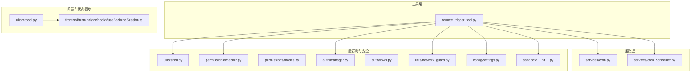
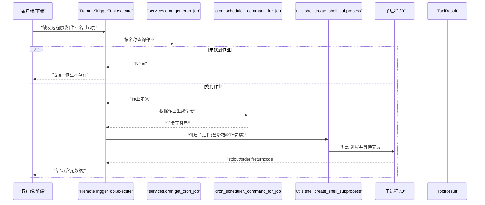
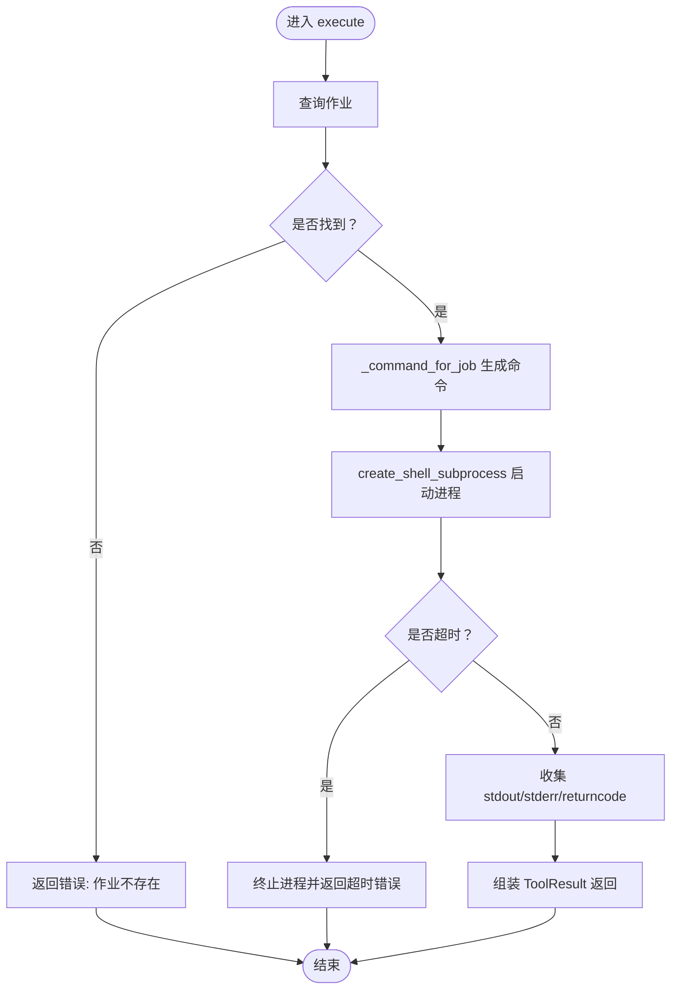
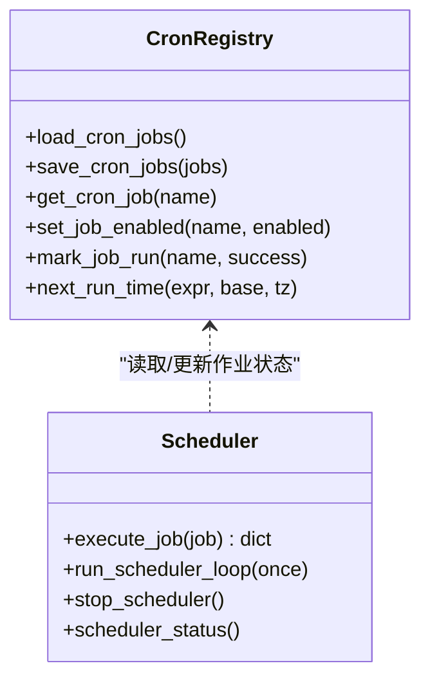
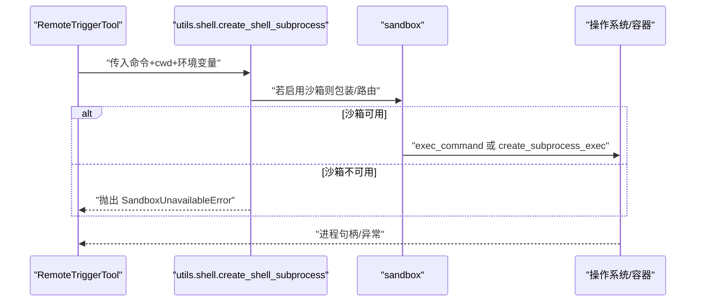
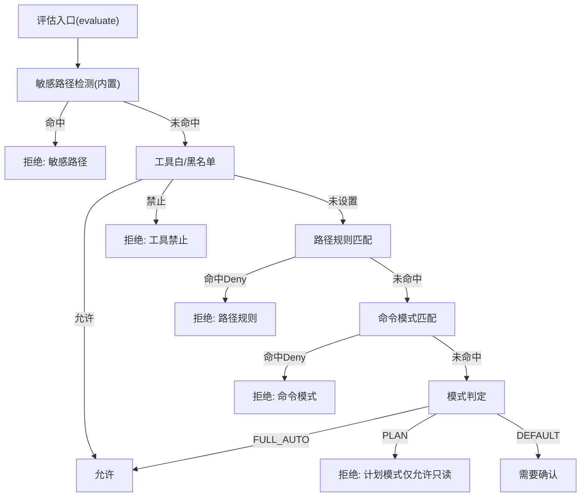
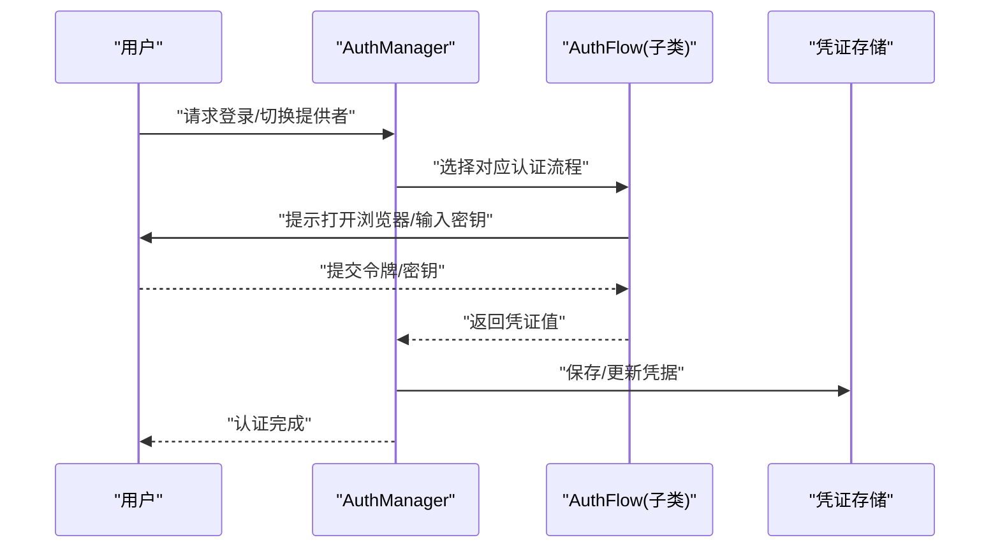
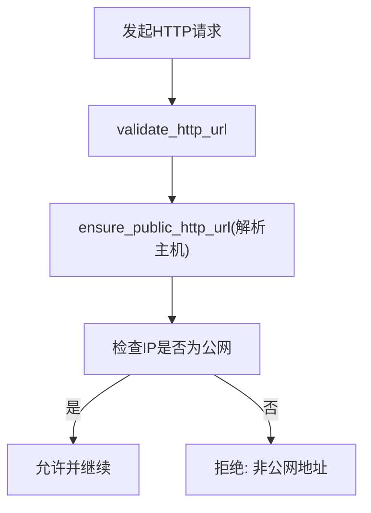
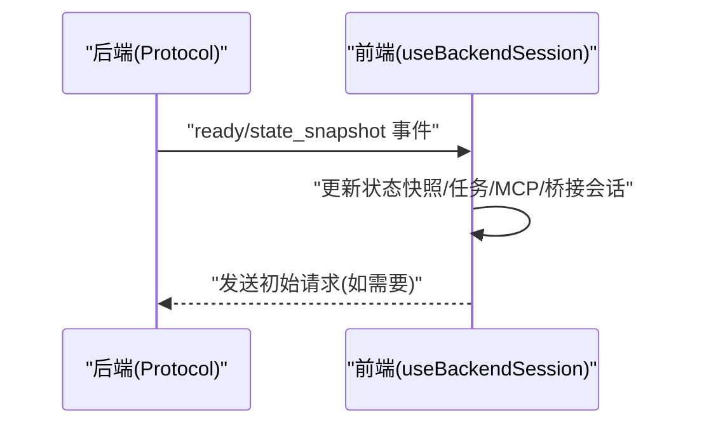
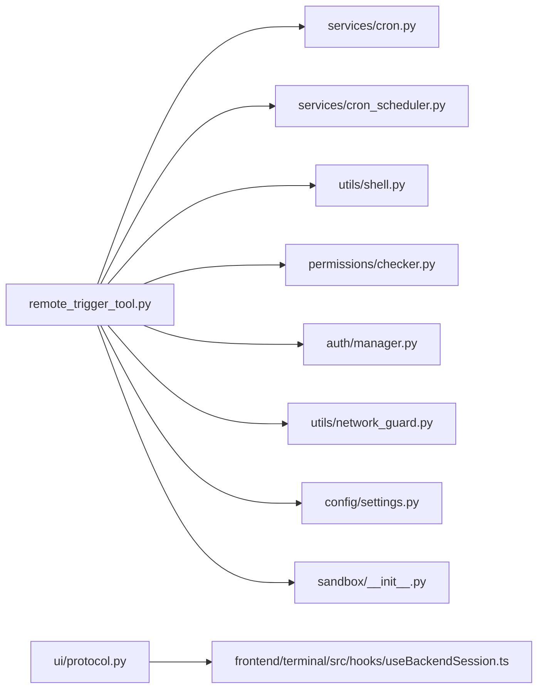

# 远程控制工具

<cite>
**本文引用的文件**
- [remote_trigger_tool.py](file://src/openharness/tools/remote_trigger_tool.py)
- [cron.py](file://src/openharness/services/cron.py)
- [cron_scheduler.py](file://src/openharness/services/cron_scheduler.py)
- [shell.py](file://src/openharness/utils/shell.py)
- [checker.py](file://src/openharness/permissions/checker.py)
- [modes.py](file://src/openharness/permissions/modes.py)
- [network_guard.py](file://src/openharness/utils/network_guard.py)
- [settings.py](file://src/openharness/config/settings.py)
- [manager.py](file://src/openharness/auth/manager.py)
- [flows.py](file://src/openharness/auth/flows.py)
- [__init__.py（sandbox）](file://src/openharness/sandbox/__init__.py)
- [protocol.py](file://src/openharness/ui/protocol.py)
- [useBackendSession.ts](file://frontend/terminal/src/hooks/useBackendSession.ts)
- [test_registry.py](file://tests/test_commands/test_registry.py)
- [permission_sync.py](file://src/openharness/swarm/permission_sync.py)
</cite>

## 目录
1. [简介](#简介)
2. [项目结构](#项目结构)
3. [核心组件](#核心组件)
4. [架构总览](#架构总览)
5. [详细组件分析](#详细组件分析)
6. [依赖关系分析](#依赖关系分析)
7. [性能考量](#性能考量)
8. [故障排查指南](#故障排查指南)
9. [结论](#结论)
10. [附录](#附录)

## 简介
本文件面向“远程控制工具”（remote_trigger_tool），系统性阐述其远程触发机制、信号处理、状态同步与安全机制。该工具允许在本地注册的定时任务中，按名称即时触发某项已配置的“类 Cron 作业”，并返回标准输出与错误输出、退出码等结果信息。文档同时覆盖权限校验、认证流程、网络与访问控制、审计日志等安全要点，并给出常见应用场景与实施建议。

## 项目结构
remote_trigger_tool 所属模块位于工具层，其执行路径会调用服务层的 Cron 注册表与调度器、子进程工具、沙箱封装、权限检查与认证管理等基础设施。前端通过事件协议与后端进行状态同步。

图示来源
- [remote_trigger_tool.py:1-75](file://src/openharness/tools/remote_trigger_tool.py#L1-L75)
- [cron.py:1-138](file://src/openharness/services/cron.py#L1-L138)
- [cron_scheduler.py:1-596](file://src/openharness/services/cron_scheduler.py#L1-L596)
- [shell.py:1-148](file://src/openharness/utils/shell.py#L1-L148)
- [checker.py:1-201](file://src/openharness/permissions/checker.py#L1-L201)
- [modes.py:1-14](file://src/openharness/permissions/modes.py#L1-L14)
- [network_guard.py:1-135](file://src/openharness/utils/network_guard.py#L1-L135)
- [settings.py:1-800](file://src/openharness/config/settings.py#L1-L800)
- [manager.py:1-483](file://src/openharness/auth/manager.py#L1-L483)
- [flows.py:1-190](file://src/openharness/auth/flows.py#L1-L190)
- [__init__.py（sandbox）:1-34](file://src/openharness/sandbox/__init__.py#L1-L34)
- [protocol.py:165-205](file://src/openharness/ui/protocol.py#L165-L205)
- [useBackendSession.ts:176-214](file://frontend/terminal/src/hooks/useBackendSession.ts#L176-L214)

章节来源
- [remote_trigger_tool.py:1-75](file://src/openharness/tools/remote_trigger_tool.py#L1-L75)
- [cron.py:1-138](file://src/openharness/services/cron.py#L1-L138)
- [cron_scheduler.py:1-596](file://src/openharness/services/cron_scheduler.py#L1-L596)
- [shell.py:1-148](file://src/openharness/utils/shell.py#L1-L148)
- [checker.py:1-201](file://src/openharness/permissions/checker.py#L1-L201)
- [modes.py:1-14](file://src/openharness/permissions/modes.py#L1-L14)
- [network_guard.py:1-135](file://src/openharness/utils/network_guard.py#L1-L135)
- [settings.py:1-800](file://src/openharness/config/settings.py#L1-L800)
- [manager.py:1-483](file://src/openharness/auth/manager.py#L1-L483)
- [flows.py:1-190](file://src/openharness/auth/flows.py#L1-L190)
- [__init__.py（sandbox）:1-34](file://src/openharness/sandbox/__init__.py#L1-L34)
- [protocol.py:165-205](file://src/openharness/ui/protocol.py#L165-L205)
- [useBackendSession.ts:176-214](file://frontend/terminal/src/hooks/useBackendSession.ts#L176-L214)

## 核心组件
- 远程触发工具：接收作业名与超时参数，定位本地 Cron 注册表中的作业，构造命令并异步执行，等待完成或超时，汇总输出与返回码，返回统一的结果对象。
- Cron 注册与调度：提供作业的增删改查、启用禁用、下次运行时间计算、执行历史记录与通知通道集成。
- 子进程与沙箱：跨平台选择最佳 shell，支持容器沙箱路由；在沙箱不可用时可抛出异常并被上层捕获。
- 权限检查：基于模式（默认/计划/全自动）、工具白/黑名单、路径规则、命令模式匹配等策略进行决策。
- 认证与授权：统一的认证源管理、OAuth 设备码流程、API Key 流程，以及与活跃配置的联动。
- 网络安全：对外部 HTTP 请求的目标地址进行公网可达性与域名解析校验，拒绝私有/回环地址。
- 前端状态同步：后端通过事件协议推送状态快照，前端监听并更新界面状态。

章节来源
- [remote_trigger_tool.py:24-75](file://src/openharness/tools/remote_trigger_tool.py#L24-L75)
- [cron.py:23-138](file://src/openharness/services/cron.py#L23-L138)
- [cron_scheduler.py:283-414](file://src/openharness/services/cron_scheduler.py#L283-L414)
- [shell.py:51-105](file://src/openharness/utils/shell.py#L51-L105)
- [checker.py:75-156](file://src/openharness/permissions/checker.py#L75-L156)
- [manager.py:71-483](file://src/openharness/auth/manager.py#L71-L483)
- [flows.py:21-190](file://src/openharness/auth/flows.py#L21-L190)
- [network_guard.py:36-96](file://src/openharness/utils/network_guard.py#L36-L96)
- [protocol.py:165-205](file://src/openharness/ui/protocol.py#L165-L205)
- [useBackendSession.ts:179-214](file://frontend/terminal/src/hooks/useBackendSession.ts#L179-L214)

## 架构总览
远程触发工具的执行链路如下：

图示来源
- [remote_trigger_tool.py:31-74](file://src/openharness/tools/remote_trigger_tool.py#L31-L74)
- [cron.py:104-109](file://src/openharness/services/cron.py#L104-L109)
- [cron_scheduler.py:283-310](file://src/openharness/services/cron_scheduler.py#L283-L310)
- [shell.py:51-105](file://src/openharness/utils/shell.py#L51-L105)

## 详细组件分析

### 远程触发工具（RemoteTriggerTool）
- 输入模型包含作业名与超时秒数，超时范围受约束。
- 执行流程：
  - 从本地 Cron 注册表加载作业；
  - 若不存在则返回错误；
  - 解析工作目录，生成命令；
  - 创建子进程并等待完成或超时；
  - 汇总输出与返回码，返回统一结果对象。
- 错误处理：
  - 作业不存在、沙箱不可用、超时、子进程异常均转化为 ToolResult 并标记 is_error。

图示来源
- [remote_trigger_tool.py:31-74](file://src/openharness/tools/remote_trigger_tool.py#L31-L74)
- [cron_scheduler.py:283-310](file://src/openharness/services/cron_scheduler.py#L283-L310)
- [shell.py:51-105](file://src/openharness/utils/shell.py#L51-L105)

章节来源
- [remote_trigger_tool.py:17-75](file://src/openharness/tools/remote_trigger_tool.py#L17-L75)

### Cron 注册与调度
- 提供作业的增删改查、启用/禁用、下次运行时间计算、执行历史记录与通知通道集成。
- 调度器周期性扫描到期作业并并发执行，支持信号优雅停止、PID 文件管理、日志记录与历史持久化。

图示来源
- [cron.py:23-138](file://src/openharness/services/cron.py#L23-L138)
- [cron_scheduler.py:312-414](file://src/openharness/services/cron_scheduler.py#L312-L414)

章节来源
- [cron.py:1-138](file://src/openharness/services/cron.py#L1-L138)
- [cron_scheduler.py:1-596](file://src/openharness/services/cron_scheduler.py#L1-L596)

### 子进程与沙箱
- 跨平台选择最佳 shell，支持 PTY 包装与容器沙箱路由；失败时抛出异常，便于上层统一处理。
- 在 Docker 后端可用时，将命令通过沙箱会话执行，否则回退到本地环境。

图示来源
- [shell.py:51-105](file://src/openharness/utils/shell.py#L51-L105)
- [__init__.py（sandbox）:1-34](file://src/openharness/sandbox/__init__.py#L1-L34)

章节来源
- [shell.py:1-148](file://src/openharness/utils/shell.py#L1-L148)
- [__init__.py（sandbox）:1-34](file://src/openharness/sandbox/__init__.py#L1-L34)

### 权限检查与模式
- 支持三种模式：默认、计划、全自动；内置敏感路径白名单；支持工具显式允许/禁止、路径规则、命令模式匹配。
- 对于远程触发这类可能改变系统状态的工具，通常需要用户确认或处于全自动模式才可直接执行。

图示来源
- [checker.py:75-156](file://src/openharness/permissions/checker.py#L75-L156)
- [modes.py:8-14](file://src/openharness/permissions/modes.py#L8-L14)

章节来源
- [checker.py:1-201](file://src/openharness/permissions/checker.py#L1-L201)
- [modes.py:1-14](file://src/openharness/permissions/modes.py#L1-L14)

### 认证与授权
- 统一认证管理器负责提供者切换、凭据存储与读取、外部绑定描述、活跃配置同步。
- 提供多种认证流程：API Key 直接输入、设备码 OAuth、浏览器回调等。

图示来源
- [manager.py:71-483](file://src/openharness/auth/manager.py#L71-L483)
- [flows.py:21-190](file://src/openharness/auth/flows.py#L21-L190)

章节来源
- [manager.py:1-483](file://src/openharness/auth/manager.py#L1-L483)
- [flows.py:1-190](file://src/openharness/auth/flows.py#L1-L190)

### 网络安全与访问控制
- 外部 HTTP 请求目标必须为公网地址，禁止回环/私网；对重定向逐跳校验，限制最大重定向次数。
- 配置层支持沙箱网络域白/黑名单、文件系统读写限制，用于进一步隔离执行环境。

图示来源
- [network_guard.py:36-96](file://src/openharness/utils/network_guard.py#L36-L96)
- [settings.py:77-114](file://src/openharness/config/settings.py#L77-L114)

章节来源
- [network_guard.py:1-135](file://src/openharness/utils/network_guard.py#L1-L135)
- [settings.py:1-800](file://src/openharness/config/settings.py#L1-L800)

### 前端状态同步与事件协议
- 后端通过事件协议推送状态快照（包括应用状态、MCP 服务器、桥接会话等），前端订阅并更新 UI。
- 初始提示与任务列表、MCP 与桥接会话状态变更均通过事件驱动。

图示来源
- [protocol.py:165-205](file://src/openharness/ui/protocol.py#L165-L205)
- [useBackendSession.ts:179-214](file://frontend/terminal/src/hooks/useBackendSession.ts#L179-L214)

章节来源
- [protocol.py:165-205](file://src/openharness/ui/protocol.py#L165-L205)
- [useBackendSession.ts:176-214](file://frontend/terminal/src/hooks/useBackendSession.ts#L176-L214)

## 依赖关系分析
- 远程触发工具依赖：
  - 服务层：Cron 注册表与命令生成；
  - 运行时：子进程与沙箱封装；
  - 安全：权限检查、认证管理、网络安全；
  - 配置：沙箱网络/文件系统限制、提供者配置。
- 前后端通过事件协议解耦，前端仅依赖事件结构，不直接依赖后端实现细节。

图示来源
- [remote_trigger_tool.py:1-75](file://src/openharness/tools/remote_trigger_tool.py#L1-L75)
- [cron.py:1-138](file://src/openharness/services/cron.py#L1-L138)
- [cron_scheduler.py:1-596](file://src/openharness/services/cron_scheduler.py#L1-L596)
- [shell.py:1-148](file://src/openharness/utils/shell.py#L1-L148)
- [checker.py:1-201](file://src/openharness/permissions/checker.py#L1-L201)
- [manager.py:1-483](file://src/openharness/auth/manager.py#L1-L483)
- [network_guard.py:1-135](file://src/openharness/utils/network_guard.py#L1-L135)
- [settings.py:1-800](file://src/openharness/config/settings.py#L1-L800)
- [__init__.py（sandbox）:1-34](file://src/openharness/sandbox/__init__.py#L1-L34)
- [protocol.py:165-205](file://src/openharness/ui/protocol.py#L165-L205)
- [useBackendSession.ts:176-214](file://frontend/terminal/src/hooks/useBackendSession.ts#L176-L214)

章节来源
- [remote_trigger_tool.py:1-75](file://src/openharness/tools/remote_trigger_tool.py#L1-L75)
- [cron.py:1-138](file://src/openharness/services/cron.py#L1-L138)
- [cron_scheduler.py:1-596](file://src/openharness/services/cron_scheduler.py#L1-L596)
- [shell.py:1-148](file://src/openharness/utils/shell.py#L1-L148)
- [checker.py:1-201](file://src/openharness/permissions/checker.py#L1-L201)
- [manager.py:1-483](file://src/openharness/auth/manager.py#L1-L483)
- [network_guard.py:1-135](file://src/openharness/utils/network_guard.py#L1-L135)
- [settings.py:1-800](file://src/openharness/config/settings.py#L1-L800)
- [__init__.py（sandbox）:1-34](file://src/openharness/sandbox/__init__.py#L1-L34)
- [protocol.py:165-205](file://src/openharness/ui/protocol.py#L165-L205)
- [useBackendSession.ts:176-214](file://frontend/terminal/src/hooks/useBackendSession.ts#L176-L214)

## 性能考量
- 异步 I/O：使用 asyncio.wait_for 控制超时，避免阻塞；超时后主动 kill 进程并等待退出。
- 并发执行：调度器对到期作业采用 gather 并发执行，提升吞吐。
- 资源隔离：沙箱后端可限制 CPU/内存、挂载点与网络域，降低资源争用与逃逸风险。
- 日志与历史：执行历史采用 JSONL 持久化，便于后续审计与问题复盘。

章节来源
- [remote_trigger_tool.py:51-62](file://src/openharness/tools/remote_trigger_tool.py#L51-L62)
- [cron_scheduler.py:462-464](file://src/openharness/services/cron_scheduler.py#L462-L464)
- [settings.py:93-114](file://src/openharness/config/settings.py#L93-L114)

## 故障排查指南
- 作业不存在
  - 现象：返回错误消息，is_error=True。
  - 排查：确认作业名拼写正确，检查 Cron 注册表内容。
- 沙箱不可用
  - 现象：抛出 SandboxUnavailableError，返回错误。
  - 排查：检查沙箱后端状态、镜像可用性、Docker 服务。
- 超时
  - 现象：超时后强制终止进程，返回超时错误。
  - 排查：适当提高 timeout_seconds，检查命令执行耗时与系统负载。
- 权限不足
  - 现象：在默认模式下触发需确认，或被拒绝。
  - 排查：切换至全自动模式或在计划模式下仅使用只读工具。
- 认证失败
  - 现象：无法解析有效凭据。
  - 排查：重新执行认证流程，检查环境变量与存储的凭据。
- 网络受限
  - 现象：访问非公网地址被拒绝。
  - 排查：调整目标地址为公网，或在允许范围内配置代理。

章节来源
- [remote_trigger_tool.py:37-62](file://src/openharness/tools/remote_trigger_tool.py#L37-L62)
- [shell.py:80-84](file://src/openharness/utils/shell.py#L80-L84)
- [checker.py:128-156](file://src/openharness/permissions/checker.py#L128-L156)
- [manager.py:186-289](file://src/openharness/auth/manager.py#L186-L289)
- [network_guard.py:36-51](file://src/openharness/utils/network_guard.py#L36-L51)

## 结论
remote_trigger_tool 将本地 Cron 作业的“按需触发”能力暴露为可被权限与安全策略约束的工具接口。通过严格的权限检查、认证管理与网络安全策略，结合沙箱与历史审计，确保远程控制在可控、可观测、可追溯的前提下高效运行。建议在生产环境中启用全自动模式前充分评估风险，并配合最小权限原则与严格的路径/命令规则。

## 附录
- 应用场景示例（概念性说明）
  - 自动化巡检：在指定时间点触发健康检查脚本，立即获取结果并通知。
  - 临时任务：在运维窗口内快速执行一次性脚本，避免手动登录。
  - 协同编排：通过前端事件协议同步状态，实现多节点状态一致性。
- 安全建议
  - 使用敏感路径保护与命令模式匹配，避免高危操作。
  - 限制沙箱网络域与文件系统范围，减少横向移动风险。
  - 审计所有远程触发与结果输出，保留历史记录以便追溯。
  - 对外 HTTP 请求严格遵循公网可达性校验，必要时配置可信代理。