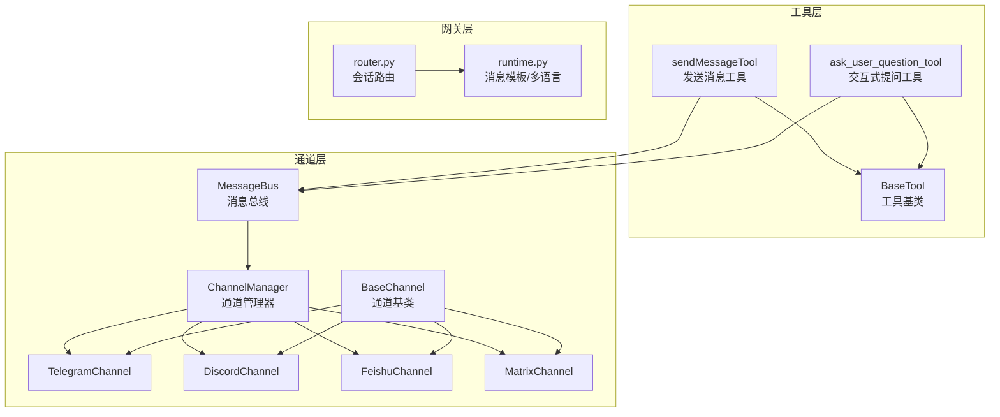
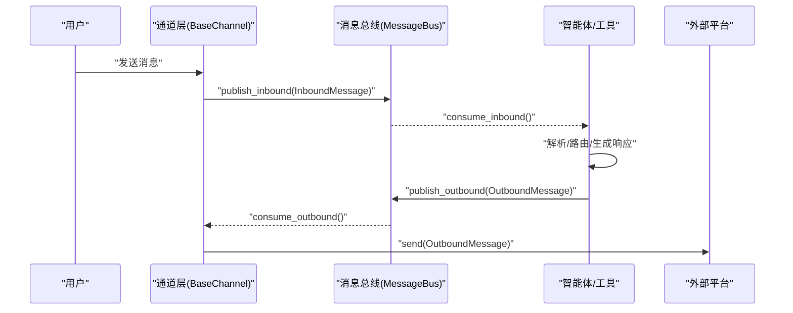
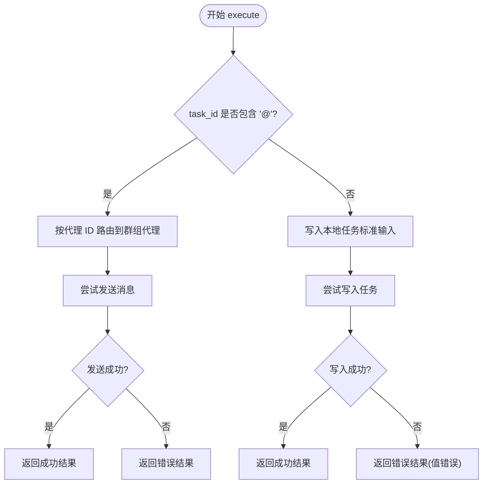
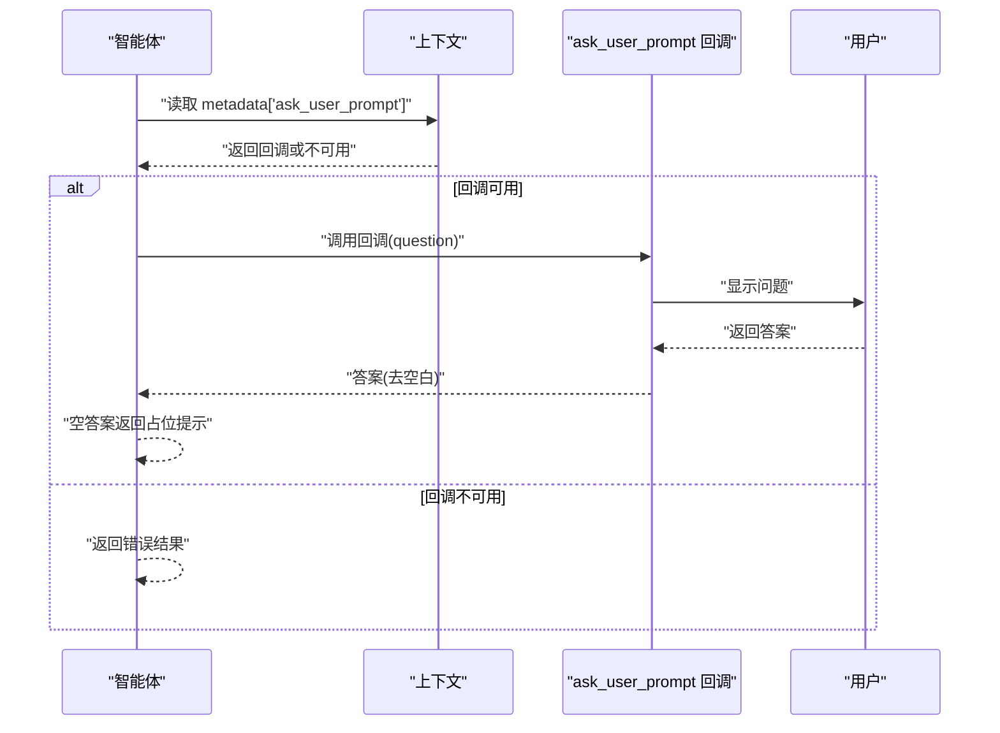
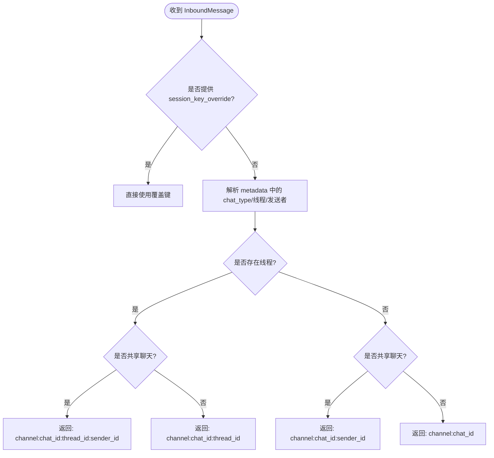
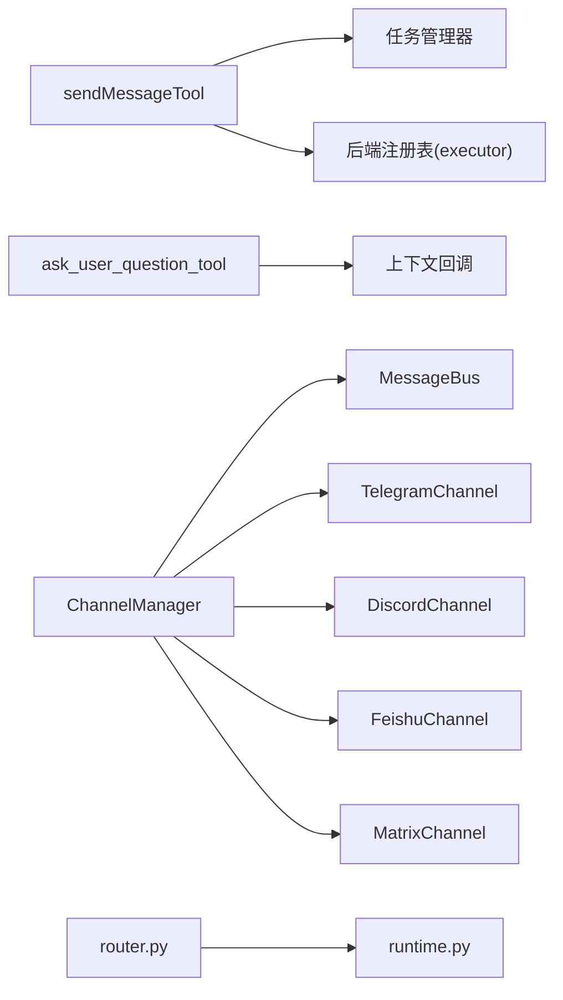

# 通信工具

<cite>
**本文引用的文件**
- [send_message_tool.py](file://src/openharness/tools/send_message_tool.py)
- [ask_user_question_tool.py](file://src/openharness/tools/ask_user_question_tool.py)
- [base.py](file://src/openharness/tools/base.py)
- [events.py](file://src/openharness/channels/bus/events.py)
- [queue.py](file://src/openharness/channels/bus/queue.py)
- [base.py](file://src/openharness/channels/impl/base.py)
- [manager.py](file://src/openharness/channels/impl/manager.py)
- [telegram.py](file://src/openharness/channels/impl/telegram.py)
- [discord.py](file://src/openharness/channels/impl/discord.py)
- [feishu.py](file://src/openharness/channels/impl/feishu.py)
- [matrix.py](file://src/openharness/channels/impl/matrix.py)
- [router.py](file://ohmo/gateway/router.py)
- [runtime.py](file://ohmo/gateway/runtime.py)
- [schema.py](file://src/openharness/config/schema.py)
- [__init__.py](file://src/openharness/channels/__init__.py)
- [__init__.py](file://src/openharness/channels/impl/__init__.py)
- [e2e_smoke.py](file://scripts/e2e_smoke.py)
</cite>

## 目录
1. [简介](#简介)
2. [项目结构](#项目结构)
3. [核心组件](#核心组件)
4. [架构总览](#架构总览)
5. [详细组件分析](#详细组件分析)
6. [依赖关系分析](#依赖关系分析)
7. [性能考量](#性能考量)
8. [故障排查指南](#故障排查指南)
9. [结论](#结论)
10. [附录](#附录)

## 简介
本文件面向“通信工具”的技术文档，聚焦两类关键能力：
- 消息发送工具：sendMessageTool 的消息发送、目标地址识别与路由、消息格式化与适配等特性。
- 交互式提问工具：ask_user_question_tool 的用户交互机制、反馈收集、会话流程控制等。

文档同时解释消息路由、格式转换、错误处理等技术细节，并提供自动通知、用户交互、状态报告等通信场景的使用示例，以及消息模板、多语言支持、安全传输等高级功能说明。

## 项目结构
OpenHarness 采用“工具层 + 通道层 + 网关层”的分层设计：
- 工具层：提供可被智能体调用的工具（如发送消息、提问用户）。
- 通道层：抽象聊天平台接入（Telegram、Discord、Slack、飞书等），统一消息收发与格式转换。
- 网关层：负责会话路由、消息模板与多语言提示、安全策略等。

图表来源
- [send_message_tool.py:1-59](file://src/openharness/tools/send_message_tool.py#L1-L59)
- [ask_user_question_tool.py:1-47](file://src/openharness/tools/ask_user_question_tool.py#L1-L47)
- [base.py:1-200](file://src/openharness/tools/base.py#L1-L200)
- [queue.py:1-45](file://src/openharness/channels/bus/queue.py#L1-L45)
- [manager.py:1-46](file://src/openharness/channels/impl/manager.py#L1-L46)
- [base.py:1-141](file://src/openharness/channels/impl/base.py#L1-L141)
- [telegram.py:1-200](file://src/openharness/channels/impl/telegram.py#L1-L200)
- [discord.py:1-200](file://src/openharness/channels/impl/discord.py#L1-L200)
- [feishu.py:664-729](file://src/openharness/channels/impl/feishu.py#L664-L729)
- [matrix.py:75-109](file://src/openharness/channels/impl/matrix.py#L75-L109)
- [router.py:1-31](file://ohmo/gateway/router.py#L1-L31)
- [runtime.py:915-1111](file://ohmo/gateway/runtime.py#L915-L1111)

章节来源
- [__init__.py:1-22](file://src/openharness/channels/__init__.py#L1-L22)
- [__init__.py:1-6](file://src/openharness/channels/impl/__init__.py#L1-L6)

## 核心组件
- 发送消息工具（sendMessageTool）
  - 功能：向本地任务或群组代理发送后续消息；兼容传统任务 ID 与“名称@团队”格式的代理 ID。
  - 关键点：区分任务 ID 与代理 ID；通过后端执行器进行消息投递；异常转为工具结果返回。
- 交互式提问工具（ask_user_question_tool）
  - 功能：通过上下文回调向用户提出问题并收集答案；只读工具，无副作用。
  - 关键点：依赖上下文中的可调用回调；空回答返回占位提示；不可用时返回错误结果。

章节来源
- [send_message_tool.py:24-59](file://src/openharness/tools/send_message_tool.py#L24-L59)
- [ask_user_question_tool.py:21-47](file://src/openharness/tools/ask_user_question_tool.py#L21-L47)
- [base.py:1-200](file://src/openharness/tools/base.py#L1-L200)

## 架构总览
消息从通道进入，经由消息总线进入智能体引擎，再通过工具层进行处理。对于外部通信，消息经由通道层统一格式化与路由，最终送达目标平台。

图表来源
- [events.py:8-39](file://src/openharness/channels/bus/events.py#L8-L39)
- [queue.py:8-45](file://src/openharness/channels/bus/queue.py#L8-L45)
- [base.py:73-81](file://src/openharness/channels/impl/base.py#L73-L81)

## 详细组件分析

### 发送消息工具（sendMessageTool）
- 输入参数
  - task_id：本地任务 ID 或“名称@团队”的代理 ID。
  - message：写入任务标准输入的消息文本。
- 执行逻辑
  - 若 task_id 包含“@”，按代理 ID 处理，通过后端执行器发送至群组代理。
  - 否则通过任务管理器写入指定任务的标准输入。
  - 异常捕获：将错误封装为工具结果，避免中断流程。
- 错误处理
  - 值错误：返回错误结果。
  - 其他异常：记录日志并返回错误结果。
- 输出
  - 成功：返回成功提示。
  - 失败：返回错误信息并标记为错误结果。

图表来源
- [send_message_tool.py:31-59](file://src/openharness/tools/send_message_tool.py#L31-L59)

章节来源
- [send_message_tool.py:17-59](file://src/openharness/tools/send_message_tool.py#L17-L59)

### 交互式提问工具（ask_user_question_tool）
- 输入参数
  - question：要向用户提出的问题文本。
- 执行逻辑
  - 从上下文提取可调用的“提问回调”。
  - 若回调不可用，返回错误结果。
  - 调用回调并等待用户回答；去除空白字符；空回答返回占位提示。
- 只读属性
  - is_read_only 返回 True，表示该工具不产生副作用。

图表来源
- [ask_user_question_tool.py:32-47](file://src/openharness/tools/ask_user_question_tool.py#L32-L47)

章节来源
- [ask_user_question_tool.py:15-47](file://src/openharness/tools/ask_user_question_tool.py#L15-L47)
- [base.py:1-200](file://src/openharness/tools/base.py#L1-L200)

### 消息路由与会话隔离
- 会话键规则
  - 支持私聊、群聊、线程、共享聊天等场景的会话隔离。
  - 对于共享聊天且存在线程 ID 的情况，会话键包含 sender_id，避免多人共享同一代理记忆。
- 默认回退
  - 当未知聊天类型时，默认按聊天维度隔离。
- 线程与发送者分离
  - 在同一聊天线程中，不同发送者拥有独立会话键。

图表来源
- [router.py:8-31](file://ohmo/gateway/router.py#L8-L31)

章节来源
- [router.py:1-31](file://ohmo/gateway/router.py#L1-L31)

### 消息格式转换与安全
- 通道适配器对消息进行格式转换与安全过滤，确保跨平台一致性与安全性。
  - Telegram：Markdown 到 HTML 的安全转换，保留代码块与内联代码，过滤危险标签与链接协议。
  - Discord：消息分片与回复引用，带重试的限流处理。
  - 飞书：复杂 Markdown 自动选择卡片渲染，超长内容使用卡片布局。
  - Matrix：HTML 清洗器，仅允许安全标签与属性，过滤不合规链接与代码语言类别。
- 网关层提供多语言提示与状态说明，根据用户偏好选择中文或英文版本。

章节来源
- [telegram.py:32-93](file://src/openharness/channels/impl/telegram.py#L32-L93)
- [discord.py:78-126](file://src/openharness/channels/impl/discord.py#L78-L126)
- [feishu.py:664-729](file://src/openharness/channels/impl/feishu.py#L664-L729)
- [matrix.py:75-109](file://src/openharness/channels/impl/matrix.py#L75-L109)
- [runtime.py:915-1111](file://ohmo/gateway/runtime.py#L915-L1111)

### 安全传输与访问控制
- 通道基类提供访问控制：默认拒绝所有未显式允许的发送者；支持通配符“*”开放信任。
- 配置模型定义了各通道的令牌与白名单字段，确保最小权限原则。
- 网关层在群组聊天中强制区分发送者，防止会话混淆。

章节来源
- [base.py:83-94](file://src/openharness/channels/impl/base.py#L83-L94)
- [schema.py:26-119](file://src/openharness/config/schema.py#L26-L119)
- [router.py:15-31](file://ohmo/gateway/router.py#L15-L31)

### 通道初始化与消息总线
- ChannelManager 根据配置初始化启用的通道（如 Telegram、Discord、飞书等），并将消息总线注入各通道实例。
- MessageBus 提供异步队列，解耦通道与智能体核心，支持并发处理。

章节来源
- [manager.py:17-46](file://src/openharness/channels/impl/manager.py#L17-L46)
- [queue.py:8-45](file://src/openharness/channels/bus/queue.py#L8-L45)

## 依赖关系分析
- 工具层依赖
  - sendMessageTool 依赖任务管理器与后端注册表，用于本地任务写入与群组代理消息投递。
  - ask_user_question_tool 依赖上下文回调，实现用户交互。
- 通道层依赖
  - 各通道实现继承自 BaseChannel，统一 send/start/stop 接口。
  - ChannelManager 统一管理通道生命周期与初始化。
- 网关层依赖
  - router.py 与 runtime.py 协同，提供会话路由与消息模板/多语言支持。

图表来源
- [send_message_tool.py:9-12](file://src/openharness/tools/send_message_tool.py#L9-L12)
- [ask_user_question_tool.py:9](file://src/openharness/tools/ask_user_question_tool.py#L9)
- [manager.py:27-33](file://src/openharness/channels/impl/manager.py#L27-L33)
- [router.py:5](file://ohmo/gateway/router.py#L5)
- [runtime.py:915-945](file://ohmo/gateway/runtime.py#L915-L945)

章节来源
- [send_message_tool.py:1-59](file://src/openharness/tools/send_message_tool.py#L1-L59)
- [ask_user_question_tool.py:1-47](file://src/openharness/tools/ask_user_question_tool.py#L1-L47)
- [manager.py:1-46](file://src/openharness/channels/impl/manager.py#L1-L46)

## 性能考量
- 消息分片与限流
  - Discord 采用分片发送与重试机制应对速率限制，保证高吞吐下的稳定性。
- 并发与解耦
  - MessageBus 使用异步队列，避免阻塞通道与智能体核心之间的通信。
- 内容长度与格式优化
  - 各通道对消息长度进行裁剪与格式优化，减少无效往返与平台限制导致的失败。

章节来源
- [discord.py:87-126](file://src/openharness/channels/impl/discord.py#L87-L126)
- [queue.py:16-45](file://src/openharness/channels/bus/queue.py#L16-L45)

## 故障排查指南
- 发送消息失败
  - 检查 task_id 格式：若为代理 ID 必须包含“@”；否则按本地任务 ID 处理。
  - 查看工具返回的错误结果，定位具体异常类型（值错误或其他异常）。
- 用户提问不可用
  - 确认会话上下文中已设置可调用的“提问回调”。
  - 若回调为空或不可调用，工具将返回错误结果。
- 通道无法接收消息
  - 检查通道配置中的 allow_from 白名单，确保发送者在允许列表中。
  - 对于 Telegram/Discord 等，确认令牌与网络连通性。
- 会话混淆或消息错发
  - 确认共享聊天场景下是否正确传入线程 ID 与发送者标识。
  - 检查网关路由逻辑是否按预期生成会话键。

章节来源
- [send_message_tool.py:36-40](file://src/openharness/tools/send_message_tool.py#L36-L40)
- [ask_user_question_tool.py:37-42](file://src/openharness/tools/ask_user_question_tool.py#L37-L42)
- [base.py:83-94](file://src/openharness/channels/impl/base.py#L83-L94)
- [router.py:15-31](file://ohmo/gateway/router.py#L15-L31)

## 结论
sendMessageTool 与 ask_user_question_tool 分别覆盖“消息投递”和“用户交互”两大核心通信能力。通过通道层的统一适配与网关层的路由与模板支持，系统实现了跨平台的一致体验与安全可控的访问策略。结合消息分片、限流与异步总线，整体具备良好的扩展性与鲁棒性。

## 附录

### 使用示例与场景
- 自动通知
  - 场景：任务完成或状态变更时自动发送通知。
  - 实现：通过 sendMessageTool 将预设模板消息发送至目标任务或代理。
- 用户交互
  - 场景：需要用户确认或补充信息时，使用 ask_user_question_tool 提问并收集答案。
  - 实现：在会话上下文中提供可调用的提问回调，工具返回用户输入。
- 状态报告
  - 场景：在多语言环境下向用户展示思考提示、工具提示与状态说明。
  - 实现：利用网关层 runtime 的多语言提示与状态文案，结合通道格式化输出。

章节来源
- [e2e_smoke.py:535-545](file://scripts/e2e_smoke.py#L535-L545)
- [e2e_smoke.py:546-558](file://scripts/e2e_smoke.py#L546-L558)
- [runtime.py:915-1111](file://ohmo/gateway/runtime.py#L915-L1111)