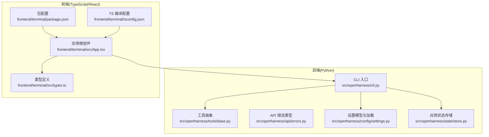
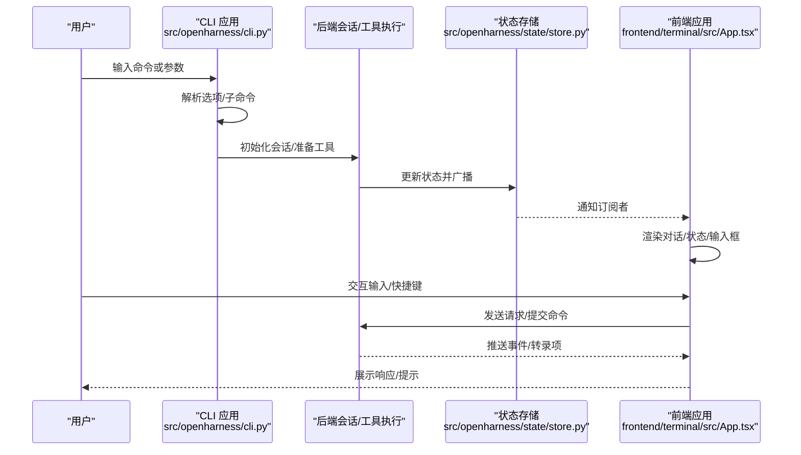
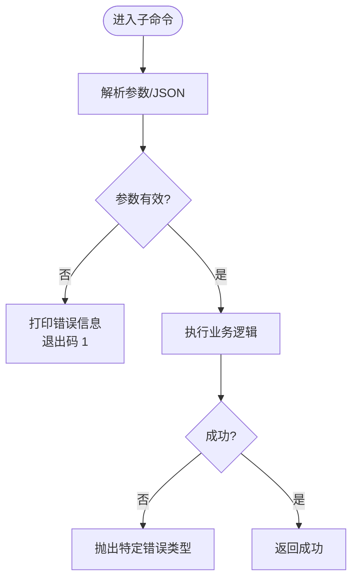
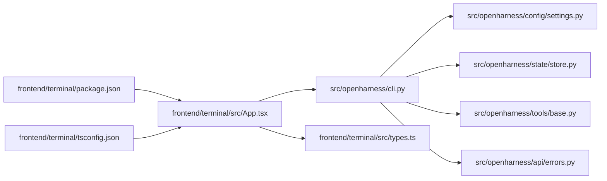

# 代码规范与最佳实践

<cite>
**本文引用的文件**
- [pyproject.toml](file://pyproject.toml)
- [README.md](file://README.md)
- [src/openharness/__main__.py](file://src/openharness/__main__.py)
- [src/openharness/cli.py](file://src/openharness/cli.py)
- [src/openharness/tools/base.py](file://src/openharness/tools/base.py)
- [src/openharness/api/errors.py](file://src/openharness/api/errors.py)
- [src/openharness/config/settings.py](file://src/openharness/config/settings.py)
- [src/openharness/state/store.py](file://src/openharness/state/store.py)
- [frontend/terminal/package.json](file://frontend/terminal/package.json)
- [frontend/terminal/tsconfig.json](file://frontend/terminal/tsconfig.json)
- [frontend/terminal/src/App.tsx](file://frontend/terminal/src/App.tsx)
- [frontend/terminal/src/types.ts](file://frontend/terminal/src/types.ts)
- [tests/conftest.py](file://tests/conftest.py)
</cite>

## 目录
1. [简介](#简介)
2. [项目结构](#项目结构)
3. [核心组件](#核心组件)
4. [架构总览](#架构总览)
5. [详细组件分析](#详细组件分析)
6. [依赖关系分析](#依赖关系分析)
7. [性能考量](#性能考量)
8. [故障排查指南](#故障排查指南)
9. [结论](#结论)
10. [附录](#附录)

## 简介
本指南面向 OpenHarness 的贡献者与使用者，系统化总结 Python 后端与 TypeScript/React 前端的代码规范与最佳实践，覆盖风格与格式（Ruff、mypy）、命名约定、导入顺序、注释与文档、错误处理与异常管理、日志与调试、代码审查清单与质量检查标准，并通过图示与路径引用帮助快速定位实现细节。

## 项目结构
OpenHarness 采用“后端 Python + 前端 React/Ink 终端 UI”的分层架构：
- 后端：以 Typer 提供 CLI，模块化组织引擎、工具、插件、权限、内存、任务、UI 等子系统。
- 前端：基于 Ink 的 React 组件，通过桥接协议与后端交互，提供命令选择、会话历史、权限确认、状态栏等交互体验。
- 工具链：使用 Ruff 进行静态检查，mypy 进行类型检查，pytest 进行单元与集成测试。

图表来源
- [src/openharness/cli.py:1-378](file://src/openharness/cli.py#L1-L378)
- [src/openharness/tools/base.py:1-76](file://src/openharness/tools/base.py#L1-L76)
- [src/openharness/api/errors.py:1-20](file://src/openharness/api/errors.py#L1-L20)
- [src/openharness/config/settings.py:1-161](file://src/openharness/config/settings.py#L1-L161)
- [src/openharness/state/store.py:1-41](file://src/openharness/state/store.py#L1-L41)
- [frontend/terminal/src/App.tsx:1-400](file://frontend/terminal/src/App.tsx#L1-L400)
- [frontend/terminal/src/types.ts:1-63](file://frontend/terminal/src/types.ts#L1-L63)
- [frontend/terminal/package.json:1-20](file://frontend/terminal/package.json#L1-L20)
- [frontend/terminal/tsconfig.json:1-14](file://frontend/terminal/tsconfig.json#L1-L14)

章节来源
- [README.md:127-147](file://README.md#L127-L147)
- [pyproject.toml:1-58](file://pyproject.toml#L1-L58)
- [frontend/terminal/package.json:1-20](file://frontend/terminal/package.json#L1-L20)
- [frontend/terminal/tsconfig.json:1-14](file://frontend/terminal/tsconfig.json#L1-L14)

## 核心组件
- CLI 与入口
  - Typer 定义主命令与子命令，支持 MCP、插件、认证管理；提供非交互输出与交互 REPL 模式切换。
  - 入口模块通过调用 CLI 应用启动。
- 工具体系
  - 抽象基类定义统一的输入、执行、结果与 API Schema 输出；注册表集中管理工具。
- 设置与环境
  - Pydantic 模型承载配置，支持文件、环境变量与 CLI 覆盖，提供解析与持久化。
- 状态存储
  - 观察者模式的状态存储，支持订阅与更新通知。
- 错误类型
  - 明确区分认证失败、限流、通用请求失败等上游 API 错误。
- 前端应用
  - React/Ink 组件树，负责命令提示、权限确认、会话展示、状态栏与输入框；通过钩子与后端通信。

章节来源
- [src/openharness/__main__.py:1-7](file://src/openharness/__main__.py#L1-L7)
- [src/openharness/cli.py:1-378](file://src/openharness/cli.py#L1-L378)
- [src/openharness/tools/base.py:1-76](file://src/openharness/tools/base.py#L1-L76)
- [src/openharness/config/settings.py:1-161](file://src/openharness/config/settings.py#L1-L161)
- [src/openharness/state/store.py:1-41](file://src/openharness/state/store.py#L1-L41)
- [src/openharness/api/errors.py:1-20](file://src/openharness/api/errors.py#L1-L20)
- [frontend/terminal/src/App.tsx:1-400](file://frontend/terminal/src/App.tsx#L1-L400)

## 架构总览
下图展示从用户输入到后端处理再到前端渲染的关键流程。

图表来源
- [src/openharness/cli.py:180-378](file://src/openharness/cli.py#L180-L378)
- [src/openharness/state/store.py:14-41](file://src/openharness/state/store.py#L14-L41)
- [frontend/terminal/src/App.tsx:1-400](file://frontend/terminal/src/App.tsx#L1-L400)

## 详细组件分析

### Python 代码风格与静态检查
- Ruff 配置
  - 行宽限制与目标 Python 版本在配置中明确，建议遵循该行宽并在变更时同步调整。
- 类型检查
  - mypy 严格模式开启，建议在新增模块时保持类型注解完整，避免忽略类型错误。
- 导入顺序与风格
  - 使用 from __future__ annotations 支持前向引用，减少循环导入问题。
  - 标准库优先于第三方库，再按字母序排列，保持一致性。
- 命名约定
  - 模块与函数使用 snake_case；常量使用 UPPER_CASE；类名使用 PascalCase。
  - 异常类以 Error 结尾，如 AuthenticationFailure。
- 注释与文档
  - 模块级 docstring 描述职责；复杂函数补充简要说明；公共接口保持清晰的类型注解。
- 错误处理
  - 明确区分上游 API 错误类型，便于上层策略处理与用户反馈。
- 并发与异步
  - CLI 主流程使用 asyncio.run，确保异步工具与会话正确调度。

章节来源
- [pyproject.toml:51-58](file://pyproject.toml#L51-L58)
- [src/openharness/api/errors.py:1-20](file://src/openharness/api/errors.py#L1-L20)
- [src/openharness/cli.py:1-30](file://src/openharness/cli.py#L1-L30)

### TypeScript/React 前端代码规范
- 组件命名与结构
  - 组件采用 PascalCase，如 App、CommandPicker、ConversationView 等。
  - 使用 React.FC 或函数组件，配合 hooks 管理状态与副作用。
- 状态管理
  - 使用 useState/useEffect 管理本地 UI 状态；通过自定义 hook 与后端会话交互。
  - 状态更新应尽量局部化，避免跨组件过度耦合。
- 类型定义
  - 所有跨组件/协议的数据结构使用 TypeScript 接口或类型别名，保证前后端一致。
- JSX 与样式
  - 使用 Ink 的 Box/Text 等组件构建布局；保持 JSX 简洁，逻辑抽离至 hooks 或工具函数。
- 事件与交互
  - 使用 useInput 处理键盘事件，区分不同上下文（命令选择器、权限确认、脚本模式）。
- 可访问性与可维护性
  - 为常用操作提供键盘快捷键提示；对枚举值与常量进行集中管理。

章节来源
- [frontend/terminal/src/App.tsx:1-400](file://frontend/terminal/src/App.tsx#L1-L400)
- [frontend/terminal/src/types.ts:1-63](file://frontend/terminal/src/types.ts#L1-L63)
- [frontend/terminal/package.json:1-20](file://frontend/terminal/package.json#L1-L20)
- [frontend/terminal/tsconfig.json:1-14](file://frontend/terminal/tsconfig.json#L1-L14)

### 工具与插件扩展点
- 工具抽象
  - 统一的工具输入模型、执行上下文与结果封装，便于权限校验、生命周期钩子与 API Schema 生成。
- 插件与命令
  - 通过注册表与配置加载机制扩展命令与工具，保持最小可用面与可组合性。

章节来源
- [src/openharness/tools/base.py:1-76](file://src/openharness/tools/base.py#L1-L76)
- [src/openharness/cli.py:28-173](file://src/openharness/cli.py#L28-L173)

### 设置与配置加载
- 配置优先级
  - CLI 参数 > 环境变量 > 配置文件 > 默认值，确保运行时可灵活覆盖。
- 类型安全
  - 使用 Pydantic 模型定义配置结构，自动校验与序列化。
- 保存与加载
  - 提供保存与加载方法，确保配置持久化与目录存在性处理。

章节来源
- [src/openharness/config/settings.py:1-161](file://src/openharness/config/settings.py#L1-L161)

### 应用状态存储
- 观察者模式
  - 订阅者在状态变更时收到通知，适合与 UI 组件联动。
- 不可变更新
  - 使用替换方式更新状态，避免共享可变状态导致的竞态。

章节来源
- [src/openharness/state/store.py:1-41](file://src/openharness/state/store.py#L1-L41)

### 错误处理与异常管理最佳实践
- 分层错误类型
  - 将上游 API 错误分类，便于统一处理与用户提示。
- 上游错误捕获
  - 在 CLI 子命令中对 JSON 解析等易错环节进行捕获与优雅退出。
- 用户可见错误
  - 对无效输入或缺失参数打印明确错误信息并返回非零退出码。

图表来源
- [src/openharness/cli.py:68-75](file://src/openharness/cli.py#L68-L75)
- [src/openharness/api/errors.py:1-20](file://src/openharness/api/errors.py#L1-L20)

章节来源
- [src/openharness/cli.py:68-75](file://src/openharness/cli.py#L68-L75)
- [src/openharness/api/errors.py:1-20](file://src/openharness/api/errors.py#L1-L20)

### 日志记录与调试规范
- 后端调试
  - CLI 提供 --debug 选项用于启用更详细的日志输出，便于问题定位。
- 前端调试
  - 通过环境变量控制脚本化输入与原始回车提交行为，辅助自动化测试与演示。
- 测试驱动
  - 使用 pytest 进行单元与集成测试，建议在 CI 中运行全部测试套件。

章节来源
- [src/openharness/cli.py:309-315](file://src/openharness/cli.py#L309-L315)
- [frontend/terminal/src/App.tsx:13-25](file://frontend/terminal/src/App.tsx#L13-L25)
- [tests/conftest.py:1-2](file://tests/conftest.py#L1-L2)

### 代码审查清单与质量检查标准
- Python
  - 是否通过 Ruff 与 mypy 检查；是否符合行宽与导入顺序约定；是否使用前向引用；是否具备必要的类型注解。
  - 是否存在不必要的异常捕获；错误类型是否明确；是否提供用户可理解的错误信息。
  - 是否使用 Pydantic 模型管理配置；是否遵循配置优先级；是否处理文件不存在与写入权限。
- 前端
  - 是否使用 TypeScript 类型约束；组件命名是否一致；是否合理拆分 hooks；是否存在未使用的状态。
  - 是否处理边界情况（空列表、无权限、网络异常）；键盘交互是否一致且可发现。
- 通用
  - 是否提供必要的注释与文档片段路径；是否通过 pytest 全量测试；是否在 README 中体现关键变更。

章节来源
- [pyproject.toml:51-58](file://pyproject.toml#L51-L58)
- [README.md:282-298](file://README.md#L282-L298)

## 依赖关系分析

图表来源
- [src/openharness/cli.py:1-378](file://src/openharness/cli.py#L1-L378)
- [src/openharness/config/settings.py:1-161](file://src/openharness/config/settings.py#L1-L161)
- [src/openharness/state/store.py:1-41](file://src/openharness/state/store.py#L1-L41)
- [src/openharness/tools/base.py:1-76](file://src/openharness/tools/base.py#L1-L76)
- [src/openharness/api/errors.py:1-20](file://src/openharness/api/errors.py#L1-L20)
- [frontend/terminal/src/App.tsx:1-400](file://frontend/terminal/src/App.tsx#L1-L400)
- [frontend/terminal/src/types.ts:1-63](file://frontend/terminal/src/types.ts#L1-L63)
- [frontend/terminal/package.json:1-20](file://frontend/terminal/package.json#L1-L20)
- [frontend/terminal/tsconfig.json:1-14](file://frontend/terminal/tsconfig.json#L1-L14)

章节来源
- [src/openharness/cli.py:1-378](file://src/openharness/cli.py#L1-L378)
- [frontend/terminal/src/App.tsx:1-400](file://frontend/terminal/src/App.tsx#L1-L400)

## 性能考量
- 工具执行与权限检查
  - 在工具执行前进行权限与钩子处理，避免无效调用；对只读工具进行标识，减少不必要的阻塞。
- 状态更新
  - 使用不可变替换更新状态，避免深层嵌套对象频繁重建；订阅者数量应适度，避免过多重渲染。
- 前端渲染
  - 将计算型逻辑移出渲染函数，使用 useMemo/useCallback 优化；对长列表进行虚拟化或分页。
- 配置加载
  - 配置文件读取与解析仅在初始化阶段进行，后续通过增量更新降低开销。

## 故障排查指南
- 常见问题
  - API 密钥缺失：检查环境变量或配置文件；必要时通过认证子命令设置。
  - 权限不足：根据权限模式调整策略；查看路径规则与禁止命令列表。
  - 前端无响应：确认后端服务正常；检查网络连接与超时设置。
- 调试步骤
  - 启用后端调试日志；在前端使用脚本化输入验证交互流程；运行最小化场景复现问题。
- 相关实现参考
  - 配置加载与覆盖逻辑、错误类型定义、前端事件处理与状态流转。

章节来源
- [src/openharness/config/settings.py:76-121](file://src/openharness/config/settings.py#L76-L121)
- [src/openharness/api/errors.py:1-20](file://src/openharness/api/errors.py#L1-L20)
- [frontend/terminal/src/App.tsx:149-290](file://frontend/terminal/src/App.tsx#L149-L290)

## 结论
本指南基于 OpenHarness 实际代码与配置，总结了 Python 与前端的风格规范、错误处理、状态管理与测试实践。建议在开发过程中：
- 严格遵循 Ruff 与 mypy 的静态检查；
- 使用 Pydantic 管理配置，明确错误类型；
- 前端组件保持类型安全与可维护性；
- 通过测试与审查清单持续提升质量。

## 附录
- 关键实现路径参考
  - CLI 与入口：[入口模块:1-7](file://src/openharness/__main__.py#L1-L7)、[CLI 定义:1-378](file://src/openharness/cli.py#L1-L378)
  - 工具抽象与注册：[工具基类:1-76](file://src/openharness/tools/base.py#L1-L76)
  - 错误类型：[API 错误:1-20](file://src/openharness/api/errors.py#L1-L20)
  - 设置与加载：[设置模型:1-161](file://src/openharness/config/settings.py#L1-L161)
  - 状态存储：[状态存储:1-41](file://src/openharness/state/store.py#L1-L41)
  - 前端应用与类型：[应用根组件:1-400](file://frontend/terminal/src/App.tsx#L1-L400)、[类型定义:1-63](file://frontend/terminal/src/types.ts#L1-L63)
  - 工具链配置：[Ruff/mypy 配置:51-58](file://pyproject.toml#L51-L58)、[前端包配置:1-20](file://frontend/terminal/package.json#L1-L20)、[TS 编译配置:1-14](file://frontend/terminal/tsconfig.json#L1-L14)
  - 测试：[pytest 配置:47-49](file://pyproject.toml#L47-L49)、[测试夹具:1-2](file://tests/conftest.py#L1-L2)