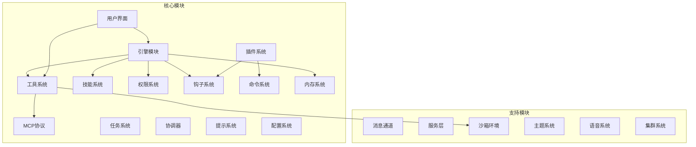
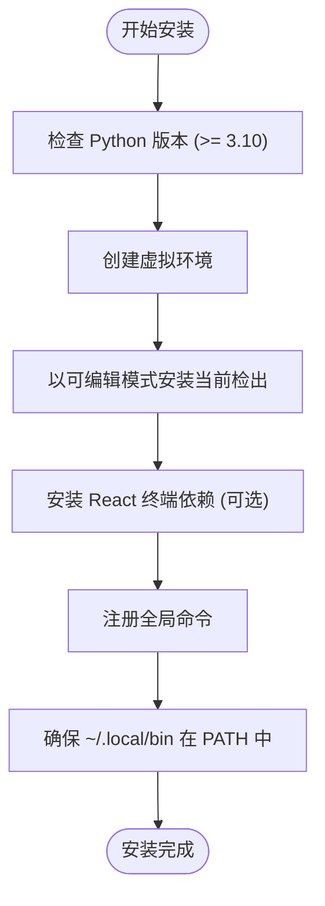
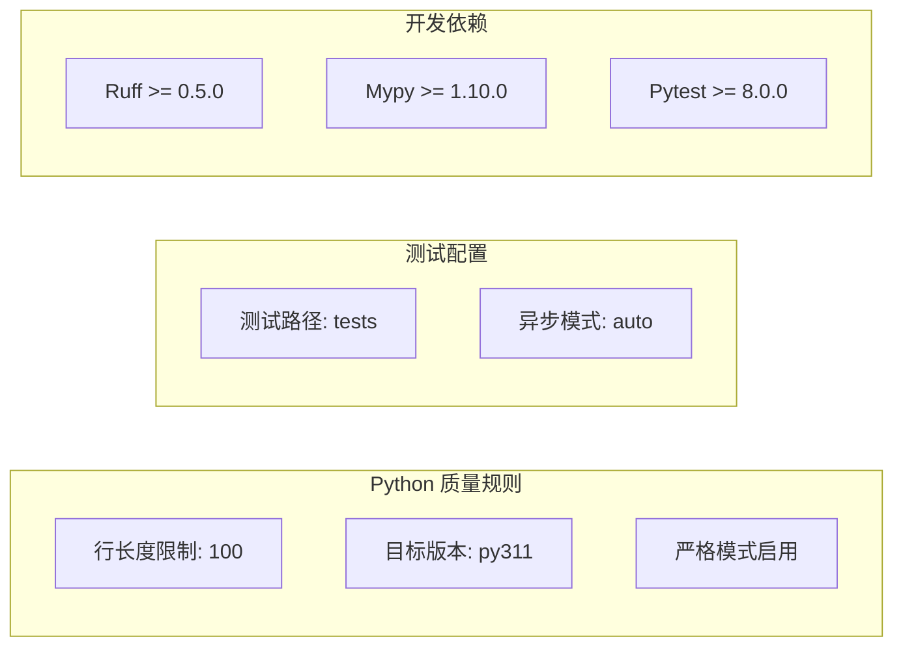
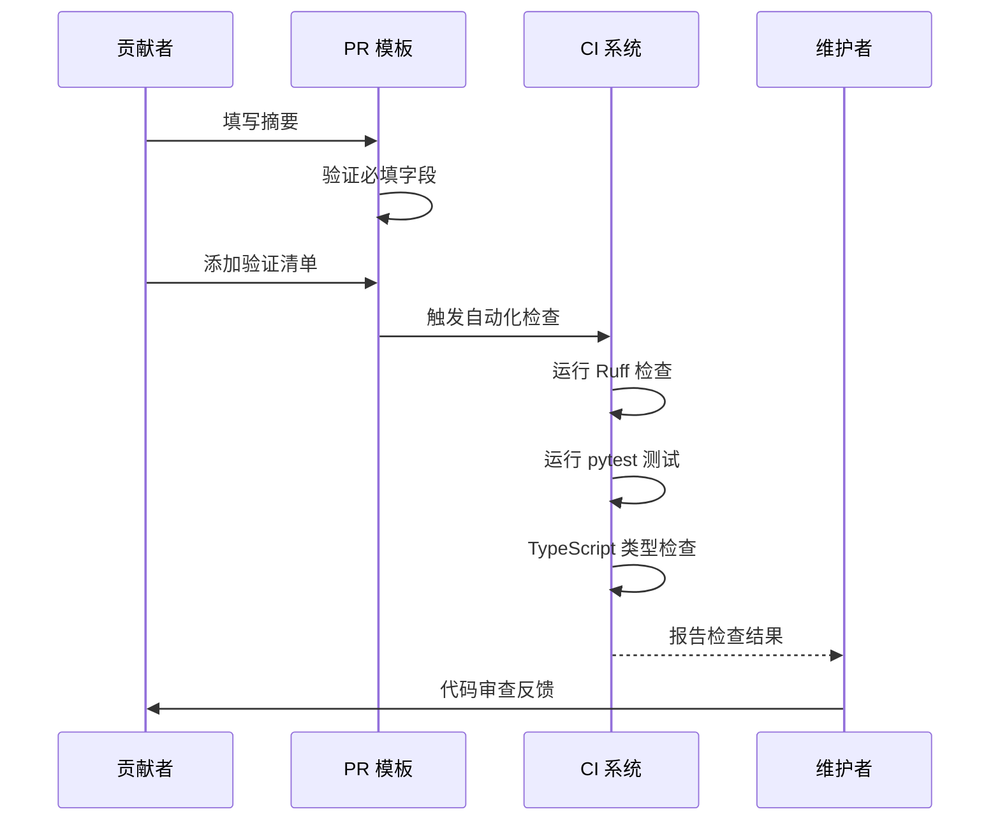
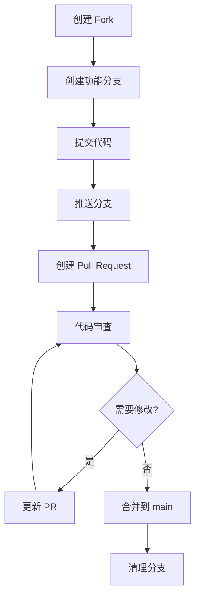
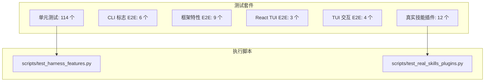
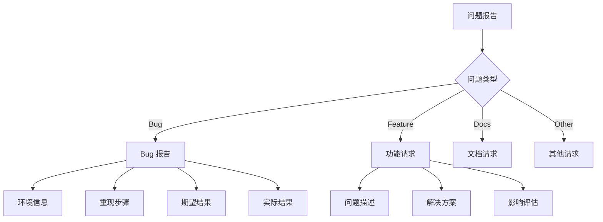
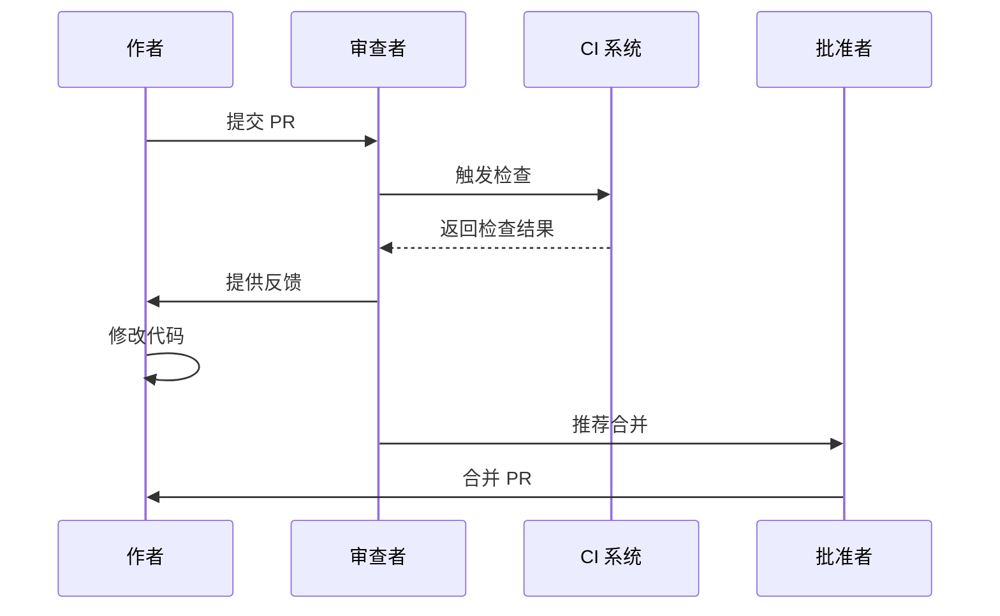

# 代码贡献流程

<cite>
**本文档引用的文件**
- [CONTRIBUTING.md](file://CONTRIBUTING.md)
- [README.md](file://README.md)
- [.github/PULL_REQUEST_TEMPLATE.md](file://.github/PULL_REQUEST_TEMPLATE.md)
- [pyproject.toml](file://pyproject.toml)
- [scripts/install_dev.sh](file://scripts/install_dev.sh)
- [scripts/test_harness_features.py](file://scripts/test_harness_features.py)
- [scripts/test_real_skills_plugins.py](file://scripts/test_real_skills_plugins.py)
- [CHANGELOG.md](file://CHANGELOG.md)
- [docs/SHOWCASE.md](file://docs/SHOWCASE.md)
- [.github/workflows/ci.yml](file://.github/workflows/ci.yml)
</cite>

## 目录
1. [简介](#简介)
2. [项目结构](#项目结构)
3. [核心贡献方式](#核心贡献方式)
4. [开发环境设置](#开发环境设置)
5. [本地检查与验证](#本地检查与验证)
6. [Pull Request 流程](#pull-request-流程)
7. [分支管理策略](#分支管理策略)
8. [代码质量要求](#代码质量要求)
9. [测试要求](#测试要求)
10. [文档更新规范](#文档更新规范)
11. [问题报告与功能请求](#问题报告与功能请求)
12. [代码审查流程](#代码审查流程)
13. [社区行为准则](#社区行为准则)
14. [故障排除指南](#故障排除指南)
15. [结论](#结论)

## 简介

OpenHarness 是一个专注于清晰性、可修改性和与 Claude 风格工作流兼容性的开源代理框架。本指南详细说明了如何参与开源贡献，包括问题报告、功能请求、代码提交等完整流程。

## 项目结构

OpenHarness 采用模块化架构，主要包含以下核心组件：



**图表来源**
- [README.md:446-466](file://README.md#L446-L466)

**章节来源**
- [README.md:446-466](file://README.md#L446-L466)

## 核心贡献方式

根据贡献指南，以下是主要的贡献方式：

### 1. Bug 修复和边缘情况处理
- 改进运行时框架中的错误处理
- 优化边界条件和异常情况

### 2. 文档改进
- 提升 README 准确性和兼容性说明
- 创建常见工作流的简短可重现示例
- 基于真实使用场景的展示条目
- 编写使仓库更易导航的贡献和维护文档

### 3. 测试增强
- 为工具、权限、插件、MCP 或多代理流程添加测试
- 扩展现有测试覆盖率

### 4. 功能扩展
- 贡献新技能、插件或提供程序兼容性改进
- 添加新的工具实现

### 5. 社区分享
- 分享可以添加到展示页面的真实使用模式

**章节来源**
- [CONTRIBUTING.md:5-11](file://CONTRIBUTING.md#L5-L11)

## 开发环境设置

### 1. 基础环境准备
```bash
# 克隆仓库
git clone https://github.com/HKUDS/OpenHarness.git
cd OpenHarness

# 安装开发依赖
uv sync --extra dev
```

### 2. 可选：前端终端界面开发
```bash
# 进入前端目录
cd frontend/terminal
npm ci
cd ../..
```

### 3. 开发者安装脚本
项目提供了专门的开发者安装脚本，支持多种安装选项：



**图表来源**
- [scripts/install_dev.sh:84-125](file://scripts/install_dev.sh#L84-L125)

**章节来源**
- [CONTRIBUTING.md:13-27](file://CONTRIBUTING.md#L13-L27)
- [scripts/install_dev.sh:1-182](file://scripts/install_dev.sh#L1-L182)

## 本地检查与验证

在提交 PR 之前，需要运行与 CI 相同的核心检查：

### 1. Python 代码检查
```bash
# 运行 Ruff 检查
uv run ruff check src tests scripts

# 运行 pytest 单元测试
uv run pytest -q
```

### 2. 前端类型检查
```bash
cd frontend/terminal
npx tsc --noEmit
```

### 3. 项目级质量检查
项目配置中包含了严格的代码质量规则：



**图表来源**
- [pyproject.toml:79-86](file://pyproject.toml#L79-L86)

**章节来源**
- [CONTRIBUTING.md:29-43](file://CONTRIBUTING.md#L29-L43)
- [pyproject.toml:38-46](file://pyproject.toml#L38-L46)

## Pull Request 流程

### PR 预期标准

每个 PR 都需要满足以下标准：

1. **范围控制**: 保持 PR 精简，小而可审查的更改比广泛的重写更快合并
2. **问题描述**: 包含问题、变更内容和验证方法
3. **测试覆盖**: 当行为发生变化时添加或更新测试
4. **文档更新**: 当 CLI 标志、工作流或兼容性声明发生变化时更新文档
5. **变更日志**: 为用户可见的变更在 `CHANGELOG.md` 中添加简短条目
6. **类型检查**: 如果改善类型覆盖，可以运行 `uv run mypy src/openharness`（目前不是强制要求）

### PR 模板要求

PR 模板包含以下必需部分：



**图表来源**
- [.github/PULL_REQUEST_TEMPLATE.md:1-16](file://.github/PULL_REQUEST_TEMPLATE.md#L1-L16)

**章节来源**
- [CONTRIBUTING.md:45-52](file://CONTRIBUTING.md#L45-L52)
- [.github/PULL_REQUEST_TEMPLATE.md:1-16](file://.github/PULL_REQUEST_TEMPLATE.md#L1-L16)

## 分支管理策略

### GitHub 工作流

项目采用标准的 GitHub 工作流：



### CI/CD 配置

CI 工作流包含三个主要作业：

1. **Python 测试**: 支持 Python 3.10 和 3.11，运行完整测试套件
2. **Python 质量**: 使用 Ruff 检查代码质量
3. **前端类型检查**: 对 React 终端进行 TypeScript 检查

**章节来源**
- [.github/workflows/ci.yml:1-84](file://.github/workflows/ci.yml#L1-L84)

## 代码质量要求

### 1. 静态代码检查 (Ruff)

项目使用 Ruff 作为主要的 Python 代码检查工具：

- **行长度**: 最大 100 字符
- **目标版本**: Python 3.11
- **严格模式**: 启用严格模式检查

### 2. 类型检查 (Mypy)

- **Python 版本**: 3.11
- **严格模式**: 启用严格模式
- **状态**: 类型检查目前不是强制要求，但鼓励贡献者提高类型覆盖

### 3. 单元测试 (pytest)

- **测试路径**: `tests/` 目录
- **异步模式**: 自动配置
- **测试套件**: 114 个通过的单元/集成测试

**章节来源**
- [pyproject.toml:79-86](file://pyproject.toml#L79-L86)

## 测试要求

### 1. 单元测试和集成测试

项目包含全面的测试套件：



**图表来源**
- [README.md:721-737](file://README.md#L721-L737)

### 2. E2E 测试脚本

项目提供了专门的 E2E 测试脚本：

1. **框架特性测试**: 测试 API 重试、技能系统、并行工具执行、路径权限等
2. **真实技能插件测试**: 测试真实 anthropics/skills 和兼容插件

**章节来源**
- [README.md:721-737](file://README.md#L721-L737)
- [scripts/test_harness_features.py:1-240](file://scripts/test_harness_features.py#L1-L240)
- [scripts/test_real_skills_plugins.py:1-347](file://scripts/test_real_skills_plugins.py#L1-L347)

## 文档更新规范

### 1. 变更日志管理

所有显著的 OpenHarness 变更都应记录在变更日志中：

- 使用 Keep a Changelog 格式
- 采用轻量级、基于仓库的方式跟踪变更
- 新功能在 `Unreleased` 部分记录
- 发布版本按语义化版本控制

### 2. 展示页面贡献

展示页面收集具体的使用示例：

- 基于真实运行的工作流
- 短小可重现的示例
- 如实说明前提条件和限制
- 聚焦于 OpenHarness 使什么更容易

**章节来源**
- [CHANGELOG.md:1-105](file://CHANGELOG.md#L1-L105)
- [docs/SHOWCASE.md:73-81](file://docs/SHOWCASE.md#L73-L81)

## 问题报告与功能请求

### 1. 使用 GitHub Issue 模板

- 尽可能使用 GitHub 问题模板
- 包含环境详情、精确命令和错误输出（用于 bug）
- 对于功能请求，解释具体的流程缺口和预期行为
- 如果请求主要是文档或维护相关的，明确说明以便正确范围化为文档 PR

### 2. 问题分类



**章节来源**
- [CONTRIBUTING.md:63-69](file://CONTRIBUTING.md#L63-L69)

## 代码审查流程

### 1. 审查标准

代码审查重点关注：

- **功能正确性**: 代码是否解决了预期问题
- **代码质量**: 是否符合项目编码标准
- **测试覆盖**: 是否有足够的测试
- **文档更新**: 是否需要更新相关文档
- **向后兼容性**: 是否破坏现有功能

### 2. 审查过程



### 3. 合并标准

- 至少需要一位维护者的批准
- 所有 CI 检查必须通过
- 代码质量必须满足项目标准
- 相关文档必须更新

## 社区行为准则

### 1. 社区价值观

OpenHarness 社区致力于：

- **清晰性**: 代码和文档应该清晰易懂
- **可修改性**: 代码应该易于理解和修改
- **兼容性**: 与 Claude 风格工作流兼容
- **开放性**: 欢迎各种形式的贡献

### 2. 沟通指南

- 使用礼貌和专业的语言
- 提供具体和可操作的信息
- 尊重不同的观点和经验水平
- 寻求理解而非被理解

### 3. 贡献认可

- 所有贡献都会被认可和感谢
- 首次贡献者会得到特别欢迎
- 代码贡献和文档贡献同等重要

## 故障排除指南

### 1. 常见开发问题

#### 环境设置问题
- 确保 Python 3.10+ 版本
- 检查虚拟环境是否正确激活
- 验证依赖安装是否成功

#### 测试失败排查
- 运行单个测试文件定位问题
- 检查测试依赖和环境变量
- 查看 CI 日志获取更多信息

#### 代码检查失败
- 遵循 Ruff 规则和格式要求
- 更新类型注解以满足 Mypy 要求
- 简化复杂的函数和类

### 2. CI 相关问题

- 检查 Python 版本兼容性
- 验证依赖版本锁定
- 确保所有检查步骤通过

**章节来源**
- [scripts/install_dev.sh:77-82](file://scripts/install_dev.sh#L77-L82)

## 结论

OpenHarness 的贡献流程设计旨在：

1. **降低门槛**: 提供清晰的开发环境设置指导
2. **保证质量**: 通过严格的代码检查和测试要求
3. **促进协作**: 通过标准化的 PR 流程和审查机制
4. **鼓励创新**: 支持各种形式的贡献，从代码到文档

遵循这些指南将帮助您有效地参与 OpenHarness 项目的开发，同时确保代码质量和社区和谐。记住，开源贡献不仅是代码的提交，更是知识分享和社区建设的过程。