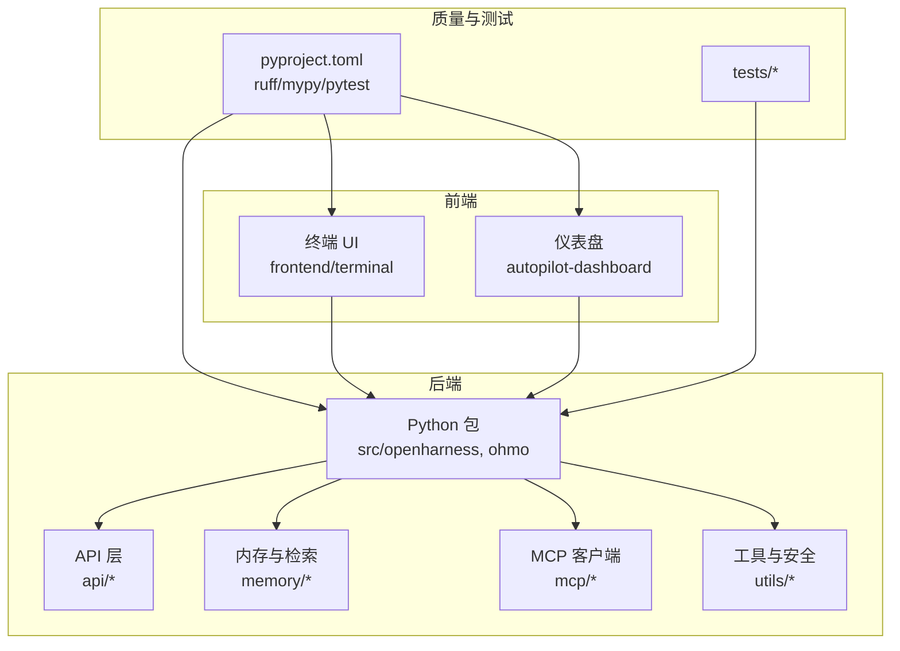
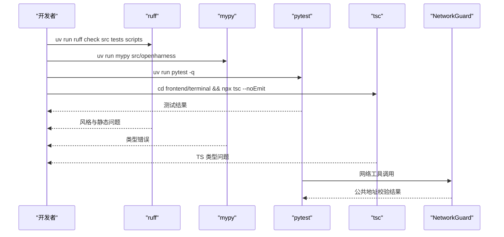
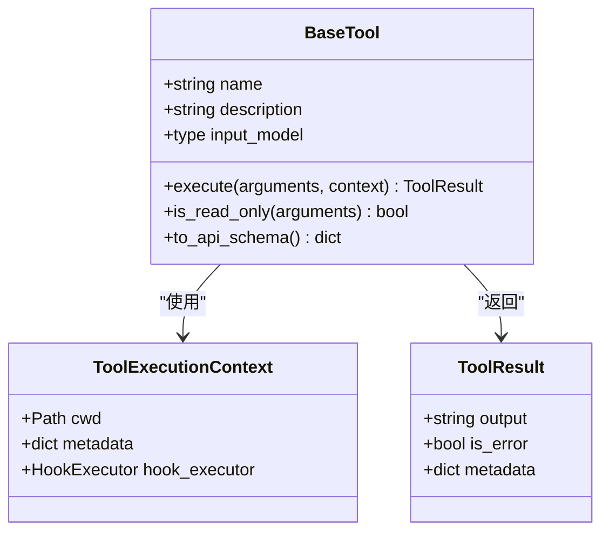
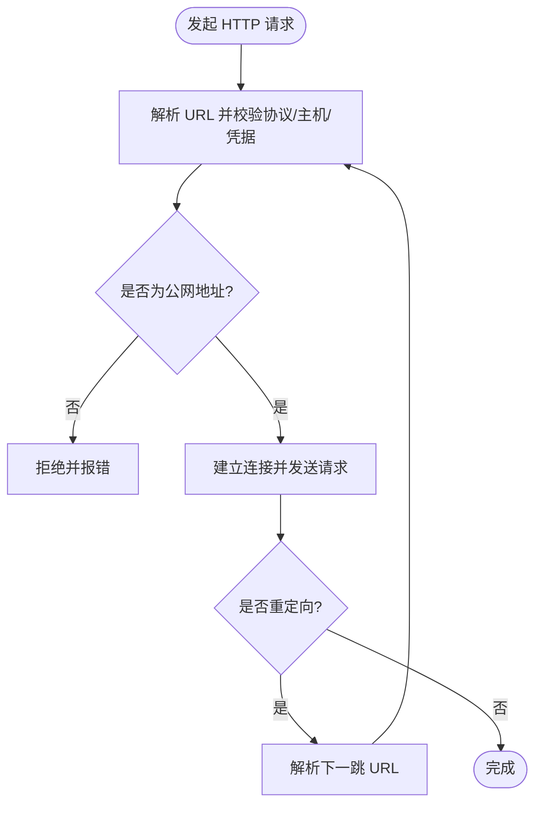
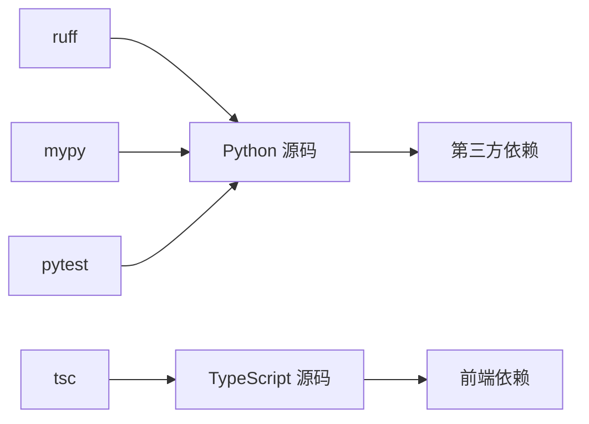

# 代码质量标准

<cite>
**本文引用的文件**
- [pyproject.toml](file://pyproject.toml)
- [CONTRIBUTING.md](file://CONTRIBUTING.md)
- [src/openharness/api/provider.py](file://src/openharness/api/provider.py)
- [src/openharness/memory/schema.py](file://src/openharness/memory/schema.py)
- [src/openharness/tools/base.py](file://src/openharness/tools/base.py)
- [src/openharness/utils/network_guard.py](file://src/openharness/utils/network_guard.py)
- [src/openharness/mcp/client.py](file://src/openharness/mcp/client.py)
- [src/openharness/mcp/types.py](file://src/openharness/mcp/types.py)
- [src/openharness/mcp/config.py](file://src/openharness/mcp/config.py)
- [tests/test_logging/test_format_strings.py](file://tests/test_logging/test_format_strings.py)
- [tests/test_tools/test_mcp_tool.py](file://tests/test_tools/test_mcp_tool.py)
- [frontend/terminal/package.json](file://frontend/terminal/package.json)
- [frontend/terminal/tsconfig.json](file://frontend/terminal/tsconfig.json)
- [autopilot-dashboard/package.json](file://autopilot-dashboard/package.json)
- [autopilot-dashboard/tsconfig.json](file://autopilot-dashboard/tsconfig.json)
- [src/openharness/skills/bundled/content/review.md](file://src/openharness/skills/bundled/content/review.md)
- [src/openharness/skills/bundled/content/simplify.md](file://src/openharness/skills/bundled/content/simplify.md)
</cite>

## 目录
1. [引言](#引言)
2. [项目结构](#项目结构)
3. [核心组件](#核心组件)
4. [架构总览](#架构总览)
5. [详细组件分析](#详细组件分析)
6. [依赖分析](#依赖分析)
7. [性能考虑](#性能考虑)
8. [故障排查指南](#故障排查指南)
9. [结论](#结论)
10. [附录](#附录)

## 引言
本指南面向 OpenHarness 贡献者与维护者，系统化定义代码质量标准与最佳实践，覆盖以下方面：
- Python 代码风格与格式化（ruff）
- TypeScript/JavaScript 规范与类型约束
- 文档注释与技能内容规范
- 代码审查标准与检查清单
- 类型注解最佳实践（Pydantic 模型、类型提示、mypy）
- 重构原则与反模式规避
- 安全编码实践（网络访问、输入校验）
- 性能优化建议
- 质量工具配置与使用流程

## 项目结构
OpenHarness 采用多模块分层组织：Python 后端（openharness、ohmo）、前端终端与仪表盘、测试与脚本。质量工具在根目录统一配置，CI 前端类型检查通过 npm 脚本执行。

图示来源
- [pyproject.toml:75-86](file://pyproject.toml#L75-L86)
- [frontend/terminal/package.json:1-22](file://frontend/terminal/package.json#L1-L22)
- [autopilot-dashboard/package.json:1-23](file://autopilot-dashboard/package.json#L1-L23)

章节来源
- [pyproject.toml:1-86](file://pyproject.toml#L1-L86)
- [frontend/terminal/package.json:1-22](file://frontend/terminal/package.json#L1-L22)
- [autopilot-dashboard/package.json:1-23](file://autopilot-dashboard/package.json#L1-L23)

## 核心组件
- Python 工具链与质量配置：ruff、mypy、pytest 在 pyproject.toml 中集中声明与配置。
- 前端类型检查：终端与仪表盘分别通过 tsconfig.json 与 package.json 的脚本进行类型检查。
- 安全与网络：网络访问通过专用模块进行 URL 校验与公共地址限制。
- 类型系统：Pydantic 模型广泛用于输入校验与 JSON Schema 导出；类型提示贯穿各模块。
- 文档与技能：技能内容采用 Markdown 结构化描述，明确工作流与规则。

章节来源
- [pyproject.toml:79-86](file://pyproject.toml#L79-L86)
- [frontend/terminal/tsconfig.json:1-13](file://frontend/terminal/tsconfig.json#L1-L13)
- [src/openharness/utils/network_guard.py:1-80](file://src/openharness/utils/network_guard.py#L1-L80)
- [src/openharness/tools/base.py:1-81](file://src/openharness/tools/base.py#L1-L81)
- [src/openharness/skills/bundled/content/review.md:1-27](file://src/openharness/skills/bundled/content/review.md#L1-L27)

## 架构总览
下图展示质量相关的关键交互：贡献者在本地运行 ruff/mypy/pytest，前端通过 tsc 进行类型检查；安全模块在网络请求前进行 URL 校验。

图示来源
- [CONTRIBUTING.md:29-44](file://CONTRIBUTING.md#L29-L44)
- [pyproject.toml:79-86](file://pyproject.toml#L79-L86)
- [frontend/terminal/package.json:5-7](file://frontend/terminal/package.json#L5-L7)
- [src/openharness/utils/network_guard.py:25-80](file://src/openharness/utils/network_guard.py#L25-L80)

## 详细组件分析

### Python 代码风格与格式化（ruff）
- 行宽与目标版本：在配置中设定行宽与 Python 版本目标，确保团队一致的排版与兼容性。
- 本地检查：贡献指南要求在提交前运行 ruff 检查，保证风格一致性。
- 与 mypy 协同：ruff 负责风格与基础静态问题，mypy 负责类型检查，二者互补。

章节来源
- [pyproject.toml:79-81](file://pyproject.toml#L79-L81)
- [CONTRIBUTING.md:29-36](file://CONTRIBUTING.md#L29-L36)

### TypeScript/JavaScript 规范与类型约束
- 终端 UI：tsconfig.json 设置严格性与模块解析策略；package.json 提供开发脚本。
- 仪表盘：独立的 tsconfig 与 package.json，分别管理构建与预览脚本。
- 类型检查：前端类型检查通过 tsc --noEmit 在本地执行，避免运行时类型错误。

章节来源
- [frontend/terminal/tsconfig.json:1-13](file://frontend/terminal/tsconfig.json#L1-L13)
- [frontend/terminal/package.json:1-22](file://frontend/terminal/package.json#L1-L22)
- [autopilot-dashboard/tsconfig.json:1-4](file://autopilot-dashboard/tsconfig.json#L1-L4)
- [autopilot-dashboard/package.json:1-23](file://autopilot-dashboard/package.json#L1-L23)

### 文档注释与技能内容规范
- 技能内容采用结构化 Markdown：包含用途、工作流、规则等，便于自动化处理与一致性审查。
- 代码审查技能强调具体性、可操作性与严重性分级，避免空泛建议。

章节来源
- [src/openharness/skills/bundled/content/review.md:1-27](file://src/openharness/skills/bundled/content/review.md#L1-L27)
- [src/openharness/skills/bundled/content/simplify.md:1-27](file://src/openharness/skills/bundled/content/simplify.md#L1-L27)

### 类型注解最佳实践（Pydantic、类型提示、mypy）
- Pydantic 模型设计
  - 使用 BaseModel/数据类承载输入模型，结合 model_json_schema 输出给外部接口。
  - 在工具输入模型中启用严格校验，必要时排除 None 字段以减少冗余。
- 类型提示使用
  - 广泛使用 typing.Literal、Union、Optional 等表达精确语义。
  - 对于跨模块导入，使用 TYPE_CHECKING 分离类型导入，避免运行时副作用。
- mypy 配置
  - 严格模式开启，确保全面的类型检查覆盖。
  - 通过命令行单独运行 mypy 以验证类型覆盖率提升。

图示来源
- [src/openharness/tools/base.py:17-81](file://src/openharness/tools/base.py#L17-L81)

章节来源
- [src/openharness/tools/base.py:1-81](file://src/openharness/tools/base.py#L1-L81)
- [tests/test_tools/test_mcp_tool.py:39-94](file://tests/test_tools/test_mcp_tool.py#L39-L94)
- [pyproject.toml:83-86](file://pyproject.toml#L83-L86)

### 代码审查标准与检查清单
- 问题覆盖：逻辑错误、空指针、注入风险、性能隐患、测试覆盖、命名一致性。
- 可操作性：提供具体文件与行号引用，优先级分级（严重 > 主要 > 次要 > 瑕疵）。
- 行为不变：简化与重构不改变功能行为，删除多余抽象与重复代码。

章节来源
- [src/openharness/skills/bundled/content/review.md:11-26](file://src/openharness/skills/bundled/content/review.md#L11-L26)

### 安全编码实践
- 网络访问控制：仅允许 http/https，禁止嵌入凭据；拒绝回环/私有/链路地址；逐跳校验重定向目标。
- 输入与日志：统一使用 %s 占位符，避免 {} 风格导致的格式化异常；对敏感字段进行显式排除或脱敏。
- 认证与鉴权：根据提供商类型选择合适的认证方式，缺失状态给出明确指引。

图示来源
- [src/openharness/utils/network_guard.py:25-80](file://src/openharness/utils/network_guard.py#L25-L80)

章节来源
- [src/openharness/utils/network_guard.py:1-80](file://src/openharness/utils/network_guard.py#L1-L80)
- [tests/test_logging/test_format_strings.py:42-51](file://tests/test_logging/test_format_strings.py#L42-L51)

### 重构原则与反模式避免
- 原则：保持行为不变、优先删除冗余、避免过早抽象、保留测试覆盖。
- 反模式：过度工程化、重复逻辑未合并、无用抽象与间接层、死代码路径、滥用全局状态。

章节来源
- [src/openharness/skills/bundled/content/simplify.md:11-26](file://src/openharness/skills/bundled/content/simplify.md#L11-L26)

### 性能优化建议
- 内存检索：基于重要度、使用计数与时间衰减的综合评分，排序并裁剪结果集。
- 文本处理：分词时区分 ASCII 与中日韩字符，避免无效 token；合理设置阈值与缓存。
- I/O 与锁：使用原子写与文件锁保护共享索引，降低并发冲突。

章节来源
- [src/openharness/memory/search.py:39-71](file://src/openharness/memory/search.py#L39-L71)
- [src/openharness/memory/usage.py:82-104](file://src/openharness/memory/usage.py#L82-L104)

## 依赖分析
- Python 依赖：核心库如 pydantic、httpx、websockets、mcp 等在 pyproject.toml 中声明。
- 开发依赖：ruff、mypy、pytest 等在 dev 可选组中，便于本地与 CI 使用。
- 前端依赖：终端与仪表盘各自维护依赖与脚本，确保独立构建与类型检查。

图示来源
- [pyproject.toml:16-46](file://pyproject.toml#L16-L46)
- [frontend/terminal/package.json:8-20](file://frontend/terminal/package.json#L8-L20)
- [autopilot-dashboard/package.json:11-21](file://autopilot-dashboard/package.json#L11-L21)

章节来源
- [pyproject.toml:16-46](file://pyproject.toml#L16-L46)
- [frontend/terminal/package.json:1-22](file://frontend/terminal/package.json#L1-L22)
- [autopilot-dashboard/package.json:1-23](file://autopilot-dashboard/package.json#L1-L23)

## 性能考虑
- 类型检查成本：在大型仓库中，mypy 严格模式会带来一定开销，建议按需运行或分模块检查。
- 前端类型检查：tsc --noEmit 快速发现类型问题，避免打包阶段失败。
- 网络请求：批量请求应合并与去重，重定向链路逐跳校验，避免不必要的延迟与失败。

## 故障排查指南
- 日志占位符问题：若出现格式化异常，检查是否使用了 {} 占位符而非 %s。
- Pydantic 校验失败：确认输入模型字段类型与必填项，必要时排除 None 字段。
- 网络访问被拒：检查 URL 是否为公网地址、是否包含嵌入凭据、代理配置是否正确。

章节来源
- [tests/test_logging/test_format_strings.py:42-51](file://tests/test_logging/test_format_strings.py#L42-L51)
- [tests/test_tools/test_mcp_tool.py:86-94](file://tests/test_tools/test_mcp_tool.py#L86-L94)
- [src/openharness/utils/network_guard.py:25-51](file://src/openharness/utils/network_guard.py#L25-L51)

## 结论
本指南将 OpenHarness 的质量基础设施与最佳实践整合为统一标准：以 ruff/mypy/pytest 保障 Python 代码质量，以 tsc 保障前端类型安全，以 NetworkGuard 强化网络访问安全，并通过结构化的技能内容与审查规则提升协作效率与代码可维护性。建议在每次提交前执行本地检查，并在 PR 中保持小步快跑与充分测试。

## 附录

### 代码质量工具配置与使用指南
- ruff：在 pyproject.toml 中配置行宽与目标版本；本地通过 uv run ruff check 执行。
- mypy：严格模式开启；可单独运行以验证类型覆盖率提升。
- pytest：测试路径与异步模式在 pyproject.toml 中配置；本地通过 uv run pytest -q 执行。
- 前端类型检查：终端与仪表盘分别通过 npx tsc --noEmit 执行。

章节来源
- [pyproject.toml:75-86](file://pyproject.toml#L75-L86)
- [CONTRIBUTING.md:29-44](file://CONTRIBUTING.md#L29-L44)
- [frontend/terminal/package.json:5-7](file://frontend/terminal/package.json#L5-L7)