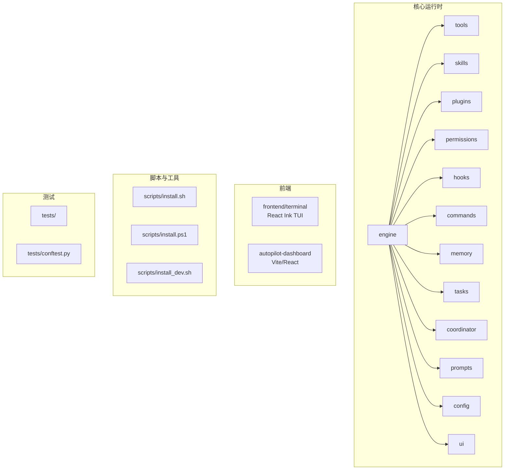
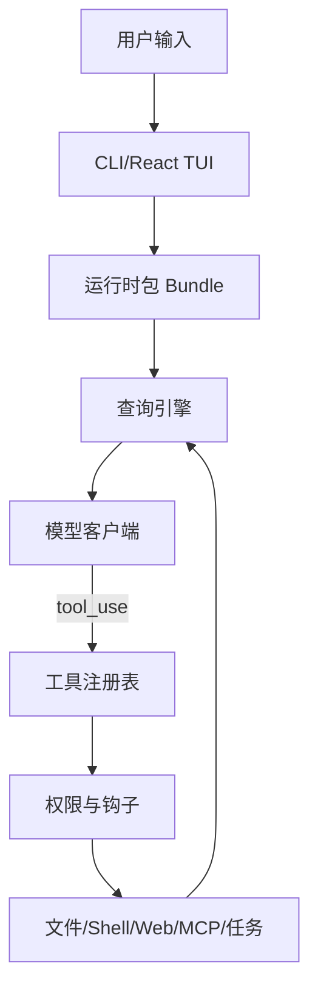
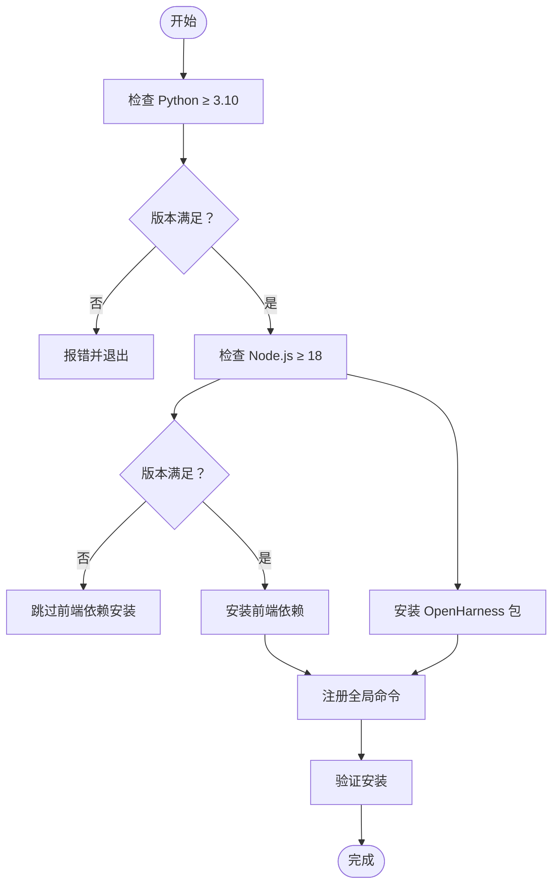
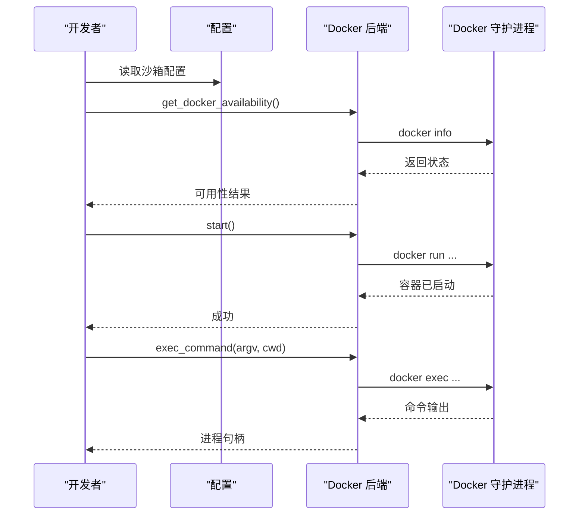
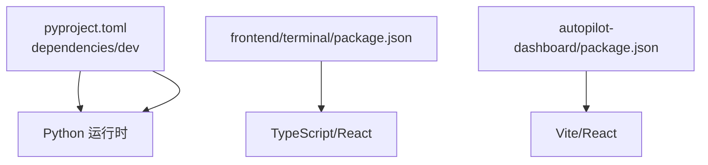

# 开发环境搭建

<cite>
**本文档引用的文件**
- [README.md](file://README.md)
- [CONTRIBUTING.md](file://CONTRIBUTING.md)
- [pyproject.toml](file://pyproject.toml)
- [scripts/install.sh](file://scripts/install.sh)
- [scripts/install.ps1](file://scripts/install.ps1)
- [scripts/install_dev.sh](file://scripts/install_dev.sh)
- [frontend/terminal/package.json](file://frontend/terminal/package.json)
- [autopilot-dashboard/package.json](file://autopilot-dashboard/package.json)
- [src/openharness/sandbox/docker_backend.py](file://src/openharness/sandbox/docker_backend.py)
- [tests/conftest.py](file://tests/conftest.py)
</cite>

## 目录
1. [简介](#简介)
2. [系统要求与前置依赖](#系统要求与前置依赖)
3. [项目结构](#项目结构)
4. [核心组件](#核心组件)
5. [架构概览](#架构概览)
6. [详细组件分析](#详细组件分析)
7. [依赖关系分析](#依赖关系分析)
8. [性能考虑](#性能考虑)
9. [故障排除指南](#故障排除指南)
10. [结论](#结论)

## 简介
本指南面向希望在本地搭建 OpenHarness 开发环境的开发者，覆盖系统要求、前置依赖、安装步骤、开发工具配置、常见问题排查以及跨平台具体操作。OpenHarness 是一个开源的 Python 代理基础设施，支持多后端模型、工具集、技能系统、权限治理与多智能体协调，并提供 React 终端界面与 ohmo 个人助理应用。

## 系统要求与前置依赖
- Python 版本：≥ 3.10（推荐 3.12）
- Node.js 版本：≥ 18（用于 React 终端 UI；低于 18 将跳过前端依赖安装）
- Docker（可选）：作为沙箱后端使用，提供更强隔离与资源限制控制
- 包管理器：uv（推荐，用于同步开发依赖），或标准 pip
- 操作系统：Linux、macOS、Windows（原生支持）

上述要求在以下文件中明确体现：
- Python 版本要求与项目元数据：[pyproject.toml:11](file://pyproject.toml#L11)
- 安装脚本对 Python 与 Node 的版本检查逻辑：[scripts/install.sh:88-179](file://scripts/install.sh#L88-L179)，[scripts/install.ps1:60-122](file://scripts/install.ps1#L60-L122)
- Docker 沙箱可用性检测：[src/openharness/sandbox/docker_backend.py:19-58](file://src/openharness/sandbox/docker_backend.py#L19-L58)

章节来源
- [pyproject.toml:11](file://pyproject.toml#L11)
- [scripts/install.sh:88-179](file://scripts/install.sh#L88-L179)
- [scripts/install.ps1:60-122](file://scripts/install.ps1#L60-L122)
- [src/openharness/sandbox/docker_backend.py:19-58](file://src/openharness/sandbox/docker_backend.py#L19-L58)

## 项目结构
OpenHarness 采用分层与功能模块化的组织方式：
- 核心运行时与子系统：engine、tools、skills、plugins、permissions、hooks、commands、mcp、memory、tasks、coordinator、prompts、config、ui
- 前端终端与仪表盘：frontend/terminal（React Ink TUI）、autopilot-dashboard（Vite/React）
- 脚本与安装工具：scripts/ 下的一键安装与开发安装脚本
- 测试与配置：tests/、tests/conftest.py、pyproject.toml 中的测试与工具配置

图表来源
- [README.md:446-466](file://README.md#L446-L466)
- [frontend/terminal/package.json:1-22](file://frontend/terminal/package.json#L1-L22)
- [autopilot-dashboard/package.json:1-23](file://autopilot-dashboard/package.json#L1-L23)
- [scripts/install.sh:1-388](file://scripts/install.sh#L1-L388)
- [scripts/install.ps1:1-330](file://scripts/install.ps1#L1-L330)
- [scripts/install_dev.sh:1-182](file://scripts/install_dev.sh#L1-L182)
- [tests/conftest.py:1-14](file://tests/conftest.py#L1-L14)

章节来源
- [README.md:446-466](file://README.md#L446-L466)
- [frontend/terminal/package.json:1-22](file://frontend/terminal/package.json#L1-L22)
- [autopilot-dashboard/package.json:1-23](file://autopilot-dashboard/package.json#L1-L23)
- [scripts/install.sh:1-388](file://scripts/install.sh#L1-L388)
- [scripts/install.ps1:1-330](file://scripts/install.ps1#L1-L330)
- [scripts/install_dev.sh:1-182](file://scripts/install_dev.sh#L1-L182)
- [tests/conftest.py:1-14](file://tests/conftest.py#L1-L14)

## 核心组件
- 运行时与命令入口：通过 openharness.cli 暴露命令行接口，支持 oh、openh、openharness 三个入口别名
- 终端 UI：React/Ink TUI 提供交互式体验，支持命令选择、权限对话框、会话恢复等
- 沙箱执行：支持本地进程与 Docker 后端，提供网络隔离、资源限制与镜像管理
- 插件与技能：支持加载用户自定义技能与插件，兼容 anthropics/skills 与 claude-code/plugins 生态
- 权限系统：多级权限模式与路径规则，支持交互式审批与钩子扩展

章节来源
- [pyproject.toml:48-52](file://pyproject.toml#L48-L52)
- [README.md:637-647](file://README.md#L637-L647)
- [src/openharness/sandbox/docker_backend.py:19-58](file://src/openharness/sandbox/docker_backend.py#L19-L58)

## 架构概览
下图展示 OpenHarness 的核心子系统与交互关系：

图表来源
- [README.md:489-501](file://README.md#L489-L501)

章节来源
- [README.md:489-501](file://README.md#L489-L501)

## 详细组件分析

### 安装脚本与开发环境准备
- Linux/macOS/WSL：一键安装脚本会检测 Python 与 Node 版本，创建虚拟环境，安装包并设置全局命令链接
- Windows：PowerShell 安装脚本提供相同流程，注意 oh.exe 与 Out-Host 别名冲突提示
- 开发安装：install_dev.sh 支持就地可编辑安装与全局虚拟环境选项

图表来源
- [scripts/install.sh:88-179](file://scripts/install.sh#L88-L179)
- [scripts/install.ps1:60-122](file://scripts/install.ps1#L60-L122)
- [scripts/install_dev.sh:62-125](file://scripts/install_dev.sh#L62-L125)

章节来源
- [scripts/install.sh:88-179](file://scripts/install.sh#L88-L179)
- [scripts/install.ps1:60-122](file://scripts/install.ps1#L60-L122)
- [scripts/install_dev.sh:62-125](file://scripts/install_dev.sh#L62-L125)

### Docker 沙箱后端
- 可用性检测：检查配置启用状态、平台支持、Docker CLI 存在与守护进程运行
- 容器生命周期：启动/停止/执行命令，支持 CPU/内存限制、只读网络与挂载卷
- 自动镜像管理：根据配置自动构建或拉取所需镜像

图表来源
- [src/openharness/sandbox/docker_backend.py:19-58](file://src/openharness/sandbox/docker_backend.py#L19-L58)
- [src/openharness/sandbox/docker_backend.py:130-233](file://src/openharness/sandbox/docker_backend.py#L130-L233)

章节来源
- [src/openharness/sandbox/docker_backend.py:19-58](file://src/openharness/sandbox/docker_backend.py#L19-L58)
- [src/openharness/sandbox/docker_backend.py:130-233](file://src/openharness/sandbox/docker_backend.py#L130-L233)

### 前端终端与类型检查
- 前端终端：React/Ink TUI，TypeScript 类型检查通过 npx tsc --noEmit 验证
- 仪表盘：Vite/React 应用，支持开发、构建与预览脚本

章节来源
- [CONTRIBUTING.md:38-43](file://CONTRIBUTING.md#L38-L43)
- [frontend/terminal/package.json:1-22](file://frontend/terminal/package.json#L1-L22)
- [autopilot-dashboard/package.json:1-23](file://autopilot-dashboard/package.json#L1-L23)

## 依赖关系分析
- Python 依赖：通过 pyproject.toml 的 dependencies 字段声明，包括 anthropic、openai、rich、prompt-toolkit、textual、typer、pydantic、httpx、websockets、mcp、pyperclip、pyyaml、questionary、watchfiles、croniter、slack-sdk、python-telegram-bot、discord.py、lark-oapi 等
- 开发依赖：dev 分组包含 pytest、pytest-asyncio、pytest-cov、ruff、mypy 等
- 前端依赖：frontend/terminal 与 autopilot-dashboard 的 package.json 定义了 React、TypeScript、Vite 等工具链

图表来源
- [pyproject.toml:16-46](file://pyproject.toml#L16-L46)
- [frontend/terminal/package.json:1-22](file://frontend/terminal/package.json#L1-L22)
- [autopilot-dashboard/package.json:1-23](file://autopilot-dashboard/package.json#L1-L23)

章节来源
- [pyproject.toml:16-46](file://pyproject.toml#L16-L46)
- [frontend/terminal/package.json:1-22](file://frontend/terminal/package.json#L1-L22)
- [autopilot-dashboard/package.json:1-23](file://autopilot-dashboard/package.json#L1-L23)

## 性能考虑
- 使用 uv 同步开发依赖以提升安装速度与确定性
- 在 Docker 沙箱中合理设置 CPU/内存限制，避免过度占用宿主机资源
- 前端依赖安装仅在 Node.js ≥ 18 时进行，避免不必要的等待
- 使用缓存目录（如 .ruff_cache、.pytest_cache、.mypy_cache）减少重复检查开销

## 故障排除指南
- Python 版本过低：安装脚本会提示升级到 3.10+，参考对应平台包管理器或官方下载
- Node.js 缺失或版本过低：React TUI 将被跳过；安装 Node.js 18+ 后重新运行前端依赖安装
- Windows 命令别名冲突：oh.exe 与 PowerShell Out-Host 冲突，建议使用 openh 或 openharness
- Docker 未安装或守护进程未运行：沙箱不可用，按提示安装 Docker Desktop 或 Docker Engine 并启动服务
- PATH 未更新：安装脚本会尝试写入 shell 配置文件，若失败需手动添加 ~/.local/bin 或虚拟环境 Scripts 目录到 PATH

章节来源
- [scripts/install.sh:105-125](file://scripts/install.sh#L105-L125)
- [scripts/install.ps1:85-93](file://scripts/install.ps1#L85-L93)
- [scripts/install.sh:164-179](file://scripts/install.sh#L164-L179)
- [scripts/install.ps1:117-122](file://scripts/install.ps1#L117-L122)
- [scripts/install.sh:292-313](file://scripts/install.sh#L292-L313)
- [scripts/install.ps1:257-305](file://scripts/install.ps1#L257-L305)
- [src/openharness/sandbox/docker_backend.py:35-56](file://src/openharness/sandbox/docker_backend.py#L35-L56)

## 结论
通过本指南，您可以在 Windows、macOS、Linux 上完成 OpenHarness 的开发环境搭建。建议优先使用 uv 同步开发依赖，确保 Python 与 Node 版本满足要求，并根据需要启用 Docker 沙箱后端。遇到问题时，依据安装脚本的错误提示与本指南的故障排除部分进行定位与修复。