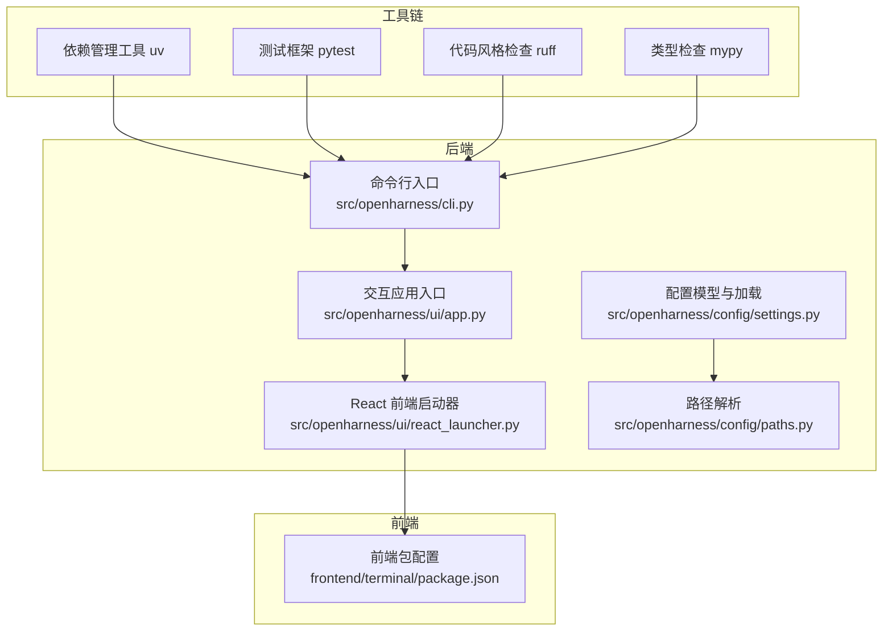
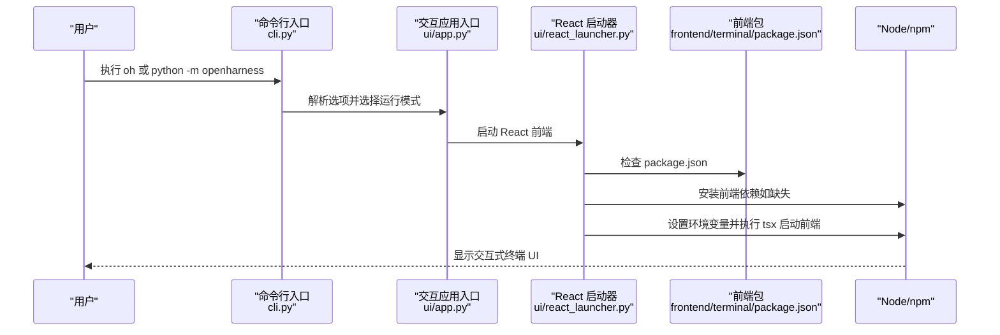
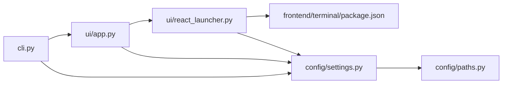

# 开发环境搭建

<cite>
**本文引用的文件**
- [README.md](file://README.md)
- [pyproject.toml](file://pyproject.toml)
- [src/openharness/cli.py](file://src/openharness/cli.py)
- [src/openharness/__main__.py](file://src/openharness/__main__.py)
- [src/openharness/config/settings.py](file://src/openharness/config/settings.py)
- [src/openharness/config/paths.py](file://src/openharness/config/paths.py)
- [src/openharness/ui/app.py](file://src/openharness/ui/app.py)
- [src/openharness/ui/react_launcher.py](file://src/openharness/ui/react_launcher.py)
- [frontend/terminal/package.json](file://frontend/terminal/package.json)
- [scripts/test_harness_features.py](file://scripts/test_harness_features.py)
- [tests/conftest.py](file://tests/conftest.py)
</cite>

## 目录
1. [简介](#简介)
2. [项目结构](#项目结构)
3. [核心组件](#核心组件)
4. [架构总览](#架构总览)
5. [详细组件分析](#详细组件分析)
6. [依赖关系分析](#依赖关系分析)
7. [性能考虑](#性能考虑)
8. [故障排查指南](#故障排查指南)
9. [结论](#结论)
10. [附录](#附录)

## 简介
本指南面向希望在本地搭建 OpenHarness 开发环境的开发者，覆盖系统要求与前置条件（Python 版本、操作系统、Node.js）、依赖管理工具（uv 与 pip 的使用方式）、完整安装流程（从克隆仓库到配置开发环境）、可选开发依赖（pytest、ruff、mypy 等）及其用途、IDE/编辑器推荐配置（VSCode、PyCharm），以及环境验证方法与常见问题解决方案。

## 项目结构
OpenHarness 采用 Python 包结构组织，核心应用入口位于命令行模块中，并通过脚本分发工具提供命令行入口。前端终端界面由独立的 React/Terminal 子项目提供，后端通过 uv 管理依赖与运行。

图表来源
- [src/openharness/cli.py:1-378](file://src/openharness/cli.py#L1-L378)
- [src/openharness/ui/app.py:1-149](file://src/openharness/ui/app.py#L1-L149)
- [src/openharness/ui/react_launcher.py:1-107](file://src/openharness/ui/react_launcher.py#L1-L107)
- [src/openharness/config/settings.py:1-161](file://src/openharness/config/settings.py#L1-L161)
- [src/openharness/config/paths.py:1-117](file://src/openharness/config/paths.py#L1-L117)
- [frontend/terminal/package.json:1-20](file://frontend/terminal/package.json#L1-L20)

章节来源
- [README.md:82-124](file://README.md#L82-L124)
- [pyproject.toml:1-58](file://pyproject.toml#L1-L58)

## 核心组件
- 命令行入口：提供主应用与子命令（mcp、plugin、auth），支持交互式会话与非交互模式输出。
- 交互应用入口：负责启动 React 终端 UI 或仅运行后端主机。
- 配置系统：定义 Settings 模型、权限与内存配置，支持多级优先级合并（CLI > 环境变量 > 配置文件 > 默认值）。
- 路径解析：遵循 XDG 类约定，定位配置、数据、日志、会话、任务等目录。
- 前端启动器：检测并安装前端依赖，构建后端命令，启动 React 终端 UI。

章节来源
- [src/openharness/cli.py:1-378](file://src/openharness/cli.py#L1-L378)
- [src/openharness/ui/app.py:1-149](file://src/openharness/ui/app.py#L1-L149)
- [src/openharness/config/settings.py:1-161](file://src/openharness/config/settings.py#L1-L161)
- [src/openharness/config/paths.py:1-117](file://src/openharness/config/paths.py#L1-L117)
- [src/openharness/ui/react_launcher.py:1-107](file://src/openharness/ui/react_launcher.py#L1-L107)

## 架构总览
下图展示从用户执行命令到启动 React 终端 UI 的调用序列，以及前端如何通过环境变量传递后端启动参数。

图表来源
- [src/openharness/cli.py:334-378](file://src/openharness/cli.py#L334-L378)
- [src/openharness/ui/app.py:15-48](file://src/openharness/ui/app.py#L15-L48)
- [src/openharness/ui/react_launcher.py:50-103](file://src/openharness/ui/react_launcher.py#L50-L103)
- [frontend/terminal/package.json:1-20](file://frontend/terminal/package.json#L1-L20)

## 详细组件分析

### 系统要求与前置条件
- Python 版本
  - 项目元数据要求 Python >= 3.10；但 README 中“快速开始”明确要求 Python 3.11+。
  - 建议使用 Python 3.11+ 以确保与工具链版本一致。
- 操作系统
  - 代码未声明特定平台限制，可在 Linux/macOS/Windows 上运行。
- Node.js
  - React 终端 UI 需要 Node.js 18+。
- LLM API 密钥
  - 需要兼容 Anthropic 接口的 API 密钥（例如 Kimi）。

章节来源
- [pyproject.toml:10-10](file://pyproject.toml#L10-L10)
- [README.md:84-89](file://README.md#L84-L89)

### 依赖管理工具与可选开发依赖
- 主要依赖
  - 通过 pyproject.toml 定义，包含 anthropic、rich、prompt-toolkit、textual、typer、pydantic、httpx、websockets、mcp、pyperclip、pyyaml、watchfiles 等。
- 可选开发依赖
  - pytest、pytest-asyncio、pytest-cov、ruff、mypy。
- 依赖管理工具
  - README 使用 uv 进行同步与开发依赖安装；pyproject.toml 也支持标准工具链（hatchling）。
  - 建议优先使用 uv 以获得更快的安装体验与一致的锁定行为。

章节来源
- [pyproject.toml:15-38](file://pyproject.toml#L15-L38)
- [README.md:86-96](file://README.md#L86-L96)

### 完整安装流程
以下为从零开始的开发环境搭建步骤，涵盖克隆仓库、安装依赖、配置环境变量与验证安装。

- 步骤 1：安装前置工具
  - 安装 Python 3.11+ 与 Node.js 18+。
  - 准备一个兼容 Anthropic 接口的 LLM API 密钥。
- 步骤 2：克隆仓库
  - 克隆仓库到本地目录。
- 步骤 3：安装依赖
  - 使用 uv 同步并安装开发依赖：
    - 示例命令：uv sync --extra dev
- 步骤 4：配置环境变量
  - 设置 LLM 相关环境变量（例如 ANTHROPIC_BASE_URL、ANTHROPIC_API_KEY、ANTHROPIC_MODEL）。
- 步骤 5：运行示例
  - 在激活的环境中或使用 uv run 运行 oh 启动交互式会话。
- 步骤 6：验证安装
  - 运行单元测试与端到端脚本进行验证。

章节来源
- [README.md:82-124](file://README.md#L82-L124)
- [pyproject.toml:47-49](file://pyproject.toml#L47-L49)

### 可选开发依赖与用途
- pytest
  - 用于运行单元测试与集成测试，测试路径在 tests 目录。
- pytest-asyncio
  - 支持异步测试函数。
- pytest-cov
  - 生成覆盖率报告（可选）。
- ruff
  - 代码风格检查与格式化，目标版本与行长度在工具配置中设定。
- mypy
  - 类型检查，严格模式与 Python 版本设定。

章节来源
- [pyproject.toml:30-38](file://pyproject.toml#L30-L38)
- [pyproject.toml:51-57](file://pyproject.toml#L51-L57)

### IDE 与编辑器推荐配置
- VSCode
  - 推荐启用 Python 扩展、TypeScript/React 扩展（用于前端开发）。
  - 在工作区设置中配置 Python 解释器为已安装的 Python 3.11+。
  - 使用 ruff 作为 Python 代码格式化与检查工具，mypy 作为类型检查工具。
  - 前端开发可使用 VSCode 的 Live Server 或内置终端运行前端脚本。
- PyCharm
  - 配置项目解释器为 Python 3.11+。
  - 启用内置的 pytest、ruff、mypy 工具，或通过外部工具集成。
  - 对于前端开发，可在 PyCharm 内部终端运行 npm 脚本。

章节来源
- [frontend/terminal/package.json:5-7](file://frontend/terminal/package.json#L5-L7)
- [pyproject.toml:51-57](file://pyproject.toml#L51-L57)

### 环境验证方法
- 运行单元测试
  - 使用 uv run pytest -q 验证所有单元与集成测试通过。
- 运行端到端脚本
  - 使用 scripts/test_harness_features.py 验证核心功能（重试、技能系统、并行工具、路径权限等）。
- 非交互模式验证
  - 使用 oh -p "<你的提示>" 验证输出格式与流式事件输出。
- 前端验证
  - 启动交互式会话，确认 React 终端 UI 正常加载并能与后端通信。

章节来源
- [README.md:282-298](file://README.md#L282-L298)
- [scripts/test_harness_features.py:206-236](file://scripts/test_harness_features.py#L206-L236)
- [src/openharness/ui/app.py:50-149](file://src/openharness/ui/app.py#L50-L149)

## 依赖关系分析
下图展示后端模块之间的依赖关系与调用链。

图表来源
- [src/openharness/cli.py:1-378](file://src/openharness/cli.py#L1-L378)
- [src/openharness/ui/app.py:1-149](file://src/openharness/ui/app.py#L1-L149)
- [src/openharness/ui/react_launcher.py:1-107](file://src/openharness/ui/react_launcher.py#L1-L107)
- [src/openharness/config/settings.py:1-161](file://src/openharness/config/settings.py#L1-L161)
- [src/openharness/config/paths.py:1-117](file://src/openharness/config/paths.py#L1-L117)
- [frontend/terminal/package.json:1-20](file://frontend/terminal/package.json#L1-L20)

章节来源
- [src/openharness/cli.py:1-378](file://src/openharness/cli.py#L1-L378)
- [src/openharness/ui/app.py:1-149](file://src/openharness/ui/app.py#L1-L149)
- [src/openharness/ui/react_launcher.py:1-107](file://src/openharness/ui/react_launcher.py#L1-L107)
- [src/openharness/config/settings.py:1-161](file://src/openharness/config/settings.py#L1-L161)
- [src/openharness/config/paths.py:1-117](file://src/openharness/config/paths.py#L1-L117)

## 性能考虑
- 使用 uv 进行依赖同步与安装，通常比传统 pip 更快且更稳定。
- 在非交互模式下，合理设置 --max-turns 以控制会话轮次，避免长时间运行。
- 前端依赖安装仅在首次运行时触发，后续可复用 node_modules。

## 故障排查指南
- Python 版本不匹配
  - 现象：安装失败或运行时报错。
  - 处理：确保使用 Python 3.11+，并在 IDE 中正确配置解释器。
- Node.js 缺失或版本过低
  - 现象：前端无法启动或报错找不到 npm。
  - 处理：安装 Node.js 18+，并确保 npm 可用。
- API 密钥未配置
  - 现象：运行时报错提示未找到 API 密钥。
  - 处理：设置 ANTHROPIC_API_KEY，或在配置文件中保存密钥。
- 前端依赖安装失败
  - 现象：React 终端 UI 启动时报错，提示缺少依赖。
  - 处理：手动在 frontend/terminal 目录执行 npm install，或检查网络代理设置。
- 测试失败
  - 现象：pytest 或端到端脚本报错。
  - 处理：根据错误信息检查依赖安装、环境变量与网络连接；必要时重新安装开发依赖。

章节来源
- [src/openharness/config/settings.py:76-91](file://src/openharness/config/settings.py#L76-L91)
- [src/openharness/ui/react_launcher.py:67-76](file://src/openharness/ui/react_launcher.py#L67-L76)
- [scripts/test_harness_features.py:26-31](file://scripts/test_harness_features.py#L26-L31)

## 结论
通过本指南，您可以在本地成功搭建 OpenHarness 开发环境。建议优先使用 Python 3.11+ 与 Node.js 18+，使用 uv 进行依赖管理，并安装可选开发工具以提升开发效率。完成安装后，使用 pytest 与端到端脚本进行验证，确保各模块正常运行。

## 附录
- 快速参考
  - 安装与运行：uv sync --extra dev；oh 或 uv run oh
  - 配置 API：设置 ANTHROPIC_BASE_URL、ANTHROPIC_API_KEY、ANTHROPIC_MODEL
  - 测试：uv run pytest -q；python scripts/test_harness_features.py